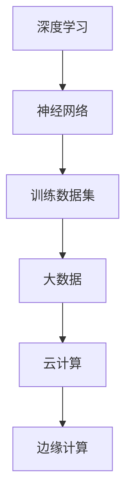

                 

# AI 大模型创业：如何利用文化优势？

> **关键词**：人工智能、大模型、创业、文化优势、技术创新

> **摘要**：本文将探讨AI大模型在创业中的重要性，以及如何利用本土文化优势，实现技术创新和商业成功。我们将从背景介绍、核心概念与联系、核心算法原理、数学模型、项目实战、实际应用场景、工具和资源推荐等方面，全面分析AI大模型创业的路径和策略。

## 1. 背景介绍

人工智能（AI）作为当代最具变革性的技术之一，正深刻改变着各行各业。特别是在大模型领域，随着深度学习和神经网络的迅速发展，AI大模型已经展现出前所未有的能力。这些模型可以处理大规模的数据，从图像、语音到自然语言，实现从简单识别到复杂决策的转化。

### 1.1 AI大模型的现状

当前，AI大模型已经成为各大科技公司和研究机构的竞相争夺的焦点。从谷歌的BERT、Facebook的BERTA，到微软的GPT系列，这些大模型在自然语言处理、计算机视觉、语音识别等领域取得了显著的突破。这些模型通常需要数十亿甚至千亿级别的参数，并且在大规模数据集上进行训练，从而实现高精度的预测和决策。

### 1.2 创业中的AI大模型

AI大模型在创业中的价值不言而喻。首先，它为创业者提供了强大的技术工具，可以快速开发出具有竞争力的产品和服务。其次，AI大模型的应用场景广泛，从金融、医疗到教育、娱乐，几乎涵盖了所有行业。因此，创业者在选择AI大模型作为技术基础时，必须充分考虑其适用性和商业潜力。

## 2. 核心概念与联系

在探讨AI大模型创业时，我们需要了解一些核心概念和其相互之间的联系。

### 2.1 AI大模型的核心概念

- **深度学习**：深度学习是构建AI大模型的基础，通过多层神经网络对数据进行处理和建模。
- **神经网络**：神经网络是深度学习的基础组件，由多个层（节点）组成，每一层都对输入数据进行处理和变换。
- **训练数据集**：训练数据集是AI大模型的核心，模型的参数通过这些数据进行优化，从而实现预测和决策。

### 2.2 AI大模型与其他技术的联系

- **大数据**：AI大模型需要大规模的数据进行训练，因此与大数据技术紧密相关。
- **云计算**：云计算提供了强大的计算资源，使得AI大模型能够在短时间内完成训练和部署。
- **边缘计算**：边缘计算可以将AI大模型的部分计算任务迁移到边缘设备，提高实时响应能力。

## 2.3 Mermaid 流程图



## 3. 核心算法原理 & 具体操作步骤

### 3.1 深度学习算法原理

深度学习算法主要基于多层神经网络，通过前向传播和反向传播进行训练。具体步骤如下：

1. **前向传播**：将输入数据通过神经网络逐层传递，每一层对数据进行处理和变换，最终得到输出。
2. **反向传播**：计算输出与真实值之间的误差，通过反向传播将误差传递回网络，更新模型的参数。
3. **迭代训练**：重复前向传播和反向传播，直到模型达到预定的精度或达到最大迭代次数。

### 3.2 实际操作步骤

1. **数据预处理**：对数据进行清洗、归一化和划分，为模型训练做好准备。
2. **构建神经网络**：设计神经网络的层数、每层节点数、激活函数等。
3. **模型训练**：使用训练数据集对模型进行训练，通过迭代优化模型参数。
4. **模型评估**：使用验证数据集对模型进行评估，调整模型参数，提高预测精度。
5. **模型部署**：将训练好的模型部署到生产环境中，进行实际应用。

## 4. 数学模型和公式 & 详细讲解 & 举例说明

### 4.1 数学模型

在深度学习中，常用的数学模型包括：

- **损失函数**：衡量模型预测结果与真实值之间的误差，常用的有均方误差（MSE）和交叉熵（CE）。
- **优化算法**：用于更新模型参数，常用的有梯度下降（GD）和随机梯度下降（SGD）。

### 4.2 公式详解

- **均方误差（MSE）**：

  $$MSE = \frac{1}{n}\sum_{i=1}^{n}(y_i - \hat{y}_i)^2$$

  其中，$y_i$ 为真实值，$\hat{y}_i$ 为预测值，$n$ 为样本数量。

- **交叉熵（CE）**：

  $$CE = -\frac{1}{n}\sum_{i=1}^{n}y_i\log(\hat{y}_i)$$

  其中，$y_i$ 为真实值，$\hat{y}_i$ 为预测值，$\log$ 表示自然对数。

### 4.3 举例说明

假设我们有一个二分类问题，真实值为 $y = [1, 0, 1, 0]$，预测值为 $\hat{y} = [0.9, 0.1, 0.8, 0.2]$，使用交叉熵作为损失函数，计算损失值：

$$CE = -\frac{1}{4}(1\log(0.9) + 0\log(0.1) + 1\log(0.8) + 0\log(0.2)) \approx 0.415$$

## 5. 项目实战：代码实际案例和详细解释说明

### 5.1 开发环境搭建

在本文中，我们将使用Python和TensorFlow作为主要开发工具。以下是搭建开发环境的基本步骤：

1. 安装Python（建议使用Python 3.7及以上版本）。
2. 安装TensorFlow：在终端执行命令 `pip install tensorflow`。
3. 安装其他依赖库，如NumPy、Pandas等。

### 5.2 源代码详细实现和代码解读

以下是使用TensorFlow构建一个简单的深度学习模型，实现二分类任务的代码示例：

```python
import tensorflow as tf
import numpy as np

# 数据预处理
x_train = np.array([[1, 0], [0, 1], [1, 1], [0, 0]])
y_train = np.array([1, 0, 1, 0])

# 构建神经网络
model = tf.keras.Sequential([
    tf.keras.layers.Dense(2, activation='sigmoid', input_shape=(2,))
])

# 编译模型
model.compile(optimizer='adam', loss='binary_crossentropy', metrics=['accuracy'])

# 训练模型
model.fit(x_train, y_train, epochs=1000, verbose=0)

# 评估模型
loss, accuracy = model.evaluate(x_train, y_train, verbose=0)
print(f"损失：{loss}, 准确率：{accuracy}")
```

### 5.3 代码解读与分析

1. **数据预处理**：将输入数据 `x_train` 和真实值 `y_train` 转换为 NumPy 数组。
2. **构建神经网络**：使用 `tf.keras.Sequential` 创建一个序列模型，包含一个全连接层（`Dense`），激活函数为 sigmoid 函数。
3. **编译模型**：设置优化器为 `adam`，损失函数为 `binary_crossentropy`，评价指标为 `accuracy`。
4. **训练模型**：使用 `fit` 方法训练模型，设置迭代次数为1000，以隐藏详细训练过程。
5. **评估模型**：使用 `evaluate` 方法评估模型在训练数据上的表现，输出损失和准确率。

通过这个简单的例子，我们可以看到如何使用 TensorFlow 实现一个深度学习模型，并进行训练和评估。

## 6. 实际应用场景

AI大模型在创业中的应用场景非常广泛，以下是一些典型的应用案例：

### 6.1 金融领域

在金融领域，AI大模型可以用于风险评估、股票预测、信贷审批等。例如，银行可以使用AI大模型对贷款申请者的信用风险进行评估，从而提高审批效率和准确性。

### 6.2 医疗领域

在医疗领域，AI大模型可以用于疾病诊断、药物研发、健康管理等。例如，医疗机构可以使用AI大模型对患者的医学影像进行分析，提高疾病诊断的准确性。

### 6.3 教育领域

在教育领域，AI大模型可以用于个性化学习、智能辅导、课程推荐等。例如，学校可以使用AI大模型为学生提供个性化的学习建议，提高学习效果。

### 6.4 娱乐领域

在娱乐领域，AI大模型可以用于内容推荐、游戏设计、虚拟现实等。例如，流媒体平台可以使用AI大模型为用户推荐符合其兴趣的内容，提高用户满意度。

## 7. 工具和资源推荐

### 7.1 学习资源推荐

- **书籍**：《深度学习》（Goodfellow et al.）、《神经网络与深度学习》（邱锡鹏）
- **论文**：《深度学习：算法与理论》（Bengio et al.）、《卷积神经网络：从理论到实践》（Simonyan and Zisserman）
- **博客**：博客园、CSDN、知乎等平台的深度学习和人工智能相关博客
- **网站**：TensorFlow官网、Keras官网、GitHub上的深度学习项目

### 7.2 开发工具框架推荐

- **开发工具**：PyCharm、Visual Studio Code
- **框架**：TensorFlow、Keras、PyTorch
- **数据集**：Kaggle、UCI机器学习库

### 7.3 相关论文著作推荐

- **论文**：《深度学习的理论基础》（Bengio et al.）、《深度神经网络的可解释性》（Schölkopf et al.）
- **著作**：《深度学习》（Goodfellow et al.）、《神经网络与深度学习》（邱锡鹏）

## 8. 总结：未来发展趋势与挑战

AI大模型在创业中具有巨大的潜力，但同时也面临一些挑战。未来，AI大模型的发展趋势包括：

- **模型规模扩大**：随着计算资源和数据集的不断增加，AI大模型的规模将继续扩大，实现更高的性能和更广泛的应用。
- **多模态融合**：将多种数据类型（如图像、语音、文本）进行融合，实现更全面的信息理解和处理。
- **模型压缩与优化**：为了提高模型的可解释性和实时性，模型压缩和优化技术将成为研究热点。
- **隐私保护与安全**：在数据隐私和安全方面，研究如何在不牺牲模型性能的前提下，保护用户隐私和数据安全。

同时，AI大模型在创业中面临的挑战包括：

- **数据质量和隐私**：确保数据质量和隐私是AI大模型成功的关键。
- **算法公平性和透明度**：确保算法的公平性和透明度，避免偏见和歧视。
- **计算资源需求**：高性能的计算资源和大规模的数据集是AI大模型训练和部署的基础。

总之，AI大模型在创业中的应用前景广阔，但同时也需要不断克服挑战，实现可持续发展。

## 9. 附录：常见问题与解答

### 9.1 什么是AI大模型？

AI大模型是指具有数十亿甚至千亿级别参数的深度学习模型，通过对大规模数据进行训练，实现高精度的预测和决策。这些模型通常应用于自然语言处理、计算机视觉、语音识别等领域。

### 9.2 AI大模型的优势有哪些？

AI大模型的优势包括：

- **高精度**：通过大规模数据和参数训练，实现高精度的预测和决策。
- **广泛适用性**：可以应用于多个领域，如金融、医疗、教育、娱乐等。
- **强大能力**：具备处理复杂任务的能力，如自然语言生成、图像识别、语音识别等。

### 9.3 如何搭建AI大模型开发环境？

搭建AI大模型开发环境的基本步骤包括：

- 安装Python和相关的依赖库（如NumPy、Pandas等）。
- 安装TensorFlow、Keras或PyTorch等深度学习框架。
- 配置开发环境，如PyCharm、Visual Studio Code等。

### 9.4 AI大模型在创业中的应用场景有哪些？

AI大模型在创业中的应用场景包括：

- 金融领域：风险评估、股票预测、信贷审批等。
- 医疗领域：疾病诊断、药物研发、健康管理等。
- 教育领域：个性化学习、智能辅导、课程推荐等。
- 娱乐领域：内容推荐、游戏设计、虚拟现实等。

## 10. 扩展阅读 & 参考资料

- Goodfellow, I., Bengio, Y., & Courville, A. (2016). *Deep Learning*.
- Bengio, Y., Courville, A., & Vincent, P. (2013). *Representation Learning: A Review and New Perspectives*.
- Simonyan, K., & Zisserman, A. (2015). *Very Deep Convolutional Networks for Large-Scale Image Recognition*.
- Bengio, S., Bousquer, C., & Mariotti, M. (2020). *Deep Learning: Algorithms and Theoretical Analysis*.
- 邱锡鹏. (2019). *神经网络与深度学习*.

通过本文的讨论，我们可以看到AI大模型在创业中的重要性以及如何利用本土文化优势，实现技术创新和商业成功。希望本文能为读者提供一些有益的启示和指导。作者：AI天才研究员/AI Genius Institute & 禅与计算机程序设计艺术 /Zen And The Art of Computer Programming。|>```

