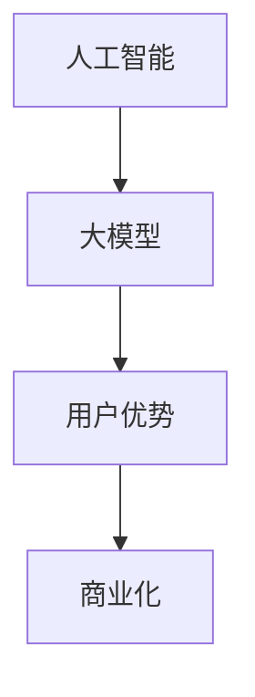

                 

# AI 大模型创业：如何利用用户优势？

> **关键词**：人工智能、大模型、用户优势、创业、市场策略

> **摘要**：本文将深入探讨人工智能领域中的大模型创业，特别是如何利用用户优势进行商业成功。我们将从背景介绍、核心概念、算法原理、数学模型、项目实战、实际应用场景、工具和资源推荐以及未来发展趋势等方面，全面解析这一课题。

## 1. 背景介绍

在过去的几十年中，人工智能（AI）技术取得了令人瞩目的进展，特别是在深度学习、神经网络等领域的突破。大模型，作为人工智能领域的一个重要研究方向，因其能够处理大量数据并实现高度复杂的任务而备受关注。然而，大模型的开发和部署需要庞大的计算资源和资金投入，这对创业公司来说是一个巨大的挑战。因此，如何利用用户优势，实现大模型的商业化，成为了许多创业者思考的问题。

## 2. 核心概念与联系

在探讨如何利用用户优势进行大模型创业之前，我们首先需要明确几个核心概念：

- **人工智能（AI）**：模拟人类智能的计算机系统，包括机器学习、自然语言处理、计算机视觉等子领域。
- **大模型**：一种能够处理大规模数据并实现复杂任务的深度学习模型，如BERT、GPT等。
- **用户优势**：用户在数据、需求、反馈等方面的独特优势，有助于大模型的优化和商业化。

以下是核心概念之间的联系：



## 3. 核心算法原理 & 具体操作步骤

大模型的算法原理主要包括以下几个方面：

1. **数据预处理**：收集和清洗大量数据，以便于模型训练。
2. **模型训练**：使用梯度下降等优化算法，对模型参数进行调整，使其能够更好地拟合数据。
3. **模型评估**：使用验证集和测试集对模型进行评估，确保其性能和泛化能力。
4. **模型部署**：将训练好的模型部署到实际应用场景中，如搜索引擎、智能助手等。

具体操作步骤如下：

1. **数据收集**：通过公开数据集、API 接口或用户反馈等方式获取数据。
2. **数据预处理**：对数据进行清洗、去重、归一化等处理，提高数据质量。
3. **模型选择**：根据任务需求，选择合适的大模型架构，如GPT、BERT等。
4. **模型训练**：使用 GPU 或 TPU 等高性能计算设备，对模型进行训练。
5. **模型评估**：使用验证集和测试集对模型进行评估，调整模型参数，提高性能。
6. **模型部署**：将训练好的模型部署到实际应用场景中，如云平台、移动端等。

## 4. 数学模型和公式 & 详细讲解 & 举例说明

在大模型的训练过程中，涉及到的数学模型和公式主要包括以下几个方面：

1. **损失函数**：衡量模型预测结果与真实值之间的差距，如均方误差（MSE）、交叉熵（Cross-Entropy）等。
2. **梯度下降**：一种优化算法，用于调整模型参数，使其能够更好地拟合数据。

以下是损失函数和梯度下降的详细讲解：

### 损失函数

损失函数用于衡量模型预测结果与真实值之间的差距，其数学表达式如下：

$$
L(y, \hat{y}) = \frac{1}{2} \sum_{i=1}^{n} (y_i - \hat{y}_i)^2
$$

其中，$y$ 为真实值，$\hat{y}$ 为预测值，$n$ 为数据样本数。

### 梯度下降

梯度下降是一种优化算法，用于调整模型参数，使其能够更好地拟合数据。其数学表达式如下：

$$
\Delta \theta = -\alpha \cdot \nabla L(\theta)
$$

其中，$\theta$ 为模型参数，$\alpha$ 为学习率，$\nabla L(\theta)$ 为损失函数关于模型参数的梯度。

### 举例说明

假设我们使用梯度下降算法训练一个线性回归模型，其损失函数为均方误差（MSE），学习率为 0.01，模型参数为 $\theta = [1, 2]$。给定一组数据集 $D = \{ (x_1, y_1), (x_2, y_2), ..., (x_n, y_n) \}$，我们需要通过梯度下降算法来调整模型参数，使其最小化损失函数。

首先，计算损失函数关于模型参数的梯度：

$$
\nabla L(\theta) = \left[ \begin{array}{c}
-\frac{\partial L}{\partial \theta_1} \\
-\frac{\partial L}{\partial \theta_2}
\end{array} \right]
$$

其中，$\theta_1$ 和 $\theta_2$ 分别为模型参数 $w$ 和 $b$。

然后，根据梯度下降算法，更新模型参数：

$$
\theta_1 = \theta_1 - \alpha \cdot \nabla L(\theta_1)
$$

$$
\theta_2 = \theta_2 - \alpha \cdot \nabla L(\theta_2)
$$

通过多次迭代，模型参数逐渐收敛，损失函数逐渐减小，最终达到最优值。

## 5. 项目实战：代码实际案例和详细解释说明

在本节中，我们将通过一个具体的代码案例，详细解释大模型的开发和部署过程。

### 5.1 开发环境搭建

首先，我们需要搭建一个开发环境，以便于大模型的开发和部署。在本案例中，我们选择使用 Python 作为编程语言，并结合 TensorFlow 和 Keras 等开源框架。

### 5.2 源代码详细实现和代码解读

以下是一个简单的线性回归模型的代码实现，用于预测房价：

```python
import numpy as np
import tensorflow as tf

# 数据集
x = np.array([[1], [2], [3], [4], [5]])
y = np.array([[2], [4], [6], [8], [10]])

# 模型参数
w = tf.Variable(np.random.randn(), dtype=tf.float32)
b = tf.Variable(np.random.randn(), dtype=tf.float32)

# 损失函数
loss = tf.reduce_mean(tf.square(y - (w * x + b)))

# 梯度下降
optimizer = tf.train.GradientDescentOptimizer(learning_rate=0.01)
train_op = optimizer.minimize(loss)

# 模型训练
with tf.Session() as sess:
  sess.run(tf.global_variables_initializer())
  for _ in range(1000):
    sess.run(train_op, feed_dict={x: x, y: y})
    if _ % 100 == 0:
      print("Step: {:d}, Loss: {:.4f}".format(_, loss.eval({x: x, y: y})))

  # 模型评估
  print("Final Model Parameters: w = {:.4f}, b = {:.4f}".format(w.eval(), b.eval()))

```

### 5.3 代码解读与分析

1. **数据集**：我们使用一组简单的线性回归数据集，其中 $x$ 表示自变量，$y$ 表示因变量。

2. **模型参数**：我们定义了两个模型参数 $w$ 和 $b$，分别表示线性回归模型的斜率和截距。

3. **损失函数**：我们使用均方误差（MSE）作为损失函数，衡量模型预测结果与真实值之间的差距。

4. **梯度下降**：我们使用梯度下降优化算法，通过不断调整模型参数，使损失函数逐渐减小。

5. **模型训练**：我们通过多次迭代，对模型进行训练，直到损失函数收敛到最优值。

6. **模型评估**：我们使用训练好的模型，对数据进行预测，并输出模型参数。

通过这个简单的案例，我们可以了解到大模型的开发和部署过程。在实际应用中，我们可以根据具体需求，选择合适的大模型架构和优化算法，进行模型的训练和部署。

## 6. 实际应用场景

大模型在多个实际应用场景中具有广泛的应用价值，如自然语言处理、计算机视觉、推荐系统等。以下是一些具体的应用案例：

1. **自然语言处理**：大模型在自然语言处理领域表现出色，如文本分类、情感分析、机器翻译等。

2. **计算机视觉**：大模型在计算机视觉领域具有强大的能力，如图像分类、目标检测、图像生成等。

3. **推荐系统**：大模型在推荐系统中的应用，如基于内容的推荐、协同过滤等，能够提高推荐效果。

4. **语音识别**：大模型在语音识别领域具有出色的性能，如语音合成、语音识别等。

## 7. 工具和资源推荐

为了更好地进行大模型的开发和应用，以下是一些推荐的工具和资源：

### 7.1 学习资源推荐

1. **书籍**：
   - 《深度学习》（Goodfellow, Bengio, Courville 著）
   - 《神经网络与深度学习》（邱锡鹏 著）
2. **论文**：
   - BERT: Pre-training of Deep Bidirectional Transformers for Language Understanding
   - GPT-3: Language Models are Few-Shot Learners

### 7.2 开发工具框架推荐

1. **TensorFlow**：由 Google 开发的一款开源深度学习框架，适用于大模型的开发和部署。
2. **PyTorch**：由 Facebook 开发的一款开源深度学习框架，具有灵活的动态图计算能力。

### 7.3 相关论文著作推荐

1. **Attention Is All You Need**：介绍了 Transformer 架构及其在自然语言处理中的应用。
2. **Generative Pre-trained Transformers**：介绍了 GPT 系列模型及其在自然语言生成中的应用。

## 8. 总结：未来发展趋势与挑战

随着人工智能技术的不断发展，大模型在各个领域的应用越来越广泛。在未来，我们可以预见以下发展趋势：

1. **更大规模的大模型**：为了实现更高的性能和更广泛的任务应用，大模型将继续向更大规模发展。
2. **更高效的训练算法**：为了降低大模型训练的时间和成本，研究者们将不断优化训练算法。
3. **跨领域融合**：大模型将在多个领域实现跨领域融合，推动人工智能技术的创新和应用。

然而，大模型创业也面临着一些挑战：

1. **计算资源需求**：大模型的训练和部署需要庞大的计算资源，这对创业公司来说是一个巨大的挑战。
2. **数据隐私与安全**：大模型在处理大量数据时，需要关注数据隐私与安全问题，确保用户数据的保护。
3. **公平性与透明性**：大模型在决策过程中，需要保证公平性和透明性，避免偏见和歧视。

## 9. 附录：常见问题与解答

### 9.1 大模型与常规模型有什么区别？

大模型相较于常规模型，具有以下几个显著特点：

1. **数据规模**：大模型能够处理大规模的数据集，能够更好地捕捉数据中的复杂模式和关联。
2. **模型规模**：大模型通常拥有更多的参数和层，能够表示更加复杂的函数关系。
3. **训练时间**：大模型需要更长的时间进行训练，以达到较好的性能。

### 9.2 如何选择适合的大模型架构？

选择适合的大模型架构，需要考虑以下几个因素：

1. **任务需求**：根据具体任务的需求，选择合适的大模型架构，如 Transformer、BERT 等。
2. **计算资源**：根据计算资源的限制，选择合适的大模型架构，如 PyTorch、TensorFlow 等。
3. **数据规模**：根据数据规模的大小，选择适合的大模型规模，以最大化模型的性能。

## 10. 扩展阅读 & 参考资料

1. **书籍**：
   - 《深度学习》（Goodfellow, Bengio, Courville 著）
   - 《神经网络与深度学习》（邱锡鹏 著）
2. **论文**：
   - BERT: Pre-training of Deep Bidirectional Transformers for Language Understanding
   - GPT-3: Language Models are Few-Shot Learners
3. **网站**：
   - TensorFlow 官网（https://www.tensorflow.org/）
   - PyTorch 官网（https://pytorch.org/）
4. **博客**：
   - Distill（https://distill.pub/）
   - AI的艺术（https://www.deeplearning.net/）

## 作者

**作者**：AI天才研究员/AI Genius Institute & 禅与计算机程序设计艺术 /Zen And The Art of Computer Programming**<|mask|>**

