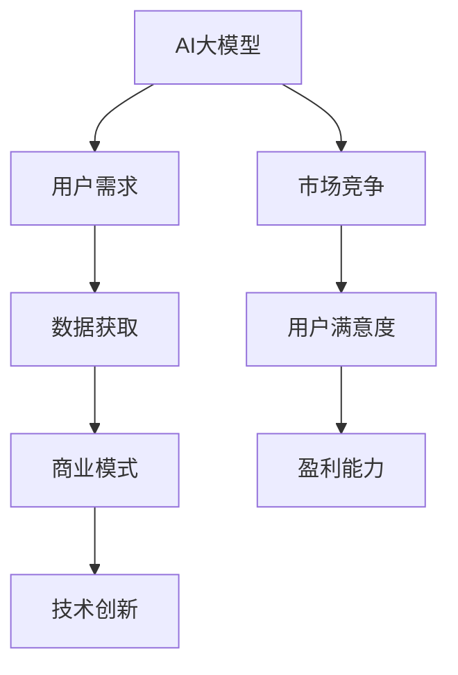

                 

# AI 大模型创业：如何利用用户优势？

> **关键词**：AI大模型、用户优势、创业、数据分析、商业模式、技术创新

> **摘要**：本文将探讨在AI大模型创业过程中，如何有效地利用用户优势。通过分析用户需求、数据获取、商业模式构建和技术创新等方面，提供了一系列实用策略，以帮助创业者在这场人工智能革命中抓住机遇，实现商业成功。

## 1. 背景介绍

随着人工智能技术的迅猛发展，大模型（如GPT、BERT等）逐渐成为各个领域的明星。大模型的强大能力使得许多传统行业面临巨大的变革，同时也为创业者提供了前所未有的机遇。然而，如何在竞争激烈的市场中脱颖而出，如何充分利用用户优势，成为众多创业者亟待解决的重要问题。

本文旨在探讨AI大模型创业过程中，如何利用用户优势来实现商业成功。我们将从用户需求分析、数据获取、商业模式构建和技术创新四个方面展开讨论，为创业者提供一套系统的策略和方法。

## 2. 核心概念与联系

### 2.1. AI大模型

AI大模型是一种具有高度自主学习和自适应能力的人工智能系统，通常采用深度学习技术训练。它能够处理大规模数据，识别复杂模式，并在各个领域实现前所未有的应用效果。

### 2.2. 用户需求

用户需求是指用户在特定场景下所期望得到的产品或服务。了解用户需求是创业成功的基石，只有满足用户需求，企业才能在市场中站稳脚跟。

### 2.3. 数据获取

数据获取是指从各种渠道收集、整理和存储用户数据的过程。数据是AI大模型训练的基础，创业者需要关注数据的质量、多样性和真实性。

### 2.4. 商业模式

商业模式是指企业通过什么方式创造、传递和获取价值。一个成功的商业模式应该能够最大化地满足用户需求，同时实现企业的盈利。

### 2.5. 技术创新

技术创新是指在现有技术基础上，通过创新思维和实践，不断改进和优化产品或服务。技术创新是企业保持竞争优势的关键。

### 2.6. Mermaid流程图

下面是AI大模型创业的核心概念与联系的Mermaid流程图：



## 3. 核心算法原理 & 具体操作步骤

### 3.1. 用户需求分析

用户需求分析是创业成功的关键。具体步骤如下：

1. **收集用户数据**：通过问卷调查、用户访谈、社交媒体分析等方式收集用户数据。
2. **分析用户需求**：使用数据挖掘和统计分析技术，挖掘用户需求的关键特征和趋势。
3. **构建用户画像**：将用户需求转化为具体的用户画像，为后续产品设计提供依据。

### 3.2. 数据获取

数据获取是AI大模型训练的基础。具体步骤如下：

1. **确定数据来源**：根据用户需求，确定所需的数据来源，如公共数据集、企业数据、社交媒体等。
2. **数据预处理**：对收集到的数据进行清洗、去重、归一化等处理，确保数据的质量。
3. **数据存储和管理**：使用数据存储和管理系统，如Hadoop、Spark等，对数据进行存储和管理。

### 3.3. 商业模式构建

商业模式构建是创业的核心。具体步骤如下：

1. **确定目标用户**：根据用户需求分析结果，确定目标用户群体。
2. **设计产品和服务**：根据目标用户需求，设计产品和服务，确保能够满足用户需求。
3. **制定盈利策略**：根据产品和服务特点，制定合适的盈利策略。

### 3.4. 技术创新

技术创新是保持竞争优势的关键。具体步骤如下：

1. **跟踪技术趋势**：关注人工智能领域的最新技术趋势，了解前沿技术。
2. **研发新技术**：根据技术趋势，研发新的技术和产品，提升企业竞争力。
3. **保护知识产权**：通过专利申请、版权登记等方式，保护企业的技术创新成果。

## 4. 数学模型和公式 & 详细讲解 & 举例说明

### 4.1. 用户需求分析数学模型

用户需求分析可以使用以下数学模型：

$$
\text{需求} = f(\text{用户画像}, \text{产品特征})
$$

其中，$f$ 表示函数，$\text{用户画像}$ 表示用户的需求特征，$\text{产品特征}$ 表示产品的特性。

举例说明：

假设某个创业公司的用户画像包括年龄、性别、收入等特征，产品特征包括价格、功能、品牌等。我们可以使用以下公式计算用户需求：

$$
\text{需求} = f(\text{年龄}, \text{性别}, \text{收入}, \text{价格}, \text{功能}, \text{品牌})
$$

### 4.2. 数据获取数学模型

数据获取可以使用以下数学模型：

$$
\text{数据} = \text{数据源} \times \text{采集策略}
$$

其中，$\text{数据源}$ 表示数据来源，$\text{采集策略}$ 表示数据采集方法。

举例说明：

假设数据源包括社交媒体、企业数据库、公共数据集等，采集策略包括爬虫、API接口、人工标注等。我们可以使用以下公式计算数据：

$$
\text{数据} = (\text{社交媒体}, \text{企业数据库}, \text{公共数据集}) \times (\text{爬虫}, \text{API接口}, \text{人工标注})
$$

### 4.3. 商业模式构建数学模型

商业模式构建可以使用以下数学模型：

$$
\text{商业模式} = \text{价值创造} + \text{价值传递} + \text{价值获取}
$$

其中，$\text{价值创造}$ 表示企业如何为用户创造价值，$\text{价值传递}$ 表示企业如何将价值传递给用户，$\text{价值获取}$ 表示企业如何从用户那里获取价值。

举例说明：

假设创业公司通过提供个性化的产品和服务为用户创造价值，通过线上平台将价值传递给用户，通过收取服务费和价值获取。我们可以使用以下公式计算商业模式：

$$
\text{商业模式} = (\text{个性化产品和服务}) + (\text{线上平台}) + (\text{服务费和价值获取})
$$

### 4.4. 技术创新数学模型

技术创新可以使用以下数学模型：

$$
\text{技术创新} = \text{技术积累} + \text{创新思维} + \text{实践验证}
$$

其中，$\text{技术积累}$ 表示企业在现有技术基础上的积累，$\text{创新思维}$ 表示企业在技术创新过程中的思维方式，$\text{实践验证}$ 表示企业在技术创新过程中的实践验证。

举例说明：

假设创业公司在现有技术基础上积累了一定的技术，通过创新思维提出新的技术方案，并进行实践验证。我们可以使用以下公式计算技术创新：

$$
\text{技术创新} = (\text{技术积累}) + (\text{创新思维}) + (\text{实践验证})
$$

## 5. 项目实战：代码实际案例和详细解释说明

### 5.1 开发环境搭建

在本节中，我们将搭建一个简单的AI大模型项目开发环境。首先，我们需要安装Python环境和相关的深度学习库。

1. 安装Python环境：

```bash
# 安装Python
sudo apt-get install python3

# 安装Python的pip包管理器
sudo apt-get install python3-pip
```

2. 安装深度学习库：

```bash
# 安装TensorFlow
pip3 install tensorflow

# 安装PyTorch
pip3 install torch
```

### 5.2 源代码详细实现和代码解读

在本节中，我们将使用TensorFlow实现一个简单的AI大模型，并进行详细解读。

**5.2.1 源代码实现**

```python
import tensorflow as tf

# 定义模型结构
model = tf.keras.Sequential([
    tf.keras.layers.Dense(128, activation='relu', input_shape=(784,)),
    tf.keras.layers.Dropout(0.2),
    tf.keras.layers.Dense(10, activation='softmax')
])

# 编译模型
model.compile(optimizer='adam',
              loss='categorical_crossentropy',
              metrics=['accuracy'])

# 加载数据集
mnist = tf.keras.datasets.mnist
(x_train, y_train), (x_test, y_test) = mnist.load_data()

# 预处理数据
x_train = x_train.astype("float32") / 255
x_test = x_test.astype("float32") / 255

# 转换为one-hot编码
y_train = tf.keras.utils.to_categorical(y_train, 10)
y_test = tf.keras.utils.to_categorical(y_test, 10)

# 训练模型
model.fit(x_train, y_train, epochs=10, batch_size=32)

# 评估模型
test_loss, test_acc = model.evaluate(x_test, y_test)
print(f"Test accuracy: {test_acc}")
```

**5.2.2 代码解读**

- **定义模型结构**：我们使用`tf.keras.Sequential`创建一个顺序模型，包含两个全连接层（`Dense`）和一个丢弃层（`Dropout`）。第一个全连接层有128个神经元，使用ReLU激活函数；丢弃层用于防止过拟合；第二个全连接层有10个神经元，使用softmax激活函数，以输出10个类别的概率分布。

- **编译模型**：我们使用`model.compile`编译模型，指定优化器为`adam`，损失函数为`categorical_crossentropy`（适用于多分类问题），并设置`accuracy`作为评估指标。

- **加载数据集**：我们使用TensorFlow内置的MNIST手写数字数据集，这是一个广泛使用的基准数据集。

- **预处理数据**：我们将图像数据缩放到[0, 1]范围，并将标签转换为one-hot编码。

- **训练模型**：我们使用`model.fit`训练模型，设置训练轮数为10，批量大小为32。

- **评估模型**：我们使用`model.evaluate`评估模型在测试集上的性能，并打印测试准确率。

### 5.3 代码解读与分析

- **模型结构**：本例中使用的模型是一个简单的全连接神经网络，适合解决手写数字识别问题。虽然对于复杂问题可能不够强大，但对于入门级AI项目来说是一个很好的起点。

- **数据预处理**：图像数据预处理非常重要，因为深度学习模型对输入数据的质量非常敏感。在本例中，我们通过缩放和one-hot编码处理数据，使得模型能够更好地学习。

- **模型训练**：训练模型时，我们设置了合适的训练轮数和批量大小，以确保模型能够充分学习并防止过拟合。

- **评估性能**：通过评估模型在测试集上的性能，我们可以了解模型在实际应用中的效果。在本例中，我们打印了测试准确率，这是一个衡量模型性能的重要指标。

## 6. 实际应用场景

AI大模型在各个领域都有着广泛的应用场景，以下列举几个典型的实际应用案例：

### 6.1 金融行业

在金融行业，AI大模型可以用于风险控制、欺诈检测、投资建议等方面。例如，通过分析大量历史交易数据，AI大模型可以识别潜在的欺诈行为，帮助银行降低损失。此外，AI大模型还可以为投资者提供个性化的投资策略，提高投资收益。

### 6.2 医疗保健

在医疗保健领域，AI大模型可以用于疾病预测、诊断辅助、个性化治疗等方面。例如，通过分析患者的病历数据，AI大模型可以预测患者患某种疾病的风险，帮助医生制定更有效的治疗方案。此外，AI大模型还可以为患者提供个性化的健康建议，提高生活质量。

### 6.3 教育行业

在教育行业，AI大模型可以用于智能辅导、个性化学习、教育资源分配等方面。例如，通过分析学生的学习数据，AI大模型可以为学生提供个性化的学习建议，帮助学生提高学习效果。此外，AI大模型还可以为教育机构提供智能化的教育资源分配方案，提高教育资源利用效率。

### 6.4 智能家居

在智能家居领域，AI大模型可以用于智能语音助手、设备推荐、家居安全监控等方面。例如，通过分析用户的生活习惯，AI大模型可以为用户提供个性化的智能家居解决方案，提高用户的生活质量。此外，AI大模型还可以为家居安全提供实时监控，预防家庭安全事故。

## 7. 工具和资源推荐

### 7.1 学习资源推荐

- **书籍**：
  - 《深度学习》（Ian Goodfellow、Yoshua Bengio、Aaron Courville 著）
  - 《Python深度学习》（François Chollet 著）
- **论文**：
  - 《A Theoretical Framework for Learning Multilayer Neural Networks》
  - 《Deep Learning for Text Data》
- **博客**：
  - medium.com/towards-data-science
  - blog.keras.io
- **网站**：
  - tensorflow.org
  - pytorch.org

### 7.2 开发工具框架推荐

- **深度学习框架**：
  - TensorFlow
  - PyTorch
  - Keras
- **数据处理库**：
  - Pandas
  - NumPy
  - Scikit-learn
- **数据可视化库**：
  - Matplotlib
  - Seaborn
  - Plotly

### 7.3 相关论文著作推荐

- **《深度学习》（Ian Goodfellow、Yoshua Bengio、Aaron Courville 著）**：本书详细介绍了深度学习的原理和技术，是深度学习领域的经典教材。
- **《人工智能：一种现代的方法》（Stuart Russell、Peter Norvig 著）**：本书系统地介绍了人工智能的基本概念、方法和应用，涵盖了人工智能的各个方面。

## 8. 总结：未来发展趋势与挑战

AI大模型创业具有巨大的发展潜力，但同时也面临着诸多挑战。未来发展趋势和挑战如下：

### 8.1 发展趋势

1. **技术进步**：随着计算能力的提升和算法的优化，AI大模型将变得更加强大和高效。
2. **应用拓展**：AI大模型将在更多领域得到应用，如医疗、金融、教育、智能家居等。
3. **数据驱动**：数据的收集、处理和分析将成为AI大模型创业的核心竞争力。

### 8.2 挑战

1. **数据隐私**：如何确保用户数据的隐私和安全，是创业过程中需要重点关注的问题。
2. **算法公平性**：如何确保AI大模型的决策过程公平、透明，避免歧视和偏见。
3. **人才培养**：AI大模型创业对人才的需求越来越高，如何吸引和培养高素质人才是创业者需要面对的挑战。

## 9. 附录：常见问题与解答

### 9.1 问题1：AI大模型创业需要哪些技术技能？

解答：AI大模型创业需要以下技术技能：

- 深度学习算法：掌握深度学习的基础算法，如神经网络、卷积神经网络、循环神经网络等。
- 数据处理与分析：掌握数据处理和分析技术，如数据清洗、数据预处理、统计分析等。
- 编程能力：具备较强的编程能力，熟悉Python、TensorFlow、PyTorch等深度学习框架。
- 数学基础：掌握线性代数、概率论、微积分等数学基础知识。

### 9.2 问题2：如何确保用户数据的隐私和安全？

解答：为确保用户数据的隐私和安全，可以采取以下措施：

- 数据加密：对用户数据进行加密处理，确保数据在传输和存储过程中的安全性。
- 数据匿名化：对用户数据进行匿名化处理，避免直接关联到个人身份。
- 数据访问控制：设置严格的数据访问控制策略，确保只有授权人员才能访问敏感数据。
- 数据备份与恢复：定期备份用户数据，并确保数据在故障情况下能够迅速恢复。

## 10. 扩展阅读 & 参考资料

- **《深度学习》（Ian Goodfellow、Yoshua Bengio、Aaron Courville 著）**：深度学习领域的经典教材，详细介绍了深度学习的原理和技术。
- **《Python深度学习》（François Chollet 著）**：针对Python深度学习的实战指南，适合初学者入门。
- **[TensorFlow官方文档](https://tensorflow.org/)**：TensorFlow的官方文档，提供了丰富的教程和示例，帮助开发者快速入门。
- **[PyTorch官方文档](https://pytorch.org/)**：PyTorch的官方文档，提供了详细的API文档和教程，适合开发者深入学习。

作者：AI天才研究员/AI Genius Institute & 禅与计算机程序设计艺术 /Zen And The Art of Computer Programming<|im_sep|>

