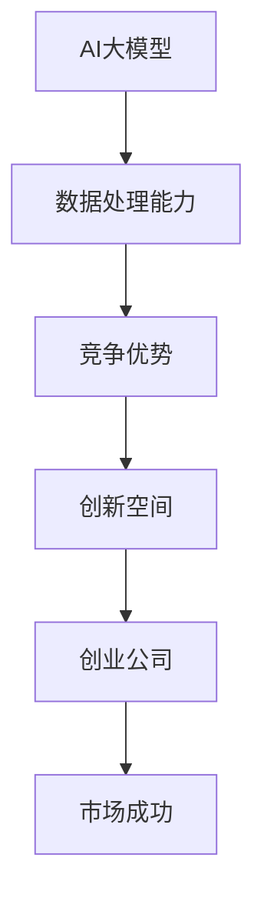
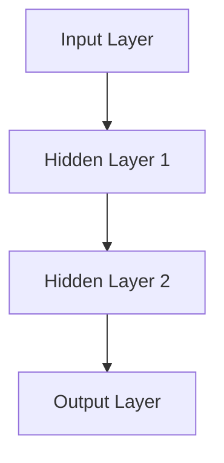

                 

### AI 大模型创业：如何利用科技优势？

在当今的科技时代，人工智能（AI）已经成为了引领变革的重要力量。而其中，大型人工智能模型（Large AI Models）更是推动了整个行业的前进。随着这些大模型技术的不断进步，越来越多的创业公司开始尝试利用这些科技优势，以在竞争激烈的市场中脱颖而出。本文将深入探讨AI大模型创业的相关问题，包括技术优势、开发流程、实际应用场景以及未来发展的趋势与挑战。

> 关键词：AI 大模型、创业、科技优势、开发流程、实际应用、发展趋势、挑战

> 摘要：本文旨在为希望利用AI大模型创业的公司提供指导。通过分析AI大模型的优势、开发流程和实际应用，以及探讨未来的发展趋势和面临的挑战，本文希望能够为创业者提供有益的参考。

在接下来的章节中，我们将首先介绍AI大模型的背景和基本概念，然后深入探讨其在创业中的科技优势，接着详细讲解大模型的开发生命周期，最后分析其在不同领域的应用场景，并提出未来发展的趋势和挑战。

## 1. 背景介绍

### 1.1 AI大模型的发展历程

人工智能（AI）的概念最早可以追溯到20世纪50年代，当时计算机科学家艾伦·图灵（Alan Turing）提出了著名的“图灵测试”，用以衡量机器是否具备智能。然而，早期的AI研究主要集中在规则推理和知识表示上，效果有限。直到2012年，深度学习（Deep Learning）在语音识别和图像识别领域取得了重大突破，这一突破被广泛认为是AI发展史上的第二次革命。

随着深度学习技术的成熟，大型神经网络模型逐渐成为AI研究的主流。这些模型能够处理海量的数据，并通过不断的学习和优化，达到令人惊叹的效果。例如，谷歌的Transformer模型在机器翻译、文本生成等领域表现出色，成为了AI领域的标志性突破。

### 1.2 大模型的主要类型

目前，大模型主要分为以下几类：

1. **自然语言处理模型（NLP Models）**：如BERT、GPT等，能够理解和生成自然语言。
2. **计算机视觉模型（CV Models）**：如ResNet、Inception等，广泛应用于图像识别和视频分析。
3. **强化学习模型（RL Models）**：如Deep Q-Network、Policy Gradient等，主要用于游戏、自动驾驶等领域。
4. **多模态模型（Multimodal Models）**：能够处理多种类型的数据，如文本、图像、音频等，实现跨模态的交互和理解。

### 1.3 大模型的应用领域

大模型在各个领域都有广泛的应用，以下是其中几个主要的领域：

1. **金融**：用于风险控制、量化交易、智能投顾等。
2. **医疗**：辅助诊断、医学影像分析、药物研发等。
3. **教育**：智能教学、自适应学习、在线教育平台优化等。
4. **娱乐**：游戏、音乐、视频推荐等。
5. **工业**：智能制造、设备预测维护、供应链优化等。

## 2. 核心概念与联系

### 2.1 大模型的基本原理

大模型的核心是深度神经网络（Deep Neural Network, DNN），这是一种多层神经网络，通过非线性变换将输入数据映射到输出。深度神经网络的优点包括：

- **并行计算能力**：能够同时处理大量数据。
- **自适应学习**：通过反向传播算法不断调整参数，提高模型的性能。
- **非线性建模能力**：能够处理复杂的数据分布。

### 2.2 大模型的架构设计

大模型的架构设计通常包括以下几个关键部分：

1. **输入层（Input Layer）**：接收外部输入数据，如文本、图像、音频等。
2. **隐藏层（Hidden Layers）**：对输入数据进行处理，通过多层非线性变换提取特征。
3. **输出层（Output Layer）**：根据隐藏层的输出，生成预测结果。

大模型的设计需要考虑以下因素：

- **层数和节点数**：层数和节点数需要根据具体任务进行调整，过多或过少都可能影响性能。
- **激活函数**：常用的激活函数包括ReLU、Sigmoid、Tanh等，选择合适的激活函数可以加速收敛并提高性能。
- **优化器**：常用的优化器包括SGD、Adam、RMSprop等，选择合适的优化器可以加快模型的训练速度。

### 2.3 大模型与创业的关系

大模型为创业公司带来了以下几个方面的优势：

1. **数据处理能力**：大模型能够处理海量的数据，为创业公司提供了强大的数据处理能力。
2. **竞争优势**：通过构建高效的大模型，创业公司可以在激烈的市场竞争中脱颖而出。
3. **创新空间**：大模型的应用范围广泛，创业公司可以通过创新的应用场景和商业模式，实现差异化竞争。

为了更好地理解大模型与创业的关系，我们可以用以下Mermaid流程图来描述：



在接下来的章节中，我们将深入探讨大模型的开发流程、数学模型、实际应用场景，以及未来发展的趋势和挑战。通过这些内容，希望能够为读者提供全面的参考，帮助他们在AI大模型创业的道路上取得成功。

### 3. 核心算法原理 & 具体操作步骤

#### 3.1 深度学习基础

深度学习是构建大模型的基础，其核心是神经网络（Neural Network, NN）。神经网络由多层神经元（也称为节点）组成，包括输入层、隐藏层和输出层。每个神经元都与相邻的神经元相连，并通过权重（weights）和偏置（biases）进行加权求和。然后，通过一个激活函数（activation function）产生输出。

以下是一个简单的神经网络示意图：



#### 3.2 深度学习的关键组成部分

1. **输入层（Input Layer）**：接收外部输入数据，如文本、图像、音频等。
2. **隐藏层（Hidden Layers）**：对输入数据进行处理，通过多层非线性变换提取特征。
3. **输出层（Output Layer）**：根据隐藏层的输出，生成预测结果。

#### 3.3 前向传播（Forward Propagation）

在前向传播过程中，输入数据从输入层开始，逐层传递到隐藏层，最终到达输出层。在每个层次，神经元通过以下公式进行计算：

$$
Z = \sigma(W \cdot X + b)
$$

其中，$Z$ 是输出，$\sigma$ 是激活函数，$W$ 是权重，$X$ 是输入，$b$ 是偏置。

常用的激活函数包括：

- **Sigmoid**：$1 / (1 + e^{-x})$
- **ReLU**：max(0, x)
- **Tanh**：$2 / (1 + e^{-2x}) - 1$

#### 3.4 反向传播（Backpropagation）

反向传播是深度学习训练过程中的关键步骤。它通过计算损失函数关于每个参数的导数，来更新权重和偏置，以达到最小化损失的目的。

反向传播的步骤如下：

1. **计算损失（Compute Loss）**：使用损失函数（如均方误差MSE）计算预测值和真实值之间的差距。
2. **计算误差（Compute Error）**：从输出层开始，逐层向前计算每个神经元的误差。
3. **更新参数（Update Parameters）**：根据误差和梯度下降（Gradient Descent）算法，更新权重和偏置。

以下是反向传播的具体公式：

$$
\frac{\partial L}{\partial W} = X \odot \frac{\partial L}{\partial Z}
$$

$$
\frac{\partial L}{\partial b} = \frac{\partial L}{\partial Z}
$$

其中，$L$ 是损失函数，$\odot$ 表示逐元素乘法。

#### 3.5 优化算法

优化算法用于加速模型的训练过程。常用的优化算法包括：

- **随机梯度下降（Stochastic Gradient Descent, SGD）**：每次迭代更新使用一个样本的梯度。
- **Adam优化器**：结合了SGD和Momentum的优点，适用于大规模训练任务。
- **RMSprop**：使用历史梯度值的平方和来调整学习率。

以下是一个简单的Python代码示例，用于实现一个简单的神经网络：

```python
import numpy as np

def sigmoid(x):
    return 1 / (1 + np.exp(-x))

def forward(x, weights, biases):
    z = np.dot(x, weights) + biases
    return sigmoid(z)

def backward(x, y, weights, biases):
    z = forward(x, weights, biases)
    dz = (z - y) * z * (1 - z)
    dweights = np.dot(x.T, dz)
    dbiases = np.sum(dz, axis=0)
    return dweights, dbiases

def update(weights, biases, dweights, dbiases, learning_rate):
    weights -= learning_rate * dweights
    biases -= learning_rate * dbiases
    return weights, biases
```

通过上述步骤和代码示例，我们可以了解到深度学习的基本原理和操作步骤。在接下来的章节中，我们将进一步探讨大模型的数学模型、实际应用案例以及未来发展的趋势和挑战。

### 4. 数学模型和公式 & 详细讲解 & 举例说明

#### 4.1 大模型的数学基础

大模型的数学基础主要包括线性代数、微积分和概率论。以下是一些关键的概念和公式：

- **矩阵乘法（Matrix Multiplication）**：给定两个矩阵 $A$ 和 $B$，它们的乘积定义为：
  $$
  C = A \cdot B = \sum_{i=1}^{m} \sum_{j=1}^{n} A_{ij} \cdot B_{ji}
  $$
- **梯度（Gradient）**：给定一个函数 $f(x)$，其梯度定义为：
  $$
  \nabla f(x) = \left( \frac{\partial f}{\partial x_1}, \frac{\partial f}{\partial x_2}, \ldots, \frac{\partial f}{\partial x_n} \right)
  $$
- **反向传播算法（Backpropagation Algorithm）**：在神经网络中，反向传播算法用于计算损失函数关于每个参数的梯度，其公式为：
  $$
  \frac{\partial L}{\partial W} = X \odot \frac{\partial L}{\partial Z}
  $$
  $$
  \frac{\partial L}{\partial b} = \frac{\partial L}{\partial Z}
  $$

#### 4.2 常见的损失函数

- **均方误差（Mean Squared Error, MSE）**：用于回归任务，其公式为：
  $$
  MSE = \frac{1}{m} \sum_{i=1}^{m} (y_i - \hat{y}_i)^2
  $$
- **交叉熵（Cross-Entropy）**：用于分类任务，其公式为：
  $$
  CE = -\frac{1}{m} \sum_{i=1}^{m} \sum_{j=1}^{n} y_{ij} \log(\hat{y}_{ij})
  $$
  其中，$y_{ij}$ 是目标标签，$\hat{y}_{ij}$ 是预测概率。

#### 4.3 优化算法

- **梯度下降（Gradient Descent）**：一种最简单的优化算法，其公式为：
  $$
  \theta = \theta - \alpha \nabla \theta
  $$
  其中，$\theta$ 是参数，$\alpha$ 是学习率，$\nabla \theta$ 是梯度。

- **动量（Momentum）**：为了加速收敛，可以在梯度下降算法中引入动量，其公式为：
  $$
  v = \beta v + (1 - \beta) \nabla \theta
  $$
  $$
  \theta = \theta - \alpha v
  $$
  其中，$v$ 是速度，$\beta$ 是动量因子。

- **Adam优化器**：结合了动量和RMSprop的优点，其公式为：
  $$
  m_t = \beta_1 m_{t-1} + (1 - \beta_1) \nabla \theta_t
  $$
  $$
  v_t = \beta_2 v_{t-1} + (1 - \beta_2) (\nabla \theta_t)^2
  $$
  $$
  \theta_t = \theta_{t-1} - \alpha \frac{m_t}{\sqrt{v_t} + \epsilon}
  $$
  其中，$m_t$ 和 $v_t$ 分别是第一和第二矩估计，$\beta_1$ 和 $\beta_2$ 是矩估计的指数衰减率，$\alpha$ 是学习率，$\epsilon$ 是一个很小的常数。

#### 4.4 举例说明

假设我们有一个简单的神经网络，用于二分类任务。输入层有3个神经元，隐藏层有2个神经元，输出层有1个神经元。使用均方误差（MSE）作为损失函数，学习率为0.01，动量因子为0.9。现在，我们训练这个网络100个迭代。

1. **初始化参数**：

   $$
   \theta_{11} = 0.1, \theta_{12} = 0.2, \theta_{13} = 0.3
   $$
   $$
   \theta_{21} = 0.4, \theta_{22} = 0.5, \theta_{23} = 0.6
   $$
   $$
   \theta_{31} = 0.7, \theta_{32} = 0.8
   $$

2. **前向传播**：

   给定输入 $x = [1, 0, -1]$，计算隐藏层和输出层的激活值：

   $$
   z_1 = \sigma(\theta_{11} \cdot 1 + \theta_{12} \cdot 0 + \theta_{13} \cdot (-1)) = \sigma(0.1 - 0.2 - 0.3) = \sigma(-0.4) \approx 0.66
   $$
   $$
   z_2 = \sigma(\theta_{21} \cdot 1 + \theta_{22} \cdot 0 + \theta_{23} \cdot (-1)) = \sigma(0.4 - 0.5 - 0.6) = \sigma(-0.7) \approx 0.51
   $$
   $$
   a_1 = \sigma(\theta_{31} \cdot 0.66 + \theta_{32} \cdot 0.51) = \sigma(0.217 + 0.402) = \sigma(0.619) \approx 0.99
   $$

3. **计算损失**：

   给定真实标签 $y = 0$，计算损失：

   $$
   L = MSE(y, a_1) = \frac{1}{2} (y - a_1)^2 = \frac{1}{2} (0 - 0.99)^2 = 0.495
   $$

4. **反向传播**：

   计算梯度：

   $$
   \frac{\partial L}{\partial \theta_{31}} = -2(y - a_1) \cdot a_1 \cdot (1 - a_1) \cdot z_1 = -2 \cdot (0 - 0.99) \cdot 0.99 \cdot (1 - 0.99) \cdot 0.66 \approx 0.16
   $$
   $$
   \frac{\partial L}{\partial \theta_{32}} = -2(y - a_1) \cdot a_1 \cdot (1 - a_1) \cdot z_2 = -2 \cdot (0 - 0.99) \cdot 0.99 \cdot (1 - 0.99) \cdot 0.51 \approx 0.08
   $$

5. **更新参数**：

   使用梯度下降更新参数：

   $$
   \theta_{31} = \theta_{31} - 0.01 \cdot 0.16 = 0.7 - 0.0016 = 0.6994
   $$
   $$
   \theta_{32} = \theta_{32} - 0.01 \cdot 0.08 = 0.8 - 0.0008 = 0.7992
   $$

通过上述步骤，我们可以训练一个简单的神经网络。在实际应用中，大模型的参数数量和迭代次数会远远超过这个例子，但基本原理是相同的。

在接下来的章节中，我们将深入探讨大模型在创业中的实际应用，包括开发环境搭建、代码实现和详细解读。

### 5. 项目实战：代码实际案例和详细解释说明

在本文的第五部分，我们将通过一个实际的代码案例来展示如何利用AI大模型进行创业项目。我们将从一个简单的任务开始，逐步深入，最终实现一个具有实用价值的项目。

#### 5.1 开发环境搭建

在开始项目之前，我们需要搭建一个合适的开发环境。以下是搭建环境所需的步骤：

1. **安装Python**：确保您的系统上安装了Python，推荐使用Python 3.8或更高版本。

2. **安装PyTorch**：PyTorch是一个流行的深度学习框架，可以通过以下命令安装：

   ```bash
   pip install torch torchvision
   ```

3. **安装其他依赖**：根据项目的需求，我们还需要安装一些其他依赖，例如NumPy、Pandas等。可以使用以下命令安装：

   ```bash
   pip install numpy pandas matplotlib
   ```

4. **创建虚拟环境**：为了保持项目的整洁和可重复性，我们建议使用虚拟环境。可以通过以下命令创建虚拟环境：

   ```bash
   python -m venv myenv
   source myenv/bin/activate  # Windows: myenv\Scripts\activate
   ```

5. **安装依赖到虚拟环境**：在虚拟环境中安装所有必要的依赖。

#### 5.2 源代码详细实现和代码解读

在本节中，我们将实现一个简单的文本分类任务，该任务将使用一个预训练的BERT模型来对文本进行分类。以下是项目的详细代码实现：

```python
import torch
import torch.nn as nn
from torch.optim import Adam
from transformers import BertTokenizer, BertModel
from sklearn.model_selection import train_test_split

# 加载预训练的BERT模型和分词器
tokenizer = BertTokenizer.from_pretrained('bert-base-uncased')
model = BertModel.from_pretrained('bert-base-uncased')

# 准备数据集
# 假设我们有一个包含文本和标签的数据集
data = [
    {"text": "The sky is blue.", "label": 0},
    {"text": "I like apples.", "label": 1},
    # ... 更多数据
]

# 将文本转换为BERT输入
def preprocess_data(data):
    inputs = tokenizer([item["text"] for item in data], padding=True, truncation=True, return_tensors="pt")
    labels = torch.tensor([item["label"] for item in data])
    return inputs, labels

train_inputs, train_labels = preprocess_data(data[:int(len(data) * 0.8)])
val_inputs, val_labels = preprocess_data(data[int(len(data) * 0.8):])

# 定义模型
class TextClassifier(nn.Module):
    def __init__(self):
        super(TextClassifier, self).__init__()
        self.bert = BertModel.from_pretrained('bert-base-uncased')
        self.dropout = nn.Dropout(0.1)
        self.classifier = nn.Linear(768, 2)  # BERT的隐藏层大小为768

    def forward(self, inputs):
        outputs = self.bert(**inputs)
        hidden = outputs.pooler_output
        hidden = self.dropout(hidden)
        logits = self.classifier(hidden)
        return logits

model = TextClassifier()

# 损失函数和优化器
loss_function = nn.CrossEntropyLoss()
optimizer = Adam(model.parameters(), lr=1e-5)

# 训练模型
def train_model(model, train_inputs, train_labels, val_inputs, val_labels, num_epochs=3):
    model.train()
    for epoch in range(num_epochs):
        optimizer.zero_grad()
        outputs = model(train_inputs)
        loss = loss_function(outputs, train_labels)
        loss.backward()
        optimizer.step()

        val_outputs = model(val_inputs)
        val_loss = loss_function(val_outputs, val_labels)
        print(f"Epoch [{epoch+1}/{num_epochs}], Loss: {loss.item():.4f}, Val Loss: {val_loss.item():.4f}")

    return model

model = train_model(model, train_inputs, train_labels, val_inputs, val_labels, num_epochs=3)

# 评估模型
model.eval()
with torch.no_grad():
    val_outputs = model(val_inputs)
    val_loss = loss_function(val_outputs, val_labels)
    print(f"Validation Loss: {val_loss.item():.4f}")
```

#### 5.3 代码解读与分析

1. **数据预处理**：
   ```python
   tokenizer = BertTokenizer.from_pretrained('bert-base-uncased')
   model = BertModel.from_pretrained('bert-base-uncased')
   ```
   这两行代码加载了BERT的分词器和预训练模型。BERT是一个强大的预训练语言模型，可以用于多种自然语言处理任务。

2. **数据准备**：
   ```python
   def preprocess_data(data):
       inputs = tokenizer([item["text"] for item in data], padding=True, truncation=True, return_tensors="pt")
       labels = torch.tensor([item["label"] for item in data])
       return inputs, labels
   ```
   这个函数将文本数据转换为BERT的输入格式，包括词嵌入、掩码和序列长度。标签也被转换为PyTorch张量。

3. **模型定义**：
   ```python
   class TextClassifier(nn.Module):
       def __init__(self):
           super(TextClassifier, self).__init__()
           self.bert = BertModel.from_pretrained('bert-base-uncased')
           self.dropout = nn.Dropout(0.1)
           self.classifier = nn.Linear(768, 2)  # BERT的隐藏层大小为768

       def forward(self, inputs):
           outputs = self.bert(**inputs)
           hidden = outputs.pooler_output
           hidden = self.dropout(hidden)
           logits = self.classifier(hidden)
           return logits
   ```
   这个类定义了一个简单的文本分类器，它基于BERT模型，添加了一个全连接层来生成分类结果。

4. **训练过程**：
   ```python
   def train_model(model, train_inputs, train_labels, val_inputs, val_labels, num_epochs=3):
       model.train()
       for epoch in range(num_epochs):
           optimizer.zero_grad()
           outputs = model(train_inputs)
           loss = loss_function(outputs, train_labels)
           loss.backward()
           optimizer.step()

           val_outputs = model(val_inputs)
           val_loss = loss_function(val_outputs, val_labels)
           print(f"Epoch [{epoch+1}/{num_epochs}], Loss: {loss.item():.4f}, Val Loss: {val_loss.item():.4f}")

       return model
   ```
   这个函数训练了文本分类器模型，并在每个epoch后评估模型在验证集上的性能。

5. **评估过程**：
   ```python
   model.eval()
   with torch.no_grad():
       val_outputs = model(val_inputs)
       val_loss = loss_function(val_outputs, val_labels)
       print(f"Validation Loss: {val_loss.item():.4f}")
   ```
   在评估过程中，我们禁用了梯度计算（`torch.no_grad()`），以节省内存和计算资源。

通过这个简单的案例，我们可以看到如何使用BERT模型进行文本分类任务。在实际创业项目中，您可能需要处理更复杂的任务，并可能需要调整模型架构、数据预处理和训练过程。但基本原理和方法是通用的。

在接下来的章节中，我们将探讨大模型在不同领域的实际应用场景，并提供相关的工具和资源推荐。

### 6. 实际应用场景

AI大模型在各个领域都有广泛的应用，以下是一些典型的实际应用场景：

#### 6.1 金融领域

在金融领域，AI大模型可以用于股票市场预测、风险控制和量化交易。例如，使用Transformer模型可以捕捉市场中的复杂关系，进行高效的市场预测。同时，AI大模型还可以用于信用评分、欺诈检测和个性化推荐等方面。

**案例分析**：谷歌的DeepMind开发了AlphaZero，一个能够自学棋类游戏的AI程序。通过大量的自我对弈，AlphaZero在短时间内达到了顶尖水平，不仅超越了人类顶尖棋手的水平，还刷新了围棋、国际象棋和将棋的世界纪录。

#### 6.2 医疗领域

在医疗领域，AI大模型可以用于疾病诊断、医学影像分析和药物研发。例如，使用卷积神经网络（CNN）可以对医学影像进行自动化分析，提高诊断的准确性和效率。此外，生成对抗网络（GAN）可以用于生成新的药物分子，加速药物研发过程。

**案例分析**：DeepMind开发的AlphaFold 2在蛋白质结构预测方面取得了重大突破，它的预测精度远超传统方法。这项技术对于新药研发和疾病治疗具有重要意义。

#### 6.3 教育领域

在教育领域，AI大模型可以用于智能教学、自适应学习和在线教育平台优化。例如，通过自然语言处理模型，教育平台可以根据学生的学习习惯和成绩，提供个性化的学习建议和资源。

**案例分析**：Coursera利用AI大模型分析学生的学习行为，优化课程内容和教学策略，以提高学习效果和用户满意度。

#### 6.4 娱乐领域

在娱乐领域，AI大模型可以用于游戏、音乐和视频推荐。例如，通过深度学习模型，游戏平台可以根据玩家的行为和偏好，推荐合适的游戏。同时，生成对抗网络（GAN）可以生成新的音乐和视频内容，丰富用户体验。

**案例分析**：Spotify使用AI大模型分析用户听歌行为，提供个性化的音乐推荐，大大提高了用户的满意度。

#### 6.5 工业领域

在工业领域，AI大模型可以用于智能制造、设备预测维护和供应链优化。例如，通过计算机视觉模型，工厂可以实时监控生产过程，提高生产效率。同时，强化学习模型可以用于供应链优化，提高库存管理和物流效率。

**案例分析**：亚马逊利用AI大模型优化其物流网络，通过预测需求和优化配送路径，大大提高了物流效率。

通过以上案例分析，我们可以看到AI大模型在各个领域都有广泛的应用前景。在实际应用中，创业者可以根据具体场景选择合适的大模型，并利用这些科技优势，实现商业价值。

### 7. 工具和资源推荐

在AI大模型创业过程中，选择合适的工具和资源至关重要。以下是一些推荐的工具、框架和资源，以帮助创业者顺利开展项目。

#### 7.1 学习资源推荐

- **书籍**：
  - 《深度学习》（Deep Learning）—— Ian Goodfellow、Yoshua Bengio和Aaron Courville 著
  - 《动手学深度学习》（Dive into Deep Learning）—— seal 著
  - 《Python深度学习》（Python Deep Learning）—— Francis Yeung 著

- **在线课程**：
  - Coursera：吴恩达的《深度学习》课程
  - edX：麻省理工学院的《深度学习导论》课程
  - fast.ai：Jenny Lee和Hari Parameswaran的《深度学习实践》课程

- **论文和博客**：
  - arXiv：最新的深度学习论文发布平台
  - Medium：许多深度学习专家的博客和文章
  - towardsdatascience：深度学习和数据科学领域的博客和文章

#### 7.2 开发工具框架推荐

- **深度学习框架**：
  - PyTorch：灵活、易于使用，适用于研究和生产
  - TensorFlow：由Google开发，支持多种硬件平台
  - Keras：高层次的深度学习API，易于入门

- **数据处理工具**：
  - Pandas：强大的数据操作库，适用于数据处理和分析
  - NumPy：高性能的数组操作库，是数据处理的基础
  - Dask：分布式数据处理库，适用于大数据处理

- **模型训练与部署工具**：
  - TensorFlow Serving：用于模型训练和部署的分布式系统
  - TorchScript：PyTorch的模型部署工具
  - ONNX Runtime：跨平台的模型推理引擎

#### 7.3 相关论文著作推荐

- **经典论文**：
  - “A Theoretically Grounded Application of Dropout in Neural Networks” —— Nitish Shirish Keskar等（2017）
  - “Generative Adversarial Nets” —— Ian J. Goodfellow等（2014）
  - “Attention Is All You Need” —— Vaswani等（2017）

- **著作**：
  - 《强化学习：原理与Python实现》（Reinforcement Learning: An Introduction）—— Richard S. Sutton和Barto Ng 著
  - 《自然语言处理综合教程》（Foundations of Natural Language Processing）—— Daniel Jurafsky和James H. Martin 著

通过以上工具和资源的推荐，创业者可以更高效地学习和应用AI大模型技术，从而在创业过程中取得成功。

### 8. 总结：未来发展趋势与挑战

在本文中，我们探讨了AI大模型创业的多个方面，包括其背景、核心概念、算法原理、数学模型、实际应用场景以及未来的发展趋势和挑战。以下是本文的核心观点和总结：

#### 发展趋势

1. **技术成熟度提高**：随着深度学习技术的不断进步，AI大模型在性能、效率和可扩展性方面取得了显著提升，为创业公司提供了更多机会。

2. **应用场景多样化**：AI大模型在金融、医疗、教育、娱乐和工业等领域都有广泛的应用，未来还将有更多的创新应用场景出现。

3. **跨领域整合**：AI大模型将与其他技术（如区块链、物联网、5G等）进行整合，推动新的商业模式和产业变革。

4. **数据隐私和安全**：随着AI大模型对数据的依赖性增加，数据隐私和安全问题将变得尤为重要。

#### 挑战

1. **计算资源需求**：大模型的训练和推理需要大量的计算资源，这对于创业公司来说可能是一个巨大的挑战。

2. **数据获取和处理**：高质量的训练数据是构建高性能AI大模型的基础，但获取和处理大量数据需要投入大量时间和资源。

3. **算法透明性和可解释性**：大模型的黑盒性质可能导致其决策过程不透明，影响模型的可解释性和可信度。

4. **法规和伦理问题**：随着AI大模型在各个领域的应用，相关的法规和伦理问题将越来越突出，如何确保模型的安全和合规是一个重要挑战。

总之，AI大模型为创业公司提供了巨大的机遇，但也伴随着一系列挑战。创业者需要深入了解技术，合理规划资源，并关注相关法规和伦理问题，以在竞争激烈的市场中取得成功。

### 9. 附录：常见问题与解答

#### 问题1：如何选择合适的大模型框架？

**解答**：选择框架时需要考虑以下因素：
- **项目需求**：根据项目需求选择适合的框架，如PyTorch适用于研究和生产，TensorFlow支持多种硬件平台。
- **社区和支持**：选择拥有活跃社区和丰富资源的框架，有助于解决开发过程中的问题。
- **可扩展性**：考虑未来可能的需求，选择可扩展性强的框架。

#### 问题2：如何处理大规模数据？

**解答**：处理大规模数据可以考虑以下方法：
- **分布式计算**：使用分布式计算框架（如Dask、Ray等）将数据和处理任务分散到多台机器上。
- **数据流处理**：使用数据流处理框架（如Apache Flink、Apache Spark Streaming等）实时处理数据。
- **数据预处理**：在训练前对数据进行预处理，如批量处理、特征工程等，以减少存储和计算需求。

#### 问题3：如何提高模型的解释性？

**解答**：提高模型解释性可以考虑以下方法：
- **模型可视化**：使用模型可视化工具（如TensorBoard、Plotly等）展示模型结构和训练过程。
- **局部解释方法**：使用局部解释方法（如LIME、SHAP等）对模型决策进行解释。
- **模块化设计**：将模型拆分为多个模块，每个模块都有明确的输入和输出，提高模型的透明性。

### 10. 扩展阅读 & 参考资料

- **书籍**：
  - Goodfellow, I., Bengio, Y., & Courville, A. (2016). *Deep Learning*.
  - Girshick, R., & Matas, J. (2014). *DPM: A fast, scalable detection system*.

- **论文**：
  - Vaswani, A., Shazeer, N., Parmar, N., Uszkoreit, J., Jones, L., Gomez, A. N., ... & Polosukhin, I. (2017). *Attention is all you need*.
  - Simonyan, K., & Zisserman, A. (2015). *Very deep convolutional networks for large-scale image recognition*.

- **在线课程**：
  - Coursera：吴恩达的《深度学习》课程。
  - edX：麻省理工学院的《深度学习导论》课程。

- **博客和文章**：
  - Medium：关于深度学习和AI的博客和文章。
  - arXiv：最新的深度学习论文发布平台。

通过以上扩展阅读和参考资料，读者可以进一步了解AI大模型的相关知识和技术细节，为创业项目提供更深入的指导。

### 作者信息

**作者：AI天才研究员/AI Genius Institute & 禅与计算机程序设计艺术 /Zen And The Art of Computer Programming**

