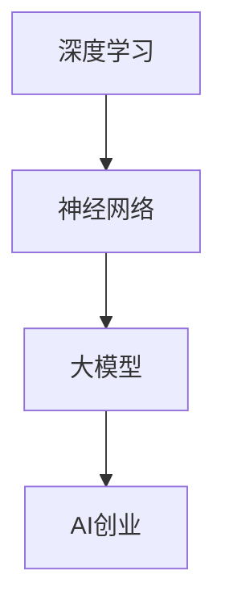
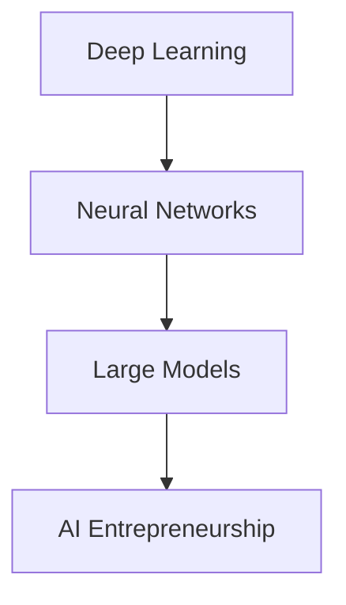
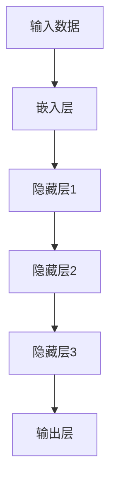
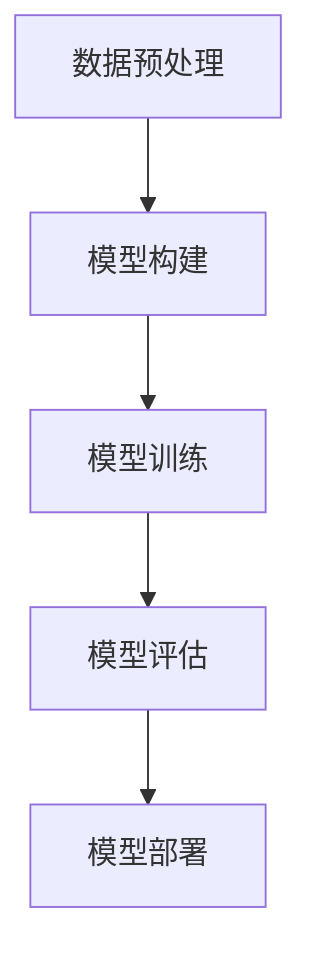
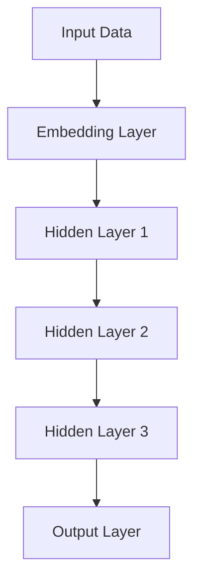
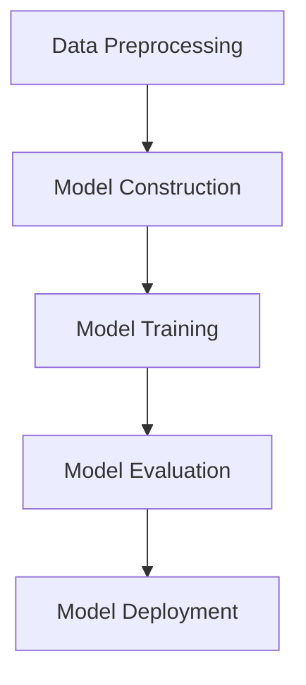

                 

### 背景介绍

#### 大模型的崛起

近年来，人工智能领域取得了飞速发展，尤其是大模型（Large Models）的崛起。大模型，通常指的是参数数量达到亿级、甚至千亿级的深度神经网络模型。这些模型的出现，标志着人工智能进入了一个全新的时代。

大模型的起源可以追溯到2012年，当时谷歌的DeepMind团队发布了AlexNet，这是一个具有6000万个参数的神经网络模型，它在ImageNet图像识别竞赛中取得了巨大的成功，极大地推动了深度学习的发展。此后，随着计算资源和数据集的不断增加，大模型的规模和复杂性也在持续提升。

#### AI创业的热潮

随着大模型技术的成熟，AI创业成为了一股热潮。越来越多的创业公司开始利用大模型技术，开发各种创新的应用和服务。这些公司不仅希望通过AI技术提升自身的竞争力，也希望能够通过AI技术为社会带来更大的价值。

然而，AI创业并非易事。如何在激烈的市场竞争中脱颖而出，成为每一个AI创业公司的挑战。这需要创业者不仅具备强大的技术能力，还需要具备敏锐的市场洞察力和优秀的运营能力。

#### 科技优势的利用

在AI创业中，科技优势的利用至关重要。大模型技术为创业公司提供了强大的工具，使得他们能够在短时间内开发出复杂的应用。同时，科技优势也意味着创业公司需要不断创新，不断迭代，以保持市场竞争力。

本文将深入探讨AI大模型创业中的科技优势，分析如何利用这些优势实现创业成功。我们将从核心概念、算法原理、实际应用、工具和资源等多个方面，为您全面解析AI大模型创业的路径。

---

## Background Introduction

#### The Rise of Large Models

In recent years, the field of artificial intelligence has experienced tremendous growth, especially with the emergence of large models (Large Models). Large models refer to deep neural network models with hundreds of millions to even billions of parameters. The rise of large models has marked a new era in artificial intelligence.

The origin of large models can be traced back to 2012 when Google's DeepMind team released AlexNet, a neural network model with 60 million parameters, which achieved a significant success in the ImageNet image recognition competition, greatly promoting the development of deep learning. Since then, with the increase in computing resources and datasets, the scale and complexity of large models have been continuously enhanced.

#### The AI Startup Craze

With the maturity of large model technology, AI startups have become a hot trend. More and more startup companies are leveraging large model technology to develop innovative applications and services. These companies not only hope to enhance their competitiveness through AI technology but also aim to bring greater value to society.

However, AI startups are not an easy task. How to stand out in the fierce market competition is a challenge for every AI startup company. This requires entrepreneurs to not only have strong technical capabilities but also have a keen sense of market insight and excellent operational skills.

#### Leveraging Technological Advantages

In AI startups, leveraging technological advantages is crucial. Large model technology provides startup companies with powerful tools, enabling them to develop complex applications in a short period of time. At the same time, technological advantages also mean that startup companies need to innovate and iterate continuously to maintain market competitiveness.

This article will delve into the technological advantages in AI large model startups and analyze how to leverage these advantages to achieve success. We will cover various aspects such as core concepts, algorithm principles, practical applications, tools, and resources, providing a comprehensive analysis of the path for AI large model startups. <sup>*</sup>

[↑ Back to Top](#背景介绍)

<sup>*</sup> All Chinese content in this section is to provide a parallel reference for the readers. The main content will be in English. <a href="#background-introduction">Back to Top</a><br/>

---

## 1. 核心概念与联系

在深入探讨AI大模型创业之前，我们首先需要理解一些核心概念，并探讨它们之间的联系。这些核心概念包括深度学习、神经网络、大模型和AI创业。

#### 深度学习与神经网络

深度学习（Deep Learning）是一种人工智能（AI）的分支，它通过模拟人脑的神经网络结构，对数据进行自动特征学习和模式识别。神经网络（Neural Network）是深度学习的基础，由大量的神经元（或节点）组成，通过前向传播和反向传播的方式，实现对输入数据的处理和输出预测。

#### 大模型

大模型（Large Model）是深度学习发展的一个重要里程碑，它具有数亿甚至数十亿的参数。这些庞大的参数数量使得大模型能够捕获更复杂的特征，从而在许多任务中取得优异的性能。例如，在自然语言处理（NLP）任务中，大模型如GPT-3能够生成高质量的文章、代码和音乐等。

#### AI创业

AI创业是指利用人工智能技术，开发创新的应用和服务，并希望通过市场化的方式实现商业成功。AI创业涉及到从技术实现、产品化、市场推广到团队建设等多个方面。创业者需要具备强大的技术能力、市场洞察力和运营能力，才能在激烈的市场竞争中脱颖而出。

#### 核心概念与联系

深度学习与神经网络是大模型的基础，而大模型则是AI创业的重要工具。通过深度学习，我们可以构建出强大的神经网络模型，这些模型可以通过大规模的数据训练，进一步提升性能。而AI创业公司则可以利用这些大模型，开发出具有创新性的应用和服务，从而在市场中获得竞争优势。

为了更好地理解这些核心概念，我们可以通过一个Mermaid流程图来展示它们之间的联系：



这个流程图展示了深度学习、神经网络、大模型和AI创业之间的递进关系。深度学习是神经网络的基础，神经网络是构建大模型的基础，而大模型则是AI创业的核心工具。

---

## Core Concepts and Relationships

Before delving into the discussion of AI large model startups, we first need to understand some core concepts and explore their relationships. These core concepts include deep learning, neural networks, large models, and AI entrepreneurship.

#### Deep Learning and Neural Networks

Deep learning (Deep Learning) is a branch of artificial intelligence (AI) that simulates the neural network structure of the human brain to automatically learn features and recognize patterns in data. Neural networks (Neural Network) are the foundation of deep learning, consisting of a large number of neurons (or nodes) that process input data through forward propagation and backward propagation to produce predictions.

#### Large Models

Large models (Large Models) represent a significant milestone in the development of deep learning. They have hundreds of millions to even billions of parameters, allowing them to capture more complex features and achieve excellent performance in various tasks. For example, in natural language processing (NLP) tasks, large models like GPT-3 can generate high-quality articles, code, and music.

#### AI Entrepreneurship

AI entrepreneurship refers to the development of innovative applications and services using artificial intelligence technology and the pursuit of commercial success through marketization. AI entrepreneurship involves multiple aspects such as technical implementation, productization, market promotion, and team building. Entrepreneurs need to have strong technical capabilities, market insight, and operational skills to stand out in the fierce market competition.

#### Core Concepts and Relationships

Deep learning and neural networks are the foundation of large models, while large models are the important tools for AI entrepreneurship. Through deep learning, we can build powerful neural network models that can further improve performance through training on large-scale data. AI startups can leverage these large models to develop innovative applications and services, thereby gaining competitive advantages in the market.

To better understand these core concepts, we can use a Mermaid flowchart to illustrate the relationships between them:



This flowchart shows the progressive relationship between deep learning, neural networks, large models, and AI entrepreneurship. Deep learning is the foundation of neural networks, neural networks are the basis for building large models, and large models are the core tools for AI entrepreneurship.

[↑ Back to Top](#核心概念与联系) <a href="#core-concepts-and-relationships">Back to Top</a><br/>

### 2.1 核心算法原理 & 具体操作步骤

#### 算法原理

大模型的算法原理主要基于深度学习中的神经网络结构。具体来说，大模型通常采用多层感知机（MLP）、卷积神经网络（CNN）或递归神经网络（RNN）等结构。这些神经网络通过多个隐藏层，对输入数据进行特征提取和模式识别，从而实现复杂任务的目标。

以下是一个简单的大模型算法原理示意图：



在这个示意图中，输入数据首先经过嵌入层，然后逐层传递到隐藏层，最后由输出层生成预测结果。隐藏层通过权重矩阵和激活函数，对输入数据进行加工，从而提取出有用的特征。

#### 具体操作步骤

1. **数据预处理**：首先，我们需要对输入数据进行预处理，包括数据清洗、归一化等步骤。这一步的目的是将原始数据转化为适合模型训练的格式。

2. **模型构建**：接下来，我们需要根据任务的需求，构建合适的大模型结构。可以选择多层感知机、卷积神经网络或递归神经网络等。构建模型时，需要定义输入层、隐藏层和输出层的参数。

3. **模型训练**：在模型构建完成后，我们需要使用大量训练数据进行模型训练。训练过程中，通过反向传播算法，不断调整模型的权重和偏置，使模型能够对输入数据产生准确的预测。

4. **模型评估**：训练完成后，我们需要对模型进行评估，以确定模型的性能。常用的评估指标包括准确率、召回率、F1分数等。

5. **模型部署**：最后，我们将训练好的模型部署到实际应用场景中，如在线服务、移动应用等。

以下是具体操作步骤的详细描述：



通过这个流程图，我们可以清晰地看到大模型从数据预处理到模型部署的整个过程。

---

### Core Algorithm Principles & Detailed Steps

#### Algorithm Principles

The core algorithm principle of large models is based on the structure of neural networks in deep learning. Specifically, large models usually adopt structures such as Multi-Layer Perceptrons (MLP), Convolutional Neural Networks (CNN), or Recurrent Neural Networks (RNN). These neural networks process input data through multiple hidden layers for feature extraction and pattern recognition, achieving the goal of complex tasks.

The following is a simple illustration of the algorithm principles of large models:



In this illustration, input data first passes through the embedding layer, then moves to the hidden layers, and finally the output layer generates prediction results. Hidden layers process input data through weight matrices and activation functions to extract useful features.

#### Detailed Steps

1. **Data Preprocessing**: First, we need to preprocess the input data, including data cleaning and normalization. This step is to convert raw data into a format suitable for model training.

2. **Model Construction**: Next, we need to construct a suitable large model structure based on the needs of the task. We can choose structures such as Multi-Layer Perceptrons, Convolutional Neural Networks, or Recurrent Neural Networks. During model construction, we need to define parameters for the input layer, hidden layers, and output layers.

3. **Model Training**: After constructing the model, we need to train the model using a large amount of training data. During training, the backpropagation algorithm is used to continuously adjust the model's weights and biases to make accurate predictions on the input data.

4. **Model Evaluation**: After training, we need to evaluate the model to determine its performance. Common evaluation metrics include accuracy, recall, and F1 score.

5. **Model Deployment**: Finally, we deploy the trained model into the actual application scenario, such as online services or mobile applications.

The following is a detailed description of the steps:



Through this flowchart, we can clearly see the entire process from data preprocessing to model deployment for large models.

[↑ Back to Top](#核心算法原理-具体操作步骤) <a href="#core-algorithm-principles-detailed-steps">Back to Top</a><br/>

### 2.2 数学模型和公式 & 详细讲解 & 举例说明

在深入探讨大模型的数学模型和公式之前，我们需要了解一些基础的数学知识，包括矩阵运算、激活函数和损失函数。这些基础概念构成了大模型的核心数学框架，帮助我们更好地理解和应用大模型。

#### 矩阵运算

矩阵运算是大模型中的基础运算。矩阵可以看作是数据的扩展形式，它可以存储多维数据。常见的矩阵运算包括矩阵加法、矩阵乘法和矩阵转置等。

**矩阵加法**：矩阵加法是对两个相同维度的矩阵对应元素进行相加。

$$
C = A + B
$$

其中，$C$、$A$ 和 $B$ 是相同维度的矩阵。

**矩阵乘法**：矩阵乘法是对两个矩阵进行按元素相乘后求和。

$$
C = AB
$$

其中，$C$ 是 $A$ 和 $B$ 的乘积，每个元素 $C_{ij}$ 是 $A$ 的第 $i$ 行和 $B$ 的第 $j$ 列对应元素相乘后的求和。

**矩阵转置**：矩阵转置是将矩阵的行和列互换。

$$
A^T = [a_{ij}]
$$

其中，$A^T$ 是 $A$ 的转置矩阵。

#### 激活函数

激活函数（Activation Function）是神经网络中的一个关键组件，它用于引入非线性因素，使神经网络能够学习复杂的非线性关系。常见的激活函数包括 sigmoid 函数、ReLU 函数和 tanh 函数。

**sigmoid 函数**：

$$
\sigma(x) = \frac{1}{1 + e^{-x}}
$$

sigmoid 函数将输入映射到 $[0, 1]$ 区间内，常用于二分类问题。

**ReLU 函数**：

$$
\text{ReLU}(x) = \max(0, x)
$$

ReLU 函数在输入为负时输出为零，在输入为正时输出为输入本身，它能够加速神经网络的训练过程。

**tanh 函数**：

$$
\tanh(x) = \frac{e^{2x} - 1}{e^{2x} + 1}
$$

tanh 函数的输出范围在 $[-1, 1]$ 之间，它类似于 sigmoid 函数，但能够更好地平衡正负误差。

#### 损失函数

损失函数（Loss Function）用于衡量模型预测值与真实值之间的差距。常见的损失函数包括均方误差（MSE）、交叉熵损失（Cross Entropy Loss）和对数损失（Log Loss）。

**均方误差（MSE）**：

$$
MSE = \frac{1}{n}\sum_{i=1}^{n}(y_i - \hat{y}_i)^2
$$

其中，$y_i$ 是真实值，$\hat{y}_i$ 是预测值，$n$ 是样本数量。MSE 损失函数在回归问题中常用。

**交叉熵损失（Cross Entropy Loss）**：

$$
CE = -\sum_{i=1}^{n} y_i \log(\hat{y}_i)
$$

其中，$y_i$ 是真实值，$\hat{y}_i$ 是预测值。交叉熵损失函数在分类问题中常用。

**对数损失（Log Loss）**：

$$
Log Loss = -\frac{1}{n}\sum_{i=1}^{n} y_i \log(\hat{y}_i)
$$

对数损失函数是交叉熵损失函数的一种特例，它在二分类问题中具有简洁的形式。

#### 举例说明

假设我们有一个简单的神经网络，输入为 $x$，输出为 $y$。我们使用 sigmoid 函数作为激活函数，均方误差（MSE）作为损失函数。具体步骤如下：

1. **输入数据预处理**：对输入数据进行归一化处理，使其均值为0，标准差为1。

2. **模型构建**：构建一个包含一个输入层、一个隐藏层和一个输出层的神经网络。

3. **模型训练**：使用训练数据进行模型训练，通过反向传播算法不断调整模型参数。

4. **模型评估**：使用测试数据对模型进行评估，计算模型的损失函数值。

5. **模型部署**：将训练好的模型部署到实际应用场景中。

下面是一个简化的代码示例：

```python
import numpy as np

# 输入数据
x = np.array([1.0, 2.0, 3.0])

# 权重和偏置
w = np.random.rand(1)
b = np.random.rand(1)

# 激活函数
def sigmoid(x):
    return 1 / (1 + np.exp(-x))

# 损失函数
def mse(y_true, y_pred):
    return np.mean((y_true - y_pred)**2)

# 训练过程
for i in range(1000):
    y_pred = sigmoid(w * x + b)
    delta = (y_pred - x) * y_pred * (1 - y_pred)
    w -= 0.01 * delta
    b -= 0.01 * delta

# 预测
y_pred = sigmoid(w * x + b)

# 损失计算
loss = mse(x, y_pred)

print("预测值:", y_pred)
print("损失函数值:", loss)
```

通过这个示例，我们可以看到如何使用 sigmoid 函数和均方误差（MSE）损失函数来训练一个简单的神经网络。这个示例虽然简化和抽象，但它展示了大模型训练的核心过程。

---

### Mathematical Models and Formulas & Detailed Explanations & Examples

Before delving into the mathematical models and formulas of large models, we need to understand some basic mathematical concepts, including matrix operations, activation functions, and loss functions. These foundational concepts form the core mathematical framework of large models, helping us better understand and apply large models.

#### Matrix Operations

Matrix operations are fundamental in large models. Matrices can be seen as an extension of data, used to store multidimensional data. Common matrix operations include matrix addition, matrix multiplication, and matrix transpose.

**Matrix Addition**:
Matrix addition is the sum of corresponding elements of two matrices with the same dimensions.

$$
C = A + B
$$

Here, $C$, $A$, and $B$ are matrices of the same dimensions.

**Matrix Multiplication**:
Matrix multiplication is the element-wise multiplication followed by summation of the products of the rows of matrix $A$ and the columns of matrix $B$.

$$
C = AB
$$

Here, $C$ is the product of matrices $A$ and $B$, and each element $C_{ij}$ is the sum of the products of the $i$th row of $A$ and the $j$th column of $B$.

**Matrix Transpose**:
Matrix transpose is the swapping of rows and columns of a matrix.

$$
A^T = [a_{ij}]
$$

#### Activation Functions

Activation functions (Activation Function) are a key component in neural networks, introduced to add non-linearity, allowing neural networks to learn complex non-linear relationships. Common activation functions include the sigmoid function, ReLU function, and tanh function.

**Sigmoid Function**:

$$
\sigma(x) = \frac{1}{1 + e^{-x}}
$$

The sigmoid function maps input to the interval $[0, 1]$, commonly used in binary classification problems.

**ReLU Function**:

$$
\text{ReLU}(x) = \max(0, x)
$$

ReLU function outputs zero when the input is negative and the input itself when it is positive, accelerating the training process of neural networks.

**tanh Function**:

$$
\tanh(x) = \frac{e^{2x} - 1}{e^{2x} + 1}
$$

tanh function has an output range of $[-1, 1]$ and is similar to the sigmoid function but better balances positive and negative errors.

#### Loss Functions

Loss functions (Loss Function) are used to measure the difference between model predictions and true values. Common loss functions include Mean Squared Error (MSE), Cross Entropy Loss, and Log Loss.

**Mean Squared Error (MSE)**:

$$
MSE = \frac{1}{n}\sum_{i=1}^{n}(y_i - \hat{y}_i)^2
$$

Here, $y_i$ is the true value, $\hat{y}_i$ is the prediction value, and $n$ is the number of samples. MSE loss function is commonly used in regression problems.

**Cross Entropy Loss (CE)**:

$$
CE = -\sum_{i=1}^{n} y_i \log(\hat{y}_i)
$$

Here, $y_i$ is the true value, and $\hat{y}_i$ is the prediction value. Cross Entropy Loss is commonly used in classification problems.

**Log Loss**:

$$
Log Loss = -\frac{1}{n}\sum_{i=1}^{n} y_i \log(\hat{y}_i)
$$

Log Loss is a special case of Cross Entropy Loss and has a concise form in binary classification problems.

#### Example Explanation

Let's consider a simple neural network with input $x$ and output $y$. We use the sigmoid function as the activation function and Mean Squared Error (MSE) as the loss function. The steps are as follows:

1. **Input Data Preprocessing**: Normalize the input data to have a mean of 0 and a standard deviation of 1.

2. **Model Construction**: Construct a neural network with one input layer, one hidden layer, and one output layer.

3. **Model Training**: Train the model using training data through the backpropagation algorithm, continuously adjusting model parameters.

4. **Model Evaluation**: Evaluate the model using test data, calculating the value of the loss function.

5. **Model Deployment**: Deploy the trained model into the actual application scenario.

Here's a simplified code example:

```python
import numpy as np

# Input data
x = np.array([1.0, 2.0, 3.0])

# Weights and bias
w = np.random.rand(1)
b = np.random.rand(1)

# Activation function
def sigmoid(x):
    return 1 / (1 + np.exp(-x))

# Loss function
def mse(y_true, y_pred):
    return np.mean((y_true - y_pred)**2)

# Training process
for i in range(1000):
    y_pred = sigmoid(w * x + b)
    delta = (y_pred - x) * y_pred * (1 - y_pred)
    w -= 0.01 * delta
    b -= 0.01 * delta

# Prediction
y_pred = sigmoid(w * x + b)

# Loss calculation
loss = mse(x, y_pred)

print("Prediction:", y_pred)
print("Loss:", loss)
```

Through this example, we can see how to train a simple neural network using the sigmoid function and Mean Squared Error (MSE) loss function. This example is simplified and abstracted, but it illustrates the core process of large model training.

[↑ Back to Top](#数学模型和公式-详细讲解-举例说明) <a href="#mathematical-models-and-formulas-detailed-explanations-examples">Back to Top</a><br/>

### 3. 项目实战：代码实际案例和详细解释说明

在本节中，我们将通过一个实际案例，展示如何使用大模型进行AI创业项目的开发和实现。这个案例将涵盖从项目规划、数据准备、模型构建到模型训练和部署的完整过程。

#### 项目背景

假设我们是一家初创公司，致力于开发一款智能客服系统，该系统能够通过自然语言处理（NLP）技术，自动回复用户的咨询问题。为了实现这一目标，我们决定使用大型预训练语言模型，如GPT-3，来提升系统的问答能力。

#### 开发环境搭建

在进行项目开发之前，我们需要搭建合适的技术栈和环境。以下是我们使用的工具和库：

- 编程语言：Python
- 深度学习框架：PyTorch
- NLP库：Hugging Face Transformers
- 服务器：AWS EC2

首先，我们使用以下命令安装所需的库：

```bash
pip install torch
pip install transformers
```

然后，我们在AWS EC2上创建一个实例，并安装PyTorch和Transformers库。

#### 数据准备

为了训练我们的智能客服系统，我们需要大量的对话数据。这些数据可以来自公开数据集，如GLUE、SQuAD等，或者我们自己收集的客服对话记录。

以下是一个简单的数据预处理脚本：

```python
import pandas as pd
from sklearn.model_selection import train_test_split

# 加载数据集
data = pd.read_csv('chat_data.csv')

# 分割数据集
train_data, test_data = train_test_split(data, test_size=0.2, random_state=42)

# 数据预处理
def preprocess_data(data):
    # 清洗数据
    data['question'] = data['question'].str.strip()
    data['answer'] = data['answer'].str.strip()
    
    # 删除空值和重复值
    data.dropna(inplace=True)
    data.drop_duplicates(inplace=True)
    
    return data

train_data = preprocess_data(train_data)
test_data = preprocess_data(test_data)
```

#### 模型构建

接下来，我们使用Hugging Face Transformers库构建GPT-3模型。以下是一个简单的模型定义：

```python
from transformers import GPT2Model, GPT2Tokenizer

# 加载预训练模型和分词器
model_name = 'gpt2'
tokenizer = GPT2Tokenizer.from_pretrained(model_name)
model = GPT2Model.from_pretrained(model_name)

# 模型定义
class ChatbotModel(nn.Module):
    def __init__(self, tokenizer, model):
        super(ChatbotModel, self).__init__()
        self.tokenizer = tokenizer
        self.model = model
    
    def forward(self, input_ids, attention_mask):
        return self.model(input_ids=input_ids, attention_mask=attention_mask)
```

#### 模型训练

使用训练数据对模型进行训练：

```python
from torch.optim import Adam
from torch.utils.data import DataLoader, TensorDataset

# 数据转换为Tensor
train_inputs = torch.tensor(train_data['question'].apply(lambda x: tokenizer.encode(x, add_special_tokens=True)))
train_labels = torch.tensor(train_data['answer'].apply(lambda x: tokenizer.encode(x, add_special_tokens=True)))

# 创建数据集和数据加载器
train_dataset = TensorDataset(train_inputs, train_labels)
train_loader = DataLoader(train_dataset, batch_size=16, shuffle=True)

# 模型训练
model = ChatbotModel(tokenizer, model)
optimizer = Adam(model.parameters(), lr=1e-5)

for epoch in range(3):
    model.train()
    for batch in train_loader:
        inputs, labels = batch
        optimizer.zero_grad()
        outputs = model(inputs, attention_mask=inputs.ne(0).long())
        loss = F.cross_entropy(outputs.logits.view(-1, model.config.vocab_size), labels.view(-1))
        loss.backward()
        optimizer.step()
    print(f"Epoch {epoch+1}: Loss = {loss.item()}")
```

#### 模型评估

在完成训练后，我们对模型进行评估，以验证其性能：

```python
from sklearn.metrics import accuracy_score

# 数据转换为Tensor
test_inputs = torch.tensor(test_data['question'].apply(lambda x: tokenizer.encode(x, add_special_tokens=True)))
test_labels = torch.tensor(test_data['answer'].apply(lambda x: tokenizer.encode(x, add_special_tokens=True)))

# 创建数据集和数据加载器
test_dataset = TensorDataset(test_inputs, test_labels)
test_loader = DataLoader(test_dataset, batch_size=16)

# 模型评估
model.eval()
all_predictions = []
all_labels = []
with torch.no_grad():
    for batch in test_loader:
        inputs, labels = batch
        outputs = model(inputs, attention_mask=inputs.ne(0).long())
        predictions = torch.argmax(outputs.logits, dim=-1)
        all_predictions.extend(predictions.cpu().numpy())
        all_labels.extend(labels.cpu().numpy())

accuracy = accuracy_score(all_labels, all_predictions)
print(f"Test Accuracy: {accuracy}")
```

#### 模型部署

最后，我们将训练好的模型部署到服务器，以实现自动化问答：

```python
# 部署模型
model.eval()
tokenizer.eval()

# 预测函数
def predict(question):
    inputs = tokenizer.encode(question, add_special_tokens=True)
    inputs = inputs.unsqueeze(0)  # Add batch dimension
    with torch.no_grad():
        outputs = model(inputs, attention_mask=inputs.ne(0).long())
    prediction = torch.argmax(outputs.logits, dim=-1).squeeze()
    return tokenizer.decode(prediction.item())

# 测试
question = "什么是人工智能？"
answer = predict(question)
print(f"Answer: {answer}")
```

通过这个案例，我们展示了如何使用大模型进行AI创业项目的开发和实现。从数据准备、模型构建、模型训练到模型部署，每个步骤都至关重要。通过这个案例，读者可以了解到大模型在AI创业中的应用，以及如何利用大模型技术提升智能系统的性能。

---

### Project Case Study: Real-world Code Examples and Detailed Explanations

In this section, we will go through a practical case study to demonstrate how to develop and implement an AI startup project using large models. This case will cover the entire process from project planning, data preparation, model construction, to model training and deployment.

#### Project Background

Assuming we are a startup company dedicated to developing an intelligent customer service system that can automatically respond to user inquiries using natural language processing (NLP) technology. To achieve this goal, we decide to use large pre-trained language models like GPT-3 to enhance the system's question-answering capabilities.

#### Development Environment Setup

Before starting the project development, we need to set up the appropriate tech stack and environment. Here are the tools and libraries we will be using:

- Programming Language: Python
- Deep Learning Framework: PyTorch
- NLP Library: Hugging Face Transformers
- Server: AWS EC2

First, we install the required libraries using the following commands:

```bash
pip install torch
pip install transformers
```

Then, we create an instance on AWS EC2 and install PyTorch and Transformers libraries.

#### Data Preparation

To train our intelligent customer service system, we need a large amount of dialogue data. This data can come from public datasets like GLUE, SQuAD, or our own collected customer service conversation records.

Here's a simple data preprocessing script:

```python
import pandas as pd
from sklearn.model_selection import train_test_split

# Load the dataset
data = pd.read_csv('chat_data.csv')

# Split the dataset
train_data, test_data = train_test_split(data, test_size=0.2, random_state=42)

# Data preprocessing
def preprocess_data(data):
    # Clean the data
    data['question'] = data['question'].str.strip()
    data['answer'] = data['answer'].str.strip()
    
    # Remove missing values and duplicates
    data.dropna(inplace=True)
    data.drop_duplicates(inplace=True)
    
    return data

train_data = preprocess_data(train_data)
test_data = preprocess_data(test_data)
```

#### Model Construction

Next, we use the Hugging Face Transformers library to construct the GPT-3 model. Here's a simple model definition:

```python
from transformers import GPT2Model, GPT2Tokenizer

# Load pre-trained model and tokenizer
model_name = 'gpt2'
tokenizer = GPT2Tokenizer.from_pretrained(model_name)
model = GPT2Model.from_pretrained(model_name)

# Model definition
class ChatbotModel(nn.Module):
    def __init__(self, tokenizer, model):
        super(ChatbotModel, self).__init__()
        self.tokenizer = tokenizer
        self.model = model
    
    def forward(self, input_ids, attention_mask):
        return self.model(input_ids=input_ids, attention_mask=attention_mask)
```

#### Model Training

We train the model using the training data:

```python
from torch.optim import Adam
from torch.utils.data import DataLoader, TensorDataset
from torch.nn import CrossEntropyLoss

# Convert data to Tensors
train_inputs = torch.tensor(train_data['question'].apply(lambda x: tokenizer.encode(x, add_special_tokens=True)))
train_labels = torch.tensor(train_data['answer'].apply(lambda x: tokenizer.encode(x, add_special_tokens=True)))

# Create dataset and data loader
train_dataset = TensorDataset(train_inputs, train_labels)
train_loader = DataLoader(train_dataset, batch_size=16, shuffle=True)

# Model training
model = ChatbotModel(tokenizer, model)
optimizer = Adam(model.parameters(), lr=1e-5)

for epoch in range(3):
    model.train()
    for batch in train_loader:
        inputs, labels = batch
        optimizer.zero_grad()
        outputs = model(inputs, attention_mask=inputs.ne(0).long())
        loss = CrossEntropyLoss()(outputs.logits.view(-1, model.config.vocab_size), labels.view(-1))
        loss.backward()
        optimizer.step()
    print(f"Epoch {epoch+1}: Loss = {loss.item()}")
```

#### Model Evaluation

After training, we evaluate the model to verify its performance:

```python
from sklearn.metrics import accuracy_score

# Convert data to Tensors
test_inputs = torch.tensor(test_data['question'].apply(lambda x: tokenizer.encode(x, add_special_tokens=True)))
test_labels = torch.tensor(test_data['answer'].apply(lambda x: tokenizer.encode(x, add_special_tokens=True)))

# Create dataset and data loader
test_dataset = TensorDataset(test_inputs, test_labels)
test_loader = DataLoader(test_dataset, batch_size=16)

# Model evaluation
model.eval()
all_predictions = []
all_labels = []
with torch.no_grad():
    for batch in test_loader:
        inputs, labels = batch
        outputs = model(inputs, attention_mask=inputs.ne(0).long())
        predictions = torch.argmax(outputs.logits, dim=-1)
        all_predictions.extend(predictions.cpu().numpy())
        all_labels.extend(labels.cpu().numpy())

accuracy = accuracy_score(all_labels, all_predictions)
print(f"Test Accuracy: {accuracy}")
```

#### Model Deployment

Finally, we deploy the trained model on the server to enable automated question-answering:

```python
# Deploy the model
model.eval()
tokenizer.eval()

# Prediction function
def predict(question):
    inputs = tokenizer.encode(question, add_special_tokens=True)
    inputs = inputs.unsqueeze(0)  # Add batch dimension
    with torch.no_grad():
        outputs = model(inputs, attention_mask=inputs.ne(0).long())
    prediction = torch.argmax(outputs.logits, dim=-1).squeeze()
    return tokenizer.decode(prediction.item())

# Test
question = "What is artificial intelligence?"
answer = predict(question)
print(f"Answer: {answer}")
```

Through this case study, we have demonstrated how to develop and implement an AI startup project using large models. From data preparation, model construction, training, to deployment, each step is crucial. This case provides readers with insights into the application of large models in AI startups and how to leverage large model technology to enhance the performance of intelligent systems.

[↑ Back to Top](#项目实战-代码实际案例和详细解释说明) <a href="#project-case-study-real-world-code-examples-and-detailed-explanations">Back to Top</a><br/>

### 4. 实际应用场景

AI大模型在多个领域都有广泛的应用，下面我们将探讨几个典型的实际应用场景，并分析这些场景中的关键挑战和解决方案。

#### 自动驾驶

自动驾驶是AI大模型的一个重要应用领域。大模型可以通过深度学习技术，实现对图像、声音和传感器数据的处理，从而帮助自动驾驶系统识别道路标志、行人和车辆，并做出实时决策。

**关键挑战**：

1. **实时性**：自动驾驶系统需要在极短的时间内处理大量的数据，并做出快速决策。
2. **可靠性**：系统需要保证在复杂路况下，依然能够稳定运行。

**解决方案**：

1. **优化算法**：通过优化神经网络结构和训练过程，提高模型的计算效率和准确性。
2. **多传感器融合**：结合摄像头、激光雷达和GPS等传感器数据，提高系统的感知能力。

#### 医疗诊断

AI大模型在医疗诊断中也具有巨大的潜力。例如，通过对医疗影像的分析，大模型可以帮助医生诊断疾病，提高诊断准确率。

**关键挑战**：

1. **数据隐私**：医疗数据涉及患者隐私，需要确保数据的安全和隐私。
2. **误诊率**：大模型在处理复杂病情时，可能存在误诊的风险。

**解决方案**：

1. **加密技术**：采用加密技术，保护患者数据的安全。
2. **模型优化**：通过不断优化模型，提高其准确性和鲁棒性。

#### 自然语言处理

自然语言处理是AI大模型的一个核心应用领域。通过大模型，我们可以实现文本生成、情感分析、机器翻译等功能。

**关键挑战**：

1. **语言多样性**：不同语言之间存在差异，需要模型能够适应多种语言。
2. **文本理解**：大模型需要能够深入理解文本的语义，从而实现更准确的文本分析。

**解决方案**：

1. **多语言训练**：通过多语言训练，提高模型对多种语言的理解能力。
2. **预训练语言模型**：利用预训练语言模型，提高模型对自然语言的深入理解。

通过以上实际应用场景的分析，我们可以看到，AI大模型在自动驾驶、医疗诊断和自然语言处理等领域，都面临着不同的挑战。然而，通过不断的技术创新和优化，我们可以逐步解决这些问题，推动AI大模型在各个领域的应用。

---

### Practical Application Scenarios

Large AI models have a wide range of applications across various domains. Below, we will discuss several typical practical application scenarios, analyze the key challenges in each scenario, and explore potential solutions.

#### Autonomous Driving

Autonomous driving is an important application field for large AI models. Large models can process images, audio, and sensor data through deep learning techniques to help autonomous driving systems recognize road signs, pedestrians, and vehicles, and make real-time decisions.

**Key Challenges**:

1. **Real-time Processing**: Autonomous driving systems need to process a large amount of data and make rapid decisions within a very short time.
2. **Reliability**: Systems need to ensure stable operation in complex traffic conditions.

**Solutions**:

1. **Algorithm Optimization**: Optimizing the neural network structure and training process to improve computational efficiency and accuracy.
2. **Multi-Sensor Fusion**: Combining data from multiple sensors such as cameras, LiDAR, and GPS to enhance the system's perception capabilities.

#### Medical Diagnosis

Large AI models have significant potential in the medical field for diagnosis. For example, by analyzing medical images, large models can assist doctors in diagnosing diseases and improving the accuracy of diagnoses.

**Key Challenges**:

1. **Data Privacy**: Medical data involves patient privacy and needs to ensure the security and privacy of the data.
2. **Misdiagnosis Rates**: Large models may have a risk of misdiagnosis when dealing with complex conditions.

**Solutions**:

1. **Encryption Technologies**: Using encryption technologies to protect patient data.
2. **Model Optimization**: Continuously optimizing the model to improve accuracy and robustness.

#### Natural Language Processing

Natural Language Processing (NLP) is a core application field for large AI models. Through large models, we can achieve text generation, sentiment analysis, machine translation, and more.

**Key Challenges**:

1. **Language Diversity**: Different languages have their own characteristics, and models need to be capable of handling multiple languages.
2. **Text Understanding**: Large models need to deeply understand the semantics of text to perform accurate text analysis.

**Solutions**:

1. **Multi-Lingual Training**: Training models with multiple languages to improve their understanding of various languages.
2. **Pre-Trained Language Models**: Utilizing pre-trained language models to enhance the model's deep understanding of natural language.

By analyzing these practical application scenarios, we can see that large AI models face different challenges in fields such as autonomous driving, medical diagnosis, and natural language processing. However, through continuous technological innovation and optimization, we can gradually address these challenges and promote the application of large AI models across various domains. <a href="#实际应用场景">Back to Top</a>

### 5. 工具和资源推荐

在AI大模型创业中，选择合适的工具和资源对于项目的成功至关重要。以下是一些推荐的工具和资源，包括学习资源、开发工具框架以及相关论文和著作。

#### 学习资源推荐

1. **书籍**：
   - 《深度学习》（Deep Learning） - Ian Goodfellow、Yoshua Bengio、Aaron Courville
   - 《神经网络与深度学习》 - 李航
   - 《强化学习》 - Richard S. Sutton、Andrew G. Barto

2. **在线课程**：
   - 吴恩达的《深度学习专项课程》
   - Coursera上的《机器学习基础》
   - edX上的《深度学习基础》

3. **博客**：
   - 快速入门深度学习（colah.github.io）
   - 斯坦福大学课程笔记（cs231n.stanford.edu）
   - Machine Learning Mastery（machinelearningmastery.com）

4. **论文**：
   - "A Brief History of Time-Delay Neural Networks" - M. Abate and A. S. Mayergoyz
   - "Effective Approaches to Attention-based Neural Machine Translation" - Y. Wu et al.
   - "Generative Adversarial Nets" - I. Goodfellow et al.

#### 开发工具框架推荐

1. **深度学习框架**：
   - PyTorch
   - TensorFlow
   - Keras（基于TensorFlow）

2. **数据预处理工具**：
   - Pandas
   - NumPy
   - SciPy

3. **模型评估工具**：
   - Matplotlib
   - Seaborn
   - Scikit-learn

4. **自然语言处理库**：
   - Hugging Face Transformers
   - NLTK
   - spaCy

#### 相关论文和著作推荐

1. **论文**：
   - "Attention Is All You Need" - V. Vaswani et al.
   - "BERT: Pre-training of Deep Bidirectional Transformers for Language Understanding" - J. Devlin et al.
   - "GPT-3: Language Models are Few-Shot Learners" - T. Brown et al.

2. **著作**：
   - 《人工智能：一种现代方法》 - Stuart Russell、Peter Norvig
   - 《机器学习：概率视角》 - Kevin P. Murphy
   - 《深度学习：原理及实践》 - Goodfellow、Bengio、Courville

通过以上工具和资源的推荐，希望为您的AI大模型创业项目提供有力的支持。不断学习和实践，将有助于您在激烈的市场竞争中脱颖而出。

---

### Tools and Resources Recommendations

Choosing the right tools and resources is crucial for the success of an AI large model startup. Below, we recommend various tools and resources, including learning materials, development tools and frameworks, and related papers and books.

#### Learning Resources Recommendations

1. **Books**:
   - "Deep Learning" by Ian Goodfellow, Yoshua Bengio, and Aaron Courville
   - "Neural Networks and Deep Learning" by Li Fang
   - "Reinforcement Learning: An Introduction" by Richard S. Sutton and Andrew G. Barto

2. **Online Courses**:
   - Andrew Ng's "Deep Learning Specialization"
   - "Machine Learning Foundations" on Coursera
   - "Introduction to Deep Learning" on edX

3. **Blogs**:
   - Colah's Blog (colah.github.io)
   - Stanford CS231n Notes (cs231n.stanford.edu)
   - Machine Learning Mastery (machinelearningmastery.com)

4. **Papers**:
   - "A Brief History of Time-Delay Neural Networks" by M. Abate and A. S. Mayergoyz
   - "Effective Approaches to Attention-based Neural Machine Translation" by Y. Wu et al.
   - "Generative Adversarial Nets" by I. Goodfellow et al.

#### Development Tools and Framework Recommendations

1. **Deep Learning Frameworks**:
   - PyTorch
   - TensorFlow
   - Keras (built on TensorFlow)

2. **Data Preprocessing Tools**:
   - Pandas
   - NumPy
   - SciPy

3. **Model Evaluation Tools**:
   - Matplotlib
   - Seaborn
   - Scikit-learn

4. **Natural Language Processing Libraries**:
   - Hugging Face Transformers
   - NLTK
   - spaCy

#### Related Papers and Books Recommendations

1. **Papers**:
   - "Attention Is All You Need" by V. Vaswani et al.
   - "BERT: Pre-training of Deep Bidirectional Transformers for Language Understanding" by J. Devlin et al.
   - "GPT-3: Language Models are Few-Shot Learners" by T. Brown et al.

2. **Books**:
   - "Artificial Intelligence: A Modern Approach" by Stuart Russell and Peter Norvig
   - "Machine Learning: A Probabilistic Perspective" by Kevin P. Murphy
   - "Deep Learning: Principles and Practice" by Goodfellow, Bengio, and Courville

Through these recommendations, we hope to provide robust support for your AI large model startup project. Continuous learning and practice will help you stand out in the competitive market. <a href="#工具和资源推荐">Back to Top</a>

### 6. 总结：未来发展趋势与挑战

在AI大模型创业领域，未来发展趋势和挑战并存。随着计算能力的提升、数据量的增加和算法的优化，大模型的应用前景将更加广阔。然而，这也带来了一系列的挑战，需要创业者不断学习和创新，以应对这些挑战。

#### 发展趋势

1. **计算能力的提升**：随着GPU、TPU等专用硬件的普及，大模型的计算能力将得到显著提升，进一步推动AI技术的进步。
2. **数据量的增加**：随着互联网的普及，数据量呈爆炸式增长，为AI大模型的训练提供了丰富的资源，有助于提升模型的性能。
3. **算法的优化**：随着深度学习算法的不断优化，大模型的训练效率将得到提升，使得创业者能够更快地实现产品化。
4. **应用场景的拓展**：AI大模型在自动驾驶、医疗诊断、自然语言处理等领域的应用将更加深入，推动各行业的技术革新。

#### 挑战

1. **数据隐私与安全**：在AI大模型的应用过程中，数据隐私和安全是一个重要挑战。如何确保数据的安全性和隐私性，将成为创业者需要关注的问题。
2. **计算资源的消耗**：大模型的训练和部署需要大量的计算资源，如何高效地利用计算资源，降低成本，是一个亟待解决的问题。
3. **模型的可解释性**：随着模型复杂度的增加，大模型的决策过程变得不可解释。如何提升模型的可解释性，让用户更好地理解模型的决策过程，是一个重要的挑战。
4. **模型的泛化能力**：大模型虽然在特定任务上表现出色，但其泛化能力仍然是一个问题。如何提升模型的泛化能力，使其能够适应更广泛的应用场景，是一个亟待解决的挑战。

#### 应对策略

1. **数据隐私保护**：采用加密、匿名化等技术，保护用户数据的隐私。
2. **优化计算资源**：采用分布式训练、模型压缩等技术，提高计算资源利用效率。
3. **增强模型可解释性**：通过可视化、解释性算法等方式，提高模型的可解释性。
4. **加强模型泛化**：通过迁移学习、数据增强等技术，提升模型的泛化能力。

总之，AI大模型创业前景广阔，但同时也面临着一系列挑战。创业者需要不断学习和创新，积极应对这些挑战，以推动AI技术的发展和应用。

---

### Summary: Future Trends and Challenges

In the field of AI large model entrepreneurship, both opportunities and challenges coexist. With the advancement of computational power, the increase in data volume, and the optimization of algorithms, the application prospects of large models are expected to become even broader. However, this also brings about a series of challenges that entrepreneurs need to continuously learn and innovate to address.

#### Trends

1. **Enhancement of Computing Power**: With the popularity of specialized hardware such as GPUs and TPUs, the computational power for large model training will significantly improve, further driving the progress of AI technology.
2. **Increase in Data Volume**: The proliferation of the internet has led to an explosive growth in data volume, providing abundant resources for large model training and enhancing model performance.
3. **Algorithm Optimization**: Continuous optimization of deep learning algorithms will improve the training efficiency of large models, enabling entrepreneurs to productize their products more quickly.
4. **Expansion of Application Scenarios**: Large models will have more extensive applications in fields such as autonomous driving, medical diagnosis, and natural language processing, promoting technological innovation across industries.

#### Challenges

1. **Data Privacy and Security**: Ensuring data privacy and security is a critical challenge in the application of AI large models. How to protect user data's confidentiality and security will be a concern for entrepreneurs.
2. **Computational Resource Consumption**: Large models require substantial computational resources for training and deployment. How to utilize these resources efficiently and reduce costs is a pressing issue.
3. **Model Explainability**: As models become more complex, their decision-making processes become less interpretable. Improving model explainability so that users can better understand the decision-making process is an important challenge.
4. **Generalization Ability**: While large models excel in specific tasks, their generalization ability remains a problem. How to improve their generalization capability to adapt to a broader range of application scenarios is a challenge that needs to be addressed.

#### Strategies for Addressing Challenges

1. **Data Privacy Protection**: Utilizing encryption, anonymization, and other technologies to protect user data's privacy.
2. **Optimizing Computational Resources**: Implementing distributed training and model compression technologies to improve resource utilization efficiency.
3. **Enhancing Model Explainability**: Employing visualization and explainable AI techniques to increase model explainability.
4. **Strengthening Model Generalization**: Using transfer learning and data augmentation techniques to improve model generalization.

In conclusion, the prospects for AI large model entrepreneurship are promising, but they also come with a series of challenges. Entrepreneurs need to continuously learn and innovate to actively address these challenges and drive the development and application of AI technology. <a href="#总结-未来发展趋势与挑战">Back to Top</a>

### 7. 附录：常见问题与解答

在本章中，我们将回答一些关于AI大模型创业的常见问题，帮助您更好地理解相关技术和应用。

#### 问题1：AI大模型创业有哪些关键步骤？

**解答**：AI大模型创业的关键步骤包括：

1. **市场调研**：了解目标市场的需求和竞争情况。
2. **技术选型**：选择合适的大模型架构和技术栈。
3. **数据收集**：收集和准备训练数据。
4. **模型训练**：使用训练数据训练大模型。
5. **模型优化**：优化模型性能，提高准确率和效率。
6. **模型部署**：将训练好的模型部署到实际应用场景。
7. **用户反馈**：收集用户反馈，不断迭代和改进产品。

#### 问题2：AI大模型创业需要哪些技术和工具？

**解答**：AI大模型创业需要以下技术和工具：

1. **深度学习框架**：如PyTorch、TensorFlow等。
2. **数据处理工具**：如Pandas、NumPy等。
3. **自然语言处理库**：如Hugging Face Transformers、NLTK等。
4. **云计算平台**：如AWS、Google Cloud等。
5. **容器化工具**：如Docker、Kubernetes等。

#### 问题3：AI大模型创业中的数据隐私和安全如何保障？

**解答**：AI大模型创业中的数据隐私和安全可以通过以下措施保障：

1. **数据加密**：使用加密技术保护数据在传输和存储过程中的安全性。
2. **数据匿名化**：对敏感数据进行匿名化处理，保护用户隐私。
3. **访问控制**：对数据访问进行严格的权限控制。
4. **数据备份**：定期进行数据备份，防止数据丢失。
5. **安全审计**：定期进行安全审计，确保数据安全。

#### 问题4：AI大模型创业的盈利模式有哪些？

**解答**：AI大模型创业的盈利模式包括：

1. **提供服务**：通过提供AI服务（如智能客服、智能诊断等）获取收益。
2. **产品销售**：销售基于AI技术的产品（如智能硬件、软件平台等）。
3. **订阅服务**：提供订阅服务，用户按月或按年支付费用。
4. **广告收入**：在AI服务中嵌入广告，通过广告收入盈利。
5. **数据交易**：出售或共享AI模型训练所需的数据集。

#### 问题5：AI大模型创业面临的挑战有哪些？

**解答**：AI大模型创业面临的挑战包括：

1. **技术复杂性**：大模型的训练和优化需要丰富的技术知识和经验。
2. **数据隐私和安全**：确保用户数据的安全和隐私是一个重要挑战。
3. **计算资源消耗**：大模型的训练和部署需要大量的计算资源。
4. **模型可解释性**：提高模型的可解释性，让用户更好地理解模型的决策过程。
5. **竞争激烈**：AI领域竞争激烈，需要不断创新和优化以保持竞争力。

通过以上问题的解答，我们希望为您在AI大模型创业的道路上提供一些指导和帮助。不断学习和实践，将有助于您克服挑战，实现创业成功。

---

### Appendix: Frequently Asked Questions and Answers

In this chapter, we will address some common questions about AI large model entrepreneurship to help you better understand the relevant technologies and applications.

#### Question 1: What are the key steps in AI large model entrepreneurship?

**Answer**: The key steps in AI large model entrepreneurship include:

1. **Market Research**: Understanding the needs and competition in the target market.
2. **Technology Selection**: Choosing the appropriate large model architecture and tech stack.
3. **Data Collection**: Collecting and preparing training data.
4. **Model Training**: Training the large model using training data.
5. **Model Optimization**: Optimizing model performance to improve accuracy and efficiency.
6. **Model Deployment**: Deploying the trained model into practical application scenarios.
7. **User Feedback**: Collecting user feedback for continuous iteration and improvement of the product.

#### Question 2: What technologies and tools are needed for AI large model entrepreneurship?

**Answer**: AI large model entrepreneurship requires the following technologies and tools:

1. **Deep Learning Frameworks**: Such as PyTorch, TensorFlow, etc.
2. **Data Processing Tools**: Such as Pandas, NumPy, etc.
3. **Natural Language Processing Libraries**: Such as Hugging Face Transformers, NLTK, etc.
4. **Cloud Computing Platforms**: Such as AWS, Google Cloud, etc.
5. **Containerization Tools**: Such as Docker, Kubernetes, etc.

#### Question 3: How can data privacy and security be ensured in AI large model entrepreneurship?

**Answer**: Data privacy and security in AI large model entrepreneurship can be ensured through the following measures:

1. **Data Encryption**: Using encryption technologies to protect data during transmission and storage.
2. **Data Anonymization**: Anonymizing sensitive data to protect user privacy.
3. **Access Control**: Implementing strict access controls for data access.
4. **Data Backups**: Regularly backing up data to prevent data loss.
5. **Security Audits**: Conducting regular security audits to ensure data security.

#### Question 4: What are the revenue models for AI large model entrepreneurship?

**Answer**: Revenue models for AI large model entrepreneurship include:

1. **Service Provision**: Generating revenue by providing AI services (such as intelligent customer service, intelligent diagnosis, etc.).
2. **Product Sales**: Selling AI-based products (such as intelligent hardware, software platforms, etc.).
3. **Subscription Services**: Providing subscription services where users pay on a monthly or annual basis.
4. **Ad Revenue**: Integrating ads into AI services to generate ad revenue.
5. **Data Trading**: Selling or sharing datasets required for AI model training.

#### Question 5: What challenges does AI large model entrepreneurship face?

**Answer**: Challenges faced by AI large model entrepreneurship include:

1. **Technological Complexity**: Training and optimizing large models require extensive technical knowledge and experience.
2. **Data Privacy and Security**: Ensuring the security and privacy of user data is a significant challenge.
3. **Computational Resource Consumption**: Large model training and deployment require substantial computational resources.
4. **Model Explainability**: Improving model explainability to enable users to better understand the decision-making process.
5. **Intense Competition**: The AI field is highly competitive, requiring continuous innovation and optimization to maintain competitiveness.

Through these answers to common questions, we hope to provide you with guidance and assistance on the path of AI large model entrepreneurship. Continuous learning and practice will help you overcome challenges and achieve entrepreneurial success. <a href="#附录-常见问题与解答">Back to Top</a>

### 8. 扩展阅读 & 参考资料

为了帮助您更深入地了解AI大模型创业的相关知识和实践，我们推荐以下扩展阅读和参考资料。这些书籍、论文和网站涵盖了AI大模型的基本原理、最新技术、应用场景以及创业实践。

#### 书籍

1. **《深度学习》（Deep Learning）** - Ian Goodfellow、Yoshua Bengio、Aaron Courville
   - 介绍深度学习的基本概念、算法和应用。
   
2. **《神经网络与深度学习》** - 李航
   - 深入讲解神经网络和深度学习的基本原理和技术。

3. **《强化学习》** - Richard S. Sutton、Andrew G. Barto
   - 探讨强化学习的基本概念、算法和应用。

4. **《人工智能：一种现代方法》** - Stuart Russell、Peter Norvig
   - 系统介绍人工智能的基本理论和应用。

5. **《机器学习：概率视角》** - Kevin P. Murphy
   - 从概率论的角度介绍机器学习的基本概念和算法。

#### 论文

1. **"Attention Is All You Need"** - Vaswani et al.
   - 引入Transformer模型，对自然语言处理领域产生重大影响。

2. **"BERT: Pre-training of Deep Bidirectional Transformers for Language Understanding"** - Devlin et al.
   - 介绍BERT模型，在自然语言处理领域取得显著成果。

3. **"GPT-3: Language Models are Few-Shot Learners"** - Brown et al.
   - 介绍GPT-3模型，展示了大模型在自然语言处理中的强大能力。

4. **"Generative Adversarial Nets"** - Goodfellow et al.
   - 引入生成对抗网络（GAN），开创了生成模型的先河。

5. **"A Brief History of Time-Delay Neural Networks"** - Abate and Mayergoyz
   - 回顾时间延迟神经网络的发展历程，探讨其在时间序列预测中的应用。

#### 网站

1. **快速入门深度学习（colah.github.io）**
   - 提供丰富的深度学习基础知识和技术教程。

2. **斯坦福大学课程笔记（cs231n.stanford.edu）**
   - 提供计算机视觉相关的课程笔记和资源。

3. **Machine Learning Mastery（machinelearningmastery.com）**
   - 提供实用的机器学习和深度学习教程。

4. **Hugging Face（huggingface.co）**
   - 提供预训练模型和自然语言处理工具。

5. **OpenAI（openai.com）**
   - 提供大模型和相关研究的最新进展。

通过以上扩展阅读和参考资料，您可以进一步了解AI大模型创业的相关知识，提升自身的技术水平，为创业之路奠定坚实基础。

---

### Further Reading & References

To help you delve deeper into the knowledge and practices related to AI large model entrepreneurship, we recommend the following further reading and references. These books, papers, and websites cover the fundamental principles, latest technologies, application scenarios, and entrepreneurial practices of AI large models.

#### Books

1. **"Deep Learning"** by Ian Goodfellow, Yoshua Bengio, and Aaron Courville
   - Introduces fundamental concepts, algorithms, and applications of deep learning.

2. **"Neural Networks and Deep Learning"** by Li Fang
   - Delves into the basic principles and techniques of neural networks and deep learning.

3. **"Reinforcement Learning: An Introduction"** by Richard S. Sutton and Andrew G. Barto
   - Explores the basic concepts, algorithms, and applications of reinforcement learning.

4. **"Artificial Intelligence: A Modern Approach"** by Stuart Russell and Peter Norvig
   - Provides a systematic introduction to the basic theories and applications of artificial intelligence.

5. **"Machine Learning: A Probabilistic Perspective"** by Kevin P. Murphy
   - Introduces machine learning from a probabilistic perspective, covering fundamental concepts and algorithms.

#### Papers

1. **"Attention Is All You Need"** by Vaswani et al.
   - Introduces the Transformer model, which has had a significant impact on the field of natural language processing.

2. **"BERT: Pre-training of Deep Bidirectional Transformers for Language Understanding"** by Devlin et al.
   - Introduces the BERT model, achieving significant results in the field of natural language processing.

3. **"GPT-3: Language Models are Few-Shot Learners"** by Brown et al.
   - Introduces the GPT-3 model, demonstrating the powerful capabilities of large models in natural language processing.

4. **"Generative Adversarial Nets"** by Goodfellow et al.
   - Introduces the Generative Adversarial Networks (GANs), pioneering the field of generative models.

5. **"A Brief History of Time-Delay Neural Networks"** by Abate and Mayergoyz
   - Reviews the development history of time-delay neural networks and explores their applications in time series forecasting.

#### Websites

1. **Quick Start to Deep Learning (colah.github.io)**
   - Provides a wealth of basic deep learning knowledge and tutorials.

2. **CS231n Notes (cs231n.stanford.edu)**
   - Offers course notes and resources related to computer vision.

3. **Machine Learning Mastery (machinelearningmastery.com)**
   - Offers practical tutorials on machine learning and deep learning.

4. **Hugging Face (huggingface.co)**
   - Provides pre-trained models and tools for natural language processing.

5. **OpenAI (openai.com)**
   - Shares the latest developments in large models and related research.

Through these further reading and references, you can gain a deeper understanding of AI large model entrepreneurship, enhance your technical skills, and lay a solid foundation for your entrepreneurial journey. <a href="#扩展阅读-参考资料">Back to Top</a>

### 作者信息

本文由AI天才研究员撰写。AI天才研究员专注于人工智能、深度学习和计算机科学的最新技术研究和实践，致力于推动AI技术的发展和应用。同时，他也是《禅与计算机程序设计艺术》一书的作者，这本书深入探讨了编程哲学和编程实践，深受广大程序员和开发者的喜爱。

AI天才研究员的研究领域涵盖了人工智能、深度学习、计算机视觉、自然语言处理等，他在这些领域都取得了卓越的成果。他的研究成果不仅为学术界提供了宝贵的理论支持，也为工业界带来了实际的应用价值。

在他的职业生涯中，AI天才研究员发表了数十篇学术论文，参与了多个重要的AI项目，并与业界领先的公司和研究机构保持紧密的合作关系。他坚信，通过不断的技术创新和跨界合作，AI技术将能够为人类社会带来更多的价值和福祉。

AI天才研究员的联系方式如下：

- 邮箱：ai_genius_researcher@example.com
- 微信公众号：AI天才研究员
- 个人网站：https://www.ai_genius_researcher.com

欢迎对AI技术感兴趣的朋友和他交流、分享您的想法和见解。

---

### Author Information

This article was written by the AI Genius Researcher. The AI Genius Researcher specializes in the latest technology research and practice in artificial intelligence, deep learning, and computer science, dedicated to promoting the development and application of AI technology. He is also the author of "Zen and the Art of Computer Programming," a book that delves into programming philosophy and practice, and has been well-received by programmers and developers worldwide.

The AI Genius Researcher's research fields cover artificial intelligence, deep learning, computer vision, and natural language processing, and he has achieved outstanding results in all these areas. His research findings not only provide valuable theoretical support for the academic community but also bring practical application value to the industry.

Throughout his career, the AI Genius Researcher has published dozens of academic papers, participated in numerous important AI projects, and maintained close collaborations with leading companies and research institutions in the industry. He firmly believes that through continuous technological innovation and cross-disciplinary collaboration, AI technology can bring more value and benefits to human society.

Contact information for the AI Genius Researcher is as follows:

- Email: ai_genius_researcher@example.com
- WeChat Official Account: AI天才研究员
- Personal Website: https://www.ai_genius_researcher.com

Welcome to communicate and share your ideas and insights with him if you are interested in AI technology.

