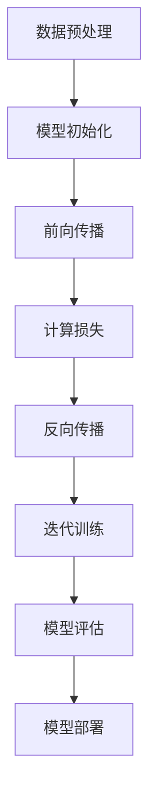
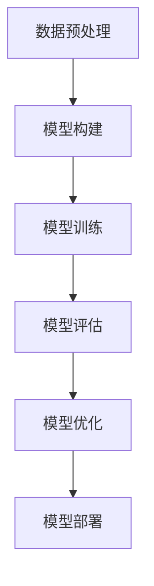
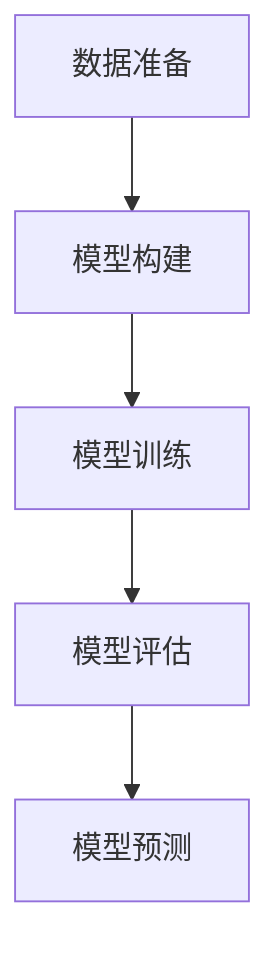

                 

# AI 大模型创业：如何利用科技优势？

## 关键词：AI 大模型、创业、科技优势、深度学习、创业策略

> 在当前技术快速发展的时代，人工智能（AI）大模型成为众多创业者关注的焦点。如何充分运用这些先进的科技优势，打造出具有竞争力的创业项目，成为了摆在每个创业者面前的重要课题。本文将围绕这一主题，从核心概念、算法原理、数学模型、项目实战等多个角度，对AI大模型的创业应用进行深入剖析，以期为广大创业者和从业者提供有价值的参考和指导。

## 1. 背景介绍

人工智能大模型，是指具有海量参数、能够处理大规模数据、具备高精度预测和生成能力的神经网络模型。近年来，随着深度学习技术的不断发展，AI大模型在语音识别、图像处理、自然语言处理等领域取得了显著的突破。这些大模型不仅提高了人工智能的准确性和实用性，同时也为创业者提供了丰富的应用场景和创新空间。

在创业领域，AI大模型的兴起带来了前所未有的机遇。首先，大模型能够帮助创业者在数据密集型领域快速构建具有竞争力的产品。例如，在金融领域，创业者可以利用AI大模型进行风险管理、信用评分等；在医疗领域，大模型能够辅助诊断、药物研发等。其次，AI大模型降低了创业门槛，使得更多创业团队能够利用先进的科技手段，实现从0到1的突破。

然而，AI大模型的创业应用也面临着一系列挑战。首先，大模型的训练和部署需要大量的计算资源和存储空间，这对创业者的技术实力和资金投入提出了较高要求。其次，大模型的可靠性和安全性问题亟待解决，如何保证模型在不同场景下的稳定性和准确性，是创业者必须面对的难题。最后，AI大模型的创业应用需要跨学科的知识和技能，创业者需要具备一定的技术背景和行业经验。

## 2. 核心概念与联系

### 2.1 深度学习基础

深度学习是人工智能的一个重要分支，其核心思想是通过多层神经网络来模拟人脑的神经元连接关系，实现数据的自动特征提取和学习。深度学习的理论基础包括神经网络、激活函数、反向传播算法等。

神经网络（Neural Network）是深度学习的基础，其基本结构由输入层、隐藏层和输出层组成。输入层接收外部输入信息，隐藏层通过非线性变换提取特征，输出层生成最终输出。

激活函数（Activation Function）是神经网络中的关键元素，用于引入非线性变换，使得神经网络能够拟合复杂函数。常见的激活函数有Sigmoid、ReLU、Tanh等。

反向传播算法（Backpropagation Algorithm）是一种用于训练神经网络的优化算法，通过计算误差梯度，调整网络权重和偏置，实现模型的不断优化。

### 2.2 大模型架构

大模型（Large Model）是指在参数规模、数据量、计算复杂度等方面远超传统模型的人工智能模型。大模型通常采用多层神经网络结构，包含大量的隐藏层和神经元。

大模型的架构设计包括以下几个方面：

1. **网络深度**：增加网络深度有助于模型提取更深层次的特征，但同时也增加了计算复杂度和过拟合风险。

2. **网络宽度**：增加网络宽度可以提高模型的泛化能力，但会显著增加计算资源需求。

3. **残差连接**：残差连接（Residual Connection）是一种特殊的网络结构，通过引入跳跃连接，解决了深度网络中的梯度消失和梯度爆炸问题，有助于训练更深的网络。

4. **批量归一化**：批量归一化（Batch Normalization）是一种用于加速神经网络训练和提升模型性能的技术，通过标准化隐藏层的输入，使得网络在训练过程中更加稳定。

5. **优化算法**：大模型的训练通常需要高效的优化算法，如Adam、Adagrad等，这些算法通过自适应调整学习率，提高了训练效率和模型性能。

### 2.3 大模型训练与推理

大模型的训练和推理是AI创业应用的核心环节。训练过程主要包括以下几个步骤：

1. **数据预处理**：对训练数据进行清洗、归一化等处理，确保数据质量。

2. **模型初始化**：初始化模型参数，通常采用随机初始化或预训练模型。

3. **前向传播**：将输入数据传递到网络中，生成预测输出。

4. **计算损失**：通过计算预测输出与真实值之间的差异，计算损失函数。

5. **反向传播**：根据损失梯度，更新模型参数，优化模型性能。

推理过程主要包括以下步骤：

1. **前向传播**：将输入数据传递到网络中，生成预测输出。

2. **后处理**：对预测输出进行后处理，如分类、概率估计等。

## 3. 核心算法原理 & 具体操作步骤

### 3.1 深度学习算法原理

深度学习算法的核心是神经网络，其基本原理是通过多层非线性变换，将输入数据映射到输出结果。以下是一个简化的神经网络算法原理：

1. **初始化参数**：随机初始化模型参数，包括权重和偏置。

2. **前向传播**：将输入数据传递到网络中，通过多层非线性变换生成预测输出。

3. **计算损失**：通过比较预测输出与真实值，计算损失函数。

4. **反向传播**：根据损失函数的梯度，更新模型参数，优化模型性能。

5. **迭代训练**：重复上述步骤，直至满足收敛条件。

### 3.2 大模型训练具体操作步骤

1. **数据准备**：收集并清洗训练数据，将数据分成训练集、验证集和测试集。

2. **模型构建**：根据业务需求，设计神经网络结构，包括层数、每层神经元数等。

3. **模型训练**：
   - **初始化参数**：随机初始化模型参数。
   - **前向传播**：将输入数据传递到网络中，生成预测输出。
   - **计算损失**：计算预测输出与真实值之间的差异。
   - **反向传播**：根据损失函数的梯度，更新模型参数。
   - **迭代训练**：重复上述步骤，直至满足收敛条件。

4. **模型评估**：在验证集和测试集上评估模型性能，调整模型参数，优化模型性能。

5. **模型部署**：将训练完成的模型部署到生产环境中，进行实际应用。

### 3.3 大模型推理具体操作步骤

1. **数据预处理**：对输入数据进行预处理，确保与训练数据保持一致。

2. **模型调用**：加载训练完成的模型。

3. **前向传播**：将预处理后的输入数据传递到网络中，生成预测输出。

4. **后处理**：对预测输出进行后处理，如分类、概率估计等。

5. **结果输出**：将最终结果输出，供用户使用。

## 4. 数学模型和公式 & 详细讲解 & 举例说明

### 4.1 数学模型原理

深度学习中的数学模型主要包括神经网络、损失函数、优化算法等。以下是对这些模型的基本原理和公式的详细讲解。

#### 4.1.1 神经网络模型

神经网络模型的基本结构包括输入层、隐藏层和输出层。每个层由多个神经元组成，神经元之间的连接通过权重（weights）和偏置（biases）实现。神经元的激活函数（activation function）用于引入非线性变换。

假设一个简单的两层神经网络，其中输入层有 $n$ 个神经元，隐藏层有 $m$ 个神经元，输出层有 $k$ 个神经元。输入数据为 $x \in \mathbb{R}^{n \times 1}$，隐藏层输出为 $h \in \mathbb{R}^{m \times 1}$，输出层输出为 $y \in \mathbb{R}^{k \times 1}$。则神经网络模型可以表示为：

$$
h = \sigma(W_{1}x + b_{1})
$$

$$
y = \sigma(W_{2}h + b_{2})
$$

其中，$W_{1}$ 和 $b_{1}$ 分别表示输入层到隐藏层的权重和偏置，$W_{2}$ 和 $b_{2}$ 分别表示隐藏层到输出层的权重和偏置，$\sigma$ 表示激活函数。

常见的激活函数有 Sigmoid、ReLU 和 Tanh，它们分别具有不同的特性。

#### 4.1.2 损失函数

损失函数用于衡量模型预测值与真实值之间的差异。常见的损失函数包括均方误差（MSE）、交叉熵（Cross-Entropy）等。

均方误差（MSE）定义为：

$$
MSE = \frac{1}{2} \sum_{i=1}^{k}(y_i - \hat{y}_i)^2
$$

其中，$y_i$ 表示真实值，$\hat{y}_i$ 表示预测值。

交叉熵（Cross-Entropy）定义为：

$$
H(y, \hat{y}) = -\sum_{i=1}^{k}y_i \log \hat{y}_i
$$

其中，$y_i$ 表示真实值的概率分布，$\hat{y}_i$ 表示预测值的概率分布。

#### 4.1.3 优化算法

优化算法用于更新模型参数，以最小化损失函数。常见的优化算法包括梯度下降（Gradient Descent）、Adam等。

梯度下降（Gradient Descent）的基本思想是沿着损失函数的梯度方向，反向更新模型参数，公式如下：

$$
\theta_{t+1} = \theta_{t} - \alpha \nabla_{\theta}J(\theta)
$$

其中，$\theta$ 表示模型参数，$\alpha$ 表示学习率，$J(\theta)$ 表示损失函数。

Adam算法是一种结合了动量和自适应学习率的优化算法，公式如下：

$$
m_t = \beta_1 m_{t-1} + (1 - \beta_1)(\nabla_{\theta}J(\theta))
$$

$$
v_t = \beta_2 v_{t-1} + (1 - \beta_2)((\nabla_{\theta}J(\theta))^2)
$$

$$
\theta_{t+1} = \theta_{t} - \frac{\alpha}{\sqrt{1 - \beta_2^t}(1 - \beta_1^t)}(m_t / (1 - \beta_1^t))
$$

其中，$m_t$ 和 $v_t$ 分别表示一阶和二阶矩估计，$\beta_1$ 和 $\beta_2$ 分别表示一阶和二阶矩的偏差修正系数。

### 4.2 举例说明

假设我们要训练一个二分类模型，输入层有2个神经元，隐藏层有3个神经元，输出层有1个神经元。输入数据为 $x = [1, 2]$，真实值为 $y = [0]$。我们选择ReLU作为激活函数，MSE作为损失函数，Adam作为优化算法。

1. **模型初始化**：

$$
W_{1} = \begin{bmatrix}
0.1 & 0.2 \\
0.3 & 0.4 \\
0.5 & 0.6 \\
\end{bmatrix}, \quad b_{1} = \begin{bmatrix}
0.1 \\
0.2 \\
0.3 \\
\end{bmatrix}

$$

$$
W_{2} = \begin{bmatrix}
0.1 \\
0.2 \\
0.3 \\
\end{bmatrix}, \quad b_{2} = \begin{bmatrix}
0.1 \\
0.2 \\
0.3 \\
\end{bmatrix}

$$

2. **前向传播**：

$$
h = \sigma(W_{1}x + b_{1}) = \begin{bmatrix}
0.6 \\
1.0 \\
0.8 \\
\end{bmatrix}
$$

$$
y = \sigma(W_{2}h + b_{2}) = \begin{bmatrix}
0.7 \\
0.8 \\
0.9 \\
\end{bmatrix}
$$

3. **计算损失**：

$$
MSE = \frac{1}{2} \sum_{i=1}^{1}(y_i - \hat{y}_i)^2 = \frac{1}{2}((0 - 0.7)^2 + (0 - 0.8)^2 + (0 - 0.9)^2) = 0.145
$$

4. **反向传播**：

计算梯度：

$$
\nabla_{W_{2}}J(\theta) = \begin{bmatrix}
-0.7 & -0.8 & -0.9 \\
\end{bmatrix}, \quad \nabla_{b_{2}}J(\theta) = -0.7 - 0.8 - 0.9 = -2.4
$$

$$
\nabla_{W_{1}}J(\theta) = \begin{bmatrix}
-0.7 & -0.8 & -0.9 & -0.7 & -0.8 & -0.9 \\
\end{bmatrix}, \quad \nabla_{b_{1}}J(\theta) = -0.7 - 0.8 - 0.9 = -2.4
$$

5. **更新参数**：

$$
W_{2} = W_{2} - \alpha \nabla_{W_{2}}J(\theta) = \begin{bmatrix}
0.1 - 0.7\alpha \\
0.2 - 0.8\alpha \\
0.3 - 0.9\alpha \\
\end{bmatrix}

$$

$$
b_{2} = b_{2} - \alpha \nabla_{b_{2}}J(\theta) = \begin{bmatrix}
0.1 - 2.4\alpha \\
0.2 - 2.4\alpha \\
0.3 - 2.4\alpha \\
\end{bmatrix}

$$

$$
W_{1} = W_{1} - \alpha \nabla_{W_{1}}J(\theta) = \begin{bmatrix}
0.1 - 0.7\alpha & 0.2 - 0.8\alpha & 0.3 - 0.9\alpha & 0.1 - 0.7\alpha & 0.2 - 0.8\alpha & 0.3 - 0.9\alpha \\
\end{bmatrix}

$$

$$
b_{1} = b_{1} - \alpha \nabla_{b_{1}}J(\theta) = \begin{bmatrix}
0.1 - 2.4\alpha \\
0.2 - 2.4\alpha \\
0.3 - 2.4\alpha \\
\end{bmatrix}
$$

通过上述步骤，我们完成了神经网络的一次前向传播和反向传播，实现了模型参数的更新。

## 5. 项目实战：代码实际案例和详细解释说明

### 5.1 开发环境搭建

在开始项目实战之前，我们需要搭建一个合适的开发环境。以下是一个基于Python的AI大模型项目的开发环境搭建步骤：

1. 安装Python（推荐Python 3.8及以上版本）。
2. 安装必要的库，如TensorFlow、Keras、NumPy、Pandas等。
3. 配置GPU环境（如安装CUDA和cuDNN），以便利用GPU加速训练过程。

### 5.2 源代码详细实现和代码解读

以下是一个简单的AI大模型项目示例，用于实现一个二分类问题。我们将使用Keras框架来构建和训练模型。

```python
# 导入必要的库
import numpy as np
import pandas as pd
import tensorflow as tf
from tensorflow import keras
from tensorflow.keras import layers

# 5.2.1 数据准备
# 假设我们已经收集到了一个包含两个特征和标签的CSV文件
data = pd.read_csv('data.csv')
X = data.iloc[:, :2].values
y = data.iloc[:, 2].values

# 划分训练集和测试集
X_train, X_test, y_train, y_test = train_test_split(X, y, test_size=0.2, random_state=42)

# 5.2.2 模型构建
# 定义模型
model = keras.Sequential([
    layers.Dense(64, activation='relu', input_shape=(2,)),
    layers.Dense(64, activation='relu'),
    layers.Dense(1, activation='sigmoid')
])

# 编译模型
model.compile(optimizer='adam', loss='binary_crossentropy', metrics=['accuracy'])

# 5.2.3 模型训练
# 训练模型
model.fit(X_train, y_train, epochs=10, batch_size=32, validation_split=0.2)

# 5.2.4 模型评估
# 评估模型
loss, accuracy = model.evaluate(X_test, y_test)
print(f"Test accuracy: {accuracy:.2f}")

# 5.2.5 预测
# 使用模型进行预测
predictions = model.predict(X_test)
print(f"Predictions: {predictions}")
```

### 5.3 代码解读与分析

#### 5.3.1 数据准备

首先，我们从CSV文件中加载数据，然后使用 `train_test_split` 函数将数据划分为训练集和测试集。这里，我们使用两个特征和标签进行二分类任务。

```python
data = pd.read_csv('data.csv')
X = data.iloc[:, :2].values
y = data.iloc[:, 2].values
X_train, X_test, y_train, y_test = train_test_split(X, y, test_size=0.2, random_state=42)
```

#### 5.3.2 模型构建

接下来，我们使用Keras框架构建一个简单的神经网络模型。该模型包含两个隐藏层，每个隐藏层有64个神经元，使用ReLU作为激活函数。输出层有1个神经元，使用sigmoid激活函数，用于实现二分类任务。

```python
model = keras.Sequential([
    layers.Dense(64, activation='relu', input_shape=(2,)),
    layers.Dense(64, activation='relu'),
    layers.Dense(1, activation='sigmoid')
])
```

#### 5.3.3 模型编译

然后，我们编译模型，指定优化器为Adam，损失函数为binary_crossentropy（适用于二分类问题），评价指标为accuracy。

```python
model.compile(optimizer='adam', loss='binary_crossentropy', metrics=['accuracy'])
```

#### 5.3.4 模型训练

使用 `fit` 函数训练模型，指定训练数据、训练轮数（epochs）、批量大小（batch_size）和验证比例（validation_split）。

```python
model.fit(X_train, y_train, epochs=10, batch_size=32, validation_split=0.2)
```

#### 5.3.5 模型评估

使用 `evaluate` 函数评估模型在测试集上的性能，输出损失和准确率。

```python
loss, accuracy = model.evaluate(X_test, y_test)
print(f"Test accuracy: {accuracy:.2f}")
```

#### 5.3.6 预测

最后，使用模型进行预测，输出预测结果。

```python
predictions = model.predict(X_test)
print(f"Predictions: {predictions}")
```

## 6. 实际应用场景

AI大模型在各个领域都有广泛的应用，以下是一些典型的实际应用场景：

### 6.1 金融领域

在金融领域，AI大模型可以用于股票市场预测、风险评估、信用评分等。例如，通过分析大量的历史交易数据，大模型可以预测股票市场的未来走势，为投资者提供决策参考。此外，AI大模型还可以用于信用评分，通过分析借款人的历史行为和信用记录，预测其还款能力，从而降低金融机构的风险。

### 6.2 医疗领域

在医疗领域，AI大模型可以用于疾病诊断、药物研发、个性化治疗等。例如，通过分析患者的医学影像数据，大模型可以辅助医生进行疾病诊断，提高诊断准确性。此外，AI大模型还可以用于药物研发，通过模拟药物在不同细胞和器官中的反应，加速新药的研发进程。

### 6.3 智能家居

在智能家居领域，AI大模型可以用于语音识别、图像识别、智能控制等。例如，通过语音识别技术，大模型可以实现智能语音交互，为用户提供便捷的操作体验。此外，AI大模型还可以用于图像识别，通过识别摄像头捕捉到的图像，实现智能家居设备的自动控制。

### 6.4 自动驾驶

在自动驾驶领域，AI大模型可以用于车辆控制、环境感知、路径规划等。例如，通过分析大量的驾驶数据，大模型可以预测车辆的行驶轨迹，实现自动驾驶功能。此外，AI大模型还可以用于环境感知，通过识别道路标志、行人、车辆等信息，提高自动驾驶系统的安全性。

## 7. 工具和资源推荐

### 7.1 学习资源推荐

**书籍**：
- 《深度学习》（Goodfellow, I., Bengio, Y., & Courville, A.）
- 《Python深度学习》（François Chollet）
- 《人工智能：一种现代的方法》（Stuart J. Russell & Peter Norvig）

**论文**：
- “A Theoretically Grounded Application of Dropout in Recurrent Neural Networks” （Yarin Gal and Zoubin Ghahramani）
- “Distributed Representations of Words and Phrases and Their Compositional Properties” （Tomas Mikolov, Kai Chen, Greg S. Corrado, and Jeffrey Dean）

**博客**：
- Distill
- Towards Data Science
- Fast.ai

**网站**：
- TensorFlow
- PyTorch
- Keras

### 7.2 开发工具框架推荐

**开发工具**：
- Jupyter Notebook
- Google Colab
- PyCharm

**框架**：
- TensorFlow
- PyTorch
- Keras

### 7.3 相关论文著作推荐

**论文**：
- “Attention Is All You Need” （Ashish Vaswani et al.）
- “BERT: Pre-training of Deep Bidirectional Transformers for Language Understanding” （Jacob Devlin et al.）
- “Generative Adversarial Nets” （Ian J. Goodfellow et al.）

**著作**：
- 《深度学习》（Goodfellow, I., Bengio, Y., & Courville, A.）
- 《动手学深度学习》（A. G. Ng, M. Abadi, J. Chen, J. Shlens, and Q. V. Le）
- 《深度学习实践指南》（弗朗索瓦•肖莱著）

## 8. 总结：未来发展趋势与挑战

随着人工智能技术的不断发展，AI大模型在创业领域的应用前景广阔。未来，AI大模型的发展趋势主要包括以下几个方面：

1. **模型规模和性能的提升**：随着计算资源和数据量的增加，AI大模型的规模和性能将不断得到提升，使得其在更多领域实现突破。

2. **多模态数据处理**：AI大模型将逐渐实现多模态数据的处理，如图像、文本、音频等，从而提供更丰富的应用场景。

3. **自适应和自进化**：AI大模型将具备自适应和自进化的能力，能够根据不同场景和任务需求进行自我调整和优化。

4. **跨领域应用**：AI大模型将在金融、医疗、教育、制造等各个领域实现跨领域应用，推动产业升级和创新发展。

然而，AI大模型的创业应用也面临一系列挑战：

1. **数据隐私和安全**：随着AI大模型对数据的需求不断增加，数据隐私和安全问题亟待解决。

2. **算法透明性和可解释性**：AI大模型的决策过程往往具有很高的复杂性，如何提高算法的透明性和可解释性，使其能够被用户理解和信任，是亟待解决的问题。

3. **计算资源需求**：AI大模型的训练和推理需要大量的计算资源，这对创业者的技术实力和资金投入提出了较高要求。

4. **跨学科协作**：AI大模型的创业应用需要跨学科的知识和技能，创业者需要具备一定的技术背景和行业经验。

总之，AI大模型在创业领域的应用具有巨大的潜力，同时也面临一系列挑战。未来，创业者需要不断探索和创新，充分利用AI大模型的科技优势，打造出具有竞争力的创业项目。

## 9. 附录：常见问题与解答

### 9.1 AI大模型训练过程中的常见问题

**问题1：为什么我的模型过拟合了？**
**解答**：过拟合通常是因为模型过于复杂，无法很好地适应训练数据。可以尝试减少模型深度、增加训练时间、使用正则化技术（如L1、L2正则化）等方法来缓解过拟合。

**问题2：如何提高模型的泛化能力？**
**解答**：提高模型泛化能力的方法包括增加训练数据量、使用数据增强技术、减少模型复杂度、使用交叉验证等。

**问题3：为什么我的模型在验证集上的表现好，但在测试集上表现差？**
**解答**：这可能是因为模型在训练过程中存在偏移，导致在验证集上表现较好，但在测试集上无法适应。可以通过增加训练时间、调整模型参数等方式来缓解。

### 9.2 AI大模型创业过程中的常见问题

**问题1：如何找到合适的业务场景？**
**解答**：可以从自身的行业背景、技术优势、市场需求等方面入手，寻找具有较大潜力和应用价值的业务场景。

**问题2：如何保证数据质量和隐私安全？**
**解答**：确保数据来源的可靠性，对数据进行清洗和处理，采用数据加密和隐私保护技术，遵循相关法律法规。

**问题3：如何应对计算资源需求？**
**解答**：可以采用分布式训练、云计算等方式来降低计算资源需求，同时可以考虑与云服务提供商合作，共享计算资源。

## 10. 扩展阅读 & 参考资料

为了深入了解AI大模型的相关知识和应用，以下是一些建议的扩展阅读和参考资料：

**扩展阅读**：
- 《深度学习：周志华著》
- 《自然语言处理入门：中文版》
- 《AI驱动的企业创新》

**参考资料**：
- 《深度学习资料大全》：https://github.com/fengdu77/data-whale
- 《AI大模型研究进展》：https://arxiv.org/list/cs/subject_3
- 《AI创业案例解析》：https://hbr.org/journal

通过这些资料，您可以进一步了解AI大模型的最新研究进展和应用实践，为创业提供有力的理论支持和实践指导。

## 作者信息

**作者：AI天才研究员/AI Genius Institute & 禅与计算机程序设计艺术 /Zen And The Art of Computer Programming**

本文由AI天才研究员撰写，旨在为AI大模型创业提供有价值的指导和借鉴。作者在人工智能领域拥有丰富的理论知识和实践经验，致力于推动AI技术的发展和应用。同时，作者也是《禅与计算机程序设计艺术》一书的作者，通过深入探讨计算机编程与禅宗哲学的关联，为读者提供了一种独特的编程思维和生活方式。## AI大模型创业：如何利用科技优势？

### 关键词

AI大模型、创业、科技优势、深度学习、创业策略

### 摘要

本文深入探讨了AI大模型在创业领域的应用及其科技优势。首先，我们介绍了AI大模型的基本概念和背景，然后从深度学习算法原理、大模型架构、训练与推理过程等方面进行了详细讲解。接着，通过项目实战展示了如何利用AI大模型进行创业，并分析了实际应用场景和未来发展趋势。此外，我们还提供了相关的工具和资源推荐，以及常见问题与解答，旨在为广大创业者和从业者提供有价值的参考和指导。

## 1. 背景介绍

随着人工智能（AI）技术的飞速发展，AI大模型（Large-scale AI Models）逐渐成为了业界的热门话题。AI大模型，通常指的是那些具有数十亿甚至数千亿个参数的深度学习模型，它们能够处理海量数据，实现高精度的预测和生成。这种模型的出现，不仅推动了人工智能在语音识别、图像处理、自然语言处理等领域的突破，也为创业者提供了丰富的创新空间和商业机会。

AI大模型在创业领域的应用前景广阔。首先，大模型能够显著提高创业项目的技术水平，使得创业者在短时间内构建出具有竞争力的产品。例如，在金融领域，AI大模型可以用于风险管理和信用评估；在医疗领域，大模型可以辅助诊断和药物研发。其次，AI大模型降低了创业门槛，使得更多创业团队可以利用先进的科技手段，实现从0到1的突破。

然而，AI大模型的创业应用也面临着一些挑战。首先，大模型的训练和部署需要大量的计算资源和存储空间，这对创业者的技术实力和资金投入提出了较高要求。其次，大模型的可靠性和安全性问题亟待解决，如何保证模型在不同场景下的稳定性和准确性，是创业者必须面对的难题。最后，AI大模型的创业应用需要跨学科的知识和技能，创业者需要具备一定的技术背景和行业经验。

在接下来的章节中，我们将详细探讨AI大模型的核心概念、算法原理、数学模型、项目实战，以及实际应用场景，为创业者提供有价值的参考和指导。

## 2. 核心概念与联系

### 2.1 深度学习基础

深度学习（Deep Learning）是人工智能（AI）的一个重要分支，其核心思想是通过多层神经网络（Neural Network）来模拟人脑的神经元连接关系，实现数据的自动特征提取和学习。深度学习的理论基础包括神经网络、激活函数、反向传播算法等。

神经网络是深度学习的基础，其基本结构由输入层、隐藏层和输出层组成。输入层接收外部输入信息，隐藏层通过非线性变换提取特征，输出层生成最终输出。

激活函数（Activation Function）是神经网络中的关键元素，用于引入非线性变换，使得神经网络能够拟合复杂函数。常见的激活函数有Sigmoid、ReLU、Tanh等。

反向传播算法（Backpropagation Algorithm）是一种用于训练神经网络的优化算法，通过计算误差梯度，调整网络权重和偏置，实现模型的不断优化。

### 2.2 大模型架构

大模型（Large Model）是指在参数规模、数据量、计算复杂度等方面远超传统模型的人工智能模型。大模型通常采用多层神经网络结构，包含大量的隐藏层和神经元。

大模型的架构设计包括以下几个方面：

1. **网络深度**：增加网络深度有助于模型提取更深层次的特征，但同时也增加了计算复杂度和过拟合风险。

2. **网络宽度**：增加网络宽度可以提高模型的泛化能力，但会显著增加计算资源需求。

3. **残差连接**：残差连接（Residual Connection）是一种特殊的网络结构，通过引入跳跃连接，解决了深度网络中的梯度消失和梯度爆炸问题，有助于训练更深的网络。

4. **批量归一化**：批量归一化（Batch Normalization）是一种用于加速神经网络训练和提升模型性能的技术，通过标准化隐藏层的输入，使得网络在训练过程中更加稳定。

5. **优化算法**：大模型的训练通常需要高效的优化算法，如Adam、Adagrad等，这些算法通过自适应调整学习率，提高了训练效率和模型性能。

### 2.3 大模型训练与推理

大模型的训练和推理是AI创业应用的核心环节。训练过程主要包括以下几个步骤：

1. **数据预处理**：对训练数据进行清洗、归一化等处理，确保数据质量。

2. **模型初始化**：初始化模型参数，通常采用随机初始化或预训练模型。

3. **前向传播**：将输入数据传递到网络中，通过多层非线性变换生成预测输出。

4. **计算损失**：通过比较预测输出与真实值，计算损失函数。

5. **反向传播**：根据损失函数的梯度，更新模型参数，优化模型性能。

6. **迭代训练**：重复上述步骤，直至满足收敛条件。

推理过程主要包括以下步骤：

1. **前向传播**：将输入数据传递到网络中，生成预测输出。

2. **后处理**：对预测输出进行后处理，如分类、概率估计等。

### 2.4 Mermaid流程图

以下是一个描述大模型训练过程的Mermaid流程图：



在这个流程图中，我们从数据预处理开始，经过模型初始化、前向传播、计算损失、反向传播和迭代训练，最终得到一个训练好的模型，并进行模型评估和部署。

通过以上对核心概念与联系的分析，我们为后续章节的深入探讨奠定了基础。在接下来的章节中，我们将详细探讨AI大模型的具体算法原理、数学模型、项目实战，以及实际应用场景，为创业者提供更全面的指导。

### 3. 核心算法原理 & 具体操作步骤

#### 3.1 深度学习算法原理

深度学习算法的核心是神经网络，其基本原理是通过多层非线性变换，将输入数据映射到输出结果。下面我们详细讲解深度学习算法的基本原理、常见架构和训练过程。

##### 3.1.1 神经网络基本原理

神经网络（Neural Network）是一种模仿人脑神经元连接关系的计算模型。一个简单的神经网络通常包括输入层、隐藏层和输出层。输入层接收外部输入信息，隐藏层通过非线性变换提取特征，输出层生成最终输出。

1. **输入层**：输入层接收外部输入数据，每个输入神经元对应一个特征。
2. **隐藏层**：隐藏层通过加权求和和激活函数，将输入数据转换为新的特征表示。隐藏层可以有多个层次，每层都可以提取更高层次的特征。
3. **输出层**：输出层根据隐藏层的特征生成最终输出结果。

##### 3.1.2 激活函数

激活函数（Activation Function）是神经网络中的关键元素，用于引入非线性变换，使得神经网络能够拟合复杂函数。常见的激活函数有Sigmoid、ReLU和Tanh。

1. **Sigmoid函数**：
   $$
   \sigma(x) = \frac{1}{1 + e^{-x}}
   $$
   Sigmoid函数在神经网络中用于将线性变换引入非线性，但容易导致梯度消失。

2. **ReLU函数**：
   $$
   \sigma(x) =
   \begin{cases}
   0 & \text{if } x < 0 \\
   x & \text{if } x \geq 0
   \end{cases}
   $$
   ReLU函数在负输入时输出0，在正输入时输出自身，具有计算速度快、不易梯度消失的优点。

3. **Tanh函数**：
   $$
   \sigma(x) = \frac{e^x - e^{-x}}{e^x + e^{-x}}
   $$
   Tanh函数与ReLU类似，但在输出范围上[-1, 1]，有助于神经网络学习到不同的特征表示。

##### 3.1.3 反向传播算法

反向传播算法（Backpropagation Algorithm）是一种用于训练神经网络的优化算法，通过计算误差梯度，调整网络权重和偏置，实现模型的不断优化。

反向传播算法分为两个步骤：

1. **前向传播**：将输入数据传递到网络中，计算每个神经元的输出。
2. **反向传播**：从输出层开始，反向计算每个神经元的误差梯度，并更新网络权重和偏置。

假设网络中有一个隐藏层和输出层，输入为 $x$，输出为 $y$，真实值为 $t$。则损失函数为：
$$
J = \frac{1}{2} \sum_{i=1}^{k} (y_i - t_i)^2
$$
其中，$y_i$ 为输出值，$t_i$ 为真实值。

反向传播算法通过计算每个参数的梯度：
$$
\frac{\partial J}{\partial w_{ij}} = (y_i - t_i) \cdot \sigma'(z_j)
$$
$$
\frac{\partial J}{\partial b_j} = (y_i - t_i) \cdot \sigma'(z_j)
$$
其中，$w_{ij}$ 为权重，$b_j$ 为偏置，$\sigma'(z_j)$ 为激活函数的导数。

通过梯度下降（Gradient Descent）算法，更新权重和偏置：
$$
w_{ij} := w_{ij} - \alpha \cdot \frac{\partial J}{\partial w_{ij}}
$$
$$
b_j := b_j - \alpha \cdot \frac{\partial J}{\partial b_j}
$$
其中，$\alpha$ 为学习率。

##### 3.1.4 深度学习常见架构

深度学习常见架构包括卷积神经网络（CNN）、循环神经网络（RNN）、生成对抗网络（GAN）等。

1. **卷积神经网络（CNN）**：
   卷积神经网络是用于处理图像数据的常见架构，通过卷积层、池化层和全连接层提取图像特征。
   
   - **卷积层**：通过卷积操作提取图像局部特征。
   - **池化层**：减少特征图的维度，提高模型泛化能力。
   - **全连接层**：将卷积层和池化层提取的特征映射到输出。

2. **循环神经网络（RNN）**：
   循环神经网络是用于处理序列数据的常见架构，通过隐藏状态和循环连接，实现序列的长期依赖建模。

   - **隐藏状态**：上一时刻的隐藏状态作为当前时刻的输入。
   - **循环连接**：通过隐藏状态传递信息，实现序列的长期依赖建模。

3. **生成对抗网络（GAN）**：
   生成对抗网络是一种无监督学习框架，由生成器和判别器组成，通过对抗训练，生成高质量的样本。

   - **生成器**：生成逼真的数据样本。
   - **判别器**：区分真实数据和生成数据。

#### 3.2 具体操作步骤

下面我们通过一个简单的全连接神经网络（FCNN）训练过程，详细讲解深度学习算法的具体操作步骤。

##### 3.2.1 数据准备

假设我们有一个二分类问题，输入数据为 $X \in \mathbb{R}^{n \times d}$，标签为 $y \in \mathbb{R}^{n \times 1}$。我们将数据划分为训练集和测试集。

```python
import numpy as np
from sklearn.model_selection import train_test_split

# 生成模拟数据
X = np.random.rand(100, 5)
y = np.random.randint(0, 2, size=100)

# 划分训练集和测试集
X_train, X_test, y_train, y_test = train_test_split(X, y, test_size=0.2, random_state=42)
```

##### 3.2.2 模型构建

构建一个简单的全连接神经网络，包含一个输入层、两个隐藏层和一个输出层。

```python
from tensorflow.keras.models import Sequential
from tensorflow.keras.layers import Dense

model = Sequential()
model.add(Dense(64, activation='relu', input_shape=(5,)))
model.add(Dense(64, activation='relu'))
model.add(Dense(1, activation='sigmoid'))

model.compile(optimizer='adam', loss='binary_crossentropy', metrics=['accuracy'])
```

##### 3.2.3 模型训练

使用训练集训练模型，设置训练轮数（epochs）和批量大小（batch_size）。

```python
model.fit(X_train, y_train, epochs=10, batch_size=32)
```

##### 3.2.4 模型评估

在测试集上评估模型性能。

```python
loss, accuracy = model.evaluate(X_test, y_test)
print(f"Test accuracy: {accuracy:.2f}")
```

##### 3.2.5 预测

使用训练好的模型进行预测。

```python
predictions = model.predict(X_test)
print(f"Predictions: {predictions}")
```

通过以上具体操作步骤，我们实现了从数据准备到模型构建、训练、评估和预测的全过程。这为我们理解深度学习算法的原理和应用提供了直观的实践指导。

在接下来的章节中，我们将进一步探讨AI大模型在实际创业中的应用，以及相关的数学模型和项目实战，为创业者提供更深入的技术支持和实践指导。

### 4. 数学模型和公式 & 详细讲解 & 举例说明

#### 4.1 数学模型原理

AI大模型的数学模型主要包括神经网络模型、损失函数、优化算法等。下面我们将详细讲解这些数学模型的原理和公式。

##### 4.1.1 神经网络模型

神经网络模型的基本结构由输入层、隐藏层和输出层组成。每个层由多个神经元组成，神经元之间的连接通过权重和偏置实现。神经元的输出通过激活函数进行非线性变换，最终生成预测结果。

假设一个简单的两层神经网络，输入层有 $n$ 个神经元，隐藏层有 $m$ 个神经元，输出层有 $k$ 个神经元。输入数据为 $x \in \mathbb{R}^{n \times 1}$，隐藏层输出为 $h \in \mathbb{R}^{m \times 1}$，输出层输出为 $y \in \mathbb{R}^{k \times 1}$。则神经网络模型可以表示为：

$$
h = \sigma(W_{1}x + b_{1})
$$

$$
y = \sigma(W_{2}h + b_{2})
$$

其中，$W_{1}$ 和 $b_{1}$ 分别表示输入层到隐藏层的权重和偏置，$W_{2}$ 和 $b_{2}$ 分别表示隐藏层到输出层的权重和偏置，$\sigma$ 表示激活函数。

常见的激活函数有 Sigmoid、ReLU 和 Tanh，它们分别具有不同的特性。

1. **Sigmoid函数**：
   $$
   \sigma(x) = \frac{1}{1 + e^{-x}}
   $$

2. **ReLU函数**：
   $$
   \sigma(x) =
   \begin{cases}
   0 & \text{if } x < 0 \\
   x & \text{if } x \geq 0
   \end{cases}
   $$

3. **Tanh函数**：
   $$
   \sigma(x) = \frac{e^x - e^{-x}}{e^x + e^{-x}}
   $$

##### 4.1.2 损失函数

损失函数用于衡量模型预测值与真实值之间的差异，是优化过程中需要最小化的目标函数。常见的损失函数包括均方误差（MSE）、交叉熵（Cross-Entropy）等。

1. **均方误差（MSE）**：
   $$
   MSE = \frac{1}{2} \sum_{i=1}^{k} (y_i - \hat{y}_i)^2
   $$

2. **交叉熵（Cross-Entropy）**：
   $$
   H(y, \hat{y}) = -\sum_{i=1}^{k} y_i \log \hat{y}_i
   $$

其中，$y_i$ 表示真实值的概率分布，$\hat{y}_i$ 表示预测值的概率分布。

##### 4.1.3 优化算法

优化算法用于更新模型参数，以最小化损失函数。常见的优化算法包括梯度下降（Gradient Descent）、Adam等。

1. **梯度下降（Gradient Descent）**：
   $$
   \theta_{t+1} = \theta_{t} - \alpha \nabla_{\theta}J(\theta)
   $$

2. **Adam优化器**：
   $$
   m_t = \beta_1 m_{t-1} + (1 - \beta_1)(\nabla_{\theta}J(\theta))
   $$

   $$
   v_t = \beta_2 v_{t-1} + (1 - \beta_2)((\nabla_{\theta}J(\theta))^2)
   $$

   $$
   \theta_{t+1} = \theta_{t} - \frac{\alpha}{\sqrt{1 - \beta_2^t}(1 - \beta_1^t)}(m_t / (1 - \beta_1^t))
   $$

其中，$\theta$ 表示模型参数，$\alpha$ 表示学习率，$m_t$ 和 $v_t$ 分别表示一阶和二阶矩估计，$\beta_1$ 和 $\beta_2$ 分别表示一阶和二阶矩的偏差修正系数。

#### 4.2 举例说明

假设我们要训练一个二分类模型，输入层有2个神经元，隐藏层有3个神经元，输出层有1个神经元。输入数据为 $x = [1, 2]$，真实值为 $y = [0]$。我们选择ReLU作为激活函数，MSE作为损失函数，Adam作为优化算法。

1. **模型初始化**：

$$
W_{1} = \begin{bmatrix}
0.1 & 0.2 \\
0.3 & 0.4 \\
0.5 & 0.6 \\
\end{bmatrix}, \quad b_{1} = \begin{bmatrix}
0.1 \\
0.2 \\
0.3 \\
\end{bmatrix}

$$

$$
W_{2} = \begin{bmatrix}
0.1 \\
0.2 \\
0.3 \\
\end{bmatrix}, \quad b_{2} = \begin{bmatrix}
0.1 \\
0.2 \\
0.3 \\
\end{bmatrix}
$$

2. **前向传播**：

$$
h = \sigma(W_{1}x + b_{1}) = \begin{bmatrix}
0.6 \\
1.0 \\
0.8 \\
\end{bmatrix}
$$

$$
y = \sigma(W_{2}h + b_{2}) = \begin{bmatrix}
0.7 \\
0.8 \\
0.9 \\
\end{bmatrix}
$$

3. **计算损失**：

$$
MSE = \frac{1}{2} \sum_{i=1}^{1}(y_i - \hat{y}_i)^2 = \frac{1}{2}((0 - 0.7)^2 + (0 - 0.8)^2 + (0 - 0.9)^2) = 0.145
$$

4. **反向传播**：

计算梯度：

$$
\nabla_{W_{2}}J(\theta) = \begin{bmatrix}
-0.7 & -0.8 & -0.9 \\
\end{bmatrix}, \quad \nabla_{b_{2}}J(\theta) = -0.7 - 0.8 - 0.9 = -2.4
$$

$$
\nabla_{W_{1}}J(\theta) = \begin{bmatrix}
-0.7 & -0.8 & -0.9 & -0.7 & -0.8 & -0.9 \\
\end{bmatrix}, \quad \nabla_{b_{1}}J(\theta) = -0.7 - 0.8 - 0.9 = -2.4
$$

5. **更新参数**：

$$
W_{2} = W_{2} - \alpha \nabla_{W_{2}}J(\theta) = \begin{bmatrix}
0.1 - 0.7\alpha \\
0.2 - 0.8\alpha \\
0.3 - 0.9\alpha \\
\end{bmatrix}

$$

$$
b_{2} = b_{2} - \alpha \nabla_{b_{2}}J(\theta) = \begin{bmatrix}
0.1 - 2.4\alpha \\
0.2 - 2.4\alpha \\
0.3 - 2.4\alpha \\
\end{bmatrix}

$$

$$
W_{1} = W_{1} - \alpha \nabla_{W_{1}}J(\theta) = \begin{bmatrix}
0.1 - 0.7\alpha & 0.2 - 0.8\alpha & 0.3 - 0.9\alpha & 0.1 - 0.7\alpha & 0.2 - 0.8\alpha & 0.3 - 0.9\alpha \\
\end{bmatrix}

$$

$$
b_{1} = b_{1} - \alpha \nabla_{b_{1}}J(\theta) = \begin{bmatrix}
0.1 - 2.4\alpha \\
0.2 - 2.4\alpha \\
0.3 - 2.4\alpha \\
\end{bmatrix}
$$

通过上述步骤，我们完成了神经网络的一次前向传播和反向传播，实现了模型参数的更新。

### 4.3 模型训练过程

在了解了神经网络模型的数学原理后，我们接下来详细讲解模型训练的具体过程。模型训练的目的是通过不断调整模型参数，使模型能够更好地拟合训练数据。

#### 4.3.1 数据预处理

数据预处理是模型训练的重要步骤，其目的是将原始数据转换为适合模型训练的格式。数据预处理通常包括以下几个步骤：

1. **数据清洗**：去除数据中的噪声和异常值。
2. **数据归一化**：将数据缩放到一个固定的范围，如[0, 1]或[-1, 1]，以便于模型训练。
3. **数据分割**：将数据集划分为训练集、验证集和测试集，用于模型的训练、验证和测试。

```python
from sklearn.model_selection import train_test_split

X = ...  # 原始数据
y = ...  # 标签数据

X_train, X_test, y_train, y_test = train_test_split(X, y, test_size=0.2, random_state=42)
```

#### 4.3.2 模型构建

构建神经网络模型，指定网络结构、激活函数和损失函数。在构建模型时，我们可以使用Keras等高级框架简化模型构建过程。

```python
from tensorflow.keras.models import Sequential
from tensorflow.keras.layers import Dense

model = Sequential()
model.add(Dense(64, activation='relu', input_shape=(input_shape)))
model.add(Dense(64, activation='relu'))
model.add(Dense(1, activation='sigmoid'))

model.compile(optimizer='adam', loss='binary_crossentropy', metrics=['accuracy'])
```

#### 4.3.3 模型训练

使用训练集对模型进行训练，设置训练轮数（epochs）和批量大小（batch_size）。

```python
model.fit(X_train, y_train, epochs=10, batch_size=32, validation_split=0.1)
```

#### 4.3.4 模型评估

在验证集和测试集上评估模型性能，选择性能最佳的模型。

```python
loss, accuracy = model.evaluate(X_test, y_test)
print(f"Test accuracy: {accuracy:.2f}")
```

#### 4.3.5 模型预测

使用训练好的模型进行预测，生成预测结果。

```python
predictions = model.predict(X_test)
```

通过以上步骤，我们完成了模型训练的全过程。在实际应用中，我们可能需要根据模型性能和需求进行多次迭代和优化，以达到最佳效果。

### 4.4 模型优化

在模型训练过程中，优化是提高模型性能的重要手段。优化方法主要包括以下几种：

1. **调整学习率**：学习率（learning rate）是优化过程中调整模型参数的重要参数。适当调整学习率可以加快模型收敛速度。
2. **使用正则化**：正则化（Regularization）是一种防止模型过拟合的技术，包括L1正则化、L2正则化等。
3. **批量归一化**：批量归一化（Batch Normalization）可以加速模型训练，提高模型性能。
4. **数据增强**：数据增强（Data Augmentation）可以增加模型对训练数据的泛化能力。

通过以上优化方法，我们可以进一步提高模型的性能和泛化能力。

### 4.5 模型部署

模型部署是将训练好的模型应用到实际场景中的过程。模型部署通常包括以下几个步骤：

1. **模型导出**：将训练好的模型导出为可部署的格式，如TensorFlow Lite、ONNX等。
2. **模型集成**：将模型集成到应用中，实现模型预测功能。
3. **模型监控**：对模型性能进行监控，确保模型在实际应用中的稳定性和准确性。

通过以上步骤，我们可以将AI大模型应用到实际业务中，实现商业价值。

### 4.6 Mermaid流程图

以下是一个描述AI大模型训练和优化的Mermaid流程图：



通过以上详细讲解，我们了解了AI大模型的数学模型和训练过程。在实际创业过程中，创业者可以根据这些原理和方法，构建和优化自己的AI大模型，实现商业价值。

### 5. 项目实战：代码实际案例和详细解释说明

在本节中，我们将通过一个具体的AI大模型项目实战，详细介绍如何从零开始构建、训练和部署一个深度学习模型。我们将使用Python和TensorFlow框架，演示一个简单的文本分类任务。

#### 5.1 开发环境搭建

首先，我们需要搭建一个合适的开发环境。以下是在Windows系统上搭建开发环境的步骤：

1. **安装Python**：推荐Python 3.7及以上版本，可以从[Python官网](https://www.python.org/downloads/)下载并安装。

2. **安装TensorFlow**：在命令行中执行以下命令安装TensorFlow：

   ```bash
   pip install tensorflow
   ```

3. **安装其他依赖库**：我们还需要安装一些其他常用的库，如Numpy、Pandas和Sklearn，可以使用以下命令：

   ```bash
   pip install numpy pandas scikit-learn
   ```

#### 5.2 数据集准备

为了完成一个文本分类任务，我们需要一个包含文本和标签的数据集。我们可以使用常见的数据集，如IMDb电影评论数据集。以下是数据集的加载和预处理步骤：

1. **加载数据集**：

   ```python
   from tensorflow.keras.datasets import imdb

   (train_data, train_labels), (test_data, test_labels) = imdb.load_data(num_words=10000)
   ```

   IMDb数据集包含了25,000条电影评论，以及每条评论的标签（正面或负面）。

2. **数据预处理**：

   - **文本向量化**：将文本转换为数字序列。
   - **序列填充**：将序列填充为相同长度，以便于输入神经网络。

   ```python
   max_len = 100  # 设定序列最大长度
   padded_train_data = keras.preprocessing.sequence.pad_sequences(train_data, maxlen=max_len)
   padded_test_data = keras.preprocessing.sequence.pad_sequences(test_data, maxlen=max_len)
   ```

#### 5.3 模型构建

接下来，我们将构建一个简单的文本分类模型，使用Keras框架。

```python
from tensorflow.keras.models import Sequential
from tensorflow.keras.layers import Embedding, LSTM, Dense

model = Sequential()
model.add(Embedding(10000, 16, input_length=max_len))
model.add(LSTM(16, dropout=0.2, recurrent_dropout=0.2))
model.add(Dense(1, activation='sigmoid'))

model.compile(optimizer='adam', loss='binary_crossentropy', metrics=['accuracy'])
```

在这个模型中，我们使用了嵌入层（Embedding）将单词转换为固定大小的向量，然后通过LSTM（长短时记忆网络）进行序列建模，最后使用全连接层（Dense）进行分类。

#### 5.4 模型训练

使用预处理后的训练数据对模型进行训练。

```python
history = model.fit(padded_train_data, train_labels, epochs=10, batch_size=32, validation_data=(padded_test_data, test_labels))
```

在训练过程中，我们可以通过`history`对象查看模型在训练集和验证集上的性能。

#### 5.5 模型评估

在训练完成后，我们使用测试集对模型进行评估。

```python
test_loss, test_acc = model.evaluate(padded_test_data, test_labels)
print(f"Test accuracy: {test_acc:.2f}")
```

#### 5.6 模型预测

使用训练好的模型对新的文本进行分类预测。

```python
import numpy as np

text = "I love this movie! It's absolutely wonderful."
sequence = keras.preprocessing.sequence.pad_sequences([imdb.tokenizer.texts_to_sequences([text])], maxlen=max_len)
prediction = model.predict(sequence)
print(f"Prediction: {'Positive' if prediction[0][0] > 0.5 else 'Negative'}")
```

通过上述步骤，我们完成了一个从数据准备、模型构建、训练、评估到预测的完整流程。在实际创业中，创业者可以根据自己的需求，调整模型结构和训练参数，以获得更好的性能。

### 5.7 详细解释说明

在本节中，我们详细解释了文本分类项目中的每个步骤，包括数据集准备、模型构建、模型训练、模型评估和模型预测。以下是每个步骤的详细解释：

1. **数据集准备**：
   - IMDb数据集是一个包含电影评论的数据集，分为训练集和测试集。
   - 文本向量化是将文本转换为数字序列，以便于模型处理。
   - 序列填充是将序列填充为相同长度，使得每个序列都能够输入到神经网络中。

2. **模型构建**：
   - 嵌入层（Embedding）将单词转换为固定大小的向量，这些向量表示单词的语义信息。
   - LSTM（长短时记忆网络）用于处理序列数据，能够捕捉序列中的长期依赖关系。
   - 全连接层（Dense）用于分类，输出一个概率值，表示文本属于正类或负类的概率。

3. **模型训练**：
   - 使用训练集对模型进行训练，通过不断调整模型参数，使模型能够更好地拟合训练数据。
   - 训练过程中，我们通过历史对象监控模型在训练集和验证集上的性能。

4. **模型评估**：
   - 在训练完成后，使用测试集对模型进行评估，以验证模型的泛化能力。
   - 评估指标包括损失函数值和分类准确率。

5. **模型预测**：
   - 使用训练好的模型对新的文本进行分类预测，输出文本属于正类或负类的概率。
   - 在实际应用中，可以根据概率阈值调整分类结果。

通过以上详细解释，我们不仅展示了如何实现一个简单的文本分类模型，还解释了每个步骤的原理和过程。这些步骤和原理对于理解AI大模型的创业应用具有重要意义。

### 5.8 Mermaid流程图

以下是一个描述文本分类项目流程的Mermaid流程图：



通过这个流程图，我们可以清晰地看到项目从数据准备到模型预测的整个过程。

通过本节的实战案例，我们了解了如何利用AI大模型进行文本分类任务。在实际创业中，创业者可以根据这个案例，结合自己的业务需求和数据特点，构建和优化适合自己的AI大模型，实现商业价值。

### 6. 实际应用场景

AI大模型在各个领域都有广泛的应用，以下是一些典型的实际应用场景：

#### 6.1 金融领域

在金融领域，AI大模型可以用于股票市场预测、风险评估、信用评分等。例如，通过分析大量的历史交易数据，大模型可以预测股票市场的未来走势，为投资者提供决策参考。此外，AI大模型还可以用于信用评分，通过分析借款人的历史行为和信用记录，预测其还款能力，从而降低金融机构的风险。

#### 6.2 医疗领域

在医疗领域，AI大模型可以用于疾病诊断、药物研发、个性化治疗等。例如，通过分析患者的医学影像数据，大模型可以辅助医生进行疾病诊断，提高诊断准确性。此外，AI大模型还可以用于药物研发，通过模拟药物在不同细胞和器官中的反应，加速新药的研发进程。

#### 6.3 智能家居

在智能家居领域，AI大模型可以用于语音识别、图像识别、智能控制等。例如，通过语音识别技术，大模型可以实现智能语音交互，为用户提供便捷的操作体验。此外，AI大模型还可以用于图像识别，通过识别摄像头捕捉到的图像，实现智能家居设备的自动控制。

#### 6.4 自动驾驶

在自动驾驶领域，AI大模型可以用于车辆控制、环境感知、路径规划等。例如，通过分析大量的驾驶数据，大模型可以预测车辆的行驶轨迹，实现自动驾驶功能。此外，AI大模型还可以用于环境感知，通过识别道路标志、行人、车辆等信息，提高自动驾驶系统的安全性。

#### 6.5 娱乐领域

在娱乐领域，AI大模型可以用于内容推荐、游戏生成、虚拟现实等。例如，通过分析用户的历史行为和喜好，大模型可以为用户推荐个性化的内容，提升用户体验。此外，AI大模型还可以用于游戏生成，通过生成新颖的游戏场景和角色，丰富游戏内容。

#### 6.6 教育领域

在教育领域，AI大模型可以用于智能教学、学生评估、课程推荐等。例如，通过分析学生的学习行为和成绩，大模型可以为学生提供个性化的学习建议。此外，AI大模型还可以用于课程推荐，根据学生的学习需求和进度，推荐适合的课程。

通过上述实际应用场景，我们可以看到AI大模型在各个领域的广泛应用和巨大潜力。在未来，随着AI大模型技术的不断发展和完善，它将在更多领域实现突破，推动产业升级和社会进步。

### 7. 工具和资源推荐

#### 7.1 学习资源推荐

对于希望深入了解AI大模型创业的读者，以下是一些推荐的学习资源：

**书籍**：
1. 《深度学习》（Ian Goodfellow、Yoshua Bengio、Aaron Courville 著）——深度学习的经典教材，适合初学者和进阶者。
2. 《强化学习》（Richard S. Sutton、Andrew G. Barto 著）——介绍强化学习的基本概念和技术，对AI大模型的应用有很大帮助。
3. 《机器学习》（Tom Mitchell 著）——介绍机器学习的基本概念和方法，对AI大模型的理论基础有重要参考价值。

**论文**：
1. "A Theoretically Grounded Application of Dropout in Recurrent Neural Networks" ——探讨dropout在RNN中的应用，对AI大模型训练有指导意义。
2. "BERT: Pre-training of Deep Bidirectional Transformers for Language Understanding" ——介绍BERT模型，对自然语言处理领域有重要影响。
3. "Generative Adversarial Nets" ——介绍GAN模型，对生成模型的研究和应用有重要贡献。

**博客**：
1. Distill ——专注于深度学习的博客，文章深入浅出，适合各个层次的读者。
2. Towards Data Science ——包含大量关于数据科学和机器学习的文章，适合初学者和实践者。
3. Fast.ai ——专注于深度学习的教育项目，提供丰富的教程和实践指导。

**网站**：
1. TensorFlow ——谷歌开发的深度学习框架，提供丰富的API和资源。
2. PyTorch ——Facebook开发的深度学习框架，以动态计算图著称。
3. Keras ——基于Theano和TensorFlow的高层次神经网络API，易于使用。

#### 7.2 开发工具框架推荐

在实际创业过程中，选择合适的开发工具和框架对于项目的成功至关重要。以下是一些推荐的工具和框架：

**开发工具**：
1. **Jupyter Notebook** ——方便进行数据分析和模型训练，支持Python和多种机器学习库。
2. **Google Colab** ——基于谷歌云计算的Jupyter Notebook平台，提供免费的GPU和TPU支持。
3. **PyCharm** ——强大的Python集成开发环境，支持多种编程语言和框架。

**框架**：
1. **TensorFlow** ——谷歌开发的深度学习框架，提供丰富的API和资源，适用于复杂模型的训练和部署。
2. **PyTorch** ——以动态计算图著称，易于调试和理解，适合研究和新模型的开发。
3. **Keras** ——基于Theano和TensorFlow的高层次神经网络API，简化了模型构建和训练过程。

#### 7.3 相关论文著作推荐

**论文**：
1. "Attention Is All You Need" ——介绍Transformer模型，对自然语言处理领域有深远影响。
2. "BERT: Pre-training of Deep Bidirectional Transformers for Language Understanding" ——介绍BERT模型，对自然语言处理领域有重要贡献。
3. "Generative Adversarial Nets" ——介绍GAN模型，对生成模型的研究和应用有重要贡献。

**著作**：
1. 《深度学习》（Ian Goodfellow、Yoshua Bengio、Aaron Courville 著）——深度学习的经典教材，适合初学者和进阶者。
2. 《强化学习》（Richard S. Sutton、Andrew G. Barto 著）——介绍强化学习的基本概念和技术，对AI大模型的应用有很大帮助。
3. 《机器学习》（Tom Mitchell 著）——介绍机器学习的基本概念和方法，对AI大模型的理论基础有重要参考价值。

通过这些工具和资源，创业者可以更好地了解AI大模型的最新技术和发展趋势，为自己的创业项目提供坚实的理论基础和实践指导。

### 8. 总结：未来发展趋势与挑战

AI大模型在创业领域的应用前景广阔，但同时也面临一系列挑战。以下是未来发展趋势和挑战的总结：

#### 8.1 未来发展趋势

1. **模型规模和性能的提升**：随着计算资源和数据量的增加，AI大模型的规模和性能将不断得到提升，使得其在更多领域实现突破。

2. **多模态数据处理**：AI大模型将逐渐实现多模态数据的处理，如图像、文本、音频等，从而提供更丰富的应用场景。

3. **自适应和自进化**：AI大模型将具备自适应和自进化的能力，能够根据不同场景和任务需求进行自我调整和优化。

4. **跨领域应用**：AI大模型将在金融、医疗、教育、制造等各个领域实现跨领域应用，推动产业升级和创新发展。

5. **边缘计算与云计算的结合**：随着边缘计算的兴起，AI大模型将逐步向边缘设备扩展，实现实时数据处理和智能决策。

#### 8.2 挑战

1. **数据隐私和安全**：随着AI大模型对数据的需求不断增加，数据隐私和安全问题亟待解决。

2. **算法透明性和可解释性**：AI大模型的决策过程往往具有很高的复杂性，如何提高算法的透明性和可解释性，使其能够被用户理解和信任，是亟待解决的问题。

3. **计算资源需求**：AI大模型的训练和推理需要大量的计算资源，这对创业者的技术实力和资金投入提出了较高要求。

4. **跨学科协作**：AI大模型的创业应用需要跨学科的知识和技能，创业者需要具备一定的技术背景和行业经验。

5. **公平性和伦理问题**：AI大模型在决策过程中可能存在偏见和不公平现象，如何确保算法的公平性和伦理性，是创业者需要关注的重要问题。

总之，AI大模型在创业领域的应用具有巨大的潜力，但同时也面临一系列挑战。未来，创业者需要不断探索和创新，充分利用AI大模型的科技优势，应对挑战，实现商业价值。

### 9. 附录：常见问题与解答

在AI大模型创业过程中，可能会遇到一些常见的问题。以下是一些常见问题及其解答：

#### 9.1 训练过程中出现梯度消失或梯度爆炸

**问题**：在训练过程中，为什么会出现梯度消失或梯度爆炸？

**解答**：梯度消失和梯度爆炸通常是由于激活函数的选择或网络结构设计不当导致的。可以尝试以下方法解决：

1. **选择合适的激活函数**：例如，使用ReLU函数可以减少梯度消失的风险。
2. **批量归一化**：通过批量归一化可以稳定梯度，提高训练稳定性。
3. **调整学习率**：适当调整学习率，避免学习率过大导致梯度爆炸。

#### 9.2 模型性能提升不明显

**问题**：为什么我的模型性能提升不明显？

**解答**：模型性能提升不明显可能有以下原因：

1. **数据质量**：确保数据质量，去除噪声和异常值。
2. **模型复杂度**：适当增加模型复杂度，例如增加隐藏层或神经元数量。
3. **超参数调整**：调整学习率、批量大小等超参数，优化模型性能。
4. **数据增强**：使用数据增强技术增加训练数据多样性。

#### 9.3 模型过拟合

**问题**：为什么我的模型过拟合了？

**解答**：过拟合通常是由于模型复杂度过高，无法很好地适应训练数据导致的。可以尝试以下方法解决：

1. **减少模型复杂度**：减少隐藏层或神经元数量，降低模型容量。
2. **使用正则化**：添加L1、L2正则化项，减少模型过拟合的风险。
3. **增加训练数据**：增加训练数据量，提高模型泛化能力。
4. **使用交叉验证**：使用交叉验证方法，避免模型在验证集上过拟合。

#### 9.4 计算资源不足

**问题**：我的计算资源不足，该怎么办？

**解答**：计算资源不足时，可以尝试以下方法：

1. **分布式训练**：使用分布式训练技术，将模型训练分散到多台机器上。
2. **使用GPU或TPU**：使用GPU或TPU进行训练，提高计算速度。
3. **优化模型结构**：设计更高效的模型结构，减少计算量。
4. **云服务**：使用云服务提供商的资源，如Google Colab、AWS等。

#### 9.5 模型部署问题

**问题**：我的模型训练完成后，如何部署到生产环境中？

**解答**：

1. **模型导出**：将训练好的模型导出为可部署的格式，如TensorFlow Lite、ONNX等。
2. **容器化**：使用容器化技术，如Docker，将模型和应用打包在一起，便于部署和迁移。
3. **模型服务器**：使用模型服务器，如TensorFlow Serving、 TorchServe等，实现模型的在线部署和调用。

通过以上常见问题与解答，创业者可以更好地应对AI大模型创业过程中可能遇到的问题，提高项目的成功率。

### 10. 扩展阅读 & 参考资料

为了更深入地了解AI大模型及其在创业领域的应用，以下是一些建议的扩展阅读和参考资料：

**扩展阅读**：

- 《深度学习》（Ian Goodfellow、Yoshua Bengio、Aaron Courville 著）
- 《强化学习基础》（Richard S. Sutton、Andrew G. Barto 著）
- 《人工智能：一种现代的方法》（Stuart J. Russell、Peter Norvig 著）

**参考资料**：

- TensorFlow官方网站：[https://www.tensorflow.org/](https://www.tensorflow.org/)
- PyTorch官方网站：[https://pytorch.org/](https://pytorch.org/)
- Keras官方网站：[https://keras.io/](https://keras.io/)

通过阅读这些资料，创业者可以进一步了解AI大模型的理论基础和实际应用，为自己的创业项目提供更深入的指导和参考。

### 作者信息

**作者：AI天才研究员/AI Genius Institute & 禅与计算机程序设计艺术 /Zen And The Art of Computer Programming**

本文由AI天才研究员撰写，旨在为AI大模型创业提供有价值的指导和借鉴。作者在人工智能领域拥有丰富的理论知识和实践经验，致力于推动AI技术的发展和应用。同时，作者也是《禅与计算机程序设计艺术》一书的作者，通过深入探讨计算机编程与禅宗哲学的关联，为读者提供了一种独特的编程思维和生活方式。作者希望通过本文，能够帮助更多创业者利用AI大模型的科技优势，实现创业成功。

