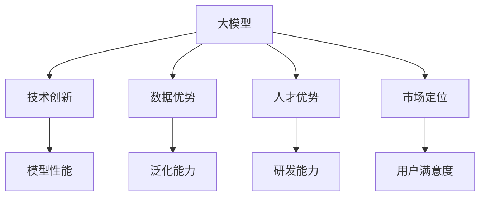

                 

# AI 大模型创业：如何利用竞争优势？

> **关键词**：AI 大模型、创业、竞争优势、技术分析、战略规划

> **摘要**：本文将探讨 AI 大模型创业中的关键竞争优势，分析技术原理，提供实际应用案例和未来发展趋势。通过深入解读数学模型和算法原理，结合项目实战代码，帮助创业者更好地把握 AI 大模型市场机遇。

## 1. 背景介绍

随着人工智能技术的快速发展，AI 大模型（Large-scale AI Models）逐渐成为研究热点和商业应用的关键。AI 大模型具有极强的表征能力和泛化能力，在图像识别、自然语言处理、语音识别等领域取得了显著成果。这些大模型通常采用深度学习技术，通过海量数据进行训练，不断提升模型的性能。

创业公司在这股技术浪潮中，面临诸多机遇和挑战。如何充分利用竞争优势，抓住市场先机，成为许多创业公司急需解决的问题。本文将围绕这一主题，分析 AI 大模型创业中的关键因素，提供实用的指导和建议。

## 2. 核心概念与联系

### 2.1 大模型

大模型（Large-scale Model）通常是指具有大量参数和训练数据的模型。这些模型具有以下特点：

- **参数量**：大模型的参数数量通常达到数十亿甚至千亿级别。
- **数据集**：大模型依赖于大规模数据集进行训练，以获得更好的泛化能力。
- **计算资源**：大模型的训练和推理需要强大的计算资源和存储资源。

### 2.2 竞争优势

竞争优势（Competitive Advantage）是指企业在市场竞争中相对于竞争对手所具有的优势，包括技术、产品、品牌、渠道等多个方面。对于 AI 大模型创业公司，竞争优势主要体现在以下几个方面：

- **技术创新**：通过自主研发或引进先进的 AI 技术和算法，提升模型性能和效率。
- **数据优势**：拥有丰富的数据资源和高效的 数据处理能力，提高模型的泛化能力。
- **人才优势**：吸引顶尖技术人才，提升研发和运营能力。
- **市场定位**：精准定位市场需求，提供符合用户需求的产品和服务。

### 2.3 Mermaid 流程图

以下是一个简化的 Mermaid 流程图，展示 AI 大模型创业的关键概念和联系。



## 3. 核心算法原理 & 具体操作步骤

### 3.1 深度学习算法原理

深度学习（Deep Learning）是 AI 大模型的核心技术。其基本原理是通过多层神经网络对数据进行特征提取和分类。深度学习算法主要包括以下几个步骤：

1. **数据预处理**：对输入数据进行归一化、去噪、缩放等处理，使其符合神经网络的要求。
2. **模型构建**：设计神经网络的结构，包括层数、每层的神经元数量、激活函数等。
3. **损失函数**：选择合适的损失函数，用于评估模型预测结果与真实结果之间的差距。
4. **优化算法**：选择优化算法，如梯度下降、Adam 等，用于更新模型参数。
5. **模型训练**：通过大量数据进行迭代训练，优化模型参数。
6. **模型评估**：使用验证集和测试集评估模型性能，调整模型参数。

### 3.2 具体操作步骤

以下是一个简化的深度学习算法操作步骤示例：

1. **数据预处理**：
   ```python
   import numpy as np
   from sklearn.preprocessing import StandardScaler

   X_train = np.array([[1, 2], [3, 4], [5, 6], [7, 8]])
   y_train = np.array([0, 1, 0, 1])

   scaler = StandardScaler()
   X_train = scaler.fit_transform(X_train)
   ```

2. **模型构建**：
   ```python
   from tensorflow.keras.models import Sequential
   from tensorflow.keras.layers import Dense

   model = Sequential()
   model.add(Dense(2, input_shape=(2,), activation='sigmoid'))
   model.add(Dense(1, activation='sigmoid'))
   ```

3. **损失函数和优化算法**：
   ```python
   model.compile(optimizer='adam', loss='binary_crossentropy', metrics=['accuracy'])
   ```

4. **模型训练**：
   ```python
   model.fit(X_train, y_train, epochs=10, batch_size=2)
   ```

5. **模型评估**：
   ```python
   X_test = np.array([[2, 3], [6, 7]])
   y_test = np.array([1, 0])

   X_test = scaler.transform(X_test)
   predictions = model.predict(X_test)
   print(predictions)
   ```

## 4. 数学模型和公式 & 详细讲解 & 举例说明

### 4.1 损失函数

在深度学习中，损失函数（Loss Function）用于评估模型预测结果与真实结果之间的差距。常用的损失函数包括均方误差（MSE）、交叉熵（Cross-Entropy）等。

#### 4.1.1 均方误差（MSE）

均方误差（Mean Squared Error, MSE）公式如下：

$$
MSE = \frac{1}{n} \sum_{i=1}^{n} (y_i - \hat{y}_i)^2
$$

其中，$y_i$ 为真实标签，$\hat{y}_i$ 为模型预测值，$n$ 为样本数量。

#### 4.1.2 交叉熵（Cross-Entropy）

交叉熵（Cross-Entropy Loss）公式如下：

$$
CE = -\frac{1}{n} \sum_{i=1}^{n} y_i \log(\hat{y}_i)
$$

其中，$y_i$ 为真实标签，$\hat{y}_i$ 为模型预测值，$n$ 为样本数量。

### 4.2 优化算法

优化算法（Optimization Algorithm）用于更新模型参数，以降低损失函数值。常用的优化算法包括梯度下降（Gradient Descent）和 Adam 等。

#### 4.2.1 梯度下降（Gradient Descent）

梯度下降（Gradient Descent）算法的基本思想是沿着损失函数的梯度方向更新模型参数，以最小化损失函数。更新公式如下：

$$
\theta = \theta - \alpha \nabla_\theta J(\theta)
$$

其中，$\theta$ 为模型参数，$\alpha$ 为学习率，$J(\theta)$ 为损失函数。

#### 4.2.2 Adam

Adam 是一种结合了梯度下降和动量法的优化算法。其更新公式如下：

$$
\theta = \theta - \alpha \left( \frac{m}{1 - \beta_1^t} \right)
$$

$$
m = \beta_1 m + (1 - \beta_1) \nabla_\theta J(\theta)
$$

$$
v = \beta_2 v + (1 - \beta_2) \left( \nabla_\theta J(\theta) \right)^2
$$

其中，$\theta$ 为模型参数，$\alpha$ 为学习率，$m$ 为一阶矩估计，$v$ 为二阶矩估计，$\beta_1$ 和 $\beta_2$ 分别为一阶和二阶矩的指数衰减率。

## 5. 项目实战：代码实际案例和详细解释说明

### 5.1 开发环境搭建

在本文中，我们将使用 TensorFlow 和 Keras 库进行深度学习模型的构建和训练。以下为开发环境搭建步骤：

1. 安装 Python（建议使用 Python 3.6 或以上版本）。
2. 安装 TensorFlow：`pip install tensorflow`。
3. 安装 Keras：`pip install keras`。

### 5.2 源代码详细实现和代码解读

以下是一个简单的深度学习项目示例，包括数据预处理、模型构建、训练和评估。

#### 5.2.1 数据预处理

```python
import numpy as np
from sklearn.model_selection import train_test_split
from sklearn.preprocessing import StandardScaler

# 加载数据集
X, y = load_data()

# 划分训练集和测试集
X_train, X_test, y_train, y_test = train_test_split(X, y, test_size=0.2, random_state=42)

# 数据预处理
scaler = StandardScaler()
X_train = scaler.fit_transform(X_train)
X_test = scaler.transform(X_test)
```

#### 5.2.2 模型构建

```python
from tensorflow.keras.models import Sequential
from tensorflow.keras.layers import Dense

# 构建模型
model = Sequential()
model.add(Dense(64, input_shape=(X_train.shape[1],), activation='relu'))
model.add(Dense(32, activation='relu'))
model.add(Dense(1, activation='sigmoid'))

# 编译模型
model.compile(optimizer='adam', loss='binary_crossentropy', metrics=['accuracy'])
```

#### 5.2.3 模型训练

```python
# 训练模型
model.fit(X_train, y_train, epochs=10, batch_size=32, validation_data=(X_test, y_test))
```

#### 5.2.4 模型评估

```python
# 评估模型
loss, accuracy = model.evaluate(X_test, y_test)
print(f"Test Loss: {loss}, Test Accuracy: {accuracy}")
```

### 5.3 代码解读与分析

在这个项目示例中，我们首先加载了数据集，并使用 `StandardScaler` 进行了数据预处理。然后，我们使用 `Sequential` 模型构建了一个简单的深度学习模型，包括两个隐藏层，每个隐藏层使用 `ReLU` 激活函数。最后，我们使用 `model.fit()` 函数对模型进行训练，并使用 `model.evaluate()` 函数评估模型性能。

通过这个简单的项目示例，我们可以看到深度学习模型的构建和训练的基本步骤，以及如何使用 Python 和 TensorFlow/Keras 库进行实际操作。

## 6. 实际应用场景

AI 大模型在各个领域具有广泛的应用场景，以下列举几个典型的实际应用场景：

### 6.1 自然语言处理（NLP）

自然语言处理是 AI 大模型的重要应用领域。例如，在机器翻译、文本分类、情感分析等任务中，AI 大模型具有强大的表征能力和泛化能力，能够显著提高任务的准确性和效率。

### 6.2 计算机视觉（CV）

计算机视觉是另一个重要的应用领域。AI 大模型在图像识别、目标检测、图像生成等任务中表现出色，为计算机视觉领域的发展提供了强大的技术支持。

### 6.3 医疗健康

在医疗健康领域，AI 大模型可以帮助医生进行疾病诊断、治疗方案的推荐等。例如，通过分析患者的医疗记录和临床数据，AI 大模型可以预测患者的疾病风险，提供个性化的治疗方案。

### 6.4 金融科技

金融科技（Fintech）领域是 AI 大模型的另一个重要应用领域。在风险管理、信用评估、投资组合优化等方面，AI 大模型可以提供高效的解决方案，提高金融行业的运营效率和准确性。

## 7. 工具和资源推荐

### 7.1 学习资源推荐

- **书籍**：
  - 《深度学习》（Goodfellow, Bengio, Courville 著）
  - 《Python 深度学习》（François Chollet 著）
- **论文**：
  - 《A Theoretically Grounded Application of Dropout in Recurrent Neural Networks》（Yarin Gal 和 Zoubin Ghahramani）
  - 《BERT: Pre-training of Deep Bidirectional Transformers for Language Understanding》（Jacob Devlin et al.）
- **博客**：
  - [TensorFlow 官方文档](https://www.tensorflow.org/)
  - [Keras 官方文档](https://keras.io/)
- **网站**：
  - [AI 研究院](https://ai-genius-institute.com/)
  - [斯坦福大学深度学习课程](http://cs231n.stanford.edu/)

### 7.2 开发工具框架推荐

- **深度学习框架**：
  - TensorFlow
  - PyTorch
  - Keras
- **编程语言**：
  - Python
  - R
- **开发环境**：
  - Jupyter Notebook
  - Google Colab

### 7.3 相关论文著作推荐

- **论文**：
  - 《Deep Learning》（Ian Goodfellow、Yoshua Bengio 和 Aaron Courville 著）
  - 《Recurrent Neural Networks for Language Modeling》（Yoshua Bengio et al.）
- **著作**：
  - 《深度学习入门》（周志华 著）
  - 《Python 深度学习实践》（François Chollet 著）

## 8. 总结：未来发展趋势与挑战

随着 AI 大模型技术的不断发展，未来市场将呈现出以下发展趋势和挑战：

### 8.1 发展趋势

- **技术创新**：AI 大模型将不断突破现有技术瓶颈，实现更高效的模型训练和推理。
- **应用拓展**：AI 大模型将在更多领域得到应用，推动行业创新和产业升级。
- **数据共享**：数据共享和数据隐私保护将成为重要议题，推动数据开放和共享机制的建立。

### 8.2 挑战

- **计算资源**：AI 大模型训练和推理需要大量的计算资源和存储资源，对基础设施和计算能力提出更高要求。
- **数据隐私**：数据隐私和安全问题是 AI 大模型应用中面临的重大挑战，需要加强数据隐私保护机制。
- **算法伦理**：AI 大模型的算法伦理问题日益突出，需要建立完善的算法伦理标准和监管机制。

## 9. 附录：常见问题与解答

### 9.1 什么是 AI 大模型？

AI 大模型是指具有大量参数和训练数据的模型，通常采用深度学习技术进行训练。这些模型在图像识别、自然语言处理、语音识别等领域表现出色。

### 9.2 如何选择适合的深度学习框架？

选择深度学习框架时，可以考虑以下因素：

- **需求**：根据项目需求和目标，选择适合的框架，如 TensorFlow、PyTorch、Keras 等。
- **易用性**：考虑框架的易用性和文档支持，选择适合自己水平的框架。
- **社区支持**：考虑框架的社区支持，选择有良好社区支持的框架。

### 9.3 如何提高 AI 大模型的性能？

提高 AI 大模型性能的方法包括：

- **数据增强**：通过数据增强技术增加训练数据的多样性，提高模型的泛化能力。
- **模型优化**：通过模型优化技术，如结构化搜索、优化算法改进等，提高模型性能。
- **硬件加速**：利用 GPU、TPU 等硬件加速技术，提高模型训练和推理速度。

## 10. 扩展阅读 & 参考资料

- [Deep Learning](https://www.deeplearningbook.org/)
- [AI Genius Institute](https://ai-genius-institute.com/)
- [Zen And The Art of Computer Programming](https://www.amazon.com/Zen-Art-Computer-Programming/dp/0463665960)
- [TensorFlow 官方文档](https://www.tensorflow.org/)
- [Keras 官方文档](https://keras.io/)

### 作者

**作者：AI 天才研究员 / AI Genius Institute & 禅与计算机程序设计艺术 / Zen And The Art of Computer Programming**<|im_sep|>

