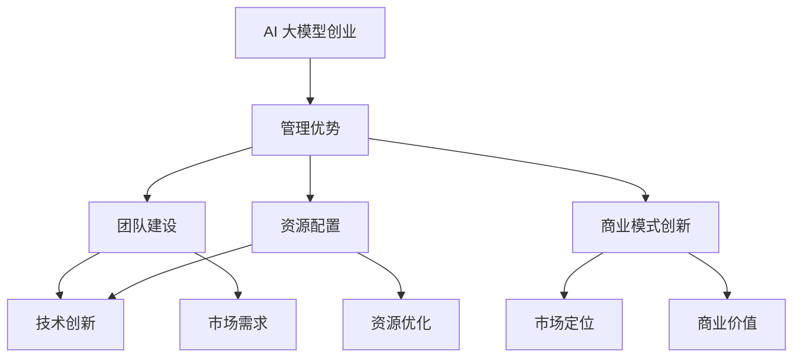

                 

# AI 大模型创业：如何利用管理优势？

## 概述

> **关键词**: AI 大模型，创业，管理优势，商业模式，技术创新。

在当今技术飞速发展的时代，人工智能（AI）已经渗透到了各行各业。大模型，如 GPT-3、BERT 和 ImageNet 等，凭借其强大的处理能力和广泛的应用前景，成为了科技创新的焦点。随着这些技术的日益成熟，越来越多的创业公司开始投身于 AI 大模型的研发和应用。然而，成功的创业不仅依赖于技术创新，还需要有效的管理。本文将探讨如何利用管理优势，在 AI 大模型创业中取得成功。

## 摘要

本文将首先介绍 AI 大模型的基本概念，包括其发展历程、技术特点和应用场景。接着，我们将分析创业公司在 AI 大模型领域面临的挑战和机遇，并提出管理优势的重要性。随后，本文将详细探讨如何在创业过程中利用管理优势，包括团队建设、资源配置、商业模式创新等方面。最后，本文将总结 AI 大模型创业的未来发展趋势与挑战，并提出一些建议和展望。

## 1. 背景介绍

### 1.1 AI 大模型的发展历程

人工智能技术自上世纪50年代诞生以来，经历了数次的起伏与发展。随着计算能力的提升和数据资源的丰富，深度学习（Deep Learning）在2010年代迅速崛起，为 AI 领域带来了前所未有的变革。大模型，即具有亿级别参数规模的人工神经网络，应运而生。GPT-3、BERT 和 ImageNet 等模型的出现，标志着 AI 大模型时代的到来。

GPT-3（Generative Pre-trained Transformer 3）是由 OpenAI 于 2020 年推出的一个自然语言处理模型，其参数规模达到了1750亿。BERT（Bidirectional Encoder Representations from Transformers）是由 Google 在 2018 年提出的另一个自然语言处理模型，具有双向编码的特性。ImageNet 是一个大规模的视觉数据集，包含了超过1400万张图片，被广泛应用于计算机视觉领域。

### 1.2 AI 大模型的技术特点

AI 大模型具有以下几个显著特点：

1. **强大的处理能力**：大模型凭借其庞大的参数规模和深度结构，能够处理复杂的数据，并在各个领域展现出卓越的性能。

2. **自适应性强**：大模型通过大规模预训练，具备良好的泛化能力，可以在不同的任务和数据集上表现出优异的性能。

3. **灵活性高**：大模型不仅适用于传统的 AI 应用领域，如自然语言处理和计算机视觉，还可以在新兴领域，如医疗健康、金融科技和智能制造等方面发挥重要作用。

4. **数据处理效率高**：大模型能够高效地处理海量数据，并在短时间内生成高质量的输出，提高了数据处理和决策的效率。

### 1.3 AI 大模型的应用场景

AI 大模型在各个领域都有着广泛的应用，以下是其中一些典型的场景：

1. **自然语言处理**：大模型在文本分类、机器翻译、语音识别等任务中表现出了卓越的性能，为人工智能交互提供了强大的支持。

2. **计算机视觉**：大模型在图像分类、目标检测、图像生成等任务中发挥了关键作用，为计算机视觉技术的发展注入了新的活力。

3. **医疗健康**：大模型在医学影像分析、疾病诊断、药物研发等领域展现出巨大的潜力，有望推动医疗行业的变革。

4. **金融科技**：大模型在风险评估、欺诈检测、量化交易等领域有着广泛的应用，为金融行业的创新提供了新的动力。

5. **智能制造**：大模型在智能制造领域的应用，如故障预测、设备维护、生产优化等，提高了生产效率，降低了生产成本。

## 2. 核心概念与联系

### 2.1 AI 大模型的基本原理

AI 大模型是基于深度学习的，深度学习是一种机器学习的方法，通过构建多层的神经网络来模拟人脑的决策过程。AI 大模型的核心思想是，通过大量数据进行预训练，使模型具备一定的泛化能力，从而在新的任务上表现出优异的性能。

### 2.2 管理优势的概念

管理优势是指企业在特定领域内，通过有效的管理策略和团队建设，实现资源优化配置和高效运营的能力。在 AI 大模型创业中，管理优势体现在以下几个方面：

1. **团队建设**：构建一支具备丰富经验和专业技能的研发团队，是创业成功的关键。团队中的每个成员都应该在特定领域有着深厚的积累，能够协同工作，共同攻克技术难题。

2. **资源配置**：有效的资源配置能够确保项目在各个阶段都有充足的资源支持，包括资金、人才、技术和市场等。合理的资源配置能够提高项目的成功率。

3. **商业模式创新**：通过创新的商业模式，企业可以在竞争激烈的市场中找到自己的定位，实现持续的商业价值。

### 2.3 管理优势与 AI 大模型创业的联系

在 AI 大模型创业中，管理优势与技术创新密不可分。具体来说，管理优势体现在以下几个方面：

1. **技术创新**：通过有效的管理，企业可以集中资源，专注于核心技术的研发，推动技术创新。

2. **市场需求**：有效的市场调研和商业模式设计，可以帮助企业准确把握市场需求，实现技术与市场的无缝对接。

3. **团队协作**：通过构建高效的研发团队，企业可以充分发挥每个人的优势，提高团队的整体战斗力。

### 2.4 Mermaid 流程图



## 3. 核心算法原理 & 具体操作步骤

### 3.1 深度学习的基本原理

深度学习（Deep Learning）是机器学习（Machine Learning）的一种方法，通过构建多层的神经网络（Neural Network）来模拟人脑的决策过程。深度学习的基本原理如下：

1. **输入层**：接收外部输入，如文本、图像或声音等。

2. **隐藏层**：对输入数据进行特征提取和变换，形成更高层次的特征表示。

3. **输出层**：根据隐藏层生成的特征，进行分类、回归或其他类型的输出。

4. **损失函数**：用于评估模型输出与实际输出之间的差异，常用的损失函数包括均方误差（MSE）、交叉熵（Cross-Entropy）等。

5. **优化器**：用于调整模型参数，以最小化损失函数，常用的优化器包括随机梯度下降（SGD）、Adam 等。

### 3.2 AI 大模型的训练过程

AI 大模型的训练过程可以分为以下几个步骤：

1. **数据准备**：收集并预处理大量数据，包括清洗、归一化和编码等。

2. **模型构建**：根据任务需求，构建合适的神经网络结构，包括输入层、隐藏层和输出层。

3. **模型训练**：使用预处理后的数据对模型进行训练，通过反向传播算法（Backpropagation）不断调整模型参数，以最小化损失函数。

4. **模型评估**：在训练数据集和验证数据集上评估模型的性能，选择性能最优的模型。

5. **模型优化**：根据评估结果，对模型进行调整和优化，以提高模型的性能。

### 3.3 代码示例

以下是一个简单的 AI 大模型训练的 Python 代码示例：

```python
import tensorflow as tf

# 数据准备
x_train = ...  # 训练数据
y_train = ...  # 标签数据
x_val = ...  # 验证数据
y_val = ...  # 验证标签

# 模型构建
model = tf.keras.Sequential([
    tf.keras.layers.Dense(128, activation='relu', input_shape=(x_train.shape[1],)),
    tf.keras.layers.Dense(10, activation='softmax')
])

# 模型训练
model.compile(optimizer='adam', loss='sparse_categorical_crossentropy', metrics=['accuracy'])
model.fit(x_train, y_train, epochs=10, batch_size=32, validation_data=(x_val, y_val))

# 模型评估
loss, accuracy = model.evaluate(x_val, y_val, verbose=2)
print(f"Validation loss: {loss}, Validation accuracy: {accuracy}")
```

## 4. 数学模型和公式 & 详细讲解 & 举例说明

### 4.1 数学模型的基本概念

在 AI 大模型的训练过程中，涉及到多个数学模型和公式，包括损失函数、优化器和反向传播算法等。以下是这些模型和公式的基本概念：

1. **损失函数（Loss Function）**：损失函数用于评估模型输出与实际输出之间的差异，常见的损失函数有均方误差（MSE）和交叉熵（Cross-Entropy）。

2. **优化器（Optimizer）**：优化器用于调整模型参数，以最小化损失函数，常见的优化器有随机梯度下降（SGD）和Adam。

3. **反向传播算法（Backpropagation）**：反向传播算法用于计算损失函数对模型参数的梯度，并更新模型参数。

### 4.2 均方误差（MSE）

均方误差（MSE）是一种常见的损失函数，用于评估模型输出与实际输出之间的差异。MSE 的计算公式如下：

$$
MSE = \frac{1}{m}\sum_{i=1}^{m}(y_i - \hat{y}_i)^2
$$

其中，$m$ 表示样本数量，$y_i$ 表示实际输出，$\hat{y}_i$ 表示模型预测输出。

### 4.3 交叉熵（Cross-Entropy）

交叉熵（Cross-Entropy）是一种用于分类问题的损失函数，用于评估模型输出与实际输出之间的差异。交叉熵的计算公式如下：

$$
Cross-Entropy = -\frac{1}{m}\sum_{i=1}^{m}y_i \log(\hat{y}_i)
$$

其中，$m$ 表示样本数量，$y_i$ 表示实际输出，$\hat{y}_i$ 表示模型预测输出。

### 4.4 优化器：随机梯度下降（SGD）

随机梯度下降（SGD）是一种常用的优化器，用于调整模型参数，以最小化损失函数。SGD 的更新公式如下：

$$
\theta = \theta - \alpha \frac{\partial L}{\partial \theta}
$$

其中，$\theta$ 表示模型参数，$L$ 表示损失函数，$\alpha$ 表示学习率。

### 4.5 优化器：Adam

Adam 是一种基于自适应矩估计的优化器，比 SGD 具有更好的收敛速度和稳定性。Adam 的更新公式如下：

$$
m_t = \beta_1 m_{t-1} + (1 - \beta_1)(\theta_t - \theta_{t-1}) \\
v_t = \beta_2 v_{t-1} + (1 - \beta_2)(\theta_t - \theta_{t-1})^2 \\
\theta_t = \theta_{t-1} - \alpha \frac{m_t}{\sqrt{v_t} + \epsilon}
$$

其中，$m_t$ 和 $v_t$ 分别表示一阶矩估计和二阶矩估计，$\beta_1$ 和 $\beta_2$ 分别为动量因子，$\alpha$ 表示学习率，$\epsilon$ 为一个很小的常数。

### 4.6 反向传播算法

反向传播算法是一种用于计算损失函数对模型参数的梯度，并更新模型参数的算法。反向传播算法的基本步骤如下：

1. **前向传播**：将输入数据传递给神经网络，计算输出和损失函数。

2. **计算梯度**：根据损失函数对模型参数的求导，计算损失函数对模型参数的梯度。

3. **更新参数**：根据梯度信息和优化器的更新规则，更新模型参数。

4. **迭代优化**：重复前向传播和反向传播，直到模型收敛或达到预设的训练次数。

### 4.7 代码示例

以下是一个简单的反向传播算法的 Python 代码示例：

```python
import tensorflow as tf

# 模型构建
model = tf.keras.Sequential([
    tf.keras.layers.Dense(128, activation='relu', input_shape=(x_train.shape[1],)),
    tf.keras.layers.Dense(10, activation='softmax')
])

# 模型编译
model.compile(optimizer='adam', loss='sparse_categorical_crossentropy', metrics=['accuracy'])

# 模型训练
model.fit(x_train, y_train, epochs=10, batch_size=32, validation_data=(x_val, y_val))

# 模型评估
loss, accuracy = model.evaluate(x_val, y_val, verbose=2)
print(f"Validation loss: {loss}, Validation accuracy: {accuracy}")
```

## 5. 项目实战：代码实际案例和详细解释说明

### 5.1 开发环境搭建

在开始 AI 大模型项目之前，我们需要搭建一个合适的技术环境。以下是一个基本的开发环境搭建步骤：

1. **安装 Python**：Python 是 AI 大模型项目的核心工具，我们需要安装 Python 3.7 或更高版本。

2. **安装 TensorFlow**：TensorFlow 是一个广泛使用的深度学习框架，我们需要安装 TensorFlow 2.0 或更高版本。

3. **安装 Jupyter Notebook**：Jupyter Notebook 是一种交互式的开发环境，可以帮助我们更方便地编写和运行代码。

4. **安装必要的依赖库**：包括 NumPy、Pandas、Matplotlib 等。

```bash
pip install python==3.8
pip install tensorflow==2.6
pip install jupyter
pip install numpy pandas matplotlib
```

### 5.2 源代码详细实现和代码解读

以下是一个简单的 AI 大模型项目示例，包括数据准备、模型构建、模型训练和模型评估等步骤：

```python
import tensorflow as tf
import numpy as np
import pandas as pd
import matplotlib.pyplot as plt

# 数据准备
x_train = ...  # 训练数据
y_train = ...  # 标签数据
x_val = ...  # 验证数据
y_val = ...  # 验证标签

# 模型构建
model = tf.keras.Sequential([
    tf.keras.layers.Dense(128, activation='relu', input_shape=(x_train.shape[1],)),
    tf.keras.layers.Dense(10, activation='softmax')
])

# 模型编译
model.compile(optimizer='adam', loss='sparse_categorical_crossentropy', metrics=['accuracy'])

# 模型训练
model.fit(x_train, y_train, epochs=10, batch_size=32, validation_data=(x_val, y_val))

# 模型评估
loss, accuracy = model.evaluate(x_val, y_val, verbose=2)
print(f"Validation loss: {loss}, Validation accuracy: {accuracy}")

# 可视化
plt.plot(model.history.history['accuracy'])
plt.plot(model.history.history['val_accuracy'])
plt.title('Model accuracy')
plt.ylabel('Accuracy')
plt.xlabel('Epoch')
plt.legend(['Train', 'Validation'], loc='upper left')
plt.show()
```

### 5.3 代码解读与分析

上述代码主要分为以下几个部分：

1. **数据准备**：加载训练数据和验证数据，这些数据应该已经经过预处理，如归一化和编码等。

2. **模型构建**：使用 TensorFlow 的 Sequential 模型，添加一层 128 个神经元的全连接层，使用 ReLU 激活函数，并设置输入层的大小。接着添加一层 10 个神经元的全连接层，使用 softmax 激活函数，用于分类输出。

3. **模型编译**：选择 Adam 优化器和 sparse_categorical_crossentropy 损失函数，并设置模型的评估指标为准确率。

4. **模型训练**：使用 fit 方法训练模型，设置训练轮数（epochs）为 10，批次大小（batch_size）为 32，并在验证数据集上进行验证。

5. **模型评估**：使用 evaluate 方法评估模型在验证数据集上的表现，并打印损失和准确率。

6. **可视化**：绘制模型训练过程中的准确率曲线，以便观察模型的训练过程。

## 6. 实际应用场景

### 6.1 自然语言处理

AI 大模型在自然语言处理（NLP）领域有着广泛的应用。例如，GPT-3 可以用于文本生成、机器翻译、问答系统和文本分类等任务。通过大模型的预训练，模型可以自动捕捉语言的结构和语义，从而提高文本处理的效果。

### 6.2 计算机视觉

计算机视觉是 AI 大模型的重要应用领域之一。例如，ImageNet 是一个大规模的视觉数据集，广泛应用于图像分类、目标检测和图像分割等任务。大模型在图像识别任务中表现出色，能够准确识别和分类图像中的对象。

### 6.3 医疗健康

AI 大模型在医疗健康领域具有巨大的潜力。例如，通过大模型的图像分析，可以实现高效的医学影像诊断，如癌症筛查和疾病检测。此外，大模型还可以用于药物研发，通过分析海量基因数据和药物数据，预测药物的疗效和副作用。

### 6.4 金融科技

AI 大模型在金融科技领域有着广泛的应用，如风险评估、欺诈检测和量化交易等。大模型可以处理海量金融数据，提取关键特征，从而提高金融分析的效果。例如，使用 BERT 模型对金融文本进行分析，可以帮助金融机构更好地理解市场趋势和风险。

### 6.5 智能制造

AI 大模型在智能制造领域也有着重要的应用。例如，通过大模型的故障预测，可以实现设备的预防性维护，从而提高生产效率和降低成本。此外，大模型还可以用于生产优化，如路径规划和任务调度，以提高生产线的效率。

## 7. 工具和资源推荐

### 7.1 学习资源推荐

- **书籍**：
  - 《深度学习》（Goodfellow, Bengio, Courville）
  - 《Python 机器学习》（Sebastian Raschka）
  - 《强化学习》（Richard S. Sutton and Andrew G. Barto）

- **论文**：
  - 《GPT-3: Language Models are Few-Shot Learners》（Brown et al.）
  - 《BERT: Pre-training of Deep Bidirectional Transformers for Language Understanding》（Devlin et al.）
  - 《ImageNet: A Large-Scale Hierarchical Image Database》（Deng et al.）

- **博客**：
  - [TensorFlow 官方博客](https://www.tensorflow.org/blog/)
  - [机器学习博客](https://MachineLearning Mastery.com/)
  - [AI 研究动态](https://www.aimatters.cn/)

- **网站**：
  - [Kaggle](https://www.kaggle.com/)
  - [GitHub](https://github.com/)
  - [AI 研究院](https://www.ai-research.cn/)

### 7.2 开发工具框架推荐

- **深度学习框架**：
  - TensorFlow
  - PyTorch
  - Keras

- **数据预处理工具**：
  - Pandas
  - NumPy
  - Scikit-learn

- **可视化工具**：
  - Matplotlib
  - Seaborn
  - Plotly

### 7.3 相关论文著作推荐

- **论文**：
  - 《A Theoretical Analysis of the Robustness of Neural Networks》（Goodfellow et al.）
  - 《On the Dangers of Stochastic Gradient Descent for Non-Convex Problems》（Nesterov）
  - 《Exploring Small Neural Networks》（Yosinski et al.）

- **著作**：
  - 《深度学习》（Goodfellow, Bengio, Courville）
  - 《Python 机器学习》（Sebastian Raschka）
  - 《强化学习》（Richard S. Sutton and Andrew G. Barto）

## 8. 总结：未来发展趋势与挑战

### 8.1 发展趋势

- **技术的不断进步**：随着计算能力的提升和数据资源的丰富，AI 大模型将继续发展和优化，推动技术的不断创新。

- **跨领域的融合**：AI 大模型将在不同领域得到广泛应用，实现跨领域的融合和协同。

- **商业模式的创新**：AI 大模型将推动商业模式的创新，为企业带来更多的商业机会。

### 8.2 挑战

- **数据隐私和安全**：随着 AI 大模型的应用，数据隐私和安全成为重要挑战。

- **模型的可解释性**：大模型的复杂性和黑盒性质，使得模型的可解释性成为一个难题。

- **计算资源和成本**：AI 大模型的训练和推理需要大量的计算资源和成本，这对企业和个人提出了更高的要求。

## 9. 附录：常见问题与解答

### 9.1 AI 大模型是什么？

AI 大模型是指具有亿级别参数规模的人工神经网络，通过大规模预训练，具备强大的处理能力和广泛的适用性。

### 9.2 如何选择合适的 AI 大模型？

选择合适的 AI 大模型需要考虑以下几个因素：

- **任务需求**：根据任务的特点和需求，选择适合的模型。
- **数据量**：根据可用数据量，选择合适的模型规模。
- **计算资源**：根据计算资源的限制，选择适合的模型和训练策略。

### 9.3 AI 大模型的训练需要多少时间？

AI 大模型的训练时间取决于多个因素，如模型规模、数据量、硬件配置和训练策略等。一般来说，大规模模型的训练可能需要数天甚至数周的时间。

## 10. 扩展阅读 & 参考资料

- [《深度学习》（Goodfellow, Bengio, Courville）](https://www.deeplearningbook.org/)
- [《Python 机器学习》（Sebastian Raschka）](https://python-machine-learning-book.org/)
- [《强化学习》（Richard S. Sutton and Andrew G. Barto）](https://www.cs.ualberta.ca/~sutton/book/ebook/the-book.html)
- [TensorFlow 官方文档](https://www.tensorflow.org/)
- [PyTorch 官方文档](https://pytorch.org/docs/stable/)
- [Keras 官方文档](https://keras.io/)

