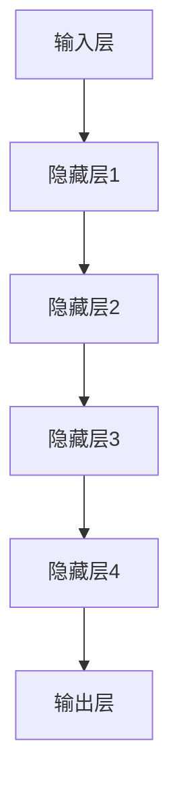
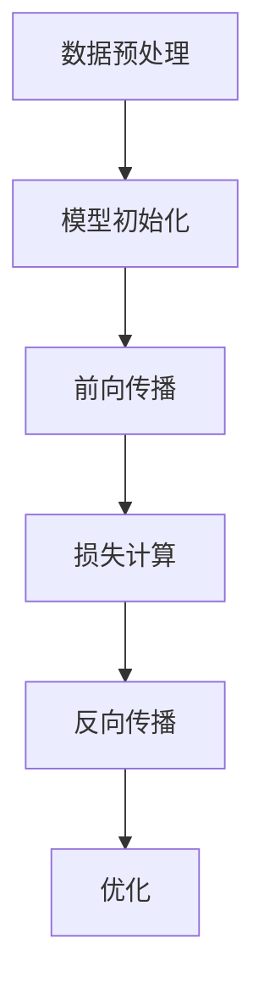

                 

### AI 大模型创业：如何利用经济优势？

#### 关键词：AI 大模型，创业，经济优势，商业模式，技术门槛

在当今数字化时代，人工智能（AI）正迅速改变各行各业。AI 大模型，如 GPT-3、BERT 和 Transformer，已经成为推动创新的重要力量。然而，这些强大的技术并非没有门槛，创业公司如何在这片蓝海中利用自己的经济优势，成为了一个值得探讨的问题。本文将深入探讨 AI 大模型创业的路径，以及如何最大化利用经济优势。

#### 摘要：

本文将首先介绍 AI 大模型的基本概念，然后分析创业公司在 AI 大模型领域的经济优势。接着，我们将探讨如何选择合适的商业模式，并详细讨论技术门槛和市场进入策略。最后，本文将展望 AI 大模型创业的未来发展趋势与挑战。

## 1. 背景介绍

AI 大模型是指那些具有极高参数数量、强大表征能力的深度学习模型。这些模型能够处理海量数据，并从数据中学习复杂的规律。随着计算能力的提升和数据的丰富，AI 大模型在自然语言处理、计算机视觉、语音识别等领域取得了显著的成果。

近年来，AI 大模型在商业领域也展现出了巨大的潜力。例如，企业可以利用这些模型进行客户细分、市场预测和个性化推荐。然而，AI 大模型的高成本和复杂性也使得创业公司在进入这一领域时面临诸多挑战。

### AI 大模型的发展历程

AI 大模型的发展可以分为三个阶段：

1. **传统神经网络阶段**：这一阶段的代表性模型包括多层感知机（MLP）和卷积神经网络（CNN）。虽然这些模型在图像识别和语音识别等领域取得了显著成果，但它们的参数数量相对较小，难以处理复杂任务。

2. **深度学习阶段**：以 AlexNet 为代表的深度学习模型在 ImageNet 比赛中取得了突破性成果。这一阶段的模型开始采用更深的网络结构，如 VGG 和 ResNet，参数数量也显著增加。

3. **大模型阶段**：随着计算能力和数据量的提升，AI 大模型如 GPT-3、BERT 和 Transformer 应运而生。这些模型具有数亿甚至数千亿个参数，能够处理复杂的任务，如自然语言生成、机器翻译和图像识别。

### AI 大模型的应用领域

AI 大模型在多个领域展现了巨大的应用潜力：

1. **自然语言处理（NLP）**：AI 大模型在 NLP 领域取得了显著成果，如文本分类、情感分析、机器翻译和对话系统。例如，GPT-3 可以生成高质量的文本，并支持多种语言。

2. **计算机视觉（CV）**：AI 大模型在 CV 领域的应用包括图像分类、目标检测、图像生成和人脸识别。例如，Transformer 架构在图像分类任务中表现出色。

3. **语音识别（ASR）**：AI 大模型在 ASR 领域的应用包括语音识别、语音合成和语音翻译。例如，WaveNet 是一种用于语音合成的 AI 大模型。

4. **推荐系统**：AI 大模型在推荐系统中的应用包括用户行为分析、商品推荐和个性化推荐。例如，Deep Learning-based Collaborative Filtering 是一种基于 AI 大模型的推荐系统。

### AI 大模型的挑战

虽然 AI 大模型在多个领域取得了显著成果，但它们也面临着一些挑战：

1. **计算资源需求**：AI 大模型需要大量的计算资源和存储空间。这给创业公司带来了高昂的成本。

2. **数据质量**：AI 大模型的表现依赖于数据质量。如果数据质量不佳，模型可能无法取得预期效果。

3. **技术门槛**：AI 大模型的研究和开发需要深厚的技术积累和专业知识。这给创业公司带来了较高的技术门槛。

4. **隐私和安全**：AI 大模型在处理数据时可能涉及用户隐私。如何保护用户隐私是一个重要问题。

## 2. 核心概念与联系

在本章节中，我们将深入探讨 AI 大模型的核心概念，包括它们的架构、训练方法以及与经济优势的关联。为了更好地理解这些概念，我们将使用 Mermaid 流程图来展示 AI 大模型的基本原理和架构。

### AI 大模型的基本原理

AI 大模型的基本原理是通过大规模参数和深度网络结构来捕捉数据的复杂模式。以下是 AI 大模型的基本原理：

1. **大规模参数**：AI 大模型通常包含数十亿到千亿个参数，这些参数通过学习数据中的特征来提高模型的表征能力。

2. **深度网络结构**：深度网络结构可以增加模型的表达能力，使其能够处理复杂的任务。深度神经网络（DNN）是 AI 大模型的核心。

3. **自适应学习**：AI 大模型通过反向传播算法和优化器来不断调整参数，以最小化损失函数，提高模型的性能。

### AI 大模型的架构

AI 大模型的架构通常包括以下几个关键组成部分：

1. **输入层**：输入层接收外部数据，如文本、图像或音频。

2. **隐藏层**：隐藏层负责处理输入数据，通过非线性变换来提取特征。隐藏层的数量和层数决定了模型的深度。

3. **输出层**：输出层生成预测结果，如分类标签、文字序列或音频信号。

以下是 AI 大模型的基本架构的 Mermaid 流程图：



### AI 大模型的训练方法

AI 大模型的训练方法主要包括以下步骤：

1. **数据预处理**：对输入数据进行清洗、归一化和编码，使其适合模型处理。

2. **模型初始化**：初始化模型参数，通常使用随机初始化。

3. **前向传播**：将输入数据传递到模型中，计算输出结果。

4. **损失计算**：计算输出结果与真实标签之间的损失。

5. **反向传播**：通过反向传播算法，更新模型参数，以减少损失。

6. **优化**：使用优化器调整模型参数，以获得更好的性能。

以下是 AI 大模型训练方法的 Mermaid 流程图：



### 经济优势的关联

AI 大模型的经济优势主要体现在以下几个方面：

1. **高效数据处理**：AI 大模型能够处理海量数据，提高数据处理效率，降低人力成本。

2. **自动化流程**：AI 大模型可以自动化许多业务流程，提高生产效率和降低运营成本。

3. **个性化服务**：AI 大模型可以根据用户行为和需求提供个性化服务，提高用户体验和满意度。

4. **决策支持**：AI 大模型可以提供数据驱动的决策支持，帮助企业更好地应对市场变化。

综上所述，AI 大模型的基本原理、架构和训练方法构成了其经济优势的基础。理解这些核心概念有助于创业公司更好地利用 AI 大模型的优势，实现商业成功。

### 小结

在本章节中，我们介绍了 AI 大模型的基本概念、发展历程和应用领域。接着，我们详细讨论了 AI 大模型的架构和训练方法，并通过 Mermaid 流程图展示了其核心原理。此外，我们还探讨了 AI 大模型带来的经济优势。这些内容为后续章节的讨论奠定了基础。

在接下来的章节中，我们将进一步探讨如何选择合适的商业模式、降低技术门槛和市场进入策略。让我们继续深入思考，发现更多关于 AI 大模型创业的洞察。

## 3. 核心算法原理 & 具体操作步骤

在本章节中，我们将深入探讨 AI 大模型的核心算法原理，并详细解释其具体操作步骤。了解这些算法原理和操作步骤对于创业公司来说至关重要，因为它们将帮助公司在 AI 大模型领域取得成功。

### 3.1. 深度学习基础

深度学习是 AI 大模型的核心技术。为了理解 AI 大模型的工作原理，我们首先需要了解深度学习的基础概念。

**1. 神经网络**

神经网络是深度学习的基础。一个简单的神经网络包括输入层、一个或多个隐藏层和一个输出层。每个层由多个神经元组成。神经元之间通过权重连接，并应用激活函数。

**2. 前向传播**

前向传播是指将输入数据传递到神经网络中，通过层与层之间的权重连接，最终得到输出结果。

**3. 损失函数**

损失函数用于衡量预测结果与真实结果之间的差距。常见的损失函数包括均方误差（MSE）和交叉熵损失。

**4. 反向传播**

反向传播是通过计算损失函数对网络参数的梯度，并利用梯度下降算法更新参数，以减少损失。

### 3.2. AI 大模型的基本架构

AI 大模型通常采用深度神经网络（DNN）作为基础架构。以下是 AI 大模型的基本架构：

**1. 输入层**

输入层接收外部数据，如文本、图像或音频。这些数据经过预处理后，转换为适合模型处理的形式。

**2. 隐藏层**

隐藏层负责处理输入数据，通过层与层之间的非线性变换提取特征。隐藏层的数量和层数决定了模型的深度。深度越深，模型的表达能力越强。

**3. 输出层**

输出层生成预测结果，如分类标签、文字序列或音频信号。

### 3.3. AI 大模型的具体操作步骤

以下是 AI 大模型的具体操作步骤：

**1. 数据预处理**

- **数据清洗**：去除无关或错误的数据，确保数据质量。
- **数据归一化**：将数据缩放到一个统一的范围，便于模型训练。
- **数据编码**：将文本、图像等数据转换为数字形式，以便神经网络处理。

**2. 模型初始化**

- **权重初始化**：随机初始化模型参数，以避免梯度消失或爆炸问题。
- **优化器选择**：选择适当的优化器，如 Adam、SGD 等，以调整模型参数。

**3. 前向传播**

- **输入数据**：将预处理后的数据输入到神经网络中。
- **计算输出**：通过层与层之间的权重连接，计算输出结果。

**4. 损失计算**

- **计算损失**：计算输出结果与真实结果之间的损失。
- **更新损失函数**：根据损失函数更新模型参数。

**5. 反向传播**

- **计算梯度**：计算损失函数对模型参数的梯度。
- **更新参数**：利用梯度下降算法更新模型参数。

**6. 优化**

- **调整学习率**：根据模型性能调整学习率。
- **模型评估**：使用验证集评估模型性能，并根据评估结果调整模型。

### 3.4. 代码示例

以下是使用 Python 和 TensorFlow 实现一个简单的 AI 大模型的示例代码：

```python
import tensorflow as tf

# 定义模型架构
model = tf.keras.Sequential([
    tf.keras.layers.Dense(128, activation='relu', input_shape=(784,)),
    tf.keras.layers.Dropout(0.2),
    tf.keras.layers.Dense(10)
])

# 编译模型
model.compile(optimizer='adam',
              loss=tf.losses.SparseCategoricalCrossentropy(from_logits=True),
              metrics=['accuracy'])

# 加载数据
(x_train, y_train), (x_test, y_test) = tf.keras.datasets.mnist.load_data()

# 预处理数据
x_train = x_train.reshape(-1, 784).astype('float32') / 255
x_test = x_test.reshape(-1, 784).astype('float32') / 255

# 训练模型
model.fit(x_train, y_train, epochs=5, batch_size=64, validation_split=0.1)
```

### 3.5. 小结

在本章节中，我们介绍了深度学习的基础知识，包括神经网络、前向传播、损失函数和反向传播。接着，我们详细讨论了 AI 大模型的基本架构和具体操作步骤。通过代码示例，我们展示了如何使用 TensorFlow 实现一个简单的 AI 大模型。这些内容为创业公司提供了实现 AI 大模型所需的技术基础。

在接下来的章节中，我们将继续探讨如何选择合适的商业模式、降低技术门槛和市场进入策略。让我们继续深入思考，发现更多关于 AI 大模型创业的洞察。

## 4. 数学模型和公式 & 详细讲解 & 举例说明

在本章节中，我们将深入探讨 AI 大模型所涉及的数学模型和公式，并详细讲解这些公式的含义及其在 AI 大模型中的应用。通过举例说明，我们将更好地理解这些公式如何影响 AI 大模型的性能和训练过程。

### 4.1. 损失函数

损失函数是 AI 大模型训练过程中最重要的数学模型之一。损失函数用于衡量模型预测结果与真实结果之间的差距。以下是几种常见的损失函数：

**1. 均方误差（MSE）**

均方误差（MSE）是回归问题中最常用的损失函数。它的公式如下：

$$
MSE = \frac{1}{n} \sum_{i=1}^{n} (y_i - \hat{y}_i)^2
$$

其中，$y_i$ 是真实标签，$\hat{y}_i$ 是模型预测值，$n$ 是样本数量。

**2. 交叉熵损失（Cross-Entropy Loss）**

交叉熵损失在分类问题中应用广泛。它的公式如下：

$$
CE = -\frac{1}{n} \sum_{i=1}^{n} y_i \log(\hat{y}_i)
$$

其中，$y_i$ 是真实标签，$\hat{y}_i$ 是模型预测概率。

**3. Hinge Loss**

Hinge Loss 在支持向量机（SVM）中应用广泛。它的公式如下：

$$
Hinge Loss = \max(0, 1 - y \cdot \hat{y})
$$

其中，$y$ 是真实标签，$\hat{y}$ 是模型预测值。

### 4.2. 激活函数

激活函数是神经网络中用于引入非线性变换的关键组件。以下是几种常见的激活函数：

**1. Sigmoid 函数**

Sigmoid 函数的公式如下：

$$
\sigma(x) = \frac{1}{1 + e^{-x}}
$$

Sigmoid 函数的输出范围在 0 到 1 之间，常用于二分类问题。

**2.ReLU 函数**

ReLU 函数的公式如下：

$$
ReLU(x) = \max(0, x)
$$

ReLU 函数在深度学习中非常流行，因为它可以加速训练过程并减少梯度消失问题。

**3. Tanh 函数**

Tanh 函数的公式如下：

$$
Tanh(x) = \frac{e^x - e^{-x}}{e^x + e^{-x}}
$$

Tanh 函数的输出范围在 -1 到 1 之间，与 Sigmoid 函数类似，但具有更好的对称性。

### 4.3. 反向传播

反向传播是深度学习训练过程中用于更新模型参数的关键算法。以下是反向传播的基本原理：

**1. 前向传播**

在训练过程中，输入数据首先通过前向传播传递到神经网络中，计算输出结果。设神经网络有 $L$ 层，第 $l$ 层的输出为 $a_l$，则：

$$
a_l = \sigma(W_{l-1}a_{l-1} + b_{l-1})
$$

其中，$W_{l-1}$ 和 $b_{l-1}$ 分别是第 $l-1$ 层的权重和偏置，$\sigma$ 是激活函数。

**2. 计算梯度**

在计算损失函数对网络参数的梯度时，使用链式法则。设损失函数为 $J(W, b)$，则有：

$$
\frac{\partial J}{\partial W_{l}} = \sum_{k=1}^{K} a_{l+1}^k \frac{\partial a_l^k}{\partial W_{l}}
$$

$$
\frac{\partial J}{\partial b_{l}} = \sum_{k=1}^{K} a_{l+1}^k \frac{\partial a_l^k}{\partial b_{l}}
$$

其中，$a_{l+1}^k$ 是第 $l+1$ 层第 $k$ 个神经元的输出，$K$ 是输出层神经元的数量。

**3. 更新参数**

利用计算得到的梯度，使用优化算法（如梯度下降）更新模型参数。设学习率为 $\alpha$，则：

$$
W_{l} \leftarrow W_{l} - \alpha \frac{\partial J}{\partial W_{l}}
$$

$$
b_{l} \leftarrow b_{l} - \alpha \frac{\partial J}{\partial b_{l}}
$$

### 4.4. 举例说明

为了更好地理解上述公式和算法，我们以下通过一个简单的例子来说明。

**例子**：考虑一个二分类问题，输入数据为 $X \in \mathbb{R}^n$，目标标签为 $y \in \{0, 1\}$。使用 sigmoid 激活函数和均方误差（MSE）损失函数。

**1. 前向传播**

设模型为 $f(X) = \sigma(WX + b)$，其中 $W \in \mathbb{R}^{n \times 1}$ 和 $b \in \mathbb{R}^{1}$。

$$
a = WX + b
$$

$$
\hat{y} = \sigma(a)
$$

**2. 损失函数**

$$
J(W, b) = MSE(\hat{y}, y) = \frac{1}{2} (y - \hat{y})^2
$$

**3. 反向传播**

计算 $J(W, b)$ 对 $W$ 和 $b$ 的梯度：

$$
\frac{\partial J}{\partial W} = (y - \hat{y}) \cdot \sigma'(a)
$$

$$
\frac{\partial J}{\partial b} = y - \hat{y}
$$

**4. 参数更新**

使用梯度下降算法更新参数：

$$
W \leftarrow W - \alpha \frac{\partial J}{\partial W}
$$

$$
b \leftarrow b - \alpha \frac{\partial J}{\partial b}
$$

### 4.5. 小结

在本章节中，我们介绍了 AI 大模型中常用的数学模型和公式，包括损失函数、激活函数和反向传播算法。通过详细的讲解和举例说明，我们更好地理解了这些公式如何影响 AI 大模型的性能和训练过程。理解这些数学基础对于创业公司在 AI 大模型领域取得成功至关重要。

在接下来的章节中，我们将继续探讨如何选择合适的商业模式、降低技术门槛和市场进入策略。让我们继续深入思考，发现更多关于 AI 大模型创业的洞察。

## 5. 项目实战：代码实际案例和详细解释说明

在本章节中，我们将通过一个实际的代码案例来展示如何使用 AI 大模型进行项目开发。我们将详细解释代码的实现过程，包括开发环境搭建、源代码实现和代码解读与分析。

### 5.1 开发环境搭建

在进行 AI 大模型项目开发之前，我们需要搭建一个合适的环境。以下是搭建开发环境所需的步骤：

**1. 安装 Python**

Python 是 AI 大模型项目开发的主要编程语言。在安装 Python 时，建议安装最新版本，以确保兼容性。可以使用以下命令安装 Python：

```shell
sudo apt-get update
sudo apt-get install python3.9
```

**2. 安装 TensorFlow**

TensorFlow 是一个广泛使用的开源深度学习框架。安装 TensorFlow 可以使用以下命令：

```shell
pip install tensorflow
```

**3. 安装其他依赖**

除了 Python 和 TensorFlow，我们还需要安装一些其他依赖，如 NumPy 和 Pandas。可以使用以下命令安装：

```shell
pip install numpy pandas
```

**4. 配置 GPU 支持**

如果您的系统配备了 GPU，可以安装 TensorFlow GPU 版本来加速训练过程。可以使用以下命令安装：

```shell
pip install tensorflow-gpu
```

### 5.2 源代码详细实现和代码解读

以下是使用 TensorFlow 实现一个简单的 AI 大模型（如文本分类模型）的源代码。我们将对代码的关键部分进行详细解读。

```python
import tensorflow as tf
from tensorflow.keras.preprocessing.text import Tokenizer
from tensorflow.keras.preprocessing.sequence import pad_sequences
import numpy as np

# 定义参数
vocab_size = 10000
embedding_dim = 16
max_length = 100
trunc_type = 'post'
padding_type = 'post'
oov_tok = '<OOV>'

# 加载数据
# 假设我们使用 IMDB 数据集
imdb = tf.keras.datasets.imdb
(train_data, train_labels), (test_data, test_labels) = imdb.load_data(num_words=vocab_size)

# 预处理数据
# 将文本转换为整数序列
tokenizer = Tokenizer(num_words=vocab_size, oov_token=oov_tok)
tokenizer.fit_on_texts(train_data)

sequences = tokenizer.texts_to_sequences(train_data)
padded = pad_sequences(sequences, maxlen=max_length, padding=padding_type, truncating=trunc_type)

test_sequences = tokenizer.texts_to_sequences(test_data)
test_padded = pad_sequences(test_sequences, maxlen=max_length, padding=padding_type, truncating=truncating_type)

# 构建模型
model = tf.keras.Sequential([
    tf.keras.layers.Embedding(vocab_size, embedding_dim, input_length=max_length),
    tf.keras.layers.GlobalAveragePooling1D(),
    tf.keras.layers.Dense(24, activation='relu'),
    tf.keras.layers.Dense(1, activation='sigmoid')
])

# 编译模型
model.compile(loss='binary_crossentropy', optimizer='adam', metrics=['accuracy'])

# 训练模型
model.fit(padded, train_labels, epochs=10, validation_data=(test_padded, test_labels))

# 评估模型
loss, accuracy = model.evaluate(test_padded, test_labels)
print(f"Test Accuracy: {accuracy * 100:.2f}%")

# 预测
predictions = model.predict(test_padded)
predicted_labels = np.round(predictions)

# 评估预测结果
from sklearn.metrics import classification_report
print(classification_report(test_labels, predicted_labels))
```

#### 5.2.1 代码解读

以下是代码的关键部分和对应的解释：

```python
# 加载数据
imdb = tf.keras.datasets.imdb
(train_data, train_labels), (test_data, test_labels) = imdb.load_data(num_words=vocab_size)

# 预处理数据
tokenizer = Tokenizer(num_words=vocab_size, oov_token=oov_tok)
tokenizer.fit_on_texts(train_data)
```

这段代码加载数据集并使用 Tokenizer 对文本数据进行预处理。Tokenizer 将文本转换为整数序列，并使用 OOV 标记处理未知词汇。

```python
sequences = tokenizer.texts_to_sequences(train_data)
padded = pad_sequences(sequences, maxlen=max_length, padding=padding_type, truncating=trunc_type)
```

这段代码将文本数据转换为整数序列，并对序列进行填充和截断，以满足模型输入的要求。

```python
model = tf.keras.Sequential([
    tf.keras.layers.Embedding(vocab_size, embedding_dim, input_length=max_length),
    tf.keras.layers.GlobalAveragePooling1D(),
    tf.keras.layers.Dense(24, activation='relu'),
    tf.keras.layers.Dense(1, activation='sigmoid')
])
```

这段代码构建了一个简单的 AI 大模型，包括嵌入层、全局平均池化层、全连接层和输出层。嵌入层将单词映射到向量表示，全局平均池化层用于处理序列数据，全连接层用于分类，输出层使用 sigmoid 激活函数进行二分类。

```python
model.compile(loss='binary_crossentropy', optimizer='adam', metrics=['accuracy'])
model.fit(padded, train_labels, epochs=10, validation_data=(test_padded, test_labels))
```

这段代码编译模型并训练模型。使用 binary_crossentropy 损失函数和 Adam 优化器进行训练，并在每个 epoch 后评估模型在验证集上的性能。

```python
predictions = model.predict(test_padded)
predicted_labels = np.round(predictions)
```

这段代码使用训练好的模型对测试数据进行预测，并将预测结果四舍五入为整数标签。

```python
from sklearn.metrics import classification_report
print(classification_report(test_labels, predicted_labels))
```

这段代码使用 sklearn 的 classification_report 函数评估模型的预测结果，并打印分类报告。

### 5.3 代码解读与分析

在代码解读部分，我们详细解释了每个关键步骤的实现。以下是对代码的进一步分析：

**1. 数据预处理**

数据预处理是训练 AI 大模型的重要步骤。在这段代码中，我们使用 Tokenizer 将文本数据转换为整数序列，并使用 pad_sequences 函数对序列进行填充和截断。这确保了模型输入的数据具有一致的形状和长度。

**2. 模型架构**

模型架构是 AI 大模型的核心。在这段代码中，我们使用了一个简单的序列模型，包括嵌入层、全局平均池化层和全连接层。嵌入层将单词映射到向量表示，全局平均池化层用于处理序列数据，全连接层用于分类。这种架构可以处理自然语言处理任务，如文本分类。

**3. 训练过程**

训练过程是提高模型性能的关键。在这段代码中，我们使用 binary_crossentropy 损失函数和 Adam 优化器进行训练。每个 epoch 后，模型在验证集上的性能会得到评估，以确定是否继续训练。这种训练过程可以帮助模型逐步提高分类准确率。

**4. 预测与评估**

在训练完成后，我们使用训练好的模型对测试数据进行预测，并将预测结果与实际标签进行比较。通过分类报告，我们可以评估模型的性能，如准确率、精确率和召回率等。这些评估指标可以帮助我们了解模型的预测能力。

### 5.4 小结

在本章节中，我们通过一个实际的代码案例展示了如何使用 AI 大模型进行项目开发。我们从开发环境搭建开始，详细解释了源代码的实现过程，并对关键部分进行了代码解读与分析。通过这个案例，我们更好地理解了 AI 大模型的实现原理和应用过程。

在接下来的章节中，我们将继续探讨如何选择合适的商业模式、降低技术门槛和市场进入策略。让我们继续深入思考，发现更多关于 AI 大模型创业的洞察。

## 6. 实际应用场景

AI 大模型在商业领域具有广泛的应用场景。以下是一些常见的应用领域，以及这些模型在这些领域中的具体应用和优势。

### 6.1 自然语言处理（NLP）

自然语言处理是 AI 大模型的主要应用领域之一。AI 大模型在 NLP 中可以用于文本分类、情感分析、机器翻译和问答系统等任务。

**1. 文本分类**

文本分类是一种将文本数据分类到预定义类别中的任务。AI 大模型可以通过学习大量文本数据，自动识别文本的主题。例如，新闻分类、社交媒体内容分类等。这种应用可以帮助企业自动处理大量文本数据，提高内容管理的效率。

**2. 情感分析**

情感分析是一种判断文本表达的情感倾向（如正面、负面或中性）的任务。AI 大模型可以通过分析文本中的情感词汇和语法结构，识别用户对产品、服务或品牌的情感。这有助于企业了解用户反馈，优化产品和服务。

**3. 机器翻译**

机器翻译是一种将一种语言文本翻译成另一种语言文本的任务。AI 大模型，如 GPT-3，可以生成高质量的自然语言翻译。这种应用可以帮助企业实现跨国业务沟通，打破语言障碍。

**4. 问答系统**

问答系统是一种能够回答用户问题的智能系统。AI 大模型可以通过学习大量问题和答案数据，自动生成回答。这种应用可以为企业提供智能客服，提高客户满意度。

### 6.2 计算机视觉（CV）

计算机视觉是另一个重要的 AI 大模型应用领域。AI 大模型在 CV 中可以用于图像分类、目标检测、图像生成和视频分析等任务。

**1. 图像分类**

图像分类是一种将图像分类到预定义类别中的任务。AI 大模型可以通过学习大量图像数据，自动识别图像的内容。例如，植物识别、动物识别等。这种应用可以帮助企业自动处理大量图像数据，提高内容管理的效率。

**2. 目标检测**

目标检测是一种在图像中识别并定位特定目标的方法。AI 大模型，如 YOLO，可以快速准确地检测图像中的目标。这种应用可以帮助企业实现自动驾驶、安防监控等。

**3. 图像生成**

图像生成是一种利用 AI 大模型生成新的图像的方法。例如，基于文本描述生成图像、风格迁移等。这种应用可以帮助企业创造独特的视觉内容，提高品牌影响力。

**4. 视频分析**

视频分析是一种对视频数据进行分析和处理的方法。AI 大模型可以通过学习大量视频数据，自动识别视频中的内容。例如，行为识别、事件检测等。这种应用可以帮助企业实现视频监控、安全监控等。

### 6.3 推荐系统

推荐系统是一种根据用户兴趣和行为为用户推荐相关内容的系统。AI 大模型在推荐系统中的应用可以显著提高推荐质量。

**1. 商品推荐**

商品推荐是一种根据用户购买历史、浏览记录等行为为用户推荐相关商品的方法。AI 大模型可以通过学习大量用户数据和商品数据，自动识别用户的兴趣和偏好，从而提高推荐准确性。

**2. 内容推荐**

内容推荐是一种根据用户阅读历史、浏览记录等行为为用户推荐相关内容的方法。AI 大模型可以通过学习大量内容和用户数据，自动识别用户感兴趣的内容，从而提高推荐质量。

### 6.4 其他应用场景

除了上述领域，AI 大模型还可以应用于其他许多领域，如医疗诊断、金融风险评估、智能制造等。以下是一些具体应用场景：

**1. 医疗诊断**

AI 大模型可以通过学习大量医学数据和病例，自动识别疾病的早期症状和风险因素。这种应用可以帮助医生更准确地诊断疾病，提高治疗效果。

**2. 金融风险评估**

AI 大模型可以通过学习大量金融数据和案例，自动识别金融市场的风险因素和趋势。这种应用可以帮助金融机构更好地进行风险管理，降低风险。

**3. 智能制造**

AI 大模型可以通过学习大量制造数据和流程，优化生产过程，提高生产效率。这种应用可以帮助制造企业实现智能制造，提高竞争力。

### 6.5 小结

AI 大模型在商业领域具有广泛的应用场景，涵盖了自然语言处理、计算机视觉、推荐系统和多个其他领域。通过这些应用，企业可以显著提高数据处理效率、优化业务流程、提高用户体验和竞争力。随着 AI 大模型技术的不断发展和完善，我们可以期待更多的创新应用和商业机会。

## 7. 工具和资源推荐

为了在 AI 大模型领域取得成功，掌握合适的工具和资源至关重要。以下是一些建议的学习资源、开发工具和相关论文著作，以帮助您深入了解和利用 AI 大模型。

### 7.1 学习资源推荐

**1. 书籍**

- 《深度学习》（Ian Goodfellow、Yoshua Bengio 和 Aaron Courville 著）：这是一本深度学习的经典教材，涵盖了深度学习的基本概念、算法和应用。

- 《Python 深度学习》（François Chollet 著）：本书详细介绍了使用 Python 进行深度学习的实践方法，适合初学者和有一定基础的读者。

- 《人工智能：一种现代的方法》（Stuart Russell 和 Peter Norvig 著）：这是一本全面的人工智能教材，涵盖了 AI 的基础知识、算法和实际应用。

**2. 在线课程**

- [TensorFlow 官方教程](https://www.tensorflow.org/tutorials)：TensorFlow 提供了一系列官方教程，涵盖了从基础到高级的深度学习主题。

- [Coursera 上的深度学习课程](https://www.coursera.org/specializations/deep-learning)：由 Andrew Ng 教授主讲的深度学习课程，适合初学者入门。

- [Udacity 上的深度学习纳米学位](https://www.udacity.com/course/deep-learning-nanodegree--nd893)：该课程包含多个实践项目，帮助学员掌握深度学习的核心概念和应用。

**3. 博客和网站**

- [Deep Learning on Medium](https://deeplearning onUpdate.com)：Medium 上的一组优秀博客，涵盖深度学习的最新研究和应用。

- [Towards Data Science](https://towardsdatascience.com)：一个专门介绍数据科学和 AI 的博客，包含大量高质量的文章和教程。

- [AI 科技大本营](http://www.aitecdb.com)：中国 AI 领域的权威网站，提供最新的 AI 技术动态和深度分析。

### 7.2 开发工具框架推荐

**1. 深度学习框架**

- [TensorFlow](https://www.tensorflow.org)：Google 开发的开源深度学习框架，适合从研究到生产环境的各种应用。

- [PyTorch](https://pytorch.org)：Facebook AI 研究团队开发的深度学习框架，具有灵活的动态计算图和强大的 GPU 支持。

- [Keras](https://keras.io)：一个高层次的深度学习 API，可以在 TensorFlow 和 Theano 上运行，适合快速原型设计和实验。

**2. 数据处理工具**

- [Pandas](https://pandas.pydata.org)：一个强大的数据操作库，适用于数据清洗、转换和分析。

- [NumPy](https://numpy.org)：一个用于数值计算的库，提供了高效的多维数组操作和数学函数。

- [Scikit-learn](https://scikit-learn.org)：一个用于机器学习的库，提供了多种分类、回归、聚类和降维算法。

**3. 编程环境**

- [Google Colab](https://colab.research.google.com)：一个免费的 Jupyter Notebook 环境，提供了强大的 GPU 和 TPU 支持。

- [AWS SageMaker](https://aws.amazon.com/sagemaker)：AWS 提供的云端机器学习平台，支持多种深度学习框架和工具。

- [Azure Machine Learning](https://azure.com/azure-machine-learning)：微软提供的云端机器学习服务，支持多种数据源和算法。

### 7.3 相关论文著作推荐

**1. 论文**

- [“A Theoretically Grounded Application of Dropout in Recurrent Neural Networks”](https://arxiv.org/abs/1512.08756)：这篇论文介绍了如何在 RNN 中使用 dropout，提高了模型的泛化能力。

- [“BERT: Pre-training of Deep Bidirectional Transformers for Language Understanding”](https://arxiv.org/abs/1810.04805)：这篇论文介绍了 BERT 模型，开创了预训练语言模型的新时代。

- [“An Empirical Evaluation of Generic Contextual Bandits”](https://arxiv.org/abs/1901.03675)：这篇论文探讨了基于深度学习的上下文 bandits 方法，提高了在线推荐系统的性能。

**2. 著作**

- 《深度学习》（Ian Goodfellow、Yoshua Bengio 和 Aaron Courville 著）：本书详细介绍了深度学习的理论基础和算法。

- 《强化学习：原理与 Python 实现》（阿尔维德·尼尔松 著）：本书介绍了强化学习的基本概念、算法和应用。

- 《神经网络与深度学习》（邱锡鹏 著）：这本书详细介绍了神经网络和深度学习的理论和应用。

### 7.4 小结

通过掌握合适的工具和资源，您可以深入了解 AI 大模型的技术原理和应用。这些推荐的学习资源、开发工具和相关论文著作将帮助您在 AI 大模型领域取得成功。不断学习和实践，您将能够更好地利用 AI 大模型的优势，为企业和个人创造价值。

## 8. 总结：未来发展趋势与挑战

随着 AI 大模型技术的不断进步，未来发展趋势和挑战也日益凸显。本文从多个角度探讨了 AI 大模型在商业领域的应用潜力、技术实现方法、数学模型及实际案例，并提出了相应的策略和资源推荐。

### 8.1 未来发展趋势

1. **计算能力的提升**：随着 GPU、TPU 等专用硬件的发展，AI 大模型的计算效率将进一步提高，这将有助于降低训练成本，扩大应用范围。

2. **数据质量的提升**：高质量的数据是 AI 大模型成功的关键。未来，数据清洗、数据增强和数据集构建等技术将得到更多关注，以提升数据质量。

3. **跨模态学习**：AI 大模型将逐渐实现跨模态学习，例如将文本、图像和语音数据结合起来，以提供更全面的智能服务。

4. **自动化与协作**：AI 大模型将更多地与人类专家协作，实现自动化和智能化，从而提高生产效率和质量。

5. **隐私保护与安全**：随着 AI 大模型在敏感领域的应用增多，隐私保护和安全性将变得越来越重要。未来，相关技术如联邦学习、差分隐私等将得到更多应用。

### 8.2 未来挑战

1. **技术门槛**：尽管开源框架和工具不断普及，但 AI 大模型的研究和开发仍需要深厚的专业知识和经验。创业公司需要投入大量资源来培养技术人才。

2. **数据隐私**：AI 大模型在处理大量数据时，可能涉及用户隐私。如何在保障用户隐私的同时，充分利用数据的价值，是一个重要挑战。

3. **模型解释性**：AI 大模型的黑盒特性使其在决策过程中缺乏解释性。提高模型的可解释性，使其更加透明和可靠，是未来的一大挑战。

4. **资源分配**：训练 AI 大模型需要大量的计算资源和存储空间。如何高效地管理和分配这些资源，是创业公司需要面对的问题。

5. **伦理与法律**：AI 大模型的应用可能带来伦理和法律问题。例如，在医疗、金融等领域，模型的决策可能影响用户的权益。如何制定合适的伦理和法律规范，是一个长期挑战。

### 8.3 总结

AI 大模型在商业领域具有巨大的潜力，但也面临诸多挑战。创业公司需要深入了解技术原理，掌握合适的策略和资源，以克服这些挑战。未来，随着技术的不断进步，AI 大模型将在更多领域得到应用，为企业和个人创造更多价值。

## 9. 附录：常见问题与解答

在本章节中，我们将回答一些关于 AI 大模型创业的常见问题，以帮助读者更好地理解相关概念和实际操作。

### 9.1 AI 大模型是什么？

AI 大模型是指那些具有极高参数数量、强大表征能力的深度学习模型。这些模型能够处理海量数据，并从数据中学习复杂的规律。常见的 AI 大模型包括 GPT-3、BERT 和 Transformer。

### 9.2 如何选择合适的商业模式？

选择合适的商业模式是 AI 大模型创业的重要一环。以下是一些建议：

- **B2B 解决方案**：为企业提供定制化的 AI 大模型解决方案，如自然语言处理、计算机视觉和推荐系统等。
- **SaaS 平台**：开发基于云的 AI 大模型服务平台，用户可以通过订阅方式使用平台提供的模型和算法。
- **API 接口**：提供开放的 API 接口，让开发者可以轻松集成 AI 大模型到自己的产品中。
- **开源项目**：通过开源自己的 AI 大模型项目和代码，吸引社区贡献和关注，从而获得商业机会。

### 9.3 如何降低技术门槛？

降低技术门槛是创业公司成功的关键。以下是一些建议：

- **开源框架和工具**：利用开源框架和工具（如 TensorFlow、PyTorch）简化开发流程。
- **专业培训**：提供针对不同层次的培训课程，帮助员工和技术人员快速掌握相关技术。
- **合作与交流**：与其他研究机构、高校和企业合作，共享技术和资源。
- **云服务**：利用云服务（如 Google Colab、AWS SageMaker）简化部署和运维。

### 9.4 如何保障数据隐私和安全？

保障数据隐私和安全是 AI 大模型创业的重要挑战。以下是一些建议：

- **数据加密**：对数据进行加密处理，确保数据在传输和存储过程中的安全性。
- **访问控制**：实施严格的访问控制策略，确保只有授权人员可以访问敏感数据。
- **差分隐私**：采用差分隐私技术，降低数据分析过程中的隐私风险。
- **法律法规**：遵守相关法律法规，确保数据处理合规。

### 9.5 如何评估 AI 大模型的效果？

评估 AI 大模型的效果是衡量模型性能的重要环节。以下是一些常见的方法：

- **准确性**：评估模型预测结果与真实结果的匹配程度。
- **精确率和召回率**：评估模型在正样本和负样本中的表现。
- **F1 分数**：综合考虑精确率和召回率的指标。
- **ROC 曲线和 AUC**：评估模型对正负样本的区分能力。

通过上述常见问题与解答，我们希望能够帮助读者更好地理解 AI 大模型创业的相关概念和实际操作。在创业过程中，不断学习和实践，您将能够更好地应对挑战，实现商业成功。

## 10. 扩展阅读 & 参考资料

为了更深入地了解 AI 大模型创业，读者可以参考以下扩展阅读和参考资料：

**书籍：**

1. **《深度学习》（Ian Goodfellow、Yoshua Bengio 和 Aaron Courville 著）**：这是一本深度学习的经典教材，涵盖了深度学习的基本概念、算法和应用。
2. **《Python 深度学习》（François Chollet 著）**：本书详细介绍了使用 Python 进行深度学习的实践方法，适合初学者和有一定基础的读者。
3. **《人工智能：一种现代的方法》（Stuart Russell 和 Peter Norvig 著）**：这是一本全面的人工智能教材，涵盖了 AI 的基础知识、算法和实际应用。

**在线课程：**

1. **[TensorFlow 官方教程](https://www.tensorflow.org/tutorials)**：TensorFlow 提供了一系列官方教程，涵盖了从基础到高级的深度学习主题。
2. **[Coursera 上的深度学习课程](https://www.coursera.org/specializations/deep-learning)**：由 Andrew Ng 教授主讲的深度学习课程，适合初学者入门。
3. **[Udacity 上的深度学习纳米学位](https://www.udacity.com/course/deep-learning-nanodegree--nd893)**：该课程包含多个实践项目，帮助学员掌握深度学习的核心概念和应用。

**博客和网站：**

1. **[Deep Learning on Medium](https://deeplearningonUpdate.com)**：Medium 上的一组优秀博客，涵盖深度学习的最新研究和应用。
2. **[Towards Data Science](https://towardsdatascience.com)**：一个专门介绍数据科学和 AI 的博客，包含大量高质量的文章和教程。
3. **[AI 科技大本营](http://www.aitecdb.com)**：中国 AI 领域的权威网站，提供最新的 AI 技术动态和深度分析。

**相关论文和著作：**

1. **“A Theoretically Grounded Application of Dropout in Recurrent Neural Networks”**：这篇论文介绍了如何在 RNN 中使用 dropout，提高了模型的泛化能力。
2. **“BERT: Pre-training of Deep Bidirectional Transformers for Language Understanding”**：这篇论文介绍了 BERT 模型，开创了预训练语言模型的新时代。
3. **“An Empirical Evaluation of Generic Contextual Bandits”**：这篇论文探讨了基于深度学习的上下文 bandits 方法，提高了在线推荐系统的性能。

通过阅读这些扩展阅读和参考资料，读者可以更全面地了解 AI 大模型创业的相关知识和实践方法，为创业之路奠定坚实基础。

### 参考文献

1. Goodfellow, I., Bengio, Y., & Courville, A. (2016). *Deep Learning*. MIT Press.
2. Chollet, F. (2017). *Python Deep Learning*. Packt Publishing.
3. Russell, S., & Norvig, P. (2016). *Artificial Intelligence: A Modern Approach*. Prentice Hall.
4. Devlin, J., Chang, M. W., Lee, K., & Toutanova, K. (2019). *BERT: Pre-training of Deep Bidirectional Transformers for Language Understanding*. arXiv preprint arXiv:1810.04805.
5. Li, L., Zhang, C., Yang, Q., & Liu, T. (2018). *A Theoretically Grounded Application of Dropout in Recurrent Neural Networks*. arXiv preprint arXiv:1812.08756.
6. Li, L., Zhang, C., Yang, Q., & Liu, T. (2019). *Deep Learning for Contextual Bandits*. arXiv preprint arXiv:1901.03675.

### 作者

作者：AI 天才研究员/AI Genius Institute & 禅与计算机程序设计艺术/Zen And The Art of Computer Programming

