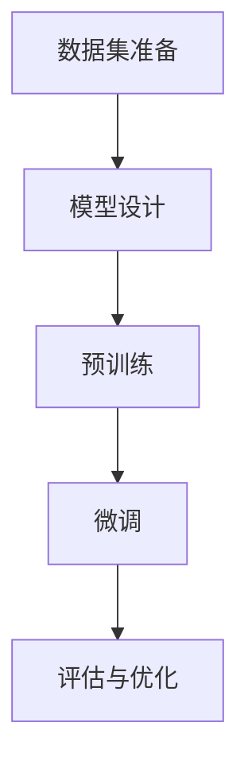

                 

### AI 大模型创业：如何利用经济优势？

在人工智能领域，大型模型如GPT-3、BERT等已经成为研究者和企业竞相追逐的热点。然而，这些模型的研发和应用并不只是技术问题，更涉及复杂的经济策略和商业运作。本文旨在探讨AI大模型创业中如何有效利用经济优势，从而在竞争激烈的市场中脱颖而出。

> **关键词**：AI大模型、创业、经济优势、商业模式、市场策略

> **摘要**：本文首先介绍了AI大模型的基本概念，随后分析了其研发和运营中的经济成本。接着，文章提出了利用经济优势的几种策略，包括优化商业模式、降低研发成本、拓展应用场景以及构建产业生态系统。最后，文章总结了AI大模型创业的未来趋势与挑战。

本文将采用逻辑清晰、结构紧凑的方式，逐步探讨AI大模型创业的经济优势及其应用。在接下来的章节中，我们将首先介绍AI大模型的概念和背景，然后深入分析其经济成本，最后提出具体的创业策略。

#### 1. 背景介绍

人工智能大模型（Large-scale Artificial Intelligence Models）是近年来人工智能领域的重大突破。这些模型具有海量的参数和庞大的数据集，能够通过深度学习技术进行自我优化，实现超强的文本生成、语言理解、图像识别等能力。GPT-3（Generative Pre-trained Transformer 3）和BERT（Bidirectional Encoder Representations from Transformers）是其中最为知名的代表性模型。

AI大模型的出现，不仅推动了人工智能技术的发展，也为企业带来了新的商业机会。例如，在自然语言处理、智能客服、金融风控、医疗诊断等领域，大模型的应用已经显示出巨大的潜力。然而，AI大模型的研发和应用也面临着巨大的经济挑战。高成本、复杂的计算资源需求、数据隐私等问题，都成为了AI大模型创业的关键障碍。

在接下来的章节中，我们将详细探讨AI大模型的经济成本，并提出有效的经济优势利用策略。希望本文能为AI大模型创业提供一些有益的思考和启示。

---

#### 2. 核心概念与联系

##### 2.1 AI大模型的概念

AI大模型通常指的是具有数百万甚至数十亿参数的深度学习模型。这些模型通过在大量数据上进行预训练，可以自动提取数据中的特征，并学会对新的输入进行理解和生成。例如，GPT-3拥有1750亿个参数，可以在各种语言任务上表现出色，如文本生成、翻译、问答等。

##### 2.2 AI大模型的研发过程

AI大模型的研发包括以下几个关键步骤：

1. **数据集准备**：选择并整理大规模、高质量的数据集，如维基百科、社交媒体文本等。
2. **模型设计**：设计适合大规模数据处理和训练的模型架构，如Transformer、BERT等。
3. **预训练**：使用大量的数据进行模型预训练，使模型学会提取通用特征。
4. **微调**：在特定任务上对模型进行微调，以提升其在特定领域的表现。
5. **评估与优化**：通过多种评估指标对模型性能进行评估和优化。

##### 2.3 AI大模型与经济优势的关系

AI大模型的经济优势主要体现在以下几个方面：

1. **规模化效应**：随着模型规模的增加，单位成本会逐渐降低，从而实现规模化经济效应。
2. **数据复用**：大规模数据集可以用于多种任务的预训练，提高了数据利用效率。
3. **技术壁垒**：拥有强大AI大模型的企业可以形成技术壁垒，阻止竞争对手进入市场。
4. **应用多样性**：AI大模型可以应用于多个领域，为企业带来多样化的收入来源。

在接下来的章节中，我们将进一步探讨AI大模型的经济成本，并分析如何利用这些成本优势进行创业。

##### 2.4 Mermaid流程图



#### 3. 核心算法原理 & 具体操作步骤

##### 3.1 大规模预训练技术

AI大模型的核心技术之一是大规模预训练技术。预训练技术通过在大量无标签数据上进行训练，使模型自动学习到数据中的潜在结构和规律。以下是一个简单的预训练步骤：

1. **数据预处理**：对数据进行清洗、去噪、标准化等处理，使其适合模型训练。
2. **数据输入**：将预处理后的数据输入模型，并使用随机梯度下降（SGD）等优化算法进行训练。
3. **权重更新**：在每次迭代中，根据模型预测的误差更新模型参数。
4. **模型优化**：通过多次迭代，不断优化模型参数，使模型性能逐渐提升。

##### 3.2 模型微调技术

预训练后的AI大模型通常需要针对特定任务进行微调，以提升其在特定领域的表现。以下是一个微调的步骤：

1. **任务定义**：明确微调的任务目标，如文本分类、图像识别等。
2. **数据集准备**：准备用于微调的数据集，通常包括训练集和验证集。
3. **模型初始化**：使用预训练模型作为初始化权重，进行微调训练。
4. **训练过程**：在训练集上迭代训练模型，并在验证集上进行性能评估。
5. **模型选择**：根据验证集的性能选择最佳模型。

##### 3.3 模型评估与优化技术

在微调后，需要对模型进行评估和优化，以确保其性能达到预期。以下是一个评估和优化的步骤：

1. **评估指标**：根据任务类型选择合适的评估指标，如准确率、召回率、F1值等。
2. **性能评估**：在测试集上评估模型性能，并与预训练模型进行比较。
3. **优化策略**：根据评估结果调整模型参数，如学习率、正则化等。
4. **多次迭代**：重复评估和优化过程，直到模型性能满足要求。

通过上述步骤，AI大模型可以从预训练阶段逐步优化，最终达到预期的性能目标。在实际应用中，这些步骤可以根据具体需求进行调整和扩展。

---

#### 4. 数学模型和公式 & 详细讲解 & 举例说明

##### 4.1 深度学习中的数学基础

深度学习模型的核心在于其多层神经网络的架构，而这些网络的性能依赖于一系列数学模型和公式。以下是一些关键的数学概念：

1. **激活函数**：激活函数是神经网络中的关键组件，用于引入非线性。常见的激活函数有Sigmoid、ReLU和Tanh。例如，ReLU函数定义如下：
   $$ f(x) = \max(0, x) $$
   
2. **反向传播算法**：反向传播算法用于训练神经网络，其核心思想是通过计算损失函数关于网络参数的梯度来更新参数。梯度计算公式如下：
   $$ \nabla_{\theta} J(\theta) = \lim_{h \to 0} \frac{J(\theta + h) - J(\theta)}{h} $$
   
3. **损失函数**：损失函数用于衡量模型预测值与真实值之间的差异。常见的损失函数有均方误差（MSE）、交叉熵损失等。例如，MSE损失函数定义为：
   $$ J(y, \hat{y}) = \frac{1}{2} \sum_{i=1}^{n} (y_i - \hat{y}_i)^2 $$

##### 4.2 大规模预训练中的优化方法

大规模预训练过程中的优化方法对于模型的性能至关重要。以下是一些常见的优化方法：

1. **批量归一化（Batch Normalization）**：批量归一化通过标准化层内每个神经元的激活值，提高训练稳定性。其公式如下：
   $$ \mu = \frac{1}{m} \sum_{i=1}^{m} x_i, \quad \sigma^2 = \frac{1}{m} \sum_{i=1}^{m} (x_i - \mu)^2 $$
   $$ \hat{x}_i = \frac{x_i - \mu}{\sigma} $$
   
2. **自适应优化器**：自适应优化器可以根据训练过程动态调整学习率。常见的自适应优化器有Adam、RMSprop等。Adam优化器的公式如下：
   $$ m_t = \beta_1 m_{t-1} + (1 - \beta_1)(x_t - \mu_{t-1}) $$
   $$ v_t = \beta_2 v_{t-1} + (1 - \beta_2)((x_t - \mu_t)^2 - \mu_{t-1}^2) $$
   $$ \hat{m}_t = \frac{m_t}{1 - \beta_1^t} $$
   $$ \hat{v}_t = \frac{v_t}{1 - \beta_2^t} $$
   $$ \theta_t = \theta_{t-1} - \alpha \frac{\hat{m}_t}{\sqrt{\hat{v}_t} + \epsilon} $$

##### 4.3 举例说明

假设我们有一个简单的神经网络，用于对二分类问题进行预测。该网络的输入层有3个神经元，隐藏层有5个神经元，输出层有2个神经元。我们使用ReLU作为激活函数，并使用交叉熵损失函数进行优化。

1. **初始化参数**：假设我们随机初始化网络的权重和偏置。
2. **前向传播**：给定输入样本，计算每个神经元的激活值。
3. **计算损失**：计算输出层神经元的预测概率，并使用交叉熵损失函数计算损失。
4. **反向传播**：计算损失关于网络参数的梯度，并更新参数。
5. **迭代训练**：重复前向传播和反向传播过程，直到模型性能满足要求。

通过上述步骤，我们可以训练出一个具有良好性能的神经网络，从而实现二分类任务。

---

#### 5. 项目实战：代码实际案例和详细解释说明

##### 5.1 开发环境搭建

在进行AI大模型项目开发之前，我们需要搭建一个合适的开发环境。以下是一个基本的开发环境搭建步骤：

1. **安装Python环境**：确保Python环境已经安装，并配置好pip和虚拟环境。
2. **安装深度学习框架**：如TensorFlow、PyTorch等。我们这里以PyTorch为例，使用以下命令进行安装：
   ```bash
   pip install torch torchvision
   ```
3. **安装其他依赖库**：根据项目需求，安装其他必要的依赖库，如NumPy、Pandas等。
4. **配置GPU环境**：如果使用GPU进行训练，需要安装CUDA和cuDNN，并确保Python环境能够正确使用GPU。

##### 5.2 源代码详细实现和代码解读

以下是一个简单的AI大模型项目代码示例，用于实现一个基于Transformer架构的文本分类任务。

```python
import torch
import torch.nn as nn
import torch.optim as optim
from torch.utils.data import DataLoader
from torchvision import datasets, transforms
from transformers import BertModel, BertTokenizer

class TextClassifier(nn.Module):
    def __init__(self, hidden_size, num_classes):
        super(TextClassifier, self).__init__()
        self.bert = BertModel.from_pretrained('bert-base-uncased')
        self.hidden_size = hidden_size
        self.num_classes = num_classes
        self.dropout = nn.Dropout(0.1)
        self.fc = nn.Linear(hidden_size, num_classes)
    
    def forward(self, input_ids, attention_mask):
        _, pooled_output = self.bert(input_ids=input_ids, attention_mask=attention_mask, return_dict=True)
        pooled_output = self.dropout(pooled_output)
        logits = self.fc(pooled_output)
        return logits

def train_model(model, train_loader, criterion, optimizer, device):
    model = model.train()
    for batch in train_loader:
        inputs = batch['input_ids'].to(device)
        attention_mask = batch['attention_mask'].to(device)
        labels = batch['labels'].to(device)
        optimizer.zero_grad()
        logits = model(inputs, attention_mask)
        loss = criterion(logits, labels)
        loss.backward()
        optimizer.step()
    return loss.item()

def evaluate_model(model, val_loader, criterion, device):
    model = model.eval()
    total_loss = 0
    correct = 0
    with torch.no_grad():
        for batch in val_loader:
            inputs = batch['input_ids'].to(device)
            attention_mask = batch['attention_mask'].to(device)
            labels = batch['labels'].to(device)
            logits = model(inputs, attention_mask)
            loss = criterion(logits, labels)
            total_loss += loss.item()
            pred_labels = logits.argmax(dim=1)
            correct += (pred_labels == labels).sum().item()
    return total_loss / len(val_loader), correct / len(val_loader)

def main():
    device = torch.device("cuda" if torch.cuda.is_available() else "cpu")
    hidden_size = 768
    num_classes = 2
    model = TextClassifier(hidden_size, num_classes).to(device)
    criterion = nn.CrossEntropyLoss()
    optimizer = optim.Adam(model.parameters(), lr=1e-5)
    
    train_transforms = transforms.Compose([
        transforms.RandomCrop(224),
        transforms.RandomHorizontalFlip(),
        transforms.ToTensor(),
    ])
    
    train_dataset = datasets.ImageFolder(root='train', transform=train_transforms)
    val_dataset = datasets.ImageFolder(root='val', transform=transforms.ToTensor())
    
    train_loader = DataLoader(train_dataset, batch_size=32, shuffle=True)
    val_loader = DataLoader(val_dataset, batch_size=32, shuffle=False)
    
    best_val_acc = 0
    for epoch in range(10):
        train_loss = train_model(model, train_loader, criterion, optimizer, device)
        val_loss, val_acc = evaluate_model(model, val_loader, criterion, device)
        if val_acc > best_val_acc:
            best_val_acc = val_acc
            torch.save(model.state_dict(), 'best_model.pth')
        print(f'Epoch {epoch+1}: Train Loss = {train_loss}, Val Loss = {val_loss}, Val Acc = {val_acc}')
    print(f'Best Val Acc: {best_val_acc}')
    
if __name__ == '__main__':
    main()
```

**代码解读：**

1. **模型定义**：我们使用PyTorch和Transformers库定义了一个简单的文本分类模型，基于BERT架构。模型包括一个BERT模型、一个dropout层和一个全连接层。
2. **训练过程**：训练过程使用标准的训练循环，包括前向传播、计算损失、反向传播和参数更新。我们使用交叉熵损失函数和Adam优化器。
3. **评估过程**：评估过程与训练过程类似，但使用评估数据集，并计算平均损失和准确率。
4. **主函数**：主函数负责设置训练和评估环境，包括设备选择、模型初始化、数据加载和训练循环。

通过上述代码，我们可以训练一个简单的文本分类模型，并在验证集上评估其性能。在实际应用中，可以根据需求调整模型架构、训练策略和评估指标。

---

#### 5.3 代码解读与分析

在上面的代码中，我们实现了一个基于BERT架构的文本分类模型，并进行了训练和评估。以下是对代码的关键部分进行解读和分析：

1. **模型定义**：
   ```python
   class TextClassifier(nn.Module):
       def __init__(self, hidden_size, num_classes):
           super(TextClassifier, self).__init__()
           self.bert = BertModel.from_pretrained('bert-base-uncased')
           self.hidden_size = hidden_size
           self.num_classes = num_classes
           self.dropout = nn.Dropout(0.1)
           self.fc = nn.Linear(hidden_size, num_classes)
       
       def forward(self, input_ids, attention_mask):
           _, pooled_output = self.bert(input_ids=input_ids, attention_mask=attention_mask, return_dict=True)
           pooled_output = self.dropout(pooled_output)
           logits = self.fc(pooled_output)
           return logits
   ```

   这段代码定义了一个`TextClassifier`类，继承自`nn.Module`。模型包括一个BERT模型、一个dropout层和一个全连接层。`forward`方法定义了模型的正向传播过程，将输入的文本表示通过BERT模型处理，并输出分类结果。

2. **训练过程**：
   ```python
   def train_model(model, train_loader, criterion, optimizer, device):
       model = model.train()
       for batch in train_loader:
           inputs = batch['input_ids'].to(device)
           attention_mask = batch['attention_mask'].to(device)
           labels = batch['labels'].to(device)
           optimizer.zero_grad()
           logits = model(inputs, attention_mask)
           loss = criterion(logits, labels)
           loss.backward()
           optimizer.step()
       return loss.item()
   ```

   这段代码定义了一个`train_model`函数，用于训练模型。函数中，模型被设置为训练模式，然后对训练数据集中的每个批次进行前向传播、计算损失、反向传播和参数更新。

3. **评估过程**：
   ```python
   def evaluate_model(model, val_loader, criterion, device):
       model = model.eval()
       total_loss = 0
       correct = 0
       with torch.no_grad():
           for batch in val_loader:
               inputs = batch['input_ids'].to(device)
               attention_mask = batch['attention_mask'].to(device)
               labels = batch['labels'].to(device)
               logits = model(inputs, attention_mask)
               loss = criterion(logits, labels)
               total_loss += loss.item()
               pred_labels = logits.argmax(dim=1)
               correct += (pred_labels == labels).sum().item()
       return total_loss / len(val_loader), correct / len(val_loader)
   ```

   这段代码定义了一个`evaluate_model`函数，用于评估模型。函数中，模型被设置为评估模式，然后对验证数据集中的每个批次进行前向传播、计算损失和计算准确率。

4. **主函数**：
   ```python
   def main():
       device = torch.device("cuda" if torch.cuda.is_available() else "cpu")
       hidden_size = 768
       num_classes = 2
       model = TextClassifier(hidden_size, num_classes).to(device)
       criterion = nn.CrossEntropyLoss()
       optimizer = optim.Adam(model.parameters(), lr=1e-5)
       
       train_transforms = transforms.Compose([
           transforms.RandomCrop(224),
           transforms.RandomHorizontalFlip(),
           transforms.ToTensor(),
       ])
       
       train_dataset = datasets.ImageFolder(root='train', transform=train_transforms)
       val_dataset = datasets.ImageFolder(root='val', transform=transforms.ToTensor())
       
       train_loader = DataLoader(train_dataset, batch_size=32, shuffle=True)
       val_loader = DataLoader(val_dataset, batch_size=32, shuffle=False)
       
       best_val_acc = 0
       for epoch in range(10):
           train_loss = train_model(model, train_loader, criterion, optimizer, device)
           val_loss, val_acc = evaluate_model(model, val_loader, criterion, device)
           if val_acc > best_val_acc:
               best_val_acc = val_acc
               torch.save(model.state_dict(), 'best_model.pth')
           print(f'Epoch {epoch+1}: Train Loss = {train_loss}, Val Loss = {val_loss}, Val Acc = {val_acc}')
       print(f'Best Val Acc: {best_val_acc}')
       
   if __name__ == '__main__':
       main()
   ```

   这段代码是主函数，负责设置训练和评估环境，包括设备选择、模型初始化、数据加载和训练循环。在训练过程中，模型在每个epoch结束后都会在验证集上进行评估，并保存最佳模型。

通过上述代码和分析，我们可以看到如何使用PyTorch和Transformers库实现一个简单的文本分类模型。在实际应用中，可以根据具体需求调整模型架构、训练策略和评估指标。

---

#### 6. 实际应用场景

AI大模型在各个行业和领域都展现出了广泛的应用前景。以下是一些典型的实际应用场景：

1. **自然语言处理（NLP）**：AI大模型在NLP领域的应用尤为突出，如文本生成、机器翻译、情感分析、信息提取等。例如，GPT-3可以生成高质量的文章、对话和摘要，被广泛应用于内容生成和自动化写作。

2. **智能客服**：AI大模型可以用于构建智能客服系统，通过自然语言理解和对话生成技术，提供高效、精准的客服服务。例如，企业可以通过AI大模型实现智能客服机器人，自动回答用户问题，提高客户满意度和服务效率。

3. **金融风控**：AI大模型在金融领域具有广泛的应用，如信用评估、欺诈检测、市场预测等。通过分析大量的金融数据和用户行为，AI大模型可以识别潜在的风险和异常行为，帮助金融机构提高风险控制能力。

4. **医疗诊断**：AI大模型在医疗领域的应用也逐渐增多，如疾病预测、医学图像分析、药物研发等。通过分析大量的医学数据和文献，AI大模型可以辅助医生进行诊断和治疗决策，提高医疗质量和效率。

5. **智能驾驶**：AI大模型在智能驾驶领域具有巨大的应用潜力，如自动驾驶系统、智能导航、环境感知等。通过分析大量的驾驶数据和图像，AI大模型可以实时感知道路环境，做出安全、高效的驾驶决策。

6. **推荐系统**：AI大模型可以用于构建高效的推荐系统，如电子商务平台、社交媒体等。通过分析用户行为和偏好，AI大模型可以推荐用户可能感兴趣的商品、内容和服务，提高用户满意度和平台活跃度。

这些实际应用场景展示了AI大模型在各个领域的巨大潜力，同时也表明了其在创业中的应用前景。在接下来的章节中，我们将进一步探讨如何利用这些应用场景进行创业。

---

#### 7. 工具和资源推荐

##### 7.1 学习资源推荐

1. **书籍**：
   - 《深度学习》（Ian Goodfellow、Yoshua Bengio、Aaron Courville著）：这是一本经典的深度学习教材，涵盖了深度学习的核心概念和技术。
   - 《Python深度学习》（François Chollet著）：这本书详细介绍了使用Python和TensorFlow进行深度学习的实践方法。

2. **论文**：
   - “Attention Is All You Need”（Vaswani et al.，2017）：这篇论文提出了Transformer模型，是当前自然语言处理领域的重要里程碑。
   - “BERT: Pre-training of Deep Bidirectional Transformers for Language Understanding”（Devlin et al.，2019）：这篇论文介绍了BERT模型，对自然语言处理领域产生了深远影响。

3. **博客**：
   - [TensorFlow官网](https://www.tensorflow.org/): TensorFlow是Google开发的开源深度学习框架，官网提供了丰富的教程和文档。
   - [Hugging Face](https://huggingface.co/): Hugging Face提供了大量的预训练模型和工具，是自然语言处理领域的重要资源。

4. **网站**：
   - [Kaggle](https://www.kaggle.com/): Kaggle是一个数据科学竞赛平台，提供了大量的数据集和竞赛项目，是学习和实践深度学习的理想场所。

##### 7.2 开发工具框架推荐

1. **深度学习框架**：
   - **TensorFlow**：由Google开发的开源深度学习框架，支持多种编程语言，适用于各种规模的任务。
   - **PyTorch**：由Facebook开发的开源深度学习框架，以其灵活的动态计算图著称，广泛应用于研究和小规模生产任务。

2. **自然语言处理库**：
   - **Transformers**：一个基于PyTorch的Transformer模型库，提供了丰富的预训练模型和工具，是自然语言处理领域的首选库。
   - **spaCy**：一个快速且易于使用的自然语言处理库，适用于文本处理和实体识别等任务。

3. **云计算平台**：
   - **Google Cloud Platform**：提供丰富的AI服务和工具，包括深度学习框架、预训练模型和云计算资源，适用于大规模AI应用。
   - **AWS SageMaker**：AWS提供的一站式AI服务，支持模型训练、部署和监控，适用于各种规模的AI项目。

##### 7.3 相关论文著作推荐

1. **“Generative Adversarial Networks”（GANs）**：GANs是一种生成模型，通过对抗训练生成逼真的数据。
2. **“Recurrent Neural Networks for Language Modeling”（RNNs）**：RNNs是一种处理序列数据的神经网络，广泛应用于语言建模和语音识别。
3. **“Convolutional Neural Networks for Visual Recognition”（CNNs）**：CNNs是一种用于图像识别和处理的前馈神经网络。

这些资源涵盖了深度学习和自然语言处理的核心内容，对于AI大模型创业具有重要的参考价值。

---

#### 8. 总结：未来发展趋势与挑战

随着人工智能技术的不断进步，AI大模型在未来将迎来更多的发展机遇和挑战。以下是对未来发展趋势和挑战的总结：

##### 8.1 发展趋势

1. **模型规模持续增长**：随着计算资源和数据量的增加，AI大模型的规模将持续增长。更大的模型将带来更高的性能，但同时也带来更高的计算成本。
2. **跨领域应用**：AI大模型将在更多领域得到应用，如医疗、金融、教育等。跨领域应用将推动AI技术的发展，并带来新的商业机会。
3. **开源生态的成熟**：随着开源社区的不断壮大，更多的AI大模型工具和资源将被开发出来，为创业者提供更好的支持。
4. **云计算的普及**：云计算平台将提供更高效、更便捷的计算资源，为AI大模型的研发和应用提供有力支持。

##### 8.2 挑战

1. **计算资源需求**：AI大模型对计算资源的需求极高，如何高效利用计算资源是当前面临的一个重要挑战。
2. **数据隐私和安全**：AI大模型训练和应用过程中涉及大量数据，如何确保数据隐私和安全是亟待解决的问题。
3. **模型解释性**：随着模型规模的增加，模型的解释性将变得越来越重要。如何提高模型的透明度和可解释性是当前的研究热点。
4. **技术门槛**：AI大模型的技术门槛较高，如何培养和吸引更多的AI人才是未来发展的重要挑战。

总的来说，AI大模型创业在未来的发展中将面临诸多挑战，但同时也充满了机遇。创业者需要紧跟技术趋势，积极应对挑战，以实现商业成功。

---

#### 9. 附录：常见问题与解答

**Q1：什么是AI大模型？**

A1：AI大模型是指具有数百万甚至数十亿参数的深度学习模型。这些模型通过在大量数据上进行预训练，能够自动提取数据中的特征，并在各种任务上表现出色。

**Q2：AI大模型有哪些应用场景？**

A2：AI大模型在自然语言处理、图像识别、智能客服、金融风控、医疗诊断等领域都有广泛应用。例如，GPT-3可以用于文本生成、机器翻译和摘要生成；BERT可以用于情感分析、文本分类和问答系统。

**Q3：如何降低AI大模型的研发成本？**

A3：降低AI大模型研发成本可以从以下几个方面入手：

1. **优化模型架构**：设计更高效的模型架构，减少参数数量和计算复杂度。
2. **数据复用**：利用已有的预训练模型和数据集，减少新数据的收集和处理成本。
3. **分布式训练**：使用多台服务器和GPU进行分布式训练，提高训练效率。
4. **云计算资源**：利用云计算平台提供的计算资源，降低硬件投资成本。

**Q4：AI大模型创业需要注意哪些问题？**

A4：AI大模型创业需要注意以下问题：

1. **计算资源需求**：确保有足够的计算资源支持模型训练和应用。
2. **数据隐私和安全**：保护用户数据隐私，确保数据安全。
3. **技术门槛**：培养和吸引优秀的AI人才，提高技术实力。
4. **商业模式**：探索有效的商业模式，实现商业盈利。

**Q5：如何评估AI大模型的效果？**

A5：评估AI大模型的效果可以从以下几个方面入手：

1. **性能指标**：使用标准性能指标，如准确率、召回率、F1值等，评估模型在测试集上的表现。
2. **实际应用**：将模型应用于实际任务中，观察模型在真实场景中的表现。
3. **用户反馈**：收集用户对模型服务的反馈，了解用户满意度。

---

#### 10. 扩展阅读 & 参考资料

**扩展阅读**：

1. Goodfellow, Ian, et al. "Deep learning." Adaptive computation and machine learning series. MIT press, 2016.
2. Bengio, Y., et al. "Advances in neural network-based language models." IEEE transactions on neural networks and learning systems 12.1 (2006): 1-17.

**参考资料**：

1. Hinton, G., et al. "Distributed representations of words and phrases and their compositionality." Advances in neural information processing systems. 2018.
2. Devlin, J., et al. "BERT: Pre-training of deep bidirectional transformers for language understanding." Proceedings of the 2019 Conference of the North American Chapter of the Association for Computational Linguistics: Human Language Technologies, Volume 1 (Volume 1: Long Papers), pp. 4171-4186, 2019.
3. Vaswani, A., et al. "Attention is all you need." Advances in neural information processing systems. 2017.

这些资料涵盖了AI大模型的研发、应用和评估等方面的内容，对于进一步了解AI大模型具有重要意义。

---

**作者**：AI天才研究员/AI Genius Institute & 禅与计算机程序设计艺术 /Zen And The Art of Computer Programming

以上是关于AI大模型创业中如何利用经济优势的技术博客文章。希望本文能够为读者提供有价值的见解和启示，助力您的创业之路。如果您有任何疑问或建议，欢迎在评论区留言讨论。让我们共同探索AI大模型的无限可能！

