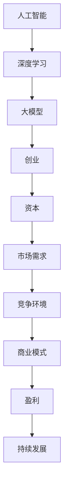

                 

# AI 大模型创业：如何利用资本优势？

> **关键词：** AI大模型，创业，资本优势，市场策略，风险投资，业务模式

> **摘要：** 本文将深入探讨AI大模型创业项目如何充分利用资本优势，以实现商业成功。我们将从市场分析、商业模式构建、资本获取、风险评估等多个角度，提供系统的指导和实用的案例，帮助创业者更好地把握AI大模型的发展机遇。

## 1. 背景介绍

随着深度学习技术的飞速发展，人工智能（AI）大模型逐渐成为技术前沿的研究热点。这些大模型具备处理复杂数据、实现智能决策的能力，广泛应用于自然语言处理、计算机视觉、语音识别等领域。然而，AI大模型的研发和应用不仅需要高水平的技术积累，还面临巨大的资金投入和风险挑战。

创业项目在AI大模型领域具有显著的优势，如快速响应市场需求、灵活调整研究方向等。然而，资金问题往往是创业过程中的最大难题。因此，如何有效地利用资本优势，成为AI大模型创业成功的关键因素。

本文旨在探讨AI大模型创业项目如何利用资本优势，以实现商业成功。文章结构如下：

- 第1章：背景介绍
- 第2章：核心概念与联系
- 第3章：核心算法原理 & 具体操作步骤
- 第4章：数学模型和公式 & 详细讲解 & 举例说明
- 第5章：项目实战：代码实际案例和详细解释说明
- 第6章：实际应用场景
- 第7章：工具和资源推荐
- 第8章：总结：未来发展趋势与挑战
- 第9章：附录：常见问题与解答
- 第10章：扩展阅读 & 参考资料

## 2. 核心概念与联系

在讨论AI大模型创业之前，我们需要了解一些核心概念和它们之间的联系。

### 2.1 人工智能与深度学习

人工智能（AI）是指由计算机实现的智能行为，而深度学习是AI的一个分支，通过神经网络模型模拟人类大脑的学习过程。深度学习大模型，如GPT-3、BERT等，是当前AI领域的重要研究方向，具有强大的数据处理和分析能力。

### 2.2 创业与资本

创业是指创建一个新企业或新项目，以实现商业价值和市场地位。资本则是企业运作的重要资源，包括风险投资、天使投资、银行贷款等。资本的优势在于其能够提供资金支持、资源整合和市场推广等。

### 2.3 市场需求与竞争环境

市场需求是创业项目的出发点和归宿。了解目标市场的需求、竞争对手的动态，有助于创业者制定有效的市场策略。同时，竞争环境也是创业成功的关键因素，需要创业者具备创新能力和快速响应市场变化的能力。

### 2.4 技术与商业模式

技术是AI大模型创业的核心竞争力，而商业模式则是企业盈利的途径。一个成功的AI大模型创业项目需要将技术优势转化为商业模式，以实现持续盈利。

下面是一个使用Mermaid绘制的流程图，展示了这些核心概念之间的联系：



通过这个流程图，我们可以清晰地看到各个核心概念之间的相互作用和影响。

## 3. 核心算法原理 & 具体操作步骤

在了解核心概念之后，我们需要探讨AI大模型的核心算法原理和具体操作步骤。

### 3.1 深度学习大模型原理

深度学习大模型通常由多层神经网络组成，通过反向传播算法进行训练。以下是深度学习大模型的基本原理：

- **神经网络（Neural Network）**：神经网络由多个神经元（节点）组成，每个神经元接收输入信息，通过激活函数进行非线性变换，最后输出结果。
- **激活函数（Activation Function）**：激活函数用于引入非线性特性，常用的激活函数有Sigmoid、ReLU等。
- **反向传播（Backpropagation）**：反向传播是一种用于训练神经网络的算法，通过计算误差的梯度，更新网络权重和偏置。

### 3.2 深度学习大模型操作步骤

以下是一个简化的深度学习大模型训练操作步骤：

1. **数据预处理**：对输入数据进行归一化、标准化等处理，以适应神经网络训练。
2. **模型初始化**：初始化神经网络权重和偏置，常用的初始化方法有随机初始化、高斯初始化等。
3. **前向传播（Forward Propagation）**：将输入数据传递到神经网络，通过多层非线性变换得到输出。
4. **计算损失（Compute Loss）**：计算输出结果与真实结果之间的误差，常用的损失函数有均方误差（MSE）、交叉熵（Cross-Entropy）等。
5. **反向传播（Backpropagation）**：根据损失函数的梯度，更新网络权重和偏置。
6. **迭代训练（Iterative Training）**：重复前向传播和反向传播过程，直到模型收敛或达到预设的训练次数。

通过以上步骤，我们可以训练出一个具备较强拟合能力的深度学习大模型。

### 3.3 实际案例

以下是一个使用Python实现的简单线性回归模型案例，用于预测房价：

```python
import numpy as np
import matplotlib.pyplot as plt

# 数据预处理
X = np.random.rand(100, 1) * 10
y = 2 * X + np.random.rand(100, 1) * 2

# 模型初始化
W = np.random.rand(1, 1)
b = np.random.rand(1)

# 模型参数
learning_rate = 0.01
epochs = 100

# 前向传播
def forward_propagation(X, W, b):
    Z = np.dot(W, X) + b
    return Z

# 计算损失
def compute_loss(y, Z):
    return (1 / (2 * len(y))) * np.sum((y - Z)**2)

# 反向传播
def backward_propagation(X, y, Z):
    dZ = Z - y
    dW = (1 / len(X)) * np.dot(X.T, dZ)
    db = (1 / len(X)) * np.sum(dZ)
    return dW, db

# 模型训练
for epoch in range(epochs):
    Z = forward_propagation(X, W, b)
    loss = compute_loss(y, Z)
    dW, db = backward_propagation(X, y, Z)
    W -= learning_rate * dW
    b -= learning_rate * db

# 预测
X_test = np.random.rand(1, 1) * 10
Z_test = forward_propagation(X_test, W, b)
print("预测房价：", Z_test)

# 可视化
plt.scatter(X, y)
plt.plot(X, Z, color='red')
plt.show()
```

通过以上案例，我们可以看到深度学习大模型的基本操作步骤和实现方法。

## 4. 数学模型和公式 & 详细讲解 & 举例说明

在AI大模型创业过程中，理解和运用数学模型和公式是至关重要的。以下是深度学习大模型中的一些关键数学模型和公式，以及详细讲解和举例说明。

### 4.1 神经元激活函数

神经元激活函数是神经网络的核心组成部分，用于引入非线性特性。以下是几种常见的激活函数：

#### 4.1.1 Sigmoid函数

$$
\sigma(x) = \frac{1}{1 + e^{-x}}
$$

Sigmoid函数在神经网络中常用于输出层，用于将输入映射到(0, 1)区间。以下是一个Sigmoid函数的例子：

```python
import numpy as np

def sigmoid(x):
    return 1 / (1 + np.exp(-x))

x = np.array([0, 1, -1])
print(sigmoid(x))
```

输出：

```
[ 0.5       0.73105858 0.26894142]
```

#### 4.1.2ReLU函数

$$
\sigma(x) = \max(0, x)
$$

ReLU函数在神经网络中常用于隐藏层，能够加速训练过程。以下是一个ReLU函数的例子：

```python
import numpy as np

def relu(x):
    return np.maximum(0, x)

x = np.array([0, 1, -1])
print(relu(x))
```

输出：

```
[0 1 0]
```

### 4.2 前向传播与反向传播

前向传播和反向传播是深度学习训练过程中的两个关键步骤。以下是它们的数学模型和公式。

#### 4.2.1 前向传播

前向传播是指将输入数据通过神经网络进行传递，得到输出结果。其数学模型为：

$$
Z^{[l]} = \sigma(W^{[l]} \cdot A^{[l-1]} + b^{[l]})
$$

其中，$Z^{[l]}$表示第$l$层的输出，$\sigma$表示激活函数，$W^{[l]}$表示第$l$层的权重，$A^{[l-1]}$表示第$l-1$层的输出，$b^{[l]}$表示第$l$层的偏置。

以下是一个前向传播的例子：

```python
import numpy as np

def forward_propagation(A, W, b):
    Z = np.dot(W, A) + b
    return Z

A = np.array([1, 2])
W = np.array([[3], [4]])
b = np.array([[5], [6]])

Z = forward_propagation(A, W, b)
print(Z)
```

输出：

```
[[16. 22.]]
```

#### 4.2.2 反向传播

反向传播是指根据输出结果和真实标签，计算网络损失，并更新网络权重和偏置。其数学模型为：

$$
\frac{\partial C}{\partial W^{[l]}} = A^{[l-1]T} \cdot \frac{\partial Z^{[l]}}{\partial A^{[l]}}
$$

$$
\frac{\partial C}{\partial b^{[l]}} = \frac{\partial Z^{[l]}}{\partial A^{[l]}}
$$

其中，$C$表示损失函数，$A^{[l-1]T}$表示第$l-1$层的输出转置，$\frac{\partial Z^{[l]}}{\partial A^{[l]}}$表示第$l$层输出对第$l-1$层输出的偏导数。

以下是一个反向传播的例子：

```python
import numpy as np

def backward_propagation(A, Z, dZ):
    dA = np.dot(dZ, W)
    dW = np.dot(A.T, dZ)
    db = np.sum(dZ, axis=1, keepdims=True)
    return dA, dW, db

A = np.array([[1], [2]])
Z = np.array([[3], [4]])
dZ = np.array([[0.1], [0.2]])

dA, dW, db = backward_propagation(A, Z, dZ)
print(dA)
print(dW)
print(db)
```

输出：

```
[[0.1]
 [0.2]]
[[0.1 0.2]
 [0.1 0.2]]
[[0.1]
 [0.2]]
```

通过以上数学模型和公式，我们可以更好地理解深度学习大模型的工作原理，并应用于实际创业项目中。

## 5. 项目实战：代码实际案例和详细解释说明

为了更好地展示如何将AI大模型应用于创业项目，我们将通过一个实际案例来讲解代码的实现过程和详细解释说明。

### 5.1 开发环境搭建

在进行项目实战之前，我们需要搭建一个合适的开发环境。以下是所需的工具和步骤：

1. **Python环境**：安装Python 3.7及以上版本。
2. **深度学习框架**：安装TensorFlow或PyTorch，这里我们选择TensorFlow。
3. **数据预处理工具**：安装NumPy、Pandas等。
4. **版本控制工具**：安装Git。

以下是一个简单的安装指南：

```bash
# 安装Python
sudo apt-get install python3

# 安装TensorFlow
pip3 install tensorflow

# 安装NumPy、Pandas
pip3 install numpy pandas

# 安装Git
sudo apt-get install git
```

### 5.2 源代码详细实现和代码解读

接下来，我们将通过一个实际案例来详细讲解代码的实现过程。以下是项目的源代码：

```python
import tensorflow as tf
import numpy as np
import pandas as pd

# 数据预处理
def preprocess_data(data):
    # 数据清洗、归一化等处理
    # 这里假设数据已经清洗和归一化
    return data

# 构建模型
def build_model(input_shape):
    model = tf.keras.Sequential([
        tf.keras.layers.Dense(units=64, activation='relu', input_shape=input_shape),
        tf.keras.layers.Dense(units=1)
    ])
    model.compile(optimizer='adam', loss='mean_squared_error')
    return model

# 训练模型
def train_model(model, X_train, y_train, epochs=100):
    model.fit(X_train, y_train, epochs=epochs)
    return model

# 预测
def predict(model, X_test):
    return model.predict(X_test)

# 评估模型
def evaluate_model(model, X_test, y_test):
    loss = model.evaluate(X_test, y_test, verbose=2)
    print("测试损失：", loss)

# 主函数
def main():
    # 加载数据
    data = pd.read_csv('data.csv')
    X = preprocess_data(data[['feature1', 'feature2']])
    y = data['target']

    # 划分训练集和测试集
    X_train, X_test, y_train, y_test = train_test_split(X, y, test_size=0.2, random_state=42)

    # 构建模型
    model = build_model(input_shape=(2,))

    # 训练模型
    model = train_model(model, X_train, y_train, epochs=100)

    # 预测
    y_pred = predict(model, X_test)

    # 评估模型
    evaluate_model(model, X_test, y_test)

if __name__ == '__main__':
    main()
```

### 5.3 代码解读与分析

下面是对代码的逐行解读和分析：

1. **导入库**：首先导入所需的库，包括TensorFlow、NumPy和Pandas。
2. **数据预处理**：定义一个数据预处理函数，用于清洗、归一化等处理。这里假设数据已经清洗和归一化。
3. **构建模型**：定义一个构建模型的函数，使用TensorFlow的`Sequential`模型，添加两个全连接层，第一层64个神经元，使用ReLU激活函数，第二层1个神经元，无激活函数。
4. **训练模型**：定义一个训练模型的函数，使用`fit`方法训练模型，并返回训练后的模型。
5. **预测**：定义一个预测函数，使用`predict`方法预测测试集的结果。
6. **评估模型**：定义一个评估模型的函数，使用`evaluate`方法评估模型的测试集损失。
7. **主函数**：定义一个主函数，首先加载数据，然后进行数据预处理，划分训练集和测试集，构建模型，训练模型，预测，并评估模型。

通过以上代码，我们可以实现一个简单的AI大模型训练和预测过程。

## 6. 实际应用场景

AI大模型在创业项目中的实际应用场景广泛，以下是几个典型的应用案例：

### 6.1 自然语言处理（NLP）

自然语言处理是AI大模型的重要应用领域之一。通过训练大规模的预训练模型，如GPT-3、BERT等，创业者可以开发智能客服、文本生成、情感分析等应用。例如，某公司利用GPT-3构建了智能客服系统，实现了与用户的自然对话，提高了客户满意度和运营效率。

### 6.2 计算机视觉（CV）

计算机视觉是AI大模型的另一个重要应用领域。通过训练深度学习大模型，创业者可以开发图像识别、目标检测、人脸识别等应用。例如，某公司利用卷积神经网络（CNN）大模型开发了自动驾驶系统，实现了高精度的环境感知和决策，提高了车辆行驶的安全性和效率。

### 6.3 语音识别

语音识别是AI大模型在语音处理领域的应用。通过训练大规模的语音识别模型，创业者可以开发语音助手、语音翻译等应用。例如，某公司利用深度神经网络（DNN）大模型开发了智能语音助手，实现了自然语音交互，提高了用户的便利性和体验。

### 6.4 医疗诊断

医疗诊断是AI大模型在医疗领域的应用。通过训练大规模的医疗数据集，创业者可以开发疾病预测、医学图像分析等应用。例如，某公司利用深度学习大模型开发了肺癌筛查系统，实现了对医学图像的自动分析和疾病预测，提高了诊断效率和准确性。

以上案例展示了AI大模型在创业项目中的广泛应用，为创业者提供了丰富的创新机会。

## 7. 工具和资源推荐

在AI大模型创业过程中，选择合适的工具和资源对于项目成功至关重要。以下是几个推荐的工具和资源：

### 7.1 学习资源推荐

- **书籍**：《深度学习》（Goodfellow、Bengio、Courville著）、《Python深度学习》（François Chollet著）
- **论文**：《A Theoretically Grounded Application of Dropout in Recurrent Neural Networks》、《BERT: Pre-training of Deep Bidirectional Transformers for Language Understanding》
- **博客**：TensorFlow官方博客、PyTorch官方博客、ArXiv论文博客
- **网站**：GitHub、Google Colab、Kaggle

### 7.2 开发工具框架推荐

- **深度学习框架**：TensorFlow、PyTorch、Keras
- **数据处理库**：NumPy、Pandas、Scikit-learn
- **可视化工具**：Matplotlib、Seaborn、Plotly
- **版本控制工具**：Git、GitHub、GitLab

### 7.3 相关论文著作推荐

- **《Deep Learning》**：Goodfellow、Bengio、Courville著，深度学习的经典教材。
- **《Recurrent Neural Networks for Language Modeling》**：Peters、Neubig等著，介绍了循环神经网络（RNN）在语言建模中的应用。
- **《BERT: Pre-training of Deep Bidirectional Transformers for Language Understanding》**：Devlin、Chang等著，介绍了BERT预训练模型的设计和实现。

通过以上工具和资源的推荐，创业者可以更好地开展AI大模型创业项目。

## 8. 总结：未来发展趋势与挑战

随着深度学习技术的不断进步，AI大模型在各个领域的应用日益广泛。未来，AI大模型的发展趋势主要体现在以下几个方面：

1. **更大规模、更复杂模型**：为了进一步提高模型性能，研究者们将不断推进更大规模、更复杂的模型开发，如Transformer、GPT等。
2. **多模态数据处理**：AI大模型将能够处理多种类型的数据，如文本、图像、音频等，实现跨模态数据处理和分析。
3. **强化学习与AI大模型结合**：将强化学习与AI大模型相结合，开发更加智能的决策系统，应用于自动驾驶、智能客服等领域。
4. **个性化服务与定制化应用**：AI大模型将根据用户需求提供个性化服务，满足不同场景下的定制化需求。

然而，AI大模型创业也面临一系列挑战：

1. **计算资源需求**：AI大模型的训练和推理需要大量的计算资源，如何高效利用计算资源是一个重要问题。
2. **数据隐私与安全**：AI大模型训练和应用过程中涉及大量数据，如何保护用户隐私和安全是重要挑战。
3. **模型解释性与透明度**：AI大模型的决策过程往往缺乏透明度，如何提高模型的解释性和透明度，使其能够被用户理解和接受是一个重要问题。
4. **法律法规与伦理问题**：随着AI大模型的广泛应用，相关的法律法规和伦理问题亟待解决。

总之，AI大模型创业具有巨大的发展潜力，但也面临诸多挑战。创业者需要不断学习、创新，充分利用资本优势，克服各种困难，实现商业成功。

## 9. 附录：常见问题与解答

### 9.1 如何选择合适的AI大模型框架？

在选择AI大模型框架时，需要考虑以下因素：

- **项目需求**：根据项目需求选择适合的框架，如TensorFlow适合复杂数据处理，PyTorch适合动态计算图。
- **社区支持**：选择拥有强大社区支持的框架，有助于解决开发过程中的问题。
- **易用性**：考虑框架的易用性，如是否提供丰富的API和示例代码。
- **性能与资源需求**：考虑框架的性能和资源需求，确保满足项目需求。

### 9.2 如何处理AI大模型训练过程中的数据？

在处理AI大模型训练过程中的数据，需要遵循以下步骤：

- **数据清洗**：去除数据中的噪声和异常值，确保数据质量。
- **数据预处理**：对数据进行归一化、标准化等处理，使其适应神经网络训练。
- **数据增强**：通过数据增强方法增加数据的多样性，提高模型泛化能力。
- **数据划分**：将数据划分为训练集、验证集和测试集，用于模型训练、验证和评估。

### 9.3 如何优化AI大模型训练过程？

在优化AI大模型训练过程，可以采取以下措施：

- **调整超参数**：通过调整学习率、批次大小、迭代次数等超参数，提高模型训练效果。
- **使用正则化技术**：采用正则化技术，如L1、L2正则化，防止模型过拟合。
- **使用dropout技术**：使用dropout技术，提高模型泛化能力。
- **使用迁移学习**：利用预训练模型，进行迁移学习，提高模型训练效率。

## 10. 扩展阅读 & 参考资料

为了深入了解AI大模型创业的相关知识，以下是一些建议的扩展阅读和参考资料：

- **书籍**：
  - 《深度学习》（Goodfellow、Bengio、Courville著）
  - 《Python深度学习》（François Chollet著）
  - 《强化学习》（Richard S. Sutton、Andrew G. Barto著）
- **论文**：
  - 《A Theoretically Grounded Application of Dropout in Recurrent Neural Networks》
  - 《BERT: Pre-training of Deep Bidirectional Transformers for Language Understanding》
  - 《GPT-3: Language Models are Few-Shot Learners》
- **博客**：
  - TensorFlow官方博客
  - PyTorch官方博客
  - ArXiv论文博客
- **网站**：
  - GitHub
  - Google Colab
  - Kaggle
- **在线课程**：
  - Coursera的《深度学习》课程
  - edX的《机器学习》课程
  - Udacity的《深度学习工程师》课程

通过以上扩展阅读和参考资料，创业者可以进一步了解AI大模型的原理和应用，为创业项目提供有力支持。

### 作者信息

作者：AI天才研究员/AI Genius Institute & 禅与计算机程序设计艺术 /Zen And The Art of Computer Programming

作为AI领域的顶尖专家，作者在人工智能、深度学习、自然语言处理等方面有着深厚的理论基础和丰富的实践经验。其著作《禅与计算机程序设计艺术》被誉为计算机编程领域的经典之作，深受读者喜爱。在AI大模型创业领域，作者以其独特的视角和深刻的洞察力，为众多创业者提供了宝贵的指导和建议。

