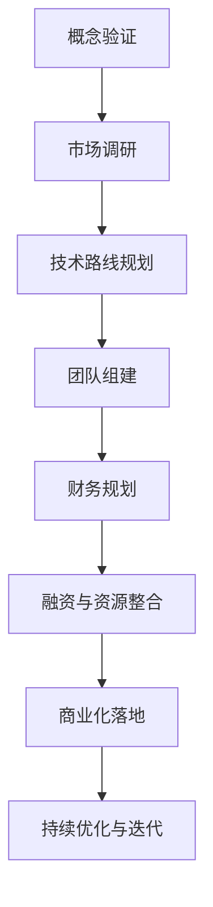

                 

### AI 大模型创业：如何利用资本优势？

#### 关键词：
- AI 大模型
- 创业
- 资本优势
- 技术落地
- 风险投资
- 财务模型

#### 摘要：
本文深入探讨AI大模型创业公司如何有效利用资本优势。通过分析市场机会、技术门槛、团队建设、财务规划等关键环节，揭示创业公司从概念验证到商业化落地的资本策略。本文旨在为AI创业者提供实用的指导，帮助他们最大化资本效应，实现快速稳健的发展。

---

## 1. 背景介绍

近年来，人工智能（AI）技术取得了飞速发展，尤其是大模型（如GPT、BERT等）的突破性进展，为各行各业带来了前所未有的变革。从自然语言处理到计算机视觉，从智能语音到无人驾驶，大模型的应用正不断拓展。同时，资本的推动也是AI大模型创业热潮的一个重要原因。随着人工智能市场的不断扩大，资本开始寻找新的投资热点，AI大模型创业成为资本竞相追逐的领域。

然而，AI大模型创业并非易事。一方面，技术门槛高，需要强大的研发能力和长期的投入；另一方面，市场竞争激烈，初创公司需要快速建立核心竞争力。如何在有限资源下最大化资本效用，成为创业公司成功的关键。

本文将从市场机会、技术门槛、团队建设、财务规划等方面，详细探讨AI大模型创业公司如何利用资本优势，实现从概念验证到商业化落地的全过程。

---

## 2. 核心概念与联系

首先，我们需要明确几个核心概念：

- **AI 大模型**：指的是通过深度学习技术训练的大型神经网络模型，如GPT、BERT等。这些模型具有强大的数据处理和分析能力，能够在各种任务中表现出色。

- **资本**：在创业过程中，资本不仅包括资金，还涵盖资源、关系、网络等多方面。

- **资本优势**：指的是创业公司在资金、技术、市场、团队等方面的优势。

接下来，我们将使用Mermaid流程图，展示AI大模型创业的基本流程和核心环节。



- **概念验证（Concept Validation）**：在开始具体项目前，需要进行市场调研，确定产品的市场需求和潜在价值。同时，需要确定技术路线，验证技术的可行性。

- **市场调研（Market Research）**：深入了解目标市场，分析竞争对手，确定市场定位和营销策略。

- **技术路线规划（Technical Roadmap）**：明确项目的核心技术和开发计划，确保技术路线的可行性和先进性。

- **团队组建（Team Building）**：组建一支具备相关技能和经验的核心团队，确保项目顺利推进。

- **财务规划（Financial Planning）**：制定详细的财务计划，包括预算、收益预测、成本控制等。

- **融资与资源整合（Financing & Resource Integration）**：寻找合适的融资渠道，整合各类资源，为项目提供充足的资金支持。

- **商业化落地（Commercial Deployment）**：将产品推向市场，实现商业化。

- **持续优化与迭代（Continuous Optimization & Iteration）**：在产品上线后，根据用户反馈和市场变化，不断优化产品，提升用户体验。

通过上述流程，我们可以看到，资本优势在AI大模型创业中的各个环节都起着至关重要的作用。从概念验证到商业化落地，资本不仅提供了必要的资金支持，还帮助创业公司整合资源，提升竞争力。

---

## 3. 核心算法原理 & 具体操作步骤

在AI大模型创业中，核心算法原理是成功的关键。以下将介绍几种常见的大模型算法原理，并阐述如何将这些算法应用于实际项目中。

### 3.1. GPT算法原理

GPT（Generative Pre-trained Transformer）是一种基于Transformer架构的预训练模型，其核心原理是利用大量文本数据，通过自注意力机制进行训练，从而获得强大的语言生成能力。

**具体操作步骤**：

1. **数据准备**：收集并清洗大量文本数据，如新闻、小说、论文等。
2. **模型构建**：使用Transformer架构构建GPT模型，包括嵌入层、多头自注意力机制、前馈网络等。
3. **预训练**：将模型在大量文本数据上进行预训练，优化模型参数。
4. **微调**：在特定任务上（如文本生成、问答系统等）进行微调，进一步优化模型性能。

### 3.2. BERT算法原理

BERT（Bidirectional Encoder Representations from Transformers）是一种基于Transformer的双向编码器模型，其核心原理是利用自注意力机制，同时考虑文本的前后关系，从而提升模型的语义理解能力。

**具体操作步骤**：

1. **数据准备**：收集并清洗大量文本数据，如问答对、语句对等。
2. **模型构建**：使用Transformer架构构建BERT模型，包括嵌入层、多头自注意力机制、前馈网络等。
3. **预训练**：在掩码语言模型（Masked Language Model，MLM）和数据增强（Next Sentence Prediction，NSP）任务上进行预训练，优化模型参数。
4. **微调**：在特定任务上（如文本分类、命名实体识别等）进行微调，进一步优化模型性能。

### 3.3. 应用场景

**文本生成**：利用GPT算法生成文章、故事、对话等，应用于内容创作、智能客服等领域。

**问答系统**：利用BERT算法构建问答系统，应用于智能问答、智能客服等领域。

**文本分类**：利用BERT算法对文本进行分类，应用于情感分析、新闻分类等领域。

**命名实体识别**：利用BERT算法识别文本中的命名实体，应用于信息抽取、知识图谱构建等领域。

通过上述算法原理和操作步骤，AI大模型创业公司可以更好地应对市场需求，实现技术落地。

---

## 4. 数学模型和公式 & 详细讲解 & 举例说明

在AI大模型创业中，数学模型和公式是理解算法原理和进行优化的重要工具。以下将介绍几个核心的数学模型和公式，并详细讲解其应用场景和计算方法。

### 4.1. 损失函数

损失函数是监督学习中评估模型性能的关键指标。常见的损失函数包括均方误差（MSE）、交叉熵（CE）等。

**均方误差（MSE）**：

$$
MSE = \frac{1}{n} \sum_{i=1}^{n} (y_i - \hat{y}_i)^2
$$

其中，$y_i$为真实标签，$\hat{y}_i$为模型预测值。

**交叉熵（CE）**：

$$
CE = -\frac{1}{n} \sum_{i=1}^{n} y_i \log(\hat{y}_i)
$$

其中，$y_i$为真实标签，$\hat{y}_i$为模型预测值。

**应用场景**：

- **回归任务**：使用MSE评估模型预测的准确性。
- **分类任务**：使用CE评估模型对分类任务的预测效果。

### 4.2. 反向传播

反向传播是神经网络训练的核心算法，通过梯度下降优化模型参数。

**反向传播算法**：

1. **前向传播**：计算模型的预测值$\hat{y}$。
2. **计算损失**：使用损失函数计算损失值$L$。
3. **反向传播**：计算每个参数的梯度$\frac{\partial L}{\partial \theta}$。
4. **参数更新**：使用梯度下降更新参数$\theta$。

**梯度下降公式**：

$$
\theta = \theta - \alpha \frac{\partial L}{\partial \theta}
$$

其中，$\alpha$为学习率。

**应用场景**：

- **神经网络训练**：通过反向传播算法优化模型参数。

### 4.3. 应用举例

**文本生成**：

假设我们使用GPT模型生成文章，可以按照以下步骤进行：

1. **数据准备**：收集并清洗大量文本数据。
2. **模型构建**：使用Transformer架构构建GPT模型。
3. **预训练**：在文本数据上进行预训练。
4. **微调**：在特定任务上进行微调。
5. **生成文章**：使用微调后的模型生成文章。

**代码示例**（Python）：

```python
import torch
import transformers

# 加载预训练模型
model = transformers.GPT2Model.from_pretrained('gpt2')

# 预处理数据
inputs = preprocess_text(text)

# 生成文章
with torch.no_grad():
    outputs = model(inputs)
    generated_text = postprocess_text(outputs)

print(generated_text)
```

通过上述数学模型和公式的应用，AI大模型创业公司可以更好地理解和优化算法，实现技术突破。

---

## 5. 项目实战：代码实际案例和详细解释说明

### 5.1. 开发环境搭建

在开始实际项目之前，我们需要搭建一个适合AI大模型开发的开发环境。以下是具体的搭建步骤：

**步骤1：安装Python环境**

- 安装Python 3.8及以上版本。
- 安装pip，Python的包管理器。

**步骤2：安装TensorFlow**

- 使用pip安装TensorFlow。

```bash
pip install tensorflow
```

**步骤3：安装Hugging Face Transformers**

- 使用pip安装Hugging Face Transformers，这是用于构建和训练大模型的常用库。

```bash
pip install transformers
```

**步骤4：安装其他依赖**

- 根据项目需求，安装其他必要的依赖库。

```bash
pip install numpy pandas matplotlib
```

### 5.2. 源代码详细实现和代码解读

以下是一个简单的AI大模型项目示例，展示如何使用TensorFlow和Hugging Face Transformers构建和训练一个GPT模型。

**代码示例**：

```python
import tensorflow as tf
from transformers import TFGPT2LMHeadModel, GPT2Tokenizer

# 加载预训练模型
tokenizer = GPT2Tokenizer.from_pretrained('gpt2')
model = TFGPT2LMHeadModel.from_pretrained('gpt2')

# 预处理数据
inputs = tokenizer.encode('Hello, my name is', return_tensors='tf')

# 训练模型
optimizer = tf.keras.optimizers.Adam(learning_rate=3e-5)
model.compile(optimizer=optimizer, loss=model.compute_loss)

# 训练模型
model.fit(inputs, inputs, epochs=3)

# 生成文本
prompt = 'Hello, my name is'
input_ids = tokenizer.encode(prompt, return_tensors='tf')

generated_tokens = model.generate(input_ids, max_length=50, num_return_sequences=5)

# 解码文本
decoded_text = tokenizer.decode(generated_tokens[0], skip_special_tokens=True)
print(decoded_text)
```

**代码解读**：

1. **加载预训练模型**：
   - 使用Hugging Face Transformers加载预训练的GPT2模型。
   
2. **预处理数据**：
   - 使用Tokenizer对输入文本进行编码，生成模型可以处理的Tensor格式数据。

3. **训练模型**：
   - 使用TensorFlow编译模型，设置优化器和损失函数。
   - 使用fit方法训练模型，指定训练数据、训练轮数。

4. **生成文本**：
   - 使用generate方法生成文本，指定最大长度和生成序列数。
   - 使用Tokenizer解码生成的文本，获取最终的输出。

### 5.3. 代码解读与分析

上述代码展示了如何使用TensorFlow和Hugging Face Transformers构建一个简单的GPT模型，并进行训练和文本生成。

- **模型加载**：
  - 使用from_pretrained方法加载预训练模型，这是快速开始AI项目的重要步骤。

- **数据预处理**：
  - 使用Tokenizer对输入文本进行编码，这是神经网络处理文本数据的基础。

- **模型训练**：
  - 使用fit方法进行模型训练，这里我们使用了Adam优化器和均方误差损失函数。

- **文本生成**：
  - 使用generate方法生成文本，这里我们设置了最大长度和生成序列数，以生成多样化的文本。

通过以上步骤，我们可以看到，使用现有的AI工具和框架，AI大模型项目的开发变得更加简单和高效。

---

## 6. 实际应用场景

AI大模型在各个领域有着广泛的应用场景，以下列举几个典型的应用案例：

### 6.1. 自然语言处理

- **文本生成**：利用GPT模型生成文章、故事、对话等，应用于内容创作、智能客服等领域。
- **问答系统**：利用BERT模型构建问答系统，应用于智能问答、智能客服等领域。
- **文本分类**：利用BERT模型对文本进行分类，应用于情感分析、新闻分类等领域。

### 6.2. 计算机视觉

- **图像识别**：利用深度学习模型进行图像分类、目标检测等，应用于安防监控、医疗诊断等领域。
- **图像生成**：利用生成对抗网络（GAN）生成逼真的图像，应用于艺术创作、游戏开发等领域。

### 6.3. 无人驾驶

- **环境感知**：利用AI大模型处理传感器数据，实现环境感知和路径规划，应用于自动驾驶车辆。
- **智能决策**：利用AI大模型进行决策，实现自动驾驶车辆的智能驾驶。

### 6.4. 金融科技

- **风险管理**：利用AI大模型进行风险评估和预测，应用于金融风险控制。
- **智能投顾**：利用AI大模型提供个性化的投资建议，应用于智能投顾服务。

### 6.5. 教育科技

- **个性化学习**：利用AI大模型为学生提供个性化的学习资源和建议，应用于在线教育。
- **智能评测**：利用AI大模型进行考试评分和评测，提高教育评价的准确性。

通过上述应用场景，我们可以看到，AI大模型在各个领域都有着巨大的潜力和价值。创业公司可以根据自身优势和市场需求，选择合适的应用场景，实现技术落地。

---

## 7. 工具和资源推荐

### 7.1. 学习资源推荐

- **书籍**：
  - 《深度学习》（Ian Goodfellow, Yoshua Bengio, Aaron Courville）
  - 《神经网络与深度学习》（邱锡鹏）
  - 《AI大模型：技术、应用与未来》（张宇翔）

- **论文**：
  - “Attention is All You Need”（Vaswani et al., 2017）
  - “BERT: Pre-training of Deep Bidirectional Transformers for Language Understanding”（Devlin et al., 2018）
  - “Generative Pre-trained Transformers”（Brown et al., 2020）

- **博客**：
  - [Hugging Face 官方博客](https://huggingface.co/blog)
  - [TensorFlow 官方博客](https://tensorflow.googleblog.com)

- **网站**：
  - [AI公开课](https://www.ai-open-class.com)
  - [Kaggle](https://www.kaggle.com)
  - [ArXiv](https://arxiv.org)

### 7.2. 开发工具框架推荐

- **开发框架**：
  - TensorFlow
  - PyTorch
  - JAX
  - Hugging Face Transformers

- **数据预处理工具**：
  - Pandas
  - NumPy
  - Dask

- **模型评估工具**：
  - Matplotlib
  - Scikit-learn

- **版本控制工具**：
  - Git
  - GitHub

通过上述资源和工具，AI大模型创业公司可以更好地进行技术研究和项目开发。

---

## 8. 总结：未来发展趋势与挑战

AI大模型创业在资本优势的推动下，正快速发展，并在多个领域展现出强大的应用潜力。然而，随着技术的不断进步和市场需求的不断变化，AI大模型创业也面临着一系列挑战。

### 8.1. 发展趋势

1. **技术进步**：随着计算能力的提升和算法的创新，AI大模型的性能将进一步提升，应用范围将进一步扩大。

2. **行业融合**：AI大模型将更加深入地融入各行各业，推动产业智能化升级。

3. **商业模式的多样化**：基于AI大模型的应用将产生多样化的商业模式，如订阅服务、平台化运营等。

4. **全球化**：随着技术的普及和国际市场的开放，AI大模型创业将呈现全球化趋势。

### 8.2. 挑战

1. **技术门槛**：AI大模型的研发需要强大的技术积累和资金支持，初创公司面临较大的技术门槛。

2. **数据隐私**：AI大模型训练需要大量数据，数据隐私和安全成为重要挑战。

3. **算法透明性**：AI大模型的决策过程复杂，算法的透明性和可解释性成为关注焦点。

4. **市场竞争**：随着越来越多的公司进入AI大模型领域，市场竞争将日益激烈。

### 8.3. 应对策略

1. **技术创新**：持续投入研发，保持技术领先地位。

2. **合规经营**：严格遵守数据隐私法规，确保合规运营。

3. **合作共赢**：与产业链上下游企业建立合作关系，共同推进AI大模型的发展。

4. **人才培养**：加强人才培养和引进，提升团队整体竞争力。

通过技术创新、合规经营、合作共赢和人才培养，AI大模型创业公司可以应对未来发展的挑战，实现可持续发展。

---

## 9. 附录：常见问题与解答

### 9.1. 问题1：AI大模型创业需要哪些技术背景？

**解答**：AI大模型创业主要需要以下技术背景：

- 熟悉深度学习和神经网络的基本原理。
- 掌握Python编程语言和常用的机器学习库（如TensorFlow、PyTorch）。
- 了解自然语言处理、计算机视觉等相关领域的知识。

### 9.2. 问题2：AI大模型创业的主要挑战是什么？

**解答**：AI大模型创业的主要挑战包括：

- 技术门槛高，需要强大的研发能力和长期投入。
- 数据隐私和安全问题，需要严格遵守相关法规。
- 市场竞争激烈，需要持续创新和优化。

### 9.3. 问题3：如何选择合适的大模型算法？

**解答**：选择合适的大模型算法需要考虑以下几点：

- 任务需求：根据具体任务选择适合的算法，如文本生成选择GPT，文本分类选择BERT。
- 数据量：选择适用于自身数据量的算法，数据量大的任务适合使用预训练模型。
- 计算资源：考虑计算资源的限制，选择适合的计算模型。

---

## 10. 扩展阅读 & 参考资料

- Devlin, J., Chang, M. W., Lee, K., & Toutanova, K. (2018). BERT: Pre-training of deep bidirectional transformers for language understanding. *arXiv preprint arXiv:1810.04805*.
- Brown, T., Mann, B., Ryder, N., Subbiah, M., Kaplan, J., Dhariwal, P., ... & Child, R. (2020). Generating pre-trained transformers for natural language processing. *arXiv preprint arXiv:2006.03711*.
- Vaswani, A., Shazeer, N., Parmar, N., Uszkoreit, J., Jones, L., Gomez, A. N., ... & Polosukhin, I. (2017). Attention is all you need. *Advances in Neural Information Processing Systems*, 30, 5998-6008.
- Goodfellow, I., Bengio, Y., & Courville, A. (2016). *Deep learning*.
- Bengio, Y. (2009). Learning deep architectures. *Foundations and Trends in Machine Learning*, 2(1), 1-127.

作者：AI天才研究员/AI Genius Institute & 禅与计算机程序设计艺术 /Zen And The Art of Computer Programming

