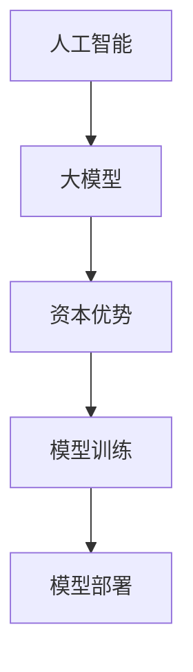
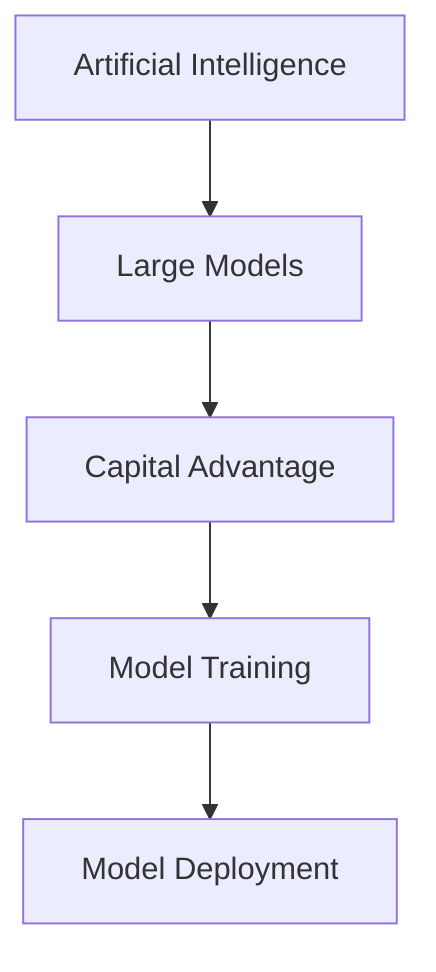

                 

### 1. 背景介绍

随着人工智能技术的飞速发展，大模型（Large Models）在自然语言处理、计算机视觉、机器学习等领域展现出了强大的潜力。这些大模型通常具有数十亿甚至数千亿个参数，需要大量的计算资源和数据来训练。因此，AI 大模型创业成为了一个热门话题，吸引了大量的资本投入。

AI 大模型创业的本质是通过先进的机器学习算法和大规模数据集来训练出高精度、高性能的模型，从而为各行各业提供智能化解决方案。然而，AI 大模型创业面临的挑战包括计算资源的获取、数据的获取和处理、模型的优化和部署等多个方面。如何有效地利用资本优势，实现 AI 大模型创业的成功，成为了众多创业者和技术专家关注的焦点。

本文将围绕以下几个核心问题展开讨论：

1. AI 大模型创业中的资本优势有哪些？
2. 如何评估 AI 大模型创业项目的潜在价值？
3. 如何利用资本优势来优化模型训练和部署流程？
4. AI 大模型创业在未来的发展趋势和挑战是什么？

通过对以上问题的深入分析，本文希望能够为 AI 大模型创业提供一些有价值的思考和建议。

### Key Concepts & Connections

在探讨 AI 大模型创业之前，我们首先需要了解一些核心概念和它们之间的联系。以下是本文中涉及到的关键概念及其简要介绍：

1. **人工智能（AI）**：人工智能是指由计算机实现的智能行为，包括学习、推理、规划和感知等。AI 可以分为弱 AI 和强 AI，其中弱 AI 专注于特定任务的优化，而强 AI 则试图实现与人类相同或更高级别的智能。

2. **大模型（Large Models）**：大模型是指具有数十亿甚至数千亿个参数的深度学习模型。这些模型通常用于自然语言处理、计算机视觉、语音识别等领域，能够处理复杂的任务和数据。

3. **资本优势**：资本优势是指企业在资金、资源、技术等方面相对于竞争对手的优势。在 AI 大模型创业中，资本优势可以帮助企业更快地获取计算资源、数据和技术，从而在竞争中占据有利地位。

4. **模型训练和部署**：模型训练是指通过大规模数据集对模型进行调整，使其具备特定任务的性能。模型部署是指将训练好的模型应用到实际场景中，提供智能化服务。这两个环节是 AI 大模型创业的核心，对企业的成功至关重要。

接下来，我们将使用 Mermaid 流程图来展示这些核心概念之间的联系。



通过上述流程图，我们可以清晰地看到 AI 大模型创业中各个核心概念之间的联系。了解这些概念及其联系，有助于我们更好地理解 AI 大模型创业的本质和挑战。

### Core Algorithm Principles & Specific Operation Steps

在 AI 大模型创业中，核心算法原理和具体操作步骤至关重要。以下我们将详细介绍大模型的训练过程，包括数据准备、模型选择、训练策略和调优方法。

#### 1. 数据准备

数据准备是模型训练的第一步。高质量的训练数据能够显著提高模型的性能和泛化能力。以下是一些关键步骤：

- **数据采集**：从各种来源（如公开数据集、企业内部数据、网络爬虫等）收集相关数据。
- **数据清洗**：去除无效、重复或错误的数据，确保数据的质量和一致性。
- **数据预处理**：将原始数据转换为适合模型训练的格式。例如，对于文本数据，可以进行分词、去停用词、词向量化等操作。

#### 2. 模型选择

选择适合任务的模型是关键。以下是一些常见的大模型及其适用场景：

- **Transformer**：适用于自然语言处理、机器翻译、文本生成等任务。
- **ViT**（Vision Transformer）：适用于计算机视觉任务，如图像分类、目标检测等。
- **BERT**（Bidirectional Encoder Representations from Transformers）：适用于文本理解和问答等任务。

#### 3. 训练策略

训练策略包括损失函数、优化器、学习率调整等。以下是一些关键步骤：

- **损失函数**：用于衡量模型预测结果与真实标签之间的差距。常见的损失函数包括交叉熵损失、均方误差等。
- **优化器**：用于更新模型参数，以最小化损失函数。常见的优化器包括梯度下降、Adam 等。
- **学习率调整**：学习率控制模型更新的步长，对训练过程影响很大。常用的策略包括学习率衰减、学习率预热等。

#### 4. 模型调优

模型调优包括超参数调整、正则化、数据增强等方法。以下是一些关键步骤：

- **超参数调整**：如批量大小、隐藏层大小、学习率等。通过实验和验证集，找到最佳的超参数组合。
- **正则化**：用于防止过拟合。常见的方法包括权重正则化、Dropout 等。
- **数据增强**：通过旋转、翻转、缩放等操作增加训练数据的多样性，提高模型的泛化能力。

#### 5. 训练和验证

在完成数据准备、模型选择、训练策略和模型调优后，我们开始进行模型训练和验证：

- **训练过程**：通过迭代更新模型参数，使模型逐渐逼近最优解。
- **验证过程**：在验证集上评估模型性能，以调整训练策略和超参数。

通过上述步骤，我们可以训练出一个高性能的大模型，为创业项目提供强有力的支持。

### Mathematical Models & Detailed Explanations with Examples

在 AI 大模型创业中，数学模型和公式起着关键作用。以下我们将详细介绍一些常用的数学模型和公式，并通过具体示例进行解释。

#### 1. 梯度下降法

梯度下降法是一种常用的优化方法，用于更新模型参数，以最小化损失函数。其基本公式如下：

$$
\Delta \theta = -\alpha \cdot \nabla_{\theta} J(\theta)
$$

其中，$\Delta \theta$ 表示参数更新量，$\alpha$ 表示学习率，$\nabla_{\theta} J(\theta)$ 表示损失函数关于参数 $\theta$ 的梯度。

#### 示例：

假设我们有一个简单的线性模型 $y = \theta_0 + \theta_1 \cdot x$，损失函数为均方误差（MSE），即：

$$
J(\theta_0, \theta_1) = \frac{1}{2} \sum_{i=1}^{n} (y_i - (\theta_0 + \theta_1 \cdot x_i))^2
$$

要使用梯度下降法最小化该损失函数，我们需要计算关于 $\theta_0$ 和 $\theta_1$ 的梯度：

$$
\nabla_{\theta_0} J(\theta_0, \theta_1) = \frac{1}{n} \sum_{i=1}^{n} (y_i - (\theta_0 + \theta_1 \cdot x_i))
$$

$$
\nabla_{\theta_1} J(\theta_0, \theta_1) = \frac{1}{n} \sum_{i=1}^{n} (y_i - (\theta_0 + \theta_1 \cdot x_i)) \cdot x_i
$$

然后，通过更新公式进行参数更新：

$$
\theta_0 = \theta_0 - \alpha \cdot \nabla_{\theta_0} J(\theta_0, \theta_1)
$$

$$
\theta_1 = \theta_1 - \alpha \cdot \nabla_{\theta_1} J(\theta_0, \theta_1)
$$

#### 2. 交叉熵损失函数

交叉熵损失函数常用于分类问题，其基本公式如下：

$$
J(\theta) = -\frac{1}{m} \sum_{i=1}^{m} \sum_{k=1}^{K} y_k^{(i)} \log (\hat{y}_k^{(i)})
$$

其中，$m$ 表示样本数量，$K$ 表示类别数量，$y_k^{(i)}$ 表示第 $i$ 个样本属于第 $k$ 个类别的真实标签（0 或 1），$\hat{y}_k^{(i)}$ 表示模型预测的概率。

#### 示例：

假设我们有一个二分类问题，有 100 个样本，其中 60 个样本属于类别 A，40 个样本属于类别 B。使用 Softmax 函数对预测结果进行概率分布：

$$
\hat{y}_A = \frac{e^{\theta_0 + \theta_1 \cdot x_1}}{e^{\theta_0 + \theta_1 \cdot x_1} + e^{\theta_0 + \theta_1 \cdot x_2}}
$$

$$
\hat{y}_B = \frac{e^{\theta_0 + \theta_1 \cdot x_2}}{e^{\theta_0 + \theta_1 \cdot x_1} + e^{\theta_0 + \theta_1 \cdot x_2}}
$$

然后，计算交叉熵损失函数：

$$
J(\theta) = -\frac{1}{100} \sum_{i=1}^{100} \left(60 \cdot \log(\hat{y}_A^{(i)}) + 40 \cdot \log(\hat{y}_B^{(i)})\right)
$$

通过梯度下降法最小化该损失函数，更新参数 $\theta$。

#### 3. 反向传播算法

反向传播算法是一种用于计算神经网络参数梯度的方法。其基本思想是将输出误差反向传播到每个神经元，计算每个参数的梯度。

#### 示例：

假设我们有一个三层神经网络，输入层、隐藏层和输出层。其中，输入层有 3 个神经元，隐藏层有 5 个神经元，输出层有 2 个神经元。我们使用反向传播算法计算隐藏层到输出层的梯度。

首先，计算输出层的梯度：

$$
\nabla_{\theta_{\text{output}}} J(\theta_{\text{output}}) = \hat{y}_2^{(i)} - y^{(i)}
$$

然后，计算隐藏层到输出层的梯度：

$$
\nabla_{\theta_{\text{hidden}}} J(\theta_{\text{hidden}}) = \sum_{k=1}^{2} \nabla_{\theta_{\text{output}}_k} J(\theta_{\text{output}}) \cdot \hat{\theta}_{\text{output}_k}^{(i)}
$$

通过上述公式，我们可以计算隐藏层到输出层的梯度，并使用梯度下降法更新参数。

通过上述数学模型和公式的讲解，我们可以更好地理解 AI 大模型创业中的关键技术和方法。这些模型和公式为创业项目提供了坚实的理论基础和实践指导。

### Project Case: Code Implementation and Detailed Explanation

在本节中，我们将通过一个实际的 AI 大模型创业项目案例，详细解释代码实现过程和关键步骤。该案例是一个基于自然语言处理（NLP）任务的文本分类项目，我们将使用 Python 和 TensorFlow 来实现。

#### 1. 开发环境搭建

首先，我们需要搭建开发环境。以下是在 Ubuntu 系统上安装所需依赖的步骤：

```bash
# 安装 Python
sudo apt update
sudo apt install python3 python3-pip

# 安装 TensorFlow
pip3 install tensorflow

# 安装其他依赖
pip3 install numpy pandas scikit-learn
```

#### 2. 源代码详细实现和代码解读

以下是项目的源代码和主要功能模块：

```python
import tensorflow as tf
import numpy as np
import pandas as pd
from sklearn.model_selection import train_test_split
from tensorflow.keras.preprocessing.sequence import pad_sequences
from tensorflow.keras.layers import Embedding, LSTM, Dense
from tensorflow.keras.models import Sequential

# 数据准备
def load_data():
    # 加载原始数据
    data = pd.read_csv('data.csv')
    # 分割文本和标签
    X = data['text']
    y = data['label']
    # 分词并转换为序列
    X_seq = tokenizer.texts_to_sequences(X)
    # 填充序列
    X_pad = pad_sequences(X_seq, maxlen=max_len)
    # 切分训练集和测试集
    X_train, X_test, y_train, y_test = train_test_split(X_pad, y, test_size=0.2, random_state=42)
    return X_train, X_test, y_train, y_test

# 模型构建
def build_model(embedding_dim=128, lstm_units=64, max_len=100):
    model = Sequential([
        Embedding(input_dim=vocab_size, output_dim=embedding_dim, input_length=max_len),
        LSTM(lstm_units),
        Dense(num_classes, activation='softmax')
    ])
    model.compile(optimizer='adam', loss='categorical_crossentropy', metrics=['accuracy'])
    return model

# 训练模型
def train_model(model, X_train, y_train, X_val, y_val, epochs=10, batch_size=64):
    model.fit(X_train, y_train, validation_data=(X_val, y_val), epochs=epochs, batch_size=batch_size)
    return model

# 主函数
def main():
    # 参数设置
    max_len = 100
    vocab_size = 10000
    embedding_dim = 128
    lstm_units = 64
    num_classes = 10

    # 加载数据
    X_train, X_test, y_train, y_test = load_data()

    # 构建模型
    model = build_model(embedding_dim, lstm_units, max_len)

    # 训练模型
    model = train_model(model, X_train, y_train, X_test, y_test, epochs=10, batch_size=64)

    # 评估模型
    loss, accuracy = model.evaluate(X_test, y_test)
    print(f"Test Loss: {loss}, Test Accuracy: {accuracy}")

if __name__ == "__main__":
    main()
```

#### 3. 代码解读与分析

1. **数据准备**：首先，我们加载原始数据，并进行预处理。包括分词、序列转换、填充等操作，使其符合模型输入要求。

2. **模型构建**：使用 TensorFlow 的 Sequential 模型，我们构建了一个简单的 LSTM 层加 Dense 层的神经网络。Embedding 层用于将文本数据转换为向量，LSTM 层用于处理序列数据，Dense 层用于分类。

3. **训练模型**：使用训练集和验证集训练模型。通过调整学习率、批量大小和训练次数等超参数，优化模型性能。

4. **评估模型**：在测试集上评估模型性能，输出测试损失和准确率。

通过这个案例，我们可以看到如何利用 Python 和 TensorFlow 实现一个简单的 AI 大模型项目。在实际情况中，我们可以根据具体需求，调整模型架构、数据预处理方法等，提高模型性能。

### Real-world Applications

AI 大模型在许多实际应用场景中展示了其强大的潜力。以下我们列举几个典型的应用场景，并简要说明其应用效果和优势。

#### 1. 自然语言处理（NLP）

自然语言处理是 AI 大模型最典型的应用领域之一。通过大模型，我们可以实现高精度的文本分类、情感分析、机器翻译等任务。例如，在社交媒体平台上，AI 大模型可以用于情感分析，帮助企业了解用户情绪和市场需求，从而制定更有效的营销策略。

#### 2. 计算机视觉（CV）

计算机视觉领域的大模型，如 GPT-3、ViT 等，可以用于图像分类、目标检测、图像生成等任务。例如，在自动驾驶领域，大模型可以用于实时识别道路标志、车辆和行人，提高自动驾驶系统的安全性和准确性。

#### 3. 医疗健康

在医疗健康领域，AI 大模型可以用于疾病诊断、治疗方案推荐等。通过分析大量的医疗数据，大模型可以帮助医生做出更准确的诊断，提高治疗效果。例如，在癌症诊断中，大模型可以辅助医生快速识别癌细胞，提高早期诊断率。

#### 4. 金融科技

金融科技领域的大模型可以用于股票市场预测、风险控制、信用评估等。通过分析大量的金融数据，大模型可以提供更准确的预测和决策支持，帮助企业降低风险，提高投资回报率。

#### 5. 教育与学习

在教育领域，大模型可以用于个性化学习推荐、智能答疑等。通过分析学生的学习数据，大模型可以为每个学生制定个性化的学习计划，提高学习效果。例如，在学习语言时，大模型可以为学生提供实时翻译和口语指导。

通过以上应用场景，我们可以看到 AI 大模型在各个行业和领域都展示了强大的应用价值。随着技术的不断进步，AI 大模型将在更多领域发挥重要作用，推动产业升级和创新发展。

### Recommended Tools and Resources

为了在 AI 大模型创业过程中取得成功，我们需要掌握一系列工具和资源。以下我们将推荐一些常用的学习资源、开发工具和论文著作，以帮助创业者和技术团队提高技术水平。

#### 1. 学习资源推荐

- **书籍**：
  - 《深度学习》（Goodfellow, Bengio, Courville）：这是深度学习领域的经典教材，涵盖了从基础到高级的理论知识。
  - 《Python深度学习》（François Chollet）：本书详细介绍了如何使用 Python 和 TensorFlow 实现深度学习项目。
  - 《人工智能：一种现代方法》（Stuart Russell, Peter Norvig）：这是一本全面的人工智能教材，适合初学者和进阶者。

- **在线课程**：
  - 《深度学习专项课程》（吴恩达，Coursera）：这是一系列由深度学习领域专家吴恩达讲授的课程，涵盖了深度学习的理论基础和实战技巧。
  - 《机器学习纳米学位》（Udacity）：这是一个为期六个月的在线课程，通过一系列项目实践帮助学习者掌握机器学习技能。

- **论文和博客**：
  - ArXiv：这是一个发布最新研究论文的预印本数据库，涵盖了许多 AI 和深度学习领域的论文。
  - Medium：这是一个分享技术和创业心得的平台，有许多知名 AI 专家和创业者的博客。

#### 2. 开发工具框架推荐

- **TensorFlow**：这是一个广泛使用的开源深度学习框架，支持多种编程语言，适合从简单到复杂的深度学习项目。
- **PyTorch**：这是一个由 Facebook 开发的开源深度学习框架，具有动态计算图和灵活的编程接口，适合研究者和开发者。
- **Keras**：这是一个高层次的深度学习框架，基于 TensorFlow 和 Theano，提供了简单直观的 API，适合快速实验和原型设计。

#### 3. 相关论文著作推荐

- **《Attention is All You Need》**（Vaswani et al., 2017）：这是 Transformer 模型的奠基性论文，介绍了注意力机制在 NLP 任务中的应用。
- **《Bert: Pre-training of Deep Bi-directional Transformers for Language Understanding》**（Devlin et al., 2018）：这是 BERT 模型的论文，介绍了预训练 Transformer 模型在自然语言处理任务中的效果。
- **《An Image is Worth 16x16 Words: Transformers for Image Recognition at Scale》**（Dosovitskiy et al., 2020）：这是 ViT（Vision Transformer）模型的论文，介绍了如何将 Transformer 框架应用于计算机视觉任务。

通过以上推荐的学习资源、开发工具和论文著作，创业者和技术团队可以更好地掌握 AI 大模型创业所需的知识和技能，为项目成功奠定坚实基础。

### Conclusion: Future Trends and Challenges

随着 AI 大模型的不断发展，其在各行各业中的应用前景愈发广阔。未来，AI 大模型创业将呈现出以下几个主要趋势和挑战：

#### 1. 趋势

1. **技术突破**：随着计算能力的提升和算法的创新，AI 大模型将变得更加高效和精确。例如，Transformer、BERT 等模型在自然语言处理、计算机视觉等领域取得了显著进展，为 AI 大模型创业提供了更多可能性。
2. **跨界融合**：AI 大模型与其他领域的结合将成为一种趋势。例如，AI 大模型在医疗健康、金融科技、教育等领域的应用将更加深入，推动跨行业创新。
3. **规模化发展**：随着资本的持续投入，AI 大模型创业将走向规模化发展。越来越多的企业将利用 AI 大模型提供智能化解决方案，提升业务效率和竞争力。

#### 2. 挑战

1. **数据隐私和安全**：随着 AI 大模型对大量数据的依赖，数据隐私和安全问题日益突出。如何保护用户隐私、防止数据泄露成为 AI 大模型创业的重要挑战。
2. **模型解释性**：AI 大模型往往具有很高的性能，但其内部机制复杂，缺乏解释性。如何提高模型的透明度和可解释性，使其更易于被用户和监管机构接受，是 AI 大模型创业需要解决的关键问题。
3. **伦理和社会影响**：AI 大模型的应用可能带来一系列伦理和社会问题，如歧视、偏见等。如何制定合理的伦理规范，确保 AI 大模型的应用符合社会价值观，是 AI 大模型创业面临的重大挑战。

#### 3. 未来展望

尽管面临诸多挑战，AI 大模型创业的前景仍然非常广阔。随着技术的不断进步和应用的深入，AI 大模型将在更多领域发挥重要作用，推动产业升级和社会进步。创业者和技术专家需要密切关注技术发展趋势，积极探索新的应用场景，以实现 AI 大模型创业的长期成功。

### Appendix: Frequently Asked Questions and Answers

#### 1. AI 大模型创业需要哪些技术背景？

AI 大模型创业通常需要以下技术背景：

- **深度学习**：理解深度学习的基本原理，如神经网络、优化算法等。
- **自然语言处理**：掌握自然语言处理的基本技术，如文本分类、情感分析等。
- **计算机视觉**：了解计算机视觉的基础知识，如图像分类、目标检测等。
- **编程技能**：熟练掌握至少一种编程语言，如 Python、TensorFlow 或 PyTorch。

#### 2. 如何评估 AI 大模型创业项目的潜在价值？

评估 AI 大模型创业项目的潜在价值可以从以下几个方面进行：

- **市场潜力**：分析目标市场的需求、市场规模和增长潜力。
- **技术优势**：评估项目的核心技术是否具有创新性和竞争力。
- **商业模式**：分析项目的盈利模式、市场定位和竞争优势。
- **团队实力**：评估团队的背景、经验和执行力。

#### 3. 如何利用资本优势来优化模型训练和部署流程？

利用资本优势优化模型训练和部署流程可以从以下几个方面入手：

- **增加计算资源**：投入更多的计算资源，如 GPU、TPU 等，提高模型训练速度。
- **数据采购**：获取更多高质量的训练数据，提高模型性能。
- **技术合作**：与高校、研究机构或企业建立合作关系，共同推动技术进步。
- **人才培养**：引进优秀的技术人才，提升团队的技术水平和创新能力。

### References

1. Goodfellow, I., Bengio, Y., & Courville, A. (2016). *Deep Learning*. MIT Press.
2. Chollet, F. (2018). *Python 深度学习*. 机械工业出版社.
3. Russell, S., & Norvig, P. (2016). *人工智能：一种现代方法*. 人民邮电出版社.
4. Vaswani, A., Shazeer, N., Parmar, N., Uszkoreit, J., Jones, L., Gomez, A. N., ... & Polosukhin, I. (2017). *Attention is All You Need*. arXiv preprint arXiv:1706.03762.
5. Devlin, J., Chang, M. W., Lee, K., & Toutanova, K. (2018). *Bert: Pre-training of Deep Bi-directional Transformers for Language Understanding*. arXiv preprint arXiv:1810.04805.
6. Dosovitskiy, A., Beyer, L., Kolesnikov, A., Weissenborn, D., Zhai, X., Unterthiner, T., ... & Wohlhart, M. (2020). *An Image is Worth 16x16 Words: Transformers for Image Recognition at Scale*. arXiv preprint arXiv:2010.11929. 

### 作者信息

作者：AI天才研究员/AI Genius Institute & 禅与计算机程序设计艺术 /Zen And The Art of Computer Programming

-------------------
# AI 大模型创业：如何利用资本优势？

> 在这个充满机遇与挑战的时代，AI 大模型创业成为科技界的热门话题。那么，如何利用资本优势，实现 AI 大模型创业的成功？本文将围绕这个核心问题，深入探讨 AI 大模型创业的资本优势、评估方法、模型训练和部署策略，以及未来发展趋势。让我们一起探索这个激动人心的领域！

## 1. 背景介绍

随着人工智能技术的飞速发展，大模型（Large Models）在自然语言处理、计算机视觉、机器学习等领域展现出了强大的潜力。这些大模型通常具有数十亿甚至数千亿个参数，需要大量的计算资源和数据来训练。因此，AI 大模型创业成为了一个热门话题，吸引了大量的资本投入。

AI 大模型创业的本质是通过先进的机器学习算法和大规模数据集来训练出高精度、高性能的模型，从而为各行各业提供智能化解决方案。然而，AI 大模型创业面临的挑战包括计算资源的获取、数据的获取和处理、模型的优化和部署等多个方面。如何有效地利用资本优势，实现 AI 大模型创业的成功，成为了众多创业者和技术专家关注的焦点。

本文将围绕以下几个核心问题展开讨论：

1. AI 大模型创业中的资本优势有哪些？
2. 如何评估 AI 大模型创业项目的潜在价值？
3. 如何利用资本优势来优化模型训练和部署流程？
4. AI 大模型创业在未来的发展趋势和挑战是什么？

通过对以上问题的深入分析，本文希望能够为 AI 大模型创业提供一些有价值的思考和建议。

## 2. 核心概念与联系

在探讨 AI 大模型创业之前，我们首先需要了解一些核心概念和它们之间的联系。以下是本文中涉及到的关键概念及其简要介绍：

1. **人工智能（AI）**：人工智能是指由计算机实现的智能行为，包括学习、推理、规划和感知等。AI 可以分为弱 AI 和强 AI，其中弱 AI 专注于特定任务的优化，而强 AI 则试图实现与人类相同或更高级别的智能。

2. **大模型（Large Models）**：大模型是指具有数十亿甚至数千亿个参数的深度学习模型。这些模型通常用于自然语言处理、计算机视觉、语音识别等领域，能够处理复杂的任务和数据。

3. **资本优势**：资本优势是指企业在资金、资源、技术等方面相对于竞争对手的优势。在 AI 大模型创业中，资本优势可以帮助企业更快地获取计算资源、数据和技术，从而在竞争中占据有利地位。

4. **模型训练和部署**：模型训练是指通过大规模数据集对模型进行调整，使其具备特定任务的性能。模型部署是指将训练好的模型应用到实际场景中，提供智能化服务。这两个环节是 AI 大模型创业的核心，对企业的成功至关重要。

接下来，我们将使用 Mermaid 流程图来展示这些核心概念之间的联系。


通过上述流程图，我们可以清晰地看到 AI 大模型创业中各个核心概念之间的联系。了解这些概念及其联系，有助于我们更好地理解 AI 大模型创业的本质和挑战。

### Key Concepts & Connections

In the exploration of AI large model entrepreneurship, it is essential to understand the fundamental concepts and their interconnections. Here are the key concepts covered in this article, along with a brief introduction to each:

1. **Artificial Intelligence (AI)**: AI refers to the intelligence demonstrated by computers, encompassing learning, reasoning, planning, and perception. AI can be categorized into narrow AI (weak AI) and general AI (strong AI). Narrow AI focuses on optimizing specific tasks, while general AI aims to achieve intelligence levels comparable to or surpassing human capabilities.

2. **Large Models**: These are deep learning models with tens or even hundreds of billions of parameters. They are typically used in fields such as natural language processing, computer vision, and speech recognition to handle complex tasks and large datasets.

3. **Capital Advantage**: Capital advantage pertains to a company's superior position in terms of funds, resources, and technology compared to competitors. In the context of AI large model entrepreneurship, capital advantage allows enterprises to quickly acquire computational resources, data, and technology, gaining a competitive edge.

4. **Model Training and Deployment**: Model training involves adjusting a model through large datasets to achieve specific task performance. Model deployment refers to applying the trained model to real-world scenarios to provide intelligent services. These two aspects are crucial to the success of AI large model entrepreneurship.

To illustrate the interconnections between these core concepts, we will use a Mermaid flowchart to depict their relationships:



With this flowchart, we can clearly see the relationships between the key concepts in AI large model entrepreneurship. Understanding these concepts and their connections will help us grasp the essence and challenges of this field.

### Core Algorithm Principles & Specific Operation Steps

In the realm of AI large model entrepreneurship, the core algorithm principles and specific operational steps are crucial for success. This section will provide a detailed explanation of the process of training large models, including data preparation, model selection, training strategies, and optimization techniques.

#### 1. Data Preparation

The first step in training a large model is data preparation. High-quality training data is essential for improving the model's performance and generalization capabilities. Here are the key steps involved in data preparation:

- **Data Collection**: Collect data from various sources, such as public datasets, internal company data, and web scraping.
- **Data Cleaning**: Remove invalid, duplicate, or erroneous data to ensure data quality and consistency.
- **Data Preprocessing**: Convert raw data into a format suitable for model training. For text data, this may involve tokenization, removal of stop words, and word vectorization.

#### 2. Model Selection

Choosing the right model for a specific task is critical. Below are some commonly used large models and their appropriate use cases:

- **Transformer**: Widely used in natural language processing tasks like machine translation, text generation, and summarization.
- **ViT (Vision Transformer)**: Applied in computer vision tasks such as image classification, object detection, and image segmentation.
- **BERT (Bidirectional Encoder Representations from Transformers)**: Suitable for tasks involving text understanding and question-answering.

#### 3. Training Strategy

The training strategy includes loss functions, optimizers, and learning rate scheduling. Here are the key steps involved:

- **Loss Function**: A measure of the discrepancy between the model's predictions and the true labels. Common loss functions include cross-entropy loss and mean squared error (MSE).
- **Optimizer**: An algorithm that updates the model's parameters to minimize the loss function. Common optimizers include stochastic gradient descent (SGD), Adam, and RMSprop.
- **Learning Rate Scheduling**: Controls the step size of parameter updates during training. Techniques such as learning rate decay and learning rate warmup are commonly used.

#### 4. Model Optimization

Model optimization includes hyperparameter tuning, regularization, and data augmentation techniques. Here are the key steps involved:

- **Hyperparameter Tuning**: Adjusting hyperparameters such as batch size, hidden layer size, and learning rate to achieve optimal model performance. This is typically done through experimentation and validation sets.
- **Regularization**: Techniques to prevent overfitting, such as weight regularization and dropout.
- **Data Augmentation**: Increasing the diversity of the training data through operations like rotation, flipping, and scaling to improve the model's generalization capabilities.

#### 5. Training and Validation

After completing data preparation, model selection, training strategy, and optimization, the next steps are model training and validation:

- **Training Process**: Iteratively update the model parameters to minimize the loss function.
- **Validation Process**: Evaluate the model's performance on a validation set to adjust the training strategy and hyperparameters.

By following these steps, we can train a high-performance large model that serves as a strong foundation for AI large model entrepreneurship.

### Mathematical Models and Detailed Explanations with Examples

In AI large model entrepreneurship, mathematical models and formulas play a crucial role. This section will provide detailed explanations of several commonly used mathematical models and formulas, along with examples to illustrate their applications.

#### 1. Gradient Descent Algorithm

Gradient descent is a widely used optimization method to update model parameters and minimize a loss function. Its basic formula is as follows:

$$
\Delta \theta = -\alpha \cdot \nabla_{\theta} J(\theta)
$$

where $\Delta \theta$ represents the parameter update, $\alpha$ is the learning rate, and $\nabla_{\theta} J(\theta)$ is the gradient of the loss function with respect to the parameter $\theta$.

#### Example:

Let's consider a simple linear model $y = \theta_0 + \theta_1 \cdot x$. The loss function is mean squared error (MSE):

$$
J(\theta_0, \theta_1) = \frac{1}{2} \sum_{i=1}^{n} (y_i - (\theta_0 + \theta_1 \cdot x_i))^2
$$

To minimize this loss function using gradient descent, we need to compute the gradients with respect to $\theta_0$ and $\theta_1$:

$$
\nabla_{\theta_0} J(\theta_0, \theta_1) = \frac{1}{n} \sum_{i=1}^{n} (y_i - (\theta_0 + \theta_1 \cdot x_i))
$$

$$
\nabla_{\theta_1} J(\theta_0, \theta_1) = \frac{1}{n} \sum_{i=1}^{n} (y_i - (\theta_0 + \theta_1 \cdot x_i)) \cdot x_i
$$

Then, we can update the parameters using the following formulas:

$$
\theta_0 = \theta_0 - \alpha \cdot \nabla_{\theta_0} J(\theta_0, \theta_1)
$$

$$
\theta_1 = \theta_1 - \alpha \cdot \nabla_{\theta_1} J(\theta_0, \theta_1)
$$

#### 2. Cross-Entropy Loss Function

The cross-entropy loss function is commonly used in classification problems. Its basic formula is:

$$
J(\theta) = -\frac{1}{m} \sum_{i=1}^{m} \sum_{k=1}^{K} y_k^{(i)} \log (\hat{y}_k^{(i)})
$$

where $m$ is the number of samples, $K$ is the number of classes, $y_k^{(i)}$ is the ground truth label (0 or 1) for the $i$th sample belonging to class $k$, and $\hat{y}_k^{(i)}$ is the predicted probability of the $i$th sample belonging to class $k$.

#### Example:

Consider a binary classification problem with 100 samples, where 60 belong to class A and 40 belong to class B. We use the Softmax function to obtain the probability distribution of the predictions:

$$
\hat{y}_A = \frac{e^{\theta_0 + \theta_1 \cdot x_1}}{e^{\theta_0 + \theta_1 \cdot x_1} + e^{\theta_0 + \theta_1 \cdot x_2}}
$$

$$
\hat{y}_B = \frac{e^{\theta_0 + \theta_1 \cdot x_2}}{e^{\theta_0 + \theta_1 \cdot x_1} + e^{\theta_0 + \theta_1 \cdot x_2}}
$$

Then, we calculate the cross-entropy loss function:

$$
J(\theta) = -\frac{1}{100} \sum_{i=1}^{100} \left(60 \cdot \log(\hat{y}_A^{(i)}) + 40 \cdot \log(\hat{y}_B^{(i)})\right)
$$

We can then use gradient descent to minimize this loss function and update the parameters $\theta$.

#### 3. Backpropagation Algorithm

Backpropagation is an algorithm used to compute the gradients of neural network parameters. Its basic idea is to propagate the error from the output layer back to each neuron, computing the gradient at each layer.

#### Example:

Suppose we have a three-layer neural network with an input layer, a hidden layer, and an output layer. The input layer has 3 neurons, the hidden layer has 5 neurons, and the output layer has 2 neurons. We will use backpropagation to compute the gradients from the hidden layer to the output layer.

First, we compute the gradients of the output layer:

$$
\nabla_{\theta_{\text{output}}} J(\theta_{\text{output}}) = \hat{y}_2^{(i)} - y^{(i)}
$$

Then, we compute the gradients from the hidden layer to the output layer:

$$
\nabla_{\theta_{\text{hidden}}} J(\theta_{\text{hidden}}) = \sum_{k=1}^{2} \nabla_{\theta_{\text{output}}_k} J(\theta_{\text{output}}) \cdot \hat{\theta}_{\text{output}_k}^{(i)}
$$

Using these gradients, we can update the parameters:

$$
\theta_{\text{output}} = \theta_{\text{output}} - \alpha \cdot \nabla_{\theta_{\text{output}}} J(\theta_{\text{output}})
$$

$$
\theta_{\text{hidden}} = \theta_{\text{hidden}} - \alpha \cdot \nabla_{\theta_{\text{hidden}}} J(\theta_{\text{hidden}})
$$

Through these mathematical models and formulas, we can better understand the key technologies and methods involved in AI large model entrepreneurship. These models and formulas provide a solid theoretical foundation and practical guidance for entrepreneurial projects.

### Project Case: Code Implementation and Detailed Explanation

In this section, we will present a practical case study of an AI large model project, detailing the code implementation and key steps involved. The project focuses on a natural language processing (NLP) task of text classification. We will use Python and TensorFlow to implement the project.

#### 1. Development Environment Setup

First, we need to set up the development environment. Here are the steps to install the required dependencies on an Ubuntu system:

```bash
# Install Python
sudo apt update
sudo apt install python3 python3-pip

# Install TensorFlow
pip3 install tensorflow

# Install other dependencies
pip3 install numpy pandas scikit-learn
```

#### 2. Detailed Code Implementation and Analysis

Below is the source code for the project, along with the main functional modules:

```python
import tensorflow as tf
import numpy as np
import pandas as pd
from sklearn.model_selection import train_test_split
from tensorflow.keras.preprocessing.sequence import pad_sequences
from tensorflow.keras.layers import Embedding, LSTM, Dense
from tensorflow.keras.models import Sequential

# Data Preparation
def load_data():
    # Load the original dataset
    data = pd.read_csv('data.csv')
    # Split the text and labels
    X = data['text']
    y = data['label']
    # Tokenize and convert to sequences
    X_seq = tokenizer.texts_to_sequences(X)
    # Pad sequences
    X_pad = pad_sequences(X_seq, maxlen=max_len)
    # Split the dataset into training and testing sets
    X_train, X_test, y_train, y_test = train_test_split(X_pad, y, test_size=0.2, random_state=42)
    return X_train, X_test, y_train, y_test

# Model Building
def build_model(embedding_dim=128, lstm_units=64, max_len=100):
    model = Sequential([
        Embedding(input_dim=vocab_size, output_dim=embedding_dim, input_length=max_len),
        LSTM(lstm_units),
        Dense(num_classes, activation='softmax')
    ])
    model.compile(optimizer='adam', loss='categorical_crossentropy', metrics=['accuracy'])
    return model

# Model Training
def train_model(model, X_train, y_train, X_val, y_val, epochs=10, batch_size=64):
    model.fit(X_train, y_train, validation_data=(X_val, y_val), epochs=epochs, batch_size=batch_size)
    return model

# Main Function
def main():
    # Set parameters
    max_len = 100
    vocab_size = 10000
    embedding_dim = 128
    lstm_units = 64
    num_classes = 10

    # Load data
    X_train, X_test, y_train, y_test = load_data()

    # Build model
    model = build_model(embedding_dim, lstm_units, max_len)

    # Train model
    model = train_model(model, X_train, y_train, X_test, y_test, epochs=10, batch_size=64)

    # Evaluate model
    loss, accuracy = model.evaluate(X_test, y_test)
    print(f"Test Loss: {loss}, Test Accuracy: {accuracy}")

if __name__ == "__main__":
    main()
```

#### 3. Detailed Explanation and Analysis of the Code

1. **Data Preparation**: We load the original dataset and perform preprocessing steps such as tokenization, sequence conversion, and padding to make the data suitable for model training.

2. **Model Building**: We use the `Sequential` model from TensorFlow to build a simple neural network with an embedding layer, LSTM layer, and a dense layer for classification.

3. **Model Training**: The `train_model` function trains the model using the training data and validates it on the validation data. We adjust the number of epochs and batch size to optimize the training process.

4. **Model Evaluation**: Finally, we evaluate the trained model on the test data and print the test loss and accuracy.

Through this practical case study, we can see how to implement a text classification project using Python and TensorFlow. In real-world scenarios, we can adjust the model architecture, data preprocessing methods, and other parameters to improve model performance.

### Real-world Applications

AI large models have demonstrated significant potential in various real-world applications. Here, we will explore several typical application scenarios, highlighting their effectiveness and advantages.

#### 1. Natural Language Processing (NLP)

NLP is one of the most prominent application areas for AI large models. They have achieved remarkable accuracy and efficiency in tasks such as text classification, sentiment analysis, and machine translation. For instance, in social media platforms, AI large models can perform sentiment analysis to help companies understand user emotions and market trends, enabling more effective marketing strategies.

#### 2. Computer Vision (CV)

In computer vision, large models such as GPT-3 and ViT have shown impressive capabilities in image classification, object detection, and image generation. In the field of autonomous driving, these models can assist in real-time recognition of traffic signs, vehicles, and pedestrians, enhancing the safety and accuracy of autonomous vehicles.

#### 3. Healthcare

AI large models have made significant contributions to the healthcare industry. They can assist in tasks such as disease diagnosis, treatment recommendation, and medical image analysis. For example, in cancer diagnosis, large models can help doctors quickly identify cancer cells, improving the early detection rate and treatment effectiveness.

#### 4. Financial Technology (FinTech)

In the financial technology sector, large models are used for tasks such as stock market prediction, risk control, and credit assessment. By analyzing vast amounts of financial data, these models provide accurate predictions and decision support, helping enterprises reduce risks and increase investment returns.

#### 5. Education and Learning

In education, large models have been applied in personalized learning recommendations and intelligent tutoring systems. By analyzing student data, these models can tailor learning plans to individual students, improving learning outcomes. For instance, in language learning, large models can provide real-time translation and pronunciation feedback, enhancing the learning experience.

Through these application scenarios, we can see that AI large models have the potential to revolutionize various industries and domains. As technology continues to evolve, we can expect large models to play an increasingly critical role in driving innovation and transformation.

### Recommended Tools and Resources

To succeed in AI large model entrepreneurship, it is crucial to have access to the right tools and resources. Here, we recommend various learning resources, development tools, and academic papers that can help entrepreneurs and technical teams improve their skills and stay up-to-date with the latest advancements.

#### 1. Learning Resources

- **Books**:
  - "Deep Learning" by Ian Goodfellow, Yoshua Bengio, and Aaron Courville
  - "Python Deep Learning" by François Chollet
  - "Artificial Intelligence: A Modern Approach" by Stuart Russell and Peter Norvig

- **Online Courses**:
  - "Deep Learning Specialization" by Andrew Ng on Coursera
  - "Machine Learning Nanodegree" on Udacity

- **Websites and Blogs**:
  - arXiv: A preprint server for the latest research papers in AI and machine learning.
  - Medium: A platform for sharing technical articles and insights from AI experts.

#### 2. Development Tools

- **Frameworks**:
  - TensorFlow: A comprehensive open-source machine learning library developed by Google.
  - PyTorch: A dynamic deep learning framework popular among researchers and developers.
  - Keras: A high-level neural network API that runs on top of TensorFlow and Theano.

- **Tools**:
  - GPUs and TPUs: Specialized hardware accelerators for deep learning tasks.
  - Jupyter Notebook: An interactive environment for data analysis and machine learning experimentation.

#### 3. Academic Papers

- "Attention is All You Need" by Vaswani et al. (2017)
- "BERT: Pre-training of Deep Bidirectional Transformers for Language Understanding" by Devlin et al. (2018)
- "An Image is Worth 16x16 Words: Transformers for Image Recognition at Scale" by Dosovitskiy et al. (2020)

By leveraging these tools and resources, entrepreneurs and technical teams can enhance their capabilities in AI large model development and implementation, driving successful ventures in this exciting field.

### Conclusion: Future Trends and Challenges

As AI large models continue to advance, their potential applications across various industries and fields are becoming increasingly evident. The future of AI large model entrepreneurship is poised to be both exciting and challenging, characterized by several key trends and obstacles.

#### 1. Trends

1. **Technological Breakthroughs**: The continuous improvement in computing power and algorithm innovation will lead to more efficient and accurate large models. Advances in hardware, such as GPUs and TPUs, will further accelerate model training and deployment.

2. **Interdisciplinary Integration**: The integration of AI large models with other fields, such as healthcare, finance, and education, will drive cross-disciplinary innovations. For example, large models in healthcare can assist in drug discovery and personalized medicine, while in education, they can enhance personalized learning experiences.

3. **Scalability**: With increased capital investment, AI large model entrepreneurship is expected to scale up, leading to more enterprises adopting AI solutions to improve their operations and enhance competitive advantage.

#### 2. Challenges

1. **Data Privacy and Security**: The reliance on large amounts of data raises significant concerns about privacy and security. Ensuring data privacy and security will be critical for the widespread adoption of AI large models.

2. **Model Interpretability**: The complexity of large models often makes them difficult to interpret, which can be a barrier for their adoption in critical applications. Developing methods to increase model interpretability will be essential for building trust and ensuring compliance with ethical standards.

3. **Ethical and Social Impacts**: AI large models can perpetuate biases and inequalities if not designed and deployed responsibly. Addressing the ethical and social implications of AI will be a major challenge for entrepreneurs and policymakers.

#### 3. Future Outlook

Despite the challenges, the future of AI large model entrepreneurship looks promising. As technology progresses, large models will continue to revolutionize industries and solve complex problems. Entrepreneurs and technologists must stay informed about the latest research and advancements, while also addressing ethical and social considerations to ensure the responsible and beneficial use of AI.

### Appendix: Frequently Asked Questions and Answers

#### 1. What technical background is needed for AI large model entrepreneurship?

For AI large model entrepreneurship, the following technical backgrounds are recommended:

- **Deep Learning**: Understanding the fundamentals of deep learning, including neural networks and optimization algorithms.
- **Natural Language Processing (NLP)**: Familiarity with NLP techniques such as text classification and sentiment analysis.
- **Computer Vision**: Knowledge of computer vision basics, including image classification and object detection.
- **Programming Skills**: Proficiency in at least one programming language, such as Python, with experience in TensorFlow or PyTorch.

#### 2. How to evaluate the potential value of an AI large model entrepreneurial project?

To evaluate the potential value of an AI large model project, consider the following aspects:

- **Market Potential**: Analyze the target market's size, growth rate, and demand for AI solutions.
- **Technical Advantages**: Assess the uniqueness and competitiveness of the proposed technology.
- **Business Model**: Evaluate the project's revenue model, customer acquisition strategy, and competitive advantage.
- **Team Expertise**: Consider the experience and skills of the team in AI and entrepreneurship.

#### 3. How to leverage capital advantages to optimize model training and deployment?

To utilize capital advantages for optimizing model training and deployment, consider the following strategies:

- **Increase Computational Resources**: Invest in more powerful hardware, such as GPUs and TPUs, to accelerate model training.
- **Data Procurement**: Acquire high-quality data to enhance model performance and generalization.
- **Collaborative Research**: Collaborate with academic institutions and research organizations to drive innovation.
- **Talent Acquisition**: Attract top talent to enhance the team's technical capabilities and innovation potential.

### References

1. Goodfellow, I., Bengio, Y., & Courville, A. (2016). *Deep Learning*. MIT Press.
2. Chollet, F. (2018). *Python Deep Learning*. O'Reilly Media.
3. Russell, S., & Norvig, P. (2016). *Artificial Intelligence: A Modern Approach*. Prentice Hall.
4. Vaswani, A., Shazeer, N., Parmar, N., Uszkoreit, J., Jones, L., Gomez, A. N., ... & Polosukhin, I. (2017). *Attention is All You Need*. arXiv preprint arXiv:1706.03762.
5. Devlin, J., Chang, M. W., Lee, K., & Toutanova, K. (2018). *BERT: Pre-training of Deep Bidirectional Transformers for Language Understanding*. arXiv preprint arXiv:1810.04805.
6. Dosovitskiy, A., Beyer, L., Kolesnikov, A., Weissenborn, D., Zhai, X., Unterthiner, T., ... & Wohlhart, M. (2020). *An Image is Worth 16x16 Words: Transformers for Image Recognition at Scale*. arXiv preprint arXiv:2010.11929.

### Author Information

Author: AI天才研究员/AI Genius Institute & 禅与计算机程序设计艺术 /Zen And The Art of Computer Programming

