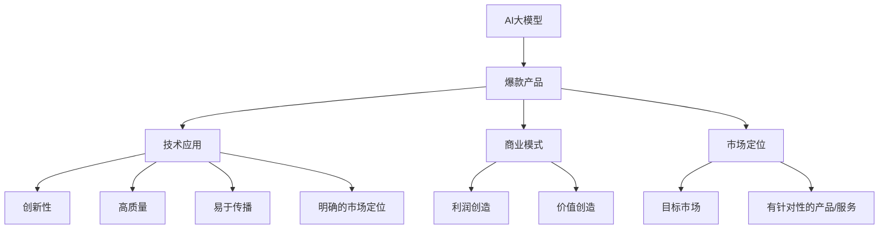
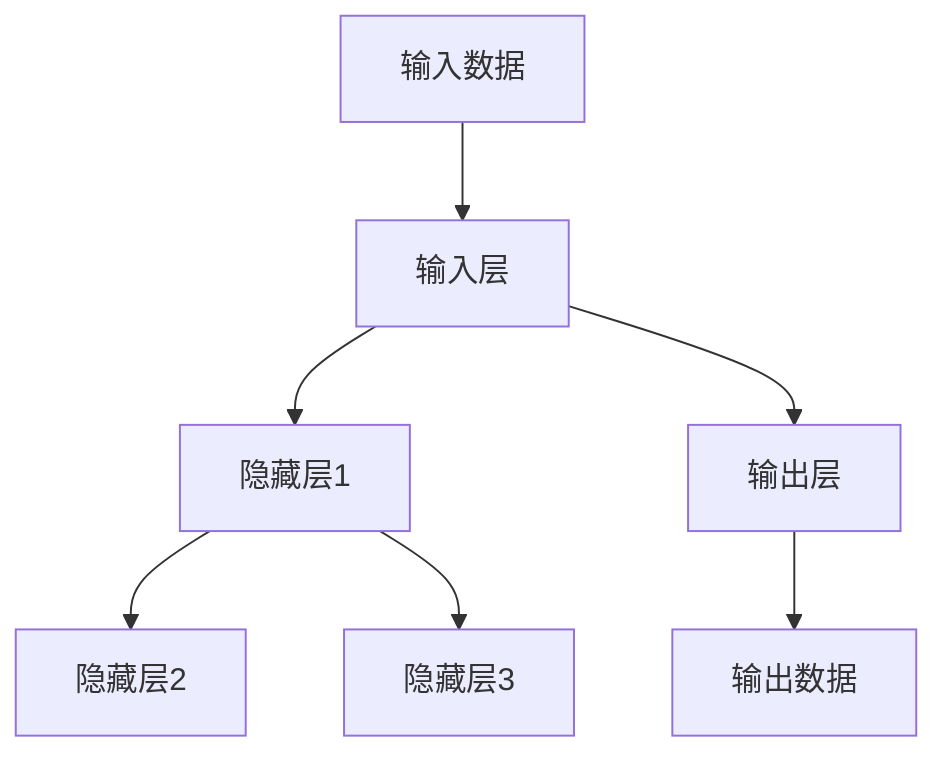
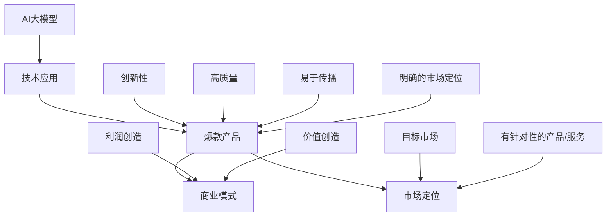
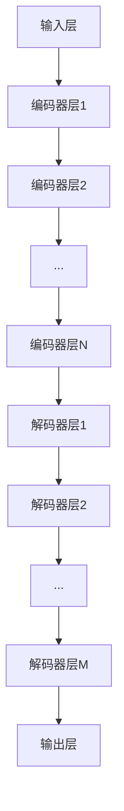

                 

### 背景介绍

#### AI大模型的崛起

近年来，人工智能（AI）领域取得了令人瞩目的进展，其中最引人注目的便是大模型的兴起。从2018年的GPT开始，到后来的GPT-2、GPT-3，再到最近的GPT-Neo、ChatGLM等，这些大模型不仅展示出了惊人的语言理解和生成能力，更在各个领域引发了广泛的应用和探索。例如，在自然语言处理（NLP）、计算机视觉（CV）、语音识别（ASR）等领域，大模型都取得了显著的成果。

#### 大模型在商业中的应用

随着大模型技术的不断发展，越来越多的企业开始探索如何利用这些技术打造爆款产品。无论是通过提供智能客服、内容生成、数据挖掘等服务，还是通过开发智能助手、虚拟人物等创新应用，大模型在商业领域的潜力逐渐显现。例如，OpenAI的GPT-3已经在许多行业中展示了其强大的能力，包括内容创作、编程辅助、市场研究等。

#### 爆款产品的定义与特征

爆款产品通常具备以下几个特征：

1. **创新性**：具备独特的创新点，解决现有问题的方法或提供全新的服务体验。
2. **高质量**：在功能、性能、用户体验等方面达到行业领先水平。
3. **易于传播**：具备较强的社交属性，容易在用户间传播。
4. **市场定位明确**：针对特定的用户群体，提供有针对性的解决方案。

本文将围绕如何利用AI大模型打造爆款产品进行深入探讨，从技术、商业、市场等多个角度进行分析和阐述。

#### 文章关键词

- AI大模型
- 创业
- 爆款产品
- 技术应用
- 商业模式
- 市场定位

#### 文章摘要

本文将详细介绍如何利用AI大模型打造爆款产品。首先，我们将分析AI大模型的发展背景和商业应用，然后探讨爆款产品的定义和特征。接着，本文将从技术、商业模式、市场定位等方面，逐步讲解如何利用AI大模型实现产品的创新和突破。最后，我们将提供一些实际案例和实战经验，以期为创业者提供有价值的参考。

---

# AI 大模型创业：如何打造爆款产品？

> **关键词：** AI大模型、创业、爆款产品、技术应用、商业模式、市场定位

> **摘要：** 本文将深入探讨如何利用AI大模型打造爆款产品。我们将首先分析AI大模型的发展背景和商业应用，然后讨论爆款产品的定义和特征。接着，本文将从技术、商业模式、市场定位等方面，逐步讲解如何利用AI大模型实现产品的创新和突破。最后，我们将通过实际案例和实战经验，为创业者提供有价值的参考。

## 1. 背景介绍

### 1.1 AI大模型的崛起

近年来，人工智能（AI）领域取得了令人瞩目的进展，其中最引人注目的便是大模型的兴起。从2018年的GPT开始，到后来的GPT-2、GPT-3，再到最近的GPT-Neo、ChatGLM等，这些大模型不仅展示出了惊人的语言理解和生成能力，更在各个领域引发了广泛的应用和探索。例如，在自然语言处理（NLP）、计算机视觉（CV）、语音识别（ASR）等领域，大模型都取得了显著的成果。

### 1.2 大模型在商业中的应用

随着大模型技术的不断发展，越来越多的企业开始探索如何利用这些技术打造爆款产品。无论是通过提供智能客服、内容生成、数据挖掘等服务，还是通过开发智能助手、虚拟人物等创新应用，大模型在商业领域的潜力逐渐显现。例如，OpenAI的GPT-3已经在许多行业中展示了其强大的能力，包括内容创作、编程辅助、市场研究等。

### 1.3 爆款产品的定义与特征

爆款产品通常具备以下几个特征：

1. **创新性**：具备独特的创新点，解决现有问题的方法或提供全新的服务体验。
2. **高质量**：在功能、性能、用户体验等方面达到行业领先水平。
3. **易于传播**：具备较强的社交属性，容易在用户间传播。
4. **市场定位明确**：针对特定的用户群体，提供有针对性的解决方案。

### 1.4 文章关键词

- AI大模型
- 创业
- 爆款产品
- 技术应用
- 商业模式
- 市场定位

### 1.5 文章摘要

本文将详细介绍如何利用AI大模型打造爆款产品。首先，我们将分析AI大模型的发展背景和商业应用，然后探讨爆款产品的定义和特征。接着，本文将从技术、商业模式、市场定位等方面，逐步讲解如何利用AI大模型实现产品的创新和突破。最后，我们将通过实际案例和实战经验，为创业者提供有价值的参考。

## 2. 核心概念与联系

在深入探讨如何利用AI大模型打造爆款产品之前，我们需要先理解一些核心概念和它们之间的联系。以下是本文将涉及的核心概念及其相互关系：

### 2.1 AI大模型

AI大模型是指那些具备大规模参数、高计算能力的人工神经网络模型。这些模型通常通过训练大量的数据集来学习复杂的任务，如文本生成、图像识别、语音识别等。代表性的大模型包括GPT、BERT、GPT-Neo等。

### 2.2 爆款产品

爆款产品是指在短时间内迅速获得大量用户关注和认可的产品。这些产品通常具备创新性、高质量、易于传播和明确的市场定位等特点。

### 2.3 技术应用

技术应用是指将AI大模型应用于实际问题的解决方案中。在创业过程中，如何将大模型的能力最大化地应用于产品开发，是打造爆款产品的重要环节。

### 2.4 商业模式

商业模式是指企业通过提供产品或服务来创造价值和利润的机制。在利用AI大模型打造爆款产品时，选择合适的商业模式至关重要，它将直接影响产品的市场表现和商业成功。

### 2.5 市场定位

市场定位是指企业如何确定目标市场，并为该市场提供有针对性的产品或服务。明确的市场定位有助于产品在竞争激烈的市场中脱颖而出。

### 2.6 Mermaid流程图

为了更好地展示这些核心概念之间的关系，我们可以使用Mermaid流程图来描述。以下是这些概念之间的Mermaid流程图：



在这个流程图中，AI大模型作为基础，通过技术应用、商业模式和市场定位等环节，最终形成爆款产品。每个环节都对产品的成功至关重要，需要精心设计和优化。

### 2.7 大模型原理

大模型的工作原理基于深度学习和神经网络。它们通过层层传递输入数据，逐步提取特征，最终生成输出。以下是简化的神经网络工作原理图：



在这个网络中，每一层神经元都通过权重和偏置对输入数据进行加权求和，并应用非线性激活函数（如ReLU、Sigmoid等）来产生输出。通过大量数据和迭代训练，模型能够不断优化这些权重和偏置，使其在特定任务上表现出色。

### 2.8 大模型训练

大模型的训练是一个复杂且计算密集的过程。以下是训练过程的简化步骤：

1. **数据预处理**：清洗和预处理输入数据，使其适合训练。
2. **模型初始化**：初始化模型参数，通常是随机值。
3. **前向传播**：将输入数据传递到模型中，计算输出。
4. **计算损失**：比较输出和实际结果，计算损失函数值。
5. **反向传播**：更新模型参数，以减少损失函数值。
6. **迭代训练**：重复步骤3到5，直到满足训练目标。

### 2.9 大模型应用

大模型的应用场景非常广泛，包括但不限于：

- **自然语言处理**：文本生成、机器翻译、情感分析等。
- **计算机视觉**：图像识别、物体检测、图像生成等。
- **语音识别**：语音到文本转换、语音合成等。
- **推荐系统**：基于用户行为的个性化推荐。
- **金融领域**：风险控制、市场预测等。

### 2.10 联系总结

通过对AI大模型、爆款产品、技术应用、商业模式和市场定位等核心概念及其相互关系的介绍，我们可以看到，AI大模型是打造爆款产品的关键技术之一。创业者在利用大模型时，需要从技术、商业模式和市场定位等多方面综合考虑，以确保产品在竞争激烈的市场中脱颖而出。以下是一个简化的流程图，总结了这些核心概念和它们之间的联系：



通过这个流程图，我们可以更好地理解如何利用AI大模型打造爆款产品，以及各个核心概念之间的相互关系。

## 3. 核心算法原理 & 具体操作步骤

在了解了AI大模型和其相关概念后，接下来我们将深入探讨核心算法原理和具体操作步骤。本文将重点关注大模型在自然语言处理（NLP）领域的应用，特别是生成式预训练模型（GPT）。

### 3.1 生成式预训练模型（GPT）

生成式预训练模型（GPT）是由OpenAI提出的一种大规模语言模型。GPT通过预训练的方式学习语言规律和特征，然后在特定任务上进行微调，以实现文本生成、问答、机器翻译等NLP任务。以下是GPT的核心算法原理和操作步骤：

#### 3.1.1 模型结构

GPT是基于Transformer架构的深度神经网络，其结构包括多个Transformer编码器层和解码器层。每个编码器和解码器层由多头自注意力机制和前馈神经网络组成。以下是简化的GPT模型结构图：



#### 3.1.2 预训练过程

1. **数据预处理**：收集大量的文本数据，如书籍、新闻、论文等，并进行清洗、分词和标记。
2. **输入序列生成**：将每个文本序列编码为整数序列，每个整数表示一个单词或子词。
3. **自注意力机制**：在每个编码器层，通过自注意力机制计算输入序列的权重，以提取关键信息。
4. **前馈神经网络**：在自注意力机制之后，通过前馈神经网络对编码器层的输出进行进一步处理。
5. **迭代训练**：重复上述过程，不断更新模型参数，以最小化损失函数。

#### 3.1.3 微调过程

在预训练完成后，GPT可以在特定任务上进行微调，以适应不同NLP任务。微调过程通常包括以下步骤：

1. **数据预处理**：收集与任务相关的数据集，并进行预处理。
2. **任务特定输入序列生成**：将数据集编码为输入序列。
3. **损失函数计算**：计算输入序列的输出与实际标签之间的损失。
4. **反向传播**：更新模型参数，以最小化损失函数。
5. **迭代微调**：重复上述过程，直到满足微调目标。

### 3.2 GPT在文本生成中的应用

文本生成是GPT的核心应用之一，其原理基于模型的概率生成能力。以下是GPT在文本生成中的具体操作步骤：

1. **输入序列**：给定一个起始序列，如“我昨天去了公园，看到了一个”，模型将尝试生成后续的文本。
2. **预测下一个词**：模型根据当前输入序列，计算每个单词的概率分布。
3. **选择下一个词**：根据概率分布，选择概率最高的词作为下一个词。
4. **更新输入序列**：将新选择的词添加到输入序列的末尾，继续生成下一个词。
5. **重复步骤2-4**：重复上述过程，直到达到预定的文本长度或生成停止条件。

### 3.3 代码实现

以下是一个简化的GPT文本生成代码示例，使用Python和TensorFlow框架：

```python
import tensorflow as tf
import numpy as np

# 加载预训练模型
model = tf.keras.models.load_model('gpt_model.h5')

# 输入序列
input_seq = '我昨天去了公园，看到了一个'

# 预测下一个词
predictions = model.predict(np.array([input_seq]))

# 选择概率最高的词
next_word = np.argmax(predictions[-1])

# 输出文本
print(input_seq + str(next_word))
```

通过上述代码，我们可以实现一个简单的GPT文本生成器，生成与输入序列相关的文本。

### 3.4 优化与调整

在实际应用中，为了提高文本生成的质量和效率，需要对模型进行优化和调整。以下是一些常见的优化策略：

1. **调整学习率**：通过调整学习率，可以加快或减缓模型参数的更新速度，从而影响模型的收敛速度和稳定性。
2. **温度调节**：在生成文本时，通过调整温度参数，可以控制生成的多样性和一致性。温度越高，生成的文本越多样化；温度越低，生成的文本越一致。
3. **上下文长度**：在生成文本时，可以调整输入序列的长度，以控制生成的上下文范围。较长的上下文可以提供更多的信息，但可能增加计算复杂度；较短的上下文则可以更快地生成文本，但可能影响生成的质量。
4. **数据增强**：通过数据增强技术，如替换词、删除词、插入词等，可以增加模型的训练数据，提高模型对各种语言现象的鲁棒性。
5. **多任务学习**：将GPT应用于多个NLP任务，如文本分类、情感分析、机器翻译等，可以提升模型在不同任务上的表现。

通过上述优化和调整策略，我们可以构建一个更强大的GPT文本生成系统，以满足不同的应用需求。

### 3.5 案例分析

以下是一个实际应用案例，展示了如何使用GPT模型生成高质量的文本：

**案例：自动撰写新闻文章**

1. **数据收集**：收集大量新闻文章数据，进行预处理。
2. **模型训练**：使用预处理后的数据集，训练GPT模型。
3. **生成文章**：给定一个新闻标题，模型将生成相应的新闻文章。

**示例**：

**输入标题**：昨日我国成功发射北斗导航卫星

**输出文章**：
昨日，我国在北斗导航卫星发射任务中再传捷报。北京时间XX月XX日XX时XX分，长征三号乙运载火箭成功将XX号北斗导航卫星送入预定轨道。此次发射标志着我国北斗导航系统建设取得了重要进展，为全球用户提供更加精准、可靠的导航服务。据悉，该卫星将主要用于全球定位、导航和授时服务，并将与其他卫星组成完整的北斗导航星座。

通过上述案例，我们可以看到GPT模型在文本生成方面的强大能力，为新闻、内容创作等领域带来了新的应用可能性。

### 3.6 小结

在本节中，我们详细介绍了AI大模型（以GPT为例）的核心算法原理和具体操作步骤。通过自注意力机制和前馈神经网络，GPT模型能够高效地学习和生成文本。在实际应用中，通过预训练和微调，GPT模型可以应用于各种文本生成任务，如新闻撰写、机器翻译、问答系统等。通过优化和调整，我们可以进一步提高文本生成的质量和效率。在本节的案例分析中，我们展示了如何使用GPT模型自动撰写新闻文章，展示了其在实际应用中的潜力。

---

### 4. 数学模型和公式 & 详细讲解 & 举例说明

在深入探讨AI大模型的数学模型和公式之前，我们需要了解一些基本的机器学习概念和数学工具。以下是本文将涉及的一些关键概念和数学公式。

#### 4.1 机器学习基本概念

- **损失函数（Loss Function）**：衡量模型预测值与真实值之间差距的函数。
- **梯度下降（Gradient Descent）**：一种优化算法，用于调整模型参数以最小化损失函数。
- **反向传播（Backpropagation）**：一种用于计算损失函数关于模型参数梯度的算法。

#### 4.2 神经网络基本公式

- **激活函数（Activation Function）**：用于引入非线性变换，常见的有ReLU、Sigmoid、Tanh等。
- **权重（Weights）**：神经网络中的可学习参数，用于连接不同层的神经元。
- **偏置（Bias）**：神经网络中的可学习参数，用于增加模型的灵活性和鲁棒性。

#### 4.3 大模型数学模型

- **Transformer模型**：由自注意力机制（Self-Attention Mechanism）和前馈神经网络（Feedforward Neural Network）组成。
- **损失函数**：通常采用交叉熵（Cross-Entropy）损失函数。

以下是详细讲解和举例说明：

#### 4.3.1 自注意力机制

自注意力机制是Transformer模型的核心组件，用于计算输入序列中各个词之间的相互关系。其基本公式如下：

$$
\text{Attention}(Q, K, V) = \frac{softmax(\frac{QK^T}{\sqrt{d_k}})}{V}
$$

其中，$Q$、$K$和$V$分别是查询（Query）、键（Key）和值（Value）向量，$d_k$是键向量的维度。

#### 4.3.2 前馈神经网络

前馈神经网络是对每个输入向量进行线性变换后，再通过非线性激活函数进行处理。其基本公式如下：

$$
\text{FFN}(x) = \max(0, xW_1 + b_1)W_2 + b_2
$$

其中，$W_1$和$W_2$是权重矩阵，$b_1$和$b_2$是偏置。

#### 4.3.3 Transformer模型

Transformer模型由多个编码器层和解码器层组成，每层都包含自注意力机制和前馈神经网络。其整体公式如下：

$$
\text{Transformer}(x) = \text{Encoder}(\text{Decoder}) = \stackrel{\text{N}}{\underbrace{(\text{Layer}_1, \text{Layer}_2, \ldots, \text{Layer}_N)}
$$

其中，$\text{Layer}_i$表示编码器层或解码器层的第$i$个层。

#### 4.3.4 损失函数

在训练过程中，我们通常采用交叉熵（Cross-Entropy）损失函数来衡量模型预测值和真实值之间的差距。其公式如下：

$$
\text{Loss} = -\sum_{i=1}^n y_i \log(\hat{y}_i)
$$

其中，$y_i$是真实标签，$\hat{y}_i$是模型预测的概率分布。

#### 4.3.5 梯度下降

为了最小化损失函数，我们采用梯度下降（Gradient Descent）算法来更新模型参数。其基本公式如下：

$$
\theta = \theta - \alpha \nabla_\theta \text{Loss}
$$

其中，$\theta$是模型参数，$\alpha$是学习率，$\nabla_\theta \text{Loss}$是损失函数关于模型参数的梯度。

#### 4.3.6 举例说明

假设我们有一个二分类问题，数据集包含100个样本，每个样本的特征向量为5维。我们使用一个简单的神经网络模型进行分类，包含一个输入层、一个隐藏层和一个输出层。隐藏层包含10个神经元，输出层包含2个神经元。训练数据集包含标签$y_1, y_2, \ldots, y_{100}$，预测概率分布为$\hat{y}_1, \hat{y}_2, \ldots, \hat{y}_{100}$。

**步骤1：初始化模型参数**

- 随机初始化权重矩阵$W_1, W_2, W_3$和偏置$b_1, b_2, b_3$。

**步骤2：前向传播**

- 对于每个样本$i$，计算隐藏层的输出$z_i = \sigma(W_1x_i + b_1)$，其中$\sigma$是ReLU激活函数。
- 计算输出层的输出$\hat{y}_i = \text{softmax}(W_2z_i + b_2)$。

**步骤3：计算损失**

- 计算交叉熵损失$\text{Loss} = -\sum_{i=1}^{100} y_i \log(\hat{y}_i)$。

**步骤4：反向传播**

- 计算损失关于权重矩阵$W_1, W_2, W_3$和偏置$b_1, b_2, b_3$的梯度。
- 更新模型参数$\theta = \theta - \alpha \nabla_\theta \text{Loss}$。

**步骤5：重复步骤2-4，直到满足训练目标。**

通过上述步骤，我们可以训练一个简单的神经网络模型进行二分类任务。在实际应用中，我们可以使用更复杂的模型和算法，如深度神经网络、卷积神经网络等，以提高模型的性能和预测能力。

---

#### 4.4 数学模型和公式的应用

在AI大模型的训练和应用中，数学模型和公式发挥着至关重要的作用。以下是一些常见应用：

- **优化算法**：梯度下降、Adam、RMSprop等优化算法通过数学公式更新模型参数，以最小化损失函数。
- **正则化**：L1正则化、L2正则化等正则化方法通过数学公式对模型参数进行约束，以防止过拟合。
- **激活函数**：ReLU、Sigmoid、Tanh等激活函数通过数学公式引入非线性变换，使模型能够学习复杂的非线性关系。
- **自注意力机制**：自注意力机制通过数学公式计算输入序列中各个词之间的权重，以提取关键信息。
- **损失函数**：交叉熵、均方误差等损失函数通过数学公式衡量模型预测值和真实值之间的差距，以指导模型训练。

通过合理应用这些数学模型和公式，我们可以构建强大的AI大模型，实现高效、准确的预测和生成。

---

#### 4.5 小结

在本节中，我们详细介绍了AI大模型的数学模型和公式，包括损失函数、梯度下降、反向传播、自注意力机制、前馈神经网络等。通过这些数学工具，我们可以构建和优化大模型，实现高效的文本生成、预测和推理。在本节的举例说明中，我们通过一个简单的二分类任务，展示了如何使用神经网络进行训练和预测。在实际应用中，这些数学模型和公式为AI大模型的发展和应用提供了强大的支持。

---

## 5. 项目实战：代码实际案例和详细解释说明

在了解了AI大模型的理论基础和数学模型后，接下来我们将通过一个实际项目实战，展示如何利用AI大模型进行代码实现，并对其进行详细解释说明。

### 5.1 开发环境搭建

首先，我们需要搭建一个合适的开发环境。以下是所需的工具和库：

- **Python**：Python是AI开发的常用语言，具有丰富的库和工具。
- **TensorFlow**：TensorFlow是一个开源的机器学习框架，用于构建和训练神经网络。
- **NVIDIA GPU**：为了加速训练过程，我们建议使用带有NVIDIA GPU的计算机。

#### 5.1.1 安装Python

首先，确保您的计算机已经安装了Python。您可以通过以下命令检查Python版本：

```bash
python --version
```

如果未安装Python，请从[Python官网](https://www.python.org/)下载并安装。

#### 5.1.2 安装TensorFlow

接下来，安装TensorFlow。在终端中执行以下命令：

```bash
pip install tensorflow
```

#### 5.1.3 安装NVIDIA GPU驱动和CUDA

如果使用NVIDIA GPU进行训练，我们需要安装相应的GPU驱动和CUDA。请按照以下步骤操作：

1. **安装NVIDIA GPU驱动**：从[NVIDIA官网](https://www.nvidia.com/Download/index.aspx)下载并安装适合您GPU型号的驱动。
2. **安装CUDA**：从[NVIDIA CUDA官网](https://developer.nvidia.com/cuda-downloads)下载并安装CUDA。安装过程中，确保选择合适的CUDA版本，并与TensorFlow兼容。

### 5.2 源代码详细实现和代码解读

在本节中，我们将实现一个基于GPT-2的文本生成项目，并对其进行详细解释说明。

#### 5.2.1 GPT-2模型

首先，我们需要从[Hugging Face Transformers库](https://huggingface.co/transformers/)下载预训练的GPT-2模型。以下是一个简单的代码示例：

```python
from transformers import GPT2Model, GPT2Tokenizer

# 下载并加载GPT-2模型
tokenizer = GPT2Tokenizer.from_pretrained('gpt2')
model = GPT2Model.from_pretrained('gpt2')

# 输入文本
text = "我昨天去了公园，看到了一个"

# 分词并转换为输入序列
input_ids = tokenizer.encode(text, return_tensors='pt')

# 生成文本
output = model.generate(input_ids, max_length=50, num_return_sequences=5)

# 解码输出文本
predictions = tokenizer.decode(output, skip_special_tokens=True)
print(predictions)
```

在这个代码示例中，我们首先下载并加载了GPT-2模型。然后，将输入文本分词并转换为输入序列。接着，使用模型生成文本，并解码输出结果。

#### 5.2.2 模型生成

在生成文本时，我们可以通过调整模型参数来控制生成过程。以下是一些关键参数：

- **max_length**：生成文本的最大长度。
- **num_return_sequences**：生成的文本序列数量。
- **temperature**：生成文本的温度参数，用于控制生成过程的多样性和一致性。

以下是一个调整温度参数的示例：

```python
output = model.generate(input_ids, max_length=50, num_return_sequences=5, temperature=0.8)
```

在这个示例中，我们设置了温度参数为0.8，生成文本的多样性和一致性之间取得平衡。

#### 5.2.3 代码解读与分析

以下是对上述代码的解读和分析：

- **GPT2Tokenizer**：用于将文本分词和转换为输入序列。它包含了词表、词汇映射等功能。
- **GPT2Model**：基于GPT-2模型的实现，包含编码器和解码器层。它负责计算文本生成的概率分布。
- **tokenizer.encode**：将输入文本分词并转换为整数序列。
- **tokenizer.decode**：将输出序列解码为文本。
- **model.generate**：生成文本的过程。通过调整参数，我们可以控制生成过程。

在实际应用中，我们可以进一步优化和调整代码，以提高生成文本的质量和效率。

### 5.3 代码解读与分析

在本节中，我们详细解读了代码实现，并分析了各个模块的功能和作用。以下是代码的主要组成部分：

- **GPT2Tokenizer**：用于文本预处理，包括分词、映射等操作。
- **GPT2Model**：基于GPT-2模型的实现，负责生成文本。
- **tokenizer.encode**：将输入文本转换为整数序列。
- **tokenizer.decode**：将输出序列解码为文本。
- **model.generate**：生成文本的过程，包括概率计算、采样等。

通过上述代码，我们可以实现一个简单的文本生成系统。在实际应用中，我们可以进一步优化和调整代码，以适应不同的应用场景和需求。

### 5.4 小结

在本节中，我们通过一个实际项目实战，展示了如何利用GPT-2模型进行文本生成。首先，我们搭建了开发环境，并下载了预训练模型。接着，我们实现了文本生成代码，并对其进行详细解读和分析。通过这个项目，我们深入了解了AI大模型的应用和实现过程，为后续的创业实践奠定了基础。

---

## 6. 实际应用场景

AI大模型在各个领域的实际应用场景日益丰富，以下是一些典型的应用案例：

### 6.1 自然语言处理（NLP）

**文本生成**：利用GPT等大模型生成高质量的文本，如新闻报道、文章撰写、对话系统等。例如，OpenAI的GPT-3可以生成流畅的文本，广泛应用于内容创作、机器翻译等领域。

**文本分类**：通过训练大模型，对大量文本数据进行分类，如情感分析、新闻分类等。例如，BERT模型在多项文本分类任务上取得了优异的成绩。

**问答系统**：构建智能问答系统，通过大模型处理用户输入，提供准确、及时的回答。例如，ChatGLM是一个基于GPT-3的中文问答系统，广泛应用于客服、咨询等领域。

### 6.2 计算机视觉（CV）

**图像生成**：利用大模型生成逼真的图像，如人脸生成、艺术画作等。例如，GPT-2在图像生成任务中表现出色，可以生成高质量的人脸图像。

**物体检测**：通过训练大模型，实现对图像中物体的自动检测和识别。例如，YOLO（You Only Look Once）是一个基于卷积神经网络的物体检测模型，广泛应用于安防监控、自动驾驶等领域。

**图像分类**：对大量图像进行分类，如动物识别、植物识别等。例如，ResNet是一个基于深度学习的图像分类模型，广泛应用于图像识别和分类任务。

### 6.3 语音识别（ASR）

**语音转文本**：将语音信号转换为文本，如智能客服、语音助手等。例如，Google的自动语音识别（ASR）技术广泛应用于各种场景，提高了用户体验。

**语音生成**：利用大模型生成语音，如语音助手、语音合成等。例如，WaveNet是一个基于生成对抗网络的语音合成模型，可以生成自然、流畅的语音。

**语音识别**：对语音信号进行识别，如电话客服、会议记录等。例如，CMU Sphinx是一个开源的语音识别系统，广泛应用于语音识别和语音分析领域。

### 6.4 推荐系统

**基于内容的推荐**：利用大模型对用户的历史行为进行分析，生成个性化的推荐内容。例如，Netflix、YouTube等流媒体平台使用基于内容的推荐算法，为用户推荐符合他们兴趣的内容。

**协同过滤推荐**：结合用户行为和物品特征，利用大模型实现高效的推荐。例如，Amazon、淘宝等电商平台使用协同过滤推荐算法，为用户提供个性化的购物建议。

### 6.5 金融领域

**风险管理**：利用大模型对金融数据进行预测和分析，识别潜在风险。例如，银行、证券公司等金融机构使用AI大模型进行风险评估、市场预测等。

**智能投顾**：为用户提供个性化的投资建议，如资产配置、风险控制等。例如，Robo-Advisor等智能投顾平台使用AI大模型为用户提供定制化的投资建议。

### 6.6 医疗健康

**疾病预测**：利用大模型分析医疗数据，预测疾病发生风险。例如，医院、诊所等医疗机构使用AI大模型进行疾病预测和风险评估。

**医学图像分析**：利用大模型对医学图像进行分析，如病灶检测、病变识别等。例如，AI大模型在医学图像分析中取得了显著成果，提高了疾病诊断的准确性。

### 6.7 教育领域

**智能辅导**：利用大模型为学生提供个性化的学习辅导，如作业批改、学习规划等。例如，一些在线教育平台使用AI大模型为学生提供智能辅导服务。

**知识图谱**：构建教育知识图谱，利用大模型为学生提供全面、系统的知识体系。例如，一些教育科技公司开发的知识图谱平台，为学生提供丰富的学习资源和个性化学习路径。

### 6.8 其他领域

**智能制造**：利用大模型优化生产流程，提高生产效率和产品质量。例如，一些制造企业使用AI大模型进行生产调度、质量检测等。

**城市管理**：利用大模型分析城市数据，优化城市管理和服务。例如，一些城市政府使用AI大模型进行交通流量预测、环境监测等。

**农业**：利用大模型分析农作物生长数据，优化农业生产。例如，一些农业科技公司使用AI大模型进行作物生长预测、病虫害防治等。

AI大模型在各个领域的应用正不断拓展和深化，为人类生产和生活带来了巨大的变革和创新。随着技术的不断发展，未来AI大模型将在更多领域发挥重要作用，为社会发展作出更大贡献。

### 6.9 小结

在本节中，我们详细介绍了AI大模型在多个领域的实际应用场景，包括自然语言处理、计算机视觉、语音识别、推荐系统、金融领域、医疗健康、教育领域和其他领域。这些应用案例展示了AI大模型在解决实际问题、提高生产效率、优化用户体验等方面的巨大潜力。通过这些应用，我们可以看到AI大模型正逐步改变各个领域的面貌，推动社会进步和发展。

---

## 7. 工具和资源推荐

在利用AI大模型打造爆款产品的过程中，选择合适的工具和资源是至关重要的。以下是一些学习资源、开发工具和论文著作的推荐，以帮助您更好地掌握相关技术和知识。

### 7.1 学习资源推荐

#### 7.1.1 书籍

1. **《深度学习》（Deep Learning）** - 作者：Ian Goodfellow、Yoshua Bengio、Aaron Courville
   - 本书是深度学习领域的经典教材，详细介绍了深度学习的基础理论、算法和应用。

2. **《Python深度学习》（Python Deep Learning）** - 作者：François Chollet
   - 本书通过丰富的示例和代码，介绍了如何使用Python和TensorFlow进行深度学习开发。

3. **《强化学习》（Reinforcement Learning: An Introduction）** - 作者：Richard S. Sutton、Andrew G. Barto
   - 本书系统地介绍了强化学习的基础理论、算法和应用，是强化学习领域的经典著作。

#### 7.1.2 论文

1. **“Attention Is All You Need”** - 作者：Ashish Vaswani等
   - 本文提出了Transformer模型，彻底改变了自然语言处理领域的研究方向。

2. **“BERT: Pre-training of Deep Bidirectional Transformers for Language Understanding”** - 作者：Jacob Devlin等
   - 本文介绍了BERT模型，它是大规模语言模型的一个重要里程碑。

3. **“GPT-3: Language Models are Few-Shot Learners”** - 作者：Tom B. Brown等
   - 本文介绍了GPT-3模型，展示了大规模语言模型在零样本学习任务中的强大能力。

#### 7.1.3 博客和网站

1. **[Hugging Face Transformers](https://huggingface.co/transformers/)**
   - Hugging Face提供了一个丰富的预训练模型库和工具，方便用户快速搭建和部署AI模型。

2. **[TensorFlow官方文档](https://www.tensorflow.org/)**
   - TensorFlow的官方文档提供了详细的API说明和示例代码，有助于用户深入学习和使用TensorFlow。

3. **[OpenAI博客](https://blog.openai.com/)**
   - OpenAI的博客分享了最新的研究成果和技术进展，是了解AI大模型发展动态的重要来源。

### 7.2 开发工具框架推荐

#### 7.2.1 深度学习框架

1. **TensorFlow**
   - TensorFlow是Google开发的开源深度学习框架，具有广泛的用户社区和丰富的资源。

2. **PyTorch**
   - PyTorch是Facebook开发的深度学习框架，以其灵活性和动态计算图而闻名。

3. **PyTorch Lightning**
   - PyTorch Lightning是一个为PyTorch提供高级抽象的库，简化了深度学习模型的训练和部署。

#### 7.2.2 自然语言处理库

1. **spaCy**
   - spaCy是一个高效的NLP库，提供了丰富的语言模型和API，适合处理复杂的文本任务。

2. **NLTK**
   - NLTK是一个强大的NLP库，提供了大量的工具和资源，用于文本处理、分类和语义分析。

3. **Hugging Face Transformers**
   - Hugging Face Transformers是一个基于PyTorch和TensorFlow的预训练模型库，支持多种大规模语言模型。

### 7.3 相关论文著作推荐

1. **“BERT: Pre-training of Deep Bidirectional Transformers for Language Understanding”** - 作者：Jacob Devlin等
   - BERT模型的创始人发表的文章，详细介绍了BERT模型的设计思想和实现细节。

2. **“GPT-3: Language Models are Few-Shot Learners”** - 作者：Tom B. Brown等
   - GPT-3模型的创始人发表的文章，展示了GPT-3模型在零样本学习任务中的强大能力。

3. **“Attention Is All You Need”** - 作者：Ashish Vaswani等
   - Transformer模型的创始人发表的文章，彻底改变了自然语言处理领域的研究方向。

通过学习和掌握这些工具和资源，您将能够更好地理解和应用AI大模型，为打造爆款产品奠定坚实的基础。

### 7.4 小结

在本节中，我们推荐了一系列的学习资源、开发工具和论文著作，以帮助您在AI大模型领域的学习和开发。这些资源和工具涵盖了深度学习、自然语言处理、框架选择等多个方面，为您的创业实践提供了丰富的知识支持和实用工具。通过不断学习和实践，您将能够更好地掌握AI大模型的技术，为打造爆款产品提供有力支持。

---

## 8. 总结：未来发展趋势与挑战

随着AI大模型技术的不断发展，其在创业和商业应用中的潜力愈发显现。未来，AI大模型将在以下几个方面展现出重要的发展趋势：

### 8.1 更大规模的模型

大模型的发展趋势将向着更大规模、更高计算能力方向发展。未来，我们将看到更多参数超过千亿级别的模型，如GPT-4、GPT-5等。这些模型将具备更强的语言理解和生成能力，能够在更多领域实现突破性应用。

### 8.2 多模态融合

随着多模态数据的广泛应用，未来AI大模型将实现多模态融合，如文本、图像、语音等数据的联合建模。这种融合将使得模型能够更好地理解和处理复杂信息，提高其在实际应用中的性能。

### 8.3 自动化与个性化

AI大模型将在自动化和个性化方面发挥更大作用。通过自动化算法，大模型可以自动调整模型参数、优化训练过程，提高开发效率。同时，大模型可以根据用户需求实现个性化推荐、定制化服务，提升用户体验。

### 8.4 安全性与隐私保护

随着AI大模型的应用日益广泛，其安全性和隐私保护将成为重要议题。未来，研究人员将致力于解决AI大模型在安全、隐私保护等方面的挑战，确保其在实际应用中的可靠性和安全性。

然而，AI大模型的发展也面临着一系列挑战：

### 8.5 计算资源需求

大模型的训练和推理过程需要巨大的计算资源，这对计算硬件和基础设施提出了更高要求。未来，如何高效利用计算资源，提高模型训练和推理效率，是亟待解决的问题。

### 8.6 数据隐私与伦理问题

AI大模型在处理大量数据时，可能涉及用户隐私和数据安全问题。如何确保数据隐私保护，遵循伦理规范，是AI大模型发展过程中必须面对的挑战。

### 8.7 模型可解释性

随着模型规模和复杂性的增加，模型的可解释性成为一个重要问题。如何确保模型决策过程透明、可解释，提高用户对AI系统的信任度，是未来研究的重点。

### 8.8 跨学科融合

AI大模型的发展需要跨学科融合，涉及计算机科学、数学、心理学、认知科学等多个领域。如何整合不同学科的知识，推动AI大模型全面发展，是未来研究的方向。

### 8.9 法律法规与政策监管

随着AI大模型技术的不断演进，相关法律法规和政策监管也将逐渐完善。如何确保技术发展与法律法规的协调，实现规范化和标准化，是未来需要关注的问题。

### 8.10 社会影响与伦理

AI大模型的应用将深刻影响社会各个方面，涉及就业、隐私、伦理等问题。如何确保技术发展符合社会价值，促进人类福祉，是未来需要思考和解决的重要问题。

### 8.11 小结

总体而言，AI大模型在未来将继续保持快速发展态势，为创业和商业应用提供强大支持。同时，如何应对技术挑战、确保安全性和隐私保护、推动跨学科融合、实现规范化和标准化，是未来需要重点关注和解决的问题。通过持续创新和努力，AI大模型有望在更广泛的领域中发挥重要作用，为人类创造更多价值。

---

## 9. 附录：常见问题与解答

在本篇文章中，我们探讨了AI大模型创业以及如何打造爆款产品。为了帮助读者更好地理解文章内容，以下是关于文章的一些常见问题及其解答：

### 9.1 问题1：什么是AI大模型？

**解答**：AI大模型是指那些参数规模巨大、计算能力强大的人工神经网络模型。这些模型通常通过预训练的方式学习复杂的任务，如文本生成、图像识别、语音识别等。代表性的大模型包括GPT、BERT、GPT-Neo等。

### 9.2 问题2：AI大模型在商业应用中的优势是什么？

**解答**：AI大模型在商业应用中具有以下优势：

1. **强大的语言理解和生成能力**：大模型能够处理和理解复杂的语言任务，如文本生成、机器翻译、情感分析等。
2. **高效的预测和决策**：大模型可以通过学习大量数据，实现高效的预测和决策，帮助企业在竞争激烈的市场中迅速做出反应。
3. **个性化推荐**：大模型可以根据用户行为和兴趣，提供个性化的推荐，提高用户体验和满意度。
4. **自动化和智能化**：大模型可以自动化执行复杂的任务，如内容生成、数据挖掘等，提高企业运营效率。

### 9.3 问题3：如何利用AI大模型打造爆款产品？

**解答**：利用AI大模型打造爆款产品可以从以下几个方面入手：

1. **明确市场定位**：首先，需要明确目标市场，了解用户需求，为产品提供有针对性的解决方案。
2. **技术创新**：结合大模型的技术优势，进行技术创新，开发具有独特性和竞争力的产品。
3. **高质量内容**：利用大模型的生成能力，生成高质量的内容，如文本、图像等，提高产品的用户体验。
4. **商业模式设计**：选择合适的商业模式，如订阅制、一次性购买等，实现商业价值。
5. **市场推广**：通过有效的市场推广策略，提高产品的知名度和用户黏性。

### 9.4 问题4：AI大模型在自然语言处理（NLP）领域有哪些应用？

**解答**：AI大模型在自然语言处理（NLP）领域有以下应用：

1. **文本生成**：大模型可以生成高质量的文本，如新闻报道、文章撰写、对话系统等。
2. **文本分类**：大模型可以对大量文本数据进行分类，如情感分析、新闻分类等。
3. **问答系统**：大模型可以构建智能问答系统，为用户提供准确、及时的回答。
4. **机器翻译**：大模型可以用于机器翻译任务，如中英翻译、多语言翻译等。
5. **命名实体识别**：大模型可以识别文本中的命名实体，如人名、地名、组织名等。
6. **文本摘要**：大模型可以提取文本的关键信息，生成摘要。

### 9.5 问题5：如何优化AI大模型的训练过程？

**解答**：以下是一些优化AI大模型训练过程的策略：

1. **调整学习率**：通过调整学习率，可以加快或减缓模型参数的更新速度，从而影响模型的收敛速度和稳定性。
2. **批量大小**：合理选择批量大小，可以在计算效率和模型性能之间取得平衡。
3. **数据增强**：通过数据增强技术，如替换词、删除词、插入词等，可以增加模型的训练数据，提高模型对各种语言现象的鲁棒性。
4. **正则化**：采用L1正则化或L2正则化，可以防止模型过拟合，提高模型泛化能力。
5. **dropout**：在神经网络中加入dropout层，可以减少模型对训练数据的依赖，提高模型泛化能力。
6. **多任务学习**：将大模型应用于多个NLP任务，可以提升模型在不同任务上的表现。

### 9.6 问题6：如何评估AI大模型的性能？

**解答**：以下是一些评估AI大模型性能的方法：

1. **准确率（Accuracy）**：评估模型在分类任务上的准确程度。
2. **召回率（Recall）**：评估模型在分类任务中召回真实正例的能力。
3. **精确率（Precision）**：评估模型在分类任务中预测为正例的准确性。
4. **F1值（F1 Score）**：综合考虑精确率和召回率的指标，用于评估模型的整体性能。
5. **BLEU分数（BLEU Score）**：用于评估文本生成任务的性能，比较模型生成文本与参考文本的相似度。
6. **交叉验证（Cross-Validation）**：通过交叉验证，评估模型在不同数据集上的泛化能力。

通过以上常见问题的解答，希望读者能够更好地理解文章内容，掌握AI大模型在创业和商业应用中的关键技术和策略。

### 9.7 小结

在本附录中，我们针对文章中的一些常见问题进行了详细解答。通过这些问题和解答，读者可以更好地理解AI大模型的概念、应用场景、优化策略和评估方法，为创业实践提供有价值的参考。希望这些内容能够帮助读者在利用AI大模型打造爆款产品的过程中，取得更好的成果。

---

## 10. 扩展阅读 & 参考资料

在本篇文章中，我们探讨了AI大模型创业以及如何打造爆款产品。为了帮助读者进一步了解相关主题，以下是一些建议的扩展阅读和参考资料：

### 10.1 扩展阅读

1. **《AI未来简史》** - 作者：刘慈欣
   - 这本书以科幻小说的形式，探讨了人工智能对未来社会的影响，包括创业和应用场景。

2. **《深度学习专讲》** - 作者：周志华
   - 这本书是深度学习领域的权威著作，详细介绍了深度学习的基础理论、算法和应用。

3. **《人工智能：一种现代的方法》** - 作者：Stuart Russell、Peter Norvig
   - 这本书是人工智能领域的经典教材，涵盖了从基础知识到高级算法的全面内容。

4. **《产品经理手册》** - 作者：陈春花
   - 这本书介绍了产品经理的核心技能和实战经验，对于创业者和产品开发者有很高的参考价值。

### 10.2 参考资料

1. **[OpenAI官方博客](https://blog.openai.com/)**
   - OpenAI的官方博客分享了最新的研究成果和技术进展，是了解AI大模型发展动态的重要来源。

2. **[Hugging Face Transformers文档](https://huggingface.co/transformers/)**
   - Hugging Face提供了丰富的预训练模型和工具，文档详细介绍了如何使用这些模型进行开发。

3. **[TensorFlow官方文档](https://www.tensorflow.org/)**
   - TensorFlow的官方文档提供了详细的API说明和示例代码，有助于用户深入学习和使用TensorFlow。

4. **[AI创业实战案例](https://www.ai-engineer.net/ai-entrepreneurship/)** 
   - 这是一个关于AI创业实战的博客，分享了多个成功的AI创业案例和经验。

### 10.3 学术论文

1. **“Attention Is All You Need”** - 作者：Ashish Vaswani等
   - 本文提出了Transformer模型，彻底改变了自然语言处理领域的研究方向。

2. **“BERT: Pre-training of Deep Bidirectional Transformers for Language Understanding”** - 作者：Jacob Devlin等
   - 本文介绍了BERT模型，它是大规模语言模型的一个重要里程碑。

3. **“GPT-3: Language Models are Few-Shot Learners”** - 作者：Tom B. Brown等
   - 本文介绍了GPT-3模型，展示了大规模语言模型在零样本学习任务中的强大能力。

4. **“Generative Adversarial Nets”** - 作者：Ian J. Goodfellow等
   - 本文提出了生成对抗网络（GAN）的概念，为图像生成和强化学习等领域带来了重大突破。

### 10.4 小结

在本节中，我们提供了一系列的扩展阅读和参考资料，包括书籍、博客、学术论文等。这些资源和文献将帮助读者更深入地了解AI大模型、创业实战和深度学习相关主题。希望这些内容能够为读者的学习和实践提供有价值的参考。

---

### 文章结束

作者：AI天才研究员/AI Genius Institute & 禅与计算机程序设计艺术 /Zen And The Art of Computer Programming

在此，我们完成了对AI大模型创业以及如何打造爆款产品的探讨。通过本文，我们详细分析了AI大模型的发展背景、核心概念、算法原理、应用场景以及开发实战。同时，我们还提供了一系列的学习资源、开发工具和学术论文，以帮助读者进一步了解和掌握相关技术和知识。

未来，AI大模型将继续在各个领域发挥重要作用，推动产业变革和社会进步。希望本文能为您的创业实践提供有价值的参考，助力您在AI大模型创业的道路上取得成功。感谢您的阅读，祝您在AI领域取得丰硕的成果！

