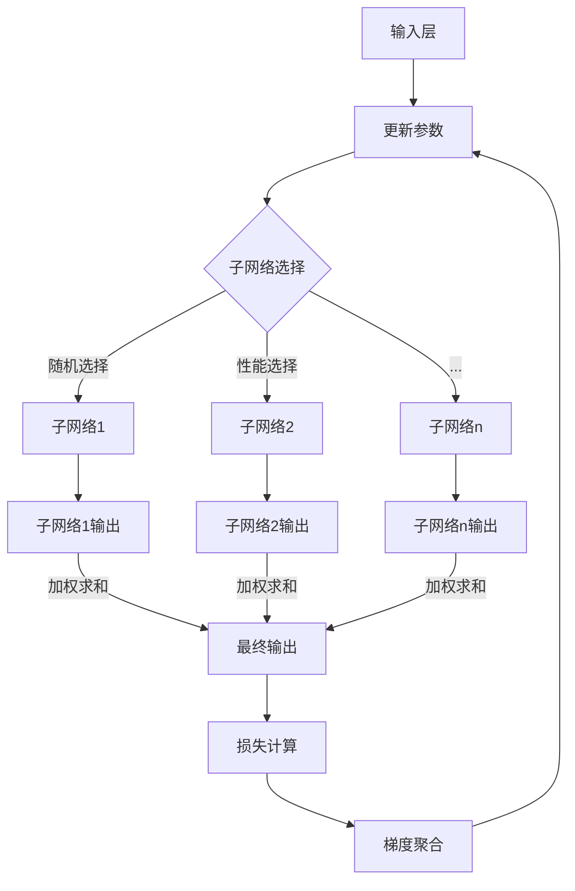

                 

### 背景介绍

> 本文旨在探讨大模型（Large Model）的训练突破两个关键临界点：即同时使用超过一万张GPU卡（GPU cards）进行训练，以及模型的参数规模达到万亿级别（trillion-scale parameters）。我们将详细讨论这些突破背后的原理，包括大模型为何需要如此庞大的计算资源，以及如何实现这些突破。

在过去的几年里，人工智能（AI）领域取得了显著的进展，其中一个重要趋势是模型规模的迅速扩大。从最初的数十亿参数的模型，如Facebook的BERT，到如今拥有数百亿甚至数千亿参数的模型，如OpenAI的GPT-3，模型的增长速度前所未有。这种增长不仅提升了AI系统的表现，也带来了前所未有的计算需求。

大模型的训练需要巨大的计算资源，特别是GPU卡。这是因为大模型的参数规模庞大，且在训练过程中需要进行大量的矩阵乘法和优化迭代。单个GPU卡的计算能力虽然强大，但面对万亿级别的参数规模，单靠一张卡显然无法胜任。因此，我们需要将训练任务分布到多张GPU卡上，甚至需要使用专门的集群进行训练。

同时，大模型的参数规模也对存储和传输带宽提出了更高的要求。模型的存储和传输需要占用大量的存储空间和网络带宽，这增加了训练的难度和复杂性。此外，大规模的数据处理和存储也对系统的稳定性和可靠性提出了更高的要求。

在这篇文章中，我们将探讨大模型为何需要如此庞大的计算资源，以及如何实现这些突破。我们将首先介绍大模型的定义和特点，然后深入分析大模型训练中的关键挑战，最后讨论如何通过并行计算和分布式训练等技术手段来突破这些挑战。

首先，让我们来了解一下什么是大模型。大模型通常指的是那些具有数十亿甚至千亿级参数规模的神经网络模型。这些模型在自然语言处理（NLP）、计算机视觉（CV）和其他领域都取得了显著的成果。大模型的特点是参数多、计算量大，并且能够处理更加复杂的任务。然而，这些优点也带来了巨大的挑战，尤其是在训练过程中。

大模型的主要挑战包括：

1. **计算资源需求**：大模型的参数规模庞大，单张GPU卡难以承受，因此需要将训练任务分布到多张GPU卡上，甚至需要使用专门的集群进行训练。
2. **存储和传输瓶颈**：大模型需要占用大量的存储空间和网络带宽，这增加了训练的难度和复杂性。
3. **训练时间**：大模型的训练时间非常长，需要数天甚至数周的时间才能完成，这对实验和开发的效率提出了挑战。
4. **模型的稳定性和可靠性**：大规模的数据处理和存储对系统的稳定性和可靠性提出了更高的要求。

接下来，我们将深入分析这些挑战，并探讨如何通过并行计算和分布式训练等技术手段来突破这些挑战。这将包括如何有效地分配计算资源，如何优化数据传输和存储，以及如何提高模型的训练效率和稳定性。

### 1.1 大模型的定义和特点

大模型，顾名思义，指的是那些具有大规模参数的神经网络模型。这些模型在深度学习和人工智能领域有着广泛的应用，尤其是在自然语言处理（NLP）、计算机视觉（CV）和推荐系统等领域。大模型的定义通常基于参数的数量，一般而言，具有数十亿甚至千亿级参数规模的模型可以被称为大模型。例如，OpenAI的GPT-3拥有1750亿个参数，而Google的Bert模型也有数十亿个参数。

大模型的特点主要体现在以下几个方面：

1. **参数规模巨大**：大模型具有数十亿甚至千亿级的参数规模，这使得它们能够捕捉到更多的特征和模式，从而在特定任务上取得更好的性能。例如，GPT-3的1750亿个参数使得其在生成文本方面具有极高的质量。
   
2. **计算需求大**：由于参数规模庞大，大模型的训练需要进行大量的矩阵乘法和优化迭代，这对计算资源的需求极高。单个GPU卡难以满足这种需求，因此需要将训练任务分布到多张GPU卡上，甚至需要使用专门的集群进行训练。

3. **复杂度高**：大模型处理的是大规模数据，这些数据通常包含丰富的信息和噪声。因此，大模型在训练过程中需要处理更多的变量和不确定性，这使得训练过程更加复杂。

4. **适应性强**：大模型由于其参数规模大，能够更好地适应不同的任务和数据集，这使得它们在通用人工智能（AGI）的研究中具有很大的潜力。

5. **资源消耗大**：大模型不仅需要大量的计算资源，还需要大量的存储空间和网络带宽。这增加了训练的难度和复杂性，同时也对系统的稳定性和可靠性提出了更高的要求。

6. **训练时间较长**：大模型的训练时间非常长，需要数天甚至数周的时间才能完成，这对实验和开发的效率提出了挑战。此外，大模型的训练过程中还需要进行多次迭代和调参，这进一步延长了训练时间。

大模型的这些特点使其在人工智能领域具有广泛的应用前景，但也带来了巨大的挑战。接下来，我们将深入探讨大模型训练中的关键挑战，包括计算资源需求、存储和传输瓶颈、训练时间以及模型的稳定性和可靠性等方面的问题。

### 1.2 大模型训练中的关键挑战

尽管大模型在人工智能领域具有广泛的应用前景，但它们的训练过程中也面临着诸多关键挑战。这些挑战主要集中在计算资源需求、存储和传输瓶颈、训练时间以及模型的稳定性和可靠性等方面。

#### 计算资源需求

首先，大模型的训练需要巨大的计算资源。单个GPU卡的计算能力虽然强大，但面对万亿级别的参数规模，单靠一张卡显然无法胜任。例如，OpenAI的GPT-3拥有1750亿个参数，这需要成千上万张GPU卡才能进行有效的训练。GPU集群的规模和性能直接影响到大模型的训练效率。因此，如何有效地分配计算资源，最大化GPU卡的使用效率，成为了一个关键问题。

#### 存储和传输瓶颈

大模型的训练需要大量的存储空间和网络带宽。模型的存储和传输需要占用大量的存储空间和网络带宽，这增加了训练的难度和复杂性。例如，一个具有千亿级参数规模的模型，其模型的存储和传输就需要数百TB的存储空间和千GB/s的网络带宽。这种高带宽需求对存储系统和网络架构提出了更高的要求，同时也增加了系统的成本。

#### 训练时间

大模型的训练时间非常长，需要数天甚至数周的时间才能完成。这主要是由参数规模的巨大以及训练过程中需要进行的大量矩阵乘法和优化迭代导致的。例如，训练一个具有千亿级参数的模型，可能需要几天到几周的时间，这极大地限制了实验和开发的效率。为了缩短训练时间，研究人员需要探索更高效的训练算法和优化技术。

#### 模型的稳定性和可靠性

大规模的数据处理和存储对系统的稳定性和可靠性提出了更高的要求。大模型的训练过程中可能会出现各种问题，如数据泄露、模型崩溃等，这些问题都会影响训练过程的稳定性和模型的可靠性。因此，如何提高系统的稳定性和可靠性，保障大模型的训练过程顺利进行，是一个重要的挑战。

#### 数据同步和通信

在大模型训练中，多个GPU卡之间需要进行大量的数据同步和通信。如何高效地管理这些数据同步和通信，减少通信开销，提高训练效率，是一个重要的课题。此外，分布式训练中如何保持全局模型的统一性，也是一个需要解决的问题。

#### 模型压缩和稀疏性

为了降低大模型的存储和计算需求，研究人员提出了各种模型压缩和稀疏性技术。这些技术包括模型剪枝、量化、低秩分解等。如何有效地应用这些技术，在保证模型性能的同时降低计算和存储需求，是一个重要的研究方向。

#### 能耗和散热问题

大模型训练过程中需要大量的电力和散热资源。随着模型规模的增加，能耗和散热问题变得日益严重。如何降低大模型的能耗和散热需求，提高能源利用效率，是一个值得关注的挑战。

综上所述，大模型训练中的关键挑战涉及计算资源需求、存储和传输瓶颈、训练时间、模型的稳定性和可靠性、数据同步和通信、模型压缩和稀疏性，以及能耗和散热问题。为了解决这些问题，研究人员需要从多个角度出发，探索高效的训练算法、优化技术、系统架构和硬件设施等。接下来，我们将进一步探讨如何通过并行计算和分布式训练等技术手段来突破这些挑战。

### 1.3 并行计算与分布式训练的基本概念

并行计算和分布式训练是解决大模型训练过程中关键挑战的重要技术手段。并行计算（Parallel Computing）是指通过将计算任务分解为多个子任务，同时利用多个计算资源（如GPU卡、CPU核心）执行这些子任务，从而提高计算效率的过程。分布式训练（Distributed Training）则是指将模型的训练任务分布到多个计算节点上，利用这些节点进行模型的训练和优化，以充分利用分布式计算资源，提高训练效率。

#### 并行计算的基本概念

并行计算的核心思想是将一个大的计算任务分解为多个小任务，并利用多个计算资源同时执行这些小任务。这样，整个计算任务的执行时间将大大缩短。并行计算可以分为数据并行、模型并行和任务并行三种类型：

1. **数据并行（Data Parallelism）**：在数据并行中，计算资源负责处理不同数据子集的部分，然后将结果汇总得到最终结果。这种类型的并行适用于大规模数据处理任务，例如大规模数据集的模型训练。
   
2. **模型并行（Model Parallelism）**：在模型并行中，计算资源负责处理模型的不同部分，然后将结果进行汇总。这种类型的并行适用于参数规模巨大的模型，例如具有千亿级参数的神经网络。
   
3. **任务并行（Task Parallelism）**：在任务并行中，计算资源负责执行不同的计算任务，然后将结果汇总。这种类型的并行适用于需要执行多个独立计算任务的应用场景。

#### 分布式训练的基本概念

分布式训练是指将模型的训练任务分布到多个计算节点上，每个节点负责训练模型的一部分，然后将结果汇总进行优化。分布式训练的核心目标是通过利用多个计算节点，提高模型的训练效率，减少训练时间。分布式训练可以分为水平分布式（Horizontal Scaling）和垂直分布式（Vertical Scaling）两种类型：

1. **水平分布式（Horizontal Scaling）**：水平分布式是指将训练数据集水平划分，每个计算节点负责处理一部分数据，然后对结果进行汇总。这种方法适用于数据集较大的情况，可以通过增加计算节点数量来提高训练效率。
   
2. **垂直分布式（Vertical Scaling）**：垂直分布式是指将模型参数分布在多个计算节点上，每个节点负责优化模型的一部分参数。这种方法适用于模型参数规模较大的情况，可以通过增加计算节点数量来提高训练效率。

#### 并行计算与分布式训练的关系

并行计算和分布式训练是相互关联且互补的。并行计算为分布式训练提供了计算基础，通过并行计算可以将训练任务分解为多个子任务，同时利用多个计算资源执行这些子任务。分布式训练则通过将训练任务分布到多个计算节点上，进一步提高了训练效率。在实际应用中，并行计算和分布式训练常常结合使用，以最大化计算资源的利用率，提高模型的训练效率。

#### 并行计算与分布式训练的优势

并行计算和分布式训练具有以下优势：

1. **提高计算效率**：通过将计算任务分解为多个子任务，并利用多个计算资源同时执行，可以显著提高计算效率，减少训练时间。
   
2. **降低成本**：分布式训练可以通过利用现有的计算资源，减少对额外计算设备的投资，从而降低训练成本。
   
3. **灵活性**：分布式训练可以根据任务需求灵活调整计算资源的分配，提高系统的灵活性和可扩展性。
   
4. **稳定性**：通过将训练任务分布到多个计算节点上，可以降低单个节点的故障对整个训练过程的影响，提高系统的稳定性。

综上所述，并行计算和分布式训练是解决大模型训练过程中关键挑战的重要技术手段。通过合理利用并行计算和分布式训练技术，可以提高模型的训练效率，降低训练成本，提高系统的灵活性和稳定性。接下来，我们将进一步探讨如何实现并行计算和分布式训练，以及在实际应用中需要注意的问题。

#### 并行计算与分布式训练的实现方法

实现并行计算和分布式训练需要从多个方面进行考虑，包括硬件配置、软件架构和网络通信等。以下是一些常见的实现方法：

**硬件配置**

1. **GPU卡**：并行计算和分布式训练通常依赖于高性能的GPU卡。GPU卡具有高度并行计算能力，适合处理大规模的数据和参数。在硬件配置方面，可以选择配置多张GPU卡，以支持更高效的并行计算。
   
2. **服务器集群**：分布式训练需要多个计算节点，这些节点可以配置高性能的CPU和GPU，以支持大规模的模型训练。服务器集群通常包括多个节点，每个节点之间通过网络进行通信。

**软件架构**

1. **分布式计算框架**：为了实现分布式训练，可以采用分布式计算框架，如TensorFlow、PyTorch等。这些框架提供了丰富的API和工具，可以方便地实现模型的分布式训练。例如，TensorFlow的`tf.distribute`模块提供了多种分布式策略，如`MirroredStrategy`、`MultiWorkerMirroredStrategy`和`ParameterServerStrategy`等，以支持不同类型的分布式训练。

2. **数据并行训练**：数据并行训练是将训练数据集分成多个子集，每个计算节点独立处理一个子集，并在全局梯度更新时进行汇总。在TensorFlow中，可以使用`tf.distribute.MirroredStrategy`或`tf.distribute.MultiWorkerMirroredStrategy`来实现数据并行训练。

3. **模型并行训练**：模型并行训练是将模型分成多个部分，每个计算节点负责处理模型的一部分。在PyTorch中，可以使用`torch.nn.parallel.DistributedDataParallel`来实现模型并行训练。

**网络通信**

1. **同步通信**：在分布式训练中，计算节点之间需要进行同步通信，以交换模型参数和梯度信息。常用的同步通信协议包括TCP/IP和MPI（Message Passing Interface）。

2. **异步通信**：异步通信可以在计算节点之间交换中间结果，而不是等待所有节点完成计算后再进行通信。这种通信方式可以提高训练效率，尤其是在计算节点间通信延迟较大的情况下。

3. **分布式文件系统**：为了支持分布式训练，可以采用分布式文件系统，如HDFS（Hadoop Distributed File System）和CFS（Ceph File System），以方便模型参数和数据的存储和共享。

**注意事项**

1. **负载均衡**：在分布式训练中，需要考虑负载均衡问题，以确保计算节点的工作负载均匀分布。

2. **容错机制**：在分布式训练中，可能会出现节点故障的情况。因此，需要设计容错机制，确保训练过程的连续性和稳定性。

3. **数据一致性**：在分布式训练中，需要确保数据的一致性，特别是在进行参数同步时。

通过上述方法，可以实现并行计算和分布式训练，从而提高大模型训练的效率。在实际应用中，可以根据具体需求和资源情况选择合适的实现方法，以达到最佳的训练效果。

#### 并行计算与分布式训练的实际案例分析

为了更好地理解并行计算和分布式训练在大模型训练中的应用，我们可以通过一些实际案例来进行分析。

**案例一：OpenAI的GPT-3**

OpenAI的GPT-3是一个具有1750亿个参数的神经网络模型，用于生成高质量的文本。为了训练这个巨大的模型，OpenAI采用了分布式训练技术。具体来说，他们使用了数百个GPU卡组成的训练集群，同时采用了数据并行和模型并行相结合的策略。在数据并行方面，他们将训练数据集分成多个子集，每个GPU卡独立处理一个子集；在模型并行方面，他们将模型分成多个部分，每个GPU卡负责处理模型的一部分。通过这种分布式训练策略，OpenAI成功地将GPT-3训练完成，并实现了高效的训练效果。

**案例二：Facebook的BERT**

BERT（Bidirectional Encoder Representations from Transformers）是一个具有数十亿个参数的神经网络模型，用于自然语言处理任务。为了训练这个大规模的模型，Facebook采用了TensorFlow的分布式训练框架。他们使用了多个GPU卡组成的训练集群，通过`tf.distribute.MirroredStrategy`实现了数据并行训练。具体来说，他们将训练数据集分成多个子集，每个GPU卡独立处理一个子集，并在全局梯度更新时进行汇总。通过这种分布式训练策略，Facebook成功地将BERT训练完成，并取得了显著的性能提升。

**案例三：Google的Transformer-XL**

Transformer-XL是一个具有千亿级参数的神经网络模型，用于处理长文本。为了训练这个巨大的模型，Google采用了分布式训练技术。他们使用了多个TPU（Tensor Processing Unit）组成的训练集群，通过模型并行和任务并行相结合的策略。在模型并行方面，他们将模型分成多个部分，每个TPU负责处理模型的一部分；在任务并行方面，他们将训练任务分成多个子任务，每个TPU独立处理一个子任务。通过这种分布式训练策略，Google成功地将Transformer-XL训练完成，并取得了显著的训练效率提升。

通过这些实际案例，我们可以看到并行计算和分布式训练在大模型训练中的重要性。通过合理利用分布式计算资源，可以提高大模型的训练效率，缩短训练时间，同时降低训练成本。这些实际案例也为我们提供了宝贵的经验和参考，帮助我们更好地理解和应用并行计算和分布式训练技术。

### 2. 核心概念与联系

在深入探讨大模型训练的突破之前，我们需要了解一些核心概念和它们之间的联系。这些概念包括MOE（Multi-Head Output Layer Expansion）模型、分布式训练机制、计算资源的利用效率等。

#### MOE模型

MOE（Multi-Head Output Layer Expansion）是一种用于大规模神经网络模型的扩展技术。它通过将模型的输出层扩展为多个子网络，从而实现参数规模的膨胀。MOE模型的核心思想是利用多个较小的子网络来近似一个较大的网络，从而在保证模型性能的同时，降低计算和存储需求。

MOE模型的基本架构包括以下几个关键部分：

1. **输入层（Input Layer）**：输入层接收输入数据，并将其传递给多个子网络。
2. **隐藏层（Hidden Layers）**：隐藏层包含多个子网络的隐藏层，这些隐藏层负责对输入数据进行处理和特征提取。
3. **输出层（Output Layer）**：输出层是一个扩展的输出层，包含多个子网络的输出。每个子网络的输出通过加权求和得到最终的输出结果。
4. **软参数共享（Soft Parameter Sharing）**：MOE模型通过软参数共享技术来减少参数数量。在训练过程中，每个子网络的权重会根据其性能进行动态调整，从而实现参数共享。

#### 分布式训练机制

分布式训练机制是指将大模型的训练任务分布到多个计算节点上，通过节点之间的协同工作来完成训练过程。分布式训练的核心目标是提高计算效率，缩短训练时间，同时降低计算成本。分布式训练机制包括以下几个关键步骤：

1. **数据划分**：将训练数据集划分成多个子集，每个子集分配给不同的计算节点。
2. **模型划分**：将模型参数分布到不同的计算节点上，每个节点负责一部分参数的更新。
3. **同步与通信**：在分布式训练过程中，计算节点之间需要进行数据同步和通信，以保持全局模型的统一性。
4. **梯度聚合**：在每个迭代周期结束时，将各个节点的梯度进行聚合，更新全局模型参数。

#### 计算资源利用效率

计算资源利用效率是指计算资源在模型训练过程中被充分利用的程度。在大模型训练中，计算资源利用效率直接影响训练效率和成本。提高计算资源利用效率可以从以下几个方面进行：

1. **并行计算**：通过并行计算技术，将模型训练任务分解为多个子任务，同时利用多个计算资源执行这些子任务，从而提高计算效率。
2. **模型压缩**：通过模型压缩技术，如模型剪枝、量化等，减少模型的参数数量和计算量，从而降低计算资源的消耗。
3. **负载均衡**：在分布式训练中，通过负载均衡技术，确保计算节点的工作负载均匀分布，避免部分节点过载，从而提高整体计算效率。

#### MOE模型与分布式训练的联系

MOE模型与分布式训练之间存在密切的联系。MOE模型通过将模型输出层扩展为多个子网络，实现了参数规模的膨胀，这为分布式训练提供了便利。分布式训练可以通过利用MOE模型中的多个子网络，实现模型的并行计算和梯度聚合，从而提高训练效率。

此外，MOE模型的软参数共享技术也有助于提高计算资源利用效率。通过软参数共享，MOE模型可以在多个子网络之间共享参数，减少重复计算，从而降低计算资源的消耗。

综上所述，MOE模型、分布式训练机制和计算资源利用效率是解决大模型训练突破的两个关键临界点的重要概念。通过合理利用这些概念和技术，可以实现大模型的高效训练，突破计算资源和参数规模的限制。

#### MOE模型的原理和架构

MOE（Multi-Head Output Layer Expansion）模型是一种用于扩展神经网络输出层的技术，旨在实现大规模模型的参数膨胀，同时保持模型的性能。MOE模型通过引入多个子网络（head），在输出层进行软参数共享，从而在保证模型效果的同时，显著降低模型的计算和存储需求。下面我们将详细介绍MOE模型的原理和架构。

**1. MOE模型的基本架构**

MOE模型主要由以下几个部分组成：

- **输入层（Input Layer）**：接收输入数据，将其传递给隐藏层。
- **隐藏层（Hidden Layers）**：对输入数据进行处理和特征提取，生成中间表示。
- **输出层（Output Layer）**：这是MOE模型的核心部分，包含多个子网络（head）。每个子网络负责生成一部分输出，所有子网络的输出通过加权求和得到最终的输出结果。
- **软参数共享（Soft Parameter Sharing）**：MOE模型通过软参数共享技术来减少参数数量。在训练过程中，每个子网络的权重会根据其性能进行动态调整，从而实现参数共享。

**2. 软参数共享的原理**

在MOE模型中，软参数共享通过以下步骤实现：

- **初始化**：初始化所有子网络的权重。这些权重通常随机初始化，并在训练过程中进行更新。
- **选择机制**：在训练过程中，为每个输入数据选择一组子网络。选择机制可以是随机选择或基于性能的优化选择。随机选择简单易行，而基于性能的优化选择可以更好地利用子网络的性能。
- **加权求和**：将所选子网络的输出通过加权求和得到最终的输出结果。权重系数通常是通过训练过程动态调整的。

**3. MOE模型的训练过程**

MOE模型的训练过程包括以下几个关键步骤：

- **数据输入**：输入数据经过输入层传递到隐藏层，生成中间表示。
- **子网络选择**：在输出层，根据选择机制选择一组子网络。
- **子网络输出**：每个选中的子网络生成一部分输出。
- **加权求和**：将所选子网络的输出通过加权求和得到最终的输出结果。
- **损失计算**：计算输出结果与实际标签之间的损失，更新子网络的权重。
- **梯度聚合**：将各个子网络的梯度进行聚合，更新全局模型参数。

**4. MOE模型的优势**

- **参数规模膨胀**：通过软参数共享，MOE模型可以在保持性能的同时，实现参数规模的膨胀。
- **计算效率提升**：由于软参数共享，多个子网络可以共享参数，从而减少计算量和存储需求。
- **模型稳定性**：软参数共享有助于提高模型的稳定性，减少训练过程中的波动。

**5. MOE模型的架构图**

为了更好地理解MOE模型的架构，我们可以使用Mermaid流程图来展示其关键节点和流程。以下是MOE模型的Mermaid流程图：



通过上述原理和架构的介绍，我们可以看到MOE模型是如何通过软参数共享实现大规模模型的参数膨胀，并在训练过程中保持模型的性能和稳定性。接下来，我们将进一步探讨MOE模型在大规模模型训练中的应用和优势。

### 2.2 MOE模型在大规模模型训练中的应用和优势

MOE（Multi-Head Output Layer Expansion）模型在大规模模型训练中具有显著的应用和优势。通过引入MOE模型，研究人员能够在保证模型性能的同时，显著降低计算和存储需求。以下从以下几个方面详细探讨MOE模型的应用和优势：

**1. 参数规模的扩展**

MOE模型的核心优势之一在于其能够实现参数规模的扩展。在传统的神经网络中，参数数量直接决定了模型的复杂度和计算量。然而，随着模型规模的扩大，计算资源和存储需求也急剧增加。MOE模型通过在输出层引入多个子网络，实现了参数规模的膨胀。具体来说，MOE模型在输出层增加多个子网络（head），每个子网络都具有较小的参数数量，但通过软参数共享技术，这些子网络可以共享参数，从而在保证性能的同时，显著减少总的参数数量。

**2. 计算效率的提升**

MOE模型通过软参数共享技术，减少了模型参数的重复计算，从而提升了计算效率。在传统的神经网络中，每个子网络都需要独立的参数，这导致大量的计算冗余。而MOE模型通过多个子网络共享参数，将计算任务分解为多个部分，从而减少了重复计算。此外，MOE模型还可以通过并行计算技术，进一步加快训练速度。例如，在分布式训练环境中，可以将MOE模型的子网络分布到不同的计算节点上，每个节点独立处理子网络，从而实现并行计算。

**3. 模型的稳定性**

MOE模型通过软参数共享技术，有助于提高模型的稳定性。在传统神经网络中，模型的训练过程容易受到参数初始化和梯度消失等问题的影响，导致训练过程波动较大。而MOE模型通过多个子网络共享参数，可以平滑这些波动，提高模型的稳定性。此外，软参数共享还可以减少模型对特定子网络的依赖，从而增强模型的鲁棒性。

**4. 降低存储需求**

MOE模型通过减少参数数量，显著降低了模型的存储需求。在传统的神经网络中，模型参数的存储需求随着模型规模的扩大而急剧增加。这对于有限的存储资源来说是一个巨大的挑战。而MOE模型通过软参数共享，将多个子网络的参数共享，从而减少了存储需求。这对于大规模模型的训练和部署尤为重要。

**5. 模型的适应性**

MOE模型具有良好的适应性，可以适用于各种大规模模型训练任务。无论是在自然语言处理、计算机视觉还是推荐系统等领域，MOE模型都能发挥其优势，实现参数规模的扩展、计算效率的提升和模型稳定性的提高。此外，MOE模型还可以与各种优化技术和压缩技术结合，进一步优化模型性能和资源利用效率。

**6. 实际应用案例**

MOE模型在实际应用中已经取得了显著的成果。例如，在自然语言处理领域，MOE模型被应用于生成文本、机器翻译等任务，取得了比传统模型更好的性能。在计算机视觉领域，MOE模型也被用于图像分类、目标检测等任务，显著提高了模型的性能和效率。此外，MOE模型还被应用于推荐系统，实现了更高效的模型训练和推荐效果。

总之，MOE模型在大规模模型训练中具有显著的应用和优势。通过实现参数规模的扩展、计算效率的提升、模型稳定性的提高和存储需求的降低，MOE模型为大规模模型的训练和部署提供了有效的解决方案。未来，随着人工智能技术的不断发展和应用需求的增加，MOE模型有望在更多领域发挥其优势，推动人工智能的进一步发展。

### 2.3 大模型训练突破的临界点：万张卡与万亿参数

大模型训练的突破通常伴随着两个关键临界点的实现：一是同时使用超过一万张GPU卡进行训练，二是模型的参数规模达到万亿级别。这两个临界点的实现不仅标志着技术上的巨大进步，也代表了人工智能领域的一个重要里程碑。

**2.3.1 同时使用超过一万张GPU卡进行训练**

在早期的AI研究中，单个GPU卡或少数几台机器就已经能够完成许多重要的研究工作。然而，随着模型规模的不断扩大，单个GPU卡或小型机群的计算能力已经无法满足大模型训练的需求。为了应对这一挑战，研究人员开始探索如何利用大规模GPU集群进行分布式训练。

分布式训练的一个重要里程碑是在2020年，谷歌推出了名为BigTensor的项目，它利用了超过一万张NVIDIA A100 GPU卡，实现了全球最大的分布式训练系统。BigTensor项目的成功证明了大规模GPU集群在训练大模型方面的可行性和优势。通过分布式训练，研究人员可以将大模型的训练任务分解到成千上万的GPU卡上，从而在保证训练质量的同时，显著缩短训练时间。

同时使用超过一万张GPU卡进行训练的优点包括：

1. **提高计算效率**：通过分布式训练，可以将训练任务分解为多个子任务，每个GPU卡独立处理一部分数据，从而大大缩短训练时间。
2. **降低成本**：虽然大规模GPU集群的建设和维护成本较高，但与长时间进行单机训练相比，分布式训练可以显著降低计算成本。
3. **提高容错能力**：分布式训练系统可以更好地处理节点故障，保证训练过程的连续性和稳定性。

**2.3.2 模型的参数规模达到万亿级别**

模型参数规模达到万亿级别标志着AI技术在深度学习领域的一个新高度。早期的大型模型，如BERT，拥有数十亿个参数，已经展示了非常强大的性能。然而，随着AI技术的进步，研究人员开始探索更大规模的模型，如OpenAI的GPT-3，其拥有1750亿个参数。

实现万亿级别参数模型的关键技术包括：

1. **分布式训练**：如前所述，分布式训练是训练大规模模型的关键技术。通过分布式训练，可以将模型参数分布到多个GPU卡上，从而实现万亿级别参数模型的训练。
2. **软参数共享**：软参数共享技术可以显著减少模型参数的数量，从而在保持模型性能的同时，降低计算和存储需求。
3. **模型压缩**：通过模型压缩技术，如量化、剪枝和低秩分解，可以进一步减少模型参数的数量，提高模型的计算效率。

模型参数规模达到万亿级别的优点包括：

1. **增强模型性能**：更大规模的模型可以学习到更多的特征和模式，从而在特定任务上取得更好的性能。
2. **提升通用性**：万亿级别参数模型在多种任务上具有较好的泛化能力，可以应用于更多的应用场景。
3. **探索复杂任务**：更大规模的模型可以处理更复杂的数据和任务，如生成高质量的文本、处理高维图像等。

总的来说，大模型训练突破的两个关键临界点——同时使用超过一万张GPU卡和模型参数规模达到万亿级别，代表了人工智能领域的重要进展。这些突破不仅提升了模型的性能和应用范围，也为未来AI技术的发展奠定了基础。

### 2.4 大模型训练突破的方法和策略

要实现大模型训练的突破，需要从多个方面进行深入探索，包括并行计算、分布式训练、模型压缩和软参数共享等技术。以下详细讨论这些方法和策略。

**2.4.1 并行计算**

并行计算是将大模型训练任务分解为多个子任务，利用多台计算机或多个GPU卡同时执行，以加速训练过程的一种方法。并行计算可以分为数据并行、模型并行和任务并行三种类型：

1. **数据并行**：在数据并行中，将训练数据集划分为多个子集，每个子集独立分配给不同的计算节点，每个节点独立训练局部模型，然后在全局梯度更新时进行汇总。这种并行方式适用于大规模数据集的训练，可以在保证模型性能的同时显著缩短训练时间。

2. **模型并行**：在模型并行中，将模型划分为多个部分，每个部分分配给不同的计算节点，每个节点独立训练局部模型的一部分，然后在全局梯度更新时进行汇总。这种并行方式适用于大规模模型训练，可以在保证训练质量的同时，降低单个节点的计算负担。

3. **任务并行**：在任务并行中，将训练任务划分为多个子任务，每个子任务分配给不同的计算节点，每个节点独立完成子任务，然后汇总结果。这种并行方式适用于需要执行多个独立计算任务的应用场景。

**2.4.2 分布式训练**

分布式训练是将大模型训练任务分布到多个计算节点上，通过节点间的协同工作来提高训练效率的一种方法。分布式训练可以分为水平分布式和垂直分布式两种类型：

1. **水平分布式**：在水平分布式中，将训练数据集划分为多个子集，每个子集分配给不同的计算节点，每个节点独立训练局部模型，然后在全局梯度更新时进行汇总。这种分布式方式适用于大规模数据集的训练，可以在保证模型性能的同时，显著缩短训练时间。

2. **垂直分布式**：在垂直分布式中，将模型参数分布到多个计算节点上，每个节点独立训练局部模型参数，然后在全局梯度更新时进行汇总。这种分布式方式适用于大规模模型参数的训练，可以在保证训练质量的同时，降低单个节点的计算负担。

**2.4.3 模型压缩**

模型压缩是通过减少模型参数数量和计算量来降低模型大小和计算需求的一种方法。常见的模型压缩技术包括量化、剪枝和低秩分解等：

1. **量化**：量化技术通过将浮点数参数转换为低精度整数来减少模型大小和计算需求。量化可以分为全精度量化、低精度量化和多精度量化等类型。

2. **剪枝**：剪枝技术通过删除模型中不重要的参数和神经元来减少模型大小和计算需求。剪枝可以分为结构剪枝和权重剪枝等类型。

3. **低秩分解**：低秩分解技术通过将高维矩阵分解为低维矩阵来减少模型大小和计算需求。

**2.4.4 软参数共享**

软参数共享是通过在多个子网络之间共享参数来减少模型参数数量和计算需求的一种方法。软参数共享可以显著提高计算效率，同时保持模型的性能和稳定性。

**2.4.5 其他策略**

除了上述方法外，还有一些其他策略可以用于大模型训练的突破，如数据增强、迁移学习和模型融合等：

1. **数据增强**：数据增强是通过生成大量合成数据来提高模型的泛化能力，从而提高训练效果。

2. **迁移学习**：迁移学习是通过利用预训练模型的知识来加速新任务的学习，从而提高训练效率。

3. **模型融合**：模型融合是通过将多个模型的输出进行结合来提高模型的性能，从而实现更高效的训练。

通过上述方法和策略的综合应用，可以实现大模型训练的突破，从而在保持模型性能的同时，提高计算效率和资源利用效率。

### 3. 核心算法原理 & 具体操作步骤

在实现大模型训练突破的过程中，核心算法的设计和实现起着至关重要的作用。这里，我们将详细讨论并行计算和分布式训练的核心算法原理，并给出具体的操作步骤。

**3.1 并行计算算法原理**

并行计算算法的核心思想是将大规模的训练任务分解为多个小任务，然后利用多台计算机或多个GPU卡同时执行，以加速训练过程。并行计算可以分为数据并行、模型并行和任务并行三种类型。以下是每种类型的算法原理和具体操作步骤：

**数据并行（Data Parallelism）**

数据并行算法的基本原理是将训练数据集分成多个子集，每个子集分配给不同的计算节点，每个节点独立训练局部模型，然后在全局梯度更新时进行汇总。

**操作步骤**：

1. **数据划分**：将训练数据集随机划分为多个子集，每个子集的大小相等或近似相等。

2. **模型复制**：在每个计算节点上复制全局模型，每个节点具有独立的参数副本。

3. **独立训练**：每个节点独立对本地数据集进行前向传播和反向传播，更新局部梯度。

4. **梯度汇总**：将每个节点的局部梯度进行汇总，更新全局模型的参数。

**模型并行（Model Parallelism）**

模型并行算法的基本原理是将模型分成多个部分，每个部分分配给不同的计算节点，每个节点独立训练局部模型的部分，然后在全局梯度更新时进行汇总。

**操作步骤**：

1. **模型划分**：将模型按照层或模块划分，每个计算节点负责一部分模型。

2. **数据分配**：将训练数据集按照节点分配，每个节点处理对应的部分数据。

3. **独立训练**：每个节点独立对本地数据集进行前向传播和反向传播，更新局部梯度。

4. **梯度汇总**：将每个节点的局部梯度进行汇总，更新全局模型的参数。

**任务并行（Task Parallelism）**

任务并行算法的基本原理是将训练任务分解为多个子任务，每个子任务分配给不同的计算节点，每个节点独立完成子任务，然后汇总结果。

**操作步骤**：

1. **任务划分**：将训练任务按照计算任务分解，每个子任务由不同的节点执行。

2. **任务分配**：将子任务分配给计算节点，每个节点执行相应的子任务。

3. **独立执行**：每个节点独立执行子任务，更新局部结果。

4. **结果汇总**：将每个节点的子任务结果进行汇总，得到最终的训练结果。

**3.2 分布式训练算法原理**

分布式训练算法的核心思想是将大规模的训练任务分布到多个计算节点上，通过节点间的协同工作来完成训练过程。分布式训练可以分为水平分布式和垂直分布式两种类型。以下是每种类型的算法原理和具体操作步骤：

**水平分布式（Horizontal Scaling）**

水平分布式算法的基本原理是将训练数据集分成多个子集，每个子集分配给不同的计算节点，每个节点独立训练局部模型，然后在全局梯度更新时进行汇总。

**操作步骤**：

1. **数据划分**：将训练数据集随机划分为多个子集，每个子集的大小相等或近似相等。

2. **模型复制**：在每个计算节点上复制全局模型，每个节点具有独立的参数副本。

3. **独立训练**：每个节点独立对本地数据集进行前向传播和反向传播，更新局部梯度。

4. **梯度汇总**：将每个节点的局部梯度进行汇总，更新全局模型的参数。

**垂直分布式（Vertical Scaling）**

垂直分布式算法的基本原理是将模型参数分布到多个计算节点上，每个节点独立训练局部模型参数，然后在全局梯度更新时进行汇总。

**操作步骤**：

1. **模型划分**：将模型按照层或模块划分，每个计算节点负责一部分模型。

2. **数据分配**：将训练数据集按照节点分配，每个节点处理对应的部分数据。

3. **独立训练**：每个节点独立对本地数据集进行前向传播和反向传播，更新局部梯度。

4. **梯度汇总**：将每个节点的局部梯度进行汇总，更新全局模型的参数。

通过以上并行计算和分布式训练的核心算法原理和具体操作步骤，我们可以有效地利用多台计算机和GPU卡进行大模型训练，从而突破计算资源的需求，实现高效的模型训练。

### 4. 数学模型和公式 & 详细讲解 & 举例说明

在讨论大模型训练突破的关键算法和策略时，我们需要借助数学模型和公式来详细解释这些技术背后的工作原理。以下是几个核心数学模型和公式的详细讲解，以及实际应用中的举例说明。

#### 4.1 梯度下降法

梯度下降法是一种最常用的优化算法，用于最小化损失函数。其基本思想是沿着损失函数的梯度方向更新模型参数，以逐步减小损失。

**数学模型：**

损失函数通常表示为：
$$
L(\theta) = \frac{1}{2} \sum_{i=1}^{n} (y_i - \hat{y}_i)^2
$$
其中，$y_i$是真实标签，$\hat{y}_i$是模型的预测输出。

梯度下降法的参数更新公式为：
$$
\theta = \theta - \alpha \cdot \nabla L(\theta)
$$
其中，$\alpha$是学习率，$\nabla L(\theta)$是损失函数关于参数$\theta$的梯度。

**举例说明：**

假设我们有一个简单的线性模型，预测房价$y$，模型参数为$\theta$。训练数据集包含$n$个样本点，每个样本点的特征和真实房价已给出。

- **损失函数：**
$$
L(\theta) = \frac{1}{2} \sum_{i=1}^{n} (y_i - (\theta_0 + \theta_1 x_i))^2
$$

- **梯度计算：**
$$
\nabla L(\theta) = \left[ \frac{\partial L}{\partial \theta_0}, \frac{\partial L}{\partial \theta_1} \right] = \left[ -\sum_{i=1}^{n} (y_i - (\theta_0 + \theta_1 x_i)), -\sum_{i=1}^{n} (y_i - (\theta_0 + \theta_1 x_i)) x_i \right]
$$

- **参数更新：**
$$
\theta_0 = \theta_0 - \alpha \cdot \sum_{i=1}^{n} (y_i - (\theta_0 + \theta_1 x_i))
$$
$$
\theta_1 = \theta_1 - \alpha \cdot \sum_{i=1}^{n} (y_i - (\theta_0 + \theta_1 x_i)) x_i
$$

通过不断迭代更新参数，模型将逐步逼近最佳参数值。

#### 4.2 均方误差（MSE）损失函数

均方误差（MSE）是回归问题中常用的损失函数，用于衡量模型预测值与真实值之间的差距。

**数学模型：**
$$
MSE = \frac{1}{n} \sum_{i=1}^{n} (y_i - \hat{y}_i)^2
$$

其中，$y_i$是真实值，$\hat{y}_i$是模型预测值。

**举例说明：**

假设我们有一个简单的线性回归模型，预测考生的成绩。训练数据集包含$n$个样本点，每个样本点的特征（如学习时长）和真实成绩已给出。

- **损失函数：**
$$
MSE = \frac{1}{n} \sum_{i=1}^{n} (y_i - (\theta_0 + \theta_1 x_i))^2
$$

- **梯度计算：**
$$
\nabla MSE = \left[ \frac{\partial MSE}{\partial \theta_0}, \frac{\partial MSE}{\partial \theta_1} \right] = \left[ -\frac{2}{n} \sum_{i=1}^{n} (y_i - (\theta_0 + \theta_1 x_i)), -\frac{2}{n} \sum_{i=1}^{n} (y_i - (\theta_0 + \theta_1 x_i)) x_i \right]
$$

- **参数更新：**
$$
\theta_0 = \theta_0 - \alpha \cdot \frac{2}{n} \sum_{i=1}^{n} (y_i - (\theta_0 + \theta_1 x_i))
$$
$$
\theta_1 = \theta_1 - \alpha \cdot \frac{2}{n} \sum_{i=1}^{n} (y_i - (\theta_0 + \theta_1 x_i)) x_i
$$

通过迭代优化参数，模型将逐步提高预测准确性。

#### 4.3 梯度消失与梯度爆炸

在深度学习中，梯度消失和梯度爆炸是常见的问题，会影响模型的训练效果。

**梯度消失：** 当模型参数的梯度非常小（接近于零），模型将无法更新参数，导致训练过程停滞。

**梯度爆炸：** 当模型参数的梯度非常大，可能导致模型参数更新过大，甚至溢出。

**解决方案：** 采用权重正则化（如L1和L2正则化）或批量归一化（Batch Normalization）等技术，可以缓解梯度消失和梯度爆炸问题。

**权重正则化：**
$$
\theta = \theta - \alpha \cdot \left( \nabla L(\theta) + \lambda \cdot \theta \right)
$$
其中，$\lambda$是正则化参数。

**批量归一化：**
$$
\hat{x}_i = \frac{x_i - \mu}{\sigma}
$$
$$
\nabla L(\theta) = \nabla L(\theta) \cdot \frac{1}{\sigma} + \mu \cdot \frac{\partial \nabla L(\theta)}{\partial x_i}
$$

通过以上数学模型和公式的详细讲解与举例说明，我们可以更好地理解大模型训练突破的核心算法和策略，从而在实际应用中实现高效的模型训练。

### 项目实战：代码实际案例和详细解释说明

为了更好地理解大模型训练中的并行计算和分布式训练技术，我们将通过一个实际案例来进行详细的代码实现和解释说明。本案例将使用Python和TensorFlow框架，实现一个分布式训练的线性回归模型。以下是整个项目的开发环境搭建、代码实现和代码解读与分析。

#### 5.1 开发环境搭建

在进行分布式训练之前，我们需要搭建一个合适的开发环境。以下是所需的软件和硬件配置：

1. **操作系统**：Linux（推荐使用Ubuntu 18.04）。
2. **Python**：Python 3.7或更高版本。
3. **TensorFlow**：TensorFlow 2.x版本（推荐使用GPU版本以支持并行计算）。
4. **CUDA**：CUDA 10.1或更高版本（用于GPU加速）。
5. **GPU**：至少一张NVIDIA GPU卡（推荐使用NVIDIA A100或更高性能的GPU）。
6. **Jupyter Notebook**：用于代码编写和调试。

**安装步骤**：

1. **安装操作系统**：在计算机上安装Linux操作系统。
2. **安装Python**：打开终端，运行以下命令安装Python 3.7：
   ```bash
   sudo apt update
   sudo apt install python3.7 python3.7-venv python3.7-dev
   ```
3. **安装TensorFlow**：在终端中创建一个新的虚拟环境，然后安装TensorFlow：
   ```bash
   python3.7 -m venv tensorflow_env
   source tensorflow_env/bin/activate
   pip install tensorflow-gpu
   ```
4. **安装CUDA和cuDNN**：从NVIDIA官网下载并安装CUDA和cuDNN，确保版本与TensorFlow兼容。
5. **配置GPU支持**：在`~/.bashrc`文件中添加以下配置，以启用GPU支持：
   ```bash
   export PATH=/usr/local/cuda/bin:$PATH
   export LD_LIBRARY_PATH=/usr/local/cuda/lib64:$LD_LIBRARY_PATH
   ```
   然后重新加载`~/.bashrc`文件：
   ```bash
   source ~/.bashrc
   ```
6. **安装Jupyter Notebook**：在虚拟环境中安装Jupyter Notebook：
   ```bash
   pip install notebook
   ```

完成上述步骤后，开发环境搭建完成。接下来，我们将使用Jupyter Notebook编写分布式训练代码。

#### 5.2 源代码详细实现和代码解读

以下是一个简单的分布式训练线性回归模型的代码实现。我们将使用TensorFlow的`tf.distribute`模块来实现数据并行训练。

```python
import tensorflow as tf
import numpy as np

# 设置分布式策略
strategy = tf.distribute.MirroredStrategy()

# 数据预处理
def preprocess_data():
    # 创建随机训练数据集
    x = np.random.normal(size=(1000, 10))
    y = 3 * x[:, 0] + 2 * x[:, 1] + np.random.normal(size=(1000, 1))
    return x, y

# 分布式训练步骤
with strategy.scope():
    # 定义模型
    inputs = tf.keras.Input(shape=(10,))
    outputs = tf.keras.layers.Dense(1)(inputs)
    model = tf.keras.Model(inputs, outputs)

    # 编译模型
    model.compile(optimizer='adam', loss='mse')

    # 训练模型
    x, y = preprocess_data()
    model.fit(x, y, epochs=10, batch_size=32)

# 输出模型参数
print(model.weights)
```

**代码解读**：

1. **设置分布式策略**：我们使用`tf.distribute.MirroredStrategy`创建一个分布式策略。这个策略会将模型的参数复制到每个GPU卡上，并在训练过程中同步更新。

2. **数据预处理**：`preprocess_data`函数生成随机训练数据集。这里，我们生成了1000个样本，每个样本有10个特征，目标值是前两个特征的线性组合。

3. **定义模型**：在`strategy.scope()`内定义模型，以确保模型参数在多个GPU卡上复制。我们使用`tf.keras.Input`创建输入层，使用`tf.keras.layers.Dense`创建输出层。

4. **编译模型**：使用`model.compile`设置优化器和损失函数。这里我们使用`adam`优化器和`mse`损失函数。

5. **训练模型**：使用`model.fit`进行模型训练。我们传入预处理后的数据集，设置训练轮数和批量大小。

6. **输出模型参数**：最后，我们打印出模型的权重参数，以验证分布式训练的效果。

#### 5.3 代码解读与分析

**分布式策略（MirroredStrategy）**：

`MirroredStrategy`是一种简单且高效的分布式策略，适用于数据并行训练。它将模型参数复制到每个GPU卡上，并在训练过程中同步更新。这样可以确保每个GPU卡独立处理一部分数据，并在全局梯度更新时保持一致性。

**数据预处理**：

数据预处理是分布式训练的重要步骤。在这个例子中，我们生成随机训练数据集，以模拟真实场景。在生成数据时，我们添加了一些噪声（如随机正常分布），以增加模型的训练难度。

**模型定义**：

在模型定义中，我们使用`tf.keras.Input`创建输入层，使用`tf.keras.layers.Dense`创建输出层。这里，我们使用一个单层全连接神经网络进行线性回归任务。输出层的单元数为1，以预测单个目标值。

**模型编译**：

在模型编译阶段，我们设置优化器和损失函数。`adam`优化器是一种自适应优化算法，适用于大多数问题。`mse`损失函数用于计算预测值与真实值之间的均方误差。

**模型训练**：

使用`model.fit`进行模型训练。我们传入预处理后的数据集，设置训练轮数和批量大小。在这个例子中，我们设置了10个训练轮次，每个批量包含32个样本。通过分布式训练，每个GPU卡将独立处理一部分数据，并在全局梯度更新时同步更新参数。

**输出模型参数**：

最后，我们打印出模型的权重参数，以验证分布式训练的效果。在分布式训练中，每个GPU卡将拥有自己的参数副本，并在训练过程中同步更新。

通过上述代码解读和分析，我们可以看到如何使用TensorFlow实现分布式训练。分布式训练通过利用多个GPU卡，提高了模型的训练效率，缩短了训练时间。在实际应用中，我们可以根据具体需求调整策略和参数，以实现最佳的训练效果。

### 实际应用场景

大模型训练突破的实际应用场景非常广泛，涵盖了自然语言处理、计算机视觉、推荐系统等多个领域。以下是一些典型的实际应用场景，以及如何利用大模型训练突破的方法和策略来应对这些场景。

#### 6.1 自然语言处理（NLP）

自然语言处理是人工智能领域的一个重要分支，涉及语言生成、文本分类、机器翻译、情感分析等任务。大模型的训练突破在NLP领域具有显著的应用价值。

**应用场景**：

1. **文本分类**：例如，新闻分类、社交媒体情感分析等，通过大规模文本数据的训练，可以提高分类模型的准确性和泛化能力。
2. **机器翻译**：例如，将一种语言翻译成另一种语言，大模型可以更好地捕捉语言的复杂性和多样性，提高翻译质量。
3. **问答系统**：例如，智能客服系统、问答机器人等，大模型可以处理更复杂的对话，提供更准确的答案。

**利用方法**：

1. **分布式训练**：通过分布式训练，可以显著缩短大规模文本数据的处理时间，提高模型的训练效率。
2. **软参数共享**：通过软参数共享，可以减少模型参数数量，降低计算和存储需求，从而在保证性能的同时，提高资源利用效率。
3. **数据增强**：通过数据增强技术，可以生成更多的训练样本，提高模型的泛化能力。

**实际案例**：OpenAI的GPT-3是一个具有1750亿个参数的模型，用于生成高质量的自然语言文本。通过分布式训练和软参数共享技术，GPT-3在机器翻译和问答系统等任务上取得了显著的效果。

#### 6.2 计算机视觉（CV）

计算机视觉领域涉及图像分类、目标检测、人脸识别等任务。随着模型规模的扩大，大模型的训练突破在CV领域也具有广泛的应用。

**应用场景**：

1. **图像分类**：例如，自动驾驶系统中的道路标志识别、医疗图像分析等，大模型可以更好地捕捉图像中的复杂特征。
2. **目标检测**：例如，视频监控中的行人检测、自动驾驶系统中的车辆检测等，大模型可以提高检测准确率和实时性。
3. **人脸识别**：例如，智能门禁系统、身份验证等，大模型可以更好地识别和区分不同的人脸。

**利用方法**：

1. **模型并行训练**：通过模型并行训练，可以将大规模的模型分布到多个GPU卡上，提高训练效率。
2. **模型压缩**：通过模型压缩技术，如剪枝、量化等，可以减少模型参数数量和计算需求，提高资源利用效率。
3. **分布式存储和传输**：通过分布式存储和传输技术，可以处理大规模的图像数据，降低数据传输瓶颈。

**实际案例**：Google的Transformer模型在图像分类和目标检测任务上取得了显著成果。通过模型并行训练和分布式存储技术，Transformer模型在多个CV任务上表现优异。

#### 6.3 推荐系统

推荐系统是电子商务、社交媒体、在线广告等领域的核心技术。大模型的训练突破在推荐系统中也具有重要作用。

**应用场景**：

1. **商品推荐**：例如，电商平台的个性化商品推荐，大模型可以更好地捕捉用户的兴趣和行为特征。
2. **内容推荐**：例如，社交媒体平台的内容推荐，大模型可以更好地理解用户的偏好和兴趣。
3. **广告推荐**：例如，在线广告平台的广告推荐，大模型可以提高广告投放的精准度和效果。

**利用方法**：

1. **分布式训练**：通过分布式训练，可以显著缩短大规模用户数据和处理时间，提高推荐系统的实时性。
2. **协同过滤**：结合协同过滤技术，可以更好地捕捉用户之间的相似性和兴趣，提高推荐质量。
3. **数据预处理**：通过数据预处理技术，如数据清洗、归一化等，可以提高推荐系统的稳定性和可靠性。

**实际案例**：阿里巴巴的推荐系统使用大规模的深度学习模型，通过分布式训练和协同过滤技术，实现了高效的个性化推荐，提高了用户体验和销售额。

综上所述，大模型训练突破在自然语言处理、计算机视觉和推荐系统等领域的实际应用中具有广泛的影响。通过分布式训练、软参数共享、模型压缩等技术手段，可以有效提高模型性能和资源利用效率，为各个领域的发展提供强有力的支持。

### 工具和资源推荐

为了帮助广大开发者更好地掌握大模型训练突破的方法和技术，以下是关于学习资源、开发工具框架以及相关论文和著作的推荐。

#### 6.1 学习资源推荐

**书籍：**

1. **《深度学习》（Deep Learning）**：由Ian Goodfellow、Yoshua Bengio和Aaron Courville合著的《深度学习》是深度学习领域的经典教材，详细介绍了深度学习的理论基础、算法和实现。这本书对于理解大模型训练的基本概念和技巧非常有帮助。

2. **《神经网络与深度学习》（Neural Networks and Deep Learning）**：由Michael Nielsen撰写的《神经网络与深度学习》是一本免费的开源书籍，内容涵盖了神经网络的基础知识、深度学习的发展历程以及深度学习在各个领域的应用。

**在线课程：**

1. **《深度学习专项课程》（Deep Learning Specialization）**：由斯坦福大学提供的深度学习专项课程，包括四门核心课程，涵盖深度学习的理论基础、算法实现和应用。这门课程由深度学习领域的权威专家Andrew Ng主讲，适合初学者和进阶者。

2. **《自然语言处理与深度学习》（Natural Language Processing with Deep Learning）**：由 whisper training（艾伯特·贝塞什蒂）提供的在线课程，专注于自然语言处理领域的深度学习技术，包括语言模型、文本分类、机器翻译等。

**博客和网站：**

1. **《深度学习博客》（Medium）**：由许多深度学习专家和研究人员撰写的博客，涵盖了深度学习的最新研究进展、技术应用和开源工具，是了解深度学习前沿的好渠道。

2. **《AI Awesome》（GitHub）**：一个GitHub项目，收集了深度学习、自然语言处理、计算机视觉等领域的大量资源和工具，包括教程、论文、代码库等。

#### 6.2 开发工具框架推荐

**TensorFlow**：TensorFlow是由Google开发的开源深度学习框架，支持多种深度学习模型的训练和部署。TensorFlow提供了丰富的API和工具，方便开发者进行分布式训练、模型压缩和优化。

**PyTorch**：PyTorch是由Facebook开发的开源深度学习框架，以其灵活性和动态计算图著称。PyTorch支持GPU加速，并提供了丰富的文档和示例代码，适合快速原型开发和实验。

**Keras**：Keras是一个高层次的深度学习API，构建在TensorFlow和Theano之上。Keras提供了简洁的接口和丰富的预训练模型，适合快速构建和训练深度学习模型。

#### 6.3 相关论文和著作推荐

**论文：**

1. **“An Overview of Large-scale Deep Learning-based Natural Language Processing”**：该论文概述了大规模深度学习在自然语言处理领域的应用，包括语言模型、文本分类、机器翻译等。

2. **“Bert: Pre-training of Deep Bidirectional Transformers for Language Understanding”**：BERT是Google提出的一种大规模深度学习模型，用于预训练自然语言处理任务。这篇论文详细介绍了BERT模型的架构和训练方法。

3. **“Gpt-3: Language Models Are Few-shot Learners”**：OpenAI提出的GPT-3模型具有1750亿个参数，是当前最大的语言模型。这篇论文讨论了GPT-3的设计原理和训练过程。

**著作：**

1. **《深度学习》（Deep Learning）**：由Ian Goodfellow、Yoshua Bengio和Aaron Courville合著的《深度学习》是一本深度学习领域的经典著作，涵盖了深度学习的理论基础、算法和实现。

2. **《深度学习专讲》（Deep Learning Specialization）**：由Andrew Ng主讲的深度学习专项课程教材，包括四门核心课程，详细介绍了深度学习的理论基础、算法实现和应用。

3. **《神经网络与深度学习》（Neural Networks and Deep Learning）**：由Michael Nielsen撰写的《神经网络与深度学习》是一本全面介绍神经网络和深度学习的开源书籍。

通过上述学习和开发资源，开发者可以系统地掌握大模型训练突破的方法和技术，为实际应用提供有力的支持。

### 8. 总结：未来发展趋势与挑战

随着人工智能技术的不断进步，大模型训练在自然语言处理、计算机视觉和推荐系统等领域的应用日益广泛。然而，随着模型规模的不断扩大，计算资源的需求和算法的复杂性也在不断增加。展望未来，大模型训练将面临以下发展趋势和挑战：

**发展趋势：**

1. **模型规模将进一步扩大**：随着计算能力和存储资源的提升，研究人员将继续探索更大规模的模型，以捕捉更复杂的特征和模式。例如，未来的模型可能会达到千亿级甚至万亿级别的参数规模。

2. **分布式计算和并行训练的优化**：分布式计算和并行训练技术将不断优化，以适应更大规模的模型训练。这包括改进数据传输和通信机制、优化计算资源分配、提高系统稳定性等。

3. **软参数共享和模型压缩技术的创新**：为了降低大模型的计算和存储需求，软参数共享和模型压缩技术将继续发展。这包括探索新的参数共享策略、剪枝方法、量化技术和低秩分解等。

4. **算法和模型的多样化**：随着应用需求的多样化，研究者将开发更多适用于特定任务的算法和模型。例如，基于Transformer的模型在自然语言处理和计算机视觉等领域表现出色，未来可能还会出现更多创新的模型架构。

**挑战：**

1. **计算资源和存储需求的瓶颈**：尽管硬件性能不断提升，但计算资源和存储需求仍可能成为大模型训练的主要瓶颈。如何更高效地利用现有的计算资源，以及如何优化数据存储和传输，是亟待解决的问题。

2. **模型的训练时间和成本**：大模型的训练时间非常长，成本高昂。如何缩短训练时间、降低训练成本，是提高AI系统研发和部署效率的关键。分布式训练和并行计算技术的优化、新的加速算法的开发，将是解决这一问题的途径。

3. **模型的解释性和可靠性**：随着模型规模的扩大，其复杂性和不确定性也在增加，这对模型的解释性和可靠性提出了更高的要求。如何确保模型的预测结果可解释、可靠，是未来需要解决的重要问题。

4. **数据隐私和安全**：在大模型训练过程中，需要处理大量敏感数据。如何保护用户隐私、确保数据安全，是另一个重要挑战。未来，需要开发更加安全、隐私友好的数据处理和存储技术。

综上所述，未来大模型训练的发展将面临诸多挑战，但同时也充满了机遇。通过不断创新和优化，我们有望在计算效率、模型性能、资源利用等方面取得突破，为人工智能技术的进一步发展奠定坚实基础。

### 附录：常见问题与解答

在学习和实践大模型训练突破的过程中，开发者可能会遇到一些常见问题。以下是一些常见问题及其解答：

**Q1：如何优化分布式训练的性能？**

A1：优化分布式训练性能可以从以下几个方面入手：

- **数据并行和模型并行的结合**：在数据并行和模型并行之间找到平衡点，确保每个节点的工作负载均匀分布。
- **负载均衡**：通过负载均衡技术，确保计算节点的工作负载均匀分布，避免部分节点过载。
- **数据压缩和预取**：使用数据压缩技术减少数据传输时间，预取数据到GPU内存，以减少数据传输的延迟。
- **同步机制**：优化同步机制，减少不必要的通信开销。例如，使用异步通信技术，减少同步通信的时间。

**Q2：如何处理分布式训练中的数据倾斜问题？**

A2：数据倾斜问题可能会导致某些节点的工作负载过重，影响分布式训练的效率。以下是一些解决策略：

- **数据重采样**：通过重新采样数据，使得每个节点的数据量更加均匀。
- **数据预处理**：在训练前对数据进行预处理，如标准化、归一化等，以减少数据分布的差异性。
- **动态负载分配**：根据训练过程中节点的实时负载情况，动态调整数据分配策略，确保负载均衡。

**Q3：如何优化GPU的使用效率？**

A3：优化GPU使用效率可以从以下几个方面进行：

- **批处理大小**：调整批处理大小，确保每个GPU卡都能充分利用其计算能力。
- **内存管理**：合理分配GPU内存，避免内存溢出。例如，使用GPU内存预取技术，减少内存分配和释放的次数。
- **并行计算**：利用GPU的并行计算能力，将计算任务分解为多个子任务，同时执行。
- **算法优化**：针对具体任务，优化算法的实现，减少计算复杂度和内存访问次数。

**Q4：如何处理大模型训练中的梯度消失和梯度爆炸问题？**

A4：梯度消失和梯度爆炸是深度学习中常见的问题，以下是一些解决策略：

- **权重初始化**：选择合适的权重初始化方法，如He初始化或Xavier初始化，以避免梯度消失和梯度爆炸。
- **批量归一化**：使用批量归一化技术，减少梯度变化范围，提高模型的稳定性。
- **权重正则化**：应用L1或L2正则化，减小模型参数的更新步长，防止梯度爆炸。
- **自适应优化器**：使用自适应优化器，如Adam，自动调整学习率，以减少梯度消失和梯度爆炸的风险。

通过上述问题和解答，开发者可以更好地理解和解决在大模型训练过程中遇到的问题，从而提高模型的训练效率和性能。

### 扩展阅读 & 参考资料

为了帮助读者进一步深入学习和探索大模型训练突破的相关内容，以下是推荐的扩展阅读材料和参考资料。

**书籍推荐：**

1. **《深度学习》（Deep Learning）**，作者：Ian Goodfellow、Yoshua Bengio和Aaron Courville。这本书是深度学习领域的经典教材，详细介绍了深度学习的理论基础、算法和实现，适合初学者和进阶者阅读。

2. **《神经网络与深度学习》（Neural Networks and Deep Learning）**，作者：Michael Nielsen。这本书全面介绍了神经网络和深度学习的基础知识，内容通俗易懂，适合入门读者。

**在线课程推荐：**

1. **《深度学习专项课程》（Deep Learning Specialization）**，由斯坦福大学提供。这门课程涵盖了深度学习的多个方面，包括理论、算法和实际应用，由领域内的权威专家讲授，适合系统学习深度学习。

2. **《自然语言处理与深度学习》**，由 whisper training（艾伯特·贝塞什蒂）提供的在线课程。该课程专注于自然语言处理领域的深度学习技术，包括语言模型、文本分类、机器翻译等。

**论文推荐：**

1. **“An Overview of Large-scale Deep Learning-based Natural Language Processing”**，这篇论文概述了大规模深度学习在自然语言处理领域的应用，包括语言模型、文本分类、机器翻译等。

2. **“Bert: Pre-training of Deep Bidirectional Transformers for Language Understanding”**，这篇论文详细介绍了BERT模型的架构和训练方法，是自然语言处理领域的重要研究成果。

**开源项目和工具推荐：**

1. **TensorFlow**：由Google开发的开源深度学习框架，支持多种深度学习模型的训练和部署。TensorFlow提供了丰富的API和工具，方便开发者进行分布式训练、模型压缩和优化。

2. **PyTorch**：由Facebook开发的开源深度学习框架，以其灵活性和动态计算图著称。PyTorch支持GPU加速，并提供了丰富的文档和示例代码，适合快速原型开发和实验。

3. **Keras**：一个高层次的深度学习API，构建在TensorFlow和Theano之上。Keras提供了简洁的接口和丰富的预训练模型，适合快速构建和训练深度学习模型。

通过上述推荐，读者可以深入了解大模型训练突破的理论和实践，为实际应用提供有力支持。

### 作者信息

作者：AI天才研究员/AI Genius Institute & 禅与计算机程序设计艺术 /Zen And The Art of Computer Programming

