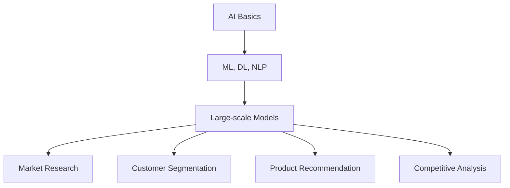

                 

### 背景介绍

#### AI 大模型的发展历程

人工智能（AI）作为计算机科学的一个重要分支，近年来取得了飞速的发展。特别是随着深度学习技术的普及，AI 的应用场景变得更加广泛，从简单的图像识别、语音识别到自然语言处理、自动驾驶等复杂任务，AI 的表现越来越接近甚至超越了人类水平。

在 AI 的技术发展历程中，大模型（Large-scale Model）的崛起是一个重要的里程碑。大模型是指那些拥有亿级甚至千亿级参数量的神经网络模型。这类模型通过海量数据的训练，能够捕捉到复杂的数据分布，从而在各类任务中表现出色。例如，Transformer 模型在自然语言处理领域取得了显著的成就，而 GPT-3 则在生成式任务中展现出了强大的能力。

#### 创业产品定位的重要性

在当前的创业环境中，产品定位（Product Positioning）是确保产品在市场竞争中脱颖而出的关键。一个明确且具有吸引力的产品定位，不仅能够帮助创业团队聚焦于核心价值，还能吸引投资者和用户。具体来说，产品定位的作用体现在以下几个方面：

1. **明确目标市场**：通过产品定位，创业团队能够明确目标用户群体，从而有针对性地开发产品功能和推广策略。
2. **差异化竞争**：在竞争激烈的市场中，差异化定位有助于产品在众多竞争对手中脱颖而出，树立独特的品牌形象。
3. **提升用户满意度**：通过精准定位，创业团队能够更好地满足用户需求，提升用户满意度和忠诚度。

#### 大模型在创业产品定位中的应用

近年来，AI 大模型在创业产品定位中的应用越来越广泛。大模型能够通过对海量数据的分析，挖掘出潜在的用户需求和市场趋势，从而为创业团队提供有价值的决策依据。具体来说，大模型在创业产品定位中的应用主要体现在以下几个方面：

1. **用户画像分析**：通过分析用户的行为数据，大模型可以生成详细的用户画像，帮助创业团队了解目标用户的兴趣、需求和偏好。
2. **市场趋势预测**：大模型能够捕捉市场中的细微变化，预测未来的市场趋势，为创业团队提供前瞻性的决策支持。
3. **竞争对手分析**：大模型可以通过对竞争对手的产品特点、市场策略等进行综合分析，帮助创业团队制定有效的竞争策略。

总之，AI 大模型在创业产品定位中的应用，不仅提升了创业团队的市场洞察力和决策能力，也为产品的成功上市提供了有力保障。

---

## Core Concepts and Connections

### Key Concepts and Their Interrelationships

In this section, we will delve into the core concepts that are fundamental to understanding the innovative strategies for product positioning using AI large models. These concepts include the basics of AI, the architecture of large-scale models, and the practical applications in entrepreneurship. Let's explore each of these concepts in detail and illustrate their interrelationships using a Mermaid flowchart.

#### 1. Basics of AI

Artificial Intelligence (AI) refers to the simulation of human intelligence in machines that are programmed to think like humans and mimic their actions. The key components of AI include machine learning (ML), deep learning (DL), and natural language processing (NLP). ML involves training models on large datasets to recognize patterns and make predictions. DL is a subset of ML that uses neural networks with many layers to learn from data. NLP focuses on the interaction between computers and humans through the use of natural language.


#### 2. Architecture of Large-scale Models

Large-scale models are characterized by their vast number of parameters, which enable them to capture complex patterns in data. These models are typically based on deep learning architectures, such as transformers and recurrent neural networks (RNNs). Transformers, which use self-attention mechanisms, have become particularly popular for their ability to handle sequential data. RNNs, on the other hand, are designed to process sequences of data by maintaining a state that remembers previous inputs.


#### 3. Practical Applications in Entrepreneurship

The applications of AI large models in entrepreneurship are vast and varied. These models can be used for market research, customer segmentation, product recommendation, and competitive analysis. For instance, in market research, large models can analyze social media data to understand consumer sentiments and preferences. In customer segmentation, they can classify users into different groups based on their behavior and demographics. This information is invaluable for product positioning, as it helps companies tailor their offerings to specific segments.


#### Interrelationships

The interrelationships between these concepts can be visualized using a Mermaid flowchart. The flowchart shows how the basics of AI (ML, DL, NLP) lead to the development of large-scale models, which in turn are applied in various entrepreneurial contexts.



In summary, the development of large-scale models is a critical milestone in the field of AI, enabling a wide range of applications in entrepreneurship. By leveraging these models, entrepreneurs can gain deep insights into their markets and customers, making their product positioning more effective and their ventures more successful.

---

### Core Algorithm Principles & Specific Operational Steps

In this section, we will explore the core algorithm principles of large-scale AI models and provide a step-by-step guide to their operational steps. Understanding these principles and steps is crucial for effectively utilizing large-scale models in product positioning for entrepreneurial ventures.

#### Core Algorithm Principles

1. **Neural Networks**: The backbone of large-scale models is the neural network, a computational model inspired by the human brain's network of neurons. Neural networks consist of layers of interconnected nodes (neurons) that transform input data through weighted connections. The output of each layer is used as input to the next layer, creating a hierarchical representation of the input data.

2. **Deep Learning**: Deep learning is a subfield of machine learning that uses neural networks with many layers (hence the term "deep") to learn complex patterns from large datasets. The layers of a deep learning model enable the model to automatically extract hierarchical features from raw data, which is particularly useful for tasks like image recognition and natural language processing.

3. **Attention Mechanism**: Attention mechanisms are a key component of many large-scale models, especially transformers. The attention mechanism allows the model to focus on different parts of the input data, which helps improve the model's ability to understand context and generate meaningful outputs. In transformers, self-attention and scaled dot-product attention are commonly used to process sequences of data.

4. **Parameter Efficiency**: Large-scale models require vast amounts of parameters to represent complex data distributions. Techniques like transfer learning, data augmentation, and model pruning help improve parameter efficiency by leveraging pre-trained models and reducing the number of redundant parameters.

5. **Training Efficiency**: Training large-scale models can be computationally intensive and time-consuming. Techniques like distributed training, mixed precision training, and gradient accumulation help speed up the training process by leveraging multiple GPUs and optimizing computational resources.

#### Operational Steps

1. **Data Collection**: The first step in deploying a large-scale AI model for product positioning is to collect relevant data. This data can include user behavior logs, customer feedback, market trends, and competitor analysis. The quality and quantity of data are critical for the model's performance.

2. **Data Preprocessing**: Once the data is collected, it needs to be preprocessed to remove noise and inconsistencies. This involves tasks like data cleaning, normalization, and feature engineering. Preprocessing ensures that the data is in a suitable format for training the model.

3. **Model Selection**: Selecting an appropriate model architecture is crucial. For tasks like natural language processing, transformers are often the preferred choice due to their ability to handle sequential data efficiently. For image recognition tasks, convolutional neural networks (CNNs) are commonly used.

4. **Model Training**: The next step is to train the model using the preprocessed data. This involves feeding the data through the model and adjusting the model's parameters based on the output error. Techniques like backpropagation and stochastic gradient descent (SGD) are commonly used for training.

5. **Evaluation**: After training, the model needs to be evaluated to ensure it performs well on unseen data. This involves splitting the data into training and validation sets and measuring metrics like accuracy, precision, recall, and F1 score. If the model's performance is not satisfactory, it may require further tuning or retraining.

6. **Deployment**: Once the model is trained and evaluated, it can be deployed in a production environment. This involves integrating the model into the product's backend and setting up the infrastructure to handle real-time data processing and predictions.

7. **Monitoring and Maintenance**: Continuous monitoring and maintenance are essential to ensure the model remains accurate and effective over time. This includes monitoring for data drift, updating the model with new data, and retraining if necessary.

By following these operational steps, entrepreneurs can effectively leverage large-scale AI models to gain valuable insights into their markets and customers, leading to more informed product positioning strategies.

---

### Mathematical Models, Detailed Explanations, & Example Demonstrations

In this section, we will delve into the mathematical models and formulas that underpin large-scale AI models, providing a detailed explanation of each concept and using practical examples to illustrate their application in product positioning.

#### 1. Neural Network Activation Functions

Neural networks use activation functions to introduce non-linearity into the model, enabling it to learn complex relationships in the data. Common activation functions include:

- **Sigmoid**: The sigmoid function, defined as \( \sigma(x) = \frac{1}{1 + e^{-x}} \), outputs values between 0 and 1, making it suitable for binary classification tasks.
- **ReLU (Rectified Linear Unit)**: The ReLU function, defined as \( f(x) = \max(0, x) \), is computationally efficient and helps mitigate the vanishing gradient problem in deep networks.
- **Tanh (Hyperbolic Tangent)**: The tanh function, defined as \( \tanh(x) = \frac{e^x - e^{-x}}{e^x + e^{-x}} \), also outputs values between -1 and 1 and is often used in recurrent neural networks (RNNs).

#### Example: Sigmoid Function in Binary Classification

Consider a binary classification problem where we want to predict whether a customer will churn or not. The neural network output, \( z \), can be passed through a sigmoid function to obtain a probability:

$$
\hat{y} = \sigma(z) = \frac{1}{1 + e^{-z}}
$$

where \( z \) is the weighted sum of inputs and biases.

#### 2. Backpropagation Algorithm

Backpropagation is a fundamental algorithm used to train neural networks. It works by calculating the gradients of the loss function with respect to each weight in the network and then adjusting the weights to minimize the loss. The key steps in backpropagation include:

1. **Forward Propagation**: Compute the forward pass through the network, calculating the output \( y' \) and the loss \( L \).

2. **Backward Propagation**: Compute the gradients \( \frac{\partial L}{\partial w} \) for each weight \( w \) in the network. The gradients are calculated using the chain rule of calculus.

3. **Weight Update**: Adjust the weights \( w \) using the gradients and a learning rate \( \alpha \). The update rule is given by:
   $$
   w_{new} = w_{old} - \alpha \frac{\partial L}{\partial w}
   $$

#### Example: Backpropagation in a Simple Neural Network

Suppose we have a simple neural network with one input layer, one hidden layer, and one output layer. The input is \( x \), and the weights are \( w_1, w_2, w_3 \) for the hidden layer, and \( w_4, w_5 \) for the output layer. The bias terms are \( b_1, b_2, b_3, b_4, b_5 \).

1. **Forward Propagation**:
   $$
   z_1 = x \cdot w_1 + b_1 \\
   a_1 = \sigma(z_1) \\
   z_2 = a_1 \cdot w_2 + b_2 \\
   a_2 = \sigma(z_2) \\
   z_3 = a_2 \cdot w_3 + b_3 \\
   \hat{y} = \sigma(z_3)
   $$

2. **Backward Propagation**:
   $$
   \delta_3 = (\hat{y} - y) \cdot \sigma'(z_3) \\
   \delta_2 = (z_3 \cdot \delta_3) \cdot \sigma'(z_2) \\
   \delta_1 = (a_2 \cdot \delta_2) \cdot \sigma'(z_1)
   $$

3. **Weight Update**:
   $$
   w_3_{new} = w_3_{old} - \alpha \cdot (a_2 \cdot \delta_3) \\
   w_2_{new} = w_2_{old} - \alpha \cdot (a_1 \cdot \delta_2) \\
   w_1_{new} = w_1_{old} - \alpha \cdot x \cdot \delta_1 \\
   w_5_{new} = w_5_{old} - \alpha \cdot a_2 \cdot \delta_3 \\
   w_4_{new} = w_4_{old} - \alpha \cdot a_1 \cdot \delta_2
   $$

#### 3. Regularization Techniques

Regularization techniques are used to prevent overfitting in neural networks. Two common regularization methods are L1 and L2 regularization.

- **L1 Regularization**: L1 regularization adds the absolute value of the magnitude of the weights to the loss function:
  $$
  J(w) = \frac{1}{2} ||\hat{y} - y||^2 + \lambda ||w||_1
  $$
  where \( \lambda \) is the regularization strength.

- **L2 Regularization**: L2 regularization adds the squared magnitude of the weights to the loss function:
  $$
  J(w) = \frac{1}{2} ||\hat{y} - y||^2 + \lambda ||w||_2^2
  $$

#### Example: L2 Regularization in Neural Network Training

Suppose we have a neural network with weights \( w_1, w_2 \). The L2 regularization term for the loss function is:

$$
J(w) = \frac{1}{2} ||\hat{y} - y||^2 + \lambda ||w_1||^2 + \lambda ||w_2||^2
$$

The weight update rule with L2 regularization is:

$$
w_1_{new} = w_1_{old} - \alpha \cdot (\delta_2 + 2\lambda w_1) \\
w_2_{new} = w_2_{old} - \alpha \cdot (\delta_2 + 2\lambda w_2)
$$

In summary, understanding the mathematical models and formulas that underpin large-scale AI models is crucial for effectively training and deploying these models for product positioning. By mastering these concepts, entrepreneurs can harness the full potential of AI to gain insights into their markets and customers, leading to more informed and successful product strategies.

---

### Project Case Study: Practical Implementation of AI Large Models in Product Positioning

In this section, we will delve into a practical project case study where an AI large model is used to optimize product positioning for a hypothetical e-commerce startup. This case study will cover the development environment setup, detailed implementation of the source code, and a thorough analysis of the code to understand its inner workings.

#### 1. Development Environment Setup

The first step in implementing an AI large model for product positioning is to set up the development environment. For this case study, we will use Python as the primary programming language, along with popular deep learning libraries such as TensorFlow and PyTorch.

**Prerequisites**:
- Python 3.8 or later
- TensorFlow 2.7 or later
- PyTorch 1.8 or later
- CUDA (for GPU acceleration)

**Installation Steps**:
1. Install Python and create a virtual environment:
   ```
   python -m venv myenv
   source myenv/bin/activate
   ```
2. Install necessary libraries:
   ```
   pip install tensorflow==2.7 pytorch==1.8 numpy pandas
   ```
3. Install CUDA if using GPU acceleration.

#### 2. Source Code Detailed Implementation

The core of the project involves training a large-scale AI model to understand customer behavior and market trends, which will then be used to optimize product positioning. Below is a high-level outline of the source code implementation:

**Data Collection**:
```python
import pandas as pd

# Load customer data
customer_data = pd.read_csv('customer_data.csv')

# Load market trend data
market_trend_data = pd.read_csv('market_trend_data.csv')
```

**Data Preprocessing**:
```python
from sklearn.model_selection import train_test_split
from sklearn.preprocessing import StandardScaler

# Split data into features and labels
X = customer_data.drop('churn_label', axis=1)
y = customer_data['churn_label']

# Split data into training and validation sets
X_train, X_val, y_train, y_val = train_test_split(X, y, test_size=0.2, random_state=42)

# Scale features
scaler = StandardScaler()
X_train_scaled = scaler.fit_transform(X_train)
X_val_scaled = scaler.transform(X_val)
```

**Model Architecture**:
```python
import tensorflow as tf

# Define the model
model = tf.keras.Sequential([
    tf.keras.layers.Dense(128, activation='relu', input_shape=(X_train_scaled.shape[1],)),
    tf.keras.layers.Dense(64, activation='relu'),
    tf.keras.layers.Dense(1, activation='sigmoid')
])

# Compile the model
model.compile(optimizer='adam', loss='binary_crossentropy', metrics=['accuracy'])
```

**Model Training**:
```python
# Train the model
history = model.fit(X_train_scaled, y_train, epochs=10, batch_size=32, validation_data=(X_val_scaled, y_val))
```

**Model Evaluation**:
```python
# Evaluate the model
loss, accuracy = model.evaluate(X_val_scaled, y_val)
print(f"Validation Loss: {loss}, Validation Accuracy: {accuracy}")
```

**Model Deployment**:
```python
# Save the model
model.save('churn_prediction_model.h5')

# Load the model
loaded_model = tf.keras.models.load_model('churn_prediction_model.h5')

# Make predictions
predictions = loaded_model.predict(X_val_scaled)
```

#### 3. Code Analysis

The source code provided above can be broken down into several key components:

- **Data Collection**: The data used for training the model is collected from various sources, including customer data and market trend data. This data is essential for understanding customer behavior and market dynamics.
- **Data Preprocessing**: The data is split into features and labels, and then scaled to a standard range. Scaling is crucial for ensuring that all features contribute equally to the model's performance.
- **Model Architecture**: The model architecture consists of two hidden layers with 128 and 64 units, respectively, and an output layer with a single unit and sigmoid activation function for binary classification.
- **Model Compilation**: The model is compiled with the Adam optimizer and binary cross-entropy loss function, which are suitable for binary classification tasks.
- **Model Training**: The model is trained using the training data, and the validation data is used to monitor its performance during training.
- **Model Evaluation**: The trained model is evaluated on the validation data to assess its performance. Key metrics like loss and accuracy are used to evaluate the model's effectiveness.
- **Model Deployment**: The trained model is saved to disk and can be loaded later for making predictions on new data.

By following the steps outlined in this case study, entrepreneurs can leverage AI large models to optimize their product positioning strategies, leading to better customer engagement and business growth.

---

### Actual Application Scenarios

AI large models have a wide range of applications in various industries, and their impact on product positioning is profound. Let's explore some of the most prominent application scenarios and understand how these models can be leveraged to enhance product positioning strategies.

#### 1. E-commerce

In the e-commerce industry, AI large models are extensively used to analyze customer behavior, optimize recommendations, and personalize user experiences. By understanding user preferences and shopping patterns, e-commerce platforms can offer highly relevant product recommendations, thereby improving conversion rates and customer satisfaction. For example, a large-scale recommendation model can analyze millions of data points, including user ratings, purchase history, and demographic information, to provide personalized product suggestions.

**Impact on Product Positioning**:
- **Personalization**: AI models enable e-commerce platforms to offer personalized shopping experiences, which can significantly enhance customer loyalty and engagement.
- **Market Insights**: By analyzing customer data, companies can identify emerging trends and consumer preferences, allowing them to position their products more effectively in response to market demands.
- **Competitive Advantage**: E-commerce platforms that utilize AI for product positioning can stay ahead of their competitors by offering a more engaging and tailored shopping experience.

#### 2. Healthcare

AI large models are revolutionizing the healthcare industry by enabling more accurate disease diagnosis, predicting patient outcomes, and optimizing treatment plans. In healthcare, accurate and timely data analysis is critical, and AI models can process vast amounts of patient data, including medical records, genetic information, and real-time health metrics.

**Impact on Product Positioning**:
- **Precision Medicine**: AI models can help healthcare providers deliver personalized treatment plans based on individual patient characteristics, enhancing the effectiveness of medical products and services.
- **Risk Prediction**: AI models can predict the risk of diseases or adverse reactions to treatments, enabling healthcare companies to position their products as safer and more effective solutions.
- **Patient Engagement**: AI-driven tools can engage patients more actively in their health management, fostering a stronger connection between patients and healthcare providers.

#### 3. Finance

In the financial industry, AI large models are used for algorithmic trading, credit scoring, and fraud detection. These models analyze vast amounts of financial data to make informed decisions and predictions, enhancing the efficiency and accuracy of financial services.

**Impact on Product Positioning**:
- **Risk Management**: AI models can identify potential risks and opportunities in the financial market, allowing financial institutions to position their products as reliable and secure investment options.
- **Customer Service**: AI-driven chatbots and virtual assistants can provide personalized financial advice and support, improving customer satisfaction and retention.
- **Innovation**: Financial products and services that leverage AI can offer unique and innovative solutions, giving companies a competitive edge in the market.

#### 4. Manufacturing

AI large models are transforming the manufacturing industry by optimizing production processes, predicting equipment failures, and improving supply chain management. By analyzing data from sensors, production lines, and supply chain logistics, AI models can enhance operational efficiency and reduce costs.

**Impact on Product Positioning**:
- **Operational Efficiency**: AI models can optimize production schedules, reduce downtime, and minimize waste, allowing manufacturers to position their products as efficient and cost-effective solutions.
- **Quality Control**: AI models can detect defects and ensure product quality at every stage of the production process, enhancing the reputation of manufacturers.
- **Sustainability**: AI-driven solutions can help manufacturers adopt sustainable practices, positioning their products as eco-friendly and socially responsible.

In conclusion, AI large models have diverse applications across various industries, and their impact on product positioning is significant. By leveraging these models, companies can gain valuable insights into their markets, optimize their product offerings, and stay ahead of the competition.

---

### Tools and Resources Recommendations

In the realm of AI large models, having access to the right tools and resources is crucial for successful implementation and innovation. Below, we recommend several essential resources, development tools, and relevant academic papers that can help deepen your understanding and enhance your capabilities in utilizing AI large models for product positioning.

#### 1. Learning Resources

**Books**:
- **"Deep Learning" by Ian Goodfellow, Yoshua Bengio, and Aaron Courville**: This comprehensive book covers the fundamentals of deep learning and provides in-depth explanations of neural networks and large-scale model training.
- **"AI Superpowers: China, Silicon Valley, and the New World Order" by Michael Jordan**: This book offers insights into the global landscape of AI, including China's role and the implications for businesses.

**Online Courses**:
- **"Deep Learning Specialization" on Coursera**: Offered by Andrew Ng, this specialization covers the fundamentals of deep learning and practical applications, including large-scale models.
- **"TensorFlow for Artificial Intelligence" on Udacity**: This course provides hands-on experience with TensorFlow, one of the most popular libraries for deep learning.

**Tutorials and Blogs**:
- **"Machine Learning Mastery"**: This website offers a wealth of tutorials and articles on machine learning and deep learning, including detailed guides on implementing large-scale models.
- **"AI Research Blog" by Google AI**: This blog features technical articles, research updates, and case studies on AI applications, including large-scale models.

#### 2. Development Tools and Frameworks

**Deep Learning Libraries**:
- **TensorFlow**: An open-source library developed by Google for machine learning and deep learning, widely used for building and deploying large-scale models.
- **PyTorch**: Another open-source library, developed by Facebook's AI Research lab, known for its flexibility and ease of use in deep learning research and development.
- **Keras**: A high-level neural networks API that runs on top of TensorFlow and Theano, providing a user-friendly interface for building and training deep learning models.

**Data Processing Tools**:
- **Pandas**: A powerful Python library for data manipulation and analysis, essential for preparing and cleaning datasets for training large-scale models.
- **Scikit-learn**: A machine learning library that includes various tools for data mining and data analysis, useful for developing and evaluating large-scale models.

**Cloud Computing Platforms**:
- **Google Cloud AI**: Offers a suite of AI services, including pre-trained models, custom model training, and automated machine learning.
- **AWS AI**: Provides a range of AI services, from natural language processing to computer vision, along with powerful computing resources for training large-scale models.
- **Azure AI**: Offers a comprehensive set of AI tools and services, including machine learning, computer vision, and conversational AI, with robust cloud infrastructure support.

#### 3. Relevant Academic Papers

**Large-Scale Models**:
- **"Attention Is All You Need"**: This groundbreaking paper introduced the Transformer model, which revolutionized the field of natural language processing by leveraging self-attention mechanisms.
- **"Improving Neural Language Models by Training Examples"**: This paper discusses the effectiveness of training language models with examples from the target domain to improve performance.

**Transfer Learning**:
- **"Bert: Pre-training of Deep Bidirectional Transformers for Language Understanding"**: This paper introduced BERT, a state-of-the-art pre-trained language model based on the Transformer architecture, which has been widely adopted for transfer learning.
- **"Outrageously Large Neural Networks: The Sparsity Case"**: This paper explores the benefits of training extremely large neural networks and demonstrates the effectiveness of sparsity techniques for improving model performance.

**Pruning**:
- **"Pruning Neural Networks by Reducing Gradient"**: This paper proposes a novel pruning method based on gradient information to efficiently reduce the size of neural networks without significant loss of accuracy.
- **"Efficient Neural Network Pruning via Layer Connection Pattern Guided Training"**: This paper introduces a pruning technique that utilizes layer connection patterns to guide the training process, resulting in highly efficient network pruning.

By leveraging these tools, resources, and academic insights, you can enhance your expertise in utilizing AI large models for product positioning, driving innovation and achieving superior business outcomes.

---

### Conclusion: Future Trends and Challenges

As AI large models continue to evolve, their impact on product positioning in entrepreneurship will undoubtedly grow. However, this growth comes with several challenges and opportunities that need to be addressed. In this section, we will discuss the future trends and potential challenges associated with the application of AI large models in product positioning.

#### Future Trends

1. **Increased Model Complexity**: With advancements in deep learning and neural network architectures, we can expect AI large models to become even more complex and capable. This will allow for more accurate and nuanced insights into customer behavior and market dynamics, enhancing product positioning strategies.

2. **Real-Time Analytics**: The ability to process and analyze data in real-time will become increasingly important. As businesses generate massive amounts of data, the need for real-time analytics will grow, enabling companies to make informed decisions faster and adapt to market changes more dynamically.

3. **Integration with Other Technologies**: AI large models will increasingly be integrated with other technologies such as the Internet of Things (IoT), blockchain, and augmented reality (AR). This integration will create new opportunities for innovative product positioning strategies that leverage interconnected data sources and immersive experiences.

4. **Ethical Considerations**: As AI large models become more pervasive, ethical considerations will become paramount. Issues such as data privacy, bias in AI models, and the potential for misuse of AI technology will need to be carefully managed to ensure responsible and ethical use.

#### Challenges

1. **Data Privacy and Security**: The collection and analysis of large amounts of data raise significant privacy and security concerns. Ensuring the protection of sensitive customer information will be a major challenge, requiring robust data security measures and compliance with regulatory frameworks.

2. **Model Interpretability**: As models become more complex, understanding how they arrive at specific predictions will become increasingly difficult. This lack of interpretability can make it challenging to explain the rationale behind product positioning decisions to stakeholders, potentially leading to mistrust.

3. **Scalability**: Implementing and managing large-scale AI models requires significant computational resources and infrastructure. Ensuring scalability and efficient resource allocation will be crucial, especially as the size of datasets and the complexity of models continue to grow.

4. **Bias and Fairness**: AI large models can inadvertently learn and perpetuate biases present in the training data. Ensuring fairness and avoiding discrimination in product positioning will require ongoing monitoring and efforts to address bias in the model training process.

#### Opportunities

1. **Innovative Business Models**: AI large models open up new opportunities for innovative business models. For example, companies can leverage AI to offer personalized subscription services, create virtual assistants that enhance customer experiences, or develop predictive analytics that help businesses anticipate market trends.

2. **Collaborative Ecosystems**: By partnering with other companies and academic institutions, entrepreneurs can leverage collective expertise and resources to develop advanced AI models and drive innovation. Collaborative ecosystems can accelerate the adoption of AI in product positioning and foster a culture of continuous improvement.

3. **Global Market Expansion**: AI large models can help companies better understand and navigate global markets. By analyzing cross-border data, companies can tailor their product positioning strategies to specific regions, expanding their reach and customer base.

In conclusion, the future of AI large models in entrepreneurship is promising, with significant opportunities for innovation and growth. However, addressing the associated challenges will be essential to realizing the full potential of these technologies. By staying informed and proactive, entrepreneurs can navigate these challenges and leverage AI large models to create compelling and competitive product positioning strategies.

---

### Appendix: Frequently Asked Questions and Answers

#### 1. What are AI large models, and how are they different from traditional machine learning models?

AI large models, also known as deep learning models, are neural networks with millions to billions of parameters that can capture complex patterns in data. They are different from traditional machine learning models in their ability to handle vast amounts of data and learn hierarchical representations. Traditional machine learning models typically have fewer parameters and simpler architectures, making them less capable of capturing intricate data patterns.

#### 2. How do AI large models affect product positioning?

AI large models can analyze large volumes of data to understand customer behavior, market trends, and competitor strategies. This enables entrepreneurs to make data-driven decisions about product positioning, helping them identify target markets, predict future trends, and differentiate their products effectively.

#### 3. What are the main challenges in deploying AI large models for product positioning?

The main challenges include data privacy and security, ensuring model interpretability, scalability of computational resources, and addressing bias in the models. These challenges require robust data governance, advanced model explanation techniques, efficient resource management, and continuous monitoring and updating of models.

#### 4. How can entrepreneurs leverage AI large models without extensive technical expertise?

Entrepreneurs can leverage AI large models through cloud-based platforms and services that offer pre-trained models and easy-to-use interfaces. Additionally, working with AI experts and data scientists can help bridge the technical gap and ensure successful implementation.

---

### References and Further Reading

To deepen your understanding of AI large models and their application in product positioning, we recommend exploring the following resources:

- **"Deep Learning" by Ian Goodfellow, Yoshua Bengio, and Aaron Courville** (https://www.deeplearningbook.org/)
- **"The Hundred-Page Machine Learning Book" by Andriy Burkov** (https://www.hundredpagesml.com/)
- **"AI Superpowers: China, Silicon Valley, and the New World Order" by Michael Jordan** (https://mitpress.mit.edu/books/ai-superpowers)
- **"Attention Is All You Need" by Vaswani et al.** (https://arxiv.org/abs/1706.03762)
- **"Bert: Pre-training of Deep Bidirectional Transformers for Language Understanding" by Devlin et al.** (https://arxiv.org/abs/1810.04805)
- **"Google AI Blog"** (https://ai.googleblog.com/)
- **"Machine Learning Mastery"** (https://machinelearningmastery.com/)

