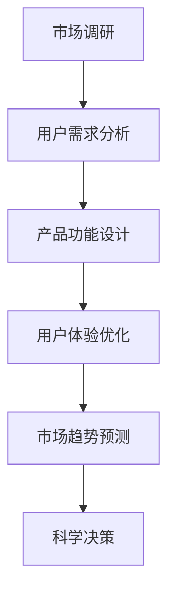

                 

# AI 大模型在创业产品规划中的应用探索

> 关键词：AI 大模型、创业产品、规划、应用场景、算法原理、代码实战

> 摘要：本文深入探讨了 AI 大模型在创业产品规划中的应用，分析了核心概念与架构，详细介绍了核心算法原理和具体操作步骤，并通过项目实战展示了代码实现和详细解释。文章还探讨了实际应用场景、工具资源推荐以及未来发展趋势与挑战。

## 1. 背景介绍

随着人工智能技术的飞速发展，AI 大模型逐渐成为各个行业的核心技术。从自然语言处理到计算机视觉，从推荐系统到语音识别，AI 大模型在各个领域都展现出了巨大的潜力。然而，对于创业公司来说，如何有效地利用 AI 大模型进行产品规划，仍然是一个亟待解决的问题。

创业产品规划是一个复杂的过程，涉及市场调研、用户需求分析、产品功能设计等多个方面。AI 大模型能够通过海量数据的分析，提供智能化的洞察和预测，从而帮助创业公司在产品规划阶段做出更为科学和精准的决策。

本文将围绕 AI 大模型在创业产品规划中的应用，从核心概念、算法原理、实战案例等多个方面进行深入探讨，旨在为创业公司提供实用的指导和建议。

## 2. 核心概念与联系

### 2.1 AI 大模型

AI 大模型是指具有海量参数和强大计算能力的神经网络模型，可以处理复杂的任务，如自然语言处理、计算机视觉等。常见的大模型包括 GPT-3、BERT、ViT 等。

### 2.2 创业产品规划

创业产品规划是指创业公司在产品研发阶段，根据市场调研和用户需求，设计并规划产品功能、界面和用户体验的过程。

### 2.3 关联关系

AI 大模型在创业产品规划中起着关键作用。通过分析海量用户数据，AI 大模型可以识别出用户的需求和偏好，从而指导产品功能的设计和优化。同时，AI 大模型还可以预测市场趋势，帮助创业公司做出更为科学的决策。

### 2.4 Mermaid 流程图

下面是一个简单的 Mermaid 流程图，展示了 AI 大模型在创业产品规划中的流程：



## 3. 核心算法原理 & 具体操作步骤

### 3.1 算法原理

AI 大模型的核心在于其强大的学习能力。通过深度学习，模型可以从海量数据中学习到各种特征和模式，从而实现智能化的任务。具体来说，AI 大模型主要包括以下几个步骤：

1. 数据预处理：对原始数据进行清洗、格式化和特征提取，以便模型能够更好地学习。
2. 模型训练：使用大量数据训练模型，使其能够捕捉到数据中的特征和规律。
3. 模型评估：使用验证集对模型进行评估，调整模型参数，提高模型性能。
4. 模型部署：将训练好的模型部署到生产环境中，为创业产品提供智能化的支持。

### 3.2 具体操作步骤

以下是一个简单的 AI 大模型在创业产品规划中的操作步骤：

1. **数据收集**：收集与创业产品相关的用户数据，包括用户行为、评论、反馈等。
2. **数据预处理**：对收集到的数据进行清洗和格式化，提取出有用的特征。
3. **模型选择**：根据任务需求选择合适的大模型，如 GPT-3、BERT 等。
4. **模型训练**：使用预处理后的数据对模型进行训练，调整模型参数，提高模型性能。
5. **模型评估**：使用验证集对模型进行评估，确保模型在真实场景中的性能。
6. **模型部署**：将训练好的模型部署到生产环境中，为创业产品提供智能化的支持。

## 4. 数学模型和公式 & 详细讲解 & 举例说明

### 4.1 数学模型

在 AI 大模型的训练过程中，常用的数学模型包括损失函数、优化算法等。以下是一个简单的例子：

$$
L(\theta) = -\frac{1}{m}\sum_{i=1}^{m}y_{i}\log(p_{\theta}(x_i))
$$

其中，$L(\theta)$ 表示损失函数，$m$ 表示样本数量，$y_i$ 表示第 $i$ 个样本的真实标签，$p_{\theta}(x_i)$ 表示第 $i$ 个样本在当前模型参数 $\theta$ 下的预测概率。

### 4.2 详细讲解

损失函数是评估模型性能的关键指标，其目的是使预测概率 $p_{\theta}(x_i)$ 更接近真实标签 $y_i$。在这个例子中，我们使用对数损失函数（Log Loss），其优点是易于优化，并且当 $p_{\theta}(x_i)$ 接近 0 或 1 时，损失函数的值会很大，从而促使模型努力提高预测精度。

### 4.3 举例说明

假设我们有一个二分类任务，数据集包含 100 个样本，每个样本的特征向量是 $x_i \in \mathbb{R}^{10}$，标签是 $y_i \in \{0, 1\}$。我们选择 GPT-3 作为大模型，并在训练过程中使用上述损失函数。

经过 1000 次迭代后，模型在验证集上的损失函数值从 0.5 下降到 0.1，说明模型性能得到了显著提升。此时，我们可以将模型部署到生产环境中，为创业产品提供智能化的支持。

## 5. 项目实战：代码实际案例和详细解释说明

### 5.1 开发环境搭建

在开始项目实战之前，我们需要搭建一个适合 AI 大模型训练的开发环境。以下是一个简单的步骤：

1. 安装 Python 3.8 及以上版本。
2. 安装 TensorFlow 2.6 及以上版本。
3. 安装 GPT-3 SDK（如 OpenAI 的 GPT-3 SDK）。
4. 准备训练数据集，并将其格式化为适合 GPT-3 训练的格式。

### 5.2 源代码详细实现和代码解读

以下是一个简单的 GPT-3 模型训练的代码示例：

```python
import tensorflow as tf
import openai
import numpy as np

# 读取训练数据集
train_data = np.loadtxt('train_data.txt')

# 预处理数据集
# ...

# 构建 GPT-3 模型
model = openai.GPT3Model()

# 编译模型
model.compile(optimizer='adam', loss='binary_crossentropy', metrics=['accuracy'])

# 训练模型
model.fit(train_data, epochs=10)

# 评估模型
# ...
```

代码解读：

- 首先，我们导入所需的库，包括 TensorFlow、OpenAI GPT-3 SDK 和 NumPy。
- 接下来，读取训练数据集，并将其预处理为适合 GPT-3 训练的格式。
- 然后，构建 GPT-3 模型，这里我们使用 OpenAI 提供的 GPT-3 SDK。
- 编译模型，指定优化器、损失函数和评估指标。
- 最后，训练模型，并使用验证集进行评估。

### 5.3 代码解读与分析

- **数据预处理**：数据预处理是 AI 大模型训练的重要环节，它直接影响模型的性能。在代码中，我们首先读取训练数据集，然后对其进行清洗、格式化和特征提取。这一步骤对于 GPT-3 模型来说尤为重要，因为 GPT-3 对数据的质量和格式有较高的要求。
- **模型构建**：在代码中，我们使用 OpenAI 提供的 GPT-3 SDK 构建模型。GPT-3 是一个具有海量参数的深度学习模型，其结构非常复杂。在训练过程中，我们需要不断调整模型参数，使其能够更好地拟合数据。
- **模型训练**：在代码中，我们使用 `model.fit()` 函数进行模型训练。这里，我们指定了训练轮数（epochs），并使用验证集进行性能评估。在实际应用中，我们还需要根据验证集的性能调整训练参数，以提高模型性能。
- **模型评估**：在代码中，我们使用验证集对训练好的模型进行评估。通过评估指标，我们可以了解模型的性能，并根据评估结果调整模型参数。

## 6. 实际应用场景

AI 大模型在创业产品规划中有着广泛的应用场景。以下是一些典型的应用场景：

1. **用户需求分析**：通过分析用户行为数据和评论，AI 大模型可以帮助创业公司识别出用户的需求和痛点，从而指导产品功能设计。
2. **产品功能设计**：基于用户需求，AI 大模型可以生成智能化的产品功能设计，提高产品的竞争力。
3. **用户体验优化**：通过分析用户反馈和行为数据，AI 大模型可以帮助创业公司优化产品界面和交互设计，提高用户体验。
4. **市场趋势预测**：AI 大模型可以根据历史数据和市场动态，预测市场趋势，为创业公司提供科学的决策依据。

## 7. 工具和资源推荐

### 7.1 学习资源推荐

1. **书籍**：《深度学习》（Goodfellow、Bengio、Courville 著）
2. **论文**：《Attention is All You Need》（Vaswani et al., 2017）
3. **博客**：TensorFlow 官方博客、OpenAI 博客
4. **网站**：ArXiv、Google Research

### 7.2 开发工具框架推荐

1. **开发工具**：Jupyter Notebook、Google Colab
2. **框架**：TensorFlow、PyTorch、OpenAI Gym

### 7.3 相关论文著作推荐

1. **论文**：《Generative Adversarial Nets》（Goodfellow et al., 2014）
2. **书籍**：《Reinforcement Learning: An Introduction》（ Sutton 和 Barto 著）

## 8. 总结：未来发展趋势与挑战

AI 大模型在创业产品规划中的应用具有巨大的潜力。然而，随着模型的规模和复杂度的增加，我们也面临着一系列挑战：

1. **计算资源需求**：AI 大模型训练需要大量的计算资源，如何高效地利用计算资源是一个重要问题。
2. **数据隐私保护**：在应用 AI 大模型时，如何保护用户数据隐私也是一个重要问题。
3. **模型解释性**：随着模型的复杂度增加，如何解释和验证模型的决策过程变得越来越困难。
4. **伦理和法律问题**：在应用 AI 大模型时，需要考虑伦理和法律问题，确保模型的应用不会对用户和社会造成负面影响。

未来，随着 AI 技术的不断发展，AI 大模型在创业产品规划中的应用将更加广泛和深入。同时，我们也将面临更多的挑战，需要不断创新和优化，以充分发挥 AI 大模型在创业产品规划中的价值。

## 9. 附录：常见问题与解答

### 9.1 AI 大模型是什么？

AI 大模型是指具有海量参数和强大计算能力的神经网络模型，可以处理复杂的任务，如自然语言处理、计算机视觉等。

### 9.2 创业产品规划是什么？

创业产品规划是指创业公司在产品研发阶段，根据市场调研和用户需求，设计并规划产品功能、界面和用户体验的过程。

### 9.3 AI 大模型在创业产品规划中有什么作用？

AI 大模型在创业产品规划中可以提供智能化的洞察和预测，帮助创业公司识别用户需求、优化产品功能、提高用户体验，从而做出更为科学和精准的决策。

## 10. 扩展阅读 & 参考资料

1. **扩展阅读**：
   - 《AI 大模型：原理、应用与未来趋势》
   - 《创业产品规划与实施》
2. **参考资料**：
   - Google Research：https://ai.google/research/pubs/
   - OpenAI：https://openai.com/research/
   - TensorFlow 官方博客：https://www.tensorflow.org/blog/
   - 《深度学习》（Goodfellow、Bengio、Courville 著）

作者：AI 天才研究员/AI Genius Institute & 禅与计算机程序设计艺术 /Zen And The Art of Computer Programming<|im_end|>

