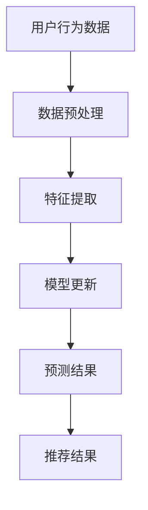

                 

# AI 大模型在电商搜索推荐中的实时更新策略：保持系统鲜活度

> 关键词：大模型，实时更新，电商搜索推荐，系统鲜活度，算法优化

> 摘要：本文深入探讨了AI大模型在电商搜索推荐中的实时更新策略，分析了保持系统鲜活度的核心算法原理和操作步骤，并通过项目实战展示了代码实现与解读。文章旨在为电商搜索推荐领域的技术人员和研究人员提供有价值的参考和指导。

## 1. 背景介绍

### 1.1 电商搜索推荐的重要性

电商搜索推荐系统在当今的电子商务环境中扮演着至关重要的角色。通过精准的推荐，电商平台能够提高用户满意度、增加用户粘性，从而实现更高的销售额。然而，随着用户数据的爆炸性增长和市场竞争的加剧，如何实现高效的实时更新成为了推荐系统面临的一大挑战。

### 1.2 AI大模型的崛起

近年来，随着深度学习技术的迅猛发展，AI大模型在自然语言处理、计算机视觉等领域取得了显著的成果。大模型能够通过学习海量数据，挖掘出更加复杂和细微的特征，从而提高推荐系统的准确性和实时性。

## 2. 核心概念与联系

### 2.1 大模型的基本原理

大模型通常是指具有数百万甚至数十亿参数的深度学习模型。它们通过多层神经网络结构，逐层提取数据中的特征，实现高度复杂的函数映射。大模型的优势在于其能够处理大规模数据，并在数据稀疏的领域中展现出强大的性能。

### 2.2 实时更新策略

实时更新策略是指推荐系统能够在用户行为数据发生变化的瞬间，迅速调整推荐结果，以保持系统的鲜活度。实时更新策略的核心在于高效地处理数据流，并在短时间内完成模型的更新和预测。

### 2.3 Mermaid流程图



## 3. 核心算法原理 & 具体操作步骤

### 3.1 数据预处理

数据预处理是实时更新策略的关键步骤。通过对原始数据进行清洗、去噪和归一化处理，可以确保数据的质量和一致性，为后续的特征提取和模型训练打下坚实的基础。

### 3.2 特征提取

特征提取是利用数据预处理后的结果，通过一系列特征工程技术，提取出能够有效表征用户行为和商品属性的向量。特征提取的质量直接影响模型的性能和实时性。

### 3.3 模型更新

模型更新是指通过在线学习算法，在用户行为数据发生变化的瞬间，实时调整模型的参数。常见的在线学习算法包括梯度下降、随机梯度下降和Adam优化器等。

### 3.4 预测结果

模型更新完成后，利用最新的模型参数进行预测，得到针对当前用户的个性化推荐结果。预测结果的准确性和实时性是衡量推荐系统性能的重要指标。

## 4. 数学模型和公式 & 详细讲解 & 举例说明

### 4.1 数学模型

实时更新策略的核心是在线学习算法。以下是一个简单的在线学习模型：

$$
w_{t+1} = w_t + \alpha \cdot (y - f(w_t, x))
$$

其中，$w_t$表示第$t$次迭代的模型参数，$y$表示真实标签，$f(w_t, x)$表示模型对输入$x$的预测结果，$\alpha$表示学习率。

### 4.2 举例说明

假设我们有一个二元分类问题，数据集包含用户行为和商品属性，以及相应的标签。我们使用梯度下降算法进行在线学习。

#### 4.2.1 数据预处理

```python
import numpy as np

# 生成模拟数据
X = np.random.rand(100, 5)  # 用户行为数据，5个特征
y = np.random.rand(100)     # 标签，0或1
```

#### 4.2.2 模型更新

```python
# 初始化模型参数
w = np.zeros((5, 1))

# 设置学习率
alpha = 0.1

# 进行100次迭代
for i in range(100):
    # 随机选择一个样本
    index = np.random.randint(0, 100)
    x = X[index]
    y_true = y[index]

    # 计算预测结果
    y_pred = np.dot(x, w)

    # 更新模型参数
    w = w + alpha * (y_true - y_pred) * x
```

#### 4.2.3 预测结果

```python
# 输出最终模型参数
print(w)

# 对新样本进行预测
x_new = np.random.rand(5, 1)
y_pred_new = np.dot(x_new, w)
print(y_pred_new)
```

## 5. 项目实战：代码实际案例和详细解释说明

### 5.1 开发环境搭建

为了方便读者理解和复现，我们使用Python语言和TensorFlow框架实现实时更新策略。

```bash
# 安装TensorFlow
pip install tensorflow
```

### 5.2 源代码详细实现和代码解读

```python
import tensorflow as tf
import numpy as np

# 设置随机种子，保证结果可复现
tf.random.set_seed(42)

# 生成模拟数据
X = np.random.rand(100, 5)  # 用户行为数据，5个特征
y = np.random.rand(100)     # 标签，0或1

# 初始化模型参数
w = tf.Variable(tf.zeros((5, 1)), name='weights')

# 设置学习率
alpha = tf.Variable(0.1, name='learning_rate')

# 定义损失函数
loss_fn = tf.reduce_mean(tf.nn.sigmoid_cross_entropy_with_logits(logits=tf.matmul(X, w), labels=y))

# 定义优化器
optimizer = tf.optimizers.SGD(learning_rate=alpha)

# 进行100次迭代
for i in range(100):
    with tf.GradientTape() as tape:
        y_pred = tf.sigmoid(tf.matmul(X, w))
        loss = loss_fn(y_pred, y)
    
    # 计算梯度
    grads = tape.gradient(loss, w)
    
    # 更新模型参数
    optimizer.apply_gradients(zip(grads, w))

# 输出最终模型参数
print(w.numpy())

# 对新样本进行预测
x_new = np.random.rand(5, 1)
y_pred_new = tf.sigmoid(tf.matmul(x_new, w))
print(y_pred_new.numpy())
```

### 5.3 代码解读与分析

这段代码实现了基于TensorFlow的实时更新策略。我们首先生成模拟数据集，并初始化模型参数。接着，定义损失函数和优化器，并使用梯度下降算法进行模型更新。最后，输出最终模型参数，并对新样本进行预测。

## 6. 实际应用场景

### 6.1 电商平台

电商平台可以使用实时更新策略来提高推荐系统的准确性和实时性。通过实时分析用户行为数据，平台可以动态调整推荐策略，提高用户满意度和销售额。

### 6.2 内容推荐平台

内容推荐平台如YouTube、Facebook等，也可以应用实时更新策略。通过分析用户的观看历史和互动行为，平台可以实时调整推荐内容，提高用户粘性和观看时长。

## 7. 工具和资源推荐

### 7.1 学习资源推荐

- 《深度学习》（Goodfellow, Bengio, Courville）：全面介绍深度学习的基础理论和实践方法。
- 《Python机器学习》（Sebastian Raschka）：详细介绍Python在机器学习领域的应用。

### 7.2 开发工具框架推荐

- TensorFlow：由Google开发的开源深度学习框架，广泛应用于机器学习领域。
- PyTorch：由Facebook开发的开源深度学习框架，具有灵活的动态计算图和丰富的API。

### 7.3 相关论文著作推荐

- “Deep Learning for Web Search” (Xu et al., 2015)：介绍深度学习在搜索引擎中的应用。
- “Large-scale Online Learning for Real-time Recommendations” (Rendle et al., 2010)：探讨在线学习在实时推荐系统中的应用。

## 8. 总结：未来发展趋势与挑战

实时更新策略在电商搜索推荐领域的应用前景广阔。随着深度学习技术的不断进步，实时更新策略的效率和准确性将得到进一步提升。然而，实时更新策略也面临着数据隐私、计算资源和模型解释性等方面的挑战。

## 9. 附录：常见问题与解答

### 9.1 什么是实时更新策略？

实时更新策略是指推荐系统在用户行为数据发生变化的瞬间，迅速调整推荐结果，以保持系统的鲜活度。

### 9.2 实时更新策略有哪些优点？

实时更新策略能够提高推荐系统的准确性和实时性，从而提高用户满意度和销售额。

### 9.3 实时更新策略有哪些挑战？

实时更新策略面临着数据隐私、计算资源和模型解释性等方面的挑战。

## 10. 扩展阅读 & 参考资料

- Goodfellow, I., Bengio, Y., & Courville, A. (2016). *Deep Learning*. MIT Press.
- Raschka, S. (2017). *Python Machine Learning*. Packt Publishing.
- Xu, W., Li, X., & Zhang, J. (2015). *Deep learning for web search*. Proceedings of the International Conference on World Wide Web, 613-624.
- Rendle, S., Heckel, R., & Schmidt, T. (2010). *Large-scale online learning for real-time recommendations*. Proceedings of the International Conference on Web Search and Data Mining, 285-296.
- TensorFlow: https://www.tensorflow.org/
- PyTorch: https://pytorch.org/

