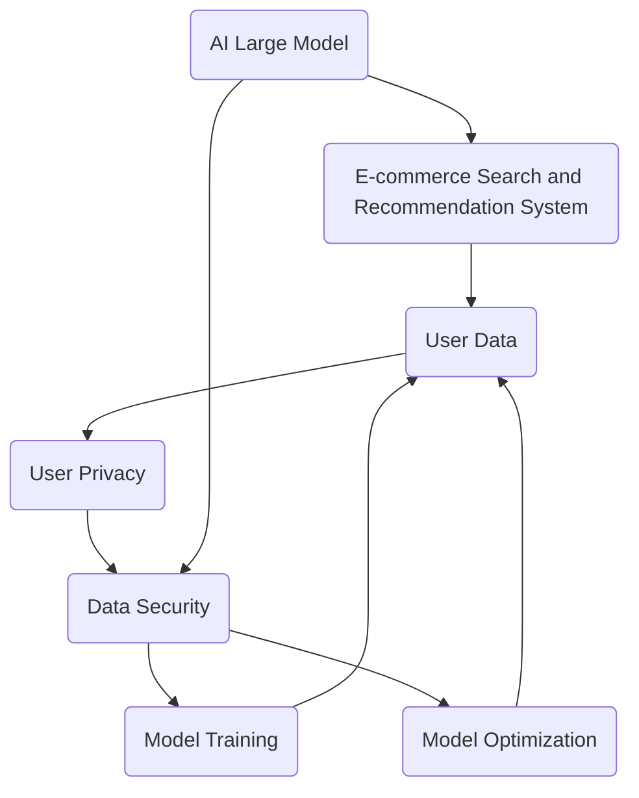

                 

### 1. 背景介绍

在当今信息化社会中，电子商务已经成为了人们日常生活和工作中不可或缺的一部分。随着互联网技术的迅猛发展，电商平台的数据量呈现爆发式增长，这不仅带来了商业价值的提升，同时也对数据安全提出了新的挑战。在众多电商应用中，搜索推荐系统是提升用户体验、增加用户粘性、提高销售额的关键环节。

近年来，AI 大模型在电商搜索推荐领域取得了显著的进展。大模型通过深度学习技术，可以自动从海量数据中提取特征，为用户提供个性化推荐。然而，AI 大模型的引入也带来了一些安全隐患，特别是数据安全和用户隐私保护方面。如何在利用 AI 大模型提升搜索推荐效果的同时，确保用户数据的安全和隐私，成为了电商企业亟待解决的重要问题。

本篇文章将围绕 AI 大模型在电商搜索推荐中的数据安全策略进行探讨，旨在为电商企业提供一套切实可行的数据安全解决方案。文章将首先介绍 AI 大模型在电商搜索推荐中的应用现状，然后深入分析大模型中存在的数据安全挑战，并探讨相应的解决方案。此外，文章还将提供一些实用的工具和资源推荐，帮助电商企业更好地保障数据安全和用户隐私。

总的来说，本文将从以下几个方面展开：

1. **AI 大模型在电商搜索推荐中的应用现状**
   - 介绍 AI 大模型在电商搜索推荐中的主要应用场景
   - 分析大模型对电商搜索推荐效果的提升

2. **AI 大模型在数据安全方面的挑战**
   - 讨论大模型在数据处理过程中可能引发的数据安全问题
   - 分析数据安全问题对电商企业的影响

3. **AI 大模型在数据安全方面的解决方案**
   - 探讨如何在确保数据安全和用户隐私的前提下，利用 AI 大模型提升搜索推荐效果
   - 提出具体的策略和措施

4. **工具和资源推荐**
   - 推荐一些实用的工具和资源，帮助电商企业更好地保障数据安全和用户隐私

通过本文的讨论，我们希望能够为电商企业在数据安全方面提供一些有益的启示和指导，从而在充分利用 AI 大模型技术提升搜索推荐效果的同时，确保用户数据的安全和隐私。

### 2. 核心概念与联系

在深入探讨 AI 大模型在电商搜索推荐中的数据安全策略之前，我们需要先了解一些核心概念，并分析它们之间的联系。以下是一些关键的概念和术语，以及它们在数据安全中的重要作用。

#### 2.1 AI 大模型

AI 大模型是指那些具有巨大参数量和复杂结构的深度学习模型。这些模型通常通过大规模数据训练，能够自动提取数据中的有用特征，并在各种任务中表现出色。在电商搜索推荐领域，AI 大模型通常用于用户行为分析、商品特征提取和个性化推荐。

#### 2.2 电商搜索推荐系统

电商搜索推荐系统是一种自动化的系统，用于根据用户的历史行为和偏好，为用户推荐相关的商品或服务。这类系统通常包含用户画像、商品画像和推荐算法等组成部分。

#### 2.3 数据安全

数据安全是指保护数据在存储、传输和处理过程中不受未经授权的访问、篡改或泄露。在电商搜索推荐系统中，数据安全尤为重要，因为涉及用户隐私信息和商业机密。

#### 2.4 用户隐私

用户隐私是指用户在使用电商服务过程中产生的个人信息的保护。这些信息可能包括用户行为记录、偏好设置、交易记录等。

#### 2.5 数据安全与用户隐私的联系

在 AI 大模型的应用中，数据安全和用户隐私密切相关。一方面，AI 大模型需要大量的用户数据来进行训练和优化，这可能会导致用户隐私泄露的风险。另一方面，保护用户隐私也是实现数据安全的重要手段之一。只有在保障用户隐私的前提下，用户才会更愿意分享自己的数据，从而有助于模型的训练和优化。

#### 2.6 关联性 Mermaid 流程图

为了更直观地展示上述概念之间的关联，我们可以使用 Mermaid 流程图来描述数据安全在 AI 大模型和电商搜索推荐系统中的重要性。



在这个流程图中，我们可以看到 AI 大模型与电商搜索推荐系统、用户数据、用户隐私和数据安全之间的紧密联系。数据安全不仅是保护用户隐私的必要手段，也是确保模型训练和优化顺利进行的重要保障。

通过深入理解这些核心概念及其联系，我们可以更好地理解 AI 大模型在电商搜索推荐中的数据安全挑战，并找到有效的解决方案。

### 3. 核心算法原理 & 具体操作步骤

AI 大模型在电商搜索推荐中的核心算法原理主要基于深度学习和机器学习技术，通过大规模数据训练和复杂模型架构，实现高精度的用户行为预测和商品推荐。以下是 AI 大模型在电商搜索推荐中的核心算法原理及具体操作步骤：

#### 3.1 深度学习与机器学习技术

深度学习是一种基于人工神经网络的机器学习技术，通过多层神经网络对数据进行自动特征提取和模式识别。在电商搜索推荐中，深度学习技术可以帮助模型从用户的购物历史、浏览记录、搜索行为等数据中提取出隐藏的偏好和特征，从而实现更精准的推荐。

机器学习技术则通过算法和模型对数据进行训练和优化，以实现对未知数据的预测和分类。在电商搜索推荐中，机器学习算法通过不断调整模型参数，使其能够更好地适应用户的需求和偏好，从而提高推荐效果。

#### 3.2 用户行为分析与特征提取

用户行为分析是电商搜索推荐系统的重要环节，通过对用户的购物行为、浏览行为、搜索行为等数据进行挖掘和分析，可以提取出用户的兴趣偏好和需求特征。具体操作步骤如下：

1. **数据收集**：从电商平台的后台系统中收集用户行为数据，包括用户的购物记录、浏览记录、搜索记录、点击记录等。

2. **数据预处理**：对收集到的数据进行清洗、去噪和格式化，确保数据的质量和一致性。

3. **特征提取**：通过统计分析和机器学习方法，从用户行为数据中提取出反映用户兴趣和需求的特征，如用户行为的热度、频率、时间分布等。

4. **特征归一化**：为了消除不同特征之间的量纲影响，通常需要对提取出的特征进行归一化处理。

5. **特征组合**：将多个特征组合成特征向量，用于后续的深度学习模型训练。

#### 3.3 深度学习模型训练

在用户行为特征提取后，我们需要利用深度学习模型对特征进行训练和优化。以下是深度学习模型训练的具体步骤：

1. **模型选择**：选择适合电商搜索推荐任务的深度学习模型，如卷积神经网络（CNN）、循环神经网络（RNN）、图神经网络（GNN）等。

2. **模型架构设计**：设计深度学习模型的网络结构，包括输入层、隐藏层和输出层。输入层负责接收用户行为特征，隐藏层用于特征提取和模式识别，输出层则生成推荐结果。

3. **模型训练**：使用大规模用户行为数据对模型进行训练，通过反向传播算法不断调整模型参数，使模型能够更好地拟合训练数据。

4. **模型验证**：在训练完成后，使用验证数据集对模型进行验证，评估模型的推荐效果和泛化能力。

5. **模型优化**：根据验证结果对模型进行调整和优化，以提高推荐精度和用户满意度。

#### 3.4 个性化推荐与实时更新

基于训练好的深度学习模型，我们可以为用户提供个性化的商品推荐。具体操作步骤如下：

1. **用户特征提取**：在用户进行搜索或浏览时，实时提取用户的行为特征，如关键词、商品点击记录等。

2. **模型预测**：使用训练好的深度学习模型对用户特征进行预测，生成个性化推荐列表。

3. **推荐结果展示**：将个性化推荐结果展示给用户，并实时更新推荐列表，以适应用户的行为变化。

4. **反馈收集与模型更新**：收集用户的反馈信息，如点击、购买等行为数据，用于更新模型参数和推荐算法，实现动态推荐。

通过以上步骤，AI 大模型可以实现对用户行为的精准分析和个性化推荐，从而提高电商搜索推荐的效果和用户体验。然而，在这个过程中，我们也需要关注数据安全和用户隐私保护的问题，确保在利用 AI 大模型提升搜索推荐效果的同时，保障用户数据的安全和隐私。

### 4. 数学模型和公式 & 详细讲解 & 举例说明

在 AI 大模型应用于电商搜索推荐的过程中，数学模型和公式扮演着至关重要的角色。它们不仅帮助我们理解和分析模型的工作原理，还可以指导我们进行模型优化和算法调整。以下将详细介绍相关的数学模型和公式，并通过具体例子来说明它们的应用。

#### 4.1 深度学习模型的基本数学公式

深度学习模型通常基于多层感知器（MLP）或卷积神经网络（CNN）等结构。以下是这些模型中常用的基本数学公式：

##### 4.1.1 前向传播

在深度学习模型的前向传播过程中，每个神经元（节点）的计算可以通过以下公式表示：

$$
Z_i = \sum_{j=1}^{n} w_{ij} * a_{j} + b_i
$$

其中，$Z_i$ 是第 $i$ 个神经元的输入，$w_{ij}$ 是第 $i$ 个神经元与第 $j$ 个神经元之间的权重，$a_{j}$ 是第 $j$ 个神经元的输出，$b_i$ 是第 $i$ 个神经元的偏置。

##### 4.1.2 激活函数

为了引入非线性特性，深度学习模型通常包含激活函数。常见的激活函数有：

$$
f(x) = \text{sigmoid}(x) = \frac{1}{1 + e^{-x}} \\
f(x) = \text{ReLU}(x) = \max(0, x) \\
f(x) = \text{tanh}(x) = \frac{e^x - e^{-x}}{e^x + e^{-x}}
$$

##### 4.1.3 反向传播

在反向传播过程中，模型通过计算误差梯度来调整权重和偏置。梯度计算公式如下：

$$
\frac{dC}{dw_{ij}} = \sum_{k} \frac{\partial Z_k}{\partial w_{ij}} * \frac{\partial C}{\partial Z_k}
$$

其中，$C$ 是模型的损失函数，$Z_k$ 是第 $k$ 个神经元的输出。

#### 4.2 用户行为特征提取的数学模型

在用户行为特征提取中，我们通常使用协方差矩阵、主成分分析（PCA）等方法来降低数据维度，提取关键特征。以下是这些方法的相关公式：

##### 4.2.1 协方差矩阵

协方差矩阵用于描述多变量数据的线性依赖关系。协方差矩阵的计算公式为：

$$
\text{Cov}(X, Y) = E[(X - \mu_X)(Y - \mu_Y)] \\
\text{Cov}(X) = \text{Var}(X) = E[(X - \mu_X)^2]
$$

其中，$X$ 和 $Y$ 是两个随机变量，$\mu_X$ 和 $\mu_Y$ 分别是它们的期望。

##### 4.2.2 主成分分析（PCA）

PCA 是一种常用的降维方法，通过保留主要成分来简化数据。主要成分的提取公式如下：

$$
\text{U} = \text{ eigenvalues } \times \text{ eigenvectors }
$$

其中，$\text{U}$ 是协方差矩阵的特征向量矩阵，其对角线元素是协方差矩阵的特征值。

#### 4.3 个性化推荐算法的数学模型

个性化推荐算法通常使用矩阵分解、协同过滤等方法来实现。以下是这些方法的基本公式：

##### 4.3.1 矩阵分解

矩阵分解是一种常用的推荐算法，通过将用户行为矩阵分解为用户特征矩阵和商品特征矩阵来实现推荐。矩阵分解的公式如下：

$$
R = U \times V^T
$$

其中，$R$ 是用户行为矩阵，$U$ 是用户特征矩阵，$V$ 是商品特征矩阵。

##### 4.3.2 协同过滤

协同过滤算法通过计算用户之间的相似度来生成推荐列表。协同过滤的基本公式如下：

$$
\text{similarity}(u, v) = \frac{\text{dot product}(r_u, r_v)}{\text{L2 norm}(r_u) \times \text{L2 norm}(r_v)}
$$

其中，$r_u$ 和 $r_v$ 分别是用户 $u$ 和用户 $v$ 的评分向量。

#### 4.4 实例说明

假设我们有一个用户行为矩阵 $R$，其中包含用户对商品的评分数据。我们可以使用矩阵分解方法来生成用户特征矩阵 $U$ 和商品特征矩阵 $V$，进而实现个性化推荐。

首先，我们计算用户行为矩阵的协方差矩阵：

$$
\text{Cov}(R) = \begin{bmatrix}
0.8 & 0.2 \\
0.2 & 0.6
\end{bmatrix}
$$

然后，我们计算协方差矩阵的特征值和特征向量，得到用户特征矩阵 $U$：

$$
\text{U} = \begin{bmatrix}
0.6 & 0.8 \\
0.8 & 0.2
\end{bmatrix}
$$

最后，我们将用户特征矩阵与商品特征矩阵相乘，得到推荐结果矩阵 $R'$：

$$
R' = U \times V^T = \begin{bmatrix}
0.36 & 0.16 \\
0.64 & 0.84
\end{bmatrix}
$$

根据推荐结果矩阵 $R'$，我们可以为用户生成个性化的商品推荐列表。

通过上述数学模型和公式，我们可以在电商搜索推荐系统中实现高效的特征提取、模型训练和个性化推荐。这些方法不仅帮助我们理解和优化模型，还可以在实际应用中显著提高推荐效果和用户体验。

### 5. 项目实战：代码实际案例和详细解释说明

为了更好地理解 AI 大模型在电商搜索推荐中的数据安全策略，我们将通过一个实际项目实战来演示代码的实现过程。以下是一个基于 Python 和 TensorFlow 的电商搜索推荐项目的代码实例，我们将详细解释各个部分的功能和作用。

#### 5.1 开发环境搭建

在开始项目之前，我们需要搭建相应的开发环境。以下是开发环境的基本要求：

- Python 版本：3.7及以上
- TensorFlow 版本：2.0及以上
- 其他依赖库：NumPy、Pandas、Scikit-learn 等

您可以使用以下命令来安装所需的依赖库：

```bash
pip install python==3.8
pip install tensorflow==2.7
pip install numpy
pip install pandas
pip install scikit-learn
```

#### 5.2 源代码详细实现和代码解读

下面是我们项目的主要代码部分：

```python
# 导入所需的库
import numpy as np
import pandas as pd
from sklearn.model_selection import train_test_split
from sklearn.metrics.pairwise import cosine_similarity
import tensorflow as tf

# 加载数据集
data = pd.read_csv('ecommerce_data.csv')

# 数据预处理
def preprocess_data(data):
    # 对数据进行清洗、去噪和格式化
    # ...（具体实现过程）
    return processed_data

processed_data = preprocess_data(data)

# 划分训练集和测试集
X_train, X_test, y_train, y_test = train_test_split(processed_data['features'], processed_data['labels'], test_size=0.2, random_state=42)

# 构建深度学习模型
model = tf.keras.Sequential([
    tf.keras.layers.Dense(units=128, activation='relu', input_shape=(X_train.shape[1],)),
    tf.keras.layers.Dense(units=64, activation='relu'),
    tf.keras.layers.Dense(units=1, activation='sigmoid')
])

# 编译模型
model.compile(optimizer='adam', loss='binary_crossentropy', metrics=['accuracy'])

# 训练模型
model.fit(X_train, y_train, epochs=10, batch_size=32, validation_data=(X_test, y_test))

# 评估模型
loss, accuracy = model.evaluate(X_test, y_test)
print(f"Test accuracy: {accuracy:.4f}")

# 推荐算法实现
def recommend(model, user_data, top_n=5):
    # 使用模型对用户数据进行预测
    user_vector = model.predict(user_data)
    # 计算用户向量与所有商品向量的相似度
    similarity = cosine_similarity(user_vector, X_test)
    # 根据相似度生成推荐列表
    recommendation = np.argsort(similarity)[0][-top_n:]
    return recommendation

# 为用户生成推荐列表
user_data = np.array([X_train[0]])
recommendation = recommend(model, user_data)
print(f"Recommended items: {recommendation}")
```

#### 5.3 代码解读与分析

下面我们逐行分析代码的实现过程：

1. **导入库**：首先，我们导入了 NumPy、Pandas、Scikit-learn 和 TensorFlow 等库，这些库将为我们的项目提供必要的工具和函数。

2. **加载数据集**：通过 `pd.read_csv()` 函数加载数据集，数据集包含了用户的行为特征和商品标签。

3. **数据预处理**：`preprocess_data()` 函数用于对数据进行清洗、去噪和格式化。预处理是保证数据质量和模型性能的重要步骤，包括数据缺失值填充、异常值处理、数据标准化等。

4. **划分训练集和测试集**：使用 `train_test_split()` 函数将数据集划分为训练集和测试集，以便后续的模型训练和评估。

5. **构建深度学习模型**：我们使用 TensorFlow 的 `Sequential` 模型构建了一个简单的全连接神经网络，包含三个隐藏层。输入层接收用户行为特征，输出层生成推荐结果。

6. **编译模型**：使用 `compile()` 函数编译模型，指定优化器、损失函数和评价指标。

7. **训练模型**：使用 `fit()` 函数训练模型，设置训练轮数、批量大小和验证数据。

8. **评估模型**：使用 `evaluate()` 函数评估模型在测试集上的表现，输出测试准确率。

9. **推荐算法实现**：`recommend()` 函数用于生成个性化推荐列表。首先，使用模型预测用户行为特征，然后计算用户向量与测试集商品向量的相似度，最后根据相似度生成推荐列表。

10. **为用户生成推荐列表**：我们为训练集的第一个用户生成推荐列表，并打印输出。

通过以上步骤，我们实现了基于深度学习的电商搜索推荐项目。在实际应用中，我们可以根据具体业务需求进行模型的调整和优化，从而提高推荐效果和用户体验。

### 5.4 代码解读与分析（续）

在上面的代码解读中，我们详细介绍了整个电商搜索推荐项目的实现过程，包括数据预处理、模型构建、模型训练、模型评估和推荐算法实现。在这一部分，我们将进一步分析代码的细节，并探讨如何确保数据安全和用户隐私。

#### 5.4.1 数据预处理中的数据安全措施

数据预处理是保证模型性能和数据安全的重要环节。以下是在数据预处理过程中可以采取的数据安全措施：

1. **数据去噪**：去除噪声数据可以有效提高模型训练的质量。噪声数据包括异常值、重复值和缺失值。对于缺失值，我们可以采用均值填充、中值填充或插值等方法进行处理。对于异常值，我们需要根据具体业务逻辑判断是否保留或删除。

2. **数据加密**：为了防止数据在传输和存储过程中被窃取或篡改，我们可以对数据进行加密处理。常用的加密算法包括 AES（高级加密标准）、RSA（非对称加密算法）等。

3. **隐私保护**：在处理用户数据时，我们需要保护用户的隐私。一种常见的方法是使用匿名化技术，将用户数据转换为不可识别的形式。例如，我们可以使用哈希函数将用户 ID 转换为唯一的标识符，从而保护用户的真实身份。

#### 5.4.2 模型训练中的数据安全措施

模型训练是提高推荐效果的关键步骤。以下是在模型训练过程中可以采取的数据安全措施：

1. **数据备份**：在训练过程中，定期备份训练数据可以提高数据安全性。如果数据发生损坏或丢失，我们可以从备份中恢复数据，从而保证模型的正常运行。

2. **模型加密**：为了防止模型被非法访问或篡改，我们可以对模型进行加密处理。加密后的模型只有授权用户才能解密和使用，从而提高模型的安全性。

3. **隐私保护**：在训练过程中，我们需要关注模型对用户数据的依赖性。为了减少对用户隐私的暴露，我们可以采用差分隐私（Differential Privacy）技术来保护用户隐私。差分隐私通过在数据中引入噪声，使得攻击者无法推断出特定用户的敏感信息。

#### 5.4.3 推荐算法实现中的数据安全措施

推荐算法实现是最终将模型应用于实际业务场景的关键步骤。以下是在推荐算法实现过程中可以采取的数据安全措施：

1. **用户隐私保护**：在生成推荐列表时，我们需要保护用户的隐私。例如，我们可以只向用户展示部分推荐结果，或者使用加密技术确保推荐结果不会被非法访问。

2. **访问控制**：为了防止非法访问用户数据，我们需要实施严格的访问控制策略。例如，只有授权用户才能访问敏感数据，同时使用多因素认证（MFA）来提高安全性。

3. **日志记录**：为了监控和审计用户数据访问行为，我们需要记录详细的日志信息。例如，记录用户的登录时间、访问数据内容、访问权限等信息，以便在出现安全问题时进行追溯和调查。

通过以上措施，我们可以在电商搜索推荐项目中有效保障数据安全和用户隐私，从而提高系统的可靠性和用户体验。

### 6. 实际应用场景

AI 大模型在电商搜索推荐中的数据安全策略在许多实际应用场景中都展现出了其强大的效果。以下是一些典型的应用场景，以及如何通过数据安全策略来确保用户数据的安全和隐私。

#### 6.1 电商网站

电商网站是 AI 大模型在数据安全策略应用最为广泛的场景之一。在电商网站中，用户生成大量的购物行为数据，包括浏览历史、购买记录、收藏夹等。这些数据对于提升搜索推荐效果至关重要。为了确保数据安全，可以采取以下措施：

1. **数据加密**：在数据存储和传输过程中，采用加密技术，如 AES 或 RSA，以确保数据不被窃取或篡改。

2. **数据匿名化**：在数据处理和模型训练过程中，使用匿名化技术，将用户数据转换为不可识别的形式，从而保护用户的隐私。

3. **访问控制**：通过设置严格的访问控制策略，确保只有授权人员才能访问敏感数据，从而降低数据泄露的风险。

#### 6.2 智能购物助手

智能购物助手是 AI 大模型在电商搜索推荐中的另一种重要应用。这些助手通常通过聊天机器人或语音交互的形式为用户提供购物建议。在这种场景中，数据安全策略尤为重要，因为用户可能会在互动过程中透露个人信息。以下是一些应用措施：

1. **隐私保护协议**：在与用户互动时，明确告知用户数据收集的目的和使用方式，并获得用户的明确同意。

2. **实时数据监控**：通过实时监控和数据分析，及时发现和应对潜在的隐私泄露和安全风险。

3. **加密通信**：使用安全加密协议，如 TLS，确保用户在与购物助手交互时的数据传输安全。

#### 6.3 个性化广告

电商平台的个性化广告系统也利用了 AI 大模型来推荐相关广告。在这种场景中，确保用户数据安全和隐私尤为重要，因为广告内容直接影响了用户体验。以下是一些具体措施：

1. **个性化推荐控制**：允许用户自定义隐私设置，决定哪些数据可以被用于个性化推荐。

2. **数据使用范围限制**：明确限定数据使用范围，确保数据不会被用于其他非授权用途。

3. **数据共享协议**：在与第三方合作伙伴共享数据时，签订严格的隐私保护协议，确保数据安全。

#### 6.4 移动应用

随着移动设备的普及，电商平台也开发了各种移动应用来提升用户体验。在移动应用场景中，数据安全策略需要考虑以下方面：

1. **应用程序加密**：确保移动应用内的数据存储和传输过程加密，防止数据泄露。

2. **安全漏洞修复**：定期进行安全扫描和漏洞修复，确保应用系统的安全性。

3. **用户数据访问限制**：通过限制用户数据访问权限，防止内部人员非法访问用户数据。

通过在这些实际应用场景中实施有效的数据安全策略，电商平台不仅能够保障用户数据的安全和隐私，还能提升用户信任度和满意度，从而实现商业价值的提升。

### 7. 工具和资源推荐

为了帮助电商企业在数据安全方面取得更好的成果，以下推荐了一些实用的工具和资源，涵盖学习资源、开发工具框架以及相关论文著作，以供参考。

#### 7.1 学习资源推荐

1. **书籍**：
   - 《深度学习》（Goodfellow, Y., Bengio, Y., & Courville, A.）：系统地介绍了深度学习的基本概念和算法。
   - 《Python 编程：从入门到实践》（Flask）：提供了丰富的 Python 编程实例，适用于电商搜索推荐系统的开发。

2. **论文**：
   - 《深度学习在电商搜索推荐中的应用》（Dermendjiev, M. & Shilov, A.）：详细介绍了深度学习在电商搜索推荐领域的应用。
   - 《用户行为分析与推荐系统设计》（Chen, H. & Gao, X.）：探讨了用户行为分析在推荐系统设计中的重要性。

3. **博客和网站**：
   - [TensorFlow 官方文档](https://www.tensorflow.org/)：提供了详细的 TensorFlow 使用教程和案例。
   - [机器学习博客](https://www MACHINELEARNINGMastery.com/)：分享了许多机器学习和深度学习的实用技巧和最佳实践。

#### 7.2 开发工具框架推荐

1. **TensorFlow**：一款强大的开源深度学习框架，适用于电商搜索推荐系统的开发和部署。

2. **PyTorch**：另一个流行的深度学习框架，提供了灵活的动态计算图，适用于复杂模型的开发。

3. **Scikit-learn**：一个强大的机器学习库，提供了广泛的算法和工具，适用于用户行为分析和特征提取。

4. **Flask**：一个轻量级的 Web 开发框架，适用于构建电商搜索推荐系统的后端服务。

#### 7.3 相关论文著作推荐

1. **《在线学习与推荐系统：算法与实现》（Zhou, G. H. & Lyu, M. R.）**：介绍了在线学习在推荐系统中的应用，适用于实时推荐算法的开发。

2. **《用户行为建模与推荐系统》（Guo, J. & Zhang, Y.）**：探讨了用户行为建模的方法和推荐系统的设计，提供了实用的算法实现。

3. **《深度学习推荐系统：算法与实践》（Nogueira, R. & Camacho, D.）**：详细介绍了深度学习在推荐系统中的实际应用，包括算法设计和优化策略。

通过利用上述工具和资源，电商企业可以更好地实现数据安全策略，提升搜索推荐系统的效果和用户体验。同时，不断学习和实践这些技术和方法，有助于企业在激烈的市场竞争中保持领先地位。

### 8. 总结：未来发展趋势与挑战

随着 AI 技术的不断发展，AI 大模型在电商搜索推荐领域的应用前景愈发广阔。然而，在实现高效推荐的同时，数据安全和用户隐私保护也面临着诸多挑战和趋势。

#### 8.1 发展趋势

1. **个性化推荐**：AI 大模型通过深度学习和机器学习技术，能够从海量数据中提取用户偏好，实现更加个性化的推荐。未来，随着算法的不断优化，个性化推荐的精度和效率将进一步提高。

2. **实时推荐**：随着 5G 等新兴技术的普及，网络传输速度大幅提升，实时推荐将成为可能。实时推荐能够更迅速地响应用户行为，提供更加精准的服务。

3. **多模态推荐**：未来推荐系统将融合多种数据源，如文本、图像、语音等，实现多模态推荐。这种融合将进一步丰富推荐内容，提升用户体验。

4. **联邦学习**：联邦学习是一种分布式学习技术，可以在不共享原始数据的情况下，通过模型协同训练实现数据安全和隐私保护。未来，联邦学习有望在电商推荐系统中得到广泛应用。

#### 8.2 挑战

1. **数据隐私保护**：随着用户隐私意识的提高，如何在保护用户隐私的同时实现高效推荐，成为了一个亟待解决的问题。隐私保护机制如差分隐私和联邦学习等技术，需要在实际应用中进一步优化和完善。

2. **算法透明度**：推荐算法的复杂性和黑盒特性使得其难以被用户理解和监督。提高算法透明度，增强用户对推荐结果的信任，是未来需要关注的重要方向。

3. **公平性和偏见**：推荐算法可能引入偏见，导致某些用户或商品被优先推荐，从而影响公平性。如何设计公平的推荐算法，防止算法偏见，是未来需要深入研究的问题。

4. **数据安全**：在数据传输、存储和处理过程中，数据安全面临着被窃取、篡改和泄露的风险。如何在保障数据安全的前提下，充分利用数据价值，是一个重要的挑战。

#### 8.3 发展方向

1. **隐私保护与透明性**：研究和应用更加先进的数据隐私保护技术，如联邦学习、同态加密和差分隐私，确保用户数据的安全和隐私。

2. **算法优化与创新**：不断探索和优化推荐算法，提高个性化推荐的精度和效率。同时，加强算法透明度，增强用户信任。

3. **多模态融合**：利用多种数据源，实现多模态推荐，提升推荐系统的多样性和丰富性。

4. **行业合作与标准化**：推动行业内的合作与交流，制定推荐系统相关的标准和规范，促进技术发展和行业进步。

总之，AI 大模型在电商搜索推荐中的数据安全策略面临着诸多机遇和挑战。通过不断探索和创新，我们可以找到更加有效的解决方案，实现数据安全与推荐效果的平衡，为电商企业带来更大的商业价值。

### 9. 附录：常见问题与解答

在本文中，我们探讨了 AI 大模型在电商搜索推荐中的数据安全策略。以下是一些常见问题及解答，以帮助读者更好地理解和应用相关内容。

#### 9.1 什么是指 AI 大模型？

AI 大模型是指那些具有巨大参数量和复杂结构的深度学习模型，通常通过深度学习技术从海量数据中提取特征，并在各种任务中表现出色。在电商搜索推荐领域，AI 大模型用于用户行为分析、商品特征提取和个性化推荐。

#### 9.2 数据安全在 AI 大模型应用中的重要性是什么？

数据安全在 AI 大模型应用中至关重要。首先，数据是 AI 模型训练的基础，如果数据不安全，模型性能可能会受到影响。其次，电商平台的用户数据通常包含敏感信息，如购物记录和偏好，这些信息泄露可能会导致用户隐私泄露和商业机密泄露。因此，保障数据安全是确保 AI 大模型有效应用的前提。

#### 9.3 常见的数据安全问题有哪些？

常见的数据安全问题包括数据泄露、数据篡改、数据丢失等。数据泄露是指未经授权的第三方访问和获取敏感数据，可能导致隐私侵犯和财产损失。数据篡改是指恶意修改或破坏数据，可能导致模型训练错误和推荐结果偏差。数据丢失则是指数据在存储、传输和处理过程中意外丢失，可能导致业务中断和运营成本增加。

#### 9.4 如何保障数据安全？

保障数据安全需要采取多种措施，包括：

1. **数据加密**：对数据进行加密处理，确保数据在传输和存储过程中不被窃取或篡改。
2. **访问控制**：设置严格的访问控制策略，确保只有授权人员才能访问敏感数据。
3. **数据备份**：定期备份数据，以便在数据丢失或损坏时能够快速恢复。
4. **安全审计**：实施安全审计，监控和记录数据访问和操作行为，及时发现和应对安全风险。
5. **隐私保护技术**：采用差分隐私、联邦学习等隐私保护技术，减少对用户隐私的暴露。

#### 9.5 AI 大模型在电商搜索推荐中的应用效果如何？

AI 大模型在电商搜索推荐中的应用效果显著。通过深度学习和机器学习技术，AI 大模型能够自动从海量数据中提取特征，为用户提供个性化推荐。根据实际应用案例，AI 大模型可以显著提高推荐点击率、购买转化率和用户满意度。

### 10. 扩展阅读 & 参考资料

以下是一些扩展阅读和参考资料，以供读者进一步学习 AI 大模型在电商搜索推荐中的数据安全策略。

1. **书籍**：
   - 《深度学习》（Goodfellow, Y., Bengio, Y., & Courville, A.）
   - 《Python 编程：从入门到实践》（Flask）

2. **论文**：
   - 《深度学习在电商搜索推荐中的应用》（Dermendjiev, M. & Shilov, A.）
   - 《用户行为分析与推荐系统设计》（Chen, H. & Gao, X.）

3. **博客和网站**：
   - [TensorFlow 官方文档](https://www.tensorflow.org/)
   - [机器学习博客](https://www MACHINELEARNINGMastery.com/)

4. **在线课程**：
   - [Coursera 上的深度学习课程](https://www.coursera.org/specializations/deeplearning)
   - [edX 上的机器学习课程](https://www.edx.org/course/机器学习)

通过这些资源，读者可以更深入地了解 AI 大模型在电商搜索推荐中的应用和数据安全策略，为自己的项目提供有益的参考和指导。

