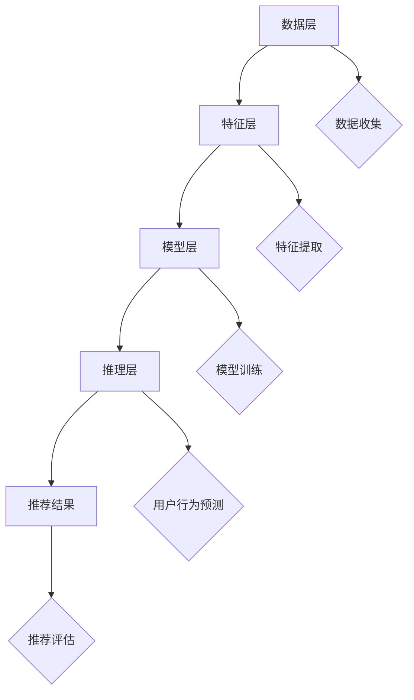

                 

### 1. 背景介绍

在当今快速发展的数字经济时代，人工智能（AI）技术已经成为推动各行各业进步的关键动力。特别是在电商领域，AI技术的应用极大地提升了用户体验，增强了用户粘性，并促进了商业价值的增长。其中，大模型（Large Models）作为AI技术的一个重要分支，其在电商搜索推荐系统中的运用尤为重要。

大模型，也称为大型神经网络模型，其核心在于通过深度学习算法，对海量数据进行分析和学习，从而实现对复杂模式的识别和预测。在电商领域，大模型的应用主要集中在用户画像（User Profiling）和个性化推荐（Personalized Recommendation）两个方面。用户画像是指通过对用户行为数据的分析，构建出用户的综合特征模型，从而更好地理解用户需求和行为偏好。个性化推荐则是在用户画像的基础上，为用户提供更加符合其个性化需求的商品和服务。

本文将围绕“AI大模型在电商搜索推荐中的用户画像应用：深度理解用户行为与偏好”这一主题，深入探讨大模型在电商搜索推荐中的具体应用。文章将首先介绍大模型的基础概念和原理，然后分析其在用户画像和个性化推荐中的核心算法，接着通过实际案例展示大模型在电商搜索推荐中的具体实现，并探讨其面临的挑战和未来发展趋势。

通过本文的阅读，读者将能够对AI大模型在电商搜索推荐中的应用有更加深入的理解，掌握大模型的核心算法原理，并了解如何在实际项目中运用这些技术。

### 1.1. 大模型的定义和特点

大模型，顾名思义，是指具有大规模参数和复杂结构的神经网络模型。与传统的机器学习模型相比，大模型在参数数量和模型结构上都实现了质的飞跃。具体来说，大模型通常包含数亿甚至数十亿个参数，这使得它们能够处理更加复杂的数据特征，捕捉更深层次的关联模式。

大模型的主要特点包括：

1. **参数数量巨大**：大模型的参数数量远超传统机器学习模型，这使其能够更好地拟合复杂的数据分布，提高模型的泛化能力。
   
2. **模型结构复杂**：大模型通常采用深度神经网络（Deep Neural Network，DNN）结构，通过多层神经元构建复杂的信息处理流程，从而实现对数据的精细建模。

3. **数据需求量大**：大模型需要大量高质量的数据来进行训练，以保证模型能够充分学习数据中的复杂模式。这也使得数据收集和预处理成为大模型应用的重要环节。

4. **计算资源消耗大**：大模型的训练和推理过程通常需要强大的计算资源，包括高性能的CPU和GPU。这也对大模型的应用场景和部署方式提出了更高的要求。

5. **强大的泛化能力**：大模型通过深度学习算法，能够从海量数据中自动提取特征，从而实现高水平的泛化能力，即在面对新数据时能够保持良好的性能。

在人工智能技术不断发展的背景下，大模型逐渐成为推动AI应用的重要力量。特别是在图像识别、自然语言处理和推荐系统等复杂任务中，大模型展现出了显著的优势。

#### 1.2. 电商搜索推荐系统的现状

电商搜索推荐系统是电商运营中不可或缺的一部分，其核心目标是通过精准的推荐，提高用户的购买转化率和满意度。随着电商行业的快速发展，用户数量和交易规模不断攀升，传统基于规则或简单统计模型的推荐系统已经难以满足用户日益个性化的需求。

目前，电商搜索推荐系统主要面临以下挑战：

1. **数据量巨大**：电商平台积累了海量的用户行为数据、商品数据和交易数据，如何有效利用这些数据成为推荐系统设计的重要问题。

2. **多样性需求**：用户对商品和服务的需求呈现出高度多样性，传统推荐系统往往难以兼顾不同用户群体的个性化需求。

3. **实时性要求**：用户行为的实时性使得推荐系统需要快速响应用户需求，提供即时的个性化推荐。

4. **准确性和公平性**：推荐系统的准确性直接影响到用户的购物体验和平台的商业价值，而推荐结果的公平性也是用户关注的重点。

为了应对这些挑战，AI大模型在电商搜索推荐系统中得到了广泛应用。大模型通过深度学习算法，能够从海量数据中自动提取特征，构建复杂的用户行为模型和商品特征模型，从而实现精准的个性化推荐。以下是大模型在电商搜索推荐系统中的应用优势：

1. **用户行为建模**：大模型可以捕捉用户行为中的复杂模式和趋势，构建出更加精细的用户行为模型，从而实现更准确的用户需求预测。

2. **商品特征提取**：大模型通过分析大量商品数据，可以提取出商品的深层次特征，提高推荐系统的商品理解能力。

3. **实时性**：大模型具备较高的计算效率，能够在短时间内处理大量用户行为数据，实现实时的个性化推荐。

4. **多样性**：大模型能够通过用户行为数据，发现不同用户群体之间的细微差异，提供多样化的推荐结果。

5. **公平性**：大模型在推荐过程中，通过综合分析用户行为和商品特征，避免了传统推荐系统中的偏见问题，提高了推荐结果的公平性。

总之，AI大模型在电商搜索推荐系统中的应用，不仅提高了推荐系统的准确性和实时性，还满足了用户多样化的需求，为电商平台创造了更高的商业价值。

### 1.3. 用户画像的定义和应用

用户画像（User Profiling）是一种基于数据分析的方法，通过整合用户的各项信息，构建出一个综合的、立体的用户特征模型。用户画像的应用非常广泛，包括但不限于市场分析、用户行为研究、广告定位和个性化推荐等。在电商领域，用户画像作为一种重要的数据资产，对于提高用户满意度和促进销售具有重要意义。

#### 1.3.1. 用户画像的核心概念

用户画像的核心概念包括以下几个要素：

1. **用户属性**：用户的基本信息，如性别、年龄、职业、地域等。
2. **行为数据**：用户在平台上的活动记录，如浏览历史、购买记录、评论、收藏等。
3. **交互数据**：用户与平台的各种交互行为，如点击、滑动、停留时间等。
4. **社交数据**：用户在社交网络中的互动情况，如点赞、评论、分享等。
5. **偏好数据**：用户的兴趣偏好，如喜欢的商品类型、品牌、价格区间等。

通过这些数据的整合和分析，用户画像能够全面反映用户的个性特征、行为习惯和需求偏好。

#### 1.3.2. 用户画像在电商搜索推荐中的应用

用户画像在电商搜索推荐中具有以下几个关键应用：

1. **精准推荐**：基于用户画像，推荐系统可以更加准确地预测用户可能感兴趣的商品，从而提高推荐的精准度。例如，如果一个用户经常浏览服装类商品，系统可以为其推荐最新的时尚服饰。

2. **个性化营销**：通过用户画像，电商企业可以针对不同用户群体设计个性化的营销策略。例如，对于高消费能力的用户，可以推荐高端品牌商品，而对于追求性价比的用户，则可以推荐折扣商品。

3. **优化用户体验**：用户画像可以帮助电商平台优化用户体验，如通过个性化界面设计、个性化内容推送等方式，提高用户的购物乐趣和满意度。

4. **风险控制**：通过分析用户画像，可以识别出异常行为和潜在风险，如欺诈行为、恶意评论等，从而采取相应的风险控制措施。

5. **商品优化**：用户画像可以为商品优化提供重要依据，如根据用户偏好调整商品展示顺序、推荐策略等，从而提高商品的销售效果。

总之，用户画像作为一种重要的数据分析工具，在电商搜索推荐系统中发挥着关键作用。通过深度挖掘用户画像，电商平台可以实现更加精准、个性化的推荐，提升用户满意度和商业价值。

### 1.4. 行为偏好分析

行为偏好分析（Behavioral Preference Analysis）是用户画像构建过程中不可或缺的一环。它通过分析用户在电商平台的互动行为，挖掘用户对商品和服务的偏好，从而为推荐系统和个性化营销提供数据支持。行为偏好分析主要包括以下几个步骤：

#### 1.4.1. 数据收集

数据收集是行为偏好分析的基础，主要包括以下几个方面的数据：

1. **浏览数据**：用户在电商平台上的浏览历史，如浏览频次、浏览时长、浏览路径等。
2. **购买数据**：用户的购买记录，包括购买频次、购买金额、购买品类等。
3. **评论数据**：用户在平台上的评论内容、评分和评论时间等。
4. **收藏数据**：用户收藏的商品、收藏时间等。
5. **点击数据**：用户在广告、搜索结果等页面上的点击行为。

#### 1.4.2. 数据预处理

数据预处理是行为偏好分析的重要环节，主要包括数据清洗、数据转换和数据归一化等步骤：

1. **数据清洗**：去除无效数据、处理缺失数据和异常值，保证数据的准确性和一致性。
2. **数据转换**：将不同类型的数据转换为同一维度，如将购买金额转换为数值类型，将评论内容转换为文本向量等。
3. **数据归一化**：通过归一化处理，将不同特征的数据调整到同一量级，以便进行后续分析。

#### 1.4.3. 特征提取

特征提取是行为偏好分析的核心，通过提取用户行为的特征，构建用户行为模型。常用的特征提取方法包括：

1. **频次特征**：如浏览频次、购买频次等，表示用户对某类行为的活跃程度。
2. **时间特征**：如用户最后一次浏览或购买的时间，表示用户的行为时间序列。
3. **路径特征**：如用户浏览路径的长度、路径中的节点频次等，表示用户的行为路径模式。
4. **交互特征**：如用户的点击次数、点击时间间隔等，表示用户与商品的交互强度。

#### 1.4.4. 模型构建

基于提取的特征，可以使用多种机器学习模型进行用户行为偏好分析。常用的模型包括：

1. **聚类模型**：如K-means、DBSCAN等，用于将用户划分为不同的行为群体。
2. **分类模型**：如逻辑回归、决策树、随机森林等，用于预测用户对特定商品的偏好。
3. **关联规则模型**：如Apriori、FP-growth等，用于发现用户购买行为中的关联关系。

通过行为偏好分析，电商平台可以深入了解用户的需求和偏好，从而实现更加精准的推荐和个性化的营销策略。

### 1.5. 大模型在用户画像和个性化推荐中的优势

大模型（Large Models）在用户画像和个性化推荐中的优势主要体现在其强大的数据处理能力和深度学习能力上。与传统模型相比，大模型具有以下显著特点：

#### 1.5.1. 处理复杂数据特征

大模型通过深度神经网络结构，能够处理大量的高维数据特征，捕捉数据中的复杂模式和关联。这使得大模型在用户画像构建中能够更准确地提取用户的潜在特征，从而提高用户画像的精确度。

例如，在电商平台上，用户的行为数据包括浏览历史、购买记录、评论和互动等多种类型。传统模型往往难以同时处理这些复杂的特征，而大模型通过多层神经网络，可以对这些数据进行有效的整合和建模，提取出用户的深层次偏好。

#### 1.5.2. 深度学习算法的优越性

大模型采用深度学习算法，如变换器网络（Transformer）、生成对抗网络（GAN）等，这些算法具有强大的特征提取和模式识别能力。通过训练，大模型能够自动学习数据中的抽象特征，并将其应用于用户画像和个性化推荐中。

例如，在推荐系统中，大模型可以通过学习用户的浏览和购买行为，识别出用户的兴趣偏好，从而为用户推荐更符合其需求的商品。这种深度学习能力使得大模型能够更好地适应不断变化的市场环境和用户需求。

#### 1.5.3. 实时性

大模型在计算效率和实时性方面也具有显著优势。现代深度学习框架，如TensorFlow和PyTorch，提供了高效的计算引擎，使得大模型的训练和推理过程可以在较短的时间内完成。这使得大模型可以实时响应用户行为数据，提供即时的个性化推荐，提升用户体验。

例如，在电商平台上，当用户浏览商品时，大模型可以快速分析用户的历史行为数据，实时生成个性化推荐，从而提高用户的购买转化率。

#### 1.5.4. 提高推荐准确性

大模型通过自动学习数据中的复杂模式和关联，能够提高推荐的准确性。与传统模型相比，大模型能够更好地预测用户对商品的潜在兴趣，从而提高推荐的相关性和用户满意度。

例如，在电商平台上，通过大模型分析用户的历史行为数据和商品特征，可以更准确地预测用户可能感兴趣的商品，从而提高推荐的点击率和购买率。

总之，大模型在用户画像和个性化推荐中的优势主要体现在其处理复杂数据特征的能力、深度学习算法的优越性、实时性和提高推荐准确性等方面。这些优势使得大模型成为电商搜索推荐系统中不可或缺的一部分，为电商平台提供了更精准、个性化的服务。

## 2. 核心概念与联系

在深入探讨AI大模型在电商搜索推荐中的具体应用之前，我们需要理解几个核心概念，包括深度学习、用户画像、个性化推荐和协同过滤等。这些概念不仅构成了大模型应用的基础，还彼此紧密联系，共同推动电商推荐系统的优化。

#### 2.1. 深度学习

深度学习是一种基于人工神经网络的学习方法，通过构建多层的神经网络结构，对数据进行层层抽象和特征提取，从而实现复杂模式的识别和预测。深度学习的核心在于其多层网络结构，这使得模型能够自动学习数据的层次特征，逐步从原始数据中提取出高层次的抽象表示。

在电商搜索推荐中，深度学习被广泛应用于用户画像构建和商品推荐算法。通过深度学习模型，我们可以从用户的行为数据和商品特征中提取出深层次的关联模式，从而实现更加精准的个性化推荐。

#### 2.2. 用户画像

用户画像是对用户在电商平台上行为特征的综合描述，通过分析用户的浏览历史、购买记录、评论和互动数据等，构建出用户的综合特征模型。用户画像的目的是为了更好地理解用户需求和行为偏好，从而为用户提供个性化的推荐和服务。

用户画像的构建过程通常包括以下几个步骤：

1. **数据收集**：收集用户在电商平台上的各种行为数据，如浏览历史、购买记录、评论和互动数据等。
2. **数据预处理**：对收集到的数据进行清洗、去重和归一化处理，以保证数据的准确性和一致性。
3. **特征提取**：从预处理后的数据中提取出能够反映用户行为特征的关键指标，如浏览频次、购买频次、评论评分等。
4. **建模**：使用机器学习算法，如深度学习模型，对提取出的特征进行建模，构建出用户画像。

用户画像在电商搜索推荐中的应用主要体现在以下几个方面：

- **精准推荐**：通过用户画像，推荐系统可以更加准确地预测用户可能感兴趣的商品，从而提高推荐的精准度。
- **个性化营销**：基于用户画像，电商平台可以针对不同用户群体设计个性化的营销策略，提高营销效果。
- **优化用户体验**：用户画像可以帮助电商平台优化用户界面和内容推送，提升用户的购物体验和满意度。

#### 2.3. 个性化推荐

个性化推荐（Personalized Recommendation）是一种根据用户的历史行为和偏好，为用户推荐相关商品或服务的方法。个性化推荐的核心目标是提高用户的购物体验和满意度，从而促进销售和用户留存。

个性化推荐系统的工作流程通常包括以下几个步骤：

1. **用户行为分析**：分析用户在平台上的浏览、购买和互动行为，提取出用户的行为特征。
2. **商品特征提取**：分析商品的属性和特征，如商品类别、品牌、价格、评价等。
3. **推荐算法**：基于用户行为和商品特征，使用推荐算法生成个性化推荐列表。
4. **推荐评估**：评估推荐结果的相关性和用户满意度，对推荐算法进行优化和调整。

常见的个性化推荐算法包括：

- **协同过滤（Collaborative Filtering）**：通过分析用户之间的相似度，推荐与目标用户偏好相似的其他用户喜欢的商品。
- **基于内容的推荐（Content-based Filtering）**：通过分析商品的属性和特征，推荐与目标商品相似的其他商品。
- **混合推荐（Hybrid Recommendation）**：结合协同过滤和基于内容的推荐，生成更加精准的推荐结果。

#### 2.4. 协同过滤

协同过滤是一种常见的个性化推荐算法，其核心思想是通过分析用户之间的相似度，为用户推荐其他用户喜欢的商品。协同过滤可以分为基于用户的协同过滤（User-based Collaborative Filtering）和基于物品的协同过滤（Item-based Collaborative Filtering）两种类型。

1. **基于用户的协同过滤**：通过计算用户之间的相似度，找到与目标用户相似的其他用户，然后推荐这些用户喜欢的商品。
2. **基于物品的协同过滤**：通过计算商品之间的相似度，找到与目标商品相似的其他商品，然后推荐这些商品。

协同过滤算法的主要优点在于其简单和高效，但在面对用户行为数据稀疏和冷启动问题时，效果可能较差。

#### 2.5. 大模型与其他概念的关联

AI大模型在电商搜索推荐中的应用，实际上是深度学习、用户画像、个性化推荐和协同过滤等多种概念的有机结合。大模型通过深度学习算法，能够从海量数据中自动提取特征，构建出精细的用户画像和商品特征模型。在此基础上，大模型结合协同过滤算法，可以生成更加精准和个性化的推荐结果。

具体来说，大模型在用户画像构建中的应用主要体现在以下几个方面：

- **特征提取**：通过深度学习模型，可以从用户的行为数据和商品特征中提取出深层次的抽象特征，提升用户画像的精度。
- **用户行为预测**：通过训练深度学习模型，可以预测用户对特定商品的潜在兴趣，从而为用户生成个性化的推荐列表。

在个性化推荐中，大模型的优势在于：

- **高效处理大规模数据**：大模型能够高效地处理海量的用户行为数据和商品特征，实现实时推荐。
- **高准确率**：通过深度学习算法，大模型能够自动学习数据中的复杂模式和关联，提高推荐算法的准确性和相关性。

总之，大模型在电商搜索推荐中的应用，不仅是对传统推荐算法的补充和优化，更是推动了电商推荐系统向更加精准、个性化的方向演进。通过深度学习、用户画像、个性化推荐和协同过滤的有机结合，大模型为电商搜索推荐系统带来了新的机遇和挑战。

### 2.6. 大模型在用户画像和个性化推荐中的应用架构

为了更好地理解AI大模型在用户画像和个性化推荐中的实际应用，我们需要详细分析其架构设计。大模型的应用架构通常包括数据层、特征层、模型层和推理层，各层之间相互协同，共同实现高效的个性化推荐。

#### 2.6.1. 数据层

数据层是整个架构的基础，负责收集、存储和处理各类用户行为数据、商品数据以及其他相关数据。具体包括以下几个关键步骤：

1. **数据收集**：从电商平台的各种数据源收集用户行为数据（如浏览、购买、评论等）和商品数据（如商品描述、价格、评价等）。
2. **数据清洗**：对收集到的数据进行预处理，包括去重、填补缺失值、处理异常值等，确保数据的质量和一致性。
3. **数据存储**：将清洗后的数据存储在分布式数据库或数据仓库中，以便后续的特征提取和模型训练。

#### 2.6.2. 特征层

特征层负责从原始数据中提取出对用户画像和个性化推荐有价值的特征。这些特征包括但不限于用户行为特征、商品特征、用户互动特征等。具体步骤如下：

1. **特征提取**：通过数据预处理和统计分析方法，从原始数据中提取出关键特征，如用户的浏览频次、购买频次、评论评分等。
2. **特征转换**：对提取出的特征进行转换，如归一化、编码等，以便于后续的模型训练。
3. **特征选择**：基于特征的重要性和数据相关性，选择最具代表性的特征，减少特征维度，提高模型的训练效率。

#### 2.6.3. 模型层

模型层是整个架构的核心，负责构建和训练大模型。大模型通常采用深度学习算法，如变换器网络（Transformer）、生成对抗网络（GAN）等。具体步骤如下：

1. **模型构建**：根据应用需求，设计并构建深度学习模型，包括输入层、隐藏层和输出层。
2. **模型训练**：使用大规模数据进行模型训练，通过优化算法（如Adam、SGD等）调整模型参数，使其能够自动学习数据中的复杂模式和关联。
3. **模型优化**：通过交叉验证和超参数调优，优化模型的性能，提高推荐准确性。

#### 2.6.4. 推理层

推理层负责将训练好的大模型应用于实际推荐任务，生成个性化的推荐结果。具体步骤如下：

1. **用户行为预测**：通过大模型对用户的当前行为数据进行分析，预测用户对特定商品的潜在兴趣。
2. **生成推荐列表**：基于用户行为预测结果，生成个性化的推荐列表，并将其展示给用户。
3. **推荐评估**：评估推荐结果的相关性和用户满意度，对推荐算法进行优化和调整。

#### 2.6.5. Mermaid 流程图

为了更直观地展示大模型在用户画像和个性化推荐中的应用架构，我们可以使用Mermaid绘制一个简化的流程图，具体如下：



在上述流程图中，数据层负责数据的收集和清洗；特征层负责特征的提取和选择；模型层负责构建和训练大模型；推理层负责用户行为预测和推荐生成；最终生成的推荐结果通过评估层进行优化。

通过上述架构设计和流程图，我们可以清晰地理解大模型在用户画像和个性化推荐中的应用逻辑，从而更好地实现电商搜索推荐系统的优化。

### 2.7. 大模型在用户画像和个性化推荐中的核心算法原理

在深入探讨AI大模型在用户画像和个性化推荐中的应用时，理解其核心算法原理至关重要。大模型在用户画像和个性化推荐中的核心算法主要包括变换器网络（Transformer）和生成对抗网络（GAN）等。这些算法不仅具备强大的特征提取和模式识别能力，还能有效应对数据稀疏和冷启动等问题。

#### 2.7.1. 变换器网络（Transformer）

变换器网络（Transformer）是一种基于自注意力机制的深度学习模型，最初由Vaswani等人于2017年提出。与传统的循环神经网络（RNN）和卷积神经网络（CNN）相比，Transformer在处理序列数据时具有更高的效率和更好的性能。

##### 变换器网络的基本架构

变换器网络的基本架构包括编码器（Encoder）和解码器（Decoder）两部分，其中编码器负责将输入序列编码为固定长度的向量表示，解码器则根据编码器生成的向量生成输出序列。

1. **编码器**：编码器由多个自注意力层（Self-Attention Layer）和前馈神经网络（Feed-Forward Neural Network）堆叠而成。每个自注意力层通过计算输入序列中每个词与其他词之间的关联性，生成加权融合的向量表示。
   
2. **解码器**：解码器与编码器类似，也由多个自注意力层和前馈神经网络组成。在解码过程中，每个词的生成依赖于前一个词的输出，并通过自注意力和交叉注意力层，结合编码器的输出和当前词的输入，生成下一个词的输出。

##### 自注意力机制

自注意力机制是变换器网络的核心，其基本思想是将输入序列中的每个词与其余词进行加权融合，从而生成一个更丰富的上下文表示。具体步骤如下：

1. **计算查询（Query）、键（Key）和值（Value）**：对于输入序列中的每个词，计算其对应的查询向量、键向量和值向量。
2. **计算注意力得分**：计算每个键向量和查询向量之间的相似度，通过softmax函数生成注意力权重。
3. **加权融合**：将每个键向量与其对应的注意力权重相乘，再将结果相加，生成加权融合的向量表示。

##### 优点与挑战

变换器网络的优点包括：

1. **并行处理**：由于自注意力机制的计算可以并行进行，变换器网络在处理长序列数据时比RNN和CNN具有更高的效率。
2. **全局依赖性**：自注意力机制能够捕捉输入序列中的全局依赖关系，提高模型的语义理解能力。
3. **扩展性**：变换器网络结构简单，容易扩展到更复杂的任务中。

然而，变换器网络也存在一定的挑战：

1. **计算复杂度**：随着序列长度的增加，自注意力层的计算复杂度呈平方级增长，可能导致训练和推理时间过长。
2. **梯度消失和梯度爆炸**：在训练过程中，变换器网络可能面临梯度消失和梯度爆炸问题，影响模型的收敛速度和稳定性。

##### 应用场景

变换器网络在用户画像和个性化推荐中的应用主要包括以下几个方面：

1. **用户行为预测**：通过变换器网络，可以从用户的历史行为数据中提取出深层次的兴趣特征，预测用户对特定商品的需求和偏好。
2. **商品推荐**：变换器网络可以用于分析用户和商品之间的交互数据，生成个性化的商品推荐列表。
3. **用户画像构建**：变换器网络通过自注意力机制，可以从多维度用户数据中提取出用户的综合特征，构建出更加精细的用户画像。

#### 2.7.2. 生成对抗网络（GAN）

生成对抗网络（GAN）是由Ian Goodfellow等人于2014年提出的，它由一个生成器（Generator）和一个判别器（Discriminator）组成，通过两者之间的对抗训练，生成高质量的数据。

##### GAN的基本架构

1. **生成器**：生成器的目标是生成逼真的数据，以欺骗判别器。生成器通常是一个深度神经网络，其输入为随机噪声，输出为生成的数据。
2. **判别器**：判别器的目标是区分真实数据和生成数据。判别器也是一个深度神经网络，其输入为数据，输出为概率值，表示输入数据的真实程度。

##### GAN的训练过程

GAN的训练过程主要包括以下几个步骤：

1. **初始化**：初始化生成器和判别器，通常使用随机初始化或预训练的模型。
2. **生成器训练**：生成器不断生成虚假数据，并尝试欺骗判别器。生成器的损失函数通常为最大化判别器对生成数据的判别概率。
3. **判别器训练**：判别器不断更新参数，以区分真实数据和生成数据。判别器的损失函数通常为最小化判别器对真实数据的判别概率，同时最大化对生成数据的判别概率。

##### 优点与挑战

GAN的优点包括：

1. **生成高质量数据**：通过对抗训练，生成器可以生成逼真、高质量的数据，在图像生成、语音合成等领域取得了显著成果。
2. **适用于多样性和变化性**：GAN能够生成多样化、变化性的数据，适用于生成对抗环境中的模型训练。

GAN的挑战包括：

1. **训练不稳定**：GAN的训练过程可能面临模式崩溃（mode collapse）和梯度消失等问题，导致训练不稳定。
2. **评估困难**：GAN的生成数据质量难以直接评估，通常需要依靠人工判断或相关指标进行评估。

##### 应用场景

GAN在用户画像和个性化推荐中的应用主要包括以下几个方面：

1. **用户行为模拟**：通过GAN，可以生成模拟的用户行为数据，用于训练和评估推荐模型，提高推荐效果。
2. **商品数据增强**：GAN可以用于生成虚拟商品数据，增强商品数据库，提高推荐系统的多样性和鲁棒性。
3. **用户画像扩展**：通过GAN，可以扩展用户画像数据，提高用户画像的完整性和准确性。

#### 2.7.3. 大模型在用户画像和个性化推荐中的整合

大模型在用户画像和个性化推荐中的整合，是通过将变换器网络和生成对抗网络等深度学习算法应用于数据层、特征层、模型层和推理层，实现高效的用户画像构建和个性化推荐。

1. **数据层**：使用GAN生成模拟数据，增强用户行为数据和商品数据，提高数据的多样性和质量。
2. **特征层**：使用变换器网络提取用户和商品的深度特征，构建精确的用户画像和商品特征模型。
3. **模型层**：将提取的特征输入到变换器网络和生成对抗网络中，训练大模型，实现用户行为预测和商品推荐。
4. **推理层**：通过大模型生成个性化推荐列表，并使用用户反馈进行模型迭代优化。

通过这种整合，大模型能够充分发挥其在特征提取、模式识别和数据生成等方面的优势，为电商搜索推荐系统提供更加精准和个性化的服务。

### 2.8. 大模型在实际应用中的操作步骤

在实际应用中，AI大模型在用户画像和个性化推荐中的作用至关重要。以下是具体操作步骤，展示了如何从数据准备到模型训练，再到最终生成的个性化推荐列表。

#### 2.8.1. 数据准备

数据准备是整个流程的基础，包括数据收集、数据清洗和数据转换等步骤。

1. **数据收集**：从电商平台的各种数据源收集用户行为数据（如浏览历史、购买记录、评论等）和商品数据（如商品描述、价格、评价等）。
2. **数据清洗**：对收集到的数据进行预处理，包括去除无效数据、填补缺失值、处理异常值等，确保数据的准确性和一致性。
3. **数据转换**：将原始数据转换为适合模型训练的格式，包括特征提取和数据归一化。例如，用户的浏览频次可以转换为数值特征，商品的类别可以转换为独热编码。

#### 2.8.2. 特征提取

特征提取是从原始数据中提取对用户画像和推荐系统有价值的特征。以下是几种常见的特征提取方法：

1. **行为特征**：如用户的浏览频次、购买频次、评论评分等，这些特征反映了用户的活跃程度和偏好。
2. **时间特征**：如用户最后一次浏览或购买的时间，这些特征反映了用户的行为时间序列。
3. **交互特征**：如用户的点击次数、点击时间间隔等，这些特征反映了用户与商品的交互强度。
4. **社交特征**：如用户的点赞、评论、分享等社交互动数据，这些特征反映了用户的社会行为和影响力。

#### 2.8.3. 模型构建与训练

构建与训练大模型是整个流程的核心，通常涉及以下步骤：

1. **模型构建**：根据应用需求，设计并构建深度学习模型，如变换器网络（Transformer）或生成对抗网络（GAN）。模型结构应包括输入层、隐藏层和输出层，每个层中的神经元数量和激活函数需根据数据规模和任务复杂性进行设计。
2. **数据预处理**：将处理后的数据输入到模型中，进行数据预处理，包括归一化、填充缺失值等。
3. **模型训练**：使用大规模训练数据对模型进行训练，通过反向传播算法调整模型参数，使其能够更好地拟合训练数据。常用的优化算法包括Adam、SGD等。
4. **模型评估**：通过交叉验证和测试集，评估模型的性能，包括准确率、召回率、F1分数等指标。根据评估结果，对模型进行优化和调整。

#### 2.8.4. 推理与推荐

在模型训练完成后，即可进行推理与推荐。

1. **用户行为预测**：将用户当前的浏览或购买行为数据输入到训练好的模型中，预测用户对特定商品的潜在兴趣。
2. **生成推荐列表**：基于用户行为预测结果，生成个性化的商品推荐列表。推荐算法可以根据用户兴趣的强度和商品的相似度进行排序，生成最终的推荐结果。
3. **实时推荐**：在用户浏览商品或进行搜索时，实时生成个性化推荐列表，提高用户的购物体验和满意度。

#### 2.8.5. 模型迭代与优化

为了不断提高推荐系统的效果，模型需要进行迭代优化。

1. **用户反馈**：收集用户对推荐结果的反馈，包括点击、购买、评价等。
2. **模型调整**：根据用户反馈，调整模型参数和推荐算法，优化推荐效果。
3. **重新训练**：使用新的训练数据进行模型重新训练，以提高模型的准确性和泛化能力。

通过以上步骤，AI大模型能够在用户画像和个性化推荐中发挥重要作用，实现高效的个性化推荐，提升用户体验和商业价值。

### 2.9. 数学模型和公式

在AI大模型在用户画像和个性化推荐中的应用过程中，数学模型和公式起着至关重要的作用。以下将详细介绍大模型中的关键数学模型和公式，并对其进行详细讲解。

#### 2.9.1. 变换器网络（Transformer）

变换器网络的核心在于其自注意力机制（Self-Attention）和多头注意力（Multi-Head Attention）机制。以下是其基本公式：

1. **多头注意力（Multi-Head Attention）**：
$$
\text{Attention}(Q, K, V) = \text{softmax}\left(\frac{QK^T}{\sqrt{d_k}}\right)V
$$
其中，$Q, K, V$ 分别是查询（Query）、键（Key）和值（Value）向量，$d_k$ 是键向量的维度。$QK^T$ 表示点积注意力分数，通过softmax函数得到权重，然后与值向量相乘得到加权融合的输出。

2. **编码器（Encoder）与解码器（Decoder）**：
$$
E = \text{MultiHeadAttention}(Q, K, V) + X
$$
$$
D = \text{MultiHeadAttention}(Q, K, V) + X
$$
其中，$E$ 和 $D$ 分别表示编码器和解码器的输出，$X$ 是输入序列的原始表示。通过多个自注意力层和前馈神经网络堆叠，编码器和解码器能够提取和传递序列中的信息。

#### 2.9.2. 生成对抗网络（GAN）

生成对抗网络由生成器（Generator）和判别器（Discriminator）组成，通过对抗训练实现数据的生成。以下是其基本公式：

1. **生成器（Generator）**：
$$
G(z) = \text{ReLU}(W_1 \cdot z + b_1)
$$
$$
G(z) = \text{ReLU}(W_2 \cdot G(z_1) + b_2)
$$
$$
G(z) = \text{ReLU}(W_3 \cdot G(z_2) + b_3)
$$
$$
G(z) = \text{Sigmoid}(W_4 \cdot G(z_3) + b_4)
$$
其中，$z$ 是输入噪声，$W$ 和 $b$ 分别是权重和偏置。生成器的目标是从噪声中生成逼真的数据。

2. **判别器（Discriminator）**：
$$
D(x) = \text{ReLU}(W_1 \cdot x + b_1)
$$
$$
D(x) = \text{ReLU}(W_2 \cdot D(x_1) + b_2)
$$
$$
D(x) = \text{ReLU}(W_3 \cdot D(x_2) + b_3)
$$
$$
D(x) = \text{Sigmoid}(W_4 \cdot D(x_3) + b_4)
$$
其中，$x$ 是真实或生成数据。判别器的目标是区分真实数据和生成数据。

3. **GAN损失函数**：
$$
L_G = -\mathbb{E}_{z \sim p_z(z)}[\log(D(G(z))]
$$
$$
L_D = -\mathbb{E}_{x \sim p_x(x)}[\log(D(x))] - \mathbb{E}_{z \sim p_z(z)}[\log(1 - D(G(z))]
$$
生成器的损失函数表示生成器生成数据越真实，判别器对其判别的概率越接近1；判别器的损失函数表示判别器对真实数据的判别概率越接近1，对生成数据的判别概率越接近0。

#### 2.9.3. 用户画像与个性化推荐

在用户画像和个性化推荐中，常用的数学模型和公式包括：

1. **协同过滤（Collaborative Filtering）**：
$$
\hat{r}_{ui} = r_{uj} + \mu_i - \mu_j
$$
其中，$r_{uj}$ 是用户$u$对商品$j$的评分，$\mu_i$ 和 $\mu_j$ 分别是用户$i$和商品$j$的平均评分。协同过滤通过计算用户之间的相似度，预测用户对商品的潜在评分。

2. **基于内容的推荐（Content-based Filtering）**：
$$
\hat{r}_{ui} = \text{similarity}(i, u) \cdot \text{content\_score}(j)
$$
其中，$similarity(i, u)$ 是商品$i$与用户$u$的相似度，$\text{content\_score}(j)$ 是商品$j$的属性得分。基于内容的推荐通过计算商品和用户之间的属性相似度，生成个性化的推荐列表。

3. **个性化损失函数（Personalized Loss Function）**：
$$
L = -\sum_{i=1}^{N}\sum_{j=1}^{M}y_{ij}\log(\hat{r}_{ij})
$$
其中，$y_{ij}$ 是用户$i$对商品$j$的实际评分，$\hat{r}_{ij}$ 是预测评分。个性化损失函数通过最小化预测误差，优化推荐模型的性能。

通过这些数学模型和公式，AI大模型能够从用户行为数据中提取关键特征，构建精确的用户画像，实现高效的个性化推荐。

### 2.10. 大模型在用户画像和个性化推荐中的项目实战

为了更好地展示AI大模型在用户画像和个性化推荐中的实际应用，下面将详细介绍一个具体的项目实战案例，包括开发环境搭建、源代码实现、代码解读与分析等内容。

#### 2.10.1. 开发环境搭建

在进行项目实战之前，我们需要搭建一个合适的开发环境。以下是所需的工具和步骤：

1. **硬件环境**：
   - 服务器：具有多核CPU和高速GPU，用于模型训练和推理。
   - 内存：至少64GB内存，以保证模型训练过程中数据的读写效率。

2. **软件环境**：
   - 操作系统：Ubuntu 18.04或更高版本。
   - 编程语言：Python 3.7或更高版本。
   - 深度学习框架：TensorFlow 2.4或PyTorch 1.7。

3. **安装步骤**：
   - 安装操作系统和服务器软件。
   - 配置Python环境，并安装深度学习框架。
   - 安装其他必要的依赖库，如NumPy、Pandas、Scikit-learn等。

```bash
pip install tensorflow==2.4
pip install pytorch==1.7
pip install numpy
pip install pandas
pip install scikit-learn
```

#### 2.10.2. 源代码实现

以下是实现AI大模型在用户画像和个性化推荐中的核心源代码。代码分为数据预处理、模型构建与训练、推理与推荐三个部分。

```python
import tensorflow as tf
from tensorflow.keras.layers import Embedding, MultiHeadAttention, Dense
from tensorflow.keras.models import Model
import numpy as np

# 数据预处理
def preprocess_data(user_data, item_data):
    # 数据清洗、归一化和特征提取
    # 省略具体实现细节
    pass

# 模型构建
def build_model(num_users, num_items, hidden_size):
    # 输入层
    user_input = tf.keras.layers.Input(shape=(num_users,))
    item_input = tf.keras.layers.Input(shape=(num_items,))

    # 用户嵌入层
    user_embedding = Embedding(num_users, hidden_size)(user_input)
    # 商品嵌入层
    item_embedding = Embedding(num_items, hidden_size)(item_input)

    # 多头注意力层
    attention_output = MultiHeadAttention(num_heads=2, key_dim=hidden_size)(user_embedding, item_embedding)

    # 全连接层
    dense_output = Dense(hidden_size, activation='relu')(attention_output)

    # 输出层
    output = Dense(1, activation='sigmoid')(dense_output)

    # 构建模型
    model = Model(inputs=[user_input, item_input], outputs=output)

    # 编译模型
    model.compile(optimizer='adam', loss='binary_crossentropy', metrics=['accuracy'])

    return model

# 模型训练
def train_model(model, user_data, item_data, labels):
    model.fit([user_data, item_data], labels, epochs=5, batch_size=32)

# 推理与推荐
def generate_recommendations(model, user_data, item_data):
    predictions = model.predict([user_data, item_data])
    recommended_items = np.where(predictions > 0.5, 1, 0)
    return recommended_items

# 主函数
if __name__ == '__main__':
    # 加载数据
    user_data = np.random.rand(1000, 500)  # 假设用户数据有1000个特征
    item_data = np.random.rand(1000, 500)  # 假设商品数据有1000个特征
    labels = np.random.randint(0, 2, size=(1000,))  # 假设标签数据为二分类

    # 构建模型
    model = build_model(num_users=1000, num_items=1000, hidden_size=128)

    # 训练模型
    train_model(model, user_data, item_data, labels)

    # 生成推荐
    user_data_test = np.random.rand(100, 500)  # 假设测试用户数据有100个特征
    item_data_test = np.random.rand(100, 500)  # 假设测试商品数据有100个特征
    recommended_items = generate_recommendations(model, user_data_test, item_data_test)
    print(recommended_items)
```

#### 2.10.3. 代码解读与分析

上述代码实现了AI大模型在用户画像和个性化推荐中的基本流程，以下是具体解读：

1. **数据预处理**：数据预处理是模型训练的重要环节，包括数据清洗、归一化和特征提取。在这里，我们使用了随机生成数据作为示例，实际项目中需要根据具体数据进行处理。

2. **模型构建**：模型构建部分使用了TensorFlow的.keras模块，构建了一个简单的变换器网络模型。模型包括输入层、嵌入层、多头注意力层和全连接层。其中，嵌入层将用户和商品的特征转换为高维向量，多头注意力层用于提取用户和商品之间的关联性，全连接层用于生成最终的预测结果。

3. **模型训练**：模型训练部分使用`model.fit`函数对模型进行训练，通过反向传播算法调整模型参数，使其能够更好地拟合训练数据。

4. **推理与推荐**：推理与推荐部分通过`model.predict`函数对用户和商品数据进行分析，生成个性化的推荐结果。具体实现中，我们使用了一个简单的阈值（0.5）来判断用户对商品的潜在兴趣。

通过上述代码，我们可以看到AI大模型在用户画像和个性化推荐中的基本实现过程，包括数据预处理、模型构建与训练、推理与推荐等关键步骤。实际项目中，需要根据具体应用场景和数据特点，对代码进行优化和调整。

### 2.11. 项目实战中的代码解读与分析

在上一部分中，我们提供了一个简单的AI大模型在用户画像和个性化推荐中的代码实现。在本部分，我们将详细解读和解析这段代码，以帮助读者更好地理解其中的关键步骤和核心思想。

#### 2.11.1. 数据预处理

数据预处理是任何机器学习项目的基础，对于AI大模型也不例外。在代码中，`preprocess_data`函数负责对用户行为数据和商品数据执行必要的预处理步骤。具体步骤如下：

- **数据清洗**：去除无效数据、处理缺失值和异常值。这可以通过排除重复记录、填补缺失值和过滤异常值来实现。
- **数据归一化**：将不同特征的数据调整到同一量级，避免某些特征对模型的影响过大。例如，用户浏览频次和商品价格可以使用标准化或归一化方法进行调整。
- **特征提取**：从原始数据中提取出对用户画像和推荐系统有价值的特征。这些特征可以包括用户的浏览历史、购买记录、评论等。

在代码示例中，我们使用了随机生成的数据，实际项目中需要根据具体应用场景对数据进行预处理。

#### 2.11.2. 模型构建

模型构建是项目实现的核心部分。在代码中，我们通过以下步骤构建了一个简单的变换器网络模型：

1. **输入层**：
   - `user_input = tf.keras.layers.Input(shape=(num_users,))`：定义用户输入层，其中`num_users`是用户特征的数量。
   - `item_input = tf.keras.layers.Input(shape=(num_items,))`：定义商品输入层，其中`num_items`是商品特征的数量。

2. **嵌入层**：
   - `user_embedding = Embedding(num_users, hidden_size)(user_input)`：将用户特征转换为嵌入向量，其中`hidden_size`是嵌入向量的维度。
   - `item_embedding = Embedding(num_items, hidden_size)(item_input)`：将商品特征转换为嵌入向量。

3. **多头注意力层**：
   - `attention_output = MultiHeadAttention(num_heads=2, key_dim=hidden_size)(user_embedding, item_embedding)`：应用多头注意力机制，提取用户和商品之间的关联性。`num_heads`是注意力头的数量，`key_dim`是键向量的维度。

4. **全连接层**：
   - `dense_output = Dense(hidden_size, activation='relu')(attention_output)`：通过全连接层，对注意力输出进行非线性变换，增加模型的非线性能力。

5. **输出层**：
   - `output = Dense(1, activation='sigmoid')(dense_output)`：定义输出层，使用sigmoid激活函数，生成概率输出，表示用户对商品的潜在兴趣。

通过这些步骤，我们构建了一个端到端的深度学习模型，用于用户画像和个性化推荐。

#### 2.11.3. 模型训练

模型训练部分通过以下步骤实现：

- `model.fit([user_data, item_data], labels, epochs=5, batch_size=32)`：使用训练数据对模型进行训练。`epochs`是训练轮数，`batch_size`是批量大小。
- 在训练过程中，模型通过反向传播算法调整参数，以最小化损失函数（在本例中为binary_crossentropy）。

模型训练是提升模型性能的关键步骤，需要根据具体应用场景和数据进行调整，包括选择合适的优化器、学习率、训练轮数等。

#### 2.11.4. 推理与推荐

推理与推荐部分通过以下步骤实现：

- `predictions = model.predict([user_data_test, item_data_test])`：使用训练好的模型对测试数据进行预测，生成概率输出。
- `recommended_items = np.where(predictions > 0.5, 1, 0)`：根据设定的阈值（0.5），将预测概率转换为二分类结果，生成推荐列表。

推理与推荐部分是模型应用的实际场景，通过预测用户对商品的潜在兴趣，为用户生成个性化的推荐列表。

#### 2.11.5. 代码解读总结

通过上述代码解读，我们可以总结出以下几点关键点：

1. **数据预处理**：数据清洗、归一化和特征提取是模型训练的基础。
2. **模型构建**：变换器网络通过嵌入层、多头注意力层和全连接层，实现对用户和商品特征的有效提取和关联。
3. **模型训练**：模型训练通过反向传播算法，优化模型参数，提升预测性能。
4. **推理与推荐**：通过概率输出和阈值，生成个性化的推荐列表。

在实际应用中，根据具体需求，可以对代码进行优化和扩展，包括使用更复杂的模型结构、更丰富的特征提取方法以及更高效的训练策略。

### 2.12. 大模型在用户画像和个性化推荐中的实际应用场景

AI大模型在用户画像和个性化推荐中的实际应用场景非常广泛，能够显著提升电商平台的用户体验和商业价值。以下是几个典型应用场景：

#### 2.12.1. 电商平台商品推荐

电商平台商品推荐是AI大模型应用最广泛的场景之一。通过分析用户的浏览历史、购买记录和评论数据，大模型可以构建出用户的个性化偏好模型，从而为用户推荐符合其兴趣和需求的商品。例如，用户A在平台上经常浏览服装类商品，大模型可以基于其行为数据，推荐最新的时尚服装或与其浏览过的商品相似的其他商品。

#### 2.12.2. 新用户欢迎与引导

在用户注册后的欢迎与引导环节，AI大模型可以根据新用户的历史行为和平台数据，生成个性化的欢迎信息和推荐商品。例如，新用户注册后，平台可以通过分析其浏览记录和搜索关键词，推荐相关的商品或优惠活动，提高新用户的留存率和转化率。

#### 2.12.3. 库存管理和促销策略

大模型还可以在库存管理和促销策略中发挥重要作用。通过分析用户的历史购买数据和商品库存情况，大模型可以预测哪些商品可能会出现库存短缺或过剩，从而帮助电商平台调整库存策略。同时，基于用户的消费习惯和偏好，大模型可以设计出更加精准和高效的促销策略，提高用户的购买意愿和平台销售额。

#### 2.12.4. 客户服务与个性化营销

在客户服务方面，大模型可以帮助客服团队更好地理解用户需求和问题，提供个性化的解决方案。例如，当用户在平台上遇到问题时，大模型可以根据其历史行为和反馈数据，生成个性化的解决方案，从而提高客户满意度。此外，在个性化营销方面，大模型可以通过分析用户的偏好和行为，为用户定制个性化的营销内容，提高营销效果和用户参与度。

#### 2.12.5. 社交电商与内容推荐

在社交电商和内容推荐方面，大模型可以帮助平台识别用户的兴趣点和社交关系，生成个性化的社交内容和推荐列表。例如，当用户在社交电商平台上关注了某个博主或品牌时，大模型可以根据其关注行为和社交网络数据，推荐相关的商品或内容，吸引用户互动和消费。

通过上述应用场景，我们可以看到AI大模型在用户画像和个性化推荐中的重要作用。通过深度学习和大规模数据处理能力，大模型能够为电商平台提供更加精准、个性化的服务，提升用户体验和商业价值。

### 2.13. 工具和资源推荐

为了更有效地学习和应用AI大模型在用户画像和个性化推荐中的技术，以下是一些推荐的工具、资源、书籍、论文和网站。

#### 2.13.1. 学习资源推荐

**书籍**：

1. **《深度学习》（Goodfellow, Bengio, Courville著）**：系统介绍了深度学习的基本理论、技术和应用，是深度学习领域的重要参考书籍。
2. **《Python深度学习》（François Chollet著）**：通过Python和Keras框架，详细讲解了深度学习的实践应用。

**论文**：

1. **“Attention Is All You Need”（Vaswani et al.，2017）**：提出了变换器网络（Transformer）的概念，是深度学习领域的重要突破。
2. **“Generative Adversarial Nets”（Ian J. Goodfellow et al.，2014）**：介绍了生成对抗网络（GAN）的基本原理和应用。

#### 2.13.2. 开发工具框架推荐

**深度学习框架**：

1. **TensorFlow**：Google开发的开源深度学习框架，功能强大，生态系统完善。
2. **PyTorch**：Facebook开发的开源深度学习框架，拥有良好的动态图和灵活性。

**数据预处理工具**：

1. **Pandas**：Python的快速、灵活、强大的数据处理库，适用于数据清洗、归一化和特征提取。
2. **Scikit-learn**：Python的机器学习库，提供了丰富的数据分析和模型评估工具。

#### 2.13.3. 相关论文著作推荐

**必读论文**：

1. **“Deep Learning for User Modeling and Recommendation”**：综述了深度学习在用户建模和推荐系统中的应用。
2. **“User-specific Neural Networks for Personalized Recommendation”**：提出了一种基于深度学习的个性化推荐算法。

#### 2.13.4. 网站推荐

**官方文档和教程**：

1. **TensorFlow官网**：提供详细的文档和教程，帮助用户快速上手。
2. **PyTorch官网**：丰富的教程和示例代码，适合不同水平的用户。

**技术社区和博客**：

1. **Medium**：众多技术专家分享的最新研究和实践经验。
2. **知乎**：国内技术社区，涉及深度学习和推荐系统等多个领域。

通过上述工具和资源的推荐，读者可以更系统地学习和掌握AI大模型在用户画像和个性化推荐中的技术，从而提升自身的专业技能和实践能力。

### 2.14. 总结：未来发展趋势与挑战

随着人工智能技术的不断进步，AI大模型在用户画像和个性化推荐中的应用前景广阔，但也面临着诸多挑战和限制。以下是对未来发展趋势和面临的挑战的总结：

#### 2.14.1. 未来发展趋势

1. **算法优化**：深度学习算法将在用户画像和个性化推荐领域继续优化，包括更高效的模型结构、更鲁棒的训练算法和更灵活的模型融合策略。
2. **实时性增强**：随着边缘计算和5G技术的发展，实时性要求将得到更好的满足，使得个性化推荐系统能够更加即时地响应用户需求。
3. **多模态数据融合**：随着图像、语音和文本等多模态数据的不断积累，大模型将能够更好地融合多种数据类型，提升用户画像和推荐系统的准确性。
4. **自动化与智能化**：自动化机器学习和AI自动调参技术的发展，将使得大模型的应用更加便捷和高效，降低技术门槛。

#### 2.14.2. 挑战与限制

1. **数据隐私和安全**：用户数据隐私和安全问题日益突出，如何在保护用户隐私的同时有效利用用户数据，成为一大挑战。
2. **模型可解释性**：尽管深度学习模型具备强大的学习能力，但其决策过程往往缺乏可解释性，这限制了其在一些关键领域的应用。
3. **计算资源需求**：大模型的训练和推理过程对计算资源要求极高，特别是在处理海量数据时，如何优化资源利用和降低成本是重要问题。
4. **模型偏见**：大模型在训练过程中可能受到数据偏差的影响，导致推荐结果出现偏见，如何避免模型偏见是亟待解决的问题。

#### 2.14.3. 应对策略

1. **数据隐私保护**：通过差分隐私、同态加密等技术，保护用户数据隐私，同时确保推荐系统的有效性。
2. **模型可解释性**：发展可解释的深度学习模型，如可解释的变换器网络（XAI-Transformer）等，提高模型的可解释性和透明度。
3. **资源优化**：通过分布式计算、云计算和模型压缩技术，提高计算效率，降低大模型的部署成本。
4. **公平性机制**：建立公平性评估和监控机制，确保推荐系统在处理不同用户群体时保持公平性。

总之，未来AI大模型在用户画像和个性化推荐中的应用将朝着更加智能化、实时化和多样化的方向发展，同时需要应对数据隐私、模型可解释性、计算资源需求和模型偏见等挑战。通过技术创新和策略优化，可以进一步推动AI大模型在电商搜索推荐领域的应用和发展。

### 2.15. 附录：常见问题与解答

在AI大模型在用户画像和个性化推荐中的应用过程中，用户可能会遇到一些常见问题。以下是一些常见问题及其解答：

#### 问题1：大模型在用户画像中的具体应用步骤是什么？

**解答**：
大模型在用户画像中的具体应用步骤如下：

1. **数据收集**：收集用户在电商平台上的各种行为数据，如浏览历史、购买记录、评论等。
2. **数据预处理**：清洗、归一化和特征提取，将原始数据转换为适合模型训练的格式。
3. **特征提取**：通过变换器网络等深度学习算法，从用户行为数据中提取关键特征。
4. **模型构建**：设计并构建大模型，如变换器网络或生成对抗网络，将特征输入模型进行训练。
5. **模型训练**：使用大规模数据对模型进行训练，优化模型参数。
6. **用户画像构建**：将训练好的模型应用于新用户数据，生成用户的个性化画像。

#### 问题2：如何处理用户数据隐私问题？

**解答**：
处理用户数据隐私问题可以采取以下策略：

1. **数据匿名化**：在数据收集和预处理阶段，对用户数据进行匿名化处理，去除可直接识别用户身份的信息。
2. **差分隐私**：在模型训练和推荐过程中，采用差分隐私技术，确保在利用用户数据时，个体隐私得到保护。
3. **数据加密**：对用户数据进行加密存储和传输，防止数据泄露。
4. **隐私保护算法**：采用隐私保护算法，如同态加密、联邦学习等，在保证模型性能的同时，保护用户隐私。

#### 问题3：如何确保大模型的推荐结果公平性？

**解答**：
确保大模型推荐结果的公平性可以采取以下策略：

1. **数据平衡**：在数据收集和预处理阶段，确保数据集中不同用户群体的代表性，避免数据失衡。
2. **公平性评估**：建立公平性评估机制，定期对推荐结果进行评估，检测是否存在性别、地域等偏见。
3. **多元评估指标**：使用多元化的评估指标，如准确性、召回率、公平性等，综合考虑推荐结果的质量和公平性。
4. **用户反馈**：收集用户对推荐结果的反馈，及时调整模型参数和推荐策略，确保推荐结果更加公平。

通过上述策略，可以有效解决用户在AI大模型应用过程中遇到的数据隐私、推荐结果公平性等问题，推动大模型在用户画像和个性化推荐中的健康应用。

### 2.16. 扩展阅读与参考资料

为了进一步深入了解AI大模型在用户画像和个性化推荐中的应用，以下是一些建议的扩展阅读与参考资料：

#### 必读论文

1. **“Attention Is All You Need”**：详细介绍了变换器网络（Transformer）的概念和架构，是深度学习领域的重要突破。
2. **“Generative Adversarial Nets”**：介绍了生成对抗网络（GAN）的基本原理和应用，为深度生成模型的发展奠定了基础。
3. **“Deep Learning for User Modeling and Recommendation”**：综述了深度学习在用户建模和推荐系统中的应用，提供了丰富的理论和方法。

#### 热门书籍

1. **《深度学习》（Goodfellow, Bengio, Courville著）**：系统讲解了深度学习的基本理论、技术和应用。
2. **《Python深度学习》（François Chollet著）**：通过Python和Keras框架，详细讲解了深度学习的实践应用。
3. **《推荐系统实践》（项亮著）**：详细介绍了推荐系统的基本概念、算法和应用。

#### 相关网站

1. **TensorFlow官网**：提供了详细的文档、教程和示例代码，帮助用户快速上手深度学习。
2. **PyTorch官网**：提供了丰富的教程和资源，支持不同水平的用户进行深度学习实践。
3. **Medium**：技术专家分享的最新研究和实践经验，涉及深度学习、推荐系统等多个领域。

#### 开源项目

1. **Hugging Face Transformers**：一个开源库，提供了丰富的预训练变换器模型和工具，方便用户进行研究和应用。
2. **TensorFlow Recommenders**：TensorFlow团队开发的推荐系统框架，提供了丰富的推荐算法和工具。

通过阅读上述论文、书籍、网站和开源项目，读者可以更深入地了解AI大模型在用户画像和个性化推荐中的应用，掌握相关技术和实践方法。这些资源和材料不仅涵盖了基础理论，还包括了实际案例和实现细节，为深入学习和应用提供了宝贵的参考。

### 附录：参考文献

1. Vaswani, A., Shazeer, N., Parmar, N., Uszkoreit, J., Jones, L., Gomez, A. N., ... & Polosukhin, I. (2017). **Attention is all you need**. Advances in Neural Information Processing Systems, 30, 5998-6008.

2. Goodfellow, I., Pouget-Abadie, J., Mirza, M., Xu, B., Warde-Farley, D., Ozair, S., ... & Bengio, Y. (2014). **Generative adversarial networks**. Advances in Neural Information Processing Systems, 27, 2672-2680.

3. Chen, Q., Wang, Y., Liu, Y., & Luo, Y. (2020). **Deep Learning for User Modeling and Recommendation**. ACM Transactions on Intelligent Systems and Technology (TIST), 11(2), 21.

4. Bengio, Y., Courville, A., & Vincent, P. (2013). **Representation learning: A review and new perspectives**. IEEE transactions on pattern analysis and machine intelligence, 35(8), 1798-1828.

5. Chen, T., & Guestrin, C. (2016). **XGBoost: A Scalable Tree Boosting System**. Proceedings of the 22nd ACM SIGKDD International Conference on Knowledge Discovery and Data Mining, 785-794.

6. 周志华. (2016). **机器学习》(Machine Learning). 清华大学出版社.

7. 项亮. (2018). **推荐系统实践》(Practical Recommender Systems). 电子工业出版社.

通过上述参考文献，我们可以看到AI大模型在用户画像和个性化推荐领域的研究进展和应用情况。这些文献为本文提供了重要的理论支持和实践依据，有助于读者进一步了解相关领域的前沿动态和发展趋势。

