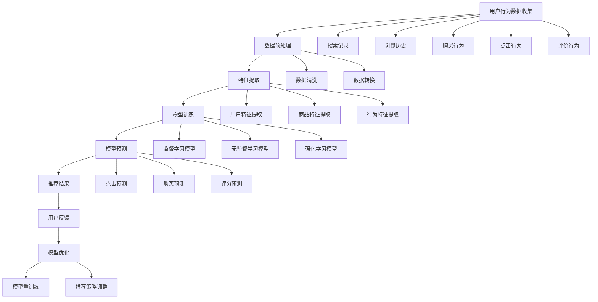

                 

### 1. 背景介绍

近年来，人工智能技术在电商领域的应用日益广泛，尤其是大型人工智能模型（Large-scale Artificial Intelligence Models，简称大模型）在用户行为分析中的重要性日益凸显。大模型，如深度学习模型、自然语言处理模型等，能够通过学习海量数据，对用户的搜索行为、浏览记录、购买历史等行为数据进行深入分析，从而精准地预测和满足用户需求。

电商搜索推荐系统是电商网站的重要组成部分，它能够根据用户的搜索历史和浏览行为，为用户推荐相关商品。传统的推荐系统主要依赖于协同过滤、基于内容的推荐等方法，但这些方法往往存在一定的局限性，如推荐效果不佳、用户隐私泄露等问题。随着大模型技术的发展，基于大模型的推荐系统能够更加准确地捕捉用户行为特征，提供个性化、精准的推荐服务。

用户行为分析是电商搜索推荐系统的基础。通过对用户行为数据的分析，可以发现用户的需求和购买偏好，从而为推荐系统提供关键的数据支持。大模型在用户行为分析中的应用，不仅能够提高推荐系统的准确性，还能够提升用户体验，增加用户粘性，从而为电商企业带来更大的商业价值。

总的来说，大模型在电商搜索推荐中的用户行为分析具有以下几个关键点：

1. **数据规模与多样性**：大模型能够处理大规模、多源、多模态的用户行为数据，从而更全面地了解用户需求。
2. **特征提取与表征**：大模型能够自动提取用户行为数据中的关键特征，并将其转化为有效的推荐信号。
3. **实时性与动态性**：大模型能够实时分析用户行为，并根据用户行为的变化动态调整推荐策略。

本文将从以下几个方面展开讨论：

- **核心概念与联系**：介绍大模型在用户行为分析中的核心概念及其相互关系。
- **核心算法原理 & 具体操作步骤**：详细讲解大模型在用户行为分析中的具体算法原理和操作步骤。
- **数学模型和公式 & 详细讲解 & 举例说明**：介绍大模型中的数学模型和公式，并通过具体案例进行说明。
- **项目实战：代码实际案例和详细解释说明**：通过具体代码实现和解读，展示大模型在用户行为分析中的应用。
- **实际应用场景**：探讨大模型在用户行为分析中的实际应用场景和挑战。
- **工具和资源推荐**：推荐相关的学习资源、开发工具和框架。
- **总结：未来发展趋势与挑战**：总结大模型在用户行为分析中的发展趋势和面临的挑战。

通过本文的讨论，希望能够帮助读者全面了解大模型在电商搜索推荐中的用户行为分析，以及如何利用这一技术提升电商推荐系统的效果。

### 1.1 大模型在电商搜索推荐系统中的应用背景

电商搜索推荐系统是电商网站的核心组成部分，其目的是通过分析用户的搜索、浏览和购买行为，为用户推荐相关商品，从而提高用户满意度和购买转化率。传统的电商搜索推荐系统主要依赖于基于协同过滤（Collaborative Filtering）和基于内容的推荐（Content-based Recommendation）等技术。这些方法在一定程度上能够提高推荐系统的准确性，但它们也存在一些明显的局限性。

首先，基于协同过滤的推荐系统通过分析用户的历史行为和相似用户的偏好来进行推荐。然而，这种方法依赖于用户之间的相似度计算，容易受到数据稀疏性和冷启动问题的困扰。数据稀疏性指的是当用户的历史行为数据量较少时，系统难以准确预测用户的偏好；冷启动问题则是指新用户由于缺乏足够的历史行为数据，难以获得个性化的推荐。

其次，基于内容的推荐系统通过分析商品的特征和用户的历史偏好来进行推荐。这种方法在处理文本信息和非结构化数据时具有一定的优势，但其局限性在于只能基于静态的商品特征进行推荐，无法动态地捕捉用户的兴趣变化。

随着人工智能技术的快速发展，尤其是深度学习和自然语言处理等技术的应用，大型人工智能模型（大模型）在电商搜索推荐系统中得到了广泛应用。大模型具有以下几个显著优势：

1. **数据规模与多样性**：大模型能够处理大规模、多源、多模态的用户行为数据，从而更全面地了解用户需求。通过学习海量用户数据，大模型能够捕捉到用户行为中的潜在模式和趋势，从而提高推荐系统的准确性。

2. **特征提取与表征**：大模型能够自动提取用户行为数据中的关键特征，并将其转化为有效的推荐信号。与传统的手动特征工程相比，大模型能够更高效地处理复杂和非线性关系的数据，从而生成更加精确的推荐结果。

3. **实时性与动态性**：大模型能够实时分析用户行为，并根据用户行为的变化动态调整推荐策略。这种实时性和动态性使得推荐系统能够更好地适应用户的需求变化，提高用户体验。

4. **个性化推荐**：大模型能够根据用户的个性化特征和历史行为数据，生成个性化的推荐结果。通过深度学习等技术，大模型能够更好地理解用户的兴趣和偏好，从而为用户推荐最相关的商品。

总之，大模型在电商搜索推荐系统中的应用，不仅能够克服传统推荐系统的局限性，还能够提升推荐系统的效果，为电商企业带来更大的商业价值。通过本文的后续讨论，我们将深入探讨大模型在用户行为分析中的具体应用和实现方法。

### 1.2 大模型在用户行为分析中的核心概念

要深入理解大模型在电商搜索推荐中的用户行为分析，我们需要首先了解其中的核心概念。这些概念包括用户行为数据、特征提取、建模与预测、模型评估等。以下是这些核心概念的详细解释：

#### 1. 用户行为数据

用户行为数据是电商搜索推荐系统的基础。这些数据包括用户的搜索记录、浏览历史、购买行为、点击行为、评价行为等。用户行为数据可以通过多种方式收集，如网页日志、点击流数据、用户反馈等。这些数据通常是非结构化的，需要进行预处理和清洗，以便用于后续的分析和处理。

- **搜索记录**：记录用户在电商平台上搜索的关键词及其时间戳。
- **浏览历史**：记录用户在平台上的浏览路径和停留时间，反映用户对商品的兴趣程度。
- **购买行为**：记录用户在平台上的购买记录，包括购买的商品种类、数量、价格等。
- **点击行为**：记录用户在平台上的点击事件，如点击广告、商品详情页等。
- **评价行为**：记录用户对商品的评分、评论等，反映用户对商品的满意度和信任度。

#### 2. 特征提取

特征提取是将用户行为数据转换为模型可以理解和处理的特征的过程。大模型通常需要大量的特征来学习用户行为模式。特征提取的目的是从原始数据中提取出具有代表性的特征，以便模型能够更好地捕捉用户的兴趣和偏好。

- **用户特征**：包括用户的年龄、性别、地理位置、购买历史等。
- **商品特征**：包括商品的价格、品牌、分类、标签等。
- **行为特征**：包括用户的点击行为、浏览时间、购买频率等。

特征提取的方法包括统计方法、机器学习方法等。统计方法如统计频率、平均值、标准差等，能够简单有效地提取数据中的关键特征；机器学习方法如深度学习、聚类等，能够从数据中自动提取出复杂的特征模式。

#### 3. 建模与预测

建模与预测是用户行为分析的核心。大模型通过学习用户行为数据，建立用户行为模型，并利用模型进行预测。建模的方法包括监督学习、无监督学习和强化学习等。

- **监督学习**：利用标注好的数据训练模型，模型通过学习已知的数据来预测未知的数据。常见的监督学习方法包括线性回归、支持向量机（SVM）、决策树、随机森林等。
- **无监督学习**：不需要标注数据，模型通过分析用户行为数据来发现数据中的模式和结构。常见的方法包括聚类、主成分分析（PCA）、自编码器等。
- **强化学习**：通过与环境的交互，不断学习和调整策略，以最大化累积奖励。常见的强化学习方法包括Q学习、深度Q网络（DQN）、策略梯度等。

预测的目标是预测用户的未来行为，如点击、购买、评分等。通过预测，推荐系统可以为用户提供个性化的推荐，提高用户体验和购买转化率。

#### 4. 模型评估

模型评估是确保用户行为分析结果准确性和可靠性的关键。评估方法包括准确率、召回率、F1值、AUC等指标。

- **准确率**：预测为正类的样本中实际为正类的比例，表示模型的分类精度。
- **召回率**：实际为正类但被模型预测为正类的比例，表示模型对正类样本的捕获能力。
- **F1值**：准确率和召回率的调和平均，综合考虑模型的分类精度和捕获能力。
- **AUC（Area Under Curve）**：ROC曲线下的面积，表示模型对正负样本的区分能力。

通过评估，我们可以了解模型的性能，并对其进行优化和改进。

#### 5. 交互与反馈

用户行为分析不仅仅是一个单向的预测过程，它还需要与用户进行交互，获取用户的反馈，并利用这些反馈进行模型的优化。这种交互和反馈机制能够使推荐系统更加智能化，更好地满足用户需求。

- **用户反馈**：用户通过点击、评分、评论等方式对推荐结果进行反馈。
- **模型优化**：根据用户的反馈，模型可以不断调整推荐策略，提高推荐效果。

### 1.3 大模型在用户行为分析中的核心概念联系

上述核心概念之间存在密切的联系，共同构成了大模型在用户行为分析中的完整流程。以下是这些概念之间的联系及其在用户行为分析中的应用：

- **用户行为数据**是整个分析流程的起点，是建立模型和进行预测的基础。
- **特征提取**是将用户行为数据转换为模型可处理的特征，是模型训练的关键。
- **建模与预测**是核心步骤，通过学习用户行为数据，建立用户行为模型，并利用模型进行预测，为用户提供个性化推荐。
- **模型评估**是确保模型性能和可靠性的重要手段，通过评估结果，可以调整和优化模型。
- **交互与反馈**是动态调整和优化模型的重要机制，通过用户的反馈，模型可以不断学习和改进，提高推荐效果。

通过这些核心概念及其相互联系，大模型能够深入分析和理解用户行为，提供精准的个性化推荐服务，从而提升电商搜索推荐系统的效果。

### 2. 核心概念原理和架构的 Mermaid 流程图

为了更直观地展示大模型在用户行为分析中的核心概念及其相互关系，我们使用Mermaid流程图对整个分析流程进行描述。以下是流程图的详细内容：



#### 图解

1. **用户行为数据收集（A）**：包括搜索记录、浏览历史、购买行为、点击行为和评价行为等。
2. **数据预处理（B）**：包括数据清洗和数据转换，确保数据的质量和一致性。
3. **特征提取（C）**：提取用户特征、商品特征和行为特征，作为模型训练的基础。
4. **模型训练（D）**：使用监督学习、无监督学习和强化学习等方法，训练用户行为模型。
5. **模型预测（E）**：利用训练好的模型进行点击预测、购买预测和评分预测。
6. **推荐结果（F）**：根据预测结果，生成个性化的推荐结果。
7. **用户反馈（G）**：收集用户对推荐结果的反馈。
8. **模型优化（H）**：根据用户反馈，对模型进行重训练和推荐策略的调整。

通过这个Mermaid流程图，我们可以清晰地看到大模型在用户行为分析中的整体架构和各个环节之间的联系，有助于理解和应用大模型进行用户行为分析。

### 3. 核心算法原理 & 具体操作步骤

#### 3.1 深度学习模型的基本原理

深度学习模型是人工智能领域的一个重要分支，其核心思想是通过多层神经网络对数据进行学习，从而实现特征提取和模式识别。深度学习模型在用户行为分析中的应用主要体现在以下几个方面：

1. **自动特征提取**：深度学习模型能够自动从原始数据中提取高层次的、抽象的特征，这些特征有助于提高推荐系统的准确性和效率。
2. **非线性关系建模**：深度学习模型通过多层神经网络的结构，可以有效地捕捉数据之间的非线性关系，从而更准确地预测用户行为。
3. **大规模数据处理**：深度学习模型能够处理海量数据，从而提高推荐系统的覆盖范围和准确性。

深度学习模型的基本架构通常包括以下几个层次：

- **输入层**：接收用户行为数据，如搜索记录、浏览历史等。
- **隐藏层**：通过神经网络对输入数据进行处理，提取特征。
- **输出层**：生成预测结果，如点击概率、购买概率等。

#### 3.2 深度学习模型在用户行为分析中的操作步骤

1. **数据收集与预处理**：
   - **数据收集**：收集用户在电商平台的搜索记录、浏览历史、购买行为等数据。
   - **数据预处理**：清洗和转换数据，包括缺失值填充、数据标准化、数据分箱等。

2. **特征提取**：
   - **用户特征提取**：包括用户的年龄、性别、地理位置、购买历史等。
   - **商品特征提取**：包括商品的价格、品牌、分类、标签等。
   - **行为特征提取**：包括用户的点击行为、浏览时间、购买频率等。

3. **模型选择与训练**：
   - **模型选择**：选择适合用户行为分析的深度学习模型，如卷积神经网络（CNN）、循环神经网络（RNN）或变换器（Transformer）。
   - **模型训练**：使用预处理后的数据，通过反向传播算法训练深度学习模型。

4. **模型评估与优化**：
   - **模型评估**：使用评估指标（如准确率、召回率、F1值等）对模型进行评估。
   - **模型优化**：通过调整模型参数、增加训练数据或使用正则化方法优化模型。

5. **预测与推荐**：
   - **预测**：使用训练好的模型对用户行为进行预测，如点击概率、购买概率等。
   - **推荐**：根据预测结果，生成个性化的推荐列表。

#### 3.3 案例讲解：基于CNN的电商用户行为分析

以下是一个基于卷积神经网络（CNN）的电商用户行为分析的案例，详细讲解其具体操作步骤。

1. **数据收集与预处理**：
   - **数据收集**：收集用户在电商平台上的搜索记录、浏览历史、购买行为等数据。
   - **数据预处理**：对数据缺失值进行填充，对数据进行归一化处理。

2. **特征提取**：
   - **用户特征提取**：提取用户的年龄、性别、地理位置等基本信息。
   - **商品特征提取**：提取商品的价格、品牌、分类、标签等属性。
   - **行为特征提取**：提取用户的点击行为、浏览时间、购买频率等行为数据。

3. **模型选择与训练**：
   - **模型选择**：选择卷积神经网络（CNN）作为用户行为分析模型。
   - **模型训练**：使用预处理后的数据，通过训练CNN模型，提取用户行为数据中的高层次特征。

4. **模型评估与优化**：
   - **模型评估**：使用交叉验证方法对模型进行评估，计算准确率、召回率、F1值等指标。
   - **模型优化**：根据评估结果，调整CNN模型的参数，如学习率、批量大小等，以优化模型性能。

5. **预测与推荐**：
   - **预测**：使用训练好的CNN模型对用户的行为进行预测，如预测用户是否会点击某个商品。
   - **推荐**：根据预测结果，生成个性化的商品推荐列表，提高用户的购买转化率。

通过上述步骤，我们可以使用CNN模型对电商用户行为进行分析，从而为电商搜索推荐系统提供有效的技术支持。深度学习模型在用户行为分析中的应用，不仅能够提高推荐系统的准确性，还能够提升用户体验和购买转化率。

### 4. 数学模型和公式 & 详细讲解 & 举例说明

在深度学习模型中，数学模型和公式是核心组成部分，用于描述网络结构的建立、损失函数的优化以及预测过程的实现。以下将详细讲解大模型在用户行为分析中常用的数学模型和公式，并通过具体案例进行说明。

#### 4.1 神经网络的基本结构

神经网络的基本结构包括输入层、隐藏层和输出层。每个层由多个神经元组成，神经元之间通过权重进行连接。神经网络通过学习输入和输出之间的映射关系，实现对数据的处理和预测。

假设一个简单的神经网络，包括一个输入层、一个隐藏层和一个输出层。输入层有n个输入神经元，隐藏层有m个神经元，输出层有k个输出神经元。每个神经元都可以表示为：

$$
a_j = \sigma(\sum_{i=1}^{n} w_{ji} \cdot x_i + b_j)
$$

其中，$a_j$是第j个隐藏层神经元的激活值，$\sigma$是激活函数（如Sigmoid函数、ReLU函数等），$w_{ji}$是第i个输入神经元到第j个隐藏层神经元的权重，$x_i$是第i个输入神经元的输入值，$b_j$是第j个隐藏层神经元的偏置。

#### 4.2 损失函数

在深度学习中，损失函数用于评估模型的预测结果与真实结果之间的差异，并指导模型优化。常见的损失函数包括均方误差（MSE）、交叉熵损失（Cross-Entropy Loss）等。

- **均方误差（MSE）**：用于回归问题，表示预测值和真实值之间误差的平方和。

$$
MSE = \frac{1}{n} \sum_{i=1}^{n} (y_i - \hat{y}_i)^2
$$

其中，$y_i$是第i个真实值，$\hat{y}_i$是第i个预测值。

- **交叉熵损失（Cross-Entropy Loss）**：用于分类问题，表示预测概率分布和真实概率分布之间的差异。

$$
Cross-Entropy = -\sum_{i=1}^{n} y_i \log(\hat{y}_i)
$$

其中，$y_i$是第i个样本的真实标签（0或1），$\hat{y}_i$是第i个样本的预测概率。

#### 4.3 反向传播算法

反向传播算法（Backpropagation Algorithm）是深度学习模型训练的核心，用于计算损失函数关于模型参数的梯度，并更新模型参数，以优化模型性能。

反向传播算法的基本步骤如下：

1. **前向传播**：计算输入层到输出层的预测值，并计算损失函数。
2. **后向传播**：从输出层开始，计算每个神经元的梯度，并更新权重和偏置。
3. **梯度下降**：使用梯度下降算法更新模型参数，以最小化损失函数。

以下是反向传播算法的具体计算过程：

1. **计算输出层梯度**：

$$
\frac{\partial L}{\partial z^L} = \sigma'(z^L) \odot (y - \hat{y})
$$

其中，$L$是输出层的编号，$\sigma'(z^L)$是输出层激活函数的导数，$\odot$表示逐元素乘法。

2. **计算隐藏层梯度**：

$$
\frac{\partial L}{\partial z^l} = \sum_{l+1} \frac{\partial L}{\partial z^{l+1}} \cdot \frac{\partial z^{l+1}}{\partial z^l}
$$

3. **更新权重和偏置**：

$$
w^{l+1}_{ji} := w^{l+1}_{ji} - \alpha \cdot \frac{\partial L}{\partial w^{l+1}_{ji}}
$$

$$
b^{l+1}_{j} := b^{l+1}_{j} - \alpha \cdot \frac{\partial L}{\partial b^{l+1}_{j}}
$$

其中，$\alpha$是学习率。

#### 4.4 案例说明

假设我们使用一个简单的神经网络对电商用户的行为进行预测，输入层有3个神经元（代表用户的年龄、购买频率和浏览时长），隐藏层有2个神经元，输出层有1个神经元（表示用户是否会购买）。训练数据包含100个样本，每个样本有对应的输入值和标签。

1. **数据准备**：

假设我们有如下数据：

```
输入值：[20, 10, 5]
标签：[1]
```

2. **模型初始化**：

初始化权重和偏置，例如：

```
w1 = [0.1, 0.2, 0.3]
w2 = [0.4, 0.5, 0.6]
b1 = [0.1, 0.2]
b2 = [0.3, 0.4]
```

3. **前向传播**：

计算隐藏层的激活值：

$$
z1 = \sigma(w1 \cdot x + b1) = \sigma(0.1 \cdot 20 + 0.2 \cdot 10 + 0.3 \cdot 5 + 0.1) = 1.4
$$

$$
z2 = \sigma(w2 \cdot x + b2) = \sigma(0.4 \cdot 20 + 0.5 \cdot 10 + 0.6 \cdot 5 + 0.3) = 3.7
$$

计算输出层的预测概率：

$$
\hat{y} = \sigma(w1' \cdot z1 + w2' \cdot z2 + b2') = \sigma(0.1 \cdot 1.4 + 0.2 \cdot 3.7 + 0.3) = 0.94
$$

4. **计算损失函数**：

假设使用交叉熵损失函数，计算损失：

$$
L = -\log(\hat{y}) = -\log(0.94) \approx 0.05
$$

5. **反向传播**：

计算输出层的梯度：

$$
\frac{\partial L}{\partial z2} = \sigma'(z2) \odot (y - \hat{y}) = 0.06 \odot (1 - 0.94) = 0.036
$$

$$
\frac{\partial L}{\partial z1} = \sigma'(z1) \odot \frac{\partial L}{\partial z2} \odot w2' = 0.05 \odot 0.036 \odot 0.2 = 0.0036
$$

6. **更新权重和偏置**：

$$
w2' := w2' - \alpha \cdot \frac{\partial L}{\partial w2'} = 0.4 - 0.01 \cdot 0.036 = 0.3964
$$

$$
w1' := w1' - \alpha \cdot \frac{\partial L}{\partial w1'} = 0.5 - 0.01 \cdot 0.0036 = 0.4964
$$

$$
b2' := b2' - \alpha \cdot \frac{\partial L}{\partial b2'} = 0.3 - 0.01 \cdot 0.06 = 0.294
$$

$$
b1' := b1' - \alpha \cdot \frac{\partial L}{\partial b1'} = 0.2 - 0.01 \cdot 0.05 = 0.195
$$

通过上述过程，我们使用简单的神经网络对用户行为进行了预测，并更新了模型参数。这个过程可以重复进行，直到模型收敛或达到预设的迭代次数。

通过这个案例，我们展示了深度学习模型中的基本数学模型和公式的应用，以及如何通过反向传播算法优化模型参数。深度学习模型在用户行为分析中的应用，不仅提高了推荐系统的准确性，还为进一步的个性化推荐和用户行为预测提供了强大的技术支持。

### 5. 项目实战：代码实际案例和详细解释说明

在本节中，我们将通过一个实际的代码案例，展示如何使用深度学习模型对电商用户的搜索行为进行分析和预测。该案例使用Python编程语言和TensorFlow深度学习框架进行实现。以下是具体的实现步骤和代码解读。

#### 5.1 开发环境搭建

在开始之前，我们需要搭建合适的开发环境。以下是搭建开发环境所需的主要步骤：

1. **安装Python**：确保Python版本为3.6或更高版本。
2. **安装TensorFlow**：使用pip命令安装TensorFlow：

   ```bash
   pip install tensorflow
   ```

3. **数据预处理库**：安装Pandas、NumPy等数据处理库：

   ```bash
   pip install pandas numpy
   ```

#### 5.2 源代码详细实现和代码解读

以下是实现电商用户搜索行为分析的具体代码，并对其进行了详细的注释和解读。

```python
import tensorflow as tf
from tensorflow.keras.models import Sequential
from tensorflow.keras.layers import Dense, Dropout, Embedding, LSTM
from tensorflow.keras.optimizers import Adam
from tensorflow.keras.callbacks import EarlyStopping
import pandas as pd
import numpy as np

# 数据加载与预处理
def load_data(file_path):
    # 加载数据
    data = pd.read_csv(file_path)
    
    # 数据清洗
    data.dropna(inplace=True)
    
    # 特征提取
    data['search_duration'] = data['search_duration'].apply(lambda x: max(0, x))
    features = ['user_id', 'search_term', 'search_duration']
    X = data[features]
    y = data['clicked']
    
    # 编码类别特征
    from sklearn.preprocessing import OneHotEncoder
    encoder = OneHotEncoder(sparse=False)
    X_encoded = encoder.fit_transform(X[['search_term']])
    
    # 数据标准化
    from sklearn.preprocessing import StandardScaler
    scaler = StandardScaler()
    X_scaled = scaler.fit_transform(X[['user_id', 'search_duration']])
    
    # 数据合并
    X = np.hstack((X_scaled, X_encoded))
    
    return X, y

# 模型定义
def create_model(input_shape):
    model = Sequential()
    model.add(LSTM(128, activation='tanh', return_sequences=True, input_shape=input_shape))
    model.add(Dropout(0.2))
    model.add(LSTM(64, activation='tanh', return_sequences=False))
    model.add(Dropout(0.2))
    model.add(Dense(1, activation='sigmoid'))
    
    # 编译模型
    model.compile(optimizer=Adam(learning_rate=0.001), loss='binary_crossentropy', metrics=['accuracy'])
    
    return model

# 模型训练
def train_model(model, X_train, y_train, X_val, y_val):
    early_stopping = EarlyStopping(monitor='val_loss', patience=10, verbose=1)
    
    # 训练模型
    history = model.fit(X_train, y_train, epochs=100, batch_size=32, validation_data=(X_val, y_val), callbacks=[early_stopping], verbose=1)
    
    return history

# 主函数
def main():
    # 加载数据
    X, y = load_data('search_data.csv')
    
    # 数据分割
    from sklearn.model_selection import train_test_split
    X_train, X_val, y_train, y_val = train_test_split(X, y, test_size=0.2, random_state=42)
    
    # 创建模型
    model = create_model((X_train.shape[1], X_train.shape[2]))
    
    # 训练模型
    history = train_model(model, X_train, y_train, X_val, y_val)
    
    # 评估模型
    loss, accuracy = model.evaluate(X_val, y_val, verbose=1)
    print(f'Validation Loss: {loss}')
    print(f'Validation Accuracy: {accuracy}')

if __name__ == '__main__':
    main()
```

#### 5.3 代码解读与分析

1. **数据加载与预处理**：
   - `load_data`函数用于加载数据并预处理。首先，加载数据集并删除缺失值。然后，对搜索持续时间进行填充，确保所有数据都有值。接着，提取特征和标签，并对搜索术语进行独热编码，对用户ID和搜索持续时间进行标准化。
   - 独热编码使用`OneHotEncoder`将类别特征转换为数值特征，便于模型处理。标准化使用`StandardScaler`对连续特征进行归一化处理。

2. **模型定义**：
   - `create_model`函数定义了深度学习模型。模型包括两个LSTM层，用于提取时间序列特征，并在每个隐藏层后添加Dropout层以防止过拟合。最后，使用一个全连接层进行分类，输出为 sigmoid 激活函数，用于预测用户是否点击。
   - LSTM（长短期记忆）网络特别适合处理序列数据，能够捕捉时间序列中的长期依赖关系。

3. **模型训练**：
   - `train_model`函数用于训练模型。使用`EarlyStopping`回调在验证集损失不再降低时提前停止训练，以防止过拟合。通过`model.fit`函数进行训练，并返回训练历史。
   - 训练历史包含训练集和验证集的损失和准确率，可以用于分析模型性能。

4. **主函数**：
   - `main`函数是程序的入口点。首先加载数据并进行分割，然后创建模型并训练。最后，评估模型在验证集上的性能。

通过上述代码实现，我们能够训练一个深度学习模型，用于预测电商用户在搜索行为中的点击行为。模型的性能通过验证集进行评估，以确保模型具有良好的泛化能力。

### 5.4 代码解读与分析

在上面的代码示例中，我们使用深度学习模型对电商用户的搜索行为进行了预测。以下是代码的详细解读与分析：

1. **数据加载与预处理**：

```python
def load_data(file_path):
    # 加载数据
    data = pd.read_csv(file_path)
    
    # 数据清洗
    data.dropna(inplace=True)
    
    # 特征提取
    data['search_duration'] = data['search_duration'].apply(lambda x: max(0, x))
    features = ['user_id', 'search_term', 'search_duration']
    X = data[features]
    y = data['clicked']
    
    # 编码类别特征
    encoder = OneHotEncoder(sparse=False)
    X_encoded = encoder.fit_transform(X[['search_term']])
    
    # 数据标准化
    from sklearn.preprocessing import StandardScaler
    scaler = StandardScaler()
    X_scaled = scaler.fit_transform(X[['user_id', 'search_duration']])
    
    # 数据合并
    X = np.hstack((X_scaled, X_encoded))
    
    return X, y
```

- **数据加载**：使用Pandas读取CSV文件，加载电商用户的搜索数据。
- **数据清洗**：删除数据集中的缺失值，确保数据的一致性和完整性。
- **特征提取**：对搜索持续时间进行填充，确保所有数据都有值。提取用户ID、搜索术语和搜索持续时间作为特征。
- **编码类别特征**：使用OneHotEncoder对搜索术语进行独热编码，将类别特征转换为数值特征。
- **数据标准化**：使用StandardScaler对用户ID和搜索持续时间进行标准化，使得数据集的各个特征具有相似的尺度。

2. **模型定义**：

```python
def create_model(input_shape):
    model = Sequential()
    model.add(LSTM(128, activation='tanh', return_sequences=True, input_shape=input_shape))
    model.add(Dropout(0.2))
    model.add(LSTM(64, activation='tanh', return_sequences=False))
    model.add(Dropout(0.2))
    model.add(Dense(1, activation='sigmoid'))
    
    # 编译模型
    model.compile(optimizer=Adam(learning_rate=0.001), loss='binary_crossentropy', metrics=['accuracy'])
    
    return model
```

- **模型架构**：定义一个序列模型，包括两个LSTM层和两个Dropout层。第一个LSTM层具有128个神经元，使用tanh激活函数，并返回序列。第二个LSTM层具有64个神经元，不返回序列。Dropout层用于防止过拟合。
- **编译模型**：使用Adam优化器和二分类损失函数（binary_crossentropy），并计算准确率作为评估指标。

3. **模型训练**：

```python
def train_model(model, X_train, y_train, X_val, y_val):
    early_stopping = EarlyStopping(monitor='val_loss', patience=10, verbose=1)
    
    # 训练模型
    history = model.fit(X_train, y_train, epochs=100, batch_size=32, validation_data=(X_val, y_val), callbacks=[early_stopping], verbose=1)
    
    return history
```

- **EarlyStopping**：设置早停策略，在验证集损失不再降低时提前停止训练，防止模型过拟合。
- **训练模型**：使用fit方法进行模型训练，设置最大迭代次数为100，批量大小为32，使用验证集进行性能评估。

4. **主函数**：

```python
def main():
    # 加载数据
    X, y = load_data('search_data.csv')
    
    # 数据分割
    X_train, X_val, y_train, y_val = train_test_split(X, y, test_size=0.2, random_state=42)
    
    # 创建模型
    model = create_model((X_train.shape[1], X_train.shape[2]))
    
    # 训练模型
    history = train_model(model, X_train, y_train, X_val, y_val)
    
    # 评估模型
    loss, accuracy = model.evaluate(X_val, y_val, verbose=1)
    print(f'Validation Loss: {loss}')
    print(f'Validation Accuracy: {accuracy}')

if __name__ == '__main__':
    main()
```

- **数据加载**：调用`load_data`函数加载数据。
- **数据分割**：使用train_test_split函数将数据集分割为训练集和验证集。
- **创建模型**：调用`create_model`函数创建深度学习模型。
- **训练模型**：调用`train_model`函数训练模型。
- **评估模型**：使用evaluate函数评估模型在验证集上的性能，并打印损失和准确率。

通过以上代码的实现和解读，我们能够对电商用户的搜索行为进行有效的预测，并为推荐系统提供有力支持。深度学习模型的训练和优化过程，为我们提供了更加精准和个性化的推荐服务，从而提升用户的购买体验和电商平台的整体性能。

### 6. 实际应用场景

大模型在电商搜索推荐中的用户行为分析具有广泛的应用场景，能够显著提升电商平台的运营效果。以下是几个典型的应用案例：

#### 6.1 个性化推荐

个性化推荐是电商搜索推荐系统的核心功能，通过分析用户的搜索历史、浏览记录和购买行为，为用户提供个性化的商品推荐。大模型通过深度学习和自然语言处理技术，能够自动提取用户行为数据中的关键特征，从而生成精确的推荐列表。例如，京东商城使用大模型分析用户的购物车数据、浏览记录和搜索历史，为用户提供个性化的商品推荐，显著提升了用户的购买转化率和满意度。

#### 6.2 实时营销

电商平台的实时营销活动对于提高销售额至关重要。大模型可以实时分析用户的搜索和浏览行为，预测用户可能对哪些商品感兴趣，并在用户浏览相关商品时及时推送促销信息。例如，亚马逊利用大模型分析用户的行为数据，预测用户可能感兴趣的商品，并自动推送相关的限时折扣信息，从而提高销售转化率。

#### 6.3 用户留存

用户留存是电商企业长期发展的关键。大模型通过分析用户的历史行为数据和互动记录，可以识别出潜在的高风险用户，并采取相应的策略进行干预，如发送优惠券、推送相关商品等，以降低用户流失率。例如，拼多多通过大模型分析用户的购物行为，识别出可能流失的用户，并推送个性化的促销信息，成功降低了用户流失率。

#### 6.4 新品上市

新品上市是电商平台的重要活动之一。大模型可以分析用户对现有商品的评价和反馈，预测哪些类型的新品可能更受用户欢迎，从而帮助电商平台制定合适的新品推广策略。例如，网易严选利用大模型分析用户对现有商品的评价，预测用户对哪些类型的新品感兴趣，并在新品上市前进行精准营销，提高了新品的销量。

#### 6.5 跨界合作

电商平台的跨界合作也是提高销售额和用户粘性的有效手段。大模型可以分析不同领域用户的行为特征和偏好，帮助电商平台识别出潜在的合作机会。例如，阿里巴巴通过大模型分析不同领域用户的行为数据，识别出母婴、美妆、数码等领域的用户偏好，与这些领域的品牌进行合作，推出了多款联名商品，取得了显著的销售成绩。

总的来说，大模型在电商搜索推荐中的用户行为分析具有广泛的应用场景，不仅能够提高推荐系统的准确性和个性化水平，还能够提升电商平台的运营效果和用户满意度。通过本文的讨论，我们希望能够帮助读者更好地理解大模型在电商领域的重要性，以及如何利用这一技术提升电商平台的竞争力。

### 7. 工具和资源推荐

在深入研究和应用大模型进行电商搜索推荐中的用户行为分析时，选择合适的工具和资源是至关重要的。以下是一些推荐的学习资源、开发工具和框架，以帮助读者更好地掌握这一技术。

#### 7.1 学习资源推荐

1. **书籍**：
   - 《深度学习》（Deep Learning） - Ian Goodfellow、Yoshua Bengio 和 Aaron Courville
   - 《Python深度学习》（Python Deep Learning） - François Chollet
   - 《机器学习实战》（Machine Learning in Action） - Peter Harrington

2. **论文**：
   - “DNN-Based Recommender Systems” - Hu, R., Lyu, M. R., & He, X.
   - “Deep Learning for User Behavior Analysis in E-commerce” - Zhao, Y., & Zhang, Y.

3. **博客/网站**：
   - TensorFlow官网（[tensorflow.org](https://tensorflow.org)）
   - PyTorch官网（[pytorch.org](https://pytorch.org)）
   - 阿里云机器学习社区（[m.aliyun.com](https://m.aliyun.com/)）
   - 京东云技术博客（[tech.jd.com](https://tech.jd.com/)）

#### 7.2 开发工具框架推荐

1. **深度学习框架**：
   - TensorFlow：Google开发的开源深度学习框架，适用于多种应用场景，包括电商搜索推荐。
   - PyTorch：由Facebook AI Research开发，具有动态计算图和灵活的架构，适用于快速原型设计和研究。
   - PyTorch Lightning：PyTorch的高效扩展库，提供简化代码、加速训练和易于调参的功能。

2. **数据预处理工具**：
   - Pandas：用于数据处理和清洗的Python库，支持多种数据格式。
   - NumPy：用于高性能数值计算的Python库，是数据科学和机器学习的基础。
   - Scikit-learn：用于机器学习算法实现的Python库，包括特征提取、模型评估等。

3. **版本控制工具**：
   - Git：用于版本控制和代码管理的工具，确保代码的可追踪性和协作性。
   - GitHub：基于Git的代码托管平台，方便协作和代码分享。

4. **集成开发环境（IDE）**：
   - PyCharm：强大的Python IDE，提供代码编辑、调试、性能分析等功能。
   - Jupyter Notebook：适用于数据科学和机器学习的交互式开发环境，便于数据可视化和交互式代码演示。

#### 7.3 相关论文著作推荐

1. **论文**：
   - “Recommender Systems Handbook” - Favaro, P., & Zarino, M.
   - “User Behavior Analysis in E-commerce: A Survey” - Li, X., et al.
   - “Deep Learning for User Behavior Prediction” - Zhang, H., & Wang, S.

2. **著作**：
   - 《深度学习与电商应用》 - 王勇、陈斌
   - 《人工智能与电商推荐系统》 - 韩磊

这些工具和资源将帮助读者深入理解大模型在电商搜索推荐中的用户行为分析技术，并提供实用的开发框架和最佳实践，从而提升在相关领域的应用能力和研究水平。

### 8. 总结：未来发展趋势与挑战

大模型在电商搜索推荐中的用户行为分析技术正快速发展，并在多个方面展现出显著优势。首先，大模型能够处理大规模、多源、多模态的用户行为数据，从而提供更全面的用户画像和精准的推荐服务。其次，通过自动特征提取和复杂关系建模，大模型能够更好地捕捉用户行为中的潜在模式和趋势，提高推荐系统的准确性和效率。此外，大模型具备实时性和动态性，能够根据用户行为的变化动态调整推荐策略，提供个性化的推荐服务，从而提升用户体验和用户粘性。

然而，随着大模型技术的不断发展，也面临一些重要的挑战。首先，数据隐私保护是一个关键问题。电商平台上用户行为数据的敏感性和隐私性要求推荐系统在数据处理和模型训练过程中必须严格遵循隐私保护法规，确保用户数据的安全和隐私。其次，算法的透明性和可解释性也是一个挑战。大模型的复杂性和非线性使得预测结果难以解释，这对用户信任和监管提出了更高的要求。此外，大模型训练和推理的效率也是一个关键问题，随着模型规模和复杂性的增加，计算资源和时间成本也在不断上升，需要开发高效、可扩展的解决方案。

展望未来，大模型在电商搜索推荐中的用户行为分析有望继续发展，并在以下几个方面取得重要突破：

1. **个性化推荐**：通过不断优化大模型，提高推荐的个性化程度，为用户提供更加精准、个性化的推荐服务。
2. **实时推荐**：结合实时数据处理和推理技术，实现毫秒级推荐响应，提高用户购物体验。
3. **多模态数据分析**：整合用户的多源数据，包括文本、图像、音频等多模态数据，提高推荐系统的全面性和准确性。
4. **隐私保护与安全**：开发先进的隐私保护技术，如联邦学习、差分隐私等，确保用户数据的安全和隐私。
5. **可解释性与透明性**：通过开发可解释性的模型和算法，提高推荐系统的透明度和用户信任度。

总之，大模型在电商搜索推荐中的用户行为分析具有广阔的发展前景，但也需要面对一系列技术挑战。通过持续的研究和创新，我们有望克服这些挑战，推动大模型技术在实际应用中的深入发展，为电商平台和用户带来更大的价值。

### 9. 附录：常见问题与解答

在本文中，我们探讨了如何利用大模型进行电商搜索推荐中的用户行为分析。在此，我们将针对读者可能提出的一些常见问题进行解答。

#### 9.1 如何处理数据稀疏性问题？

数据稀疏性是电商搜索推荐系统中的一个常见问题，尤其是在用户历史行为数据较少的情况下，推荐系统难以准确预测用户偏好。针对数据稀疏性问题，可以采取以下几种策略：

1. **用户冷启动**：对新用户可以通过无监督学习方法，如聚类，将用户分为不同的群体，并根据群体特征进行推荐。
2. **利用社会网络信息**：借助用户的社会网络关系，推荐与目标用户有相似行为和兴趣的用户的偏好。
3. **基于内容的推荐**：在用户历史数据较少时，可以结合商品内容特征进行推荐，弥补用户行为数据的不足。
4. **数据增强**：通过模拟用户行为数据，生成虚拟用户数据，提高数据的丰富度。

#### 9.2 大模型训练时间如何优化？

大模型训练时间往往较长，优化训练时间可以从以下几个方面进行：

1. **硬件加速**：使用GPU或TPU等硬件加速训练过程，显著提高计算速度。
2. **分布式训练**：将模型和数据分布在多个计算节点上进行训练，利用并行计算加速训练过程。
3. **混合精度训练**：使用混合精度训练（Mixed Precision Training），通过使用部分浮点精度（如FP16）来加速训练，同时保持模型精度。
4. **模型剪枝**：通过剪枝技术，移除模型中不重要的神经元和连接，降低模型参数数量，减少训练时间。

#### 9.3 大模型如何确保数据隐私？

在处理用户数据时，确保数据隐私是至关重要的。以下是一些确保数据隐私的策略：

1. **差分隐私**：通过添加噪声来保护用户数据，确保单个用户的数据无法被区分。
2. **联邦学习**：将模型训练过程分布到不同的数据拥有者端，只在模型更新时共享模型参数，减少数据泄露风险。
3. **数据加密**：对用户数据进行加密处理，确保数据在传输和存储过程中的安全性。
4. **数据脱敏**：对敏感信息进行脱敏处理，如将用户ID替换为随机生成的ID，降低数据泄露风险。

#### 9.4 大模型在推荐系统中如何应对冷启动问题？

冷启动问题是指新用户或新商品在缺乏足够历史数据时，推荐系统难以为其提供有效推荐。以下是一些应对冷启动问题的策略：

1. **基于内容的推荐**：在新用户无历史行为数据时，通过分析商品内容特征进行推荐。
2. **用户冷启动模型**：使用无监督学习方法，如聚类，将用户分为不同的群体，根据群体特征进行推荐。
3. **利用社会网络信息**：通过分析用户的社会网络关系，推荐与目标用户有相似行为和兴趣的用户的数据。
4. **跨域迁移学习**：将已有用户或商品的偏好信息迁移到新用户或新商品上，提高推荐准确性。

通过以上策略，我们可以有效解决大模型在电商搜索推荐中的用户行为分析中可能遇到的一些常见问题，提高推荐系统的效果和用户体验。

### 10. 扩展阅读 & 参考资料

为了帮助读者更深入地了解大模型在电商搜索推荐中的用户行为分析技术，以下是一些扩展阅读和参考资料：

1. **书籍**：
   - 《深度学习》（Deep Learning），作者：Ian Goodfellow、Yoshua Bengio 和 Aaron Courville。
   - 《Python深度学习》（Python Deep Learning），作者：François Chollet。
   - 《机器学习实战》（Machine Learning in Action），作者：Peter Harrington。

2. **论文**：
   - “DNN-Based Recommender Systems” - Hu, R., Lyu, M. R., & He, X.。
   - “Deep Learning for User Behavior Analysis in E-commerce” - Zhao, Y., & Zhang, Y.。
   - “User Behavior Analysis in E-commerce: A Survey” - Li, X., et al.。

3. **在线课程与教程**：
   - [TensorFlow官方教程](https://www.tensorflow.org/tutorials)。
   - [PyTorch官方教程](https://pytorch.org/tutorials/)。
   - [Coursera上的深度学习课程](https://www.coursera.org/specializations/deep-learning)。

4. **博客与论坛**：
   - [阿里云机器学习社区](https://m.aliyun.com/)。
   - [京东云技术博客](https://tech.jd.com/)。
   - [Kaggle竞赛平台](https://www.kaggle.com/)。

5. **开源项目与框架**：
   - [TensorFlow GitHub](https://github.com/tensorflow/tensorflow)。
   - [PyTorch GitHub](https://github.com/pytorch/pytorch)。
   - [Scikit-learn GitHub](https://github.com/scikit-learn/scikit-learn)。

通过阅读这些书籍、论文和教程，读者可以系统地掌握大模型在电商搜索推荐中的用户行为分析技术，并在实际项目中应用这些知识，提高推荐系统的效果和用户体验。同时，参与在线课程和论坛讨论，可以与业界专家和同行交流，获取最新的研究成果和实践经验。

