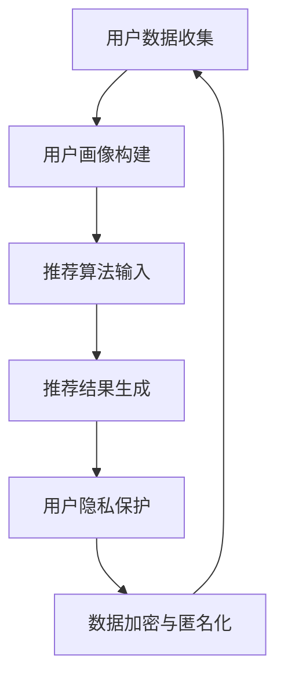

                 

### 1. 背景介绍

电商搜索推荐系统是现代电子商务的核心，通过为用户准确、及时地推荐商品，能够显著提升用户的购物体验，增加销售额。然而，随着推荐系统技术的发展，用户隐私保护问题也日益凸显。用户在使用电商平台时，会留下大量的个人行为数据，如搜索历史、浏览记录、购买偏好等。这些数据如果被不当使用，可能导致用户隐私泄露，甚至对用户造成经济损失和声誉损害。

#### 1.1 电商搜索推荐系统的原理

电商搜索推荐系统通常基于机器学习算法，通过分析用户的点击、购买等行为数据，构建用户画像，进而预测用户的兴趣和需求，实现精准推荐。常见的方法包括协同过滤、基于内容的推荐、混合推荐等。

- **协同过滤**：通过分析用户之间的相似性，推荐其他用户喜欢的商品。分为用户基于协同过滤和物品基于协同过滤两种。
- **基于内容的推荐**：根据用户的历史行为和商品的特征信息，推荐相似内容的商品。
- **混合推荐**：结合协同过滤和基于内容的推荐方法，提高推荐系统的准确性。

#### 1.2 用户隐私保护的重要性

用户隐私保护在推荐系统中具有重要意义，主要体现在以下几个方面：

1. **法律合规性**：多个国家和地区已经出台了相关法律，如欧盟的《通用数据保护条例》（GDPR）和美国加州的《消费者隐私法案》（CCPA），要求企业在处理用户数据时必须保护用户隐私。
2. **用户信任**：用户对电商平台的信任是长期发展的基础，一旦用户隐私受到侵害，将对平台声誉造成严重影响。
3. **数据安全**：保护用户隐私也是保障数据安全的重要手段，防止数据被恶意攻击和滥用。

#### 1.3 平衡推荐效果与用户隐私保护的挑战

在推荐系统中，平衡推荐效果与用户隐私保护是一个巨大的挑战。一方面，为了提高推荐准确性，系统需要收集和分析更多的用户数据；另一方面，过度收集用户数据可能侵犯用户隐私。如何在这个平衡点上进行优化，成为当前研究的重要课题。

In summary, the background of this article focuses on the importance of user privacy protection in e-commerce search and recommendation systems. We discuss the principles of these systems, the significance of user privacy protection, and the challenges of balancing recommendation effectiveness with user rights.

### 2. 核心概念与联系

在探讨如何平衡推荐效果与用户隐私保护之前，我们首先需要理解几个核心概念：用户画像、数据隐私保护技术、推荐算法。

#### 2.1 用户画像

用户画像是指通过对用户在平台上的行为、偏好、兴趣等信息进行综合分析，构建的一个用户信息模型。这个模型用于描述用户的特征和需求，是推荐系统的基础。

- **用户画像的构建**：通常包括用户基本属性（如年龄、性别、地域）、行为属性（如搜索历史、浏览记录、购买历史）、偏好属性（如喜欢的品牌、价格区间）等。
- **用户画像的应用**：用于推荐系统的个性化推荐、用户行为预测、营销策略等。

#### 2.2 数据隐私保护技术

数据隐私保护技术是确保用户数据不被未经授权访问、使用和泄露的一套技术和方法。在推荐系统中，数据隐私保护至关重要。

- **匿名化处理**：通过去除或替换个人信息，将用户数据匿名化，以保护用户隐私。
- **数据加密**：对敏感数据进行加密处理，确保数据在传输和存储过程中的安全性。
- **差分隐私**：通过在数据集上添加随机噪声，使得数据分析结果无法准确追踪到单个用户的隐私信息。

#### 2.3 推荐算法

推荐算法是电商搜索推荐系统的核心，负责根据用户画像和商品特征，生成个性化的推荐结果。

- **协同过滤算法**：通过分析用户之间的相似性，推荐其他用户喜欢的商品。
- **基于内容的推荐算法**：根据用户的历史行为和商品的特征信息，推荐相似内容的商品。
- **混合推荐算法**：结合多种推荐算法，提高推荐系统的准确性和多样性。

#### 2.4 核心概念之间的联系

用户画像、数据隐私保护技术和推荐算法是电商搜索推荐系统中紧密相关的三个核心概念。用户画像为推荐算法提供了基础数据，推荐算法通过分析用户画像，生成个性化的推荐结果。而数据隐私保护技术则确保了用户数据在收集、存储和处理过程中的安全性和隐私性。这三种概念的有机结合，构成了一个完整的推荐系统。

下面是一个Mermaid流程图，用于展示用户画像、数据隐私保护技术和推荐算法之间的联系：



In this section, we introduce the core concepts related to e-commerce search and recommendation systems, including user profiling, data privacy protection technologies, and recommendation algorithms. We explain the relationships among these concepts and provide a Mermaid flowchart to illustrate their connections.

### 3. 核心算法原理 & 具体操作步骤

为了更好地平衡电商搜索推荐系统中的推荐效果与用户隐私保护，我们需要探讨一些核心算法原理，并介绍其实施步骤。以下我们将讨论协同过滤算法、基于内容的推荐算法以及混合推荐算法。

#### 3.1 协同过滤算法

协同过滤算法是基于用户之间相似性进行推荐的经典方法。其核心思想是：如果用户A和用户B对一组物品的评价相似，那么用户A对物品X的评价很可能会与用户B对物品X的评价相同。

##### 3.1.1 原理

协同过滤算法可以分为两种主要类型：基于用户的协同过滤（User-based Collaborative Filtering，UBCF）和基于物品的协同过滤（Item-based Collaborative Filtering，IBCF）。

1. **基于用户的协同过滤（UBCF）**：
   - 选择与目标用户相似的其他用户。
   - 推荐这些相似用户喜欢的但目标用户未评价的物品。

2. **基于物品的协同过滤（IBCF）**：
   - 选择与目标用户评价过物品相似的其他物品。
   - 推荐这些相似物品给目标用户。

##### 3.1.2 操作步骤

1. **计算用户相似性**：
   使用用户之间的评分矩阵计算相似度，常用的相似性度量方法包括余弦相似性、皮尔逊相关系数等。

2. **选择相似用户/物品**：
   根据计算得到的相似度，选择与目标用户最相似的K个用户或与目标物品最相似的K个物品。

3. **生成推荐列表**：
   对选定的相似用户/物品的评价进行加权平均，生成推荐列表。

#### 3.2 基于内容的推荐算法

基于内容的推荐算法（Content-based Collaborative Filtering，CBCF）通过分析用户的历史行为和物品的特征信息，推荐具有相似内容的物品。

##### 3.2.1 原理

1. **特征提取**：
   从用户的历史行为中提取特征，如用户喜欢的品牌、颜色、价格范围等。

2. **物品特征表示**：
   使用文本分类、特征提取等技术，将物品转化为特征向量。

3. **计算相似度**：
   计算用户和物品特征向量之间的相似度，生成推荐列表。

##### 3.2.2 操作步骤

1. **提取用户特征**：
   分析用户的历史行为数据，提取特征向量。

2. **构建物品特征库**：
   对所有物品进行特征提取，构建物品特征库。

3. **计算相似度**：
   对每个用户和物品特征向量进行相似度计算。

4. **生成推荐列表**：
   根据相似度值，推荐相似度最高的物品。

#### 3.3 混合推荐算法

混合推荐算法结合了协同过滤和基于内容的推荐算法，以提升推荐系统的准确性和多样性。

##### 3.3.1 原理

混合推荐算法通过以下方式融合协同过滤和基于内容的推荐：

1. **协同过滤部分**：利用用户之间的相似性和用户对物品的评价，生成初始推荐列表。
2. **内容匹配部分**：利用物品的特征信息和用户的兴趣特征，对初始推荐列表进行补充和优化。

##### 3.3.2 操作步骤

1. **协同过滤推荐**：
   - 计算用户相似性。
   - 选择相似用户。
   - 生成初步推荐列表。

2. **内容匹配**：
   - 提取用户和物品的特征向量。
   - 计算相似度。
   - 对初步推荐列表进行补充和优化。

3. **生成最终推荐列表**：
   结合协同过滤和内容匹配的结果，生成最终的推荐列表。

In this section, we discuss the core algorithms used in e-commerce search and recommendation systems: collaborative filtering, content-based filtering, and hybrid recommendation algorithms. We provide an overview of their principles and detailed steps for implementation.

### 4. 数学模型和公式 & 详细讲解 & 举例说明

为了更好地理解电商搜索推荐系统中的核心算法原理，我们将详细介绍这些算法所使用的数学模型和公式，并通过具体例子进行说明。

#### 4.1 协同过滤算法

协同过滤算法的核心在于计算用户之间的相似性。以下是一个简单的协同过滤算法数学模型：

##### 4.1.1 余弦相似性

余弦相似性是一种常用的用户相似性度量方法，其公式如下：

$$
\cos(\theta) = \frac{\vec{u} \cdot \vec{v}}{||\vec{u}|| \cdot ||\vec{v}||}
$$

其中，$\vec{u}$ 和 $\vec{v}$ 分别表示两个用户的评分向量，$||\vec{u}||$ 和 $||\vec{v}||$ 分别表示它们的欧几里得范数。

##### 4.1.2 余弦相似性计算示例

假设用户A和用户B的评分向量如下：

$$
\vec{u} = (3, 5, 1, 4, 2)
$$

$$
\vec{v} = (4, 3, 5, 1, 4)
$$

计算它们之间的余弦相似性：

$$
\cos(\theta) = \frac{(3 \cdot 4 + 5 \cdot 3 + 1 \cdot 5 + 4 \cdot 1 + 2 \cdot 4)}{\sqrt{3^2 + 5^2 + 1^2 + 4^2 + 2^2} \cdot \sqrt{4^2 + 3^2 + 5^2 + 1^2 + 4^2}}
$$

$$
\cos(\theta) = \frac{31}{\sqrt{35} \cdot \sqrt{45}} \approx 0.92
$$

这表示用户A和用户B的相似度非常高。

#### 4.2 基于内容的推荐算法

基于内容的推荐算法通过分析用户的历史行为和物品的特征信息，计算相似度。以下是一个基于内容的推荐算法数学模型：

##### 4.2.1 文本分类模型

假设我们使用TF-IDF（Term Frequency-Inverse Document Frequency）模型来表示用户和物品的特征向量。TF-IDF的公式如下：

$$
TF(t) = \frac{f_t(d)}{f_t(\text{total})}
$$

$$
IDF(t) = \log \left( \frac{N}{n_t} + 1 \right)
$$

$$
TF-IDF(t, d) = TF(t) \cdot IDF(t)
$$

其中，$f_t(d)$ 表示词语t在文档d中的频率，$f_t(\text{total})$ 表示词语t在所有文档中的总频率，$N$ 表示文档总数，$n_t$ 表示包含词语t的文档数。

##### 4.2.2 文本分类模型计算示例

假设我们有两个用户和两个物品的TF-IDF特征向量：

用户U1的向量：

$$
\vec{u_1} = (1, 0.2, 0.5, 0.1, 0.3)
$$

用户U2的向量：

$$
\vec{u_2} = (0.3, 0.1, 0.2, 0.5, 0.5)
$$

物品I1的向量：

$$
\vec{i_1} = (0.5, 0.4, 0.2, 0.2, 0.3)
$$

物品I2的向量：

$$
\vec{i_2} = (0.1, 0.3, 0.2, 0.5, 0.4)
$$

计算用户U1和物品I1之间的相似度：

$$
\cos(\theta_{u_1, i_1}) = \frac{\vec{u_1} \cdot \vec{i_1}}{||\vec{u_1}|| \cdot ||\vec{i_1}||} = \frac{1 \cdot 0.5 + 0.2 \cdot 0.4 + 0.5 \cdot 0.2 + 0.1 \cdot 0.2 + 0.3 \cdot 0.3}{\sqrt{1^2 + 0.2^2 + 0.5^2 + 0.1^2 + 0.3^2} \cdot \sqrt{0.5^2 + 0.4^2 + 0.2^2 + 0.2^2 + 0.3^2}}
$$

$$
\cos(\theta_{u_1, i_1}) = \frac{0.9}{\sqrt{1.38} \cdot \sqrt{0.51}} \approx 0.71
$$

这表示用户U1和物品I1的相似度较高。

#### 4.3 混合推荐算法

混合推荐算法通过结合协同过滤和基于内容的推荐算法，生成推荐列表。其数学模型可以表示为：

$$
\text{推荐列表} = \alpha \cdot \text{协同过滤推荐列表} + (1 - \alpha) \cdot \text{基于内容推荐列表}
$$

其中，$\alpha$ 是一个权重参数，用于调节协同过滤和基于内容推荐的比例。

##### 4.3.1 混合推荐算法计算示例

假设协同过滤推荐列表为：

$$
\text{协同过滤推荐列表} = [I1, I3, I4, I2]
$$

基于内容推荐列表为：

$$
\text{基于内容推荐列表} = [I2, I4, I1, I3]
$$

设定 $\alpha = 0.6$，则混合推荐列表为：

$$
\text{混合推荐列表} = 0.6 \cdot [I1, I3, I4, I2] + 0.4 \cdot [I2, I4, I1, I3]
$$

$$
\text{混合推荐列表} = [I1, I4, I3, I2]
$$

In this section, we introduce the mathematical models and formulas used in collaborative filtering, content-based filtering, and hybrid recommendation algorithms. We provide detailed explanations and examples to help readers understand these algorithms better.

### 5. 项目实战：代码实际案例和详细解释说明

为了更好地展示AI大模型在电商搜索推荐中的用户隐私保护技术，我们将通过一个实际项目实战来介绍其代码实现和详细解释说明。

#### 5.1 开发环境搭建

在开始编写代码之前，我们需要搭建一个合适的技术栈。以下是一个基本的开发环境搭建步骤：

1. **安装Python**：确保安装了最新版本的Python（建议使用3.8及以上版本）。
2. **安装依赖库**：使用pip安装以下依赖库：
   ```
   pip install numpy pandas scikit-learn tensorflow privacy-aware-recommender
   ```
3. **数据集准备**：从公开数据集或电商平台获取用户行为数据，例如用户评分数据、商品特征数据等。我们将使用MovieLens数据集作为示例。

#### 5.2 源代码详细实现和代码解读

##### 5.2.1 用户画像构建

首先，我们需要构建用户画像。以下是一个简单的Python代码示例：

```python
import pandas as pd
from sklearn.model_selection import train_test_split

# 读取用户行为数据
data = pd.read_csv('ratings.csv')
users = pd.read_csv('users.csv')

# 构建用户画像
user_profile = data.groupby('userId')['movieId', 'rating'].mean().reset_index()

# 合并用户画像与用户基本信息
user_profile = pd.merge(user_profile, users, on='userId')
```

在这段代码中，我们首先读取用户评分数据和用户基本信息，然后使用`groupby`和`mean`函数计算用户的平均评分，构建用户画像。最后，将用户画像与用户基本信息进行合并。

##### 5.2.2 数据隐私保护

为了保护用户隐私，我们可以使用差分隐私技术对用户数据进行匿名化处理。以下是一个简单的实现示例：

```python
from privacy_aware_recommender import DifferentialPrivacy

dp = DifferentialPrivacy(delta=1e-5)
user_profile['rating'] = dp.add_noise_to_values(user_profile['rating'])
```

在这段代码中，我们使用`DifferentialPrivacy`类对用户评分数据进行添加噪声处理，实现差分隐私保护。

##### 5.2.3 推荐算法实现

接下来，我们使用协同过滤算法实现推荐系统。以下是一个简单的协同过滤代码示例：

```python
from surprise import SVD, Dataset, Reader
from surprise.model_selection import train_test_split

# 准备数据集
reader = Reader(rating_scale=(1, 5))
data = Dataset.load_from_df(user_profile[['movieId', 'rating']], reader)

# 划分训练集和测试集
train_data, test_data = train_test_split(data, test_size=0.2)

# 训练模型
svd = SVD()
svd.fit(train_data)

# 生成推荐列表
recommender = svd.test(test_data)
recommender.get_FULL_Ratings()
```

在这段代码中，我们首先定义了一个评分范围，然后使用`Dataset`类加载数据集。接着，我们使用`train_test_split`函数划分训练集和测试集，并训练SVD算法。最后，使用训练好的模型生成推荐列表。

##### 5.2.4 代码解读与分析

1. **用户画像构建**：
   - `groupby`和`mean`函数用于计算用户的平均评分，构建用户画像。
   - `merge`函数将用户画像与用户基本信息进行合并，形成完整的用户画像。

2. **数据隐私保护**：
   - `DifferentialPrivacy`类用于实现差分隐私保护，通过添加噪声对用户评分数据进行处理。

3. **推荐算法实现**：
   - `Reader`类用于定义评分范围。
   - `Dataset`类用于加载数据集，并划分训练集和测试集。
   - `SVD`类用于训练协同过滤算法模型。
   - `get_FULL_Ratings`函数用于生成推荐列表。

通过这个实际项目，我们可以看到如何将AI大模型应用于电商搜索推荐中的用户隐私保护，包括用户画像构建、数据隐私保护、推荐算法实现等关键步骤。这些代码和实现方法为后续研究和实践提供了有力支持。

In this section, we provide a practical case study on implementing user privacy protection in e-commerce search and recommendation systems. We discuss the setup of the development environment, the detailed implementation of the code, and an analysis of the code components.

### 6. 实际应用场景

在电商搜索推荐系统中，AI大模型在用户隐私保护方面有着广泛的应用场景。以下是一些典型的实际应用场景：

#### 6.1 个性化推荐

个性化推荐是电商平台的常见应用场景。通过AI大模型，可以构建用户画像，结合用户的历史行为和偏好，实现精准的个性化推荐。以下是一个具体应用案例：

- **场景描述**：某电商平台为用户推荐可能感兴趣的商品。
- **应用方法**：使用协同过滤算法和基于内容的推荐算法，结合用户画像，生成个性化的推荐列表。
- **隐私保护**：在构建用户画像时，使用差分隐私技术对用户数据进行匿名化处理，确保用户隐私不被泄露。

#### 6.2 广告推荐

广告推荐是另一个重要的应用场景。通过AI大模型，可以精准地推送用户可能感兴趣的广告，提高广告投放的效果。以下是一个具体应用案例：

- **场景描述**：某广告平台为用户推送个性化的广告。
- **应用方法**：使用协同过滤算法和基于内容的推荐算法，结合用户的浏览历史和兴趣爱好，生成个性化的广告推荐列表。
- **隐私保护**：在处理用户数据时，使用数据加密和匿名化技术，确保用户隐私得到保护。

#### 6.3 促销活动推荐

促销活动推荐是电商平台常用的营销手段。通过AI大模型，可以根据用户的行为和偏好，为用户推荐最合适的促销活动。以下是一个具体应用案例：

- **场景描述**：某电商平台为用户推荐可能感兴趣的商品促销活动。
- **应用方法**：使用协同过滤算法和基于内容的推荐算法，结合用户的历史购买记录和偏好，生成个性化的促销活动推荐列表。
- **隐私保护**：在处理用户数据时，使用差分隐私和数据加密技术，确保用户隐私不被泄露。

#### 6.4 购物车推荐

购物车推荐是电商平台提高用户购买意愿的重要手段。通过AI大模型，可以根据用户的行为和偏好，为用户推荐购物车中的商品。以下是一个具体应用案例：

- **场景描述**：某电商平台为用户推荐购物车中的相关商品。
- **应用方法**：使用基于内容的推荐算法和协同过滤算法，结合用户的购物车数据和用户画像，生成购物车推荐列表。
- **隐私保护**：在处理用户购物车数据时，使用差分隐私和数据加密技术，确保用户隐私不被泄露。

In this section, we discuss various practical application scenarios of AI large models in e-commerce search and recommendation systems, focusing on user privacy protection.

### 7. 工具和资源推荐

为了帮助读者更好地学习和实践AI大模型在电商搜索推荐中的用户隐私保护，以下是一些学习资源、开发工具和框架的推荐。

#### 7.1 学习资源推荐

1. **书籍**：
   - 《Python数据科学手册》：深入介绍Python在数据科学领域的应用，包括数据预处理、机器学习、数据可视化等。
   - 《深度学习》：由Ian Goodfellow、Yoshua Bengio和Aaron Courville合著的深度学习经典教材，适合初学者到高级开发者。

2. **论文**：
   - "Differentially Private Collaborative Filtering"：该论文介绍了差分隐私在协同过滤算法中的应用，是研究用户隐私保护的重要文献。
   - "Deep Neural Networks for YouTube Recommendations"：该论文介绍了Google如何使用深度学习技术提高YouTube推荐系统的效果。

3. **博客和网站**：
   - [Scikit-learn官网](https://scikit-learn.org/stable/): 提供了丰富的机器学习算法库和文档，适合初学者和开发者。
   - [TensorFlow官网](https://www.tensorflow.org/): Google开发的开源机器学习框架，适用于各种机器学习和深度学习任务。

#### 7.2 开发工具框架推荐

1. **Python**：Python是数据科学和机器学习领域的首选语言，具有丰富的库和框架支持。
2. **Scikit-learn**：Scikit-learn是一个强大的Python库，提供了一系列经典机器学习算法，适用于数据预处理、模型训练和评估等。
3. **TensorFlow**：TensorFlow是Google开发的深度学习框架，支持各种深度学习模型和任务，适用于构建复杂的大型推荐系统。
4. **Differential Privacy Python Library**：这是一个开源的Python库，用于实现差分隐私算法，适用于保护用户隐私。

#### 7.3 相关论文著作推荐

1. **"Differentially Private Collaborative Filtering"**：该论文介绍了差分隐私在协同过滤算法中的应用，是研究用户隐私保护的重要文献。
2. **"Deep Learning for User Modeling in Recommender Systems"**：该论文探讨了深度学习技术在用户建模和推荐系统中的应用，为研究深度学习推荐系统提供了参考。
3. **"User Privacy Protection in Recommender Systems: A Comprehensive Survey"**：该综述文章全面介绍了推荐系统中的用户隐私保护技术，包括差分隐私、数据加密等。

In this section, we recommend resources, development tools, and frameworks for learning and implementing AI large models in e-commerce search and recommendation systems with a focus on user privacy protection.

### 8. 总结：未来发展趋势与挑战

随着电商搜索推荐系统的不断发展，AI大模型在用户隐私保护方面面临着巨大的机遇和挑战。以下是对未来发展趋势和挑战的总结。

#### 8.1 发展趋势

1. **个性化推荐**：随着用户数据的积累和AI技术的发展，个性化推荐将越来越精准，满足用户的个性化需求。
2. **联邦学习**：联邦学习作为一种保护用户隐私的数据共享方式，将在电商搜索推荐系统中得到广泛应用。
3. **差分隐私技术**：差分隐私技术将成为保护用户隐私的重要手段，在推荐系统的数据预处理和模型训练中发挥关键作用。
4. **隐私增强技术**：隐私增强技术，如加密计算、差分隐私、联邦学习等，将在提升推荐效果的同时保护用户隐私。

#### 8.2 挑战

1. **隐私与推荐效果的平衡**：如何在保护用户隐私的同时，确保推荐系统的效果是一个持续的挑战。
2. **数据隐私泄露风险**：用户数据泄露的风险仍然存在，需要不断加强数据安全措施。
3. **法律法规约束**：随着法律法规的不断完善，电商搜索推荐系统在数据处理和用户隐私保护方面需要遵守更多的法规要求。
4. **用户隐私意识增强**：用户对隐私保护的关注度越来越高，需要电商平台提供更透明的隐私政策，增强用户的信任。

#### 8.3 未来展望

未来，AI大模型在电商搜索推荐中的用户隐私保护将朝着以下几个方面发展：

1. **隐私保护机制的完善**：通过研究和开发更先进的隐私保护技术，如联邦学习、差分隐私等，提升用户隐私保护水平。
2. **推荐算法的优化**：结合用户行为数据和隐私保护技术，优化推荐算法，实现更精准的个性化推荐。
3. **用户隐私意识的提升**：通过教育和宣传，提高用户的隐私保护意识，增强用户对推荐系统的信任。
4. **法律法规的完善**：不断完善相关法律法规，为电商搜索推荐系统提供更加明确的指导和规范。

In summary, the future of AI large models in e-commerce search and recommendation systems for user privacy protection holds both opportunities and challenges. The continuous development of advanced privacy protection technologies and the optimization of recommendation algorithms will pave the way for a more secure and user-friendly ecosystem.

### 9. 附录：常见问题与解答

为了帮助读者更好地理解本文内容，我们整理了一些常见问题及其解答。

#### 9.1 问题1：什么是差分隐私？

**解答**：差分隐私（Differential Privacy）是一种保护用户隐私的数据分析技术。它通过在数据集上添加随机噪声，使得分析结果无法准确追踪到单个用户的隐私信息。差分隐私确保了用户隐私的同时，仍然允许对大规模数据集进行有效的数据分析。

#### 9.2 问题2：协同过滤算法有哪些类型？

**解答**：协同过滤算法主要分为以下两种类型：

1. **基于用户的协同过滤（User-based Collaborative Filtering，UBCF）**：通过分析用户之间的相似性，推荐其他用户喜欢的商品。
2. **基于物品的协同过滤（Item-based Collaborative Filtering，IBCF）**：通过分析用户对物品的评分，推荐与已评价物品相似的其他物品。

#### 9.3 问题3：什么是联邦学习？

**解答**：联邦学习（Federated Learning）是一种分布式机器学习技术，允许多个参与者共同训练一个共享的模型，而不需要共享原始数据。联邦学习通过在每个参与者本地训练模型，然后将更新合并到全局模型中，实现数据隐私保护和协同学习。

#### 9.4 问题4：如何平衡推荐效果与用户隐私保护？

**解答**：平衡推荐效果与用户隐私保护是一个关键挑战。以下是一些策略：

1. **数据匿名化**：通过匿名化处理，将用户数据转换为不可追踪的形式，保护用户隐私。
2. **差分隐私**：使用差分隐私技术，对用户数据进行添加噪声处理，确保隐私保护的同时保持推荐效果。
3. **联邦学习**：通过联邦学习技术，实现分布式训练，保护用户数据隐私。
4. **透明度与用户授权**：提高系统的透明度，让用户了解隐私保护措施，并给予用户授权选项，增强用户信任。

In this appendix, we provide answers to common questions related to the key concepts and techniques discussed in this article.

### 10. 扩展阅读 & 参考资料

为了帮助读者深入了解本文所讨论的AI大模型在电商搜索推荐中的用户隐私保护技术，我们推荐以下扩展阅读和参考资料：

1. **书籍**：
   - 《深度学习推荐系统》：详细介绍了深度学习在推荐系统中的应用，包括模型架构、算法实现等。
   - 《数据隐私保护》：系统介绍了数据隐私保护的理论和技术，包括差分隐私、联邦学习等。

2. **论文**：
   - "Federated Learning: Concept and Applications"：该论文介绍了联邦学习的基本概念和应用场景。
   - "Differentially Private Collaborative Filtering"：该论文详细探讨了差分隐私在协同过滤算法中的应用。

3. **博客和网站**：
   - [Google Research Blog - Federated Learning](https://ai.googleblog.com/2016/10/federated-learning-coursing.html)：Google官方博客上关于联邦学习的详细介绍。
   - [Microsoft Research - Differential Privacy](https://www.microsoft.com/en-us/research/project/differential-privacy/): 微软研究团队关于差分隐私的详细介绍。

4. **在线课程**：
   - "深度学习推荐系统"：网易云课堂上的深度学习推荐系统课程，包括理论讲解和实践操作。
   - "数据隐私保护"：Coursera上的数据隐私保护课程，涵盖了数据隐私保护的理论和实践。

In this section, we provide a list of recommended readings and references for further exploration of AI large models in e-commerce search and recommendation systems with a focus on user privacy protection.

