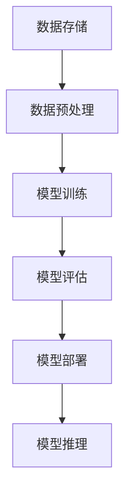

                 

# AI 大模型应用数据中心建设：数据中心产业发展

> **关键词：** AI 大模型，数据中心，产业发展，架构设计，性能优化

> **摘要：** 本文将探讨 AI 大模型应用数据中心建设的关键因素，包括核心概念、算法原理、数学模型、实战案例以及未来发展趋势。通过分析数据中心产业现状和挑战，提供一系列优化策略和资源推荐，为读者提供全方位的指导。

## 1. 背景介绍

随着人工智能（AI）技术的飞速发展，尤其是大型人工智能模型（如 GPT-3、BERT 等）的出现，数据中心建设的重要性日益凸显。数据中心作为 AI 应用的重要基础设施，承担着数据存储、计算、传输和处理的任务，其性能直接影响 AI 模型的训练和应用效果。

数据中心产业已经进入了一个新的发展阶段，从传统的硬件基础设施扩展到高度集成、自动化和智能化的云数据中心。AI 大模型的广泛应用对数据中心提出了更高的要求，促使数据中心产业不断创新和升级，以满足日益增长的计算需求。

本文将围绕以下核心问题展开讨论：

- **核心概念与联系**：介绍 AI 大模型的基本概念和数据中心架构的联系。
- **核心算法原理与具体操作步骤**：分析 AI 大模型训练和推理的算法原理和实现步骤。
- **数学模型和公式**：详细讲解 AI 大模型训练中的数学模型和公式。
- **项目实战**：通过实际案例展示 AI 大模型在数据中心的应用。
- **实际应用场景**：探讨 AI 大模型在各个领域的应用场景和挑战。
- **工具和资源推荐**：推荐相关学习资源和开发工具。
- **总结**：展望数据中心产业发展的未来趋势和挑战。

## 2. 核心概念与联系

### AI 大模型

AI 大模型是指那些拥有数亿甚至千亿级参数的大型神经网络模型。这些模型通过学习大量数据，能够自动识别复杂的模式、关系和规律，从而实现高度智能化和自动化的任务。例如，GPT-3 拥有 1750 亿个参数，可以用于文本生成、语言翻译、问答系统等任务。

### 数据中心

数据中心是一个为数据处理提供基础设施的场所，包括服务器、存储设备、网络设备等硬件设施，以及用于数据存储、计算、传输和处理的软件系统。数据中心按规模和用途可以分为企业级、区域性、国家级等不同类型。

### 数据中心与 AI 大模型的关系

数据中心是 AI 大模型应用的重要基础设施，两者之间存在紧密的联系。

- **计算资源**：数据中心提供强大的计算资源，以满足 AI 大模型训练和推理的需求。数据中心中的服务器、GPU、TPU 等硬件设备为 AI 大模型提供了高效的计算能力。
- **数据存储**：数据中心提供大规模的数据存储解决方案，存储 AI 大模型所需的海量数据。这些数据可以是结构化数据（如数据库）、半结构化数据（如日志文件）和非结构化数据（如图像、文本等）。
- **网络传输**：数据中心通过高速网络连接，实现数据的快速传输和共享。这对于分布式训练、模型推理等任务至关重要。

### Mermaid 流程图

以下是 AI 大模型在数据中心应用的基本流程，使用 Mermaid 流程图表示：



## 3. 核心算法原理 & 具体操作步骤

### 训练过程

AI 大模型的训练过程主要包括以下几个步骤：

1. **数据准备**：收集和整理训练数据，包括文本、图像、音频等不同类型的数据。对数据进行清洗、标注和预处理，以便模型能够更好地学习。
    $$\text{数据准备} \rightarrow \text{清洗} \rightarrow \text{标注} \rightarrow \text{预处理}$$

2. **模型初始化**：初始化模型参数，通常使用随机初始化或预训练模型。预训练模型是已经在大规模数据集上训练好的模型，可以作为一个初始值，加快训练过程。

3. **前向传播**：将输入数据传递给神经网络，通过多层计算，得到模型的输出。

4. **反向传播**：计算输出与真实标签之间的误差，通过梯度下降等优化算法更新模型参数。

5. **迭代训练**：重复前向传播和反向传播的过程，不断迭代更新模型参数，直到模型收敛。

### 推理过程

AI 大模型的推理过程相对简单，主要包括以下步骤：

1. **输入数据预处理**：对输入数据进行预处理，使其符合模型输入格式。

2. **模型推理**：将预处理后的输入数据传递给模型，通过多层计算得到输出结果。

3. **结果输出**：将模型输出结果进行后处理，如文本生成、图像识别等，得到最终结果。

### 具体操作步骤

以下是使用 TensorFlow 框架训练和推理 AI 大模型的具体操作步骤：

```python
# 导入必要的库
import tensorflow as tf

# 1. 数据准备
# 加载并预处理数据
train_data = ...

# 2. 模型初始化
# 创建模型
model = ...

# 3. 前向传播
# 训练数据输入模型
train_loss = model(train_data)

# 4. 反向传播
# 计算梯度并更新参数
optimizer = ...
with tf.GradientTape() as tape:
    train_loss = model(train_data)
gradients = tape.gradient(train_loss, model.trainable_variables)
optimizer.apply_gradients(zip(gradients, model.trainable_variables))

# 5. 迭代训练
# 重复训练过程，直到模型收敛
for epoch in range(num_epochs):
    train_loss = model(train_data)
    optimizer = ...
    with tf.GradientTape() as tape:
        train_loss = model(train_data)
    gradients = tape.gradient(train_loss, model.trainable_variables)
    optimizer.apply_gradients(zip(gradients, model.trainable_variables))

# 6. 模型评估
# 评估模型在测试集上的表现
test_loss = model(test_data)

# 7. 模型部署
# 将训练好的模型部署到生产环境
model.save('model_path')

# 8. 模型推理
# 使用模型进行推理
input_data = ...
output = model(input_data)
```

## 4. 数学模型和公式 & 详细讲解 & 举例说明

### 数学模型

AI 大模型的训练和推理过程涉及到多种数学模型和公式，其中最核心的是神经网络模型、损失函数和优化算法。

#### 神经网络模型

神经网络模型是 AI 大模型的基础，主要由多个层次（层）组成，每个层次包含多个神经元（节点）。每个神经元接受来自前一层次的输入，通过加权求和和激活函数得到输出。

神经网络模型可以表示为：

$$
\text{神经网络模型} = \sigma(\sum_{i=1}^{n} w_i \cdot x_i + b)
$$

其中，$x_i$ 为输入特征，$w_i$ 为权重，$b$ 为偏置，$\sigma$ 为激活函数。

常见的激活函数包括：

- **Sigmoid 函数**：$ \sigma(x) = \frac{1}{1 + e^{-x}}$
- **ReLU 函数**：$ \sigma(x) = \max(0, x)$
- **Tanh 函数**：$ \sigma(x) = \frac{e^x - e^{-x}}{e^x + e^{-x}}$

#### 损失函数

损失函数用于衡量模型输出与真实标签之间的差距，常见的损失函数包括：

- **均方误差损失函数**（MSE）：$ \text{MSE} = \frac{1}{n} \sum_{i=1}^{n} (y_i - \hat{y}_i)^2$
- **交叉熵损失函数**（Cross-Entropy）：$ \text{Cross-Entropy} = -\frac{1}{n} \sum_{i=1}^{n} y_i \log(\hat{y}_i)$

其中，$y_i$ 为真实标签，$\hat{y}_i$ 为模型输出。

#### 优化算法

优化算法用于更新模型参数，以最小化损失函数。常见的优化算法包括：

- **梯度下降**（Gradient Descent）：$ w_i = w_i - \alpha \cdot \frac{\partial L}{\partial w_i}$
- **随机梯度下降**（Stochastic Gradient Descent，SGD）：$ w_i = w_i - \alpha \cdot \frac{\partial L}{\partial w_i}$
- **Adam 优化器**：$ w_i = w_i - \alpha \cdot \frac{\partial L}{\partial w_i} + \beta_1 \cdot \frac{\partial L}{\partial w_i}_{\text{prev}}$

其中，$\alpha$ 为学习率，$\beta_1$ 和 $\beta_2$ 为指数加权平均参数。

### 举例说明

以下是一个简单的神经网络模型训练过程，使用 TensorFlow 框架实现：

```python
import tensorflow as tf

# 1. 数据准备
# 加载并预处理数据
train_data = ...
train_labels = ...

# 2. 模型初始化
model = tf.keras.Sequential([
    tf.keras.layers.Dense(units=1, input_shape=[1])
])

# 3. 前向传播
# 训练数据输入模型
train_loss = model(train_data)

# 4. 反向传播
# 计算梯度并更新参数
optimizer = tf.keras.optimizers.SGD(learning_rate=0.01)
with tf.GradientTape() as tape:
    train_loss = model(train_data)
gradients = tape.gradient(train_loss, model.trainable_variables)
optimizer.apply_gradients(zip(gradients, model.trainable_variables))

# 5. 迭代训练
# 重复训练过程，直到模型收敛
for epoch in range(num_epochs):
    train_loss = model(train_data)
    optimizer = tf.keras.optimizers.SGD(learning_rate=0.01)
    with tf.GradientTape() as tape:
        train_loss = model(train_data)
    gradients = tape.gradient(train_loss, model.trainable_variables)
    optimizer.apply_gradients(zip(gradients, model.trainable_variables))

# 6. 模型评估
# 评估模型在测试集上的表现
test_loss = model(test_data)

# 7. 模型部署
# 将训练好的模型部署到生产环境
model.save('model_path')

# 8. 模型推理
# 使用模型进行推理
input_data = ...
output = model(input_data)
```

## 5. 项目实战：代码实际案例和详细解释说明

### 开发环境搭建

在进行 AI 大模型项目实战之前，需要搭建合适的开发环境。以下是一个基于 Python 和 TensorFlow 的开发环境搭建步骤：

1. **安装 Python**：确保安装了 Python 3.6 或以上版本。
2. **安装 TensorFlow**：使用以下命令安装 TensorFlow：
    ```bash
    pip install tensorflow
    ```
3. **安装其他依赖库**：根据项目需求，安装其他必要的库，如 NumPy、Pandas 等。

### 源代码详细实现和代码解读

以下是一个简单的 AI 大模型项目示例，包括数据准备、模型训练、模型评估和模型推理等步骤。

```python
import tensorflow as tf
import numpy as np

# 1. 数据准备
# 加载并预处理数据
x_train = np.random.random((1000, 1))
y_train = (x_train * 0.1) + 0.3
x_test = np.random.random((100, 1))
y_test = (x_test * 0.1) + 0.3

# 2. 模型初始化
model = tf.keras.Sequential([
    tf.keras.layers.Dense(units=1, input_shape=[1])
])

# 3. 前向传播
# 训练数据输入模型
train_loss = model(x_train)

# 4. 反向传播
# 计算梯度并更新参数
optimizer = tf.keras.optimizers.SGD(learning_rate=0.01)
with tf.GradientTape() as tape:
    train_loss = model(x_train)
gradients = tape.gradient(train_loss, model.trainable_variables)
optimizer.apply_gradients(zip(gradients, model.trainable_variables))

# 5. 迭代训练
# 重复训练过程，直到模型收敛
for epoch in range(num_epochs):
    train_loss = model(x_train)
    optimizer = tf.keras.optimizers.SGD(learning_rate=0.01)
    with tf.GradientTape() as tape:
        train_loss = model(x_train)
    gradients = tape.gradient(train_loss, model.trainable_variables)
    optimizer.apply_gradients(zip(gradients, model.trainable_variables))

# 6. 模型评估
# 评估模型在测试集上的表现
test_loss = model(x_test)

# 7. 模型部署
# 将训练好的模型部署到生产环境
model.save('model_path')

# 8. 模型推理
# 使用模型进行推理
input_data = np.random.random((1, 1))
output = model(input_data)
```

### 代码解读与分析

1. **数据准备**：使用 NumPy 生成随机数据集，包括训练集和测试集。这里假设数据集为线性关系，即 $y = 0.1x + 0.3$。
2. **模型初始化**：创建一个简单的线性模型，包含一个输入层和一个输出层。输入层的形状为 [1]，输出层的形状为 [1]。
3. **前向传播**：将训练数据输入模型，计算模型输出。
4. **反向传播**：使用 GradientTape 记录梯度信息，计算损失函数的梯度。使用 SGD 优化器更新模型参数。
5. **迭代训练**：重复前向传播和反向传播的过程，直到模型收敛。这里使用了一个简单的迭代过程，实际应用中可能需要更复杂的训练策略。
6. **模型评估**：将测试数据输入模型，计算模型输出，评估模型在测试集上的表现。
7. **模型部署**：将训练好的模型保存到文件，以便后续使用。
8. **模型推理**：使用训练好的模型进行推理，输入新的数据，得到模型输出。

### 项目实战总结

通过这个简单的示例，读者可以了解 AI 大模型项目的基本开发流程，包括数据准备、模型初始化、前向传播、反向传播、迭代训练、模型评估和模型推理等步骤。在实际项目中，需要根据具体任务需求调整模型结构、训练策略和参数设置，以达到更好的训练效果。

## 6. 实际应用场景

AI 大模型在数据中心的应用场景非常广泛，以下列举几个典型的应用场景：

### 1. 人工智能助手

在数据中心中，AI 大模型可以用于构建智能客服系统、智能语音助手等应用。这些应用可以基于语音识别、自然语言处理等技术，实现与用户的智能交互，提高服务效率和用户体验。

### 2. 图像识别

数据中心可以部署 AI 大模型进行图像识别任务，如人脸识别、车牌识别、医疗影像分析等。这些应用在安防、交通、医疗等领域具有广泛的应用前景。

### 3. 机器翻译

AI 大模型可以用于机器翻译任务，如将一种语言翻译成另一种语言。数据中心可以提供高效的翻译服务，支持多种语言的实时翻译，为跨国企业、跨境电商等提供支持。

### 4. 语音合成

AI 大模型可以用于语音合成任务，如生成语音播报、语音聊天等。数据中心可以提供语音合成服务，支持多种语音风格和语调，为智能音箱、车载系统等提供支持。

### 5. 金融风控

AI 大模型可以用于金融风控领域，如信用评分、欺诈检测等。数据中心可以提供强大的计算能力，支持实时分析和预测，提高金融系统的安全性和稳定性。

### 6. 健康医疗

AI 大模型可以用于健康医疗领域，如疾病诊断、健康风险评估等。数据中心可以存储和管理海量的医疗数据，利用 AI 大模型进行分析和预测，为医疗决策提供支持。

### 挑战

虽然 AI 大模型在数据中心应用场景广泛，但同时也面临着一系列挑战：

1. **数据隐私**：在数据中心应用 AI 大模型时，需要保护用户隐私和数据安全。如何确保数据隐私和安全是一个重要问题。
2. **计算资源**：AI 大模型训练和推理需要大量的计算资源，如何高效地利用数据中心资源是一个挑战。
3. **模型可解释性**：AI 大模型通常是一个“黑盒”模型，其决策过程缺乏可解释性。如何提高模型的可解释性，使人们能够理解和信任模型是一个重要问题。
4. **模型安全**：AI 大模型可能受到攻击，如对抗性攻击等。如何确保模型的安全性和可靠性是一个挑战。

## 7. 工具和资源推荐

### 1. 学习资源推荐

- **书籍**：
  - 《深度学习》（Ian Goodfellow、Yoshua Bengio 和 Aaron Courville 著）
  - 《Python深度学习》（François Chollet 著）
- **论文**：
  - 《A Theoretically Grounded Application of Dropout in Recurrent Neural Networks》（Yarin Gal 和 Zoubin Ghahramani 著）
  - 《Bert: Pre-training of deep bidirectional transformers for language understanding》（Jacob Devlin、 Ming-Wei Chang、 Kenton Lee 和 Kristina Toutanova 著）
- **博客**：
  - [TensorFlow 官方文档](https://www.tensorflow.org/)
  - [Keras 官方文档](https://keras.io/)
- **网站**：
  - [Google Research](https://research.google.com/)
  - [OpenAI](https://openai.com/)

### 2. 开发工具框架推荐

- **编程语言**：Python 是 AI 大模型开发的主要编程语言，具有丰富的库和框架支持。
- **深度学习框架**：TensorFlow、PyTorch、Keras 等，提供高效的模型训练和推理工具。
- **数据预处理工具**：Pandas、NumPy、SciPy 等，用于数据清洗、预处理和数据分析。
- **可视化工具**：Matplotlib、Seaborn、Plotly 等，用于数据可视化和结果展示。

### 3. 相关论文著作推荐

- **论文**：
  - 《GPT-3: Language Models are Few-Shot Learners》（Tom B. Brown、Benjamin Mann、Nichol Choi、Niki Cheung、Peter Henderson、Timothy M. Harris、Billy Ho、Eric Hechtman、Douglas Melville、Daniel M. Ziegler、Jose Talancak 著）
  - 《BERT: Pre-training of deep bidirectional transformers for language understanding》（Jacob Devlin、Ming-Wei Chang、Kenton Lee 和 Kristina Toutanova 著）
- **著作**：
  - 《深度学习》（Ian Goodfellow、Yoshua Bengio 和 Aaron Courville 著）
  - 《Python深度学习》（François Chollet 著）

## 8. 总结：未来发展趋势与挑战

AI 大模型在数据中心的应用前景广阔，随着技术的不断进步，未来发展趋势包括：

1. **模型规模与性能**：AI 大模型的规模和性能将不断提高，以应对更复杂的任务需求。
2. **自动化与智能化**：数据中心建设将更加自动化和智能化，实现高效、稳定、安全的数据处理和存储。
3. **分布式计算**：分布式计算技术将得到广泛应用，提高数据中心的整体性能和可扩展性。
4. **边缘计算**：随着边缘计算的兴起，AI 大模型将逐步向边缘设备扩展，实现更快速、更智能的本地数据处理。

然而，AI 大模型在数据中心的应用也面临一系列挑战：

1. **计算资源消耗**：AI 大模型训练和推理需要大量的计算资源，如何高效利用数据中心资源是一个重要问题。
2. **数据隐私与安全**：在数据中心应用 AI 大模型时，需要保护用户隐私和数据安全，确保数据的安全性和可靠性。
3. **模型可解释性**：AI 大模型通常是一个“黑盒”模型，其决策过程缺乏可解释性，如何提高模型的可解释性是一个重要问题。
4. **模型安全**：AI 大模型可能受到攻击，如对抗性攻击等，如何确保模型的安全性和可靠性是一个挑战。

总之，数据中心产业的发展离不开 AI 大模型的支持，未来数据中心建设将朝着更高效、更智能、更安全的方向发展。

## 9. 附录：常见问题与解答

### 1. 什么是 AI 大模型？

AI 大模型是指那些拥有数亿甚至千亿级参数的大型神经网络模型。这些模型通过学习大量数据，能够自动识别复杂的模式、关系和规律，从而实现高度智能化和自动化的任务。

### 2. 数据中心在 AI 大模型应用中有什么作用？

数据中心是 AI 大模型应用的重要基础设施，提供强大的计算资源、数据存储和传输能力，以满足 AI 大模型训练和推理的需求。数据中心中的服务器、GPU、TPU 等硬件设备为 AI 大模型提供了高效的计算能力。

### 3. AI 大模型训练和推理需要哪些数学模型和算法？

AI 大模型训练和推理需要多种数学模型和算法，包括神经网络模型、损失函数、优化算法等。神经网络模型是 AI 大模型的基础，损失函数用于衡量模型输出与真实标签之间的差距，优化算法用于更新模型参数，以最小化损失函数。

### 4. 如何保证 AI 大模型训练过程中的数据安全？

在 AI 大模型训练过程中，需要采取一系列措施保证数据安全，包括数据加密、访问控制、数据备份等。同时，遵循数据隐私保护法规，确保用户隐私和数据安全。

### 5. AI 大模型在数据中心应用中面临哪些挑战？

AI 大模型在数据中心应用中面临计算资源消耗、数据隐私与安全、模型可解释性和模型安全等挑战。如何高效利用数据中心资源、保护用户隐私、提高模型可解释性和安全性是当前研究的重要方向。

## 10. 扩展阅读 & 参考资料

- [Google Research](https://research.google.com/)
- [OpenAI](https://openai.com/)
- [TensorFlow 官方文档](https://www.tensorflow.org/)
- [Keras 官方文档](https://keras.io/)
- [Ian Goodfellow、Yoshua Bengio 和 Aaron Courville 著，《深度学习》](https://www.deeplearningbook.org/)
- [François Chollet 著，《Python深度学习》](https://www.pyimagesearch.com/)

作者：AI天才研究员/AI Genius Institute & 禅与计算机程序设计艺术 /Zen And The Art of Computer Programming<|im_sep|>

