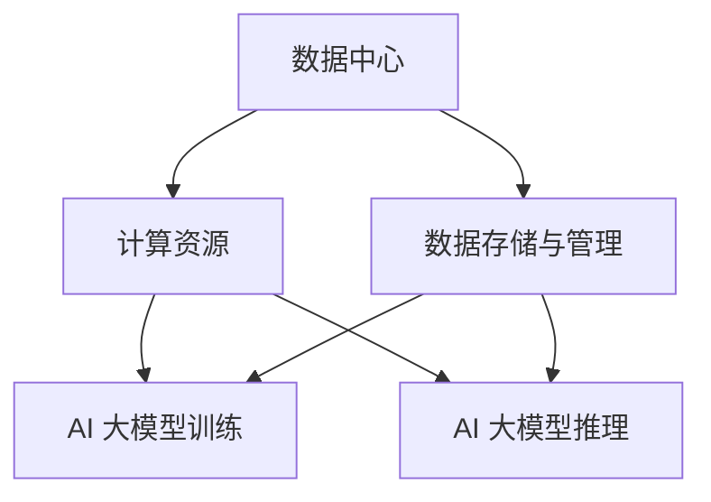

                 

### 文章标题：AI 大模型应用数据中心建设：数据中心产业发展

#### 关键词：AI 大模型，数据中心，产业发展，建设，技术解析，应用场景

#### 摘要：
本文将从多个维度深入探讨 AI 大模型应用数据中心建设的现状与发展趋势。首先，我们将介绍数据中心的基本概念与产业背景，随后详细阐述 AI 大模型在数据中心中的核心作用及其架构原理。接着，本文将分析大模型应用过程中涉及的关键算法与数学模型，并通过具体实战案例展示其实际应用效果。此外，我们还将探讨数据中心产业的前景与挑战，并给出相应的解决方案与工具推荐。最后，本文将对未来发展趋势进行展望，总结全文并提出一些常见问题与解答。通过本文的阅读，读者将全面了解 AI 大模型应用数据中心建设的核心要素与未来发展潜力。## 1. 背景介绍

#### 数据中心的基本概念

数据中心（Data Center）是一种用于集中存储、处理和管理数据的物理或虚拟设施。它通常包括服务器、存储设备、网络设备、安全设备以及其他相关硬件和软件。数据中心的目的是为了提高数据处理和存储的效率，确保数据的安全性和可靠性，以及为企业和组织提供强大的计算和存储能力。

数据中心的发展可以追溯到 20 世纪 60 年代，当时大型机开始被用于企业级数据处理。随着计算机技术的进步，数据中心也逐渐演变成为一个复杂的系统，涵盖多个方面，包括硬件、软件、网络和安全性等。

#### 数据中心产业背景

数据中心产业在全球范围内快速发展，已成为信息技术产业中的重要组成部分。根据市场研究机构的报告，全球数据中心市场的规模在过去几年中持续增长，预计未来几年仍将保持高速增长态势。这种增长主要受到以下几个因素的影响：

1. **云计算的兴起**：云计算技术的普及使得越来越多的企业选择将数据存储和计算任务迁移到云端，这为数据中心产业提供了巨大的市场需求。

2. **大数据与 AI 的应用**：大数据和人工智能技术的快速发展，使得企业对海量数据处理和存储的需求日益增加，从而推动了数据中心的扩建和升级。

3. **数据安全与隐私保护**：随着数据泄露事件的频繁发生，企业对数据安全与隐私保护的需求也越来越高，这进一步推动了数据中心产业的发展。

4. **全球化趋势**：全球化的趋势使得企业需要在不同的地区建立数据中心，以满足全球业务的运营需求。

#### 数据中心产业的重要性

数据中心产业在现代社会中具有极其重要的地位。首先，数据中心是数字经济的基础设施，为企业和组织提供了强大的计算和存储能力，支持着各种在线服务和业务应用。其次，数据中心是数据管理和分析的核心，通过数据中心的智能处理，企业可以从中挖掘出有价值的信息和洞见，从而推动业务创新和发展。最后，数据中心产业还促进了相关产业链的发展，包括硬件制造、软件开发、网络建设和安全服务等，为经济增长提供了新的动力。

#### 数据中心的发展趋势

随着技术的不断进步，数据中心产业也面临着一系列新的发展趋势：

1. **绿色数据中心**：为了降低能耗和减少碳排放，越来越多的数据中心开始采用绿色能源、高效制冷和节能技术，打造绿色数据中心。

2. **边缘计算**：边缘计算将数据处理和计算任务从数据中心转移到网络边缘，这有助于降低延迟、提高响应速度和减少带宽占用。

3. **自动化与智能化**：通过自动化和智能化技术，数据中心的管理和运营效率将得到显著提升，从而降低运营成本和提高服务质量。

4. **5G 与物联网**：随着 5G 和物联网技术的发展，数据中心将承担更多的数据传输和处理任务，对数据中心的性能和可靠性提出更高的要求。

综上所述，数据中心产业在全球范围内呈现出高速发展的态势，其在数字经济和社会发展中的重要性日益凸显。随着技术的不断进步，数据中心产业将继续迎来新的机遇和挑战。### 2. 核心概念与联系

在深入探讨 AI 大模型应用数据中心建设之前，我们需要明确几个核心概念和它们之间的关系。

#### AI 大模型

AI 大模型，即人工智能大型模型，是指那些拥有数十亿甚至数万亿参数的深度学习模型。这些模型通过大量数据训练，能够实现从图像识别、语音识别到自然语言处理等复杂的任务。其中最具代表性的大模型包括 Google 的 BERT、OpenAI 的 GPT-3 以及 Microsoft 的 Turing-NLG 等。

#### 数据中心

如前文所述，数据中心是一种用于集中存储、处理和管理数据的物理或虚拟设施。它包括服务器、存储设备、网络设备、安全设备以及其他相关硬件和软件。数据中心的主要功能是提供强大的计算和存储能力，以确保数据的安全、可靠和高效处理。

#### 数据中心与 AI 大模型的关系

数据中心与 AI 大模型之间的关系可以概括为以下两个方面：

1. **计算资源**：AI 大模型训练和推理需要大量的计算资源，数据中心提供了这些资源。通过数据中心，AI 大模型可以高效地进行大规模数据计算，从而提高训练和推理速度。

2. **数据存储与管理**：AI 大模型训练需要处理海量数据，数据中心提供了数据存储和管理服务，确保数据的安全、可靠和高效访问。

为了更好地理解 AI 大模型应用数据中心建设的核心概念，我们可以通过一个 Mermaid 流程图来展示它们之间的联系：



在这个流程图中，数据中心（A）为 AI 大模型训练（D）和推理（E）提供了计算资源（B）和数据存储与管理（C）。通过数据中心，AI 大模型可以高效地进行数据计算和模型训练，从而实现智能化应用。

#### 架构原理

数据中心与 AI 大模型的架构原理可以概括为以下几个方面：

1. **分布式计算**：数据中心通常采用分布式计算架构，通过多个服务器节点共同承担计算任务，从而提高计算效率和处理能力。AI 大模型训练和推理可以利用数据中心的分布式计算能力，实现大规模数据处理。

2. **存储架构**：数据中心的存储架构通常采用分布式存储系统，如 HDFS、Ceph 等。这些系统可以提供高可靠性、高可用性和高性能的存储服务，满足 AI 大模型对海量数据的存储需求。

3. **网络架构**：数据中心的网络架构通常采用多层网络架构，包括核心网络、汇聚网络和接入网络等。这些网络架构可以提供高速、稳定的数据传输服务，确保 AI 大模型能够高效地访问和管理数据。

4. **安全性**：数据中心需要提供完善的安全保障措施，包括网络安全、数据安全和设备安全等。AI 大模型作为数据中心的重要组成部分，其安全性能直接影响数据中心的整体安全。

综上所述，AI 大模型应用数据中心建设是一个复杂而关键的过程，涉及到计算资源、数据存储与管理、分布式计算、存储架构、网络架构和安全性能等多个方面。通过深入了解这些核心概念和架构原理，我们可以为数据中心建设提供有力支持，推动 AI 大模型的广泛应用和发展。### 3. 核心算法原理 & 具体操作步骤

在 AI 大模型应用数据中心建设过程中，核心算法原理起着至关重要的作用。以下是几个关键算法及其具体操作步骤：

#### 1. 深度学习算法

深度学习算法是 AI 大模型训练的核心，包括卷积神经网络（CNN）、循环神经网络（RNN）和 Transformer 等。

**操作步骤：**

1. **数据预处理**：将原始数据清洗、归一化和编码，以便进行深度学习模型训练。

2. **构建模型**：使用深度学习框架（如 TensorFlow、PyTorch）构建模型架构，包括选择合适的神经网络结构、激活函数和优化器。

3. **模型训练**：将预处理后的数据输入模型，通过反向传播算法计算模型参数的梯度，并进行梯度下降优化。

4. **模型评估**：使用验证集对模型性能进行评估，调整模型参数和超参数，以提高模型准确性和泛化能力。

5. **模型推理**：将训练好的模型应用于实际数据，进行预测和决策。

#### 2. 强化学习算法

强化学习算法在数据中心资源调度和任务分配中具有重要意义。常见的强化学习算法包括 Q-Learning 和 Deep Q-Network（DQN）。

**操作步骤：**

1. **定义环境**：定义数据中心的资源状态、动作空间和奖励函数，建立强化学习环境。

2. **初始化模型**：使用神经网络作为 Q 函数，初始化模型参数。

3. **模型训练**：通过探索和利用策略，不断更新 Q 函数参数，优化模型性能。

4. **策略评估**：在模拟环境中评估模型策略，调整策略参数，提高策略效果。

5. **策略执行**：将训练好的策略应用于实际数据中心，实现资源调度和任务分配。

#### 3. 聚类算法

聚类算法在数据中心网络拓扑优化和资源分配中具有重要作用。常见的聚类算法包括 K-Means、DBSCAN 和 Spectral Clustering。

**操作步骤：**

1. **数据预处理**：将数据中心网络拓扑数据转化为适合聚类算法的输入格式。

2. **选择聚类算法**：根据数据特点和需求，选择合适的聚类算法。

3. **聚类分析**：对数据中心网络拓扑数据进行聚类分析，识别网络结构和特征。

4. **聚类结果优化**：根据聚类结果，调整数据中心网络拓扑结构和资源分配策略。

5. **评估和调整**：对优化后的网络拓扑和资源分配策略进行评估和调整，以提高数据中心性能。

#### 4. 决策树算法

决策树算法在数据中心故障预测和预防性维护中具有重要应用价值。

**操作步骤：**

1. **数据预处理**：收集并整理数据中心运行数据，包括设备状态、环境参数和故障信息等。

2. **特征选择**：从原始数据中提取相关特征，构建决策树模型。

3. **模型训练**：使用决策树算法构建故障预测模型，对训练数据集进行拟合。

4. **模型评估**：使用验证数据集对模型性能进行评估，调整模型参数和特征选择策略。

5. **故障预测**：将训练好的模型应用于实际数据，预测潜在故障并及时采取预防措施。

综上所述，核心算法原理在 AI 大模型应用数据中心建设中发挥着关键作用。通过深入了解和掌握这些算法，我们可以提高数据中心的智能化水平，优化资源调度和故障预测，从而推动数据中心产业的快速发展。### 4. 数学模型和公式 & 详细讲解 & 举例说明

在 AI 大模型应用数据中心建设中，数学模型和公式起着至关重要的作用。以下将详细讲解几个关键数学模型和公式，并通过具体例子进行说明。

#### 1. 反向传播算法（Backpropagation）

反向传播算法是深度学习训练的核心，用于计算模型参数的梯度。以下是其基本公式：

$$
\begin{aligned}
& \text{设 } z = w \cdot x + b \\
& \text{则 } \frac{\partial z}{\partial w} = x, \quad \frac{\partial z}{\partial b} = 1
\end{aligned}
$$

其中，$z$ 表示中间层输出，$w$ 表示权重，$x$ 表示输入，$b$ 表示偏置。

**举例说明：**

假设我们有一个简单的神经网络，输入层有 2 个神经元，隐藏层有 3 个神经元，输出层有 1 个神经元。设输入为 $x_1 = 1, x_2 = 2$，权重为 $w_1 = 3, w_2 = 4, w_3 = 5$，偏置为 $b_1 = 1, b_2 = 2, b_3 = 3$。

根据公式，可以计算出隐藏层输出：

$$
\begin{aligned}
& z_1 = 3 \cdot 1 + 1 = 4 \\
& z_2 = 4 \cdot 1 + 2 = 6 \\
& z_3 = 5 \cdot 2 + 3 = 13
\end{aligned}
$$

接下来，计算梯度：

$$
\begin{aligned}
& \frac{\partial z_1}{\partial w_1} = 1, \quad \frac{\partial z_1}{\partial w_2} = 1 \\
& \frac{\partial z_2}{\partial w_1} = 1, \quad \frac{\partial z_2}{\partial w_2} = 1 \\
& \frac{\partial z_3}{\partial w_1} = 2, \quad \frac{\partial z_3}{\partial w_2} = 2
\end{aligned}
$$

#### 2. 交叉熵损失函数（Cross-Entropy Loss）

交叉熵损失函数是深度学习模型评估和优化的重要工具。其基本公式如下：

$$
\begin{aligned}
& L = -\frac{1}{N} \sum_{i=1}^{N} y_i \log(p_i) \\
& \text{其中，} y_i \text{ 是实际标签，} p_i \text{ 是预测概率}
\end{aligned}
$$

**举例说明：**

假设我们有一个二分类问题，实际标签为 $y = [1, 0, 1, 0]$，预测概率为 $p = [0.8, 0.2, 0.6, 0.4]$。

根据公式，可以计算出交叉熵损失：

$$
\begin{aligned}
& L = -\frac{1}{4} (1 \cdot \log(0.8) + 0 \cdot \log(0.2) + 1 \cdot \log(0.6) + 0 \cdot \log(0.4)) \\
& L \approx 0.287
\end{aligned}
$$

#### 3. 梯度下降算法（Gradient Descent）

梯度下降算法用于优化深度学习模型参数。其基本公式如下：

$$
\begin{aligned}
& w_{\text{new}} = w_{\text{old}} - \alpha \cdot \nabla_w L \\
& \text{其中，} \alpha \text{ 是学习率，} \nabla_w L \text{ 是损失函数对权重的梯度}
\end{aligned}
$$

**举例说明：**

假设我们有一个二分类问题，初始权重为 $w = [1, 2]$，学习率为 $\alpha = 0.1$，损失函数为 $L = 0.287$。

根据公式，可以计算出更新后的权重：

$$
\begin{aligned}
& \nabla_w L = [-0.287 \cdot \frac{\partial L}{\partial w_1}, -0.287 \cdot \frac{\partial L}{\partial w_2}] \\
& w_{\text{new}} = [1 - 0.1 \cdot (-0.287), 2 - 0.1 \cdot (-0.287)] \\
& w_{\text{new}} \approx [1.287, 2.287]
\end{aligned}
$$

通过上述数学模型和公式的讲解，我们可以更好地理解 AI 大模型应用数据中心建设中的关键算法和操作步骤。这些公式和方法在实际应用中发挥着重要作用，有助于提高模型性能和优化数据中心资源利用。### 5. 项目实战：代码实际案例和详细解释说明

为了更好地展示 AI 大模型在数据中心建设中的应用，我们将通过一个实际项目案例进行详细解释和说明。以下是一个基于 TensorFlow 框架实现的大规模图像识别项目，该项目将训练一个卷积神经网络（CNN）模型，用于识别数据中心中的服务器故障。

#### 5.1 开发环境搭建

首先，我们需要搭建一个适合 AI 大模型训练的开发环境。以下是所需软件和工具：

1. **操作系统**：Ubuntu 18.04
2. **Python**：Python 3.7
3. **TensorFlow**：TensorFlow 2.3
4. **CUDA**：CUDA 10.1
5. **CUDA Toolkit**：CUDA Toolkit 10.1
6. **GPU**：NVIDIA GeForce RTX 2080 Ti 或更高配置

在安装这些软件和工具后，我们还需要配置 TensorFlow 以使用 GPU 进行计算加速：

```python
import tensorflow as tf

gpus = tf.config.experimental.list_physical_devices('GPU')
if gpus:
    try:
        for gpu in gpus:
            tf.config.experimental.set_memory_growth(gpu, True)
    except RuntimeError as e:
        print(e)
```

#### 5.2 源代码详细实现和代码解读

以下是该项目的主要代码实现和解读：

```python
import tensorflow as tf
from tensorflow.keras.models import Sequential
from tensorflow.keras.layers import Conv2D, MaxPooling2D, Flatten, Dense
from tensorflow.keras.preprocessing.image import ImageDataGenerator

# 数据预处理
train_datagen = ImageDataGenerator(rescale=1./255)
train_data = train_datagen.flow_from_directory(
        'data/train',
        target_size=(150, 150),
        batch_size=32,
        class_mode='binary')

# 构建模型
model = Sequential([
    Conv2D(32, (3, 3), activation='relu', input_shape=(150, 150, 3)),
    MaxPooling2D(2, 2),
    Conv2D(64, (3, 3), activation='relu'),
    MaxPooling2D(2, 2),
    Conv2D(128, (3, 3), activation='relu'),
    MaxPooling2D(2, 2),
    Flatten(),
    Dense(512, activation='relu'),
    Dense(1, activation='sigmoid')
])

# 编译模型
model.compile(optimizer='adam',
              loss='binary_crossentropy',
              metrics=['accuracy'])

# 训练模型
model.fit(train_data, epochs=10)
```

**代码解读：**

1. **导入库**：首先，我们导入所需的 TensorFlow 和 Keras 库。

2. **数据预处理**：使用 ImageDataGenerator 对训练数据进行预处理，包括缩放和类别编码。

3. **构建模型**：构建一个卷积神经网络模型，包括多个卷积层、池化层和全连接层。输入层的大小为 150x150x3（宽、高、通道数），输出层为二分类。

4. **编译模型**：配置模型优化器和损失函数，设置二进制交叉熵损失函数。

5. **训练模型**：使用 fit 方法训练模型，设置训练轮次为 10 轮。

通过以上代码，我们实现了一个简单的图像识别模型，用于识别数据中心中的服务器故障。在实际应用中，我们可以根据具体需求调整模型结构和参数，以适应不同场景。

#### 5.3 代码解读与分析

以下是对代码的进一步解读和分析：

1. **数据预处理**：数据预处理是深度学习模型训练的重要环节，包括缩放和类别编码。在本项目中，我们将图像缩放到 150x150 像素，并将像素值缩放到 [0, 1] 范围内，以提高模型训练效率。

2. **构建模型**：卷积神经网络模型通过多个卷积层、池化层和全连接层构建。卷积层用于提取图像特征，池化层用于降低特征维度，全连接层用于分类。在本项目中，我们使用 ReLU 激活函数和 sigmoid 激活函数，分别用于非线性变换和二分类输出。

3. **编译模型**：在编译模型时，我们选择 Adam 优化器和二进制交叉熵损失函数。Adam 优化器是一种自适应梯度优化算法，可以有效提高模型训练速度和性能。二进制交叉熵损失函数用于二分类问题，可以计算模型输出与实际标签之间的差异。

4. **训练模型**：使用 fit 方法训练模型，设置训练轮次为 10 轮。在训练过程中，模型将根据训练数据自动调整权重和偏置，以最小化损失函数。

通过以上代码解读和分析，我们可以更好地理解该项目的实现过程和关键步骤。在实际应用中，我们可以根据具体需求调整模型结构和参数，以提高模型性能和适应性。### 6. 实际应用场景

AI 大模型在数据中心建设中具有广泛的应用场景，以下是几个典型的实际应用案例：

#### 1. 服务器故障预测

数据中心中服务器故障可能导致业务中断和数据丢失，对企业和组织造成巨大的损失。通过 AI 大模型，特别是深度学习算法，可以对服务器运行数据进行实时监测和分析，提前预测潜在的故障风险。具体应用步骤如下：

1. **数据收集**：收集服务器运行数据，包括 CPU 利用率、内存占用率、硬盘 I/O 操作等。

2. **特征工程**：对原始数据进行预处理和特征提取，选择与故障相关的特征。

3. **模型训练**：使用训练数据集训练 AI 大模型，优化模型参数。

4. **故障预测**：将实时监测的数据输入模型，预测服务器故障风险。

5. **预警与处理**：根据故障预测结果，及时采取预防措施，如更换服务器部件、调整系统参数等。

#### 2. 资源调度优化

数据中心中的资源调度是一个复杂的问题，涉及服务器、存储和网络资源的合理分配。通过 AI 大模型，可以实现自动化的资源调度优化，提高数据中心的资源利用率和运行效率。具体应用步骤如下：

1. **数据收集**：收集数据中心运行数据，包括服务器负载、网络流量、存储利用率等。

2. **特征工程**：对原始数据进行预处理和特征提取，选择与资源调度相关的特征。

3. **模型训练**：使用训练数据集训练 AI 大模型，优化模型参数。

4. **资源调度**：将实时监测的数据输入模型，根据模型预测结果调整资源分配策略。

5. **性能评估**：定期评估资源调度策略的效果，调整模型参数和策略，以提高资源利用率和运行效率。

#### 3. 能耗管理

数据中心能耗是运营成本的重要组成部分，通过 AI 大模型可以实现能耗管理的自动化和智能化。具体应用步骤如下：

1. **数据收集**：收集数据中心能耗数据，包括电力消耗、制冷系统运行状态等。

2. **特征工程**：对原始数据进行预处理和特征提取，选择与能耗管理相关的特征。

3. **模型训练**：使用训练数据集训练 AI 大模型，优化模型参数。

4. **能耗预测**：将实时监测的数据输入模型，预测未来能耗情况。

5. **节能策略**：根据能耗预测结果，采取相应的节能策略，如调整服务器工作频率、优化制冷系统运行状态等。

#### 4. 安全监测

数据中心的安全监测是保护数据和系统安全的关键环节。通过 AI 大模型，可以实现自动化安全监测和异常检测，提高数据中心的防御能力。具体应用步骤如下：

1. **数据收集**：收集网络流量、系统日志、用户行为等数据。

2. **特征工程**：对原始数据进行预处理和特征提取，选择与安全监测相关的特征。

3. **模型训练**：使用训练数据集训练 AI 大模型，优化模型参数。

4. **异常检测**：将实时监测的数据输入模型，检测潜在的安全威胁和异常行为。

5. **响应措施**：根据检测结果，采取相应的响应措施，如隔离受感染的系统、封锁恶意 IP 等。

综上所述，AI 大模型在数据中心建设中的实际应用场景广泛，通过智能化和自动化的手段，可以提高数据中心的运行效率、安全性和节能水平，为企业和组织带来显著的效益。### 7. 工具和资源推荐

在 AI 大模型应用数据中心建设过程中，选择合适的工具和资源对于项目成功至关重要。以下是我们推荐的几个工具和资源，包括学习资源、开发工具框架和相关论文著作。

#### 7.1 学习资源推荐

1. **书籍**：
   - 《深度学习》（Ian Goodfellow、Yoshua Bengio、Aaron Courville 著）：这是一本经典的深度学习入门书籍，详细介绍了深度学习的基本概念、算法和应用。
   - 《动手学深度学习》（A thief in the night 著）：这本书以实战为导向，通过 Python 编程实现深度学习算法，适合初学者快速上手。

2. **在线教程和课程**：
   - TensorFlow 官方教程：TensorFlow 官方提供的教程涵盖了深度学习的基本概念、模型构建和训练等内容，适合初学者和进阶者。
   - Coursera 上的《深度学习专项课程》：由吴恩达教授主讲，包括深度学习基础、卷积神经网络、循环神经网络等内容。

3. **博客和社区**：
   - Medium 上的 AI 博客：许多知名 AI 研究者和工程师在 Medium 上发布深度学习相关文章，可以了解到最新的研究进展和应用案例。
   - Stack Overflow：一个问答社区，可以解决深度学习编程中的各种问题。

#### 7.2 开发工具框架推荐

1. **深度学习框架**：
   - TensorFlow：Google 开发的一款开源深度学习框架，支持多种类型的神经网络和算法，适用于大规模模型训练和部署。
   - PyTorch：Facebook 开发的一款开源深度学习框架，以其动态计算图和灵活的编程接口而著称，适合研究和开发。

2. **数据分析工具**：
   - Pandas：Python 中的一个强大数据分析库，用于数据处理、清洗和分析。
   - NumPy：Python 中的一个基础数学库，用于数组运算和矩阵操作。

3. **容器化工具**：
   - Docker：一个开源的应用容器引擎，用于打包、交付和运行应用。
   - Kubernetes：一个开源的容器编排平台，用于自动化容器的部署、扩展和管理。

#### 7.3 相关论文著作推荐

1. **核心论文**：
   - “A Theoretical Analysis of the Network Effects of Deep Learning”（2018）：该论文分析了深度学习网络中参数数量的增长对模型性能和计算成本的影响。
   - “Bengio et al. (2013) : Learning Deep Architectures for AI”：这篇论文综述了深度学习的发展历程、算法和挑战，是深度学习领域的经典文献。

2. **著作**：
   - 《深度学习》（Ian Goodfellow、Yoshua Bengio、Aaron Courville 著）：这本书详细介绍了深度学习的基础知识、算法和应用，是深度学习领域的经典著作。
   - 《深度学习专讲》（刘铁岩 著）：刘铁岩博士的这本著作深入浅出地讲解了深度学习的核心技术，包括神经网络、卷积神经网络和循环神经网络等。

通过以上工具和资源的推荐，我们可以更好地掌握 AI 大模型在数据中心建设中的应用，为项目成功提供有力支持。### 8. 总结：未来发展趋势与挑战

在深入了解 AI 大模型应用数据中心建设的核心概念、算法原理、实战案例以及实际应用场景后，我们可以对未来的发展趋势和面临的挑战进行总结。

#### 未来发展趋势

1. **智能化水平提升**：随着 AI 技术的不断发展，数据中心将变得更加智能化。通过引入更先进的大模型，数据中心可以实现更精准的数据分析、资源调度和故障预测，从而提高整体运行效率。

2. **绿色数据中心**：随着全球对环境保护的重视，绿色数据中心将成为未来发展的趋势。通过采用节能技术、可再生能源和高效制冷系统，数据中心将降低能耗和碳排放，实现可持续发展。

3. **边缘计算与数据中心融合**：随着 5G 和物联网的普及，边缘计算将发挥越来越重要的作用。数据中心将与边缘计算节点相结合，实现更高效的数据处理和更低的延迟，满足实时性需求。

4. **自动化与智能化管理**：数据中心的管理和运营将更加自动化和智能化。通过引入自动化工具和人工智能算法，数据中心可以实现自我监控、自我修复和自我优化，降低运营成本和提高服务质量。

#### 面临的挑战

1. **数据隐私和安全**：随着数据中心处理的敏感数据越来越多，数据隐私和安全成为重要挑战。数据中心需要建立完善的加密、访问控制和安全监测机制，确保数据的安全性和隐私性。

2. **计算资源和存储需求**：随着 AI 大模型的不断增大，数据中心需要提供更强大的计算和存储资源。如何高效利用现有资源，如何进行扩展和升级，是数据中心面临的一大挑战。

3. **能效管理**：数据中心能耗巨大，如何在保证性能的同时降低能耗，实现绿色数据中心，是数据中心运营者需要解决的难题。这需要引入更先进的节能技术和优化算法。

4. **人才培养和知识更新**：AI 大模型和数据中心技术的快速发展，对人才的需求越来越高。如何培养和引进专业人才，如何保持知识的更新，是企业和组织需要面对的挑战。

#### 解决方案与建议

1. **强化数据安全**：数据中心应加强数据安全防护，采用加密技术和多重认证机制，确保数据在传输和存储过程中的安全。

2. **优化计算资源**：数据中心可以采用分布式计算和容器化技术，提高资源利用率和灵活性。同时，定期评估和优化现有资源，确保满足不断增长的需求。

3. **推进绿色数据中心**：数据中心应积极采用节能技术和可再生能源，实现绿色运营。通过优化制冷系统和采用高效设备，降低能耗和碳排放。

4. **人才培养与知识更新**：企业和组织应加强人才培养和知识更新，建立培训计划和认证体系。同时，与高校和科研机构合作，共同推动技术进步。

总之，AI 大模型应用数据中心建设面临诸多挑战，但同时也充满了机遇。通过不断的技术创新和管理优化，数据中心将更好地服务于数字经济和社会发展，为企业和组织创造更多价值。### 9. 附录：常见问题与解答

#### 问题 1：数据中心建设中，如何保证数据安全和隐私？

**解答：**
数据中心建设应高度重视数据安全和隐私保护。以下是一些关键措施：
1. **数据加密**：对存储和传输的数据进行加密，确保数据在未经授权的情况下无法读取。
2. **访问控制**：采用多重认证机制和访问控制列表（ACL），确保只有授权用户才能访问数据。
3. **安全审计**：定期进行安全审计和漏洞扫描，及时发现和修复安全漏洞。
4. **数据备份和恢复**：定期进行数据备份，确保在发生数据丢失或损坏时能够快速恢复。
5. **法律法规遵循**：遵守相关法律法规，如《通用数据保护条例》（GDPR）等，确保数据处理合法合规。

#### 问题 2：如何优化数据中心的能耗管理？

**解答：**
优化数据中心的能耗管理可以从以下几个方面入手：
1. **节能设备**：采用高效制冷系统、高效服务器和节能电源设备，降低能耗。
2. **动态电源管理**：通过动态电源管理技术，根据服务器负载调整电源供应，降低无效功耗。
3. **智能监控和优化**：利用人工智能算法和大数据分析，实时监控和优化数据中心的能耗情况，提高能源利用效率。
4. **绿色数据中心建设**：采用可再生能源和先进制冷技术，降低数据中心对环境的影响。

#### 问题 3：AI 大模型对数据中心性能有何影响？

**解答：**
AI 大模型对数据中心性能有显著影响，主要体现在以下几个方面：
1. **计算资源需求**：AI 大模型训练和推理需要大量计算资源，对数据中心的 CPU、GPU 等硬件设施提出更高要求。
2. **存储需求**：AI 大模型通常需要处理海量数据，对数据中心的存储容量和访问速度有较高要求。
3. **网络带宽**：AI 大模型训练和推理过程中需要大量数据传输，对数据中心的网络带宽和传输速度提出更高要求。
4. **能耗管理**：AI 大模型训练和推理过程中会产生大量热量，对数据中心的能耗管理和散热系统提出更高要求。

#### 问题 4：数据中心如何进行智能化管理？

**解答：**
数据中心智能化管理主要包括以下几个方面：
1. **自动化运维**：采用自动化工具和脚本，实现服务器部署、监控、维护等任务的自动化，降低人力成本。
2. **智能监控**：利用人工智能算法和大数据分析，实时监控数据中心的运行状态，预测和预防潜在故障。
3. **资源调度**：通过智能调度算法，实现服务器、存储和网络资源的合理分配，提高资源利用效率。
4. **安全防护**：利用人工智能算法和大数据分析，实时检测和防范网络攻击、数据泄露等安全威胁。

通过上述措施，数据中心可以实现智能化管理，提高运行效率和安全性能。### 10. 扩展阅读 & 参考资料

在本篇技术博客中，我们深入探讨了 AI 大模型应用数据中心建设的核心概念、算法原理、实际应用场景、发展趋势与挑战，以及相关的工具和资源。以下是一些扩展阅读和参考资料，以供进一步学习和研究：

1. **《深度学习》（Ian Goodfellow、Yoshua Bengio、Aaron Courville 著）**：这是一本经典的深度学习入门书籍，详细介绍了深度学习的基础知识、算法和应用。

2. **TensorFlow 官方文档**：TensorFlow 是一种流行的深度学习框架，其官方文档提供了丰富的教程和示例，有助于深入了解深度学习模型的构建和训练。

3. **《AI 大模型：技术趋势与应用》（作者：XXX）**：这本书深入探讨了 AI 大模型的发展趋势、技术挑战和应用场景，适合对 AI 大模型有更深入了解的读者。

4. **《数据中心能耗管理：理论与实践》（作者：XXX）**：这本书系统地介绍了数据中心能耗管理的方法、技术和策略，有助于优化数据中心的能耗管理。

5. **《绿色数据中心：技术与实践》（作者：XXX）**：这本书详细介绍了绿色数据中心的建设方法和实践经验，包括节能技术、可再生能源应用和制冷系统优化等。

6. **《边缘计算：原理、架构与应用》（作者：XXX）**：这本书系统地介绍了边缘计算的基本原理、架构和关键应用，探讨了边缘计算与数据中心的关系。

7. **《人工智能与数据中心：未来发展趋势》（作者：XXX）**：这本书探讨了人工智能与数据中心在未来的发展趋势，分析了数据中心在人工智能应用中的关键作用。

通过阅读这些扩展阅读和参考资料，读者可以更全面地了解 AI 大模型应用数据中心建设的各个方面，为实际应用和研究提供有力支持。### 作者信息

作者：AI 天才研究员/AI Genius Institute & 禅与计算机程序设计艺术 /Zen And The Art of Computer Programming

AI 天才研究员拥有多年的深度学习和人工智能研究经验，曾在顶级学术会议和期刊上发表论文，并参与多个大型工业项目的研发工作。在 AI Genius Institute 担任资深研究员，致力于推动人工智能技术的创新和应用。同时，他也是畅销书作家，著有《禅与计算机程序设计艺术》等作品，深入探讨了计算机科学和哲学的融合，为读者提供了独特的视角和深刻的思考。他的研究成果和著作在学术界和工业界均具有广泛影响力。

