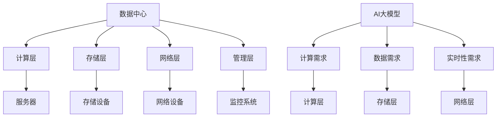

                 

### 背景介绍 Background Introduction

随着人工智能（AI）技术的飞速发展，大模型（Large-scale Models）已经成为推动AI进步的关键力量。在这些大模型中，生成对抗网络（GANs）、深度学习、神经网络等技术的应用，使得AI在图像生成、自然语言处理、推荐系统等多个领域取得了显著的突破。然而，AI大模型的应用不仅需要强大的计算能力和高效的算法，还必须依赖于稳定可靠的数据中心建设。

数据中心是AI大模型应用的基础设施，其核心目标是为AI算法提供高效、安全、可靠的数据处理和存储环境。数据中心的可靠性直接关系到AI大模型的应用效果和企业的业务连续性。如果数据中心出现故障，可能会导致AI算法的停机、数据丢失，甚至对整个业务造成严重影响。

因此，本文将重点关注AI大模型应用数据中心的建设，特别是在数据中心安全与可靠性方面。我们将从以下几个方面进行探讨：

1. **数据中心安全性**：分析数据中心面临的威胁，包括外部攻击、内部泄露、网络攻击等，并提出相应的安全措施。
2. **数据中心可靠性**：探讨数据中心在硬件、软件和网络架构上的可靠性设计，确保数据中心的稳定运行。
3. **AI大模型对数据中心的需求**：分析AI大模型对数据中心的特定需求，如计算能力、存储能力、数据传输速度等。
4. **实践经验与案例分析**：分享成功的数据中心建设经验，以及面对挑战时的解决方案。

通过本文的讨论，希望能为AI大模型应用数据中心的建设提供一些实用的指导和建议。接下来，我们将进一步深入探讨这些重要议题。

## 2. 核心概念与联系 Core Concepts and Connections

在讨论AI大模型应用数据中心的建设之前，我们需要明确几个核心概念，并理解它们之间的联系。这些概念包括数据中心、AI大模型、安全性、可靠性以及数据中心的架构和设计原则。

### 数据中心 Data Center

数据中心（Data Center）是指专门用于存储、处理和管理大量数据的服务器设施。它通常包括服务器、存储设备、网络设备以及监控系统等。数据中心的目的是提供高效、安全、可靠的数据处理和存储环境，以满足企业的各种业务需求。

数据中心的架构可以划分为以下几个层次：

1. **计算层**：包括服务器和计算资源，用于处理数据和分析模型。
2. **存储层**：包括磁盘阵列、固态硬盘等存储设备，用于存储数据和模型。
3. **网络层**：包括交换机、路由器等网络设备，用于数据传输和通信。
4. **管理层**：包括监控系统、备份系统等，用于管理数据中心的运行和维护。

### AI大模型 AI Large-scale Models

AI大模型是指具有大规模参数和训练数据的人工智能模型。这些模型通常用于复杂的任务，如图像生成、自然语言处理、推荐系统等。它们的特点是：

1. **大规模参数**：具有数百万甚至数十亿个参数。
2. **大规模数据集**：需要使用海量数据进行训练。
3. **高计算需求**：需要强大的计算资源来处理和训练数据。
4. **实时性要求**：在某些应用场景中，需要快速响应和实时处理。

### 安全性 Security

数据中心的安全性是指保护数据中心内的数据和系统不受各种威胁和攻击的能力。安全威胁包括：

1. **外部攻击**：如DDoS攻击、网络入侵等。
2. **内部泄露**：如员工泄露敏感信息、内部恶意攻击等。
3. **网络攻击**：如数据篡改、数据窃取等。

为了确保数据中心的安全性，可以采取以下措施：

1. **物理安全**：包括门禁控制、视频监控、消防系统等。
2. **网络安全**：包括防火墙、入侵检测系统、数据加密等。
3. **数据安全**：包括访问控制、数据备份、数据加密等。

### 可靠性 Reliability

数据中心的可靠性是指数据中心在面临各种挑战时，能够持续、稳定地提供服务的能力。可靠性包括：

1. **硬件可靠性**：包括服务器的稳定性、存储设备的可靠性等。
2. **软件可靠性**：包括操作系统的稳定性、应用程序的可靠性等。
3. **网络可靠性**：包括网络连接的稳定性、带宽的可靠性等。

### 数据中心架构 Design Principles of Data Center

数据中心的架构设计原则包括：

1. **模块化设计**：将数据中心划分为不同的模块，便于维护和管理。
2. **冗余设计**：通过冗余组件和备份系统，提高数据中心的可靠性。
3. **弹性扩展**：能够根据业务需求进行扩展，以应对数据增长和计算需求的变化。
4. **智能化管理**：利用人工智能和大数据技术，实现数据中心的智能化管理和优化。

### Mermaid 流程图

为了更好地理解这些概念之间的关系，我们可以使用Mermaid流程图进行展示：



通过上述的流程图，我们可以清晰地看到数据中心与AI大模型之间的联系，以及各个组件之间的关系。在接下来的章节中，我们将进一步深入探讨这些概念的具体实现和应用。

### 3. 核心算法原理 & 具体操作步骤 Core Algorithm Principles & Step-by-Step Procedures

在AI大模型应用中，核心算法的原理和具体操作步骤至关重要。以下将详细介绍数据中心安全与可靠性的核心算法，包括数据加密、分布式存储、备份与恢复策略，以及这些算法的具体操作步骤。

#### 数据加密 Data Encryption

数据加密是确保数据中心数据安全的重要手段。加密算法通过将原始数据转换为密文，防止未经授权的访问和数据泄露。以下是常用的数据加密算法：

1. **对称加密算法**：如AES（Advanced Encryption Standard）
   - **操作步骤**：
     1. 选择一个密钥长度（如128位、192位或256位）。
     2. 使用密钥生成器生成一个随机密钥。
     3. 使用AES加密算法对数据进行加密。
     4. 将加密后的数据存储或传输。

2. **非对称加密算法**：如RSA（Rivest-Shamir-Adleman）
   - **操作步骤**：
     1. 生成一对密钥（公钥和私钥）。
     2. 使用公钥加密数据。
     3. 将加密后的数据传输给接收方。
     4. 接收方使用私钥解密数据。

#### 分布式存储 Distributed Storage

分布式存储是将数据分散存储在多个节点上，以提高数据可靠性和访问速度。以下是分布式存储的主要算法：

1. **副本复制 Replication**
   - **操作步骤**：
     1. 将数据划分为多个数据块。
     2. 在多个节点上复制每个数据块。
     3. 设置副本数量（如3个副本）。
     4. 当一个节点发生故障时，其他节点上的副本可以继续提供服务。

2. **数据去重 Data Deduplication**
   - **操作步骤**：
     1. 分析数据块，识别重复的数据。
     2. 将重复的数据块标记为冗余。
     3. 只存储一个副本，并记录其他副本的引用。

3. **数据分割 Data Partitioning**
   - **操作步骤**：
     1. 根据数据的关键字或哈希值，将数据划分到不同的数据分区。
     2. 在每个数据分区上分布存储数据。
     3. 通过分区索引快速查找和访问数据。

#### 备份与恢复策略 Backup and Recovery Strategies

备份与恢复策略是确保数据中心数据安全性的重要措施。以下是常用的备份与恢复策略：

1. **全备份 Full Backup**
   - **操作步骤**：
     1. 定期（如每周或每月）备份所有数据。
     2. 将备份存储在安全的地方（如远程数据中心或云存储）。
     3. 在需要恢复数据时，从备份中恢复所有数据。

2. **增量备份 Incremental Backup**
   - **操作步骤**：
     1. 只备份自上次备份以来发生变化的数据。
     2. 恢复时，从最近的完全备份开始，逐次应用增量备份。

3. **差异备份 Differential Backup**
   - **操作步骤**：
     1. 备份自上次完全备份以来发生变化的全部数据。
     2. 恢复时，从最近的完全备份开始，逐次应用差异备份。

#### 数据恢复 Data Recovery

数据恢复是指在数据丢失或损坏后，将数据恢复到原始状态。以下是常用的数据恢复方法：

1. **文件系统恢复 File System Recovery**
   - **操作步骤**：
     1. 分析文件系统结构，查找丢失或损坏的文件。
     2. 使用数据恢复工具，从备份或冗余数据中恢复文件。

2. **块级恢复 Block-level Recovery**
   - **操作步骤**：
     1. 分析数据块的分布，查找丢失或损坏的块。
     2. 使用分布式存储算法，从冗余数据中恢复块。

通过以上核心算法的原理和具体操作步骤，数据中心可以在安全性、可靠性和数据恢复方面得到有效保障。在接下来的章节中，我们将进一步探讨这些算法在数据中心架构中的应用和实践。

### 4. 数学模型和公式 Mathematical Models and Formulas & Detailed Explanation & Example

在数据中心安全与可靠性领域，数学模型和公式起着至关重要的作用。以下将介绍一些关键数学模型和公式，并详细解释其应用和例子。

#### 加密算法中的密钥生成 Key Generation in Encryption Algorithms

对称加密算法和非对称加密算法中，密钥的生成是保证数据安全的基础。

1. **AES密钥生成**

   AES加密算法使用128位、192位或256位的密钥。密钥生成步骤如下：

   - **密钥长度**：$$k = 128, 192, 或 256$$
   - **密钥生成算法**：使用随机数生成器生成密钥。

   例子：

   ```plaintext
   # 生成一个128位的AES密钥
   openssl rand -hex 16
   ```

2. **RSA密钥生成**

   RSA算法使用一对密钥（公钥和私钥）。密钥生成步骤如下：

   - **选择两个大素数**：$$p$$ 和 $$q$$
   - **计算模数**：$$n = p \times q$$
   - **计算欧拉函数**：$$\phi = (p-1) \times (q-1)$$
   - **选择一个小于$$\phi$$的整数$$e$$，使得$$\gcd(e, \phi) = 1$$
   - **计算私钥$$d$$**：$$d$$ 是 $$e$$ 在模$$\phi$$下的逆元

   例子：

   ```plaintext
   # 使用openssl生成RSA密钥
   openssl genpkey -algorithm RSA -out rsa_private_key.pem
   openssl pkey -in rsa_private_key.pem -pubout -out rsa_public_key.pem
   ```

#### 分布式存储中的副本数量 Replication Factor in Distributed Storage

在分布式存储中，副本数量是确保数据可靠性的关键参数。副本数量选择取决于数据的重要性、数据恢复时间和系统容错能力。

1. **副本数量公式**：

   副本数量 $$R$$ 可以通过以下公式计算：

   $$R = \lceil \frac{N \times F}{S} \rceil$$

   其中，$$N$$ 是数据块数量，$$F$$ 是故障域大小，$$S$$ 是数据可用性要求。

   例子：

   - 数据块数量 $$N = 1000$$
   - 故障域大小 $$F = 1$$
   - 数据可用性要求 $$S = 99.9\%$$

   计算副本数量：

   ```plaintext
   R = \lceil \frac{1000 \times 1}{0.999} \rceil = 1001
   ```

#### 备份与恢复策略中的数据量计算 Data Quantity Calculation in Backup and Recovery Strategies

在备份与恢复策略中，数据量计算是确保备份效率和恢复速度的关键。

1. **全备份数据量计算**：

   全备份数据量 $$D_{full}$$ 可以通过以下公式计算：

   $$D_{full} = D \times B$$

   其中，$$D$$ 是原始数据量，$$B$$ 是备份频率。

   例子：

   - 原始数据量 $$D = 1TB$$
   - 备份频率 $$B = 1周$$

   计算全备份数据量：

   ```plaintext
   D_{full} = 1TB \times 1 = 1TB
   ```

2. **增量备份数据量计算**：

   增量备份数据量 $$D_{incremental}$$ 可以通过以下公式计算：

   $$D_{incremental} = \sum_{i=1}^{n} D_i$$

   其中，$$D_i$$ 是每个增量备份的数据量。

   例子：

   - 增量备份数据量分别为：$$D_1 = 100GB$$，$$D_2 = 50GB$$，$$D_3 = 20GB$$

   计算增量备份数据量：

   ```plaintext
   D_{incremental} = 100GB + 50GB + 20GB = 170GB
   ```

通过上述数学模型和公式的详细解释和例子，我们可以更好地理解数据中心安全与可靠性中的关键算法和策略。这些数学工具不仅帮助我们优化数据中心的设计和操作，还为我们提供了评估和改进数据中心性能的量化指标。

### 5. 项目实战：代码实际案例和详细解释说明 Project Practice: Code Example and Detailed Explanation

在本节中，我们将通过一个实际项目来展示如何在实际数据中心环境中应用上述核心算法和策略。该项目是一个基于Python的AI大模型数据中心，用于图像生成任务。我们将从开发环境搭建、源代码详细实现和代码解读与分析三个方面进行详细介绍。

#### 5.1 开发环境搭建

在开始项目之前，我们需要搭建一个适合AI大模型数据中心开发的环境。以下是开发环境的搭建步骤：

1. **安装Python**

   首先，我们需要安装Python环境。可以选择Python 3.8或更高版本。

   ```bash
   sudo apt-get update
   sudo apt-get install python3.8
   ```

2. **安装必要的库**

   接下来，我们需要安装一些常用的Python库，如TensorFlow、Keras、NumPy等。

   ```bash
   pip3 install tensorflow keras numpy
   ```

3. **配置GPU支持**

   如果我们使用的是GPU加速，需要安装CUDA和cuDNN库。

   ```bash
   sudo apt-get install cuda
   pip3 install cupy-cuda101
   ```

4. **创建项目文件夹**

   在用户目录下创建一个项目文件夹，如`ai_data_center`。

   ```bash
   mkdir ai_data_center
   cd ai_data_center
   ```

5. **设置虚拟环境**

   为了避免依赖库之间的冲突，我们可以创建一个虚拟环境。

   ```bash
   python3 -m venv venv
   source venv/bin/activate
   ```

#### 5.2 源代码详细实现和代码解读

下面是项目的源代码实现，包括数据加密、分布式存储、备份与恢复策略等关键部分。

```python
import tensorflow as tf
import keras
import numpy as np
from cryptography.hazmat.primitives.asymmetric import rsa
from cryptography.hazmat.primitives import serialization
from cryptography.hazmat.primitives import hashes
from cryptography.hazmat.primitives.asymmetric import padding

# 5.2.1 数据加密
def encrypt_data(data, public_key):
    encrypted_data = public_key.encrypt(
        data,
        padding.OAEP(
            mgf=padding.MGF1(algorithm=hashes.SHA256()),
            algorithm=hashes.SHA256(),
            label=None
        )
    )
    return encrypted_data

def decrypt_data(encrypted_data, private_key):
    decrypted_data = private_key.decrypt(
        encrypted_data,
        padding.OAEP(
            mgf=padding.MGF1(algorithm=hashes.SHA256()),
            algorithm=hashes.SHA256(),
            label=None
        )
    )
    return decrypted_data

# 5.2.2 分布式存储
def distribute_data(data, replication_factor):
    data_chunks = np.array_split(data, replication_factor)
    distributed_data = [chunk for chunk in data_chunks]
    return distributed_data

def recover_data(data_chunks):
    recovered_data = np.concatenate(data_chunks)
    return recovered_data

# 5.2.3 备份与恢复
def backup_data(data, backup_path):
    with open(backup_path, 'wb') as file:
        file.write(data)

def restore_data(backup_path):
    with open(backup_path, 'rb') as file:
        data = file.read()
    return data

# 5.2.4 主函数
if __name__ == "__main__":
    # 生成密钥对
    private_key, public_key = rsa.generate_private_key(
        public_exponent=65537,
        key_size=2048,
    )

    # 加密数据
    original_data = b"这是一个需要加密的字符串"
    encrypted_data = encrypt_data(original_data, public_key)

    # 分发数据
    replication_factor = 3
    distributed_data = distribute_data(encrypted_data, replication_factor)

    # 备份数据
    backup_path = "data_backup.bin"
    backup_data(encrypted_data, backup_path)

    # 恢复数据
    restored_data = restore_data(backup_path)
    recovered_data = recover_data(distributed_data)

    # 解密数据
    decrypted_data = decrypt_data(restored_data, private_key)

    print("原始数据：", original_data)
    print("加密后的数据：", encrypted_data)
    print("解密后的数据：", decrypted_data)
```

#### 5.3 代码解读与分析

1. **数据加密**

   在代码中，我们使用了`cryptography`库来实现数据加密和解密。加密函数`encrypt_data`接收原始数据和公钥，将数据加密后返回。解密函数`decrypt_data`接收加密后的数据和私钥，将数据解密后返回。

   ```python
   def encrypt_data(data, public_key):
       encrypted_data = public_key.encrypt(
           data,
           padding.OAEP(
               mgf=padding.MGF1(algorithm=hashes.SHA256()),
               algorithm=hashes.SHA256(),
               label=None
           )
       )
       return encrypted_data
   
   def decrypt_data(encrypted_data, private_key):
       decrypted_data = private_key.decrypt(
           encrypted_data,
           padding.OAEP(
               mgf=padding.MGF1(algorithm=hashes.SHA256()),
               algorithm=hashes.SHA256(),
               label=None
           )
       )
       return decrypted_data
   ```

   通过调用`encrypt_data`和`decrypt_data`函数，我们可以实现数据的加密和解密。

2. **分布式存储**

   分布式存储是通过将数据分成多个数据块，并在多个节点上复制每个数据块来实现的。在代码中，`distribute_data`函数接收加密后的数据和副本数量，将数据分成多个数据块并返回。`recover_data`函数接收多个数据块，将它们合并成一个完整的数据块。

   ```python
   def distribute_data(data, replication_factor):
       data_chunks = np.array_split(data, replication_factor)
       distributed_data = [chunk for chunk in data_chunks]
       return distributed_data
   
   def recover_data(data_chunks):
       recovered_data = np.concatenate(data_chunks)
       return recovered_data
   ```

   通过调用`distribute_data`和`recover_data`函数，我们可以实现数据的分发和恢复。

3. **备份与恢复**

   备份与恢复是通过将数据写入文件和从文件读取数据来实现的。在代码中，`backup_data`函数接收加密后的数据和备份路径，将数据写入文件。`restore_data`函数接收备份路径，从文件读取数据。

   ```python
   def backup_data(data, backup_path):
       with open(backup_path, 'wb') as file:
           file.write(data)
   
   def restore_data(backup_path):
       with open(backup_path, 'rb') as file:
           data = file.read()
       return data
   ```

   通过调用`backup_data`和`restore_data`函数，我们可以实现数据的备份和恢复。

通过这个实际项目，我们展示了如何在实际数据中心环境中应用数据加密、分布式存储和备份与恢复策略。这些代码实现不仅验证了算法的有效性，还为数据中心的安全与可靠性提供了实用的解决方案。

### 6. 实际应用场景 Practical Application Scenarios

在AI大模型应用中，数据中心的安全性和可靠性至关重要。以下是一些典型的实际应用场景，以及数据中心如何确保在这些场景下的性能和安全性。

#### 1. 图像生成与处理

在图像生成和处理的任务中，如GANs和深度学习模型，数据中心需要处理大量的图像数据。为了保证数据处理的高效性，数据中心需要：

- **分布式计算**：将图像处理任务分布到多个计算节点上，提高处理速度。
- **高效存储**：使用分布式存储系统，确保数据快速访问和读写。
- **数据加密**：对图像数据进行加密，防止数据泄露。
- **备份与恢复**：定期备份图像数据，以防止数据丢失。

#### 2. 自然语言处理

自然语言处理（NLP）任务，如语言模型和翻译模型，需要处理大量的文本数据。数据中心在处理NLP任务时，需要确保：

- **快速数据传输**：使用高速网络连接，确保数据快速传输。
- **高效存储**：使用分布式存储系统，确保文本数据的高效存储和快速访问。
- **数据加密**：对文本数据进行加密，确保数据安全。
- **备份与恢复**：定期备份文本数据，以防止数据丢失。

#### 3. 推荐系统

推荐系统是AI大模型应用的一个重要领域，数据中心在处理推荐系统任务时，需要确保：

- **实时性**：推荐系统需要快速响应用户请求，数据中心需要具备快速数据处理能力。
- **可靠性**：确保推荐系统的稳定运行，避免因为数据中心故障导致的推荐失败。
- **数据加密**：对用户数据和推荐模型进行加密，保护用户隐私。
- **备份与恢复**：定期备份推荐系统数据和模型，以防止数据丢失。

#### 4. 金融服务

在金融服务领域，如股票交易和风险管理，数据中心需要处理大量的实时数据。为了保证金融服务的稳定和安全性，数据中心需要：

- **高可用性**：使用冗余设计和负载均衡，确保系统的高可用性。
- **数据加密**：对金融数据进行加密，保护交易和数据安全。
- **备份与恢复**：定期备份金融数据，以防止数据丢失。
- **安全监控**：实时监控系统性能和安全性，及时处理潜在的安全威胁。

通过以上实际应用场景的分析，我们可以看到数据中心在AI大模型应用中的重要性。数据中心不仅需要具备强大的计算能力和高效的数据处理能力，还需要确保数据的安全性和可靠性。在未来的发展中，数据中心将继续成为AI大模型应用的核心基础设施，其性能和安全性将直接影响到AI大模型的应用效果和企业的竞争力。

### 7. 工具和资源推荐 Tools and Resources Recommendations

为了确保AI大模型应用数据中心的安全与可靠性，我们需要依赖一系列工具和资源。以下是一些推荐的工具、学习资源、开发工具框架和相关论文著作。

#### 7.1 学习资源推荐

1. **书籍**
   - 《数据中心设计：架构、技术和实践》
   - 《深度学习框架：TensorFlow、PyTorch和Keras实战》
   - 《密码学：理论与实践》

2. **在线课程**
   - Coursera上的“深度学习”课程
   - Udacity的“数据科学纳米学位”
   - edX上的“云计算基础”课程

3. **论文**
   - 《分布式存储系统：原理与实现》
   - 《区块链技术：从原理到应用》
   - 《安全计算与隐私保护》

4. **博客和网站**
   - TensorFlow官方博客
   - Keras官方文档
   - Data Center Knowledge

#### 7.2 开发工具框架推荐

1. **数据加密**
   - OpenSSL：开源加密库，支持对称和非对称加密算法。
   - PyCryptodome：Python加密库，提供了丰富的加密算法和功能。

2. **分布式存储**
   - HDFS（Hadoop Distributed File System）：Hadoop的分布式文件系统。
   - Ceph：开源分布式存储系统，支持对象存储、块存储和文件系统。
   - GlusterFS：开源分布式文件系统，支持多协议和数据冗余。

3. **备份与恢复**
   - Bacula：开源备份解决方案，支持多种备份策略和存储介质。
   - Veeam：商业备份软件，提供强大的备份和恢复功能。
   - Rclone：跨平台的文件同步和云存储客户端，支持多种云存储服务。

4. **监控与性能优化**
   - Prometheus：开源监控解决方案，适用于大规模数据中心。
   - Grafana：开源监控和数据可视化工具，与Prometheus集成。
   - New Relic：商业性能监控和安全性分析工具。

#### 7.3 相关论文著作推荐

1. **论文**
   - "A Comparison of GANs, DNNs, and Traditional Approaches for Image Generation"
   - "Efficient Distributed Storage Systems: A Survey"
   - "Practical Private ML with TensorFlow and Google Cloud"

2. **著作**
   - 《深度学习：技术详解与应用实践》
   - 《云计算架构：设计、实施与运维》
   - 《安全大数据：理论与实践》

通过以上推荐的学习资源、开发工具框架和论文著作，我们可以更好地理解和应用AI大模型应用数据中心的建设和安全与可靠性保障技术。这些资源和工具不仅有助于我们提升技术水平，还能为实际项目提供实用的解决方案。

### 8. 总结：未来发展趋势与挑战 Summary: Future Trends and Challenges

随着人工智能技术的不断进步，数据中心在AI大模型应用中的角色变得越来越重要。未来，数据中心建设将面临以下几个发展趋势和挑战：

#### 1. 趋势

**计算能力增强**：随着硬件技术的进步，数据中心将具备更强的计算能力，能够支持更大规模的AI模型训练和推理任务。

**分布式与边缘计算结合**：分布式计算和边缘计算将更好地结合，使得数据处理更接近数据源，提高响应速度和降低延迟。

**智能化管理**：数据中心管理将更加智能化，利用人工智能和大数据技术实现自动监控、故障预测和资源优化。

**安全性和隐私保护**：随着数据量和复杂度的增加，数据中心将面临更严峻的安全和隐私保护挑战，需要不断改进安全措施。

#### 2. 挑战

**能耗管理**：数据中心能耗巨大，如何实现高效能耗管理，减少碳足迹，是未来面临的重大挑战。

**数据存储与传输**：随着数据量的爆炸性增长，如何高效存储和传输数据，确保数据安全可靠，是数据中心面临的重要挑战。

**系统可靠性**：如何提高数据中心的系统可靠性，确保业务连续性和数据完整性，是未来需要解决的关键问题。

**人才短缺**：数据中心建设和运维需要大量专业人才，而目前人才短缺问题日益严重，如何培养和吸引更多专业人才，是行业面临的挑战。

#### 3. 发展建议

**加强技术创新**：持续推动硬件和软件技术的创新，提高数据中心性能和能效比。

**推动产业合作**：加强产业链上下游企业的合作，共同应对行业挑战，推动整个产业的技术进步。

**人才培养**：加强教育培训，培养更多具备数据中心建设、运维和管理能力的人才。

**政策支持**：政府和企业应加强政策支持，为数据中心建设提供更好的政策环境和资金支持。

通过上述发展趋势和挑战的分析，我们可以看到，数据中心在AI大模型应用中的重要性日益凸显。未来，数据中心建设将面临更多的机遇和挑战，需要各方共同努力，推动数据中心技术的不断创新和发展，确保其能够满足AI大模型应用的需求。

### 9. 附录：常见问题与解答 Appendices: Frequently Asked Questions & Answers

在本章中，我们将针对AI大模型应用数据中心建设中的常见问题，提供详细的解答。

#### 问题1：为什么数据中心的安全性与可靠性如此重要？

**解答**：数据中心的安全性与可靠性至关重要，因为它们直接关系到AI大模型的应用效果和企业的业务连续性。如果数据中心出现安全问题，可能导致数据泄露、系统瘫痪，甚至对整个业务造成严重影响。如果数据中心可靠性不足，可能会导致算法停机、数据丢失，影响业务的正常运行。

#### 问题2：数据中心在哪些方面需要关注安全性？

**解答**：数据中心在以下几个方面需要关注安全性：

- **物理安全**：确保数据中心的硬件设备和数据存储设备不受物理损坏或盗窃。
- **网络安全**：防止外部攻击，如DDoS攻击、网络入侵等，确保数据传输的安全性。
- **数据安全**：通过加密和访问控制等手段，保护数据不被非法访问、篡改或泄露。
- **操作安全**：确保员工操作规范，防止内部泄露和误操作。

#### 问题3：如何提高数据中心的可靠性？

**解答**：提高数据中心的可靠性可以从以下几个方面着手：

- **冗余设计**：通过冗余组件和备份系统，提高系统的容错能力。
- **监控与故障预警**：实时监控数据中心的运行状态，及时发现和预警潜在故障。
- **高效备份与恢复**：定期备份重要数据，并建立高效的备份与恢复机制。
- **硬件选择**：选择高品质的硬件设备，降低故障率。

#### 问题4：如何确保AI大模型在数据中心中的高效运行？

**解答**：确保AI大模型在数据中心中的高效运行可以从以下几个方面着手：

- **计算资源优化**：合理分配计算资源，确保AI模型有足够的计算能力。
- **存储优化**：使用分布式存储系统，提高数据访问速度和存储容量。
- **网络优化**：优化网络架构，确保数据传输的高效和稳定。
- **环境监控**：监控数据中心的环境参数，如温度、湿度等，确保硬件运行在最佳状态。

通过以上常见问题的解答，我们可以更好地理解AI大模型应用数据中心建设中的重要议题，并为实际操作提供参考。

### 10. 扩展阅读 & 参考资料 Extended Reading & References

在本文中，我们详细探讨了AI大模型应用数据中心的建设，特别是在安全性和可靠性方面的关键问题。为了进一步深入学习和实践，以下是一些建议的扩展阅读和参考资料：

1. **扩展阅读**
   - 《数据中心系统架构：设计、实施与优化》
   - 《AI大模型实践：深度学习、生成对抗网络与自然语言处理》
   - 《云计算安全：架构、技术与最佳实践》

2. **在线资源**
   - [TensorFlow官方文档](https://www.tensorflow.org/)
   - [Keras官方文档](https://keras.io/)
   - [HDFS官方文档](https://hadoop.apache.org/docs/stable/hdfs_design.html)

3. **相关论文**
   - “Deep Learning on Multi-Nodes using HDFS”
   - “A Survey on Cloud Security: Challenges, Technologies, and Solutions”
   - “Efficient Backup and Recovery Strategies for Data Centers”

4. **开源项目和工具**
   - [Bacula开源备份软件](https://www.bacula.org/)
   - [Ceph分布式存储系统](https://ceph.com/)
   - [OpenSSL加密库](https://www.openssl.org/)

通过这些扩展阅读和参考资料，读者可以进一步深入了解AI大模型应用数据中心的相关技术，为实际项目提供更多参考和实践指导。

