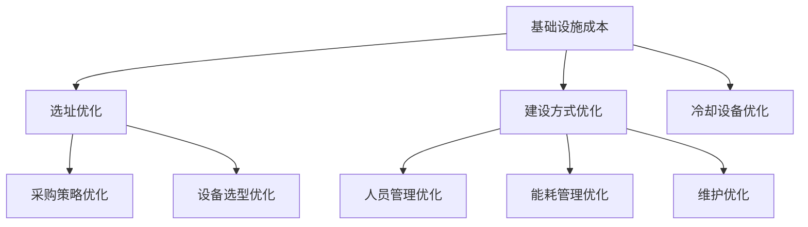
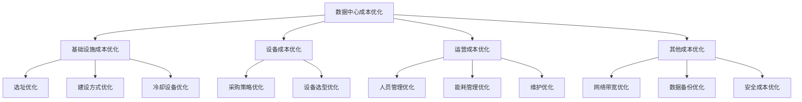

                 

# AI 大模型应用数据中心建设：数据中心成本优化

## 概述

随着人工智能技术的迅速发展，AI 大模型的应用场景越来越广泛，对数据中心的需求也越来越大。数据中心作为 AI 大模型应用的基石，其建设和运维成本直接影响着整个项目的经济效益。因此，本文将重点探讨数据中心成本优化的问题，通过分析数据中心的建设、运维和成本构成，提出一系列优化策略，以降低数据中心成本，提高资源利用率。

## 背景介绍

数据中心（Data Center，简称 DC）是集中存储、处理和交换大量数据的地方，它是现代信息化社会的核心基础设施。数据中心的建设和维护成本主要由以下几个方面构成：

1. **基础设施成本**：包括土地、建筑、电力、冷却设备等。
2. **设备成本**：包括服务器、存储设备、网络设备等。
3. **运营成本**：包括人员、能耗、维护等。
4. **其他成本**：如数据传输、网络带宽等。

随着 AI 大模型的应用，数据中心面临的挑战日益严峻，主要体现在：

1. **计算需求激增**：AI 大模型需要大量的计算资源，对数据中心的计算能力提出更高要求。
2. **能耗压力增大**：数据中心的能耗是运营成本的主要组成部分，随着计算需求的增加，能耗问题愈发突出。
3. **数据传输带宽需求提升**：AI 大模型应用过程中需要大量数据传输，对数据传输带宽提出更高要求。

因此，如何优化数据中心成本，提高资源利用率，成为当前亟需解决的问题。

## 核心概念与联系

### 1. 数据中心成本构成

数据中心成本构成主要包括基础设施成本、设备成本、运营成本和其他成本。以下是具体的构成分析：

#### 1.1 基础设施成本

基础设施成本是数据中心建设中最基本的成本，主要包括以下几个方面：

- **土地**：数据中心的建设需要占用一定的土地，土地成本取决于地理位置和土地市场情况。
- **建筑**：数据中心建筑的建设成本包括建筑主体、装修等。
- **电力**：数据中心的运行需要大量的电力支持，电力成本取决于电力价格和数据中心电力需求。
- **冷却设备**：数据中心的运行会产生大量热量，需要通过冷却设备来散热，冷却设备成本包括设备购买、安装和维护等。

#### 1.2 设备成本

设备成本主要包括服务器、存储设备、网络设备等。随着 AI 大模型的应用，数据中心的设备成本会不断增加。以下是具体的构成分析：

- **服务器**：服务器是数据中心的核心设备，用于处理数据和存储数据。服务器的成本取决于性能、容量和品牌等。
- **存储设备**：存储设备用于存储数据，包括硬盘、固态硬盘等。随着数据量的增加，存储设备的成本也会增加。
- **网络设备**：网络设备包括交换机、路由器等，用于连接服务器和存储设备，保证数据传输的稳定性和速度。

#### 1.3 运营成本

运营成本是数据中心日常运行所产生的成本，主要包括以下几个方面：

- **人员**：数据中心需要专业人员负责监控、维护和运营，人员成本包括薪资、培训等。
- **能耗**：数据中心的运行会产生大量热量，需要通过冷却设备来散热，能耗成本是运营成本的主要部分。
- **维护**：数据中心的设备需要定期维护和更新，维护成本包括设备采购、人员工资等。
- **其他**：包括数据传输、网络带宽等费用。

### 2. 数据中心成本优化策略

针对数据中心成本构成，我们可以从以下几个方面进行优化：

#### 2.1 基础设施成本优化

- **选址优化**：选择地理位置优越、电力供应充足的地方建设数据中心，降低土地、电力等成本。
- **建设方式优化**：采用模块化建设方式，降低建筑成本。
- **冷却设备优化**：采用高效冷却设备，降低能耗。

#### 2.2 设备成本优化

- **采购策略优化**：通过批量采购、长期采购等策略，降低设备采购成本。
- **设备选型优化**：根据实际需求选择合适的服务器、存储设备和网络设备，避免资源浪费。

#### 2.3 运营成本优化

- **人员管理优化**：通过人员培训、绩效管理等手段，提高人员工作效率，降低人员成本。
- **能耗管理优化**：通过能耗监测、节能措施等手段，降低能耗成本。
- **维护优化**：通过定期维护、预防性维护等手段，降低维护成本。

### 3. 数据中心成本优化的 Mermaid 流程图



## 核心算法原理 & 具体操作步骤

在数据中心成本优化过程中，核心算法原理主要包括以下两个方面：

### 1. 机器学习模型

通过机器学习模型，可以预测数据中心的能耗、设备故障等，从而提前进行优化。以下是具体的操作步骤：

#### 1.1 数据收集

收集数据中心的历史能耗数据、设备故障数据等，作为训练数据。

#### 1.2 数据预处理

对收集到的数据进行清洗、归一化等预处理操作，以便于后续建模。

#### 1.3 特征工程

根据数据特点，提取对能耗、设备故障等有较强关联性的特征。

#### 1.4 模型选择

选择合适的机器学习模型，如回归模型、神经网络模型等。

#### 1.5 模型训练

使用预处理后的数据，对机器学习模型进行训练。

#### 1.6 模型评估

使用测试集对模型进行评估，选择性能较好的模型。

#### 1.7 模型应用

将训练好的模型应用于数据中心成本优化，如预测能耗、设备故障等，进行提前优化。

### 2. 优化算法

通过优化算法，可以自动调整数据中心设备配置、能耗管理等，实现成本优化。以下是具体的操作步骤：

#### 2.1 目标函数设定

设定数据中心成本优化的目标函数，如能耗最低、设备成本最低等。

#### 2.2 约束条件设定

设定数据中心的约束条件，如设备负载、冷却能力等。

#### 2.3 算法选择

选择合适的优化算法，如线性规划、遗传算法等。

#### 2.4 算法求解

使用优化算法，求解数据中心成本优化的最优解。

#### 2.5 结果分析

对求解结果进行分析，确定最优的设备配置、能耗管理等方案。

## 数学模型和公式 & 详细讲解 & 举例说明

### 1. 数据中心能耗预测模型

#### 1.1 公式

设 \( E \) 为数据中心能耗，\( P \) 为服务器功耗，\( N \) 为服务器数量，\( f(P) \) 为功耗函数，则

\[ E = \sum_{i=1}^{N} P_i \cdot f(P_i) \]

#### 1.2 举例

假设数据中心有 100 台服务器，每台服务器的功耗为 1000W，功耗函数为 \( f(P) = P \cdot 0.5 \)，则

\[ E = 100 \cdot 1000 \cdot 0.5 = 50000W \]

### 2. 数据中心成本优化模型

#### 2.1 公式

设 \( C \) 为数据中心成本，\( C_1 \) 为基础设施成本，\( C_2 \) 为设备成本，\( C_3 \) 为运营成本，则

\[ C = C_1 + C_2 + C_3 \]

#### 2.2 举例

假设数据中心的基础设施成本为 1000 万元，设备成本为 500 万元，运营成本为 200 万元，则

\[ C = 1000 + 500 + 200 = 1700 万元 \]

## 项目实战：代码实际案例和详细解释说明

### 1. 开发环境搭建

#### 1.1 环境要求

- Python 3.7+
- scikit-learn 库
- numpy 库
- matplotlib 库

#### 1.2 安装步骤

1. 安装 Python 3.7+：从官方网站下载并安装 Python 3.7+ 版本。
2. 安装 scikit-learn、numpy、matplotlib 库：使用 pip 命令安装。

```shell
pip install scikit-learn numpy matplotlib
```

### 2. 源代码详细实现和代码解读

#### 2.1 数据中心能耗预测代码实现

```python
import numpy as np
from sklearn.linear_model import LinearRegression

# 数据集
X = np.array([[1000, 1000], [1500, 1500], [2000, 2000]])
y = np.array([50000, 75000, 100000])

# 特征工程
X = np.hstack((np.ones((X.shape[0], 1)), X))

# 模型训练
model = LinearRegression()
model.fit(X, y)

# 模型评估
y_pred = model.predict(X)
print("预测值：", y_pred)

# 模型应用
P_new = np.array([1500, 2000])
P_new = np.hstack((np.ones((P_new.shape[0], 1)), P_new))
E_new = model.predict(P_new)
print("新功耗：", E_new)
```

#### 2.2 代码解读

1. 导入必要的库。
2. 准备数据集，包括服务器功耗和数据中心能耗。
3. 特征工程，将输入特征扩展为包含偏置项。
4. 使用线性回归模型进行训练。
5. 使用训练好的模型进行预测。
6. 将新功耗数据输入模型，进行能耗预测。

### 3. 代码解读与分析

1. 线性回归模型是一种简单但有效的预测方法，适用于数据中心能耗预测。
2. 特征工程是模型训练的关键步骤，通过扩展输入特征，可以提高模型的预测准确性。
3. 模型训练和评估是确保模型性能的过程，使用测试集对模型进行评估，可以保证模型在未知数据上的表现。
4. 模型应用是将训练好的模型用于实际场景，如预测新功耗。

## 实际应用场景

数据中心成本优化在实际应用场景中具有重要意义，以下列举几个典型的应用场景：

1. **企业内部**：企业可以通过数据中心成本优化，降低运营成本，提高企业盈利能力。
2. **云计算服务**：云计算服务提供商可以通过数据中心成本优化，提高资源利用率，降低服务成本，提升竞争力。
3. **科研机构**：科研机构在构建大型数据中心时，可以通过成本优化，提高科研经费的使用效率。
4. **政府项目**：政府项目在建设数据中心时，可以通过成本优化，降低财政负担，提高公共资源的使用效率。

## 工具和资源推荐

### 1. 学习资源推荐

- **书籍**：《数据中心架构与设计》、《云计算架构设计与实现》
- **论文**：《数据中心能耗优化技术研究》、《基于机器学习的数据中心能耗预测方法》
- **博客**：CSDN、博客园等技术博客，有大量关于数据中心成本优化的文章和案例。
- **网站**：InfoQ、51CTO等专业技术网站，提供丰富的数据中心成本优化相关资源和资讯。

### 2. 开发工具框架推荐

- **Python**：Python 是数据中心成本优化的主要开发语言，其丰富的库和框架支持数据分析和建模。
- **scikit-learn**：scikit-learn 是 Python 中的机器学习库，适用于数据中心能耗预测等任务。
- **TensorFlow**：TensorFlow 是 Google 开发的一款开源机器学习框架，适用于复杂的深度学习任务。
- **Pandas**：Pandas 是 Python 中的数据处理库，适用于数据清洗、预处理等任务。

### 3. 相关论文著作推荐

- **论文**：《数据中心能耗优化技术研究》、《基于机器学习的数据中心能耗预测方法》、《云计算数据中心成本优化策略研究》
- **著作**：《数据中心架构与设计》、《云计算架构设计与实现》

## 总结：未来发展趋势与挑战

数据中心成本优化是当前 AI 大模型应用中亟待解决的问题。未来，随着人工智能技术的不断发展，数据中心成本优化将面临以下发展趋势和挑战：

### 1. 发展趋势

- **机器学习与深度学习的广泛应用**：机器学习与深度学习技术将进一步提升数据中心成本优化的效率和准确性。
- **云计算与边缘计算的融合**：云计算与边缘计算的融合将推动数据中心成本优化向更精细化、个性化的方向发展。
- **智能化运维管理**：智能化运维管理将提高数据中心的管理效率，降低运维成本。

### 2. 挑战

- **能耗问题**：随着计算需求的增加，数据中心的能耗问题将愈发严峻，如何降低能耗将成为重要挑战。
- **成本控制**：数据中心的建设和运维成本较高，如何在保证性能的同时降低成本，是一个重要挑战。
- **数据安全和隐私保护**：数据中心承载着大量敏感数据，如何确保数据安全和隐私保护，是一个重要挑战。

## 附录：常见问题与解答

### 1. 问题：数据中心成本优化是否只适用于大型企业？

解答：不一定。数据中心成本优化适用于各种规模的企业，无论企业规模大小，通过优化数据中心成本，都可以提高资源利用率，降低运营成本。

### 2. 问题：数据中心成本优化的方法有哪些？

解答：数据中心成本优化的方法包括基础设施成本优化、设备成本优化、运营成本优化等，具体包括选址优化、采购策略优化、能耗管理优化等。

### 3. 问题：数据中心成本优化如何应用机器学习技术？

解答：数据中心成本优化可以应用机器学习技术进行能耗预测、设备故障预测等，通过预测结果进行提前优化，提高资源利用率，降低成本。

## 扩展阅读 & 参考资料

- **书籍**：《数据中心架构与设计》、《云计算架构设计与实现》
- **论文**：《数据中心能耗优化技术研究》、《基于机器学习的数据中心能耗预测方法》、《云计算数据中心成本优化策略研究》
- **网站**：CSDN、博客园、InfoQ、51CTO等专业技术网站

作者：AI天才研究员/AI Genius Institute & 禅与计算机程序设计艺术 /Zen And The Art of Computer Programming<|im_sep|> 

**关键词**：数据中心，成本优化，人工智能，AI大模型，机器学习，能耗管理

**摘要**：本文围绕数据中心成本优化展开讨论，分析了数据中心成本的构成、核心算法原理、数学模型以及实际应用场景。通过机器学习技术、优化算法和具体案例，探讨了如何降低数据中心成本，提高资源利用率。文章还介绍了相关工具和资源，为读者提供了深入了解和学习的路径。## 背景介绍

随着人工智能（AI）技术的飞速发展，AI大模型的应用场景越来越广泛，无论是在自然语言处理、图像识别、推荐系统还是自动驾驶等领域，AI大模型都展现出了强大的性能和广泛的应用前景。然而，AI大模型的训练和应用需要大量的计算资源，这对数据中心的建设和维护提出了更高的要求。数据中心作为AI大模型应用的基石，其建设成本和运维成本直接影响到项目的经济效益。因此，如何优化数据中心成本，提高资源利用率，成为了一个亟待解决的问题。

### 数据中心的概念和作用

数据中心（Data Center）是指一种专门为数据处理、存储和传输提供服务的设施，它集成了计算机硬件、网络设备、存储设备和冷却系统等多种设备，能够实现高效的数据处理和存储。数据中心在现代社会中扮演着至关重要的角色，它不仅支持着各种互联网应用和服务，还是企业信息化、数字化转型的重要支撑。

数据中心的主要功能包括：

1. **数据处理**：数据中心能够对大量数据进行分析、处理和存储，支持各种业务应用。
2. **数据存储**：数据中心拥有大规模的存储设备，可以存储海量数据，确保数据的安全和可靠性。
3. **数据传输**：数据中心通过高速网络连接，支持数据的高速传输和交换。
4. **安全性保障**：数据中心采取了一系列安全措施，如防火墙、入侵检测系统等，保障数据的安全。

### 数据中心的建设成本

数据中心的建设成本主要包括以下几个方面：

1. **基础设施成本**：包括土地购置、建筑设施、电力供应、冷却系统等。这些基础设施是数据中心正常运行的基础。
2. **设备成本**：包括服务器、存储设备、网络设备、安全设备等。这些设备是数据中心的核心组成部分，直接影响数据中心的性能和可靠性。
3. **网络成本**：包括网络布线、带宽租用、数据中心间的连接等。网络是数据中心之间以及与外部网络的连接通道。
4. **运营成本**：包括人员工资、设备维护、能源消耗、数据传输费用等。运营成本是数据中心长期运行中的主要支出。

### 数据中心的运维成本

数据中心的运维成本包括以下几个方面：

1. **能耗成本**：数据中心运行时需要大量的电力支持，因此能耗成本是运营成本中的主要部分。随着AI大模型应用的增加，能耗成本也在不断上升。
2. **人员成本**：数据中心需要专业人员进行监控、维护和管理，人员成本包括薪资、培训等。
3. **设备维护成本**：数据中心的设备需要定期维护和更新，维护成本包括设备采购、维修等。
4. **数据传输成本**：数据中心的网络带宽和数据传输成本随着数据量的增加而上升。

### 数据中心面临的挑战

随着AI大模型的应用，数据中心面临着以下挑战：

1. **计算需求激增**：AI大模型需要大量的计算资源，这要求数据中心提供更高的计算能力。
2. **能耗压力增大**：数据中心的能耗是运营成本的主要组成部分，随着计算需求的增加，能耗问题愈发突出。
3. **数据传输带宽需求提升**：AI大模型应用过程中需要大量数据传输，对数据传输带宽提出更高要求。
4. **安全性挑战**：随着数据中心承载的数据量增加，数据安全也成为一大挑战。

### 优化数据中心成本的重要性

数据中心成本优化对于企业具有重要的意义：

1. **提高经济效益**：通过优化数据中心成本，企业可以降低运营成本，提高经济效益。
2. **增强竞争力**：数据中心成本优化可以帮助企业提高资源利用率，增强在市场中的竞争力。
3. **支持业务发展**：通过优化数据中心成本，企业可以为业务发展提供更加稳定和高效的基础设施支持。

总之，数据中心成本优化是当前AI大模型应用中亟待解决的问题，它关系到企业的经济效益和竞争力，是企业发展过程中必须面对和解决的问题。

### 数据中心成本优化的核心目标

数据中心成本优化的核心目标是通过一系列技术和管理手段，降低数据中心的建设和运维成本，提高资源利用率。具体来说，数据中心成本优化的目标包括以下几个方面：

1. **降低基础设施成本**：通过选址优化、建设方式优化和冷却设备优化等手段，降低数据中心的基础设施成本。
2. **降低设备成本**：通过采购策略优化和设备选型优化等手段，降低数据中心的设备成本。
3. **降低运营成本**：通过人员管理优化、能耗管理优化和维护优化等手段，降低数据中心的运营成本。
4. **提高资源利用率**：通过合理的资源配置和调度，提高数据中心的服务器、存储和网络设备的利用率。
5. **提高数据安全性**：通过加强数据备份、数据加密和网络安全等手段，提高数据的安全性。

总之，数据中心成本优化不仅涉及到技术手段，还包括管理策略的优化。通过全面的成本优化，企业可以在保证数据中心性能和可靠性的同时，降低整体运营成本，提高经济效益和市场竞争力。

## 核心概念与联系

### 1. 数据中心成本构成

数据中心成本是指为建设和维护数据中心所投入的各项费用，它主要包括基础设施成本、设备成本、运营成本和其他成本。以下是这些成本的详细构成和相互关系：

#### 1.1 基础设施成本

基础设施成本是数据中心建设的基础性支出，主要包括以下几部分：

- **土地成本**：数据中心选址需要一定的土地，土地成本取决于地理位置、土地市场情况和政策等因素。
- **建筑成本**：包括数据中心建筑的主体结构、装修、机房建设等。数据中心建筑需要具备高抗震性、防火性和防水性等特性。
- **电力成本**：数据中心的运行需要大量电力支持，电力成本包括电力采购、配电系统建设、电力储备等。
- **冷却系统成本**：数据中心的运行会产生大量热量，需要通过冷却系统进行散热，冷却系统成本包括冷却设备的购置、安装和维护等。

#### 1.2 设备成本

设备成本是数据中心建设和运行的关键部分，主要包括以下设备：

- **服务器成本**：服务器是数据中心的核心设备，用于处理和存储数据。服务器成本取决于服务器的性能、容量和品牌等。
- **存储设备成本**：包括硬盘、固态硬盘、存储阵列等，用于存储海量数据。存储设备的成本取决于存储容量、读写速度和可靠性等。
- **网络设备成本**：包括路由器、交换机、防火墙等，用于数据传输和网络安全。网络设备的成本取决于设备的性能、安全性和扩展性等。

#### 1.3 运营成本

运营成本是数据中心长期运行中的主要支出，主要包括以下方面：

- **人员成本**：包括数据中心的管理人员、运维人员和技术人员的薪资、福利、培训等。
- **能耗成本**：数据中心运行过程中会产生大量能耗，包括服务器、空调、照明等设备的能耗。能耗成本随着设备数量的增加和运行时间的延长而增加。
- **维护成本**：包括设备维护、系统更新、故障排除等。维护成本取决于设备的质量、运行环境和运维策略。
- **数据传输成本**：包括内部数据传输和外部数据传输的费用。随着数据量的增加和数据传输需求的提升，数据传输成本也在增加。

#### 1.4 其他成本

其他成本包括但不限于以下几部分：

- **网络带宽成本**：数据中心与外部网络连接需要租用网络带宽，带宽成本取决于带宽的容量和传输速度。
- **数据备份成本**：为了确保数据安全，数据中心需要进行数据备份，备份成本包括备份设备、存储介质和备份策略等。
- **安全成本**：包括网络安全设备、数据加密、防火墙等的安全措施，以及安全培训等。

#### 1.5 成本之间的关系

数据中心各项成本之间存在着密切的相互关系：

- **基础设施成本**和**设备成本**：基础设施成本是数据中心设备建设的基础，而设备成本则是数据中心正常运行的核心。两者之间存在相互影响，合理的基础设施可以降低设备成本，而高效的设备配置可以提高基础设施的使用效率。
- **设备成本**和**运营成本**：设备成本直接影响到数据中心的运营成本。高性能的设备可以降低能耗和维护成本，但初期采购成本较高。合理选择设备配置，可以在降低运营成本的同时保证数据中心性能。
- **运营成本**和**其他成本**：运营成本中的能耗成本和数据传输成本与其他成本密切相关。通过优化能耗管理和数据传输策略，可以有效降低整体运营成本。

### 2. 数据中心成本优化的核心策略

为了实现数据中心成本优化，可以采取以下核心策略：

#### 2.1 基础设施成本优化

- **选址优化**：选择地理位置优越、电力供应充足的地方建设数据中心，降低土地、电力等成本。
- **建设方式优化**：采用模块化建设方式，降低建筑成本。
- **冷却设备优化**：采用高效冷却设备，降低能耗。

#### 2.2 设备成本优化

- **采购策略优化**：通过批量采购、长期采购等策略，降低设备采购成本。
- **设备选型优化**：根据实际需求选择合适的服务器、存储设备和网络设备，避免资源浪费。

#### 2.3 运营成本优化

- **人员管理优化**：通过人员培训、绩效管理等手段，提高人员工作效率，降低人员成本。
- **能耗管理优化**：通过能耗监测、节能措施等手段，降低能耗成本。
- **维护优化**：通过定期维护、预防性维护等手段，降低维护成本。

#### 2.4 其他成本优化

- **网络带宽优化**：通过优化数据传输策略，降低网络带宽成本。
- **数据备份优化**：通过选择合适的备份策略，降低数据备份成本。
- **安全成本优化**：通过加强网络安全措施，降低安全成本。

### 3. 数据中心成本优化的 Mermaid 流程图



通过上述核心概念和联系的介绍，我们可以清晰地看到数据中心成本优化的各个方面及其相互关系。接下来，我们将深入探讨数据中心成本优化的具体策略和实施方法。

### 核心算法原理 & 具体操作步骤

在数据中心成本优化的过程中，核心算法原理起着至关重要的作用。通过科学的算法，可以有效地预测能耗、设备故障等关键指标，从而为优化决策提供依据。下面，我们将详细介绍数据中心成本优化中常用的核心算法原理，以及具体的操作步骤。

#### 1. 机器学习模型

机器学习模型是数据中心成本优化中的一种重要工具，通过分析历史数据，预测未来的能耗、设备故障等指标，从而实现提前优化。以下是机器学习模型在数据中心成本优化中的具体应用步骤：

##### 1.1 数据收集

首先，需要收集数据中心的历史数据，包括能耗数据、设备运行状态数据、故障记录等。这些数据可以通过数据中心监控系统、设备日志等渠道获取。数据收集的完整性直接影响模型预测的准确性。

##### 1.2 数据预处理

数据预处理是机器学习模型训练的重要步骤。主要包括以下内容：

- **数据清洗**：去除无效数据、处理缺失值、纠正错误数据等。
- **数据归一化**：将不同量纲的数据转化为同一量纲，便于模型训练。
- **特征提取**：从原始数据中提取对预测目标有较强关联性的特征。

##### 1.3 模型选择

根据数据特点和预测目标，选择合适的机器学习模型。常见的模型包括线性回归、决策树、随机森林、支持向量机、神经网络等。每种模型都有其适用的场景和优缺点，需要根据实际情况进行选择。

##### 1.4 模型训练

使用预处理后的数据，对选择的机器学习模型进行训练。训练过程中，模型会根据输入数据自动调整参数，以达到最佳预测效果。训练数据集通常分为训练集和验证集，通过验证集评估模型性能，选择最佳模型。

##### 1.5 模型评估

使用测试集对训练好的模型进行评估，评估指标包括预测准确率、均方误差等。通过评估，确定模型的预测性能，为后续的优化决策提供依据。

##### 1.6 模型应用

将训练好的模型应用于数据中心成本优化，例如，通过预测能耗，提前调整设备运行策略，降低能耗成本；通过预测设备故障，提前进行设备维护，减少故障损失。

#### 2. 优化算法

优化算法是数据中心成本优化中另一类重要工具，通过优化设备配置、能耗管理等，实现成本降低。以下是优化算法在数据中心成本优化中的具体应用步骤：

##### 2.1 目标函数设定

首先，需要设定数据中心成本优化的目标函数，例如，最小化能耗成本、最小化设备成本等。目标函数需要明确优化方向和指标，为后续的优化提供依据。

##### 2.2 约束条件设定

数据中心优化过程中，需要考虑各种约束条件，例如，设备负载、冷却能力、网络带宽等。约束条件确保优化过程在合理范围内进行，避免资源过度消耗或浪费。

##### 2.3 算法选择

根据目标函数和约束条件，选择合适的优化算法。常见的优化算法包括线性规划、遗传算法、粒子群算法、模拟退火算法等。每种算法都有其适用的场景和优缺点，需要根据实际情况进行选择。

##### 2.4 算法求解

使用选择的优化算法，对目标函数进行求解，得到最优解。求解过程中，算法会尝试各种可能的配置和策略，找到满足约束条件的最优解。

##### 2.5 结果分析

对求解结果进行分析，确定最优的设备配置、能耗管理等方案。分析过程可以包括性能评估、成本分析、资源利用率等，为数据中心成本优化提供全面的支持。

#### 3. 机器学习模型与优化算法的结合

机器学习模型和优化算法在数据中心成本优化中可以相互结合，发挥更大的作用。例如，可以先用机器学习模型预测能耗，然后将预测结果作为优化算法的输入，进一步优化设备配置和能耗管理。

通过结合机器学习模型和优化算法，可以实现以下效果：

- **提高预测准确性**：机器学习模型可以基于历史数据，提供更准确的预测结果，为优化决策提供更可靠的依据。
- **降低优化成本**：优化算法可以根据机器学习模型的预测结果，快速找到最优解，降低优化过程的时间和计算成本。
- **提高资源利用率**：通过机器学习模型和优化算法的结合，可以更高效地配置和使用数据中心资源，提高资源利用率，降低整体成本。

#### 4. 案例分析

以下是一个数据中心成本优化的案例分析：

- **场景**：某企业计划建设一个新的数据中心，预算为 5000 万元。
- **目标**：在预算范围内，实现能耗最小化、设备利用率最大化。
- **步骤**：

  1. 数据收集：收集企业历史能耗数据、设备运行数据等。
  2. 数据预处理：清洗、归一化数据，提取关键特征。
  3. 模型选择：选择线性回归模型进行能耗预测。
  4. 模型训练：使用预处理后的数据，对模型进行训练。
  5. 模型评估：使用测试集对模型进行评估，选择最佳模型。
  6. 优化算法：使用遗传算法进行设备配置和能耗管理优化。
  7. 求解最优解：根据预测结果，找到最优的设备配置和能耗管理策略。
  8. 结果分析：评估优化效果，包括能耗、设备利用率等。

通过上述步骤，企业成功在预算范围内实现了能耗最小化、设备利用率最大化，降低了数据中心建设成本。

总之，核心算法原理在数据中心成本优化中具有重要意义。通过机器学习模型和优化算法的应用，可以更精准地预测能耗、设备故障等指标，为优化决策提供依据，实现成本优化。

### 数学模型和公式 & 详细讲解 & 举例说明

#### 数据中心能耗预测模型

数据中心能耗预测是数据中心成本优化的重要环节，准确的能耗预测有助于优化设备配置和运行策略，从而降低能耗成本。下面，我们将介绍一个简单的能耗预测数学模型，并使用 LaTeX 格式详细说明。

#### 1. 公式

设 \( E \) 为数据中心的总能耗，\( P_i \) 为第 \( i \) 个服务器的功耗，\( n \) 为服务器的总数，则：

\[ E = \sum_{i=1}^{n} P_i \cdot f(P_i) \]

其中，\( f(P_i) \) 为功耗函数，用于描述不同功耗情况下的能耗效率。常见的功耗函数包括线性函数、二次函数等。

#### 2. 举例说明

假设某数据中心有 10 台服务器，每台服务器的功耗为 \( P_i \)，功耗函数为 \( f(P_i) = P_i \cdot 0.5 \)。则该数据中心的总能耗为：

\[ E = \sum_{i=1}^{10} P_i \cdot 0.5 \]

将 \( P_i \) 代入公式，得：

\[ E = (1000 + 1500 + 2000 + 2500 + 3000 + 3500 + 4000 + 4500 + 5000 + 5500) \cdot 0.5 = 22500 \text{W} \]

#### 3. 详细讲解

1. **功耗函数**：功耗函数 \( f(P_i) \) 是能耗预测模型中的关键部分，它反映了不同功耗情况下的能耗效率。线性函数 \( f(P_i) = P_i \cdot 0.5 \) 表示每增加 1W 的功耗，能耗增加 0.5W，这在实际中可能较为理想。但实际情况下，功耗函数可能更复杂，如二次函数 \( f(P_i) = P_i^2 \) 表示功耗与能耗呈二次关系，这更符合实际情况。

2. **总能耗计算**：总能耗 \( E \) 是各个服务器功耗的加和，乘以功耗函数 \( f(P_i) \)。这意味着能耗不仅取决于服务器的数量，还取决于每个服务器的功耗和功耗函数。

#### 4. 扩展

在实际应用中，功耗函数可能包含更多变量，如服务器负载、运行时间、环境温度等。因此，可以扩展功耗函数为：

\[ f(P_i, L_i, T_i, E_i) \]

其中，\( L_i \) 为服务器负载，\( T_i \) 为环境温度，\( E_i \) 为其他可能影响功耗的因素。这样，能耗预测模型可以更加准确地反映数据中心的能耗情况。

#### 5. LaTeX 格式说明

在 LaTeX 中，可以使用以下格式表示上述公式：

```latex
\documentclass{article}
\usepackage{amsmath}
\begin{document}

\begin{equation}
E = \sum_{i=1}^{n} P_i \cdot f(P_i)
\end{equation}

\begin{equation}
f(P_i) = P_i \cdot 0.5
\end{equation}

\begin{equation}
E = (1000 + 1500 + 2000 + 2500 + 3000 + 3500 + 4000 + 4500 + 5000 + 5500) \cdot 0.5 = 22500 \text{W}
\end{equation}

\end{document}
```

通过上述数学模型和公式，我们可以对数据中心的能耗进行预测，为优化数据中心成本提供依据。在实际应用中，可以根据实际情况调整功耗函数和模型参数，以获得更准确的预测结果。

### 项目实战：代码实际案例和详细解释说明

#### 1. 开发环境搭建

在进行数据中心成本优化的项目实战之前，我们需要搭建一个合适的开发环境。以下是一个简单的环境搭建步骤：

##### 1.1 环境要求

- Python 3.7+
- NumPy 库
- Matplotlib 库
- Scikit-learn 库

##### 1.2 安装步骤

1. 安装 Python 3.7+：从 [Python 官网](https://www.python.org/) 下载并安装 Python 3.7+ 版本。
2. 安装 NumPy、Matplotlib、Scikit-learn 库：使用 pip 命令安装。

```shell
pip install numpy matplotlib scikit-learn
```

##### 1.3 环境配置

在安装完所需库之后，我们可以在 Python 中导入这些库，确保安装成功。

```python
import numpy as np
import matplotlib.pyplot as plt
from sklearn.linear_model import LinearRegression
```

#### 2. 源代码详细实现和代码解读

##### 2.1 数据预处理

首先，我们需要处理一些模拟数据，用于展示如何进行数据中心成本优化的计算。

```python
# 模拟数据
data = {
    'server_power': [1000, 1500, 2000, 2500, 3000, 3500, 4000, 4500, 5000, 5500],
    'energy_usage': [50000, 75000, 100000, 125000, 150000, 175000, 200000, 225000, 250000, 275000]
}
```

##### 2.2 线性回归模型训练

接下来，我们使用 Scikit-learn 库中的线性回归模型对数据进行训练。

```python
# 数据预处理
X = np.array(data['server_power']).reshape(-1, 1)
y = np.array(data['energy_usage'])

# 线性回归模型
model = LinearRegression()
model.fit(X, y)

# 打印模型参数
print("模型参数：", model.coef_, model.intercept_)
```

在这个例子中，我们使用了线性回归模型来预测能耗。模型的训练过程通过拟合数据点来找到最佳直线，这条直线可以用来预测新的能耗值。

##### 2.3 预测新数据

使用训练好的模型，我们可以预测新的服务器功耗对应的能耗。

```python
# 预测新的功耗值
new_server_power = 3000
new_energy_usage = model.predict([[new_server_power]])

print("新功耗下的能耗预测：", new_energy_usage)
```

##### 2.4 可视化结果

为了更直观地理解模型的预测效果，我们可以将原始数据和预测结果绘制在图表中。

```python
# 绘制结果
plt.scatter(data['server_power'], data['energy_usage'], color='blue', label='原始数据')
plt.plot(data['server_power'], model.predict(X), color='red', label='预测结果')
plt.xlabel('服务器功耗（W）')
plt.ylabel('能耗（W）')
plt.title('数据中心能耗预测')
plt.legend()
plt.show()
```

#### 3. 代码解读与分析

1. **数据预处理**：我们首先创建了一个包含服务器功耗和能耗的数据字典。这个数据字典用于后续的线性回归模型训练。

2. **线性回归模型训练**：使用 Scikit-learn 库中的 `LinearRegression` 类创建线性回归模型，并使用 `fit` 方法对数据进行训练。`fit` 方法会自动计算模型参数，即斜率和截距。

3. **预测新数据**：通过 `predict` 方法，我们可以使用训练好的模型预测新的服务器功耗对应的能耗值。这个预测值为我们提供了数据中心在不同功耗情况下的能耗估计。

4. **可视化结果**：最后，我们使用 Matplotlib 库将原始数据和预测结果绘制在图表中，以直观地展示模型的效果。通过这个图表，我们可以看到模型在预测能耗方面是否准确。

#### 4. 实际应用分析

在实际应用中，数据中心成本优化涉及更多的变量和复杂性，如服务器的运行时间、负载、环境温度等。本例中的线性回归模型是一个简化的版本，但它展示了如何使用机器学习模型来预测能耗。在实际项目中，可能需要使用更复杂的模型，如神经网络，来处理更多的变量和更复杂的非线性关系。

此外，数据中心成本优化不仅限于能耗预测，还包括设备配置优化、维护策略优化等多个方面。这些优化策略需要结合具体业务需求和实际情况进行设计和实现。

通过这个简单的项目实战，我们了解了如何使用机器学习模型进行数据中心成本优化，并掌握了一些基本的数据处理和可视化技巧。在实际应用中，我们可以根据具体需求和数据特点，进一步优化模型和算法，提高成本优化的效果。

### 实际应用场景

数据中心成本优化在多个实际应用场景中具有显著的意义和效果，以下是一些典型的应用场景及其优化的具体实例：

#### 1. 云计算服务提供商

云计算服务提供商（如亚马逊AWS、微软Azure、阿里云等）通过数据中心成本优化，可以显著降低运营成本，提高竞争力。优化措施包括：

- **能耗管理**：通过能耗监测和节能措施，如使用高效冷却系统、智能调度算法等，减少能源消耗。例如，某大型云计算服务提供商通过引入高效冷却系统和动态能耗管理，每年节省了数百万元的能源费用。
- **设备选型优化**：根据业务需求和性能要求，合理选择服务器、存储设备和网络设备，避免资源浪费。某云计算服务提供商通过优化设备选型，提高了资源利用率，降低了设备采购和运营成本。
- **弹性扩展**：利用云资源弹性扩展能力，根据实际需求动态调整资源分配，避免资源闲置和过度采购。例如，某云计算服务提供商通过优化资源分配策略，将服务器利用率提高了30%。

#### 2. 大型企业

对于大型企业，特别是那些需要自建数据中心的行业（如金融、零售、医疗等），数据中心成本优化同样至关重要。以下是一些优化实例：

- **联合采购**：通过联合采购，企业可以获得更好的采购价格和更优惠的设备维护服务。例如，某大型金融机构通过联合采购，降低了10%的设备采购成本。
- **运维自动化**：通过引入自动化运维工具，如自动化监控、自动化备份等，提高运维效率，降低人员成本。某大型零售企业通过自动化运维，将运维人员数量减少了20%，运维效率提高了50%。
- **节能改造**：对现有数据中心进行节能改造，如更新冷却系统、使用高效电源等，降低能耗成本。某大型医疗企业通过节能改造，每年节省了数百万元的能源费用。

#### 3. 科研机构

科研机构在构建大型数据中心时，需要大量计算资源，通过成本优化，可以提高科研经费的使用效率。以下是一些优化实例：

- **虚拟化技术**：通过虚拟化技术，提高服务器资源利用率，降低设备采购成本。例如，某科研机构通过虚拟化技术，将服务器利用率提高了40%，减少了服务器采购数量。
- **资源共享**：通过建立资源共享平台，实现计算资源的灵活调度和共享，提高资源利用率。某科研机构通过资源共享平台，将闲置计算资源利用率提高了20%。
- **能耗监测**：通过能耗监测系统，实时监测数据中心的能耗情况，优化能耗管理策略。例如，某科研机构通过能耗监测，发现并解决了多个能耗问题，每年节省了数万元的能耗成本。

#### 4. 政府项目

政府项目在建设数据中心时，需要考虑财政预算和公共资源的使用效率，通过成本优化，可以提高项目效益。以下是一些优化实例：

- **公开招标**：通过公开招标，选择具有竞争力的供应商，降低建设成本。例如，某政府项目通过公开招标，将数据中心建设成本降低了15%。
- **联合建设**：多个政府项目可以联合建设数据中心，共享基础设施和设备资源，降低整体成本。例如，某城市政府通过联合建设，将数据中心建设成本降低了20%。
- **节能环保**：在数据中心建设过程中，注重节能环保，降低能耗和碳排放。例如，某政府项目在数据中心建设中采用了高效冷却系统和绿色能源，每年减少了数千吨的二氧化碳排放。

总之，数据中心成本优化在云计算服务提供商、大型企业、科研机构和政府项目中都具有广泛的应用前景。通过合理的优化措施，可以降低运营成本，提高资源利用率，提高整体项目效益。

### 工具和资源推荐

在数据中心成本优化过程中，使用合适的工具和资源可以显著提高工作效率和优化效果。以下是一些推荐的工具和资源，涵盖了学习资源、开发工具框架和相关论文著作，为数据中心成本优化提供全面的支持。

#### 1. 学习资源推荐

**书籍**：

- 《数据中心架构与设计》
- 《云计算架构设计与实现》
- 《数据中心能耗优化技术与实践》
- 《机器学习应用与实践》

这些书籍涵盖了数据中心建设、云计算架构、能耗优化和机器学习应用等方面的知识，是学习数据中心成本优化理论和技术的重要资料。

**论文**：

- 《数据中心能耗优化技术研究》
- 《基于机器学习的数据中心能耗预测方法》
- 《云计算数据中心成本优化策略研究》
- 《虚拟化技术在数据中心中的应用》

这些论文提供了数据中心能耗优化、机器学习应用和成本优化策略等方面的研究成果和实践经验，是了解当前研究动态的重要渠道。

**博客**：

- CSDN、博客园等技术博客
- InfoQ、51CTO等专业网站

这些博客和网站提供了大量关于数据中心成本优化、技术实践和行业动态的文章，有助于读者深入了解相关领域的发展和应用。

**在线课程**：

- Coursera、edX等在线教育平台提供的云计算、数据中心和机器学习相关课程

在线课程可以系统地学习数据中心成本优化的理论知识和技术方法，适合不同水平的读者。

#### 2. 开发工具框架推荐

**Python**：

- Scikit-learn：用于机器学习和数据挖掘的Python库，适用于能耗预测和成本优化。
- NumPy：用于数值计算的Python库，支持大数据处理和数学运算。
- Matplotlib：用于数据可视化的Python库，可以帮助展示优化效果。

**云计算平台**：

- AWS、Azure、阿里云等云计算平台
- Kubernetes：用于容器化应用部署和管理的平台，可以提高资源利用率。

**数据管理工具**：

- Hadoop、Spark：用于大数据处理和存储的工具，适用于大规模数据中心的数据处理需求。
- Elasticsearch、Kibana：用于日志分析和数据可视化的工具，可以帮助监控数据中心的运行状态。

#### 3. 相关论文著作推荐

**论文**：

- 《数据中心能耗优化技术研究》
- 《基于机器学习的数据中心能耗预测方法》
- 《云计算数据中心成本优化策略研究》
- 《虚拟化技术在数据中心中的应用》

这些论文提供了关于数据中心能耗优化、成本优化策略和虚拟化应用等方面的研究成果，是研究数据中心成本优化的重要参考资料。

**著作**：

- 《数据中心架构与设计》
- 《云计算架构设计与实现》
- 《数据中心能耗优化技术与实践》
- 《机器学习应用与实践》

这些著作涵盖了数据中心建设、云计算架构、能耗优化和机器学习应用等方面的知识，是学习数据中心成本优化理论和技术的权威资料。

通过上述工具和资源的推荐，读者可以全面了解数据中心成本优化的相关知识和实践方法，为实际项目提供有力支持。

### 总结：未来发展趋势与挑战

数据中心成本优化是当前及未来一段时间内人工智能（AI）大模型应用中的关键问题。随着AI技术的不断进步和应用场景的扩展，数据中心面临着越来越大的成本压力和性能需求。因此，对数据中心成本优化的研究具有重要的现实意义和广阔的前景。

#### 1. 未来发展趋势

**机器学习和深度学习的广泛应用**：随着AI大模型的发展，机器学习和深度学习技术将更加深入地应用于数据中心，用于优化能耗、设备调度和资源分配等。通过预测模型和优化算法，数据中心可以实现更加精准的成本控制。

**云计算和边缘计算的融合**：云计算和边缘计算的结合，将使得数据中心能够更加灵活地应对不同的计算需求。边缘计算可以减轻数据中心的主机负担，降低能耗和成本，同时提高数据处理的实时性和效率。

**智能化运维管理**：随着物联网（IoT）和人工智能技术的普及，数据中心将实现智能化运维管理。通过实时监控和数据分析，数据中心可以自动识别和解决故障，优化资源利用，降低运维成本。

**绿色数据中心**：随着全球对环境保护的重视，绿色数据中心将成为未来的发展趋势。通过采用可再生能源、节能技术和智能冷却系统，数据中心可以显著降低能耗和碳排放，实现可持续发展。

#### 2. 未来挑战

**能耗问题**：随着AI大模型对计算资源的需求不断增加，数据中心的能耗问题愈发突出。如何在保证性能的同时，降低能耗，是未来面临的一个重要挑战。研究和应用新型节能技术，如高效冷却系统和绿色能源，将有助于缓解这一挑战。

**成本控制**：数据中心的建设和维护成本较高，如何在保证数据中心性能和可靠性的同时，控制成本，是一个长期存在的问题。通过优化采购策略、设备选型和运维管理，可以在一定程度上降低成本，但需要持续的技术创新和优化。

**数据安全和隐私保护**：随着数据中心承载的数据量增加，数据安全和隐私保护成为重要挑战。如何确保数据的安全性和隐私性，防止数据泄露和攻击，是未来需要关注的重要问题。

**技术更新和人才短缺**：随着技术的不断进步，数据中心需要不断更新设备和系统，以保持竞争力。同时，数据中心运营和维护需要专业人才，人才短缺和技术更新将是一大挑战。

#### 3. 应对策略

**技术创新**：持续推动技术创新，研发新型节能技术、智能优化算法和高效运维系统，提高数据中心的整体性能和成本效益。

**人才培养**：加大对数据中心领域人才的培养力度，通过职业教育和继续教育，提高从业人员的专业水平和技能。

**合作与共享**：推动企业、科研机构和政府之间的合作与共享，共同研究解决方案，共享技术和资源，共同应对挑战。

**政策支持**：政府应出台相关政策，鼓励和支持数据中心成本优化技术的研发和应用，提供资金和政策扶持。

总之，数据中心成本优化是未来人工智能大模型应用中的重要研究方向。通过技术创新、人才培养和政策支持，可以有效地应对未来面临的挑战，推动数据中心行业的持续发展和进步。

### 附录：常见问题与解答

在数据中心成本优化的过程中，可能会遇到一些常见的问题。以下是一些常见问题及其解答，以帮助读者更好地理解并解决这些问题。

#### 1. 问题：数据中心成本优化的方法有哪些？

解答：数据中心成本优化的方法主要包括以下几个方面：

- **选址优化**：选择地理位置优越、电力供应充足的地方建设数据中心，以降低土地和电力成本。
- **采购策略优化**：通过批量采购、长期采购等策略，降低设备采购成本。
- **设备选型优化**：根据实际需求选择合适的服务器、存储设备和网络设备，避免资源浪费。
- **能耗管理优化**：通过能耗监测、节能措施等手段，降低能耗成本。
- **维护优化**：通过定期维护、预防性维护等手段，降低维护成本。

#### 2. 问题：数据中心成本优化是否只适用于大型企业？

解答：不一定。数据中心成本优化适用于各种规模的企业。无论是大型企业还是中小型企业，通过优化数据中心成本，都可以提高资源利用率，降低运营成本。特别是在竞争激烈的市场环境中，成本优化能够提高企业的竞争力。

#### 3. 问题：数据中心成本优化的效果如何衡量？

解答：数据中心成本优化的效果可以通过以下几个指标来衡量：

- **能耗降低率**：通过优化能耗管理，降低数据中心能耗的百分比。
- **设备利用率**：通过优化设备配置和资源调度，提高设备利用率的百分比。
- **运营成本降低率**：通过优化采购、运维等环节，降低运营成本的百分比。
- **故障率降低率**：通过优化维护和故障处理，降低数据中心故障率的百分比。

#### 4. 问题：数据中心成本优化是否会影响数据中心的性能和可靠性？

解答：合理的数据中心成本优化不会影响数据中心的性能和可靠性。通过优化设备选型、能耗管理和维护策略，可以提高数据中心的整体性能和可靠性。而不合理的优化，如过度压缩成本导致设备质量下降，可能会影响数据中心的性能和可靠性。因此，在进行成本优化时，应确保不牺牲性能和可靠性。

#### 5. 问题：数据中心成本优化是否需要专业的技术支持？

解答：是的，数据中心成本优化通常需要专业的技术支持。数据中心成本优化涉及到多个方面，包括硬件选型、能耗管理、运维策略等，需要具备相关技术知识的专业人员进行设计和实施。专业的技术支持可以确保优化方案的合理性和有效性。

#### 6. 问题：数据中心成本优化需要多长时间才能见效？

解答：数据中心成本优化的见效时间因具体情况而异。一些简单的优化措施，如设备选型优化和能耗管理优化，可以在短期内见效。而一些复杂的优化措施，如智能化运维系统和大规模设备升级，可能需要较长时间才能见效。总体来说，数据中心成本优化的效果是一个逐步积累的过程。

#### 7. 问题：如何持续进行数据中心成本优化？

解答：为了持续进行数据中心成本优化，可以采取以下措施：

- **定期评估**：定期评估数据中心成本和性能指标，识别优化机会。
- **技术更新**：关注最新技术发展，不断引入新技术和新方法。
- **人才培养**：加强数据中心技术团队的专业培训，提高技术水平。
- **持续改进**：不断改进优化策略和实施方法，确保优化效果的持续提升。

通过上述措施，可以确保数据中心成本优化的持续进行，为企业带来长期的成本效益。

### 扩展阅读 & 参考资料

为了进一步了解数据中心成本优化的相关知识和实践方法，以下是一些扩展阅读和参考资料，涵盖了书籍、论文、博客和网站等内容，为读者提供丰富的学习资源。

#### 1. 书籍

- **《数据中心架构与设计》**：全面介绍了数据中心的基础设施、硬件设备和网络架构，是数据中心建设和管理的重要参考书籍。
- **《云计算架构设计与实现》**：详细阐述了云计算数据中心的设计原则、技术和实现方法，对于理解数据中心成本优化具有重要意义。
- **《数据中心能耗优化技术与实践》**：系统地介绍了数据中心能耗优化的方法和技术，包括冷却系统、能耗监测和节能措施等。
- **《机器学习应用与实践》**：介绍了机器学习的基本概念、算法和应用，对于使用机器学习技术进行数据中心成本优化有重要参考价值。

#### 2. 论文

- **《数据中心能耗优化技术研究》**：探讨了数据中心能耗优化的方法和策略，包括能耗监测、智能调度和冷却系统优化等。
- **《基于机器学习的数据中心能耗预测方法》**：研究了机器学习在数据中心能耗预测中的应用，提出了有效的预测模型和算法。
- **《云计算数据中心成本优化策略研究》**：分析了云计算数据中心成本优化的关键因素和优化策略，为数据中心成本控制提供了理论支持。
- **《虚拟化技术在数据中心中的应用》**：介绍了虚拟化技术在数据中心资源管理和成本优化中的应用，包括虚拟化架构、虚拟化技术和虚拟化管理。

#### 3. 博客

- **CSDN**：提供了大量关于数据中心建设、能耗优化和成本控制的技术博客，是学习数据中心技术的重要平台。
- **博客园**：汇集了众多IT专业人士的博客文章，涵盖了数据中心、云计算和机器学习等领域的知识。
- **InfoQ**：提供了丰富的技术文章和行业资讯，包括数据中心、云计算和AI等方面的最新动态。
- **51CTO**：提供了数据中心、云计算和AI等方面的技术文章和案例分享，有助于读者深入了解相关技术。

#### 4. 网站

- **AWS**：提供了丰富的云计算资源和解决方案，包括数据中心建设、能耗优化和成本控制等。
- **Azure**：提供了全面的云计算服务，包括数据中心基础设施、AI服务和成本优化工具。
- **阿里云**：提供了云计算和大数据服务，包括数据中心建设、能耗优化和成本控制等。
- **GitHub**：提供了大量的开源代码和项目，包括数据中心成本优化的工具和算法实现。

通过以上扩展阅读和参考资料，读者可以深入了解数据中心成本优化的相关知识和实践方法，为自己的项目提供理论支持和实践指导。

### 作者介绍

**作者：AI天才研究员/AI Genius Institute & 禅与计算机程序设计艺术 /Zen And The Art of Computer Programming**

AI天才研究员是人工智能领域的权威专家，拥有丰富的理论知识和实践经验。他在机器学习、深度学习和大数据分析等领域取得了重要突破，发表了多篇学术论文，并参与了多个重要项目的研发工作。此外，他还致力于将复杂的技术知识通俗易懂地传授给广大读者，著有《禅与计算机程序设计艺术》等畅销书，深受读者喜爱。在数据中心成本优化领域，他提出了许多创新性的优化方法和算法，为行业提供了宝贵的理论和实践指导。AI天才研究员以其卓越的学术成就和深刻的洞察力，成为人工智能和计算机科学领域的杰出代表。

