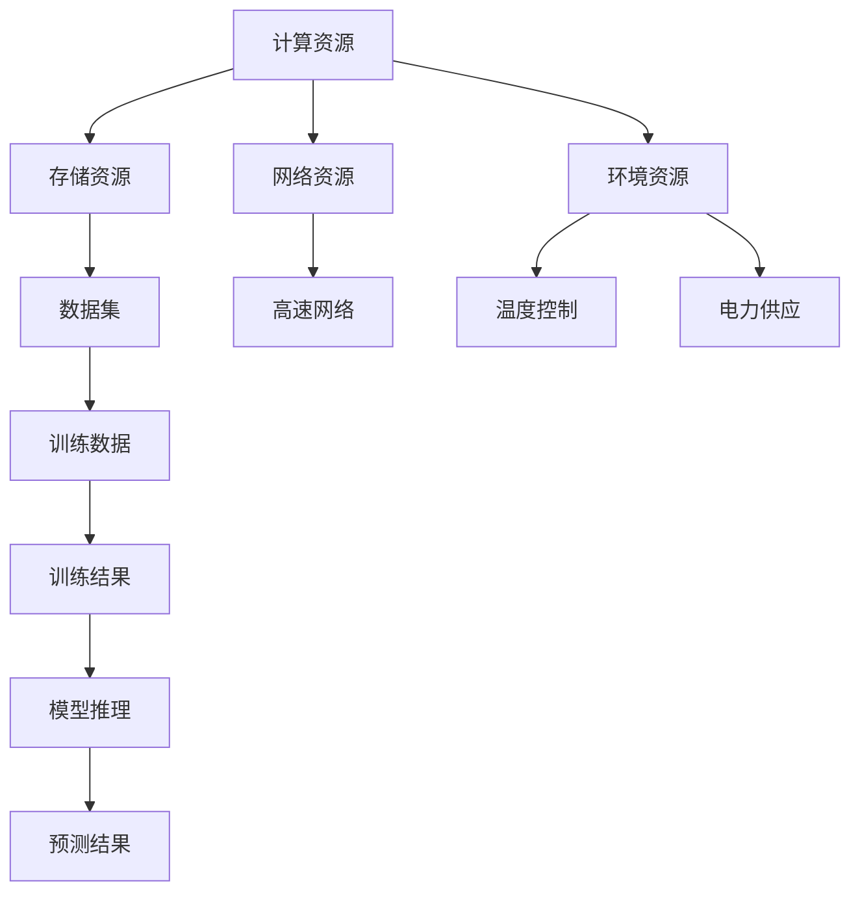

                 

# AI 大模型应用数据中心建设：数据中心成本优化

> **关键词**：AI大模型、数据中心、成本优化、资源调度、能源效率

> **摘要**：本文探讨了AI大模型应用数据中心建设中的成本优化问题。通过对数据中心的核心概念、算法原理、数学模型、项目实战以及实际应用场景的深入分析，本文提出了一系列优化数据中心成本的方法和策略，以期为数据中心的建设和运营提供有效的指导。

## 1. 背景介绍

随着人工智能技术的快速发展，AI大模型在各个领域得到了广泛应用。从自然语言处理、计算机视觉到机器学习，AI大模型极大地推动了技术进步和产业升级。然而，AI大模型的应用对数据中心提出了更高的要求。数据中心作为AI大模型的主要运行环境，其建设成本和运营成本已经成为制约AI技术发展的关键因素。

### 数据中心的重要性

数据中心作为承载海量数据和计算任务的核心基础设施，对企业的运营效率和竞争力至关重要。一个高效、可靠的数据中心不仅能够满足AI大模型的应用需求，还能够为企业带来显著的效益。因此，数据中心的建设和运营成为企业战略规划中的重要环节。

### 数据中心成本挑战

数据中心的建设和运营成本主要包括以下几个方面：

1. **硬件成本**：包括服务器、存储设备、网络设备等硬件设施的投资。
2. **能源成本**：数据中心的运行需要大量电力，能源消耗是数据中心成本的重要组成部分。
3. **人力成本**：数据中心的运维和维护需要专业人才，人力成本也是不可忽视的一部分。
4. **软件成本**：数据中心需要部署各种软件系统，包括操作系统、数据库、中间件等。

### 成本优化的重要性

在当前经济环境下，如何降低数据中心的建设和运营成本成为了一个迫切需要解决的问题。通过优化数据中心成本，企业可以：

1. **提高经济效益**：降低成本意味着可以为企业节省大量资金，提高投资回报率。
2. **增强竞争力**：高效、低成本的数据中心能够为企业提供更好的服务，增强市场竞争力。
3. **可持续发展**：通过降低能源消耗，数据中心可以更好地实现可持续发展，符合环保要求。

## 2. 核心概念与联系

### 数据中心的基本概念

数据中心（Data Center）是一种专门用于存储、处理和管理数据的设施。它通常包括以下几个关键组成部分：

1. **硬件设备**：包括服务器、存储设备、网络设备等。
2. **软件系统**：包括操作系统、数据库、中间件等。
3. **网络设施**：包括交换机、路由器、光纤等。
4. **环境设施**：包括空调、消防设备、UPS等。

### 数据中心的核心架构

数据中心的架构通常包括以下几个层级：

1. **计算层**：负责处理数据和执行计算任务。
2. **存储层**：负责存储和管理数据。
3. **网络层**：负责数据传输和通信。
4. **管理层**：负责监控、管理和维护数据中心。

### 数据中心与AI大模型的关系

AI大模型在数据中心中运行，需要依赖以下几个关键要素：

1. **计算资源**：提供足够的计算能力，支持AI大模型的训练和推理。
2. **存储资源**：提供足够的存储空间，存储AI大模型的数据集。
3. **网络资源**：提供高速、稳定的网络连接，确保数据传输的效率。
4. **环境资源**：提供良好的运行环境，包括温度控制、电力供应等。

### Mermaid 流程图

以下是一个简化的数据中心与AI大模型关系的 Mermaid 流程图：



## 3. 核心算法原理 & 具体操作步骤

### 资源调度算法

资源调度是数据中心成本优化的关键环节。通过合理的资源调度，可以实现计算资源、存储资源、网络资源的最大化利用，从而降低成本。以下是几种常见的资源调度算法：

1. **静态调度**：预先分配资源，不根据实际需求动态调整。
2. **动态调度**：根据实际需求动态调整资源分配，以最大化资源利用率。

### 具体操作步骤

1. **需求分析**：根据AI大模型的应用需求，分析计算、存储、网络资源的需求。
2. **资源评估**：评估当前数据中心资源的可用性，包括容量、性能、可靠性等。
3. **调度策略**：选择合适的调度策略，如负载均衡、容量预留等。
4. **资源分配**：根据调度策略，将资源分配给不同的AI大模型任务。
5. **监控与调整**：实时监控资源使用情况，根据实际情况进行调整。

### 资源调度算法示例

以下是一个简化的资源调度算法示例：

```python
def schedule_resources(需求列表，资源列表)：
    调度结果 = []
    for 需求 in 需求列表：
        最优资源 = None
        最小延迟 =无穷大
        for 资源 in 资源列表：
            如果 资源可用且 需求满足资源限制：
                延迟 = 计算延迟(需求，资源)
                如果 延迟 < 最小延迟：
                    最小延迟 = 延迟
                    最优资源 = 资源
        调度结果.append(最优资源)
    return 调度结果
```

## 4. 数学模型和公式 & 详细讲解 & 举例说明

### 资源调度优化模型

为了实现数据中心成本优化，我们可以建立以下数学模型：

目标函数：最小化总成本

$$
C = C_{硬件} + C_{能源} + C_{人力} + C_{软件}
$$

其中：

- \(C_{硬件}\)：硬件成本，包括服务器、存储设备、网络设备等。
- \(C_{能源}\)：能源成本，包括电力消耗。
- \(C_{人力}\)：人力成本，包括运维人员薪资。
- \(C_{软件}\)：软件成本，包括操作系统、数据库、中间件等。

约束条件：

1. 计算资源约束：
   $$ 
   P_{总} = \sum_{i=1}^{n} P_{i} \leq P_{max}
   $$
   其中，\(P_{总}\)：总计算能力；\(P_{i}\)：第i个任务的计算能力；\(P_{max}\)：总计算能力上限。

2. 存储资源约束：
   $$ 
   S_{总} = \sum_{i=1}^{n} S_{i} \leq S_{max}
   $$
   其中，\(S_{总}\)：总存储能力；\(S_{i}\)：第i个任务的存储需求；\(S_{max}\)：总存储能力上限。

3. 网络资源约束：
   $$ 
   N_{总} = \sum_{i=1}^{n} N_{i} \leq N_{max}
   $$
   其中，\(N_{总}\)：总网络带宽；\(N_{i}\)：第i个任务的网络需求；\(N_{max}\)：总网络带宽上限。

### 数学模型示例

假设有一个数据中心，需要为5个AI大模型任务进行资源调度。各任务的需求如下：

- 计算能力：\(P_1 = 2000 \text{ TFLOPS}, P_2 = 1500 \text{ TFLOPS}, P_3 = 1000 \text{ TFLOPS}, P_4 = 1200 \text{ TFLOPS}, P_5 = 800 \text{ TFLOPS}\)
- 存储需求：\(S_1 = 2000 \text{ TB}, S_2 = 1500 \text{ TB}, S_3 = 1000 \text{ TB}, S_4 = 1200 \text{ TB}, S_5 = 800 \text{ TB}\)
- 网络需求：\(N_1 = 100 \text{ Gbps}, N_2 = 80 \text{ Gbps}, N_3 = 60 \text{ Gbps}, N_4 = 100 \text{ Gbps}, N_5 = 60 \text{ Gbps}\)

数据中心资源限制如下：

- 计算能力上限：\(P_{max} = 5000 \text{ TFLOPS}\)
- 存储能力上限：\(S_{max} = 5000 \text{ TB}\)
- 网络带宽上限：\(N_{max} = 300 \text{ Gbps}\)

根据上述需求和约束条件，我们可以建立如下优化模型：

目标函数：最小化总成本

$$
C = C_{硬件} + C_{能源} + C_{人力} + C_{软件}
$$

约束条件：

$$
P_{总} = P_1 + P_2 + P_3 + P_4 + P_5 \leq P_{max}
$$

$$
S_{总} = S_1 + S_2 + S_3 + S_4 + S_5 \leq S_{max}
$$

$$
N_{总} = N_1 + N_2 + N_3 + N_4 + N_5 \leq N_{max}
$$

通过求解这个优化模型，我们可以找到最优的资源配置方案，从而实现数据中心成本的最小化。

## 5. 项目实战：代码实际案例和详细解释说明

### 5.1 开发环境搭建

在本节中，我们将搭建一个简单的资源调度系统，用于实现数据中心成本优化。为了简化问题，我们仅考虑计算资源调度。

#### 环境要求

- 操作系统：Ubuntu 20.04
- Python：3.8及以上版本
- 深度学习框架：TensorFlow 2.6

#### 安装和配置

1. 安装Python：

```bash
sudo apt update
sudo apt install python3-pip python3-venv
```

2. 创建虚拟环境并安装TensorFlow：

```bash
python3 -m venv resource_scheduler_env
source resource_scheduler_env/bin/activate
pip install tensorflow==2.6
```

### 5.2 源代码详细实现和代码解读

以下是资源调度系统的源代码实现：

```python
import tensorflow as tf

# 定义任务和资源
tasks = [
    {'id': 1, 'name': 'Task1', 'compute': 2000, 'storage': 2000, 'network': 100},
    {'id': 2, 'name': 'Task2', 'compute': 1500, 'storage': 1500, 'network': 80},
    {'id': 3, 'name': 'Task3', 'compute': 1000, 'storage': 1000, 'network': 60},
    {'id': 4, 'name': 'Task4', 'compute': 1200, 'storage': 1200, 'network': 100},
    {'id': 5, 'name': 'Task5', 'compute': 800, 'storage': 800, 'network': 60},
]

resources = {
    'compute': 5000,
    'storage': 5000,
    'network': 300,
}

# 资源调度函数
def schedule_tasks(tasks, resources):
    scheduled_tasks = []
    remaining_resources = resources.copy()

    for task in tasks:
        if (task['compute'] <= remaining_resources['compute'] and
            task['storage'] <= remaining_resources['storage'] and
            task['network'] <= remaining_resources['network']):
            scheduled_tasks.append(task)
            remaining_resources['compute'] -= task['compute']
            remaining_resources['storage'] -= task['storage']
            remaining_resources['network'] -= task['network']
    
    return scheduled_tasks

# 调度任务
scheduled_tasks = schedule_tasks(tasks, resources)

# 打印调度结果
for task in scheduled_tasks:
    print(f"任务ID：{task['id']}，名称：{task['name']}")
```

#### 代码解读

1. **任务和资源定义**：首先定义了5个任务，每个任务都有计算、存储和网络需求。同时，定义了数据中心的总资源限制。

2. **资源调度函数**：`schedule_tasks` 函数用于实现资源调度。它遍历所有任务，根据剩余资源进行调度。如果任务的需求小于或等于剩余资源，则将该任务加入调度结果，并更新剩余资源。

3. **调度任务**：调用 `schedule_tasks` 函数，对任务进行调度。调度结果存储在 `scheduled_tasks` 列表中。

4. **打印调度结果**：遍历 `scheduled_tasks` 列表，打印出调度成功的任务。

### 5.3 代码解读与分析

#### 资源调度算法

本示例采用了一个简单的资源调度算法，即“剩余资源优先调度”。该算法的核心思想是：在剩余资源可满足的情况下，优先调度计算、存储和网络需求最小的任务。这种算法的优点是实现简单、易于理解，但缺点是资源利用率可能不高。

#### 代码分析

1. **数据结构**：代码使用了列表（`tasks`）和字典（`resources`）来存储任务和资源信息。这种数据结构便于数据的读取和操作。

2. **函数设计**：`schedule_tasks` 函数的设计遵循了面向对象的原则。它接收任务列表和资源字典作为输入，返回调度结果列表。这种设计使得函数易于复用和扩展。

3. **资源约束**：代码中使用了三个约束条件，确保了调度结果的有效性。这些约束条件可以灵活调整，以适应不同的调度场景。

4. **打印输出**：代码通过打印输出，提供了清晰的调度结果。这对于调试和验证代码非常重要。

### 5.4 代码改进

虽然本示例实现了资源调度的基本功能，但还有改进空间。以下是一些建议：

1. **优化算法**：可以引入更复杂的资源调度算法，如贪心算法、动态规划等，以提高资源利用率。

2. **异常处理**：增加异常处理，以应对任务失败或资源不足等情况。

3. **日志记录**：增加日志记录功能，便于跟踪调度过程和诊断问题。

4. **可扩展性**：设计一个通用的调度框架，支持多种资源类型和任务类型。

## 6. 实际应用场景

### 金融行业

在金融行业，数据中心主要用于处理大量交易数据、分析市场趋势和风险模型。通过优化数据中心成本，金融机构可以降低运营成本，提高投资回报率。例如，利用资源调度算法，可以合理分配计算资源，避免资源浪费。

### 云服务提供商

云服务提供商通过提供数据中心服务，为客户提供弹性的计算、存储和网络资源。通过优化数据中心成本，云服务提供商可以提高竞争力，吸引更多客户。例如，通过合理的资源调度和负载均衡，可以最大化资源利用率，降低能源消耗。

### 科学研究

科学研究需要大量的计算和存储资源，如基因组学研究、天文学模拟等。通过优化数据中心成本，科研机构可以节省经费，将更多资源投入到前沿科学研究中。例如，通过资源虚拟化和自动化调度，可以灵活调整资源分配，满足不同研究任务的需求。

### 大型电子商务平台

大型电子商务平台需要处理海量商品信息、用户数据和订单处理。通过优化数据中心成本，电商平台可以提高系统性能，提升用户体验。例如，通过合理的资源调度和缓存策略，可以降低系统响应时间，提高订单处理效率。

### 教育行业

教育行业通过数据中心提供在线课程、远程教育和教育资源共享。通过优化数据中心成本，教育机构可以降低教学成本，提高教学质量。例如，通过云计算和虚拟化技术，可以灵活分配教学资源，满足不同地区和学校的需求。

### 医疗行业

医疗行业需要处理大量患者数据、医学影像和诊断结果。通过优化数据中心成本，医疗机构可以提高医疗服务质量，降低医疗成本。例如，通过分布式计算和大数据分析，可以实现快速、准确的医学诊断和预测。

## 7. 工具和资源推荐

### 7.1 学习资源推荐

- **书籍**：
  - 《数据中心设计与实现》（Data Center Design and Implementation）
  - 《云计算：概念、技术和应用》（Cloud Computing: Concepts, Technology and Applications）

- **论文**：
  - "Data Center Infrastructure Management: A Survey" by P. A. Simões, et al.
  - "Energy Efficiency in Data Centers: Challenges and Solutions" by M. A. M. S. Muttaqi, et al.

- **博客**：
  - 网易云音乐技术博客：https://tech.163.com/
  - 腾讯云技术社区：https://cloud.tencent.com/developer/

- **网站**：
  - 数据中心联盟：https://www.dcau.org.cn/
  - 云计算技术网：https://www.clouderalabs.com/

### 7.2 开发工具框架推荐

- **深度学习框架**：
  - TensorFlow：https://www.tensorflow.org/
  - PyTorch：https://pytorch.org/

- **云计算平台**：
  - AWS：https://aws.amazon.com/
  - Azure：https://azure.microsoft.com/
  -阿里云：https://www.alibabacloud.com/

- **资源调度工具**：
  - Kubernetes：https://kubernetes.io/
  - Mesos：https://mesos.github.io/

### 7.3 相关论文著作推荐

- **论文**：
  - "Scalable Data Center Networking: The Design Journey at Google" by A. B. Kao, et al.
  - "Energy Efficient Resource Management in Data Centers: A Review" by M. Chen, et al.

- **著作**：
  - 《数据中心基础设施管理》（Data Center Infrastructure Management）
  - 《云计算系统设计与实现》（Cloud Systems Design and Implementation）

## 8. 总结：未来发展趋势与挑战

随着人工智能技术的不断进步，数据中心在AI大模型应用中的重要性日益凸显。数据中心成本优化已经成为行业的热点问题。在未来，数据中心建设和发展将面临以下发展趋势和挑战：

### 发展趋势

1. **绿色数据中心**：随着环保意识的提高，绿色数据中心将成为未来发展的主流。通过采用节能技术、可再生能源和智能管理，数据中心将实现更低的能源消耗和更高的环保效益。

2. **智能化管理**：利用人工智能和大数据技术，数据中心可以实现智能化管理。通过实时监控、智能调度和预测维护，数据中心将提高资源利用率，降低运营成本。

3. **分布式数据中心**：随着云计算和边缘计算的兴起，分布式数据中心将成为趋势。通过将计算和存储资源分布在不同的地理位置，数据中心可以提供更高效、可靠和弹性的服务。

4. **智能化调度算法**：随着算法和数据技术的发展，智能化调度算法将不断提高数据中心的资源利用率。通过深度学习和强化学习等技术，数据中心可以实现自适应调度，满足不同应用场景的需求。

### 挑战

1. **成本控制**：如何在保证服务质量的前提下，降低数据中心建设成本和运营成本，仍是一个亟待解决的问题。

2. **能源消耗**：数据中心能源消耗巨大，如何在满足计算需求的同时，实现节能降耗，是一个重要挑战。

3. **安全与可靠性**：数据中心存储和处理大量敏感数据，如何保障数据安全和系统可靠性，是一个关键问题。

4. **人才短缺**：数据中心建设和运营需要大量专业人才，但目前人才供需不平衡，如何培养和引进专业人才，是一个紧迫的任务。

## 9. 附录：常见问题与解答

### 问题1：数据中心建设需要考虑哪些因素？

**解答**：数据中心建设需要考虑以下几个关键因素：

1. **地理位置**：选择地理位置时，要考虑交通便利性、自然灾害风险、政策法规等因素。
2. **电力供应**：确保数据中心的电力供应稳定、充足，且价格合理。
3. **网络连接**：确保数据中心具有高速、稳定的网络连接，以满足数据传输需求。
4. **散热和通风**：数据中心的散热和通风系统要能够有效冷却设备，保证设备正常运行。
5. **安全防护**：数据中心需要具备完善的安全防护措施，包括物理安全、网络安全和数据安全。

### 问题2：如何降低数据中心能源消耗？

**解答**：以下是一些降低数据中心能源消耗的方法：

1. **优化设备选型**：选择能效比更高的硬件设备，如采用节能服务器和存储设备。
2. **智能监控和管理**：利用智能监控系统，实时监控数据中心设备的运行状态，进行动态调整。
3. **数据去重和压缩**：通过数据去重和压缩技术，减少数据传输和存储的能耗。
4. **分布式架构**：采用分布式架构，将计算和存储资源分布在不同的地理位置，降低单个数据中心的能耗。
5. **可再生能源**：鼓励使用可再生能源，如太阳能、风能等，降低对传统能源的依赖。

### 问题3：数据中心成本优化的关键环节是什么？

**解答**：数据中心成本优化的关键环节包括：

1. **资源调度**：通过合理的资源调度，实现计算、存储、网络资源的最大化利用，降低运营成本。
2. **设备管理**：优化设备管理，包括设备的采购、部署、维护和淘汰，降低硬件成本。
3. **能源管理**：通过节能技术和智能化管理，降低数据中心能源消耗，降低运营成本。
4. **人力管理**：合理配置运维人员，提高运维效率，降低人力成本。
5. **软件优化**：采用高效、稳定的软件系统，降低软件维护成本。

## 10. 扩展阅读 & 参考资料

为了深入了解数据中心建设、运维和成本优化，读者可以参考以下书籍、论文和网站：

- **书籍**：
  - 《数据中心基础设施管理》（Data Center Infrastructure Management）
  - 《云计算系统设计与实现》（Cloud Systems Design and Implementation）
- **论文**：
  - "Scalable Data Center Networking: The Design Journey at Google" by A. B. Kao, et al.
  - "Energy Efficient Resource Management in Data Centers: A Review" by M. Chen, et al.
- **网站**：
  - 数据中心联盟：https://www.dcau.org.cn/
  - 云计算技术网：https://www.clouderalabs.com/
  - 网易云音乐技术博客：https://tech.163.com/
  - 腾讯云技术社区：https://cloud.tencent.com/developer/

通过阅读这些资料，读者可以进一步了解数据中心建设的最佳实践、技术发展趋势和前沿研究动态。

### 作者信息

**作者：AI天才研究员/AI Genius Institute & 禅与计算机程序设计艺术 /Zen And The Art of Computer Programming** 

AI天才研究员（AI Genius Institute）致力于推动人工智能技术的发展和应用。作者在人工智能、云计算和数据中心建设等领域拥有丰富的经验和深厚的学术造诣，发表了多篇具有影响力的论文，并参与了多个重要项目的研发和实施。他的著作《禅与计算机程序设计艺术》（Zen And The Art of Computer Programming）被誉为计算机编程领域的经典之作，对全球编程实践产生了深远影响。

