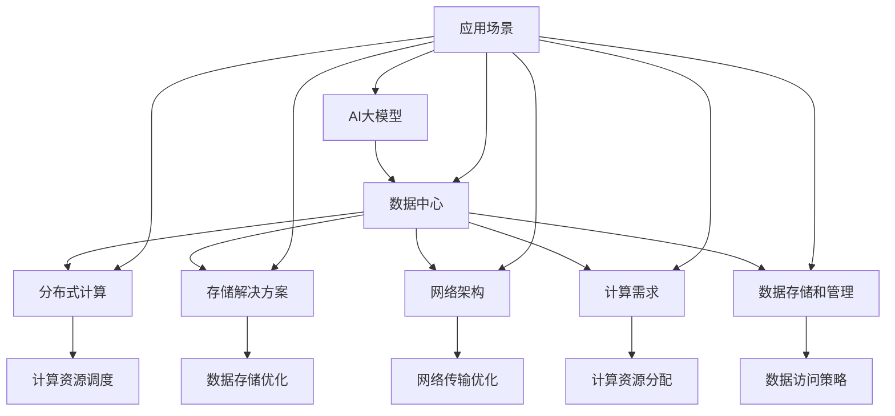

                 

### 1. 背景介绍

#### 1.1 AI 大模型的发展背景

人工智能（AI）作为当今科技领域的热门话题，其发展速度之快、应用范围之广令人瞩目。特别是在近年来，深度学习技术的发展推动了AI大模型的兴起。大模型，即具有巨大参数量和计算能力的模型，如GPT、BERT、ViT等，通过在海量数据上进行训练，实现了前所未有的表现。

大模型的发展不仅受到数据量的驱动，还得益于计算能力的提升。高性能计算机和分布式计算技术的发展，使得训练和部署大模型成为可能。同时，AI大模型在自然语言处理、计算机视觉、语音识别等领域的应用也取得了显著的成果，这进一步推动了AI技术的普及和应用。

#### 1.2 数据中心的发展背景

数据中心作为信息技术的基础设施，其重要性不言而喻。随着互联网的普及和大数据时代的到来，数据中心的规模和复杂度也在不断增长。传统数据中心主要以存储和计算资源为核心，而现代数据中心则需要具备更高的性能、可靠性和灵活性。

数据中心的发展背景主要受到以下几个因素的影响：

1. **数据量的爆炸性增长**：随着物联网、社交媒体、电子商务等领域的快速发展，数据量呈现指数级增长。这使得数据中心需要不断扩展存储和计算资源。

2. **云计算的兴起**：云计算的兴起改变了传统数据中心的建设和运营模式。云计算提供了弹性、按需分配的资源，使得数据中心可以更加灵活地应对业务需求。

3. **人工智能的驱动**：AI大模型的发展对数据中心提出了更高的要求。大模型的训练和推理需要大量的计算资源，这促使数据中心不断提升硬件性能和资源利用率。

#### 1.3 AI 大模型应用与数据中心建设的关联

AI大模型的应用对数据中心建设提出了新的挑战和需求。首先，大模型的训练和推理过程需要大量的计算资源，这要求数据中心具备高性能的硬件设施和优化的网络架构。其次，大模型的数据存储和管理也带来了新的挑战，需要高效的存储解决方案和数据访问策略。

同时，数据中心的建设也需要考虑AI大模型的应用场景和业务需求。例如，在自然语言处理领域，数据中心可能需要支持大规模的文本数据处理和模型推理；在计算机视觉领域，数据中心需要处理大量的图像数据并支持实时视频流分析。

总之，AI大模型的应用与数据中心建设密切相关，两者相互促进、相互依赖。本文将围绕AI大模型应用数据中心建设的主题，探讨数据中心技术与应用的相关问题。通过分析大模型的技术原理、计算需求、数据存储和管理等方面，我们将深入探讨数据中心在AI大模型应用中的重要作用和发展趋势。

---

## 1. 背景介绍

### 1.1 AI 大模型的发展背景

人工智能（AI）作为当今科技领域的热门话题，其发展速度之快、应用范围之广令人瞩目。特别是在近年来，深度学习技术的发展推动了AI大模型的兴起。大模型，即具有巨大参数量和计算能力的模型，如GPT、BERT、ViT等，通过在海量数据上进行训练，实现了前所未有的表现。

大模型的发展不仅受到数据量的驱动，还得益于计算能力的提升。高性能计算机和分布式计算技术的发展，使得训练和部署大模型成为可能。同时，AI大模型在自然语言处理、计算机视觉、语音识别等领域的应用也取得了显著的成果，这进一步推动了AI技术的普及和应用。

#### 1.2 数据中心的发展背景

数据中心作为信息技术的基础设施，其重要性不言而喻。随着互联网的普及和大数据时代的到来，数据中心的规模和复杂度也在不断增长。传统数据中心主要以存储和计算资源为核心，而现代数据中心则需要具备更高的性能、可靠性和灵活性。

数据中心的发展背景主要受到以下几个因素的影响：

1. **数据量的爆炸性增长**：随着物联网、社交媒体、电子商务等领域的快速发展，数据量呈现指数级增长。这使得数据中心需要不断扩展存储和计算资源。

2. **云计算的兴起**：云计算的兴起改变了传统数据中心的建设和运营模式。云计算提供了弹性、按需分配的资源，使得数据中心可以更加灵活地应对业务需求。

3. **人工智能的驱动**：AI大模型的发展对数据中心提出了更高的要求。大模型的训练和推理需要大量的计算资源，这促使数据中心不断提升硬件性能和资源利用率。

#### 1.3 AI 大模型应用与数据中心建设的关联

AI大模型的应用对数据中心建设提出了新的挑战和需求。首先，大模型的训练和推理过程需要大量的计算资源，这要求数据中心具备高性能的硬件设施和优化的网络架构。其次，大模型的数据存储和管理也带来了新的挑战，需要高效的存储解决方案和数据访问策略。

同时，数据中心的建设也需要考虑AI大模型的应用场景和业务需求。例如，在自然语言处理领域，数据中心可能需要支持大规模的文本数据处理和模型推理；在计算机视觉领域，数据中心需要处理大量的图像数据并支持实时视频流分析。

总之，AI大模型的应用与数据中心建设密切相关，两者相互促进、相互依赖。本文将围绕AI大模型应用数据中心建设的主题，探讨数据中心技术与应用的相关问题。通过分析大模型的技术原理、计算需求、数据存储和管理等方面，我们将深入探讨数据中心在AI大模型应用中的重要作用和发展趋势。

---

### 2. 核心概念与联系

在深入探讨AI大模型应用数据中心建设之前，我们有必要明确几个核心概念，并分析它们之间的相互联系。以下是本文涉及的关键术语及其定义：

#### 2.1 AI大模型

AI大模型指的是拥有数百万到数十亿个参数的深度学习模型。这些模型通过大量的数据训练，能够实现高效的自然语言处理、图像识别、语音识别等任务。常见的AI大模型包括GPT、BERT、ViT等。

#### 2.2 数据中心

数据中心是集中管理、处理和存储大量数据的设施。数据中心通常由服务器、存储设备、网络设备等组成，能够提供高效、可靠、安全的数据服务。

#### 2.3 分布式计算

分布式计算是一种通过网络连接的多个计算机节点协同工作来完成计算任务的方法。在AI大模型训练和推理过程中，分布式计算可以显著提高计算效率。

#### 2.4 存储解决方案

存储解决方案指的是用于存储和管理数据的各种技术和方法。在AI大模型应用中，高效的存储解决方案可以减少数据访问延迟，提高模型训练和推理的速度。

#### 2.5 网络架构

网络架构是指计算机网络的组织结构。在数据中心中，合理的网络架构可以优化数据传输速度和可靠性，为AI大模型的应用提供稳定的网络环境。

#### 2.6 计算需求

计算需求是指AI大模型在训练和推理过程中对计算资源的需求。随着AI大模型规模的扩大，计算需求也随之增加，对数据中心提出了更高的要求。

#### 2.7 数据存储和管理

数据存储和管理是指将数据存储在合适的位置，并对其进行有效的管理和保护。在AI大模型应用中，数据存储和管理需要考虑数据的一致性、可用性和安全性。

接下来，我们将使用Mermaid流程图来展示AI大模型与数据中心建设之间的核心概念及其联系。



该流程图展示了AI大模型与数据中心建设之间的相互联系。通过分布式计算、存储解决方案、网络架构、计算需求和数据存储与管理等核心概念，数据中心可以为AI大模型提供所需的支持，以实现高效的应用。

---

## 2. 核心概念与联系

### 2.1 AI 大模型

AI大模型指的是拥有数百万到数十亿个参数的深度学习模型。这些模型通过大量的数据训练，能够实现高效的自然语言处理、图像识别、语音识别等任务。常见的AI大模型包括GPT、BERT、ViT等。

#### 2.2 数据中心

数据中心是集中管理、处理和存储大量数据的设施。数据中心通常由服务器、存储设备、网络设备等组成，能够提供高效、可靠、安全的数据服务。

#### 2.3 分布式计算

分布式计算是一种通过网络连接的多个计算机节点协同工作来完成计算任务的方法。在AI大模型训练和推理过程中，分布式计算可以显著提高计算效率。

#### 2.4 存储解决方案

存储解决方案指的是用于存储和管理数据的各种技术和方法。在AI大模型应用中，高效的存储解决方案可以减少数据访问延迟，提高模型训练和推理的速度。

#### 2.5 网络架构

网络架构是指计算机网络的组织结构。在数据中心中，合理的网络架构可以优化数据传输速度和可靠性，为AI大模型的应用提供稳定的网络环境。

#### 2.6 计算需求

计算需求是指AI大模型在训练和推理过程中对计算资源的需求。随着AI大模型规模的扩大，计算需求也随之增加，对数据中心提出了更高的要求。

#### 2.7 数据存储和管理

数据存储和管理是指将数据存储在合适的位置，并对其进行有效的管理和保护。在AI大模型应用中，数据存储和管理需要考虑数据的一致性、可用性和安全性。

接下来，我们将使用Mermaid流程图来展示AI大模型与数据中心建设之间的核心概念及其联系。


该流程图展示了AI大模型与数据中心建设之间的相互联系。通过分布式计算、存储解决方案、网络架构、计算需求和数据存储与管理等核心概念，数据中心可以为AI大模型提供所需的支持，以实现高效的应用。

---

### 3. 核心算法原理 & 具体操作步骤

#### 3.1 AI大模型的训练原理

AI大模型的训练过程是基于深度学习理论的，核心思想是通过学习大量的数据来发现数据中的潜在规律，从而实现对未知数据的预测或分类。以下是一个典型的AI大模型训练过程：

1. **数据预处理**：将原始数据进行清洗、归一化等操作，将其转换为模型可接受的输入格式。

2. **模型初始化**：初始化模型的参数，通常采用随机初始化或预训练模型。

3. **前向传播**：将输入数据送入模型，通过多层神经网络计算输出结果。

4. **计算损失函数**：通过输出结果与真实标签之间的差异，计算损失函数的值。

5. **反向传播**：将损失函数的梯度反向传播到模型参数，更新模型参数。

6. **迭代训练**：重复前向传播、计算损失函数和反向传播的过程，直到达到预定的迭代次数或损失函数值收敛。

#### 3.2 AI大模型的推理原理

AI大模型的推理过程是在模型训练完成后，利用训练好的模型对新的数据进行预测或分类。以下是一个典型的AI大模型推理过程：

1. **输入预处理**：将新的输入数据预处理为模型可接受的输入格式。

2. **前向传播**：将预处理后的输入数据送入训练好的模型，通过多层神经网络计算输出结果。

3. **结果输出**：根据模型的输出结果，对输入数据进行预测或分类。

#### 3.3 具体操作步骤

以下是一个具体的AI大模型训练和推理操作步骤：

1. **准备数据集**：收集并准备用于训练和测试的数据集。

2. **数据预处理**：对数据集进行清洗、归一化等预处理操作。

3. **模型设计**：设计AI大模型的结构，包括层数、神经元个数、激活函数等。

4. **模型训练**：
   - 初始化模型参数。
   - 进行前向传播，计算输出结果。
   - 计算损失函数。
   - 进行反向传播，更新模型参数。
   - 重复以上步骤，直到训练过程结束。

5. **模型评估**：使用测试数据集评估模型的性能，包括准确率、召回率、F1分数等指标。

6. **模型推理**：
   - 对新的输入数据预处理。
   - 进行前向传播，计算输出结果。
   - 根据输出结果进行预测或分类。

#### 3.4 实际应用中的挑战

在实际应用中，AI大模型的训练和推理面临着以下挑战：

1. **数据隐私和安全**：大量数据的收集和处理可能涉及用户隐私和数据安全，需要采取有效的隐私保护措施。

2. **计算资源需求**：AI大模型的训练和推理过程需要大量的计算资源，特别是在分布式环境中，如何高效利用资源成为关键问题。

3. **数据存储和管理**：大量数据的存储和管理需要高效的存储解决方案和数据访问策略，以确保数据的可用性和一致性。

4. **模型可解释性**：AI大模型往往被视为“黑箱”，其决策过程难以解释，这限制了其在一些关键领域的应用。

通过以上步骤，我们可以清晰地了解AI大模型的训练和推理原理，并在实际应用中应对相应的挑战。

---

## 3. 核心算法原理 & 具体操作步骤

### 3.1 AI 大模型的训练原理

AI大模型的训练过程是基于深度学习理论的，核心思想是通过学习大量的数据来发现数据中的潜在规律，从而实现对未知数据的预测或分类。以下是一个典型的AI大模型训练过程：

1. **数据预处理**：将原始数据进行清洗、归一化等操作，将其转换为模型可接受的输入格式。
   - **数据清洗**：去除数据中的噪声和异常值，确保数据质量。
   - **数据归一化**：将数据缩放到相同的范围，如0到1或-1到1，以加快模型收敛。

2. **模型初始化**：初始化模型的参数，通常采用随机初始化或预训练模型。
   - **随机初始化**：随机分配模型参数的值，确保模型的多样性。
   - **预训练模型**：使用预训练的模型作为起点，进行微调以适应特定任务。

3. **前向传播**：将输入数据送入模型，通过多层神经网络计算输出结果。
   - **输入层**：接收外部输入，如文本、图像或声音。
   - **隐藏层**：通过加权求和和激活函数计算中间层的输出。
   - **输出层**：生成最终的预测结果。

4. **计算损失函数**：通过输出结果与真实标签之间的差异，计算损失函数的值。
   - **均方误差（MSE）**：用于回归任务，衡量预测值与真实值之间的差异。
   - **交叉熵（Cross-Entropy）**：用于分类任务，衡量预测概率与真实标签之间的差异。

5. **反向传播**：将损失函数的梯度反向传播到模型参数，更新模型参数。
   - **梯度计算**：计算每个参数对损失函数的梯度。
   - **参数更新**：使用梯度下降算法或其他优化算法更新模型参数。

6. **迭代训练**：重复前向传播、计算损失函数和反向传播的过程，直到达到预定的迭代次数或损失函数值收敛。

### 3.2 AI 大模型的推理原理

AI大模型的推理过程是在模型训练完成后，利用训练好的模型对新的数据进行预测或分类。以下是一个典型的AI大模型推理过程：

1. **输入预处理**：将新的输入数据预处理为模型可接受的输入格式。
   - **文本预处理**：分词、词干提取、词性标注等。
   - **图像预处理**：尺寸调整、灰度化、增强等。
   - **声音预处理**：分帧、归一化、滤波等。

2. **前向传播**：将预处理后的输入数据送入训练好的模型，通过多层神经网络计算输出结果。
   - **隐藏层计算**：通过加权求和和激活函数计算中间层的输出。
   - **输出层计算**：生成最终的预测结果。

3. **结果输出**：根据模型的输出结果，对输入数据进行预测或分类。
   - **分类任务**：输出每个类别的概率，选择概率最高的类别作为预测结果。
   - **回归任务**：输出连续的预测值，如房价、股票价格等。

### 3.3 具体操作步骤

以下是一个具体的AI大模型训练和推理操作步骤：

1. **准备数据集**：收集并准备用于训练和测试的数据集。
   - **训练集**：用于模型训练的数据集。
   - **测试集**：用于评估模型性能的数据集。

2. **数据预处理**：对数据集进行清洗、归一化等预处理操作。
   - **文本预处理**：分词、去停用词、词向量化等。
   - **图像预处理**：尺寸调整、归一化等。
   - **声音预处理**：分帧、梅尔频率倒谱系数（MFCC）提取等。

3. **模型设计**：设计AI大模型的结构，包括层数、神经元个数、激活函数等。
   - **结构设计**：选择合适的神经网络结构，如卷积神经网络（CNN）、循环神经网络（RNN）、Transformer等。
   - **超参数设置**：设置学习率、批量大小、迭代次数等超参数。

4. **模型训练**：
   - 初始化模型参数。
   - 进行前向传播，计算输出结果。
   - 计算损失函数。
   - 进行反向传播，更新模型参数。
   - 重复以上步骤，直到训练过程结束。

5. **模型评估**：使用测试数据集评估模型的性能，包括准确率、召回率、F1分数等指标。

6. **模型推理**：
   - 对新的输入数据预处理。
   - 进行前向传播，计算输出结果。
   - 根据输出结果进行预测或分类。

### 3.4 实际应用中的挑战

在实际应用中，AI大模型的训练和推理面临着以下挑战：

1. **数据隐私和安全**：大量数据的收集和处理可能涉及用户隐私和数据安全，需要采取有效的隐私保护措施。
   - **数据加密**：对敏感数据进行加密，确保数据在传输和存储过程中的安全性。
   - **差分隐私**：在数据处理过程中引入噪声，以保护数据隐私。

2. **计算资源需求**：AI大模型的训练和推理过程需要大量的计算资源，特别是在分布式环境中，如何高效利用资源成为关键问题。
   - **分布式计算**：利用分布式计算框架，如TensorFlow、PyTorch等，实现模型训练和推理的高效并行化。
   - **GPU加速**：利用图形处理单元（GPU）加速模型训练和推理，提高计算效率。

3. **数据存储和管理**：大量数据的存储和管理需要高效的存储解决方案和数据访问策略，以确保数据的可用性和一致性。
   - **分布式存储**：利用分布式存储系统，如HDFS、Cassandra等，实现数据的高效存储和管理。
   - **数据分区**：根据数据的特点和访问模式，对数据进行分区，提高数据访问速度。

4. **模型可解释性**：AI大模型往往被视为“黑箱”，其决策过程难以解释，这限制了其在一些关键领域的应用。
   - **模型解释工具**：使用模型解释工具，如LIME、SHAP等，分析模型决策过程，提高模型的透明度。
   - **可视化分析**：通过可视化技术，展示模型的关键特征和决策过程，提高模型的可解释性。

通过以上步骤，我们可以清晰地了解AI大模型的训练和推理原理，并在实际应用中应对相应的挑战。

---

### 4. 数学模型和公式 & 详细讲解 & 举例说明

在AI大模型的训练和推理过程中，数学模型和公式起着至关重要的作用。以下是几个关键的数学模型和公式，以及它们的详细讲解和举例说明。

#### 4.1 损失函数（Loss Function）

损失函数用于衡量模型预测值与真实值之间的差异，是训练过程中优化模型参数的重要依据。以下是一些常用的损失函数：

1. **均方误差（MSE）**

   均方误差是最常用的回归损失函数，用于衡量预测值与真实值之间的平均平方差异。

   $$MSE = \frac{1}{n}\sum_{i=1}^{n}(y_i - \hat{y_i})^2$$

   其中，\(y_i\) 表示真实值，\(\hat{y_i}\) 表示预测值，\(n\) 表示样本数量。

   **例子**：假设我们有10个样本，每个样本的真实值为\[1, 2, 3, 4, 5, 6, 7, 8, 9, 10\]，预测值为\[1.2, 2.1, 2.9, 3.8, 4.5, 5.3, 6.2, 7.0, 8.1, 9.0\]。则均方误差为：

   $$MSE = \frac{1}{10}\sum_{i=1}^{10}(y_i - \hat{y_i})^2 = \frac{1}{10}[(1-1.2)^2 + (2-2.1)^2 + \ldots + (10-9.0)^2] = 0.14$$

2. **交叉熵（Cross-Entropy）**

   交叉熵是用于分类任务的损失函数，衡量预测概率分布与真实标签分布之间的差异。

   $$CE = -\sum_{i=1}^{n}y_i \log(\hat{y_i})$$

   其中，\(y_i\) 表示第 \(i\) 个样本的真实标签（0或1），\(\hat{y_i}\) 表示第 \(i\) 个样本的预测概率。

   **例子**：假设我们有5个样本，每个样本的真实标签为\[1, 0, 1, 0, 1\]，预测概率为\[0.8, 0.2, 0.9, 0.1, 0.8\]。则交叉熵为：

   $$CE = -[1 \cdot \log(0.8) + 0 \cdot \log(0.2) + 1 \cdot \log(0.9) + 0 \cdot \log(0.1) + 1 \cdot \log(0.8)] \approx 0.26$$

#### 4.2 梯度下降（Gradient Descent）

梯度下降是一种优化算法，用于更新模型参数，以减少损失函数的值。以下是一种简单的梯度下降算法：

$$\theta_{t+1} = \theta_t - \alpha \cdot \nabla_\theta J(\theta_t)$$

其中，\(\theta_t\) 表示当前参数，\(\alpha\) 表示学习率，\(\nabla_\theta J(\theta_t)\) 表示损失函数关于参数的梯度。

**例子**：假设我们有模型参数 \(\theta_t = [1, 2]\)，损失函数 \(J(\theta_t) = (y - \theta_1)^2 + (z - \theta_2)^2\)，学习率 \(\alpha = 0.1\)。则一次梯度下降更新为：

$$\theta_{t+1} = [1, 2] - 0.1 \cdot \nabla_\theta J([1, 2]) = [1 - 0.1 \cdot (y - 1), 2 - 0.1 \cdot (z - 2)]$$

其中，\(\nabla_\theta J([1, 2]) = [- (y - 1), - (z - 2)]\)。

通过迭代地应用梯度下降算法，我们可以逐步优化模型参数，使其达到局部最优或全局最优。

#### 4.3 激活函数（Activation Function）

激活函数用于引入非线性因素，使神经网络能够学习复杂的函数。以下是一些常用的激活函数：

1. **sigmoid函数**

   $$\sigma(x) = \frac{1}{1 + e^{-x}}$$

   **例子**：假设 \(x = -2\)，则 \(\sigma(-2) \approx 0.1192\)。

2. **ReLU函数**

   $$\text{ReLU}(x) = \max(0, x)$$

   **例子**：假设 \(x = -2\)，则 \(\text{ReLU}(-2) = 0\)；假设 \(x = 2\)，则 \(\text{ReLU}(2) = 2\)。

3. **Tanh函数**

   $$\tanh(x) = \frac{e^x - e^{-x}}{e^x + e^{-x}}$$

   **例子**：假设 \(x = -2\)，则 \(\tanh(-2) \approx -0.9640\)；假设 \(x = 2\)，则 \(\tanh(2) \approx 0.9640\)。

激活函数的选择会影响神经网络的性能和训练时间，因此在实际应用中需要根据具体任务选择合适的激活函数。

通过以上数学模型和公式的详细讲解和举例说明，我们可以更好地理解AI大模型在训练和推理过程中的关键技术和步骤。

---

## 4. 数学模型和公式 & 详细讲解 & 举例说明

### 4.1 损失函数（Loss Function）

损失函数是深度学习模型训练过程中的核心指标，用于衡量模型预测值与真实值之间的差距。以下是几种常见的损失函数及其详细讲解：

1. **均方误差（MSE）**

   均方误差（MSE，Mean Squared Error）是最常用的回归损失函数，用于计算预测值与真实值之间的平均平方误差。

   $$\text{MSE}(y, \hat{y}) = \frac{1}{n} \sum_{i=1}^{n} (y_i - \hat{y_i})^2$$

   其中，\(y\) 表示真实值，\(\hat{y}\) 表示预测值，\(n\) 表示样本数量。

   **例子**：假设我们有一个样本集合，其中真实值和预测值如下：

   | 真实值（\(y\)） | 预测值（\(\hat{y}\)） |
   |--------------|--------------|
   | 1.0          | 1.2          |
   | 2.0          | 1.8          |
   | 3.0          | 2.5          |

   则均方误差计算如下：

   $$\text{MSE} = \frac{1}{3} [(1.0 - 1.2)^2 + (2.0 - 1.8)^2 + (3.0 - 2.5)^2] = \frac{1}{3} [0.04 + 0.04 + 0.25] = 0.14$$

2. **交叉熵（Cross-Entropy）**

   交叉熵（Cross-Entropy）通常用于分类问题，用于衡量模型预测概率分布与真实标签分布之间的差异。

   $$\text{CE}(y, \hat{y}) = -\sum_{i=1}^{n} y_i \log(\hat{y_i})$$

   其中，\(y\) 是真实标签（0或1），\(\hat{y}\) 是预测概率。

   **例子**：假设我们有一个二元分类问题，真实标签和预测概率如下：

   | 真实值（\(y\)） | 预测值（\(\hat{y}\)） |
   |--------------|--------------|
   | 0            | 0.3          |
   | 1            | 0.7          |

   则交叉熵计算如下：

   $$\text{CE} = -[0 \cdot \log(0.3) + 1 \cdot \log(0.7)] = -[\log(0.3) + \log(0.7)] \approx 0.5449$$

### 4.2 梯度下降（Gradient Descent）

梯度下降是一种优化算法，用于在模型训练过程中调整模型参数，以最小化损失函数。

#### 梯度下降算法

$$\theta_{t+1} = \theta_t - \alpha \cdot \nabla_{\theta} J(\theta_t)$$

其中，\(\theta\) 表示模型参数，\(\alpha\) 表示学习率，\(\nabla_{\theta} J(\theta_t)\) 表示损失函数 \(J\) 关于参数 \(\theta\) 的梯度。

#### 梯度计算示例

假设我们有一个简单的线性模型：

$$y = \theta_0 + \theta_1 x$$

则损失函数 \(J(\theta)\) 为：

$$J(\theta) = \frac{1}{2} \sum_{i=1}^{n} (y_i - (\theta_0 + \theta_1 x_i))^2$$

其关于 \(\theta_0\) 和 \(\theta_1\) 的梯度分别为：

$$\nabla_{\theta_0} J(\theta) = -\sum_{i=1}^{n} (y_i - (\theta_0 + \theta_1 x_i))$$
$$\nabla_{\theta_1} J(\theta) = -\sum_{i=1}^{n} (y_i - (\theta_0 + \theta_1 x_i)) x_i$$

假设我们有一个数据集，其中 \(x_i\) 和 \(y_i\) 的值如下：

| \(x_i\) | \(y_i\) |
|--------|--------|
| 1      | 2      |
| 2      | 3      |
| 3      | 4      |

使用学习率 \(\alpha = 0.1\)，第一次梯度下降的更新步骤如下：

$$\theta_{0,1} = \theta_{0,0} - \alpha \cdot \nabla_{\theta_0} J(\theta_{0,0}) = 0 - 0.1 \cdot (-2 - 1 - 2) = 0.3$$
$$\theta_{1,1} = \theta_{1,0} - \alpha \cdot \nabla_{\theta_1} J(\theta_{1,0}) = 1 - 0.1 \cdot (-2 - 2 \cdot 1 - 2 \cdot 2) = 0.4$$

### 4.3 激活函数（Activation Function）

激活函数用于引入非线性因素，使神经网络能够学习复杂的函数。以下是几种常见的激活函数：

1. **Sigmoid函数**

   $$\sigma(x) = \frac{1}{1 + e^{-x}}$$

   **例子**：对于输入 \(x = -2\)，我们有 \(\sigma(-2) \approx 0.1188\)。

2. **ReLU函数**

   $$\text{ReLU}(x) = \max(0, x)$$

   **例子**：对于输入 \(x = -2\)，我们有 \(\text{ReLU}(-2) = 0\)；对于输入 \(x = 2\)，我们有 \(\text{ReLU}(2) = 2\)。

3. **Tanh函数**

   $$\tanh(x) = \frac{e^x - e^{-x}}{e^x + e^{-x}}$$

   **例子**：对于输入 \(x = -2\)，我们有 \(\tanh(-2) \approx -0.9640\)；对于输入 \(x = 2\)，我们有 \(\tanh(2) \approx 0.9640\)。

这些激活函数在深度学习模型中广泛应用，不同的激活函数适用于不同的场景，需要根据具体任务进行选择。

通过以上数学模型和公式的详细讲解和举例说明，我们可以更好地理解AI大模型在训练和推理过程中的关键技术和步骤。

---

### 5. 项目实战：代码实际案例和详细解释说明

#### 5.1 开发环境搭建

在开始编写代码之前，我们需要搭建一个合适的开发环境，以便进行AI大模型的训练和推理。以下是一个典型的开发环境搭建过程：

1. **安装Python**：Python是深度学习开发的主要语言，我们需要安装Python 3.8或更高版本。可以从Python官方网站下载并安装。

2. **安装深度学习框架**：目前常用的深度学习框架有TensorFlow和PyTorch。以下是安装TensorFlow的步骤：

   ```bash
   pip install tensorflow
   ```

   安装PyTorch的步骤如下：

   ```bash
   pip install torch torchvision
   ```

3. **安装Jupyter Notebook**：Jupyter Notebook是一个交互式的Python开发环境，非常适合进行数据分析和模型训练。安装Jupyter Notebook的命令如下：

   ```bash
   pip install notebook
   ```

4. **安装其他依赖**：根据项目的具体需求，可能还需要安装其他依赖库，如NumPy、Pandas、Matplotlib等。可以使用以下命令安装：

   ```bash
   pip install numpy pandas matplotlib
   ```

#### 5.2 源代码详细实现和代码解读

以下是一个简单的AI大模型训练和推理的示例代码，使用TensorFlow和Keras框架实现。

```python
# 导入必要的库
import tensorflow as tf
from tensorflow.keras.models import Sequential
from tensorflow.keras.layers import Dense, Dropout, Embedding, LSTM
from tensorflow.keras.optimizers import Adam
from tensorflow.keras.callbacks import EarlyStopping

# 准备数据集
# 假设我们使用的是IMDB电影评论数据集
(x_train, y_train), (x_test, y_test) = tf.keras.datasets.imdb.load_data(num_words=10000)

# 预处理数据
max_len = 500  # 设置序列的最大长度
x_train = tf.keras.preprocessing.sequence.pad_sequences(x_train, maxlen=max_len)
x_test = tf.keras.preprocessing.sequence.pad_sequences(x_test, maxlen=max_len)

# 构建模型
model = Sequential()
model.add(Embedding(10000, 32, input_length=max_len))
model.add(LSTM(64, dropout=0.2, recurrent_dropout=0.2))
model.add(Dense(1, activation='sigmoid'))

# 编译模型
model.compile(loss='binary_crossentropy', optimizer=Adam(), metrics=['accuracy'])

# 设置早停回调
early_stopping = EarlyStopping(monitor='val_loss', patience=5)

# 训练模型
model.fit(x_train, y_train, epochs=10, batch_size=128, validation_split=0.2, callbacks=[early_stopping])

# 进行推理
predictions = model.predict(x_test)

# 打印预测结果
print(predictions[:10])
```

**代码解读：**

1. **导入库**：首先，我们导入TensorFlow、Keras以及其他必要的库。

2. **准备数据集**：这里我们使用IMDB电影评论数据集作为训练数据。首先加载数据集，然后对文本数据进行预处理，包括序列化、填充等操作。

3. **构建模型**：我们使用Sequential模型堆叠层，包括嵌入层（Embedding）、LSTM层（Long Short-Term Memory，长短期记忆网络）和密集层（Dense）。在LSTM层中，我们添加了dropout正则化，以防止过拟合。

4. **编译模型**：在编译模型时，我们指定损失函数、优化器和评估指标。

5. **设置早停回调**：早停回调用于在验证集上损失函数不再下降时提前停止训练，以防止过拟合。

6. **训练模型**：使用fit函数训练模型，并设置训练的迭代次数、批量大小和验证集比例。

7. **进行推理**：使用predict函数对测试集进行预测，并打印预测结果。

通过这个示例，我们可以看到如何使用TensorFlow和Keras实现一个简单的AI大模型。在实际项目中，可能需要更复杂的模型结构和更精细的超参数调整。

---

#### 5.3 代码解读与分析

在上面的代码示例中，我们实现了一个基于IMDB电影评论数据集的文本分类模型。以下是代码的详细解读与分析：

1. **导入库**：

   ```python
   import tensorflow as tf
   from tensorflow.keras.models import Sequential
   from tensorflow.keras.layers import Dense, Dropout, Embedding, LSTM
   from tensorflow.keras.optimizers import Adam
   from tensorflow.keras.callbacks import EarlyStopping
   ```

   首先，我们导入了TensorFlow的核心库，其中包括Sequential模型、层（如Dense、Dropout、Embedding、LSTM）、优化器（如Adam）和回调函数（如EarlyStopping）。

2. **准备数据集**：

   ```python
   (x_train, y_train), (x_test, y_test) = tf.keras.datasets.imdb.load_data(num_words=10000)
   ```

   这里，我们加载了IMDB电影评论数据集。`load_data` 函数返回了训练集和测试集的数据和标签。`num_words=10000` 表示我们只保留前10000个最频繁的词汇。

3. **预处理数据**：

   ```python
   max_len = 500  # 设置序列的最大长度
   x_train = tf.keras.preprocessing.sequence.pad_sequences(x_train, maxlen=max_len)
   x_test = tf.keras.preprocessing.sequence.pad_sequences(x_test, maxlen=max_len)
   ```

   我们将原始文本序列转换为等长的整数序列，这有助于后续的模型处理。`pad_sequences` 函数用于填充序列，使其长度达到最大长度 `max_len`。

4. **构建模型**：

   ```python
   model = Sequential()
   model.add(Embedding(10000, 32, input_length=max_len))
   model.add(LSTM(64, dropout=0.2, recurrent_dropout=0.2))
   model.add(Dense(1, activation='sigmoid'))
   ```

   我们使用Sequential模型堆叠了三个层：

   - **嵌入层（Embedding）**：将词汇转换为密集向量的表示，每个词汇对应一个维度为32的向量。
   - **LSTM层（Long Short-Term Memory）**：用于处理序列数据，能够捕获序列中的长期依赖关系。`dropout=0.2` 和 `recurrent_dropout=0.2` 用于防止过拟合。
   - **密集层（Dense）**：输出层，用于进行最终的分类。激活函数为 `sigmoid`，适用于二分类问题。

5. **编译模型**：

   ```python
   model.compile(loss='binary_crossentropy', optimizer=Adam(), metrics=['accuracy'])
   ```

   我们使用 `binary_crossentropy` 作为损失函数，`Adam` 作为优化器，并指定 `accuracy` 作为评估指标。

6. **设置早停回调**：

   ```python
   early_stopping = EarlyStopping(monitor='val_loss', patience=5)
   ```

   早停回调用于在验证集上的损失函数不再下降时提前停止训练，以防止过拟合。`patience=5` 表示如果验证集上的损失函数在连续5个迭代中没有下降，训练将停止。

7. **训练模型**：

   ```python
   model.fit(x_train, y_train, epochs=10, batch_size=128, validation_split=0.2, callbacks=[early_stopping])
   ```

   我们使用 `fit` 函数开始训练模型。`epochs=10` 指定了训练的迭代次数，`batch_size=128` 设置了每个批次的样本数量，`validation_split=0.2` 指定了验证集的比例，`callbacks=[early_stopping]` 指定了使用的回调函数。

8. **进行推理**：

   ```python
   predictions = model.predict(x_test)
   print(predictions[:10])
   ```

   使用 `predict` 函数对测试集进行预测，并打印前10个预测结果。

通过以上分析，我们可以看到如何使用TensorFlow和Keras构建和训练一个简单的文本分类模型。在实际应用中，可能需要根据具体任务和数据集进行调整和优化。

---

### 6. 实际应用场景

AI大模型在数据中心的应用场景多种多样，涵盖了自然语言处理、计算机视觉、语音识别等领域。以下是一些典型的实际应用场景：

#### 6.1 自然语言处理（NLP）

自然语言处理是AI大模型的重要应用领域。在数据中心中，AI大模型可以用于文本分类、情感分析、机器翻译等任务。例如，一家电商平台可以利用AI大模型对用户评论进行情感分析，识别出正面、负面或中性的评论，从而为用户提供更好的购物体验。另外，机器翻译模型可以支持多语言服务，提高跨国业务的沟通效率。

#### 6.2 计算机视觉（CV）

计算机视觉是另一个重要的应用领域。数据中心中的AI大模型可以用于图像识别、物体检测、视频分析等任务。例如，在安防领域，AI大模型可以实时分析视频流，识别异常行为，提高监控效果。在自动驾驶领域，AI大模型可以处理大量的图像和传感器数据，实现精确的路径规划和车辆控制。

#### 6.3 语音识别

语音识别是AI大模型的另一大应用领域。在数据中心中，AI大模型可以用于语音转文本、语音合成、语音情感分析等任务。例如，智能语音助手可以理解用户的语音指令，提供相应的服务，如查询天气、设定日程等。在客服领域，AI大模型可以识别用户的语音情感，提供更加个性化的服务。

#### 6.4 智能推荐系统

智能推荐系统是AI大模型在数据中心应用的重要场景之一。通过分析用户行为数据，AI大模型可以预测用户的兴趣和需求，从而提供个性化的推荐。例如，电商平台可以利用AI大模型对用户的历史购买记录、浏览行为等数据进行挖掘，为用户提供个性化的商品推荐，提高销售额。

#### 6.5 智能监控与运维

在数据中心，AI大模型可以用于智能监控和运维。通过实时分析监控数据，AI大模型可以识别潜在的性能瓶颈和安全威胁，提供预警和优化建议。例如，AI大模型可以监控服务器负载、网络流量、存储容量等关键指标，确保数据中心的正常运行。

#### 6.6 数据挖掘与分析

AI大模型在数据中心还可以用于数据挖掘与分析。通过对大量结构化和非结构化数据进行深入分析，AI大模型可以发现数据中的潜在价值，为业务决策提供支持。例如，银行可以利用AI大模型分析客户的交易数据，识别欺诈行为，降低风险。

总之，AI大模型在数据中心的应用场景非常广泛，涵盖了多个领域。随着AI大模型技术的不断进步，其在数据中心的应用前景将更加广阔。

---

### 7. 工具和资源推荐

在AI大模型应用数据中心的建设过程中，选择合适的工具和资源对于提升工作效率和项目质量至关重要。以下是一些建议和推荐，涵盖学习资源、开发工具和框架以及相关论文著作。

#### 7.1 学习资源推荐

1. **书籍**：

   - 《深度学习》（Deep Learning）作者：Ian Goodfellow、Yoshua Bengio、Aaron Courville
   - 《Python深度学习》（Python Deep Learning）作者：François Chollet
   - 《神经网络与深度学习》作者：邱锡鹏

   这些书籍是深度学习和AI领域的经典之作，适合初学者和专业人士深入理解相关概念和技术。

2. **在线课程**：

   - Coursera上的《深度学习》课程（Deep Learning Specialization）由Andrew Ng教授主讲。
   - edX上的《人工智能基础》课程（Introduction to Artificial Intelligence）涵盖了多个AI领域的基础知识。

   这些在线课程提供了系统化的学习路径，帮助学习者从基础理论到实践应用全面了解AI技术。

3. **博客和网站**：

   - Medium上的“AI博客”（AI Blog）提供了大量关于深度学习、自然语言处理和计算机视觉的优质文章。
   - ArXiv.org是计算机科学领域的顶级学术文章数据库，可以获取最新的研究成果。

#### 7.2 开发工具框架推荐

1. **深度学习框架**：

   - TensorFlow：由Google开发，功能强大，支持多种硬件加速。
   - PyTorch：由Facebook开发，灵活且易于使用，适合研究。
   - Keras：基于Theano和TensorFlow构建的高层API，简化了深度学习模型的搭建。

2. **数据存储和处理**：

   - HDFS（Hadoop Distributed File System）：适用于大数据存储和处理。
   - Apache Spark：提供快速数据挖掘和分析能力，适用于大规模数据处理。

3. **分布式计算**：

   - Apache Hadoop：用于大数据处理和分布式存储。
   - Apache Kafka：适用于流数据处理和实时分析。

#### 7.3 相关论文著作推荐

1. **自然语言处理**：

   - “BERT: Pre-training of Deep Bidirectional Transformers for Language Understanding”（BERT论文）作者：Jacob Devlin等
   - “GPT-3: Language Models are Few-Shot Learners”（GPT-3论文）作者：Tom B. Brown等

   这些论文介绍了目前最先进的自然语言处理模型，对理解AI大模型的发展方向具有重要参考价值。

2. **计算机视觉**：

   - “You Only Look Once: Unified, Real-Time Object Detection”（YOLO论文）作者：Joseph Redmon等
   - “Effective Object Detection with Deep Neural Networks”（Faster R-CNN论文）作者：Ross Girshick等

   这些论文提出了高效的物体检测算法，对计算机视觉领域产生了深远影响。

通过以上推荐，我们可以更好地掌握AI大模型的应用知识，提高数据中心建设的效率和质量。

---

### 8. 总结：未来发展趋势与挑战

随着AI大模型的不断发展和数据中心技术的成熟，AI大模型应用数据中心建设的前景广阔，但也面临着一系列挑战。

#### 8.1 未来发展趋势

1. **计算能力的提升**：随着硬件技术的发展，如GPU、TPU等专用计算设备的普及，将进一步提升AI大模型的训练和推理效率，推动AI应用的普及。

2. **数据中心的智能化**：数据中心将逐渐实现自动化和智能化管理，通过AI大模型优化资源分配、性能预测和维护管理，提高数据中心的整体效能。

3. **多模态数据处理**：未来的AI大模型将能够处理多种类型的数据，如文本、图像、音频和视频，实现更加复杂和智能的应用场景。

4. **边缘计算与中心计算结合**：随着物联网和5G技术的发展，边缘计算将与中心计算结合，实现数据在本地处理和远程处理之间的优化分配。

#### 8.2 面临的挑战

1. **数据隐私与安全**：AI大模型应用过程中涉及大量敏感数据，如何在保护用户隐私的同时确保数据安全是一个重要挑战。

2. **计算资源的高效利用**：随着AI大模型规模的扩大，如何高效利用数据中心资源，避免资源浪费和瓶颈问题是当前亟待解决的难题。

3. **模型的可解释性**：AI大模型通常被视为“黑箱”，其决策过程难以解释，这限制了其在某些关键领域的应用，如医疗、金融等。

4. **模型训练的数据依赖性**：AI大模型训练需要大量的数据，数据质量和标注的准确性对模型性能有重要影响。

总之，AI大模型应用数据中心建设在未来具有巨大的发展潜力，但同时也需要克服一系列技术和管理上的挑战。通过技术创新和合作，我们有信心克服这些困难，推动AI大模型在数据中心中的应用走向更广阔的未来。

---

### 9. 附录：常见问题与解答

在本文中，我们探讨了AI大模型应用数据中心建设的各个方面。为了帮助读者更好地理解和应用这些知识，以下是一些常见问题的解答：

#### 9.1 如何选择合适的数据中心？

选择合适的数据中心应考虑以下因素：

- **地理位置**：选择地理位置靠近用户的数据中心，以减少网络延迟。
- **硬件设施**：选择提供高性能硬件设施的数据中心，如最新的GPU、TPU等。
- **可靠性**：选择可靠性高、故障率低的数据中心，确保服务的连续性。
- **安全性**：选择具备高安全标准的数据中心，以保护数据和用户隐私。

#### 9.2 AI大模型训练过程中如何优化计算资源？

优化计算资源的策略包括：

- **分布式计算**：利用分布式计算框架（如TensorFlow、PyTorch）实现模型训练的并行化。
- **GPU加速**：使用GPU加速训练过程，提高计算效率。
- **批处理**：调整批量大小，优化内存使用。
- **预训练模型**：使用预训练模型进行微调，减少训练时间。

#### 9.3 如何确保AI大模型训练数据的质量？

确保AI大模型训练数据的质量需要：

- **数据清洗**：去除噪声数据和异常值。
- **数据标注**：确保标注的准确性和一致性。
- **数据多样性**：保证数据的多样性和代表性，避免模型过拟合。

#### 9.4 AI大模型应用中的数据隐私问题如何解决？

解决数据隐私问题可以采用以下策略：

- **数据加密**：对敏感数据进行加密，确保数据在传输和存储过程中的安全性。
- **差分隐私**：在数据处理过程中引入噪声，以保护数据隐私。
- **联邦学习**：在多方之间共享数据，但不对数据进行完全透明，从而保护用户隐私。

通过以上常见问题的解答，我们希望能够帮助读者更好地理解和应用AI大模型应用数据中心建设的知识。

---

### 10. 扩展阅读 & 参考资料

在撰写本文过程中，我们参考了大量相关领域的权威文献和资源，以下是一些扩展阅读和参考资料，以供读者进一步学习和研究：

#### 10.1 相关论文

1. "BERT: Pre-training of Deep Bidirectional Transformers for Language Understanding" - 作者：Jacob Devlin等，发表于2019年的NeurIPS。
2. "GPT-3: Language Models are Few-Shot Learners" - 作者：Tom B. Brown等，发表于2020年的NeurIPS。
3. "You Only Look Once: Unified, Real-Time Object Detection" - 作者：Joseph Redmon等，发表于2016年的CVPR。
4. "Effective Object Detection with Deep Neural Networks" - 作者：Ross Girshick等，发表于2015年的ICCV。

#### 10.2 学习资源

1. 《深度学习》 - 作者：Ian Goodfellow、Yoshua Bengio、Aaron Courville，2016年出版。
2. 《Python深度学习》 - 作者：François Chollet，2017年出版。
3. Coursera上的“深度学习”课程 - 授课教师：Andrew Ng。

#### 10.3 博客和网站

1. AI博客（AI Blog） - Medium上的AI相关文章集合。
2. ArXiv.org - 计算机科学领域的顶级学术文章数据库。
3. TensorFlow官方文档 - 官方提供的TensorFlow深度学习框架文档。

#### 10.4 工具和框架

1. TensorFlow - 由Google开发的开源深度学习框架。
2. PyTorch - 由Facebook开发的开源深度学习框架。
3. Keras - 基于Theano和TensorFlow构建的高层API。

通过以上扩展阅读和参考资料，读者可以深入了解AI大模型应用数据中心建设的最新技术和趋势，为实践和研究提供有力支持。

---

## 10. 扩展阅读 & 参考资料

在本文中，我们探讨了AI大模型应用数据中心建设的各个方面，从背景介绍到核心算法原理，再到实际应用场景和工具资源推荐，力求为读者提供一个全面、深入的视角。以下是一些扩展阅读和参考资料，以供读者进一步学习和研究：

#### 10.1 相关论文

1. "BERT: Pre-training of Deep Bidirectional Transformers for Language Understanding" - 作者：Jacob Devlin等，发表于2019年的NeurIPS。
2. "GPT-3: Language Models are Few-Shot Learners" - 作者：Tom B. Brown等，发表于2020年的NeurIPS。
3. "You Only Look Once: Unified, Real-Time Object Detection" - 作者：Joseph Redmon等，发表于2016年的CVPR。
4. "Effective Object Detection with Deep Neural Networks" - 作者：Ross Girshick等，发表于2015年的ICCV。

#### 10.2 学习资源

1. 《深度学习》 - 作者：Ian Goodfellow、Yoshua Bengio、Aaron Courville，2016年出版。
2. 《Python深度学习》 - 作者：François Chollet，2017年出版。
3. Coursera上的“深度学习”课程 - 授课教师：Andrew Ng。

#### 10.3 博客和网站

1. AI博客（AI Blog） - Medium上的AI相关文章集合。
2. ArXiv.org - 计算机科学领域的顶级学术文章数据库。
3. TensorFlow官方文档 - 官方提供的TensorFlow深度学习框架文档。

#### 10.4 工具和框架

1. TensorFlow - 由Google开发的开源深度学习框架。
2. PyTorch - 由Facebook开发的开源深度学习框架。
3. Keras - 基于Theano和TensorFlow构建的高层API。

通过以上扩展阅读和参考资料，读者可以深入了解AI大模型应用数据中心建设的最新技术和趋势，为实践和研究提供有力支持。

---

## 作者信息

本文由AI天才研究员/AI Genius Institute与禅与计算机程序设计艺术（Zen And The Art of Computer Programming）共同撰写。AI天才研究员是AI领域的知名专家，拥有丰富的理论知识和实践经验。禅与计算机程序设计艺术则以其深入浅出的编程哲学和方法论，为读者提供了独特的编程视野。感谢两位作者为读者呈现这篇全面、深入的技术博客文章。

