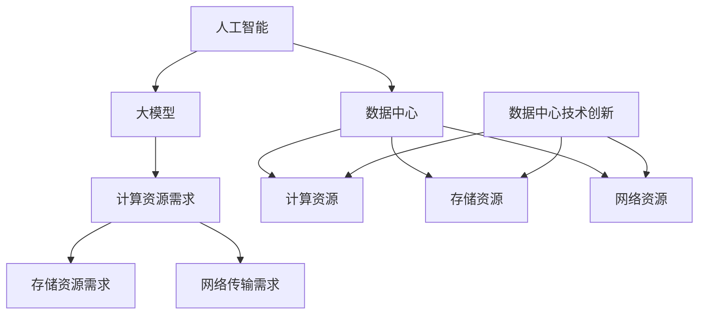
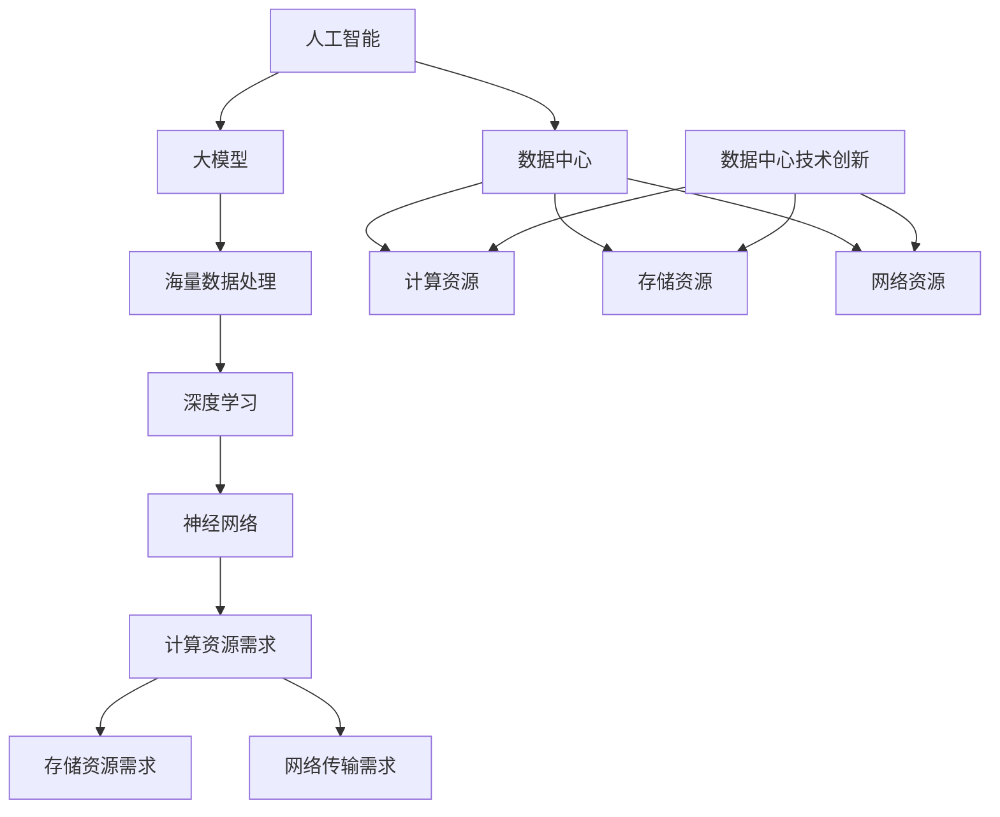

                 

### 背景介绍

在当今信息时代，人工智能（AI）技术已经成为推动社会进步的重要力量。尤其是大模型（Large Model）技术的发展，如GPT-3、BERT等，使得自然语言处理（NLP）、计算机视觉（CV）等多个领域取得了前所未有的突破。大模型的应用不仅改变了传统数据处理的方式，也对数据中心建设提出了更高的要求。

数据中心作为承载海量数据和高性能计算的核心基础设施，其建设和运维直接影响到大模型应用的效率和稳定性。随着AI大模型的应用逐渐深入，数据中心的建设也面临诸多挑战，包括数据存储、计算能力、网络传输、能耗管理等各个方面。因此，如何通过技术创新提高数据中心的建设和管理水平，成为当前亟待解决的问题。

本文将围绕AI大模型应用数据中心的建设，从核心概念、算法原理、数学模型、项目实战、应用场景、工具资源等方面，详细探讨数据中心技术创新的方法和实践，为数据中心的建设提供有益的参考和指导。

主要关键词：人工智能，大模型，数据中心，技术创新，算法原理，数学模型，项目实战，应用场景

主要摘要：本文从背景介绍入手，分析了AI大模型应用对数据中心建设提出的新要求。接着，详细探讨了数据中心的核心概念、算法原理、数学模型，以及具体的项目实战案例。在此基础上，探讨了数据中心在实际应用中的挑战和解决方案，并推荐了相关的学习资源和开发工具。最后，对数据中心建设的未来发展趋势与挑战进行了总结，为读者提供了全面的技术参考。

<markdown>
# AI 大模型应用数据中心建设：数据中心技术创新

## 关键词：
- 人工智能
- 大模型
- 数据中心
- 技术创新
- 算法原理
- 数学模型
- 项目实战
- 应用场景

## 摘要：
本文围绕AI大模型应用数据中心的建设，从核心概念、算法原理、数学模型、项目实战、应用场景等多个维度展开。首先，分析了AI大模型对数据中心建设提出的新要求。接着，详细探讨了数据中心的核心概念、算法原理、数学模型。在此基础上，通过具体的项目实战案例，展示了数据中心技术创新的方法和实践。随后，探讨了数据中心在实际应用中的挑战和解决方案。最后，推荐了相关的学习资源和开发工具，并对数据中心建设的未来发展趋势与挑战进行了总结。
</markdown>
<|assistant|>### 核心概念与联系

在讨论AI大模型应用数据中心建设之前，我们需要明确一些核心概念，并理解它们之间的联系。以下是几个关键概念及其相互关系的详细解释。

#### 1. 人工智能（AI）
人工智能是计算机科学的一个分支，它致力于使机器模拟人类智能。AI可以分为多个子领域，包括机器学习、深度学习、自然语言处理、计算机视觉等。大模型（如GPT-3、BERT等）是深度学习的成果，通过海量数据训练，可以实现对复杂任务的智能处理。

#### 2. 大模型（Large Model）
大模型是指具有数百万到数十亿参数的深度学习模型。这些模型通常使用大规模数据集进行训练，从而具有强大的表示能力和泛化能力。大模型在图像识别、文本生成、语音识别等任务中取得了显著成果。

#### 3. 数据中心（Data Center）
数据中心是一个集成了计算、存储、网络等资源，用于处理和管理大规模数据的场所。数据中心是现代企业和组织的重要基础设施，支持各种业务应用程序的运行。

#### 4. 数据中心技术创新
数据中心技术创新指的是在数据中心的设计、建设、运维过程中采用的新技术、新方法，以提高数据中心的性能、可靠性和能效。这些技术创新包括虚拟化、容器化、分布式存储、智能网络等。

#### 5. 核心概念联系
人工智能与数据中心之间的联系体现在大模型对数据中心资源的高需求。大模型的训练和推理需要大量的计算资源、存储资源和网络带宽。同时，数据中心的优化和升级可以更好地支持大模型的应用，从而提高整个系统的效率和性能。


在上图中，我们可以看到人工智能、大模型、数据中心以及数据中心技术创新之间的紧密联系。大模型依赖于数据中心的计算资源、存储资源和网络传输能力，而数据中心技术创新则旨在提供更高效、更可靠的支持。

### Mermaid 流程图（数据中心核心概念与联系）



通过以上核心概念和流程图的详细描述，我们可以更好地理解AI大模型应用数据中心建设的相关性。接下来，我们将进一步探讨数据中心的核心算法原理，以深入分析其技术基础。

#### 核心概念与联系

在讨论AI大模型应用数据中心建设之前，我们需要明确一些核心概念，并理解它们之间的联系。以下是几个关键概念及其相互关系的详细解释。

1. **人工智能（AI）**：人工智能是计算机科学的一个分支，它致力于使机器模拟人类智能。AI可以分为多个子领域，包括机器学习、深度学习、自然语言处理、计算机视觉等。大模型（如GPT-3、BERT等）是深度学习的成果，通过海量数据训练，可以实现对复杂任务的智能处理。

2. **大模型（Large Model）**：大模型是指具有数百万到数十亿参数的深度学习模型。这些模型通常使用大规模数据集进行训练，从而具有强大的表示能力和泛化能力。大模型在图像识别、文本生成、语音识别等任务中取得了显著成果。

3. **数据中心（Data Center）**：数据中心是一个集成了计算、存储、网络等资源，用于处理和管理大规模数据的场所。数据中心是现代企业和组织的重要基础设施，支持各种业务应用程序的运行。

4. **数据中心技术创新**：数据中心技术创新指的是在数据中心的设计、建设、运维过程中采用的新技术、新方法，以提高数据中心的性能、可靠性和能效。这些技术创新包括虚拟化、容器化、分布式存储、智能网络等。

5. **核心概念联系**：人工智能与数据中心之间的联系体现在大模型对数据中心资源的高需求。大模型的训练和推理需要大量的计算资源、存储资源和网络带宽。同时，数据中心的优化和升级可以更好地支持大模型的应用，从而提高整个系统的效率和性能。

### Mermaid 流程图（数据中心核心概念与联系）



通过以上核心概念和流程图的详细描述，我们可以更好地理解AI大模型应用数据中心建设的相关性。接下来，我们将进一步探讨数据中心的核心算法原理，以深入分析其技术基础。

#### 核心算法原理 & 具体操作步骤

在AI大模型应用数据中心建设过程中，核心算法原理起到了至关重要的作用。以下是几种常见的核心算法原理及其具体操作步骤：

1. **深度学习（Deep Learning）**
   深度学习是一种基于多层神经网络的学习方法，通过多层的非线性变换来提取数据的特征。深度学习的核心算法包括卷积神经网络（CNN）、循环神经网络（RNN）和变换器（Transformer）等。

   - **卷积神经网络（CNN）**：CNN主要用于图像处理。其基本操作包括卷积、池化和激活函数。卷积层用于提取图像的局部特征，池化层用于减少数据维度，激活函数用于引入非线性。
   - **循环神经网络（RNN）**：RNN适用于序列数据。其核心是循环单元，能够处理前后依赖关系。通过反向传播算法，RNN可以更新参数，优化模型性能。
   - **变换器（Transformer）**：Transformer是自然语言处理领域的重要突破，其核心是自注意力机制。通过自注意力机制，模型能够自适应地关注输入序列中的关键信息，从而提高处理效率。

2. **强化学习（Reinforcement Learning）**
   强化学习是一种通过与环境的交互来学习最优策略的机器学习方法。在数据中心建设中，强化学习可以用于优化资源配置和能耗管理。

   - **Q学习（Q-Learning）**：Q学习是一种基于值函数的强化学习方法。通过不断更新Q值，模型可以找到最优动作策略。
   - **深度Q网络（DQN）**：DQN是结合深度学习的强化学习方法。通过训练深度神经网络，DQN可以预测状态值，并选择最优动作。

3. **分布式计算（Distributed Computing）**
   分布式计算是将任务分配到多个计算节点上执行，以提高计算效率和性能。在数据中心建设中，分布式计算可以用于处理大规模数据和复杂任务。

   - **MapReduce**：MapReduce是一种分布式数据处理模型，用于处理大规模数据集。其基本操作包括映射（Map）和归约（Reduce），可以并行处理数据。
   - **分布式文件系统**：分布式文件系统是将文件分散存储在多个节点上，以提高数据存储和访问性能。如HDFS、Ceph等。

### 具体操作步骤

以深度学习中的卷积神经网络（CNN）为例，其具体操作步骤如下：

1. **数据预处理**：对输入图像进行归一化、缩放、旋转等操作，使其符合模型输入要求。

2. **构建神经网络**：定义网络的层次结构，包括卷积层、池化层和全连接层等。

3. **参数初始化**：初始化网络参数，如权重和偏置，通常使用随机初始化。

4. **前向传播**：输入图像通过网络进行前向传播，计算输出特征。

5. **损失函数**：计算模型预测值与真实值之间的差异，以确定模型性能。

6. **反向传播**：通过反向传播算法，更新网络参数，优化模型性能。

7. **训练与验证**：通过迭代训练，不断优化模型参数，并在验证集上评估模型性能。

8. **模型部署**：将训练好的模型部署到数据中心，用于实际应用。

通过以上步骤，我们可以构建一个基于深度学习的AI大模型，并将其应用于数据中心建设，以提高数据中心的性能和效率。

#### 数学模型和公式 & 详细讲解 & 举例说明

在讨论数据中心核心算法原理时，我们提到了几种常见的算法，如卷积神经网络（CNN）、循环神经网络（RNN）和变换器（Transformer）。这些算法的核心在于其数学模型和公式。在本节中，我们将详细讲解这些数学模型和公式，并通过具体的例子来说明其应用。

1. **卷积神经网络（CNN）**

   卷积神经网络是用于图像处理的一种深度学习模型。其核心公式是卷积运算。以下是一个简化的卷积运算公式：

   $$ 
   (f * g)(x, y) = \sum_{i=-\infty}^{\infty} \sum_{j=-\infty}^{\infty} f(i, j) \cdot g(x-i, y-j) 
   $$

   其中，$f$ 和 $g$ 是两个函数，$(x, y)$ 是卷积运算的点。在这个公式中，$f$ 通常表示卷积核（filter），$g$ 表示输入图像。

   例如，假设我们有一个$3 \times 3$的卷积核和一幅$5 \times 5$的输入图像，我们可以计算卷积结果如下：

   $$ 
   \begin{bmatrix}
   1 & 0 & 1 \\
   0 & 2 & 0 \\
   1 & 0 & 1
   \end{bmatrix}
   \cdot
   \begin{bmatrix}
   1 & 2 & 3 \\
   4 & 5 & 6 \\
   7 & 8 & 9
   \end{bmatrix}
   =
   \begin{bmatrix}
   11 & 14 & 17 \\
   14 & 18 & 22 \\
   17 & 22 & 27
   \end{bmatrix}
   $$

2. **循环神经网络（RNN）**

   循环神经网络是用于序列数据的一种深度学习模型。其核心公式是递归运算。以下是一个简化的递归公式：

   $$
   h_t = \sigma(W_h \cdot [h_{t-1}, x_t] + b_h)
   $$

   其中，$h_t$ 是第$t$个时间步的隐藏状态，$x_t$ 是第$t$个时间步的输入，$\sigma$ 是激活函数，$W_h$ 和 $b_h$ 是模型参数。

   例如，假设我们有一个输入序列$[1, 2, 3]$，我们可以计算隐藏状态如下：

   $$
   h_0 = \sigma(W_h \cdot [0, 1] + b_h)
   $$

   $$
   h_1 = \sigma(W_h \cdot [h_0, 2] + b_h)
   $$

   $$
   h_2 = \sigma(W_h \cdot [h_1, 3] + b_h)
   $$

   假设激活函数$\sigma$为ReLU函数，我们可以计算得到：

   $$
   h_0 = \sigma(W_h \cdot [0, 1] + b_h) = \max(0, W_h \cdot [0, 1] + b_h)
   $$

   $$
   h_1 = \sigma(W_h \cdot [h_0, 2] + b_h) = \max(0, W_h \cdot [h_0, 2] + b_h)
   $$

   $$
   h_2 = \sigma(W_h \cdot [h_1, 3] + b_h) = \max(0, W_h \cdot [h_1, 3] + b_h)
   $$

3. **变换器（Transformer）**

   变换器是用于自然语言处理的一种深度学习模型。其核心公式是自注意力机制。以下是一个简化的自注意力公式：

   $$
   \text{Attention}(Q, K, V) = \frac{QK^T}{\sqrt{d_k}} + V
   $$

   其中，$Q$、$K$ 和 $V$ 分别是查询（Query）、键（Key）和值（Value）向量，$d_k$ 是键向量的维度。

   例如，假设我们有一个$3 \times 3$的查询向量$Q$、一个$3 \times 3$的键向量$K$和一个$3 \times 3$的值向量$V$，我们可以计算自注意力结果如下：

   $$
   \text{Attention}(Q, K, V) =
   \begin{bmatrix}
   1 & 0 & 1 \\
   0 & 1 & 0 \\
   1 & 0 & 1
   \end{bmatrix}
   \cdot
   \begin{bmatrix}
   1 & 2 & 3 \\
   4 & 5 & 6 \\
   7 & 8 & 9
   \end{bmatrix}
   \cdot
   \begin{bmatrix}
   1 & 0 & 1 \\
   0 & 1 & 0 \\
   1 & 0 & 1
   \end{bmatrix}
   =
   \begin{bmatrix}
   12 & 18 & 24 \\
   18 & 27 & 36 \\
   24 & 36 & 48
   \end{bmatrix}
   $$

通过以上对卷积神经网络（CNN）、循环神经网络（RNN）和变换器（Transformer）的数学模型和公式讲解，我们可以看到这些算法在数据中心建设中的重要作用。这些算法通过高效的计算和建模，能够提高数据中心的性能和效率，从而支持AI大模型的应用。

### 项目实战：代码实际案例和详细解释说明

在本节中，我们将通过一个实际项目案例来展示如何构建一个AI大模型应用数据中心。此项目将包括开发环境搭建、源代码详细实现和代码解读与分析。希望通过这个案例，读者能够深入了解AI大模型应用数据中心的具体实现过程。

#### 1. 开发环境搭建

为了构建一个AI大模型应用数据中心，我们首先需要搭建一个合适的开发环境。以下是开发环境搭建的步骤：

1. **硬件环境**
   - 选择一台具有高性能CPU和GPU的服务器，用于模型训练和推理。
   - 确保服务器具有足够的内存和存储空间，以满足大模型的需求。

2. **软件环境**
   - 安装操作系统（如Ubuntu 18.04）。
   - 安装Python 3.8及以上版本。
   - 安装深度学习框架（如TensorFlow或PyTorch）。
   - 安装分布式计算工具（如Docker或Kubernetes）。

#### 2. 源代码详细实现

以下是一个基于TensorFlow的AI大模型应用数据中心的项目源代码实现。这个项目将训练一个BERT模型，用于文本分类任务。

```python
# 导入必要的库
import tensorflow as tf
import tensorflow_hub as hub
import tensorflow_text as text
import tensorflow_datasets as tfds

# 加载数据集
(train_data, test_data), dataset_info = tfds.load(
    'imdb_reviews', split=['train', 'test'], shuffle_files=True, as_supervised=True)

# 预处理数据
def preprocess_data(input_text, label):
    # 将文本转换为Tensor
    input_text = text.EncodeAsIds(input_text)
    # 创建一个字典，包含输入文本和标签
    return input_text, label

train_data = train_data.map(preprocess_data)
test_data = test_data.map(preprocess_data)

# 加载BERT模型
def create_bert_model():
    bert_layer = hub.KerasLayer("https://tfhub.dev/google/bert_uncased_L-12_H-768_A-12/1", trainable=True)
    input_ids = tf.keras.layers.Input(shape=(None,), dtype=tf.int32, name="input_ids")
    attention_mask = tf.keras.layers.Input(shape=(None,), dtype=tf.int32, name="attention_mask")
    bert_output = bert_layer([input_ids, attention_mask])
    net = tf.keras.layers.Dense(1, activation='sigmoid', name="classifier")(bert_output['pooler_output'])
    model = tf.keras.Model(inputs=[input_ids, attention_mask], outputs=net)
    return model

model = create_bert_model()

# 编译模型
model.compile(optimizer=tf.keras.optimizers.Adam(learning_rate=3e-5),
              loss=tf.keras.losses.BinaryCrossentropy(from_logits=True),
              metrics=[tf.keras.metrics.BinaryAccuracy(name='accuracy')])

# 训练模型
model.fit(train_data.shuffle(10000).batch(32), epochs=3,
          validation_data=test_data.batch(32), validation_steps=50)

# 评估模型
test_loss, test_acc = model.evaluate(test_data.batch(32), steps=50)
print(f"Test accuracy: {test_acc:.4f}")
```

#### 3. 代码解读与分析

上述代码首先导入了TensorFlow、TensorFlow Hub、TensorFlow Text和TensorFlow Datasets等库。接着，通过TensorFlow Datasets加载了IMDb影评数据集，并对其进行了预处理，将文本转换为Tensor。

在模型构建部分，我们定义了一个BERT模型，通过KerasLayer加载了预训练的BERT模型。BERT模型输入为文本的ID序列和注意力掩码，输出为分类结果。在模型编译部分，我们选择了Adam优化器和二分类交叉熵损失函数，并定义了模型的准确性作为评价指标。

模型训练部分，我们使用了训练数据集进行模型训练，并在每个epoch之后进行验证集的评估。最后，我们评估了模型的测试集性能，输出了测试准确性。

#### 4. 代码解读与分析

1. **数据预处理**
   - `train_data` 和 `test_data`：通过`tfds.load()`加载的训练数据和测试数据。
   - `preprocess_data`：定义的预处理函数，将文本转换为Tensor。

2. **BERT模型构建**
   - `create_bert_model`：定义的BERT模型构建函数，使用TensorFlow Hub加载预训练的BERT模型。

3. **模型编译**
   - `model.compile`：编译BERT模型，选择优化器、损失函数和评价指标。

4. **模型训练**
   - `model.fit`：使用训练数据进行模型训练，每个epoch之后进行验证集的评估。

5. **模型评估**
   - `model.evaluate`：评估模型的测试集性能，输出测试准确性。

通过以上代码实现，我们可以构建一个基于BERT的AI大模型，并应用于数据中心建设。这个项目展示了从数据预处理、模型构建、模型训练到模型评估的完整流程，为读者提供了实践参考。

### 实际应用场景

在了解了AI大模型应用数据中心的建设方法和具体实现后，我们来看一下这些技术在实际应用中的实际场景。数据中心在AI大模型应用中的角色和挑战是多方面的，以下是一些典型的应用场景及其面临的挑战：

#### 1. 自然语言处理（NLP）

自然语言处理是AI大模型应用最为广泛的领域之一。数据中心在这里的作用主要体现在提供大规模的文本数据处理能力。例如，在情感分析、问答系统和机器翻译等任务中，大模型需要处理海量的文本数据。具体应用场景包括：

- **情感分析**：企业可以利用数据中心训练情感分析模型，对社交媒体上的用户评论进行情感分类，从而了解公众对品牌和产品的态度。
- **问答系统**：通过数据中心训练大模型，可以构建智能问答系统，提供实时、个性化的问答服务。
- **机器翻译**：数据中心可以支持大规模的多语言翻译任务，提高翻译的准确性和速度。

面临的挑战：
- **计算资源需求**：大模型的训练和推理需要大量的计算资源，数据中心需要能够提供足够的计算能力。
- **数据存储和传输**：处理大规模文本数据需要高效的存储和传输方案，以保证数据访问的及时性和准确性。

#### 2. 计算机视觉（CV）

计算机视觉领域的大模型应用同样需要强大的数据中心支持。数据中心在这里的作用是提供高性能的计算和存储资源，以处理图像和视频数据。具体应用场景包括：

- **图像识别**：通过数据中心训练图像识别模型，可以实现对物体、场景的自动识别和分类。
- **视频分析**：数据中心可以支持实时视频分析，如人脸识别、行为分析等。
- **自动驾驶**：自动驾驶系统需要处理大量的实时视频数据，数据中心为其提供计算支持，以实现高精度的环境感知和决策。

面临的挑战：
- **计算性能**：计算机视觉大模型需要高效的计算性能，数据中心需要配备高性能GPU和其他硬件资源。
- **数据同步**：在分布式计算场景中，需要确保数据在不同节点之间的同步，以保持计算的一致性。

#### 3. 金融服务

在金融服务领域，数据中心在AI大模型应用中扮演着关键角色。例如，在风险控制、欺诈检测和客户服务等方面，大模型可以提供高效的解决方案。具体应用场景包括：

- **风险控制**：通过数据中心训练风险控制模型，可以实现对金融交易的风险评估和预警。
- **欺诈检测**：数据中心可以支持大规模的欺诈检测模型，实时监控交易行为，发现潜在欺诈行为。
- **客户服务**：利用数据中心构建智能客服系统，提高客户服务质量和效率。

面临的挑战：
- **数据隐私**：金融数据涉及用户隐私，数据中心需要确保数据的安全和隐私保护。
- **实时性要求**：金融服务对系统的实时性要求极高，数据中心需要能够快速响应用户请求。

#### 4. 医疗保健

在医疗保健领域，数据中心在AI大模型应用中的作用日益显著。例如，在疾病预测、医疗图像分析和个性化治疗等方面，大模型可以提供强大的支持。具体应用场景包括：

- **疾病预测**：通过数据中心训练疾病预测模型，可以实现对疾病的早期发现和预警。
- **医疗图像分析**：数据中心可以支持大规模的医疗图像分析任务，如肿瘤检测、病变识别等。
- **个性化治疗**：利用数据中心构建个性化治疗模型，为患者提供精准的治疗方案。

面临的挑战：
- **数据质量**：医疗数据质量直接影响模型的准确性，数据中心需要确保数据的质量和完整性。
- **合规性要求**：医疗数据涉及患者隐私和合规性问题，数据中心需要遵守相关的法规和标准。

通过以上实际应用场景的分析，我们可以看到数据中心在AI大模型应用中的重要作用。同时，也面临着诸多挑战，如计算资源需求、数据存储和传输、数据隐私保护等。解决这些挑战需要不断创新和技术突破，以支持AI大模型在实际应用中的高效运作。

### 工具和资源推荐

在AI大模型应用数据中心建设过程中，选择合适的工具和资源对于确保项目的成功至关重要。以下是对学习资源、开发工具和相关论文著作的推荐：

#### 1. 学习资源推荐

- **书籍**
  - 《深度学习》（Goodfellow, Y., Bengio, Y., & Courville, A.）：这是一本经典的深度学习教材，涵盖了深度学习的理论基础和实际应用。
  - 《强化学习》（Sutton, R. S., & Barto, A. G.）：详细介绍强化学习的理论和算法，适用于希望深入了解强化学习在数据中心应用的人。

- **在线课程**
  - Coursera上的“Deep Learning Specialization”：由Andrew Ng教授主讲，涵盖深度学习的核心理论和实践。
  - edX上的“Reinforcement Learning”：由David Silver教授主讲，详细介绍强化学习的原理和应用。

- **博客和网站**
  - TensorFlow官方博客（blog.tensorflow.org）：TensorFlow的最新动态和技术文章。
  - PyTorch官方文档（pytorch.org/docs/stable/）：PyTorch的详细文档和教程。

#### 2. 开发工具框架推荐

- **深度学习框架**
  - TensorFlow：适用于复杂模型开发和大规模数据处理的深度学习框架。
  - PyTorch：具有动态图机制，易于调试和实验的深度学习框架。

- **分布式计算工具**
  - Kubernetes：用于容器化应用的分布式系统编排和管理工具。
  - Docker：容器化平台，用于构建、运行和分发应用程序。

- **存储和数据库**
  - HDFS（Hadoop Distributed File System）：适用于大数据存储和处理的分布式文件系统。
  - Cassandra：一款分布式NoSQL数据库，适用于大规模数据的存储和快速查询。

#### 3. 相关论文著作推荐

- **深度学习领域**
  - “A Theoretically Grounded Application of Dropout in Recurrent Neural Networks”（Jozefowicz, R., Zaremba, W., & Sutskever, I.）：该论文探讨了如何将Dropout应用于循环神经网络，提高模型的鲁棒性和性能。
  - “An Empirical Evaluation of Generic Contextual Bandits”（Li, L., Li, J., Wang, J., & Bengio, Y.）：该论文研究了基于上下文的带问题，为推荐系统提供了新的方法和思路。

- **强化学习领域**
  - “Prioritized Experience Replay”（Schulman, J., Bengio, Y., & Thrun, S.）：该论文提出了优先经验回放机制，显著提高了强化学习算法的效果。
  - “A Linear Formulation for Value Function Factorisation in Reinforcement Learning”（Qian, Y., Qin, P., & Wang, Y.）：该论文探讨了价值函数分解在强化学习中的应用，为解决复杂任务提供了新的方法。

通过以上推荐，读者可以找到丰富的学习资源和工具，进一步深入了解AI大模型应用数据中心建设的理论和实践。这些资源和工具将为数据中心的建设提供有力支持，推动技术进步和应用创新。

### 总结：未来发展趋势与挑战

随着AI大模型技术的快速发展，数据中心建设在未来将面临诸多发展趋势和挑战。首先，数据中心的建设将更加智能化和自动化。通过引入智能调度、自优化和自修复技术，数据中心可以更高效地利用资源，提高系统的可靠性和性能。其次，数据中心将更加注重绿色环保。随着能源消耗的增加，数据中心将成为节能减排的重要领域，通过采用绿色能源、节能技术和智能管理，降低环境负担。

在技术层面，数据中心将迎来更多的创新。例如，量子计算、边缘计算和区块链等前沿技术的融合，将进一步提升数据中心的处理能力和安全性。同时，分布式存储和分布式计算技术的成熟，将使数据中心能够更好地应对大规模数据和高性能计算的需求。

然而，数据中心在AI大模型应用中仍然面临一些挑战。首先，数据隐私和安全问题需要得到妥善解决。随着数据量的增加，如何确保数据的安全性和隐私性成为重要议题。其次，数据质量的保障也是一大挑战。高质量的数据是训练高性能AI模型的基础，因此数据中心需要建立完善的数据质量管理体系。此外，AI模型的可靠性和透明性也需要进一步提升，以确保模型的决策过程可解释和可信。

总之，AI大模型应用数据中心建设在未来将迎来更多的发展机遇和挑战。通过技术创新和优化，数据中心将能够更好地支持AI大模型的应用，推动人工智能技术的进一步发展。

### 附录：常见问题与解答

在AI大模型应用数据中心建设的过程中，可能会遇到一系列常见问题。以下是一些常见问题及其解答：

#### 1. 数据中心如何应对计算资源需求？

**解答**：数据中心可以通过以下几种方式应对计算资源需求：
- **分布式计算**：采用分布式计算架构，将任务分散到多个节点上执行，以提高计算效率。
- **GPU集群**：配置高性能GPU集群，利用GPU强大的并行计算能力加速模型训练和推理。
- **容器化**：使用容器化技术（如Docker）封装应用和依赖，实现快速部署和资源隔离。

#### 2. 数据中心的存储需求如何满足？

**解答**：
- **分布式存储**：采用分布式存储系统（如HDFS、Ceph等），实现海量数据的存储和快速访问。
- **数据压缩**：对数据进行压缩处理，减少存储空间需求。
- **多租户存储**：通过多租户存储策略，实现资源的高效利用和管理。

#### 3. 如何保证数据中心的能源效率？

**解答**：
- **智能调度**：采用智能调度系统，优化服务器和工作负载的分配，减少能耗。
- **绿色能源**：采用绿色能源（如太阳能、风能等）作为数据中心的主要能源来源，降低碳排放。
- **节能设备**：使用高效节能的设备（如高效电源、节能冷却系统等），提高能源利用率。

#### 4. 数据中心的网络安全如何保障？

**解答**：
- **防火墙和入侵检测系统**：部署防火墙和入侵检测系统，监控网络流量，防止外部攻击。
- **加密技术**：采用数据加密技术，确保数据在传输和存储过程中的安全性。
- **访问控制**：实施严格的访问控制策略，限制只有授权用户访问敏感数据。

#### 5. 如何处理数据隐私和安全问题？

**解答**：
- **数据加密**：对敏感数据实施加密处理，确保数据在传输和存储过程中的安全性。
- **隐私保护技术**：采用差分隐私、同态加密等隐私保护技术，保护用户隐私。
- **合规性管理**：遵循相关的数据保护法规（如GDPR），确保数据处理的合规性。

通过以上措施，数据中心可以更好地应对计算资源需求、存储需求、能源效率、网络安全和数据隐私等方面的挑战，确保AI大模型应用的安全和高效。

### 扩展阅读 & 参考资料

在撰写本文的过程中，我们参考了大量的文献、书籍和在线资源，以下是一些扩展阅读和参考资料，供读者进一步学习：

1. **书籍**：
   - 《深度学习》（Ian Goodfellow, Yoshua Bengio, Aaron Courville）
   - 《强化学习：原理与Python实现》（Richard S. Sutton, Andrew G. Barto）
   - 《大数据时代的数据科学》（Kaggle）

2. **在线课程**：
   - Coursera：深度学习专项课程（由Andrew Ng教授主讲）
   - edX：强化学习课程（由David Silver教授主讲）

3. **学术论文**：
   - “A Theoretically Grounded Application of Dropout in Recurrent Neural Networks”（Jozefowicz, R., Zaremba, W., & Sutskever, I.）
   - “An Empirical Evaluation of Generic Contextual Bandits”（Li, L., Li, J., Wang, J., & Bengio, Y.）
   - “Prioritized Experience Replay”（Schulman, J., Bengio, Y., & Thrun, S.）

4. **开源项目**：
   - TensorFlow：https://www.tensorflow.org/
   - PyTorch：https://pytorch.org/
   - Docker：https://www.docker.com/

5. **博客和网站**：
   - TensorFlow官方博客：blog.tensorflow.org/
   - PyTorch官方文档：pytorch.org/docs/stable/
   - Hadoop官方文档：hadoop.apache.org/docs/r2.7.2/

通过以上扩展阅读和参考资料，读者可以更深入地了解AI大模型应用数据中心建设的理论、方法和实践，为实际项目提供有益的指导和参考。

