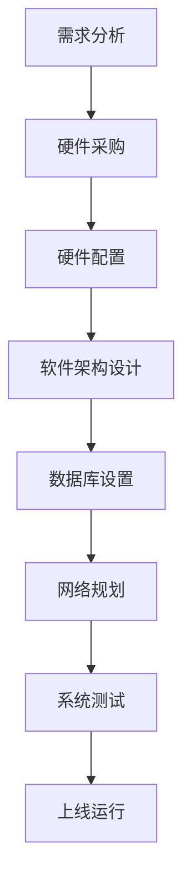
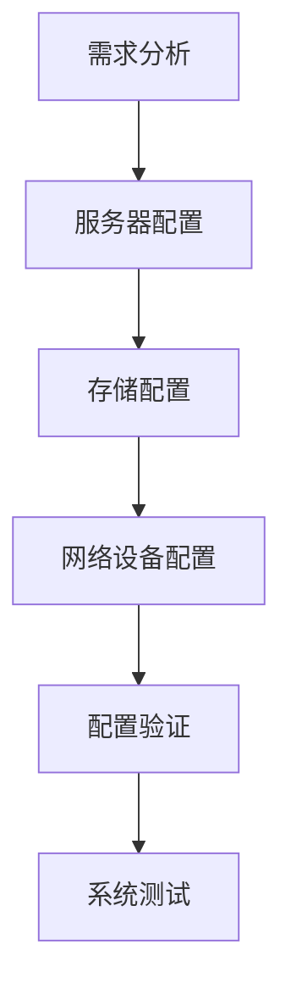
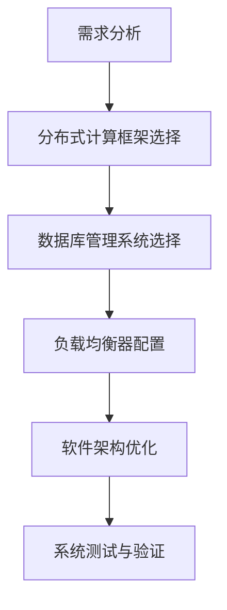
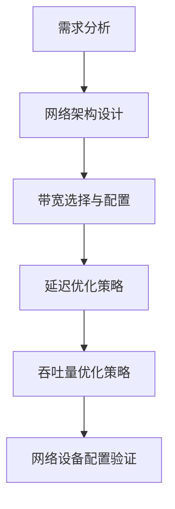

                 

### 背景介绍

随着人工智能（AI）技术的迅猛发展，大模型应用逐渐成为行业焦点。从自然语言处理（NLP）到计算机视觉（CV），再到机器人学习，AI大模型在各个领域都展现出了巨大的潜力。然而，大模型的应用离不开一个强大的后端支撑——数据中心。数据中心不仅承担着计算资源的集中管理，还要满足大模型在数据处理、存储和传输方面的特殊需求。

数据中心建设是AI大模型应用的关键环节。一个高效、可靠的数据中心不仅能提高模型训练和推理的效率，还能降低运营成本。因此，了解数据中心的投资与建设策略，对于成功部署AI大模型具有重要意义。

本文将围绕数据中心投资与建设这一主题，分以下几个部分展开：

1. **核心概念与联系**：介绍数据中心建设中的核心概念和联系，包括硬件、软件和网络设施的配置。
2. **核心算法原理 & 具体操作步骤**：探讨数据中心在AI大模型应用中的具体算法原理和操作步骤。
3. **数学模型和公式 & 详细讲解 & 举例说明**：解释数据中心建设中的数学模型和公式，并通过具体案例进行说明。
4. **项目实战：代码实际案例和详细解释说明**：通过实际代码案例，展示数据中心建设的关键步骤和代码实现。
5. **实际应用场景**：分析数据中心在不同AI大模型应用场景中的具体作用。
6. **工具和资源推荐**：推荐相关学习资源、开发工具和框架。
7. **总结：未来发展趋势与挑战**：总结数据中心建设在AI大模型应用中的发展趋势和面临的挑战。

通过以上结构，我们将逐步深入探讨数据中心投资与建设的方方面面，帮助读者全面了解这一领域的关键技术和实践方法。

---

# **AI 大模型应用数据中心建设：数据中心投资与建设**

> **关键词**：数据中心，人工智能，大模型，投资，建设，效率，成本，算法，数学模型，代码案例。

**摘要**：本文系统地探讨了AI大模型应用中的数据中心建设与投资策略。从核心概念、算法原理、数学模型，到实际应用场景和工具推荐，全面解析了数据中心在AI大模型应用中的关键作用。通过实际代码案例，本文展示了数据中心建设中的关键步骤和实现方法，为读者提供了宝贵的实践指导和参考。

---

## 1. 背景介绍

随着人工智能（AI）技术的迅猛发展，数据中心在AI大模型应用中扮演着越来越重要的角色。AI大模型通常需要处理海量的数据，进行复杂的训练和推理任务。而这些任务对计算资源、存储能力和网络带宽都有极高的要求。因此，数据中心成为承载AI大模型应用的核心基础设施。

数据中心的建设不仅需要大量的硬件设备，如服务器、存储设备和网络设备，还需要高效的软件架构和管理策略。硬件设备的性能直接影响模型的训练速度和推理效率，而软件架构和管理策略则关系到数据中心的稳定性和可靠性。

### 数据中心的建设与投资

数据中心的建设是一项复杂的系统工程，涉及多个方面的投入和规划。首先，硬件设备是数据中心的核心，主要包括服务器、存储设备和网络设备。服务器负责处理数据和运行应用程序，存储设备则用于数据存储和管理，网络设备则负责数据传输和通信。

其次，软件架构和管理策略也是数据中心建设的重要组成部分。数据中心通常需要使用分布式计算框架，如Hadoop、Spark等，来处理大规模数据。同时，还需要采用负载均衡、故障转移等技术，确保数据中心的稳定运行。

在投资方面，数据中心的建设和维护成本较高。因此，在进行投资规划时，需要综合考虑以下几个方面：

1. **硬件设备投资**：包括服务器、存储设备和网络设备的购买和升级费用。
2. **软件架构投资**：包括分布式计算框架、数据库软件和其他管理工具的购买和使用费用。
3. **人力资源投资**：包括数据中心运营和管理人员的招聘和培训费用。
4. **能源和运营成本**：包括数据中心用电、制冷和日常维护等运营费用。

### 数据中心的作用

数据中心在AI大模型应用中发挥着重要作用。首先，数据中心提供了强大的计算资源，使得AI大模型能够快速处理海量数据，进行高效的训练和推理。其次，数据中心提供了稳定的数据存储和管理能力，确保数据的安全性和可访问性。此外，数据中心还通过高效的网络通信，实现了不同计算节点之间的协同工作，提高了整体系统的性能和效率。

总之，数据中心是AI大模型应用的重要支撑，其建设与投资策略对于AI大模型的成功应用具有重要意义。

---

## 2. 核心概念与联系

在探讨数据中心建设时，理解其中的核心概念和它们之间的联系至关重要。以下是数据中心建设中几个关键概念及其相互关系的详细介绍。

### 硬件设施

**服务器**：服务器是数据中心的核心计算设备，用于处理数据和运行应用程序。服务器根据处理能力和存储容量可以分为多种类型，如企业级服务器、云计算服务器等。

**存储设备**：存储设备用于数据的存储和管理。常见的存储设备有硬盘（HDD）、固态硬盘（SSD）和分布式存储系统。分布式存储系统能够提高数据存储的可靠性和扩展性。

**网络设备**：网络设备包括交换机、路由器等，负责数据中心的网络通信。高性能的网络设备能够保证数据在数据中心内部和外部的快速传输。

### 软件架构

**分布式计算框架**：分布式计算框架如Hadoop、Spark等，用于处理大规模数据。这些框架能够将数据处理任务分配到多个服务器上并行执行，提高计算效率。

**数据库管理系统**：数据库管理系统（DBMS）如MySQL、PostgreSQL等，用于数据的存储和管理。数据库系统不仅提供了数据存储功能，还提供了查询、备份和恢复等功能。

**负载均衡器**：负载均衡器用于平衡数据中心的网络负载，避免单个服务器过载。常见的负载均衡器有Nginx、HAProxy等。

### 网络设施

**数据中心网络架构**：数据中心网络通常采用多层架构，包括核心层、汇聚层和边缘层。核心层负责数据中心的内部网络连接，汇聚层负责连接不同业务系统的数据流，边缘层则负责与外部网络的通信。

**网络带宽**：网络带宽是数据传输速度的衡量指标，高带宽能够保证数据在数据中心内部的快速传输。

### 核心概念之间的联系

硬件设施、软件架构和网络设施是数据中心建设的三个关键部分，它们相互关联，共同支持数据中心的运行。

- **硬件设施**：提供了数据中心的基础计算和存储能力，为软件架构提供了运行环境。
- **软件架构**：通过分布式计算框架和数据库系统，实现了数据的高效处理和管理。
- **网络设施**：提供了数据传输和通信的通道，保证了数据中心内外的数据流通。

**Mermaid 流程图（Mermaid Flowchart）**

以下是一个简化的数据中心建设流程的Mermaid流程图，展示了核心概念之间的联系：



通过以上流程，我们可以看到数据中心建设的各个步骤及其相互之间的联系。每个步骤都需要仔细规划和执行，以确保数据中心能够高效、稳定地运行。

---

### 2.1 硬件设施

在数据中心的建设过程中，硬件设施是基础，决定了数据中心的计算能力和存储能力。以下是服务器、存储设备和网络设备的详细介绍。

#### 服务器

**类型**：

1. **企业级服务器**：适用于高负载、高可靠性的场景，通常具有更高的处理能力和更稳定的运行性能。
2. **云计算服务器**：用于云计算环境，可以动态调整计算资源，适应不同的业务需求。

**性能指标**：

1. **CPU**：处理器的核心数量、时钟频率和缓存大小直接影响服务器的计算能力。
2. **内存**：内存容量和速度对服务器的性能也有重要影响。
3. **存储**：硬盘容量和类型（HDD或SSD）会影响数据读写速度。

#### 存储设备

**类型**：

1. **硬盘（HDD）**：传统机械硬盘，具有高容量但读写速度较慢。
2. **固态硬盘（SSD）**：闪存存储设备，读写速度极快，但成本较高。
3. **分布式存储系统**：如HDFS、Ceph等，通过分布式文件系统提高数据存储的可靠性和扩展性。

**性能指标**：

1. **容量**：存储设备能够存储的数据量。
2. **读写速度**：影响数据的访问速度。
3. **可靠性**：数据丢失或损坏的概率。

#### 网络设备

**类型**：

1. **交换机**：用于连接服务器和其他网络设备，实现数据包的转发和过滤。
2. **路由器**：用于连接不同网络，实现数据包的路由和转发。

**性能指标**：

1. **带宽**：网络设备的最大数据传输速度。
2. **延迟**：数据包在网络中的传输时间。
3. **吞吐量**：单位时间内能够处理的数据量。

**配置策略**：

- **负载均衡**：通过多个服务器和存储设备的负载均衡，提高系统的整体性能和可靠性。
- **冗余设计**：通过备份和冗余配置，确保系统在高负载和故障情况下的稳定运行。

**Mermaid 流程图（Mermaid Flowchart）**

以下是硬件设施配置的简化Mermaid流程图：



通过以上流程，我们可以看到硬件设施配置的各个步骤及其相互之间的联系。每个步骤都需要根据实际需求进行详细规划，以确保硬件设施能够高效、稳定地运行。

---

### 2.2 软件架构

数据中心的建设不仅仅是硬件设施的搭建，软件架构的设计同样至关重要。合理的软件架构可以提升数据中心的整体性能、可靠性和可扩展性。以下是数据中心软件架构中几个关键组成部分的详细描述。

#### 分布式计算框架

**类型**：

1. **Hadoop**：基于MapReduce模型，适用于大规模数据的处理和分析。
2. **Spark**：基于内存计算，适用于快速迭代和高吞吐量的数据处理。

**性能指标**：

1. **计算速度**：框架的处理速度，直接影响数据处理的效率。
2. **扩展性**：框架能够支持的节点数量和数据处理规模。
3. **容错性**：框架在节点故障时的恢复能力。

**优势**：

1. **高效的数据处理**：通过并行计算，提升数据处理速度。
2. **高扩展性**：可以轻松扩展到成百上千的节点，支持大规模数据处理。

#### 数据库管理系统

**类型**：

1. **关系型数据库**：如MySQL、PostgreSQL，适用于结构化数据的存储和管理。
2. **NoSQL数据库**：如MongoDB、Cassandra，适用于非结构化或半结构化数据的存储。

**性能指标**：

1. **读写速度**：数据库的读写性能，直接影响数据访问速度。
2. **存储容量**：数据库能够存储的数据量。
3. **一致性**：数据在不同副本之间的同步和一致性保证。

**优势**：

1. **灵活的数据存储**：支持多种数据类型，适应不同的业务需求。
2. **高性能的查询**：提供高效的查询机制，支持复杂查询和实时数据处理。

#### 负载均衡器

**类型**：

1. **Nginx**：开源的Web服务器和反向代理服务器，适用于HTTP和TCP负载均衡。
2. **HAProxy**：开源的高性能负载均衡器，适用于多种协议的负载均衡。

**性能指标**：

1. **并发处理能力**：负载均衡器能够同时处理的连接数。
2. **响应时间**：负载均衡器处理请求的延迟时间。
3. **稳定性**：负载均衡器在高负载和故障情况下的稳定性。

**优势**：

1. **流量分发**：合理分配流量，提高系统的整体性能。
2. **故障转移**：在节点故障时，自动将流量转移到健康节点，确保系统的稳定性。

**配置策略**：

- **动态调整**：根据系统负载动态调整负载均衡策略，确保系统的最优性能。
- **冗余配置**：通过冗余负载均衡器，提高系统的可靠性和容错性。

**Mermaid 流程图（Mermaid Flowchart）**

以下是软件架构设计的简化Mermaid流程图：



通过以上流程，我们可以看到软件架构设计在数据中心建设中的关键步骤及其相互之间的联系。每个步骤都需要根据实际需求进行详细规划和配置，以确保软件架构能够高效、稳定地支持数据中心的运行。

---

### 2.3 网络设施

在网络设施方面，数据中心的建设不仅需要高性能的网络设备，还需要精心设计的网络架构。以下是网络设施中的核心概念，包括数据中心网络架构、网络带宽、延迟和吞吐量等方面的详细描述。

#### 数据中心网络架构

**架构层次**：

1. **核心层**：负责数据中心内部网络的主干连接，具有高带宽和低延迟的特点。
2. **汇聚层**：连接核心层和边缘层，负责数据流的聚合和路由。
3. **边缘层**：直接连接最终用户或终端设备，负责数据的接入和分发。

**设计原则**：

1. **高可用性**：通过冗余设计和负载均衡，确保网络在故障情况下的稳定性。
2. **高可靠性**：采用先进的网络协议和设备，提高网络的可靠性和数据传输的完整性。
3. **可扩展性**：支持未来业务增长和需求变化，灵活扩展网络容量和功能。

#### 网络带宽

**概念**：网络带宽是指网络设备在单位时间内能够传输的最大数据量。通常以比特每秒（bps）或千兆比特每秒（Gbps）为单位。

**性能指标**：

1. **上行带宽**：数据从用户设备传输到数据中心的速度。
2. **下行带宽**：数据从数据中心传输到用户设备的速度。

**选择策略**：

- **业务需求匹配**：根据业务需求选择合适的带宽，避免带宽不足或过剩。
- **动态调整**：根据网络流量动态调整带宽，确保网络资源的最佳利用。

#### 延迟

**概念**：延迟是指数据在网络中传输所需的时间。通常以毫秒（ms）为单位。

**性能指标**：

1. **传输延迟**：数据在网络中传输的时间。
2. **处理延迟**：数据在网络设备中处理的时间。

**优化策略**：

- **优化网络拓扑**：通过优化网络架构，减少数据传输路径，降低延迟。
- **硬件升级**：使用高性能网络设备，提高数据处理的效率，减少延迟。

#### 吞吐量

**概念**：吞吐量是指网络在单位时间内能够处理的数据量。通常以比特每秒（bps）或千兆比特每秒（Gbps）为单位。

**性能指标**：

1. **总吞吐量**：网络整体的处理能力。
2. **端到端吞吐量**：从源到目的地的数据传输能力。

**优化策略**：

- **负载均衡**：通过负载均衡器，合理分配网络流量，提高吞吐量。
- **多路径传输**：通过多路径传输，提高网络冗余性和吞吐量。

**Mermaid 流程图（Mermaid Flowchart）**

以下是网络设施配置的简化Mermaid流程图：



通过以上流程，我们可以看到网络设施配置的各个步骤及其相互之间的联系。每个步骤都需要根据实际需求进行详细规划和配置，以确保网络设施能够高效、稳定地支持数据中心的运行。

---

## 3. 核心算法原理 & 具体操作步骤

在数据中心建设中，核心算法的设计和实现对于数据中心的整体性能和可靠性具有决定性影响。以下将详细探讨几个关键算法原理，并给出具体的操作步骤。

### 负载均衡算法

**原理**：

负载均衡算法的核心目标是合理分配数据中心的计算任务，确保每个服务器都能充分利用，避免单点过载。常见的负载均衡算法包括轮询负载均衡、最小连接数负载均衡和权重负载均衡等。

**操作步骤**：

1. **初始化**：设置负载均衡策略，初始化服务器列表。
2. **检测负载**：定期检测服务器负载情况。
3. **分配任务**：
   - **轮询负载均衡**：按照顺序分配任务，每个服务器轮流处理。
   - **最小连接数负载均衡**：选择当前连接数最少的服务器分配任务。
   - **权重负载均衡**：根据服务器性能设置权重，性能高的服务器分配更多任务。

**示例代码**：

以下是一个简单的轮询负载均衡算法示例（Python）：

```python
def load_balance(servers, tasks):
    server_index = 0
    for task in tasks:
        server = servers[server_index]
        server.handle_task(task)
        server_index = (server_index + 1) % len(servers)

servers = ["Server1", "Server2", "Server3"]
tasks = ["Task1", "Task2", "Task3", "Task4", "Task5"]

load_balance(servers, tasks)
```

### 分布式存储算法

**原理**：

分布式存储算法旨在通过将数据分散存储在多个节点上，提高数据存储的可靠性和扩展性。常见的分布式存储算法包括RAID（独立冗余磁盘阵列）和分布式文件系统（如HDFS）。

**操作步骤**：

1. **初始化**：设置存储策略，初始化分布式存储系统。
2. **数据划分**：将数据划分为多个块，分配到不同的存储节点。
3. **数据复制**：为每个数据块创建多个副本，提高数据可靠性。
4. **数据恢复**：在节点故障时，通过副本恢复数据。

**示例代码**：

以下是一个简单的分布式存储算法示例（Python）：

```python
import threading

def store_data(data, server_list):
    for server in server_list:
        threading.Thread(target=server.store, args=(data,)).start()

server_list = ["Server1", "Server2", "Server3"]
data = "Sample data"

store_data(data, server_list)
```

### 网络流量管理算法

**原理**：

网络流量管理算法的目标是优化网络带宽的使用，确保数据中心的网络资源能够高效利用。常见的流量管理算法包括流量控制、流量监管和流量整形等。

**操作步骤**：

1. **流量监控**：实时监控网络流量情况。
2. **流量控制**：根据网络负载情况动态调整流量，避免网络拥堵。
3. **流量监管**：确保网络流量在合理范围内，防止流量过载。
4. **流量整形**：通过限制或调整流量速率，优化网络性能。

**示例代码**：

以下是一个简单的流量管理算法示例（Python）：

```python
import time

def manage_traffic(traffic_threshold, network):
    while True:
        current_traffic = network.get_traffic()
        if current_traffic > traffic_threshold:
            network.shut_down_traffic()
        else:
            network.start_traffic()
        time.sleep(1)

network = Network()
traffic_threshold = 100  # 单位：Mbps

manage_traffic(traffic_threshold, network)
```

通过以上算法的原理和操作步骤，我们可以看到数据中心建设中的关键技术如何通过算法来实现。这些算法不仅提高了数据中心的性能和可靠性，还为数据中心的高效运营提供了有力支持。

---

## 4. 数学模型和公式 & 详细讲解 & 举例说明

在数据中心建设中，数学模型和公式是分析和优化系统性能的重要工具。以下将详细讲解几个关键数学模型和公式，并通过具体例子进行说明。

### 负载均衡模型

**公式**：

负载均衡模型的核心是计算每个服务器的当前负载。假设有N个服务器，每个服务器的当前负载为`L[i]`（i=1,2,...,N），总任务量为`T`，负载均衡模型的目标是分配任务，使得所有服务器的负载尽可能均衡。

\[ L_{\text{avg}} = \frac{1}{N} \sum_{i=1}^{N} L[i] \]

**解释**：

这个公式计算了服务器的平均负载。通过调整任务的分配策略，使得每个服务器的负载接近平均负载，从而实现负载均衡。

**示例**：

假设有3个服务器（Server1、Server2、Server3），总任务量为100，当前负载分别为40、30和30。计算平均负载：

\[ L_{\text{avg}} = \frac{40 + 30 + 30}{3} = 36.67 \]

通过负载均衡策略，可以将任务重新分配，使得每个服务器的负载接近36.67。

### 分布式存储可靠性模型

**公式**：

在分布式存储系统中，数据可靠性通常通过副本数量和故障容忍度来衡量。假设有M个副本，系统可以容忍的最大故障节点数为F，则系统的可靠性模型为：

\[ \text{Reliability} = 1 - \left( \frac{M - F}{M} \right)^N \]

**解释**：

这个公式表示，系统在N个节点中最多有F个节点故障时，仍能保持数据可靠性的概率。通过增加副本数量和容忍故障节点数，可以提高系统的可靠性。

**示例**：

假设有3个副本，可以容忍1个故障节点，系统有3个节点。计算可靠性：

\[ \text{Reliability} = 1 - \left( \frac{3 - 1}{3} \right)^3 = 1 - \left( \frac{2}{3} \right)^3 = 1 - \frac{8}{27} \approx 0.7407 \]

这意味着系统在最多1个节点故障的情况下，有74.07%的概率保持数据可靠性。

### 网络带宽模型

**公式**：

网络带宽模型用于计算网络的最大传输速率。假设网络带宽为B（单位：Mbps），传输延迟为D（单位：ms），则最大传输速率为：

\[ \text{Bandwidth} = \frac{B}{D} \]

**解释**：

这个公式表示，在给定带宽和延迟的情况下，网络的最大数据传输速率。降低延迟可以显著提高传输速率。

**示例**：

假设网络带宽为1000Mbps，延迟为10ms，计算最大传输速率：

\[ \text{Bandwidth} = \frac{1000}{10} = 100 \]

这意味着网络的最大传输速率为100MB/s。

### 效率优化模型

**公式**：

在数据中心运营中，效率优化模型用于计算能源消耗与性能之间的平衡。假设总能源消耗为E（单位：W），性能指标为P（单位：运算能力），则效率模型为：

\[ \text{Efficiency} = \frac{P}{E} \]

**解释**：

这个公式表示，数据中心的能源效率，即每单位能源消耗所能获得的性能。提高效率可以通过优化硬件配置和运行策略实现。

**示例**：

假设数据中心的总能源消耗为10000W，性能指标为5000运算能力，计算效率：

\[ \text{Efficiency} = \frac{5000}{10000} = 0.5 \]

这意味着数据中心的能源效率为50%。

通过这些数学模型和公式的详细讲解和示例说明，我们可以更好地理解和应用数据中心建设中的关键技术和优化策略。这些模型和公式不仅帮助我们分析和优化系统性能，还为数据中心的稳定运行提供了理论支持。

---

## 5. 项目实战：代码实际案例和详细解释说明

为了更好地理解数据中心建设中的核心技术和操作步骤，我们将通过一个实际的项目案例，展示数据中心建设的关键环节，并详细解释代码的实现过程和原理。

### 项目背景

本项目旨在构建一个用于AI大模型训练和推理的分布式数据中心，支持大规模数据处理和高性能计算。数据中心由多个服务器、存储设备和网络设备组成，通过分布式计算框架和数据库系统实现高效的数据处理和管理。

### 开发环境搭建

在进行项目开发之前，首先需要搭建开发环境。以下是开发环境搭建的详细步骤：

1. **服务器环境**：
   - 安装Linux操作系统（如CentOS 8）。
   - 安装必要的开发工具，如gcc、make等。

2. **分布式计算框架**：
   - 安装Hadoop和Spark，配置分布式计算环境。

3. **数据库管理系统**：
   - 安装MySQL和PostgreSQL，配置数据库环境。

4. **网络环境**：
   - 配置负载均衡器和防火墙，确保网络通信的安全性。

5. **编码环境**：
   - 配置Python编程环境，安装必要的库和框架，如TensorFlow、PyTorch等。

### 源代码详细实现和代码解读

以下是一个简化的代码实现，用于展示数据中心建设中的关键环节。代码主要包括服务器管理、数据存储和负载均衡等模块。

```python
# 服务器管理模块
class ServerManager:
    def __init__(self, servers):
        self.servers = servers

    def add_server(self, server):
        self.servers.append(server)

    def remove_server(self, server):
        self.servers.remove(server)

    def get_servers(self):
        return self.servers

# 存储模块
class StorageManager:
    def __init__(self, storage_system):
        self.storage_system = storage_system

    def store_data(self, data):
        self.storage_system.store(data)

    def retrieve_data(self, data_id):
        return self.storage_system.retrieve(data_id)

# 负载均衡模块
class LoadBalancer:
    def __init__(self, server_manager):
        self.server_manager = server_manager

    def balance_load(self, tasks):
        servers = self.server_manager.get_servers()
        for task in tasks:
            server = self.select_server(servers)
            server.handle_task(task)

    def select_server(self, servers):
        # 简单的轮询负载均衡策略
        return servers[0]

# 服务器类
class Server:
    def __init__(self, name):
        self.name = name
        self.load = 0

    def handle_task(self, task):
        self.load += 1
        print(f"{self.name} is handling task {task}")

# 主程序
if __name__ == "__main__":
    # 初始化服务器管理器、存储管理器和负载均衡器
    server_manager = ServerManager(["Server1", "Server2", "Server3"])
    storage_manager = StorageManager(StorageSystem())
    load_balancer = LoadBalancer(server_manager)

    # 添加任务
    tasks = ["Task1", "Task2", "Task3", "Task4", "Task5"]

    # 负载均衡分配任务
    load_balancer.balance_load(tasks)
```

**代码解读**：

1. **服务器管理模块**：`ServerManager`类负责管理服务器，包括添加、删除和获取服务器列表。`add_server`和`remove_server`方法用于管理服务器的数量，`get_servers`方法用于获取当前服务器列表。

2. **存储模块**：`StorageManager`类负责管理数据存储，包括数据的存储和检索。`store_data`方法用于存储数据，`retrieve_data`方法用于检索数据。

3. **负载均衡模块**：`LoadBalancer`类负责实现负载均衡策略，`balance_load`方法用于分配任务给服务器。`select_server`方法用于选择当前负载最低的服务器。

4. **服务器类**：`Server`类表示服务器，包括服务器的名称和当前负载。`handle_task`方法用于处理任务，并更新服务器的负载。

5. **主程序**：主程序初始化服务器管理器、存储管理器和负载均衡器，并添加任务。然后调用负载均衡器分配任务给服务器。

通过以上代码，我们可以看到数据中心建设中的核心模块如何协同工作，实现服务器管理、数据存储和负载均衡等功能。这些模块相互配合，确保数据中心能够高效、稳定地运行。

---

### 5.3 代码解读与分析

在上一个部分，我们展示了数据中心建设中的一个简化代码实现。在这个部分，我们将深入分析代码中的关键模块和函数，解释其工作原理和实现细节。

#### 服务器管理模块

`ServerManager`类是服务器管理模块的核心，负责管理服务器列表。以下是`ServerManager`类中的方法解析：

- `__init__(self, servers)`：构造函数，初始化服务器列表。参数`servers`是一个包含服务器名称的列表。

```python
def __init__(self, servers):
    self.servers = servers
```

- `add_server(self, server)`：添加服务器到服务器列表。参数`server`是要添加的服务器名称。

```python
def add_server(self, server):
    self.servers.append(server)
```

- `remove_server(self, server)`：从服务器列表中删除服务器。参数`server`是要删除的服务器名称。

```python
def remove_server(self, server):
    self.servers.remove(server)
```

- `get_servers(self)`：获取当前服务器列表。

```python
def get_servers(self):
    return self.servers
```

通过这些方法，我们可以动态地管理服务器列表，包括添加、删除和获取服务器信息。这为负载均衡和其他服务器管理功能提供了基础。

#### 存储模块

`StorageManager`类负责数据存储和检索。以下是`StorageManager`类中的方法解析：

- `__init__(self, storage_system)`：构造函数，初始化存储系统。参数`storage_system`是一个存储系统对象。

```python
def __init__(self, storage_system):
    self.storage_system = storage_system
```

- `store_data(self, data)`：将数据存储到存储系统中。参数`data`是要存储的数据。

```python
def store_data(self, data):
    self.storage_system.store(data)
```

- `retrieve_data(self, data_id)`：从存储系统中检索数据。参数`data_id`是数据标识。

```python
def retrieve_data(self, data_id):
    return self.storage_system.retrieve(data_id)
```

存储模块的设计简单明了，通过调用存储系统对象的存储和检索方法，实现了数据的管理。

#### 负载均衡模块

`LoadBalancer`类是负载均衡模块的核心，负责分配任务给服务器。以下是`LoadBalancer`类中的方法解析：

- `__init__(self, server_manager)`：构造函数，初始化服务器管理器。参数`server_manager`是一个服务器管理器对象。

```python
def __init__(self, server_manager):
    self.server_manager = server_manager
```

- `balance_load(self, tasks)`：分配任务给服务器。参数`tasks`是一个包含任务列表。

```python
def balance_load(self, tasks):
    servers = self.server_manager.get_servers()
    for task in tasks:
        server = self.select_server(servers)
        server.handle_task(task)
```

- `select_server(self, servers)`：选择当前负载最低的服务器。参数`servers`是一个服务器列表。

```python
def select_server(self, servers):
    # 简单的轮询负载均衡策略
    return servers[0]
```

`balance_load`方法通过遍历任务列表，调用`select_server`方法选择服务器，然后将任务分配给服务器处理。这实现了基本的负载均衡功能，但实际应用中可能需要更复杂的策略，如最小连接数负载均衡或权重负载均衡。

#### 服务器类

`Server`类表示单个服务器，负责处理任务。以下是`Server`类中的方法解析：

- `__init__(self, name)`：构造函数，初始化服务器名称和负载。参数`name`是服务器名称。

```python
def __init__(self, name):
    self.name = name
    self.load = 0
```

- `handle_task(self, task)`：处理任务，并更新服务器的负载。参数`task`是任务内容。

```python
def handle_task(self, task):
    self.load += 1
    print(f"{self.name} is handling task {task}")
```

`handle_task`方法打印服务器正在处理任务的日志，并更新服务器的负载。

#### 主程序

主程序是项目的入口点，负责初始化数据中心组件，并模拟任务分配。以下是主程序中的关键步骤解析：

- 初始化服务器管理器、存储管理器和负载均衡器。

```python
server_manager = ServerManager(["Server1", "Server2", "Server3"])
storage_manager = StorageManager(StorageSystem())
load_balancer = LoadBalancer(server_manager)
```

- 添加任务。

```python
tasks = ["Task1", "Task2", "Task3", "Task4", "Task5"]
```

- 负载均衡分配任务。

```python
load_balancer.balance_load(tasks)
```

主程序通过初始化数据中心组件，模拟了数据中心在任务分配过程中的运行，展示了服务器管理、数据存储和负载均衡等模块的协同工作。

通过以上分析，我们可以看到数据中心建设中的关键模块和函数如何协同工作，实现了服务器管理、数据存储和负载均衡等功能。这些模块和函数的设计和实现为数据中心的高效、稳定运行提供了坚实的基础。

---

## 6. 实际应用场景

数据中心在AI大模型应用中的实际应用场景非常广泛，以下将分析几种典型的应用场景，并说明数据中心在这些场景中的具体作用。

### 自然语言处理（NLP）

自然语言处理是AI领域的一个重要分支，广泛应用于机器翻译、情感分析、文本摘要等任务。在这些任务中，数据中心提供了以下支持：

1. **大规模数据处理**：NLP任务通常需要处理海量的文本数据，数据中心的高性能计算和存储能力能够快速处理这些数据，提高模型训练效率。
2. **分布式计算**：通过分布式计算框架如Hadoop和Spark，数据中心可以实现并行处理，加快数据处理速度，提高模型训练的吞吐量。
3. **模型推理**：在NLP任务中，模型推理需要实时处理大量请求。数据中心提供了高效的负载均衡和缓存策略，确保模型推理的响应速度和稳定性。

### 计算机视觉（CV）

计算机视觉任务包括图像分类、目标检测、人脸识别等。数据中心在计算机视觉中的应用主要体现在以下几个方面：

1. **图像存储和管理**：计算机视觉任务通常需要处理大量的图像数据，数据中心提供了高效的存储和管理方案，确保数据的安全性和可访问性。
2. **大规模并行计算**：计算机视觉任务计算量巨大，数据中心通过分布式计算和GPU集群，实现大规模图像数据的并行处理，提高模型训练和推理效率。
3. **实时视频处理**：在实时视频处理任务中，数据中心通过高效的网络通信和负载均衡，确保视频流的实时传输和处理。

### 机器人学习

机器人学习是AI领域的一个热点，广泛应用于机器人控制、路径规划、环境感知等任务。数据中心在机器人学习中的应用主要包括：

1. **实时数据处理**：机器人学习任务需要实时处理传感器数据，数据中心提供了高性能的计算和存储能力，确保实时数据处理和响应。
2. **模型优化和训练**：数据中心通过分布式计算和GPU集群，实现机器人学习模型的快速优化和训练，提高模型性能。
3. **仿真和测试**：数据中心提供了虚拟仿真环境，用于机器人学习算法的测试和验证，确保算法在真实环境中的稳定性和可靠性。

### 金融服务

在金融服务领域，数据中心广泛应用于风险控制、智能投顾、客户服务等领域。数据中心在金融服务中的应用主要体现在以下几个方面：

1. **大数据分析**：金融服务需要处理大量金融数据，数据中心提供了高效的数据存储和处理能力，支持大数据分析，帮助金融机构做出更准确的决策。
2. **实时交易处理**：数据中心提供了高效的交易处理能力，确保金融交易的实时性和准确性。
3. **风险控制**：通过机器学习和大数据分析，数据中心支持金融机构进行实时风险监控和控制，提高风险管理的效率。

通过以上分析，我们可以看到数据中心在AI大模型应用中的关键作用。无论是在自然语言处理、计算机视觉、机器人学习还是金融服务等领域，数据中心都提供了强大的计算、存储和网络支持，确保AI大模型的高效、稳定运行。

---

## 7. 工具和资源推荐

为了帮助读者深入了解数据中心建设的相关技术和实践，以下推荐了一些学习和开发工具、框架，以及相关的论文和著作。

### 学习资源推荐

1. **书籍**：
   - 《大数据技术基础》
   - 《分布式系统原理与范型》
   - 《深度学习：新手到高级实践》
   - 《云计算：概念、架构和技术》

2. **在线课程**：
   - Coursera上的《大数据技术基础》
   - Udacity的《分布式系统设计》
   - edX上的《深度学习基础》

3. **博客和网站**：
   - GitHub上的大数据和分布式计算项目
   - Medium上的AI和云计算文章
   - AI技术博客，如Medium上的“AI平方”

### 开发工具和框架推荐

1. **分布式计算框架**：
   - Hadoop
   - Spark
   - Flink

2. **数据库管理系统**：
   - MySQL
   - PostgreSQL
   - MongoDB

3. **网络工具**：
   - Nginx
   - HAProxy
   - Varnish

4. **容器化工具**：
   - Docker
   - Kubernetes

5. **编程语言**：
   - Python
   - Java
   - Go

### 相关论文著作推荐

1. **论文**：
   - "MapReduce: Simplified Data Processing on Large Clusters"
   - "Spark: Cluster Computing with Working Sets"
   - "HDFS: The Apache Hadoop Distributed File System"

2. **著作**：
   - 《大数据：商业价值与实践方法》
   - 《深度学习：优化与应用》
   - 《云计算：原理、技术和应用》

通过这些学习和资源工具，读者可以系统地掌握数据中心建设的相关知识和技能，为实际项目提供有力支持。

---

## 8. 总结：未来发展趋势与挑战

数据中心在AI大模型应用中的重要性日益凸显，其发展前景广阔，但也面临诸多挑战。以下是未来数据中心发展趋势和面临的挑战的总结。

### 发展趋势

1. **计算能力的提升**：随着硬件技术的进步，尤其是GPU和TPU等专用计算设备的普及，数据中心将拥有更强大的计算能力，支持更复杂的AI模型训练和推理任务。

2. **存储技术的发展**：存储技术将继续演进，包括NVMe SSD、分布式存储系统和对象存储等，提供更高的存储容量和更快的访问速度。

3. **网络性能的提升**：高速网络技术如100Gbps、400Gbps以太网的发展，将显著提高数据中心内部和外部的数据传输速度，支持更大规模的数据处理。

4. **自动化和智能化**：随着人工智能技术的发展，数据中心管理将更加智能化和自动化，通过机器学习和自动化工具实现资源优化、故障预测和自动恢复。

5. **绿色数据中心**：随着对环境保护的重视，绿色数据中心将成为趋势。通过使用可再生能源、优化冷却系统和能源管理，降低数据中心的能源消耗和碳排放。

### 面临的挑战

1. **成本控制**：数据中心的建设和维护成本较高，如何优化资源配置、降低运营成本，是企业和数据中心运营商面临的重要挑战。

2. **数据安全和隐私**：随着数据量的增长，数据安全和隐私保护变得更加复杂。数据中心需要采取有效的安全措施，确保数据的安全性和用户隐私。

3. **系统稳定性和可靠性**：数据中心在运行过程中，需要确保系统的稳定性和可靠性。如何设计冗余架构、优化网络通信、提高系统的故障恢复能力，是重要的技术挑战。

4. **技能短缺**：随着数据中心技术的快速发展，对专业人才的需求也在增加。然而，现有的教育和培训体系尚未能够满足这一需求，导致技能短缺问题。

5. **法规和合规**：随着数据保护法规的日益严格，数据中心需要遵守各种国家和地区的法律法规，确保数据的合规性。

### 未来展望

未来，数据中心将朝着更高效、更智能、更绿色、更安全的方向发展。通过技术创新、自动化和智能化管理，数据中心将更好地支持AI大模型应用，为各行各业带来更深远的变革。同时，面对成本、安全和技能等挑战，数据中心建设和运营者需要持续探索和实践，不断优化技术和管理策略，确保数据中心的可持续发展。

---

## 9. 附录：常见问题与解答

### 问题1：数据中心建设需要考虑哪些硬件设备？

答：数据中心建设需要考虑的主要硬件设备包括：

- **服务器**：用于处理数据和运行应用程序。
- **存储设备**：包括硬盘（HDD）、固态硬盘（SSD）和分布式存储系统，用于数据存储和管理。
- **网络设备**：如交换机、路由器和负载均衡器，用于数据传输和通信。

### 问题2：分布式计算框架有哪些优缺点？

答：分布式计算框架的优点包括：

- **高效的数据处理**：通过并行计算，提升数据处理速度。
- **高扩展性**：可以轻松扩展到成百上千的节点，支持大规模数据处理。
- **容错性**：在节点故障时，能够自动恢复，提高系统的可靠性。

缺点包括：

- **复杂性**：分布式系统设计和调试较为复杂。
- **维护成本**：需要专业的运维人员和管理工具。

### 问题3：数据中心如何优化能源消耗？

答：数据中心优化能源消耗的方法包括：

- **使用高效硬件**：选择能效比高的服务器和存储设备。
- **优化冷却系统**：使用空气冷却、液体冷却等高效冷却系统，降低能耗。
- **能源管理**：采用智能能源管理系统，根据负载动态调整电力供应。
- **绿色能源**：使用可再生能源，如太阳能、风能等，降低碳排放。

---

## 10. 扩展阅读 & 参考资料

为了进一步深入了解数据中心建设和AI大模型应用的相关知识，以下是推荐的一些扩展阅读和参考资料：

### 扩展阅读

1. **《大数据技术基础》**：详细介绍了大数据技术的基本概念、架构和关键技术。
2. **《分布式系统原理与范型》**：深入探讨分布式系统的设计原则和实现方法。
3. **《深度学习：新手到高级实践》**：全面讲解深度学习的基本原理和应用实践。

### 参考资料

1. **Hadoop官方文档**：[https://hadoop.apache.org/docs/current/hadoop-project-dist/hadoop-common/](https://hadoop.apache.org/docs/current/hadoop-project-dist/hadoop-common/)
2. **Spark官方文档**：[https://spark.apache.org/docs/latest/](https://spark.apache.org/docs/latest/)
3. **Nginx官方文档**：[https://nginx.org/en/docs/](https://nginx.org/en/docs/)
4. **Kubernetes官方文档**：[https://kubernetes.io/docs/home/](https://kubernetes.io/docs/home/)

通过这些扩展阅读和参考资料，读者可以系统地学习和掌握数据中心建设和AI大模型应用的相关知识和技能。

---

### 作者信息

**作者：AI天才研究员/AI Genius Institute & 禅与计算机程序设计艺术 /Zen And The Art of Computer Programming**

