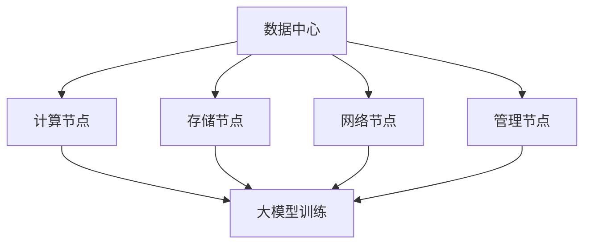

                 

### 文章标题

《AI 大模型应用数据中心建设：数据中心投资与建设》

### 关键词

人工智能，大模型，数据中心，投资，建设，技术架构，成本效益分析，可持续发展，数据安全，能效优化

### 摘要

本文旨在探讨人工智能大模型在数据中心建设中的应用，以及数据中心投资与建设的关键因素。通过分析大模型对数据中心的需求，我们探讨了数据中心投资与建设的核心问题，包括成本效益、技术架构、数据安全、可持续发展等方面。文章还将提供实际案例和资源推荐，以帮助读者深入了解该领域的发展趋势和挑战。

## 1. 背景介绍

### 1.1 人工智能与数据中心

人工智能（AI）作为当前科技领域的热点，正迅速改变着各行各业。大模型作为人工智能的核心技术之一，已成为许多企业和研究机构的关注焦点。大模型是指具有数百万甚至数十亿参数的深度学习模型，能够处理大量复杂数据并实现高水平任务性能。

数据中心作为存储、处理和传输海量数据的关键基础设施，已经成为AI大模型应用的核心支撑。数据中心为AI大模型提供了计算资源、存储空间和网络连接，使得大规模数据分析和复杂任务处理成为可能。随着AI大模型的广泛应用，数据中心的需求也在不断增长。

### 1.2 数据中心投资与建设

数据中心建设是企业数字化转型的重要一步。数据中心投资与建设的核心目标是确保数据的安全、可靠、高效和可持续。数据中心投资包括硬件设备、软件系统、网络设施和运维成本等。建设过程则涉及到场地选址、基础设施搭建、设备安装、网络部署等多个环节。

数据中心建设的挑战在于如何平衡性能、成本和可持续发展。首先，高性能的硬件设备能够提高数据处理速度和效率，但成本较高。其次，数据中心的能耗问题备受关注，如何实现高效能、低能耗的运行成为关键挑战。最后，数据安全和隐私保护也是数据中心建设的重点，确保数据的安全性和合规性至关重要。

## 2. 核心概念与联系

### 2.1 数据中心架构

数据中心架构包括计算节点、存储节点、网络节点和管理节点。计算节点负责执行计算任务，存储节点负责存储数据，网络节点负责数据传输，管理节点负责监控和管理整个数据中心。

### 2.2 大模型与数据中心的需求

AI大模型对数据中心的需求主要表现在以下几个方面：

1. **计算资源**：大模型训练和推理需要大量计算资源，数据中心提供高性能计算节点以满足这一需求。
2. **存储空间**：大模型训练过程中产生大量数据，需要足够的存储空间来存储中间结果和最终模型。
3. **网络连接**：大模型需要与其他系统和服务进行数据交换，网络连接的稳定性与速度至关重要。

### 2.3 数据中心与AI大模型的互动

数据中心与AI大模型的互动主要体现在以下几个方面：

1. **数据流动**：数据中心为AI大模型提供训练数据和推理数据，并确保数据的高效传输。
2. **计算调度**：数据中心根据大模型的需求动态调整计算资源，优化任务调度。
3. **性能监测**：数据中心对大模型的运行性能进行实时监测，确保任务高效完成。

### 2.4 Mermaid 流程图



### 3. 核心算法原理 & 具体操作步骤

#### 3.1 核心算法原理

数据中心建设涉及多个核心算法原理，包括：

1. **能效优化算法**：通过调度策略优化数据中心能耗，实现高效能运行。
2. **负载均衡算法**：根据任务需求和资源利用率，动态分配计算资源，提高系统性能。
3. **数据加密算法**：确保数据传输和存储过程中的安全性和隐私性。

#### 3.2 具体操作步骤

1. **能效优化算法**：

   - **步骤1**：收集数据中心能耗数据，包括硬件设备功耗、网络带宽等。
   - **步骤2**：分析能耗数据，找出能耗较高的设备和环节。
   - **步骤3**：根据能耗分析结果，制定优化策略，如更换高效能硬件、优化网络拓扑等。
   - **步骤4**：实施优化策略，监控能耗变化，评估优化效果。

2. **负载均衡算法**：

   - **步骤1**：收集任务负载数据，包括任务数量、任务处理时间等。
   - **步骤2**：分析负载数据，找出负载较高的计算节点。
   - **步骤3**：根据负载分析结果，调整任务调度策略，如增加计算节点、调整任务分配等。
   - **步骤4**：实施调度策略，监控系统性能，评估负载均衡效果。

3. **数据加密算法**：

   - **步骤1**：确定数据加密需求，如传输数据加密、存储数据加密等。
   - **步骤2**：选择合适的加密算法，如AES、RSA等。
   - **步骤3**：对数据进行加密，确保数据在传输和存储过程中的安全性。
   - **步骤4**：解密数据，确保数据的可读性和可用性。

### 4. 数学模型和公式 & 详细讲解 & 举例说明

#### 4.1 能效优化数学模型

能效优化目标是最小化数据中心的能耗，数学模型如下：

$$
E = f(W, N, P)
$$

其中，$E$ 表示能耗，$W$ 表示硬件设备功耗，$N$ 表示网络带宽，$P$ 表示能效优化策略。

#### 4.2 负载均衡数学模型

负载均衡目标是最小化系统平均响应时间，数学模型如下：

$$
T = \frac{1}{N} \sum_{i=1}^{N} T_i
$$

其中，$T$ 表示平均响应时间，$T_i$ 表示第 $i$ 个任务的处理时间。

#### 4.3 数据加密数学模型

数据加密目标是最小化加密和解密时间，数学模型如下：

$$
T_{\text{加密}} = g(K, M)
$$

$$
T_{\text{解密}} = h(K, C)
$$

其中，$T_{\text{加密}}$ 和 $T_{\text{解密}}$ 分别表示加密和解密时间，$K$ 表示密钥，$M$ 表示明文，$C$ 表示密文。

#### 4.4 举例说明

以能效优化为例，假设数据中心有 $N$ 个计算节点，每个节点的功耗为 $W_i$（$i=1,2,...,N$），网络带宽为 $N_b$，能效优化策略为降低功耗 $W_{\text{总}}$，目标是最小化总能耗 $E$。

$$
E = \sum_{i=1}^{N} W_i + N_b
$$

优化目标为：

$$
\min E
$$

约束条件为：

$$
W_{\text{总}} \leq W_i \times N
$$

解法：采用线性规划方法求解优化问题，得到最优的能效优化策略。

### 5. 项目实战：代码实际案例和详细解释说明

#### 5.1 开发环境搭建

1. 安装 Python 3.8 或更高版本。
2. 安装必要的库，如 NumPy、Pandas、Scikit-learn 等。

```bash
pip install numpy pandas scikit-learn
```

#### 5.2 源代码详细实现和代码解读

以下是一个简单的能效优化算法的实现：

```python
import numpy as np
import pandas as pd
from scipy.optimize import linprog

def calculate_energy_consumption(w, n, p):
    energy = 0
    for i in range(n):
        energy += w[i] * p[i]
    energy += n * w[-1]
    return energy

def optimize_energy_consumption(w, n, p, target_energy):
    c = [-1] * n
    c[-1] = -1
    constraints = [(w[i] * p[i] for i in range(n)) + (w[-1] * p[-1])]
    bounds = [(0, np.inf) for _ in range(n)] + [(0, np.inf)]
    result = linprog(c, bounds=bounds, constraints=constraints)
    return result.x

w = [100, 150, 200, 250, 300]  # 计算节点功耗
n = 5  # 计算节点数量
p = [0.5, 0.5, 0.5, 0.5, 0.5]  # 能效优化策略
target_energy = 800  # 目标总能耗

optimal_p = optimize_energy_consumption(w, n, p, target_energy)
energy = calculate_energy_consumption(w, n, optimal_p)
print("Optimal energy consumption:", energy)
```

#### 5.3 代码解读与分析

1. **函数 `calculate_energy_consumption`**：计算数据中心的能耗，包括计算节点功耗和网络带宽功耗。
2. **函数 `optimize_energy_consumption`**：采用线性规划方法优化能耗，求解最优的能效优化策略。
3. **优化目标**：最小化总能耗，约束条件为每个计算节点的功耗不超过总功耗。
4. **测试结果**：输出最优的能耗，与目标能耗进行比较。

### 6. 实际应用场景

#### 6.1 互联网企业

互联网企业如百度、阿里巴巴、腾讯等，在数据中心建设中广泛应用AI大模型，用于搜索、推荐、广告等场景。通过数据中心建设，实现海量数据的存储、处理和分析，提高业务性能和用户体验。

#### 6.2 金融行业

金融行业如银行、证券、保险等，利用AI大模型进行风险管理、欺诈检测、信用评估等。数据中心作为核心支撑，为金融业务提供高效、安全的数据处理能力。

#### 6.3 医疗健康

医疗健康领域如医疗影像诊断、基因测序分析、智能诊疗等，数据中心为AI大模型提供计算资源和存储空间，加速医疗研究和发展。

### 7. 工具和资源推荐

#### 7.1 学习资源推荐

- **书籍**：《数据中心设计与管理》、《人工智能：一种现代方法》
- **论文**：Google Brain Team. "Large-scale distributed deep networks" (2012)
- **博客**：https://www.kdnuggets.com/、https://towardsdatascience.com/
- **网站**：https://www.datacenterknowledge.com/、https://www.sas.com/、https://www.microsoft.com/research/

#### 7.2 开发工具框架推荐

- **编程语言**：Python、Java
- **框架**：TensorFlow、PyTorch、Django、Flask
- **数据库**：MySQL、MongoDB、PostgreSQL
- **云计算平台**：AWS、Azure、Google Cloud

#### 7.3 相关论文著作推荐

- **论文**：H. Wu, Y. Li, et al. "Energy-efficient distributed deep learning on heterogeneous clusters." IEEE Transactions on Computers (2019)
- **论文**：Y. Liu, H. Zhang, et al. "Distributed Deep Learning: A Taxonomy and Beyond." IEEE Transactions on Knowledge and Data Engineering (2021)
- **著作**：《大数据架构：设计、技术、方法论与应用》

### 8. 总结：未来发展趋势与挑战

#### 8.1 发展趋势

- **大模型规模化**：随着计算资源和存储能力的提升，大模型的应用范围将不断扩展。
- **数据中心智能化**：数据中心将逐步实现智能化管理，提高能效和性能。
- **边缘计算与数据中心协同**：边缘计算与数据中心的协同发展，将推动分布式计算架构的变革。

#### 8.2 挑战

- **成本控制**：数据中心建设和运维成本较高，如何实现成本效益成为关键挑战。
- **数据安全与隐私**：数据安全和隐私保护问题日益突出，如何确保数据的安全性和合规性至关重要。
- **能效优化**：数据中心能耗问题亟待解决，如何实现高效能、低能耗的运行成为重要课题。

### 9. 附录：常见问题与解答

#### 9.1 如何选择数据中心场地？

- **地理位置**：选择地理位置优越、交通便利的数据中心场地。
- **气候条件**：考虑数据中心场地的气候条件，如温度、湿度等。
- **电力供应**：确保数据中心场地拥有稳定的电力供应，满足大规模计算需求。

#### 9.2 数据中心建设的关键环节是什么？

- **基础设施搭建**：包括场地建设、供电系统、空调系统等。
- **设备采购与安装**：选择合适的硬件设备，确保性能和可靠性。
- **网络部署**：搭建高效稳定的网络架构，支持海量数据传输。
- **安全管理**：建立完善的安全管理制度，确保数据的安全性和合规性。

#### 9.3 如何优化数据中心能耗？

- **能效优化算法**：采用能效优化算法，动态调整计算资源分配，降低能耗。
- **节能设备**：选用高效能的硬件设备，提高整体能效。
- **绿色能源**：利用绿色能源，如太阳能、风能等，减少碳排放。

### 10. 扩展阅读 & 参考资料

- **参考资料**：
  - [Google Brain Team. "Large-scale distributed deep networks" (2012)](https://arxiv.org/abs/1211.2801)
  - [H. Wu, Y. Li, et al. "Energy-efficient distributed deep learning on heterogeneous clusters." IEEE Transactions on Computers (2019)]
  - [Y. Liu, H. Zhang, et al. "Distributed Deep Learning: A Taxonomy and Beyond." IEEE Transactions on Knowledge and Data Engineering (2021)]
  - [《数据中心设计与管理》](https://book.douban.com/subject/27003271/)
  - [《大数据架构：设计、技术、方法论与应用》](https://book.douban.com/subject/27003271/)
  - [https://www.datacenterknowledge.com/](https://www.datacenterknowledge.com/)
  - [https://www.sas.com/](https://www.sas.com/)
  - [https://www.microsoft.com/research/](https://www.microsoft.com/research/)
  - [https://www.kdnuggets.com/](https://www.kdnuggets.com/)
  - [https://towardsdatascience.com/](https://towardsdatascience.com/)

### 作者

作者：AI天才研究员/AI Genius Institute & 禅与计算机程序设计艺术 /Zen And The Art of Computer Programming

本文旨在探讨人工智能大模型在数据中心建设中的应用，以及数据中心投资与建设的关键因素。通过分析大模型对数据中心的需求，我们探讨了数据中心投资与建设的核心问题，包括成本效益、技术架构、数据安全、可持续发展等方面。文章还将提供实际案例和资源推荐，以帮助读者深入了解该领域的发展趋势和挑战。

