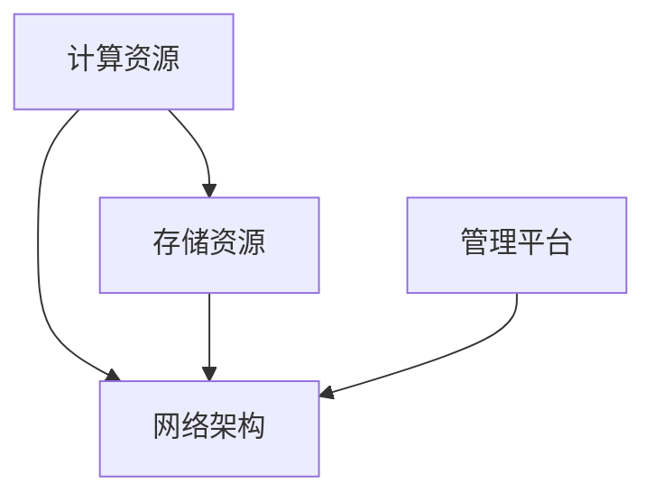
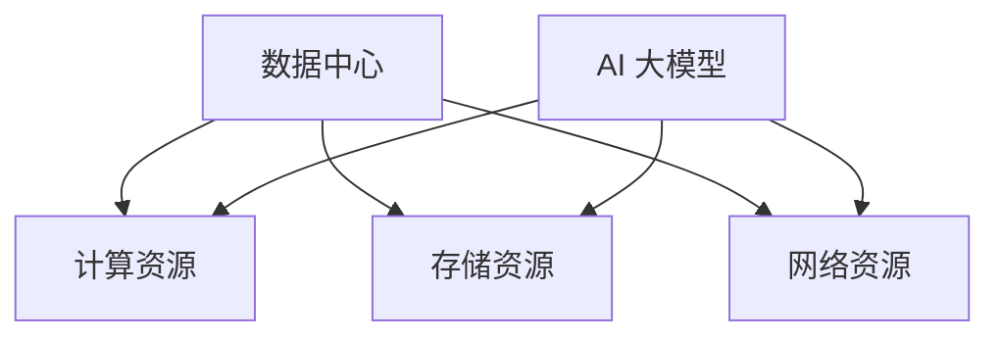
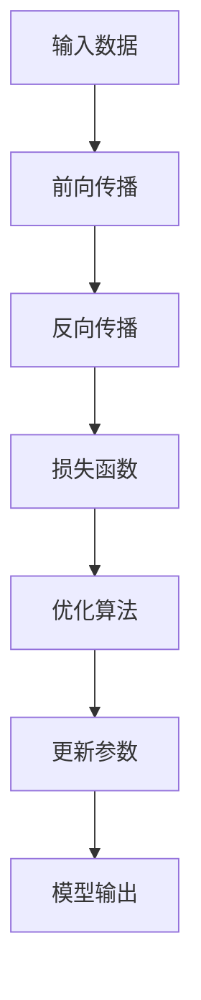
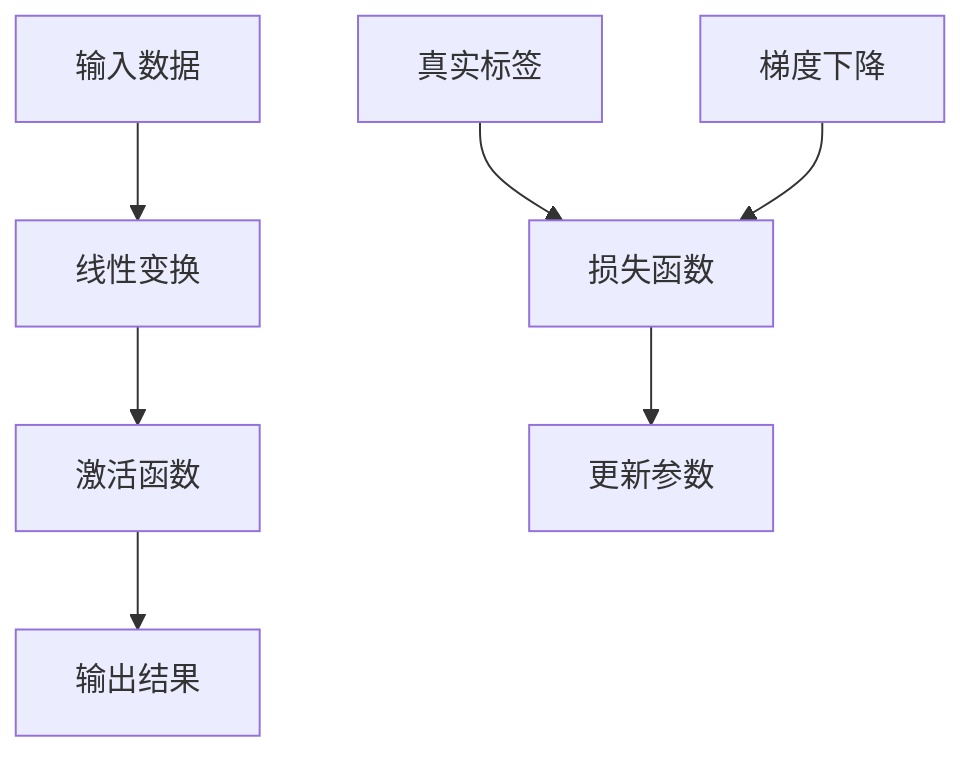
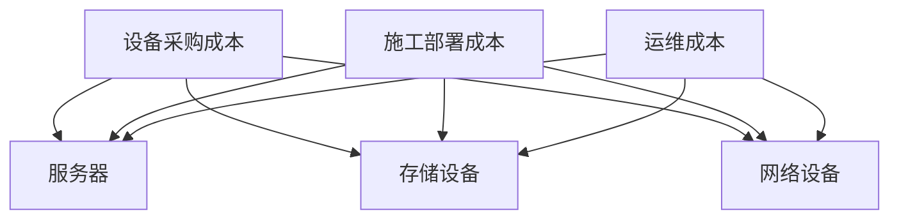

                 

# AI 大模型应用数据中心建设：数据中心投资与建设

> 关键词：AI 大模型、数据中心建设、投资分析、技术应用

> 摘要：本文将探讨 AI 大模型应用数据中心建设的背景、核心概念、核心算法原理、数学模型及实际应用案例，并分析数据中心建设的投资与建设策略，为业界提供有价值的参考。

## 1. 背景介绍

随着人工智能技术的飞速发展，AI 大模型已成为推动各行业变革的重要力量。数据中心作为承载 AI 大模型计算与存储的核心基础设施，其建设对于提升企业竞争力、优化业务流程具有重要意义。

### 1.1 AI 大模型的发展趋势

近年来，AI 大模型技术取得了显著进展。以深度学习为代表的人工智能技术，通过大规模数据处理和模型训练，实现了从语音识别、图像处理到自然语言处理的广泛应用。这些技术进步不仅推动了人工智能行业的快速发展，也为各行业数字化转型提供了强有力的支持。

### 1.2 数据中心的重要性

数据中心作为 AI 大模型应用的基础设施，其建设水平直接关系到 AI 大模型的性能和稳定性。数据中心需要具备高可靠性、高可用性、高性能和安全性等特点，以满足日益增长的 AI 应用需求。

## 2. 核心概念与联系

### 2.1 数据中心架构

数据中心架构包括硬件设施、软件系统、网络架构和数据存储等方面。以下是一个简化的数据中心架构图：



### 2.2 AI 大模型与数据中心的关系

AI 大模型对数据中心的依赖主要体现在计算资源、存储资源和网络资源等方面。数据中心需要为 AI 大模型提供足够的计算和存储能力，以确保模型训练和推理的顺利进行。

### 2.3 核心概念联系

数据中心的建设需要充分考虑 AI 大模型的技术需求，从而实现计算、存储和网络资源的优化配置。以下是一个简化的数据中心与 AI 大模型的关系图：



## 3. 核心算法原理 & 具体操作步骤

### 3.1 AI 大模型算法原理

AI 大模型的核心算法主要包括深度学习、神经网络和生成对抗网络等。以下是一个简化的深度学习算法原理图：



### 3.2 数据中心建设操作步骤

数据中心建设的具体操作步骤包括以下方面：

1. **需求分析**：根据业务需求和 AI 大模型技术要求，确定数据中心的建设目标和规模。
2. **规划设计**：制定数据中心的建设方案，包括硬件设备、网络架构、存储系统和安全防护等方面。
3. **设备采购**：根据规划设计，采购所需的硬件设备，包括服务器、存储设备、网络设备等。
4. **施工部署**：在数据中心场地进行设备安装、调试和部署。
5. **系统集成**：将硬件设备与软件系统进行集成，确保数据中心能够正常运行。
6. **测试验收**：对数据中心进行性能测试和功能验收，确保满足建设要求。

## 4. 数学模型和公式 & 详细讲解 & 举例说明

### 4.1 深度学习数学模型

深度学习中的数学模型主要包括前向传播、反向传播和损失函数等。以下是一个简化的深度学习数学模型图：



### 4.2 数据中心建设成本模型

数据中心建设成本模型主要包括设备采购成本、施工部署成本和运维成本等。以下是一个简化的数据中心建设成本模型：



### 4.3 举例说明

假设一个企业计划建设一个 AI 大模型应用数据中心，根据需求分析，确定以下建设方案：

1. **设备采购成本**：采购 100 台服务器，每台价格 10 万元；50 台存储设备，每台价格 5 万元；10 台网络设备，每台价格 2 万元。
2. **施工部署成本**：设备安装费用为 1000 元/台；施工调试费用为 2000 元/次。
3. **运维成本**：运维人员成本为 100 万元/年；运维设备成本为 50 万元/年。

根据上述方案，数据中心建设成本如下：

- 设备采购成本：100 台服务器 × 10 万元/台 + 50 台存储设备 × 5 万元/台 + 10 台网络设备 × 2 万元/台 = 1050 万元
- 施工部署成本：100 台服务器 × 1000 元/台 + 50 台存储设备 × 1000 元/台 + 10 台网络设备 × 1000 元/台 + 1 次施工调试费用 × 2000 元/次 = 200 万元
- 运维成本：100 万元/年 + 50 万元/年 = 150 万元

总建设成本为 1050 万元 + 200 万元 + 150 万元 = 1400 万元。

## 5. 项目实战：代码实际案例和详细解释说明

### 5.1 开发环境搭建

为了演示 AI 大模型在数据中心的应用，我们选择一个简单的深度学习项目进行实战。以下是一个 Python 环境下的深度学习项目搭建步骤：

1. 安装 Python（建议使用 Python 3.7 或以上版本）。
2. 安装深度学习框架（如 TensorFlow 或 PyTorch）。
3. 安装相关依赖库（如 NumPy、Pandas 等）。

### 5.2 源代码详细实现和代码解读

以下是一个简单的深度学习项目示例，使用 TensorFlow 框架实现一个多层感知机（MLP）模型：

```python
import tensorflow as tf
from tensorflow.keras.models import Sequential
from tensorflow.keras.layers import Dense
from tensorflow.keras.optimizers import Adam

# 定义模型
model = Sequential()
model.add(Dense(64, activation='relu', input_shape=(784,)))
model.add(Dense(64, activation='relu'))
model.add(Dense(10, activation='softmax'))

# 编译模型
model.compile(optimizer=Adam(learning_rate=0.001), loss='categorical_crossentropy', metrics=['accuracy'])

# 加载数据
(x_train, y_train), (x_test, y_test) = tf.keras.datasets.mnist.load_data()
x_train = x_train / 255.0
x_test = x_test / 255.0
y_train = tf.keras.utils.to_categorical(y_train, num_classes=10)
y_test = tf.keras.utils.to_categorical(y_test, num_classes=10)

# 训练模型
model.fit(x_train, y_train, epochs=10, batch_size=128, validation_split=0.2)

# 评估模型
test_loss, test_acc = model.evaluate(x_test, y_test)
print(f'Test accuracy: {test_acc:.4f}')
```

### 5.3 代码解读与分析

1. **定义模型**：使用 Sequential 模型，添加两个隐藏层，每层使用 64 个神经元和 ReLU 激活函数。输出层使用 10 个神经元和 softmax 激活函数。
2. **编译模型**：使用 Adam 优化器和 categorical_crossentropy 损失函数，并设置学习率为 0.001。
3. **加载数据**：使用 TensorFlow 的 mnist 数据集，将图像数据归一化到 [0, 1] 范围，并使用 to_categorical 函数将标签转换为 one-hot 编码。
4. **训练模型**：使用 fit 函数进行模型训练，设置训练轮数（epochs）为 10，批量大小（batch_size）为 128，并将 20% 的数据用作验证集。
5. **评估模型**：使用 evaluate 函数对测试集进行评估，并输出测试准确率。

### 5.4 代码解读与分析

通过上述代码示例，我们可以看到如何使用 TensorFlow 框架搭建一个简单的深度学习模型，并进行训练和评估。在实际应用中，我们可以根据需求修改模型结构、优化训练参数，以提高模型的性能。

## 6. 实际应用场景

数据中心在 AI 大模型应用中具有广泛的应用场景，以下是一些典型的应用案例：

### 6.1 语音识别

语音识别技术依赖于大量的语音数据训练和模型推理。数据中心为语音识别应用提供了强大的计算和存储能力，使得实时语音识别和语音合成成为可能。

### 6.2 图像处理

图像处理领域需要处理大量的图像数据，包括图像分类、目标检测、图像分割等任务。数据中心的建设为图像处理应用提供了高效的数据存储和计算能力，加速了图像处理任务的完成。

### 6.3 自然语言处理

自然语言处理（NLP）领域涉及文本分类、情感分析、机器翻译等任务。数据中心为 NLP 应用提供了强大的计算和存储资源，使得复杂模型训练和推理成为可能。

### 6.4 智能驾驶

智能驾驶技术需要处理大量的传感器数据，包括图像、语音、GPS 等。数据中心为智能驾驶应用提供了高效的数据处理和计算能力，支持自动驾驶车辆的实时决策和路径规划。

## 7. 工具和资源推荐

### 7.1 学习资源推荐

1. **书籍**：
   - 《深度学习》（Goodfellow, Bengio, Courville 著）
   - 《神经网络与深度学习》（邱锡鹏 著）
2. **论文**：
   - 《A Theoretically Grounded Application of Dropout in Recurrent Neural Networks》
   - 《Very Deep Convolutional Networks for Large-Scale Image Recognition》
3. **博客**：
   - [TensorFlow 官方文档](https://www.tensorflow.org/)
   - [PyTorch 官方文档](https://pytorch.org/)
4. **网站**：
   - [Kaggle](https://www.kaggle.com/)
   - [GitHub](https://github.com/)

### 7.2 开发工具框架推荐

1. **深度学习框架**：
   - TensorFlow
   - PyTorch
   - Keras
2. **云计算平台**：
   - AWS
   - Azure
   - Google Cloud Platform
3. **容器化工具**：
   - Docker
   - Kubernetes

### 7.3 相关论文著作推荐

1. **深度学习**：
   - 《Deep Learning》
   - 《Understanding Deep Learning》
   - 《Deep Learning Specialization》
2. **大数据技术**：
   - 《Big Data: A Revolution That Will Transform How We Live, Work, and Think》
   - 《Data Science from Scratch》
   - 《Data Science for Business》

## 8. 总结：未来发展趋势与挑战

随着 AI 大模型的不断发展和数据中心建设的不断推进，数据中心投资与建设将面临以下趋势和挑战：

### 8.1 发展趋势

1. **绿色数据中心**：随着环保意识的提高，绿色数据中心将成为未来发展的重要方向。通过优化能耗、提高能效，降低碳排放，实现可持续发展。
2. **边缘计算**：边缘计算将数据中心的部分计算和存储能力下沉到网络边缘，提高数据处理速度和降低网络延迟，满足实时性需求。
3. **人工智能与数据中心深度融合**：数据中心将更加智能化，通过 AI 技术实现自动化运维、故障预测和优化调度，提高数据中心的运行效率。

### 8.2 挑战

1. **成本控制**：数据中心建设成本较高，如何降低成本、提高投资回报率成为关键挑战。
2. **安全与隐私**：随着数据量的增加，数据中心的安全和隐私保护将成为重要议题。如何确保数据安全、防止数据泄露成为关键问题。
3. **技能人才短缺**：数据中心建设和运维需要大量专业人才，但当前人才供需失衡，如何培养和引进人才成为重要挑战。

## 9. 附录：常见问题与解答

### 9.1 数据中心建设过程中需要考虑哪些因素？

数据中心建设过程中需要考虑以下因素：

1. **需求分析**：根据业务需求确定数据中心的建设目标和规模。
2. **地理位置**：选择合适的数据中心地理位置，考虑气候、交通、政策等因素。
3. **硬件设备**：选择适合的数据中心硬件设备，包括服务器、存储设备、网络设备等。
4. **网络架构**：设计合理的数据中心网络架构，确保数据传输高效、稳定。
5. **安全防护**：制定完善的数据中心安全防护措施，确保数据安全和隐私保护。
6. **运维管理**：制定数据中心运维管理策略，确保数据中心稳定运行。

### 9.2 数据中心建设的成本包括哪些方面？

数据中心建设的成本包括以下几个方面：

1. **设备采购成本**：包括服务器、存储设备、网络设备等硬件设备的采购费用。
2. **施工部署成本**：包括设备安装、调试、部署等费用。
3. **运维成本**：包括数据中心日常运维管理、电力消耗、网络带宽等费用。
4. **维护成本**：包括数据中心设备的维护、升级、更换等费用。
5. **人员成本**：包括数据中心运维人员的人力成本。

### 9.3 数据中心建设的关键技术有哪些？

数据中心建设的关键技术包括：

1. **云计算技术**：实现数据中心的虚拟化、自动化和弹性扩展。
2. **分布式存储技术**：实现海量数据的分布式存储和管理。
3. **网络技术**：实现高效、稳定的数据传输和网络架构。
4. **安全防护技术**：确保数据中心的安全和隐私保护。
5. **智能化运维技术**：实现数据中心的自动化运维和故障预测。

## 10. 扩展阅读 & 参考资料

1. **书籍**：
   - 《数据中心建设与运维实战》
   - 《人工智能数据中心建设与应用》
2. **论文**：
   - 《数据中心能源效率优化研究》
   - 《边缘计算与数据中心协同优化研究》
3. **网站**：
   - [数据中心建设网](http://www.datasciencedatacenter.com/)
   - [人工智能数据中心](http://www.aidatacenter.com/)
4. **开源项目**：
   - [DCOS](https://dcos.io/)
   - [Kubernetes](https://kubernetes.io/)

### 作者

- 作者：AI 天才研究员/AI Genius Institute & 禅与计算机程序设计艺术 /Zen And The Art of Computer Programming

