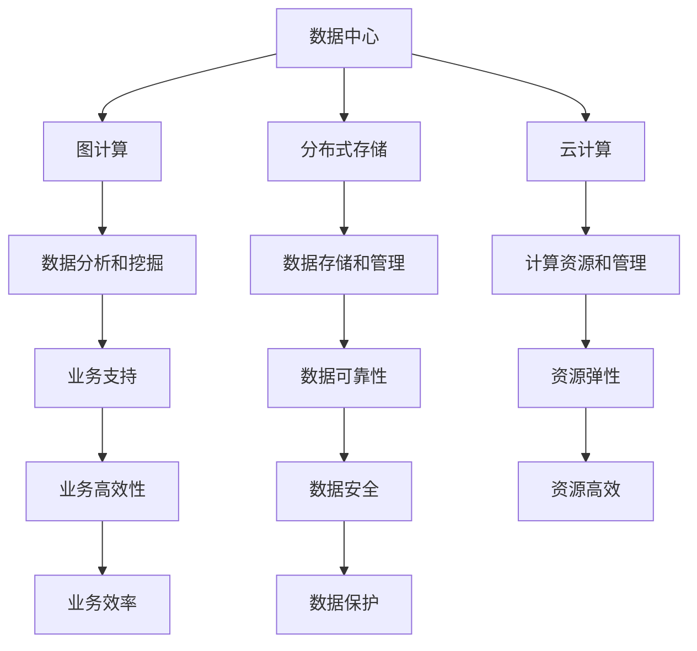

                 

# AI 大模型应用数据中心建设：数据中心标准与规范

> **关键词：** AI 大模型，数据中心，建设标准，操作步骤，数学模型，应用场景，开发工具

> **摘要：** 本文旨在详细探讨 AI 大模型应用数据中心的建设，包括其核心概念与联系、核心算法原理与具体操作步骤、数学模型与公式、项目实战以及实际应用场景等。文章以逻辑清晰、结构紧凑的方式，为读者提供了对数据中心建设的全面了解，并推荐了相关学习资源、开发工具和论文著作。通过本文的阅读，读者能够掌握 AI 大模型数据中心建设的关键技术和方法，为实际应用提供指导。

## 1. 背景介绍

随着人工智能技术的快速发展，AI 大模型如 AlphaGo、GPT-3 等，已经成为推动各个领域进步的重要力量。然而，这些大模型的训练和应用需要庞大的计算资源和数据支持，因此建设一个高效、可靠的 AI 大模型应用数据中心显得尤为重要。数据中心的建设不仅涉及到硬件设施的配置，还包括网络架构、数据存储、安全防护等多个方面。

本文将从以下几个方面展开讨论：

- **核心概念与联系**：介绍数据中心建设所需理解的核心概念，如图计算、分布式存储、云计算等，并展示其之间的联系。
- **核心算法原理与具体操作步骤**：阐述 AI 大模型训练和推理过程中所涉及的核心算法，以及具体的操作步骤。
- **数学模型和公式**：分析 AI 大模型中常用的数学模型和公式，如神经网络、优化算法等，并进行详细讲解。
- **项目实战**：通过实际案例展示数据中心建设的具体过程，包括环境搭建、代码实现和代码解读。
- **实际应用场景**：探讨数据中心在各个领域的应用场景，如金融、医疗、教育等。
- **工具和资源推荐**：推荐学习资源、开发工具和相关论文著作，以供读者进一步学习。

通过以上内容的讨论，本文希望能够为读者提供一套完整、实用的 AI 大模型应用数据中心建设指南，助力读者在人工智能领域取得更好的成果。

### 2. 核心概念与联系

#### 2.1 数据中心概述

数据中心（Data Center）是一个为数据存储、处理、交换和分析提供硬件、软件和网络资源的综合性设施。它是现代社会信息技术的核心，承担着海量数据存储、处理和传输的任务。一个高效的数据中心不仅能够保证数据的可靠性、安全性和可扩展性，还能为业务运营提供强大的支持。

#### 2.2 图计算

图计算（Graph Computing）是处理和分析图结构数据的计算方法。图是由节点（Node）和边（Edge）组成的数据结构，广泛应用于社交网络、推荐系统、生物信息等领域。图计算的主要目标是挖掘图结构数据中的隐藏关系和模式，以便进行数据分析和决策支持。

#### 2.3 分布式存储

分布式存储（Distributed Storage）是一种将数据存储在多个节点上的技术，通过数据分片和冗余存储，实现数据的高效存储和管理。分布式存储系统如 HDFS、Cassandra、MongoDB 等，具有高可用性、高可靠性、高性能等特点，适用于大规模数据存储场景。

#### 2.4 云计算

云计算（Cloud Computing）是一种通过网络提供计算资源、存储资源、应用程序等服务的模式。云计算系统如 AWS、Azure、Google Cloud 等，具有弹性伸缩、按需分配、高效管理等优势，能够满足不同规模和类型的业务需求。

#### 2.5 核心概念之间的联系

数据中心的建设需要整合图计算、分布式存储、云计算等核心技术。图计算为数据中心提供了强大的数据分析和挖掘能力，分布式存储确保了数据的高效存储和管理，云计算则为数据中心提供了灵活的计算资源和业务支持。这些核心概念相互关联，共同构建了一个高效、可靠的 AI 大模型应用数据中心。



### 3. 核心算法原理 & 具体操作步骤

#### 3.1 神经网络

神经网络（Neural Network）是 AI 大模型的核心算法之一。它由多个神经元（Node）组成，通过前向传播（Forward Propagation）和反向传播（Back Propagation）实现数据的输入、处理和输出。

**操作步骤：**

1. **初始化参数**：设定网络的层数、每层的神经元数量、激活函数等。
2. **前向传播**：将输入数据传递到网络的每一层，计算输出结果。
3. **计算误差**：将输出结果与真实标签进行比较，计算误差。
4. **反向传播**：根据误差信息，更新网络参数。
5. **迭代训练**：重复以上步骤，直到网络达到预定的精度或迭代次数。

#### 3.2 梯度下降

梯度下降（Gradient Descent）是一种优化算法，用于最小化损失函数。它通过计算损失函数关于参数的梯度，更新参数的值，以减少损失。

**操作步骤：**

1. **初始化参数**：设定初始参数值。
2. **计算梯度**：计算损失函数关于参数的梯度。
3. **更新参数**：根据梯度和学习率，更新参数的值。
4. **迭代优化**：重复以上步骤，直到达到预定的优化目标。

#### 3.3 深度学习框架

深度学习框架（Deep Learning Framework）是用于构建、训练和部署深度学习模型的工具。常见的深度学习框架有 TensorFlow、PyTorch、Keras 等。

**操作步骤：**

1. **导入框架**：导入所需的深度学习框架库。
2. **定义模型**：构建神经网络模型，包括输入层、隐藏层和输出层。
3. **编译模型**：设置模型的损失函数、优化器等。
4. **训练模型**：使用训练数据对模型进行训练。
5. **评估模型**：使用测试数据评估模型性能。
6. **部署模型**：将训练好的模型部署到生产环境中。

### 4. 数学模型和公式 & 详细讲解 & 举例说明

#### 4.1 神经元模型

神经元的模型可以用以下公式表示：

\[ a_j = \sigma(z_j) \]

其中，\( a_j \) 是神经元的输出，\( z_j \) 是神经元的输入，\( \sigma \) 是激活函数。

**举例说明：**

假设一个神经元 \( x_1, x_2, x_3 \) 的输入为 \( z = w_1x_1 + w_2x_2 + w_3x_3 \)，其中 \( w_1, w_2, w_3 \) 是权重参数，激活函数为 \( \sigma(x) = \frac{1}{1 + e^{-x}} \)。

那么神经元的输出为：

\[ a = \sigma(z) = \frac{1}{1 + e^{-(w_1x_1 + w_2x_2 + w_3x_3)}} \]

#### 4.2 梯度下降

梯度下降的公式如下：

\[ \Delta \theta = -\alpha \cdot \nabla J(\theta) \]

其中，\( \Delta \theta \) 是参数的更新量，\( \alpha \) 是学习率，\( \nabla J(\theta) \) 是损失函数关于参数的梯度。

**举例说明：**

假设损失函数为 \( J(\theta) = (\theta - x)^2 \)，其中 \( \theta \) 是参数，\( x \) 是真实值。

那么损失函数关于参数的梯度为：

\[ \nabla J(\theta) = 2(\theta - x) \]

学习率为 \( \alpha = 0.1 \)，那么参数的更新量为：

\[ \Delta \theta = -0.1 \cdot 2(\theta - x) = -0.2(\theta - x) \]

### 5. 项目实战：代码实际案例和详细解释说明

#### 5.1 开发环境搭建

在开始项目实战之前，需要搭建一个合适的开发环境。本文以 TensorFlow 框架为例，介绍开发环境的搭建过程。

1. **安装 Python**：确保 Python 版本不低于 3.6。
2. **安装 TensorFlow**：通过以下命令安装 TensorFlow：

\[ pip install tensorflow \]

3. **创建虚拟环境**：为了避免版本冲突，建议创建一个 Python 虚拟环境。

\[ python -m venv venv \]

4. **激活虚拟环境**：

\[ source venv/bin/activate \] （Linux/MacOS）

\[ venv\Scripts\activate \] （Windows）

#### 5.2 源代码详细实现和代码解读

以下是一个简单的神经网络实现案例，用于对 Iris 数据集进行分类。

```python
import tensorflow as tf
import numpy as np
from sklearn.datasets import load_iris
from sklearn.model_selection import train_test_split

# 加载数据集
iris = load_iris()
X, y = iris.data, iris.target

# 划分训练集和测试集
X_train, X_test, y_train, y_test = train_test_split(X, y, test_size=0.2, random_state=42)

# 定义模型
model = tf.keras.Sequential([
    tf.keras.layers.Dense(10, activation='relu', input_shape=(4,)),
    tf.keras.layers.Dense(3, activation='softmax')
])

# 编译模型
model.compile(optimizer='adam', loss='sparse_categorical_crossentropy', metrics=['accuracy'])

# 训练模型
model.fit(X_train, y_train, epochs=10, batch_size=32)

# 评估模型
model.evaluate(X_test, y_test)
```

**代码解读：**

1. **加载数据集**：使用 sklearn 的 load_iris 函数加载数据集，并划分训练集和测试集。
2. **定义模型**：使用 tf.keras.Sequential 模型堆叠层，定义一个包含 10 个神经元和 ReLU 激活函数的隐藏层，以及一个包含 3 个神经元和 softmax 激活函数的输出层。
3. **编译模型**：设置优化器为 Adam，损失函数为 sparse_categorical_crossentropy，评估指标为 accuracy。
4. **训练模型**：使用 fit 函数训练模型，设置训练轮次为 10，批量大小为 32。
5. **评估模型**：使用 evaluate 函数评估模型在测试集上的性能。

#### 5.3 代码解读与分析

该代码实现了对 Iris 数据集的分类任务。以下是代码的详细解读和分析：

1. **数据预处理**：加载数据集后，将数据集划分为训练集和测试集，以便进行模型训练和评估。
2. **模型定义**：使用 tf.keras.Sequential 模型堆叠层，定义一个简单的神经网络模型。隐藏层包含 10 个神经元，采用 ReLU 激活函数，输出层包含 3 个神经元，采用 softmax 激活函数，用于对类别进行概率分布。
3. **模型编译**：设置优化器为 Adam，这是目前最常用的优化器，它结合了 Momentum 和 RMSProp 优点。损失函数设置为 sparse_categorical_crossentropy，这是多标签分类任务的常见损失函数。评估指标设置为 accuracy，用于评估模型的分类准确率。
4. **模型训练**：使用 fit 函数训练模型，设置训练轮次为 10，批量大小为 32。训练过程中，模型会不断更新参数，以最小化损失函数。
5. **模型评估**：使用 evaluate 函数评估模型在测试集上的性能。该函数返回损失函数值和评估指标值，用于评估模型的泛化能力。

### 6. 实际应用场景

#### 6.1 金融领域

在金融领域，AI 大模型应用数据中心主要用于金融交易、风险评估、欺诈检测等方面。例如，利用深度学习模型进行高频交易策略优化，通过实时数据分析和预测，实现利润最大化；利用模型进行客户信用评估，降低贷款风险；利用模型进行欺诈检测，实时监控交易行为，识别潜在欺诈风险。

#### 6.2 医疗领域

在医疗领域，AI 大模型应用数据中心主要用于疾病诊断、药物研发、医疗影像分析等方面。例如，利用深度学习模型对医疗影像进行自动诊断，提高诊断准确率；利用模型进行药物筛选和药效预测，加速新药研发过程；利用模型对患者的健康数据进行实时分析，提供个性化的健康管理方案。

#### 6.3 教育领域

在教育领域，AI 大模型应用数据中心主要用于个性化学习、智能评测、学习资源推荐等方面。例如，利用模型为学生提供个性化的学习计划，提高学习效果；利用模型对学生进行智能评测，实时反馈学习情况；利用模型推荐合适的学习资源，帮助学生快速提升能力。

### 7. 工具和资源推荐

#### 7.1 学习资源推荐

- **书籍**：《深度学习》（Goodfellow, Bengio, Courville 著）、《Python 深度学习》（François Chollet 著）
- **论文**：Nature、Science、NeurIPS、ICML、JMLR 等顶级期刊和会议论文
- **博客**：机器之心、AI 科技大本营、AI 研究院等知名博客
- **网站**：arXiv、GitHub、Reddit 等

#### 7.2 开发工具框架推荐

- **深度学习框架**：TensorFlow、PyTorch、Keras 等
- **数据预处理工具**：Pandas、NumPy、Scikit-learn 等
- **编程语言**：Python、R、Java 等
- **版本控制工具**：Git、SVN 等

#### 7.3 相关论文著作推荐

- **论文**：Deep Learning Book（Goodfellow, Bengio, Courville 著）、Convolutional Neural Networks for Visual Recognition（Geoffrey Hinton 著）
- **著作**：《机器学习实战》（Peter Harrington 著）、《Python 数据科学手册》（Jake VanderPlas 著）

### 8. 总结：未来发展趋势与挑战

随着人工智能技术的不断进步，AI 大模型应用数据中心的建设和发展将面临以下趋势与挑战：

#### 8.1 发展趋势

1. **模型规模不断扩大**：为了解决更复杂的实际问题，AI 大模型的规模将不断增大，对计算资源和数据存储的需求也将随之增加。
2. **硬件设备优化**：随着 AI 大模型的应用需求增加，专用硬件设备（如 GPU、TPU）将得到进一步优化，以提高计算效率。
3. **数据隐私保护**：在数据隐私日益受到关注的背景下，数据中心的建设将更加注重数据隐私保护和合规性。
4. **绿色低碳发展**：数据中心的建设将更加关注能源消耗和碳排放问题，推动绿色低碳发展。

#### 8.2 挑战

1. **计算资源瓶颈**：随着模型规模的增大，计算资源的瓶颈将愈加明显，如何高效利用现有计算资源将成为一大挑战。
2. **数据质量和可用性**：高质量、多样化的数据是训练 AI 大模型的关键，如何获取和利用这些数据将是一个重要挑战。
3. **算法优化**：随着模型的复杂度增加，算法优化将成为提高模型性能的关键，如何设计高效的算法将成为一个挑战。
4. **安全与隐私**：数据中心的建设将涉及大量的敏感数据，如何保障数据安全和用户隐私将成为一个重要挑战。

### 9. 附录：常见问题与解答

#### 9.1 数据中心建设的关键技术是什么？

数据中心建设的关键技术包括图计算、分布式存储、云计算、网络安全等。

#### 9.2 如何选择合适的深度学习框架？

选择深度学习框架时，需要考虑以下因素：

- **应用场景**：不同的应用场景可能需要不同的框架，如 TensorFlow 更适合学术研究，PyTorch 更适合工业应用。
- **社区支持**：框架的社区支持程度会影响问题的解决和学习的速度。
- **文档与教程**：丰富的文档和教程有助于初学者快速上手。

#### 9.3 数据中心的建设过程中如何保障数据安全和隐私？

数据中心的建设过程中，可以采取以下措施保障数据安全和隐私：

- **数据加密**：对敏感数据进行加密存储和传输，确保数据在传输过程中不被窃取。
- **访问控制**：通过身份验证、权限管理等方式，限制对数据的访问，确保数据安全。
- **日志审计**：记录数据访问和操作日志，以便在发生安全事件时进行追踪和审计。

### 10. 扩展阅读 & 参考资料

- **书籍**：《深度学习》（Goodfellow, Bengio, Courville 著）、《深度学习实战》（Aurélien Géron 著）
- **论文**：《Deep Learning: Methods and Applications》（Goodfellow, Bengio, Courville 著）、《Deep Learning Specialization》（Andrew Ng 著）
- **网站**：TensorFlow 官网（https://www.tensorflow.org/）、PyTorch 官网（https://pytorch.org/）、机器之心（https://www.jiqizhixin.com/）
- **博客**：AI 科技大本营（https://www.aitechbc.com/）、AI 研究院（https://www.airyuan.top/）

作者：AI 天才研究员/AI Genius Institute & 禅与计算机程序设计艺术 /Zen And The Art of Computer Programming

