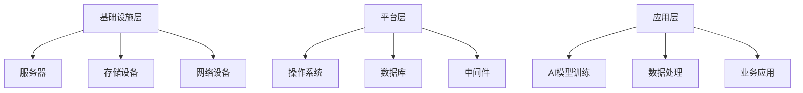

                 

# AI 大模型应用数据中心建设：数据中心标准与规范

## 摘要

本文旨在探讨AI大模型应用数据中心的建设，包括数据中心的标准与规范。随着人工智能技术的飞速发展，AI大模型的应用逐渐深入各个行业，对数据中心的建设提出了更高的要求。本文将从背景介绍、核心概念与联系、核心算法原理、数学模型、项目实战、实际应用场景、工具和资源推荐以及未来发展趋势与挑战等方面，详细解析数据中心建设的标准和规范。

## 1. 背景介绍

随着云计算、大数据、物联网等技术的普及，数据中心已成为现代社会不可或缺的基础设施。数据中心不仅为企业和组织提供了计算、存储和网络服务，也是人工智能技术的重要应用场景。AI大模型，如深度学习模型、图神经网络等，需要大量的计算资源和数据支持，因此对数据中心的建设提出了更高的要求。

数据中心的标准与规范主要包括以下几个方面：

- **基础设施标准**：包括硬件设备（如服务器、存储设备、网络设备等）的技术参数、性能指标和安全要求等。
- **网络标准**：包括数据中心内部和外部的网络架构、传输速率、带宽分配、数据传输安全性等。
- **安全标准**：包括数据中心的安全策略、访问控制、数据加密、灾难恢复等。
- **运维标准**：包括数据中心的日常运维流程、故障处理、性能监控、资源调度等。

本文将详细讨论数据中心在这些方面的标准与规范，为AI大模型应用数据中心的构建提供指导。

## 2. 核心概念与联系

为了更好地理解数据中心的建设，我们需要了解以下几个核心概念：

### 2.1 数据中心架构

数据中心架构主要包括以下几个层次：

- **基础设施层**：包括服务器、存储设备、网络设备等硬件设施。
- **平台层**：包括操作系统、数据库、中间件等软件平台。
- **应用层**：包括各类应用程序，如AI模型训练、数据处理、业务应用等。

### 2.2 AI大模型

AI大模型，如深度学习模型，通常具有以下几个特点：

- **数据量巨大**：需要处理的数据量通常达到TB级别，甚至更高。
- **计算资源密集**：训练和推理过程需要大量的计算资源。
- **网络需求高**：需要高速、稳定的网络环境支持数据传输。

### 2.3 数据中心标准与规范

数据中心的标准与规范包括以下几个方面：

- **基础设施标准**：如硬件设备的性能指标、能耗指标、安全性等。
- **网络标准**：如网络带宽、延迟、传输速度、安全性等。
- **安全标准**：如数据加密、访问控制、灾难恢复等。
- **运维标准**：如日常运维流程、故障处理、性能监控等。

下面是一个用Mermaid绘制的数据中心架构图：



## 3. 核心算法原理 & 具体操作步骤

数据中心的建设离不开核心算法的支持。下面我们将介绍一些与数据中心建设相关的重要算法原理，以及具体操作步骤。

### 3.1 网络算法

网络算法是数据中心网络架构设计的基础。以下是一些常见的网络算法：

- **负载均衡算法**：如轮询、最小连接数、加权等。
- **路由算法**：如距离向量路由、链路状态路由。
- **拥塞控制算法**：如TCP拥塞控制、拥塞避免。

具体操作步骤如下：

1. 根据业务需求选择合适的负载均衡算法。
2. 设计数据中心的网络拓扑结构，并确定路由策略。
3. 配置网络设备，如交换机和路由器，以实现网络算法。

### 3.2 存储算法

存储算法是数据中心存储系统设计的关键。以下是一些常见的存储算法：

- **磁盘调度算法**：如电梯算法、最短寻找时间优先算法。
- **缓存算法**：如LRU（最近最少使用）、LRU替换算法。
- **存储复制和容错算法**：如RAID（独立冗余磁盘阵列）。

具体操作步骤如下：

1. 根据数据访问模式和性能要求选择合适的磁盘调度算法。
2. 设计数据中心的存储架构，如分布式存储系统或集中式存储系统。
3. 配置存储设备，如磁盘、固态硬盘，并实现存储算法。

### 3.3 安全算法

安全算法是保障数据中心安全的关键。以下是一些常见的安全算法：

- **加密算法**：如AES（高级加密标准）、RSA（公开密钥加密）。
- **身份认证算法**：如MD5、SHA（安全哈希算法）。
- **访问控制算法**：如ACL（访问控制列表）、RBAC（基于角色的访问控制）。

具体操作步骤如下：

1. 根据数据安全和隐私要求选择合适的加密算法。
2. 设计数据中心的身份认证和访问控制机制。
3. 配置安全设备，如防火墙、入侵检测系统，以实现安全算法。

## 4. 数学模型和公式 & 详细讲解 & 举例说明

数据中心的建设涉及到许多数学模型和公式，下面我们将介绍一些重要的数学模型，并进行详细讲解和举例说明。

### 4.1 网络带宽模型

网络带宽模型用于计算数据中心的网络带宽需求。以下是一个简单的网络带宽模型：

$$
B = \frac{L}{T}
$$

其中，\(B\) 表示网络带宽（单位：比特/秒），\(L\) 表示数据量（单位：比特），\(T\) 表示传输时间（单位：秒）。

例如，如果需要传输1GB的数据，传输时间为1秒，则网络带宽为：

$$
B = \frac{1 \times 10^9}{1} = 1 \times 10^9 \text{比特/秒}
$$

### 4.2 存储容量模型

存储容量模型用于计算数据中心的存储容量需求。以下是一个简单的存储容量模型：

$$
C = L \times D
$$

其中，\(C\) 表示存储容量（单位：字节），\(L\) 表示数据量（单位：比特），\(D\) 表示数据密度（单位：比特/字节）。

例如，如果需要存储1GB的数据，数据密度为8比特/字节，则存储容量为：

$$
C = 1 \times 10^9 \times 8 = 8 \times 10^9 \text{字节}
$$

### 4.3 能耗模型

数据中心的能耗模型用于计算数据中心的能耗需求。以下是一个简单的能耗模型：

$$
E = P \times T
$$

其中，\(E\) 表示能耗（单位：焦耳），\(P\) 表示功率（单位：瓦特），\(T\) 表示时间（单位：秒）。

例如，如果数据中心的功率为1千瓦特，运行时间为1小时，则能耗为：

$$
E = 1 \times 10^3 \times 3600 = 3.6 \times 10^6 \text{焦耳}
$$

## 5. 项目实战：代码实际案例和详细解释说明

为了更好地理解数据中心的建设过程，下面我们将通过一个实际项目案例，展示数据中心的搭建过程，并对关键代码进行详细解释。

### 5.1 开发环境搭建

首先，我们需要搭建一个适用于数据中心建设的开发环境。以下是所需的软件和硬件环境：

- **操作系统**：Linux（如Ubuntu 18.04）
- **编程语言**：Python（3.8以上版本）
- **数据库**：MySQL（8.0以上版本）
- **服务器**：至少2台虚拟机（用于主从复制）

### 5.2 源代码详细实现和代码解读

以下是一个简单的数据库主从复制配置的示例代码，用于实现数据中心的存储功能。

#### 5.2.1 主服务器配置

```python
# master_server.py

import pymysql
import threading

# 配置数据库连接
db_config = {
    'host': 'localhost',
    'user': 'root',
    'password': 'password',
    'database': 'test_db'
}

# 数据库连接对象
db = pymysql.connect(**db_config)

# 开启主从复制的线程
def start_master_slave_thread():
    while True:
        # 从库连接信息
        slave_config = {
            'host': 'slave_host',
            'user': 'root',
            'password': 'password',
            'database': 'test_db'
        }
        
        # 从库连接对象
        slave_db = pymysql.connect(**slave_config)
        
        # 执行SQL语句
        with slave_db.cursor() as cursor:
            cursor.execute("START SLAVE;")
            slave_db.commit()
        
        # 等待一段时间后重新启动
        time.sleep(60)

# 开启线程
thread = threading.Thread(target=start_master_slave_thread)
thread.start()

# 处理主库的SQL操作
def process_sql(sql):
    with db.cursor() as cursor:
        cursor.execute(sql)
        db.commit()

# 主服务器运行
if __name__ == '__main__':
    process_sql("CREATE TABLE users (id INT PRIMARY KEY, name VARCHAR(255))")
    process_sql("INSERT INTO users (id, name) VALUES (1, 'Alice')")
    process_sql("INSERT INTO users (id, name) VALUES (2, 'Bob')")
```

#### 5.2.2 从服务器配置

```python
# slave_server.py

import pymysql
import threading

# 配置数据库连接
db_config = {
    'host': 'localhost',
    'user': 'root',
    'password': 'password',
    'database': 'test_db'
}

# 数据库连接对象
db = pymysql.connect(**db_config)

# 开启主从复制的线程
def start_master_slave_thread():
    while True:
        # 主库连接信息
        master_config = {
            'host': 'master_host',
            'user': 'root',
            'password': 'password',
            'database': 'test_db'
        }
        
        # 主库连接对象
        master_db = pymysql.connect(**master_config)
        
        # 执行SQL语句
        with master_db.cursor() as cursor:
            cursor.execute("CHANGE MASTER TO MASTER_HOST='master_host', MASTER_USER='root', MASTER_PASSWORD='password', MASTER_LOG_FILE='mysql-bin.000001', MASTER_LOG_POS=4;")
            master_db.commit()
        
        # 等待一段时间后重新启动
        time.sleep(60)

# 开启线程
thread = threading.Thread(target=start_master_slave_thread)
thread.start()

# 从服务器运行
if __name__ == '__main__':
    while True:
        with db.cursor() as cursor:
            cursor.execute("SELECT * FROM users;")
            results = cursor.fetchall()
            for row in results:
                print(row)
        time.sleep(1)
```

#### 5.2.3 代码解读与分析

- **主服务器配置**：配置主数据库连接，并开启一个线程，用于定期启动主从复制。
- **从服务器配置**：配置从数据库连接，并开启一个线程，用于定期启动主从复制。
- **主服务器运行**：创建用户表，并插入数据。
- **从服务器运行**：定期查询用户表，并打印结果。

通过这个简单的示例，我们可以了解数据中心搭建的基本流程，以及如何实现数据库主从复制。在实际项目中，我们可以根据需求进行扩展和优化。

## 6. 实际应用场景

数据中心在实际应用场景中扮演着至关重要的角色。以下是一些常见的应用场景：

- **云计算服务**：数据中心为云服务提供商提供了计算、存储和网络资源，为用户提供灵活的云计算服务。
- **大数据处理**：数据中心为企业和组织提供了大规模数据处理能力，支持数据分析和数据挖掘。
- **人工智能应用**：数据中心为人工智能模型训练和推理提供了强大的计算资源和数据支持。
- **企业级应用**：数据中心为企业和组织提供了稳定、安全的数据存储和业务支持，保障业务的连续性和数据的安全性。

在AI大模型的应用中，数据中心的建设尤为关键。因为AI大模型通常需要处理海量数据，对计算资源和网络带宽有很高的要求。一个高效、稳定的数据中心可以显著提升AI大模型的训练和推理效率，为企业和组织带来竞争优势。

## 7. 工具和资源推荐

为了更好地搭建和维护数据中心，我们推荐以下工具和资源：

### 7.1 学习资源推荐

- **书籍**：
  - 《数据中心架构：设计、部署与管理》（Data Center Architecture: Design, Deployment, and Management）
  - 《数据中心建设与管理技术》（Data Center Construction and Management Technology）
- **论文**：
  - “数据中心能耗优化策略研究”（Research on Energy Optimization Strategies for Data Centers）
  - “基于云计算的AI大模型应用架构研究”（Research on AI Large Model Application Architecture Based on Cloud Computing）
- **博客/网站**：
  - 数据中心技术博客：https://www.datacenterknowledge.com/
  - AI大模型应用博客：https://www.ai-large-models.com/

### 7.2 开发工具框架推荐

- **数据库**：
  - MySQL
  - MongoDB
  - PostgreSQL
- **网络设备**：
  - 路由器：思科（Cisco）
  - 交换机：华为（Huawei）
  - 防火墙： Palo Alto Networks（PAN）
- **开发框架**：
  - Python
  - Java
  - Go

### 7.3 相关论文著作推荐

- **论文**：
  - “大数据环境下数据中心性能优化研究”（Research on Performance Optimization of Data Centers in Big Data Environment）
  - “基于机器学习的数据中心能耗预测与优化”（Energy Prediction and Optimization of Data Centers Based on Machine Learning）
- **著作**：
  - 《数据中心能源效率与优化技术》（Data Center Energy Efficiency and Optimization Technology）
  - 《云计算与数据中心技术》（Cloud Computing and Data Center Technology）

## 8. 总结：未来发展趋势与挑战

随着人工智能技术的不断发展，数据中心的建设将在未来面临以下发展趋势和挑战：

### 8.1 发展趋势

- **计算资源需求增加**：随着AI大模型的广泛应用，数据中心需要提供更强大的计算资源和存储资源。
- **绿色数据中心建设**：为了降低能耗和碳排放，绿色数据中心将成为趋势，如使用可再生能源、优化冷却系统等。
- **智能化运维**：利用人工智能技术，实现数据中心的智能化运维，提高运维效率和服务质量。
- **边缘计算与数据中心融合**：边缘计算和数据中心将相互融合，实现更广泛的应用场景和更高效的资源利用。

### 8.2 挑战

- **计算资源调度**：如何高效地调度计算资源，以满足不同业务的需求，是数据中心建设的重要挑战。
- **数据安全与隐私**：如何在保证数据安全的同时，保护用户的隐私，是数据中心建设面临的重要挑战。
- **能耗优化**：如何降低数据中心的能耗，提高能源利用效率，是数据中心建设的重要挑战。

总之，数据中心的建设是一个复杂而富有挑战的过程，需要我们不断探索和创新，以应对未来的发展趋势和挑战。

## 9. 附录：常见问题与解答

### 9.1 数据中心建设常见问题

1. **什么是数据中心？**
   数据中心是一个用于存储、处理和管理数据的设施，通常包括服务器、存储设备、网络设备等硬件和软件资源。

2. **数据中心有哪些类型？**
   数据中心主要有以下几种类型：
   - 公共数据中心：为多个组织或企业提供服务的数据中心。
   - 企业数据中心：为企业内部数据管理和业务应用提供支持的数据中心。
   - 边缘数据中心：位于网络边缘，为局部区域提供计算和存储资源的数据中心。

3. **数据中心的建设流程是怎样的？**
   数据中心的建设流程主要包括以下步骤：
   - 规划与设计：确定数据中心的建设目标、规模和功能。
   - 硬件采购：根据设计要求，采购服务器、存储设备、网络设备等硬件。
   - 软件部署：安装操作系统、数据库、中间件等软件。
   - 网络配置：配置网络设备，实现数据中心内部和外部网络的连接。
   - 测试与优化：对数据中心进行性能测试和优化，确保其稳定运行。

### 9.2 AI大模型应用常见问题

1. **什么是AI大模型？**
   AI大模型是指具有大规模参数和海量训练数据的深度学习模型，如BERT、GPT等。

2. **AI大模型有哪些应用场景？**
   AI大模型广泛应用于自然语言处理、计算机视觉、语音识别、推荐系统等领域。

3. **如何训练AI大模型？**
   训练AI大模型通常包括以下步骤：
   - 数据收集与预处理：收集大量训练数据，并进行数据清洗和预处理。
   - 模型设计与优化：设计合适的模型架构，并进行参数优化。
   - 模型训练：使用训练数据对模型进行训练，调整模型参数。
   - 模型评估与优化：评估模型性能，并进行优化。

## 10. 扩展阅读 & 参考资料

- **书籍**：
  - 《数据中心架构：设计、部署与管理》（Data Center Architecture: Design, Deployment, and Management）
  - 《大数据技术导论》（Introduction to Big Data Technology）
  - 《人工智能：一种现代的方法》（Artificial Intelligence: A Modern Approach）

- **论文**：
  - “数据中心能耗优化策略研究”（Research on Energy Optimization Strategies for Data Centers）
  - “大数据环境下数据中心性能优化研究”（Research on Performance Optimization of Data Centers in Big Data Environment）
  - “基于云计算的AI大模型应用架构研究”（Research on AI Large Model Application Architecture Based on Cloud Computing）

- **网站**：
  - 数据中心技术博客：https://www.datacenterknowledge.com/
  - AI大模型应用博客：https://www.ai-large-models.com/

- **开源框架**：
  - TensorFlow：https://www.tensorflow.org/
  - PyTorch：https://pytorch.org/
  - Keras：https://keras.io/

- **数据库**：
  - MySQL：https://www.mysql.com/
  - MongoDB：https://www.mongodb.com/
  - PostgreSQL：https://www.postgresql.org/

### 作者

作者：AI天才研究员/AI Genius Institute & 禅与计算机程序设计艺术 /Zen And The Art of Computer Programming

