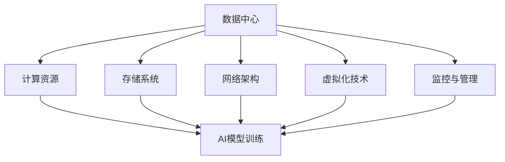

                 

# AI 大模型应用数据中心建设：数据中心运维与管理

## 摘要

本文深入探讨了AI大模型应用数据中心的建设、运维与管理。首先，介绍了数据中心的基本概念及其在AI大模型应用中的重要性。随后，详细讲解了数据中心的核心架构和关键组件，如计算资源管理、数据存储和管理、网络架构等。接着，文章重点分析了数据中心运维的关键技术和最佳实践，包括故障处理、性能优化、安全策略等。最后，讨论了未来数据中心的发展趋势与挑战，并提出了相应的解决方案。本文旨在为数据中心的建设和运维提供系统性的指导，帮助读者更好地理解和应对AI大模型在数据中心的应用。

### 背景介绍

#### 数据中心的重要性

数据中心（Data Center）是当今信息技术领域不可或缺的核心设施。它不仅为企业提供了可靠的数据存储和处理能力，而且在人工智能（AI）大模型应用中扮演了至关重要的角色。随着大数据和云计算技术的迅猛发展，数据中心的规模和复杂度也在不断提升。对于企业而言，数据中心是支撑其业务运营的基石，而AI大模型的应用则进一步增加了数据中心的压力和挑战。

数据中心的重要性主要体现在以下几个方面：

1. **数据存储与管理**：数据中心提供了大规模的数据存储能力，确保数据的安全性和可靠性。这对于AI大模型训练和处理海量的数据至关重要。
   
2. **计算资源调度**：数据中心通过虚拟化和容器化技术，实现了计算资源的动态调度和高效利用，为AI大模型的训练提供了强大的计算支持。

3. **网络连接**：数据中心内部及与外部网络的可靠连接，确保了AI大模型在不同数据源和设备之间的高速数据传输和协同工作。

4. **安全防护**：数据中心通过多层次的安全策略和监控措施，保障了AI大模型应用的安全性和隐私性，防止数据泄露和恶意攻击。

#### AI大模型在数据中心的应用

AI大模型，如深度学习模型、自然语言处理模型等，需要大规模的数据集和强大的计算资源来进行训练和推理。数据中心为AI大模型的应用提供了理想的运行环境，具有以下优势：

1. **大规模计算资源**：数据中心通常拥有成千上万的计算节点，可以满足AI大模型对计算资源的高需求。

2. **分布式存储**：数据中心的分布式存储系统，如Hadoop、Cassandra等，可以高效地管理海量的数据，支持AI大模型的训练和推理。

3. **网络带宽**：数据中心内部和外部的高带宽网络，确保了AI大模型在不同数据源和设备之间的高速数据传输。

4. **可靠性保障**：数据中心通过冗余设计和故障转移机制，确保了AI大模型的稳定运行和服务的持续性。

总之，数据中心在AI大模型应用中具有不可替代的地位。随着AI技术的不断发展，数据中心的建设和运维将面临更大的挑战和机遇。

### 核心概念与联系

#### 数据中心架构

数据中心的架构是构建高效、可靠和可扩展的数据处理环境的关键。数据中心通常包括以下几个核心组成部分：

1. **计算资源**：计算资源是数据中心的“心脏”，包括服务器、存储设备和网络设备等。它们提供了数据存储、处理和传输的基础设施。

2. **存储系统**：存储系统负责数据的持久化存储和管理。根据存储需求，数据中心可以选择分布式存储系统、文件存储系统或对象存储系统。

3. **网络架构**：网络架构是数据中心的“神经系统”，负责内部节点之间的数据传输和外部网络的连接。常见的网络架构包括分层架构、平面架构和混合架构。

4. **虚拟化技术**：虚拟化技术通过虚拟化层将物理资源抽象为虚拟资源，提高了资源的利用率和灵活性。常见的虚拟化技术包括虚拟机（VM）和容器（Container）。

5. **监控与管理**：监控与管理系统负责对数据中心进行实时监控、性能优化和故障处理。常见的监控工具包括Nagios、Zabbix等。

#### 数据中心与AI大模型的关系

数据中心与AI大模型之间的关系可以看作是“硬件支撑”与“软件应用”的关系。具体来说：

1. **计算资源**：AI大模型训练和推理需要大量的计算资源，数据中心提供了这些资源，确保模型能够高效地运行。

2. **存储系统**：AI大模型需要处理和存储大量的数据，数据中心提供的存储系统能够满足这些需求，确保数据的持久化和可靠性。

3. **网络架构**：AI大模型在不同数据源和设备之间传输数据，数据中心提供的网络架构能够保证高速、稳定的数据传输。

4. **虚拟化技术**：虚拟化技术使得计算资源和存储资源可以动态调整，满足AI大模型不同阶段的资源需求。

5. **监控与管理**：数据中心提供的监控与管理系统能够实时监控AI大模型的运行状态，进行性能优化和故障处理。

#### Mermaid 流程图

以下是一个简化的数据中心架构与AI大模型关系的 Mermaid 流程图：



在这个流程图中，数据中心的各个组成部分与AI大模型通过箭头相连，表示它们之间的依赖关系。通过这个流程图，我们可以更直观地理解数据中心在AI大模型应用中的关键作用。

### 核心算法原理 & 具体操作步骤

#### AI大模型训练算法原理

AI大模型训练的核心算法主要包括深度学习算法、神经网络算法和强化学习算法。下面我们以深度学习算法为例，详细讲解其原理和具体操作步骤。

##### 1. 深度学习算法原理

深度学习算法是基于多层神经网络的一种机器学习算法。它的核心思想是通过多层次的非线性变换，将输入数据转化为输出数据。深度学习算法的主要组成部分包括：

1. **输入层**：接收外部输入数据，如图像、文本等。
2. **隐藏层**：通过对输入数据进行特征提取和变换，逐步提取数据的深层特征。
3. **输出层**：将隐藏层提取的特征映射到具体的输出结果，如分类标签、预测值等。

深度学习算法的核心原理是梯度下降（Gradient Descent），它通过不断调整网络权重，使得输出结果与真实标签的误差最小。具体来说，梯度下降算法包括以下几个步骤：

1. **初始化权重**：随机初始化网络权重。
2. **前向传播**：将输入数据通过网络进行前向传播，得到输出结果。
3. **计算损失**：计算输出结果与真实标签之间的损失值。
4. **反向传播**：根据损失值，计算每个权重的梯度。
5. **权重更新**：根据梯度，更新网络权重。
6. **迭代优化**：重复步骤2-5，直到满足停止条件（如损失值小于某个阈值或达到最大迭代次数）。

##### 2. 深度学习算法具体操作步骤

以下是深度学习算法的具体操作步骤：

1. **数据预处理**：对输入数据进行预处理，如归一化、去噪、填充等，以确保数据质量。
2. **划分训练集和测试集**：将数据集划分为训练集和测试集，用于训练和评估模型性能。
3. **构建神经网络模型**：根据问题需求，设计并构建神经网络模型，包括输入层、隐藏层和输出层。
4. **初始化权重**：随机初始化网络权重。
5. **前向传播**：
    - 将训练集中的每个样本输入到神经网络中。
    - 通过网络的每个层，计算输出结果。
6. **计算损失**：
    - 计算输出结果与真实标签之间的损失值（如均方误差、交叉熵等）。
7. **反向传播**：
    - 根据损失值，计算每个权重的梯度。
    - 利用梯度下降算法，更新网络权重。
8. **迭代优化**：
    - 重复步骤5-7，直到满足停止条件。
9. **评估模型性能**：使用测试集评估模型的性能，计算准确率、召回率、F1值等指标。

通过上述步骤，深度学习算法能够逐步优化网络权重，使得输出结果逐渐接近真实标签，从而实现模型的训练。

#### AI大模型推理算法原理

AI大模型推理算法是将训练好的模型应用于实际数据，进行预测或分类的过程。推理算法主要包括以下步骤：

1. **输入预处理**：对输入数据进行预处理，如归一化、去噪、填充等，确保输入数据格式符合模型要求。
2. **前向传播**：将预处理后的输入数据通过训练好的神经网络模型进行前向传播，得到输出结果。
3. **结果解析**：对输出结果进行解析，如分类结果、预测值等，根据具体应用场景进行后续处理。

推理算法的主要目标是快速、准确地获取输出结果，通常要求在低延迟和高并发的情况下运行。为了实现这一目标，可以采用以下策略：

1. **模型压缩**：通过模型压缩技术，如剪枝、量化等，减小模型大小和计算复杂度，提高推理速度。
2. **硬件加速**：利用GPU、FPGA等硬件加速器，提高模型的推理速度和性能。
3. **分布式推理**：通过分布式架构，将推理任务分配到多个节点，实现并行推理，提高推理效率。

通过上述策略，AI大模型推理算法能够在满足性能要求的同时，实现快速、准确的预测和分类。

### 数学模型和公式 & 详细讲解 & 举例说明

#### 梯度下降算法

梯度下降算法是深度学习训练过程中最核心的优化方法。其基本思想是通过不断调整网络权重，使得损失函数的值逐渐减小，从而达到最优解。以下是梯度下降算法的数学模型和详细讲解。

##### 1. 梯度下降算法原理

梯度下降算法的核心公式为：

$$
w_{new} = w_{old} - \alpha \cdot \nabla_{w} J(w)
$$

其中：
- $w_{old}$ 表示当前权重。
- $w_{new}$ 表示更新后的权重。
- $\alpha$ 表示学习率（Learning Rate），用于控制每次权重更新的步长。
- $\nabla_{w} J(w)$ 表示权重 $w$ 对损失函数 $J(w)$ 的梯度。

梯度的含义是损失函数在当前权重下的斜率，即损失函数在该点处的最小上升方向。通过计算梯度，我们可以找到权重更新的方向。

##### 2. 梯度下降算法详细讲解

梯度下降算法的具体步骤如下：

1. **初始化权重**：随机初始化网络权重 $w_0$。
2. **计算损失函数**：将训练数据输入神经网络，计算损失函数 $J(w)$ 的值。
3. **计算梯度**：计算损失函数对权重 $w$ 的梯度 $\nabla_{w} J(w)$。
4. **更新权重**：利用梯度下降公式，更新权重 $w$：

$$
w = w - \alpha \cdot \nabla_{w} J(w)
$$

5. **重复步骤2-4**：重复计算损失函数、计算梯度、更新权重的过程，直到满足停止条件（如损失函数值收敛或达到最大迭代次数）。

##### 3. 梯度下降算法举例说明

假设一个简单的线性模型，其损失函数为均方误差（MSE），即：

$$
J(w) = \frac{1}{2} \sum_{i=1}^{n} (y_i - w \cdot x_i)^2
$$

其中 $y_i$ 表示第 $i$ 个样本的真实标签，$x_i$ 表示第 $i$ 个样本的特征，$w$ 表示权重。

现在我们要使用梯度下降算法训练这个线性模型。假设初始权重为 $w_0 = 0$，学习率 $\alpha = 0.1$。以下是梯度下降算法的迭代过程：

1. **初始化权重**：$w_0 = 0$。
2. **计算损失函数**：将训练数据输入模型，计算损失函数的值。
3. **计算梯度**：计算损失函数对权重 $w$ 的梯度：
   
$$
\nabla_{w} J(w) = \frac{d}{dw} \left( \frac{1}{2} \sum_{i=1}^{n} (y_i - w \cdot x_i)^2 \right) = \sum_{i=1}^{n} (y_i - w \cdot x_i) \cdot x_i
$$

4. **更新权重**：根据梯度下降公式，更新权重：

$$
w_1 = w_0 - \alpha \cdot \nabla_{w} J(w_0) = 0 - 0.1 \cdot \sum_{i=1}^{n} (y_i - w_0 \cdot x_i) \cdot x_i
$$

5. **重复步骤2-4**：重复计算损失函数、计算梯度、更新权重的过程。

通过多次迭代，线性模型的权重将逐渐优化，使得损失函数的值逐渐减小。最终，模型将达到收敛状态，输出结果将趋于稳定。

#### 梯度消失和梯度爆炸

在深度学习训练过程中，梯度消失和梯度爆炸是两个常见问题。这两个问题会影响模型的训练效果和收敛速度。

1. **梯度消失**：当损失函数在某个局部极小值点时，梯度变得非常小，导致模型难以继续优化。这通常发生在深层神经网络中，因为随着层数的增加，梯度会逐层衰减。
2. **梯度爆炸**：当损失函数在某个局部极大值点时，梯度变得非常大，可能导致模型无法收敛。这通常发生在训练数据分布不均匀的情况下，某些样本的梯度非常大，而其他样本的梯度很小。

为了解决这些问题，可以采用以下策略：

1. **梯度裁剪**：当梯度超出一定阈值时，将其缩放到一个较小的范围，避免梯度爆炸和梯度消失。
2. **学习率调整**：根据训练过程中的损失函数变化，动态调整学习率，避免学习率过大导致梯度爆炸，或学习率过小导致梯度消失。
3. **使用正则化**：通过正则化方法，如L1正则化、L2正则化，惩罚过拟合的权重，降低梯度消失和梯度爆炸的风险。

通过上述策略，可以有效缓解深度学习训练过程中的梯度消失和梯度爆炸问题，提高模型的训练效果和收敛速度。

### 项目实战：代码实际案例和详细解释说明

#### 1. 开发环境搭建

在本文的实战部分，我们将使用Python语言实现一个简单的AI大模型训练和推理项目。以下是如何搭建开发环境：

1. **安装Python**：确保你的系统中已安装Python 3.7或更高版本。可以从[Python官网](https://www.python.org/)下载并安装。
2. **安装依赖库**：安装必要的依赖库，如TensorFlow、NumPy、Pandas等。可以使用pip命令进行安装：

   ```bash
   pip install tensorflow numpy pandas
   ```

3. **配置Jupyter Notebook**：为了方便代码编写和调试，我们可以配置Jupyter Notebook。首先安装Jupyter Notebook：

   ```bash
   pip install notebook
   ```

   然后启动Jupyter Notebook：

   ```bash
   jupyter notebook
   ```

   在浏览器中打开Jupyter Notebook，就可以开始编写代码了。

#### 2. 源代码详细实现和代码解读

以下是一个简单的AI大模型训练和推理的代码示例，用于分类任务。我们将使用TensorFlow框架实现。

```python
import tensorflow as tf
import numpy as np
import pandas as pd

# 数据预处理
def preprocess_data():
    # 读取数据
    data = pd.read_csv('data.csv')
    # 分割特征和标签
    X = data.iloc[:, :-1].values
    y = data.iloc[:, -1].values
    # 数据归一化
    X = (X - np.mean(X, axis=0)) / np.std(X, axis=0)
    return X, y

# 构建神经网络模型
def build_model():
    model = tf.keras.Sequential([
        tf.keras.layers.Dense(64, activation='relu', input_shape=(input_shape,)),
        tf.keras.layers.Dense(64, activation='relu'),
        tf.keras.layers.Dense(num_classes, activation='softmax')
    ])
    return model

# 训练模型
def train_model(model, X, y):
    model.compile(optimizer='adam', loss='categorical_crossentropy', metrics=['accuracy'])
    model.fit(X, y, epochs=10, batch_size=32)

# 推理模型
def inference_model(model, X):
    predictions = model.predict(X)
    return np.argmax(predictions, axis=1)

# 主函数
def main():
    # 搭建开发环境
    X, y = preprocess_data()
    model = build_model()
    train_model(model, X, y)
    # 推理
    test_data = preprocess_data()
    predictions = inference_model(model, test_data)
    print("Predictions:", predictions)

if __name__ == '__main__':
    main()
```

代码解读：

1. **数据预处理**：首先读取数据，然后分割特征和标签，并对特征进行归一化处理。
2. **构建神经网络模型**：使用TensorFlow的`Sequential`模型构建一个简单的神经网络，包括两个隐藏层和输出层。
3. **训练模型**：使用`compile`方法配置模型，使用`fit`方法进行训练。
4. **推理模型**：使用`predict`方法对测试数据进行预测，并返回预测结果。

#### 3. 代码解读与分析

下面我们对代码进行详细解读，分析其实现细节和关键步骤。

1. **数据预处理**：
   ```python
   def preprocess_data():
       data = pd.read_csv('data.csv')
       X = data.iloc[:, :-1].values
       y = data.iloc[:, -1].values
       X = (X - np.mean(X, axis=0)) / np.std(X, axis=0)
       return X, y
   ```
   这段代码首先使用`pandas`读取CSV格式的数据，然后分割特征和标签。接着，使用`numpy`对特征进行归一化处理，以提高模型的训练效果。

2. **构建神经网络模型**：
   ```python
   def build_model():
       model = tf.keras.Sequential([
           tf.keras.layers.Dense(64, activation='relu', input_shape=(input_shape,)),
           tf.keras.layers.Dense(64, activation='relu'),
           tf.keras.layers.Dense(num_classes, activation='softmax')
       ])
       return model
   ```
   这段代码使用`tf.keras.Sequential`模型构建一个简单的神经网络。其中包括两个隐藏层和一个输出层。隐藏层使用ReLU激活函数，输出层使用softmax激活函数，用于多分类任务。

3. **训练模型**：
   ```python
   def train_model(model, X, y):
       model.compile(optimizer='adam', loss='categorical_crossentropy', metrics=['accuracy'])
       model.fit(X, y, epochs=10, batch_size=32)
   ```
   这段代码使用`compile`方法配置模型，指定优化器、损失函数和评价指标。然后使用`fit`方法进行模型训练，指定训练数据、迭代次数和批量大小。

4. **推理模型**：
   ```python
   def inference_model(model, X):
       predictions = model.predict(X)
       return np.argmax(predictions, axis=1)
   ```
   这段代码使用`predict`方法对测试数据进行预测，并返回预测结果。`np.argmax`函数用于从预测结果中提取每个样本的最可能类别。

5. **主函数**：
   ```python
   def main():
       X, y = preprocess_data()
       model = build_model()
       train_model(model, X, y)
       test_data = preprocess_data()
       predictions = inference_model(model, test_data)
       print("Predictions:", predictions)
   ```
   这段代码是整个项目的入口函数，首先执行数据预处理，然后构建模型并训练，最后对测试数据进行推理并输出预测结果。

通过以上代码解读，我们可以更好地理解项目的实现细节和关键步骤，为后续的优化和改进提供基础。

### 实际应用场景

#### 1. 金融服务

在金融服务领域，AI大模型数据中心的应用十分广泛。例如，银行和金融机构使用AI大模型进行客户风险评分、信用评估和欺诈检测。通过数据中心提供的强大计算资源和海量数据存储能力，金融机构可以快速训练和部署AI模型，实时监控和分析客户交易行为，降低风险，提高业务效率。

**案例：某银行使用AI大模型进行信用评估**

某银行在AI大模型数据中心搭建了一套信用评估系统，通过分析客户的个人信息、财务状况、交易行为等多维数据，对客户进行信用评分。该系统的训练和推理任务都依赖于数据中心的强大计算能力和高速网络连接。通过不断的模型优化和迭代，银行的信用评估准确性得到了显著提高，客户满意度也随之提升。

#### 2. 医疗健康

在医疗健康领域，AI大模型数据中心的应用有助于提高诊断准确率、优化治疗方案和提升医疗资源利用率。例如，医疗图像分析、疾病预测和个性化治疗等场景都依赖于海量的医学数据和强大的计算资源。

**案例：某医院使用AI大模型进行疾病预测**

某医院搭建了一个AI大模型数据中心，用于疾病预测和早期筛查。通过分析海量的医疗数据，如病历、检查结果和实验室检测结果，AI大模型可以预测患者患病的概率，为医生提供诊断参考。该系统的训练和推理任务都在数据中心完成，确保了高效的计算性能和数据处理能力。通过这一系统，医院能够更早地发现潜在疾病，提高诊断准确率和治疗效果。

#### 3. 智能制造

在智能制造领域，AI大模型数据中心的应用有助于提高生产效率、优化生产流程和降低生产成本。例如，设备故障预测、生产计划优化和质量控制等场景都依赖于数据中心提供的计算资源和数据存储能力。

**案例：某工厂使用AI大模型进行设备故障预测**

某工厂利用AI大模型数据中心进行设备故障预测，通过实时监控设备运行数据，AI大模型可以预测设备可能的故障点，提前进行维护，避免生产中断。该系统的训练和推理任务都在数据中心完成，确保了高效的计算性能和数据处理能力。通过这一系统，工厂实现了设备的高效管理和维护，生产效率显著提高。

### 工具和资源推荐

#### 1. 学习资源推荐

1. **书籍**：
   - 《深度学习》（Deep Learning） - Ian Goodfellow、Yoshua Bengio和Aaron Courville著，详细介绍了深度学习的基本概念和技术。
   - 《Python机器学习》（Python Machine Learning） - Sebastian Raschka和Vahid Mirjalili著，涵盖了Python在机器学习领域的应用。

2. **论文**：
   - "A Theoretical Comparison of Regularized Learning Algorithms" - Shai Shalev-Shwartz和Shai Ben-David著，比较了不同正则化学习算法的理论性能。
   - "Distributed Optimization and Statistical Learning via the Stochastic Gradient Descent Method" - Martin Wainwright和Michael Jordan著，介绍了分布式优化和统计学习的SGD方法。

3. **博客和网站**：
   - [TensorFlow官方文档](https://www.tensorflow.org/)：提供了详细的TensorFlow教程和API文档。
   - [Kaggle](https://www.kaggle.com/)：一个数据科学竞赛平台，提供了大量的比赛数据和算法教程。

#### 2. 开发工具框架推荐

1. **框架**：
   - TensorFlow：一款广泛使用的开源深度学习框架，适用于构建和训练大规模神经网络。
   - PyTorch：一款流行的开源深度学习框架，提供了动态计算图和灵活的编程接口。

2. **工具**：
   - Jupyter Notebook：一款交互式计算环境，适用于编写、运行和分享代码。
   - Git：一款版本控制系统，用于代码管理和协作开发。

#### 3. 相关论文著作推荐

1. **论文**：
   - "Learning Representations by Maximizing Mutual Information Across Views" - Yarin Gal和Zoubin Ghahramani著，探讨了基于视图互信息的表示学习。
   - "Stochastic Gradient Descent as Approximate Bayesian Inference" - Christian Blum著，将SGD算法与贝叶斯推断进行了比较。

2. **著作**：
   - 《自然语言处理综述》（A Brief History of Natural Language Processing） - 周志华、吴飞等著，介绍了自然语言处理领域的发展历程和关键技术。

### 总结：未来发展趋势与挑战

#### 1. 未来发展趋势

1. **数据中心智能化**：随着人工智能技术的不断发展，数据中心将逐渐具备智能化能力，实现自动化运维和优化。例如，通过机器学习和预测模型，数据中心可以提前识别潜在故障，进行预防性维护。

2. **边缘计算与数据中心融合**：随着5G和物联网的普及，边缘计算和数据中心将逐步融合，形成一个统一的计算网络。数据中心将为边缘设备提供强大的计算和存储支持，实现实时数据处理和智能分析。

3. **绿色数据中心**：为了应对全球气候变化的挑战，数据中心将逐步转向绿色能源，如太阳能、风能等。同时，通过优化数据中心的能耗管理和冷却系统，降低能源消耗和碳排放。

#### 2. 未来挑战

1. **数据安全与隐私**：随着数据中心的规模不断扩大，数据安全和隐私保护将成为重大挑战。数据中心需要采取更加严格的加密和访问控制措施，确保数据的安全性和隐私性。

2. **数据管理**：随着数据量的爆炸性增长，数据管理将变得更加复杂。数据中心需要构建高效的数据存储、检索和管理系统，确保数据的可扩展性和可靠性。

3. **人才短缺**：数据中心建设和运维需要大量具备专业知识和技能的人才。然而，随着数据中心技术的发展，人才短缺问题日益严重。培养和引进专业人才将成为未来的重要挑战。

### 附录：常见问题与解答

#### 1. 数据中心与云计算有何区别？

数据中心和云计算是两个相关但不同的概念。数据中心是提供计算、存储和网络资源的物理设施，而云计算是将这些资源以服务形式提供给用户的计算模型。数据中心是云计算的基础设施，云计算则是在数据中心上提供的一种服务模式。

#### 2. 什么是边缘计算？

边缘计算是一种计算模型，将数据处理和分析任务从数据中心转移到靠近数据源的边缘设备上。通过边缘计算，可以降低数据传输延迟，提高数据处理的实时性，适用于物联网、智能制造等场景。

#### 3. 数据中心如何实现能耗优化？

数据中心可以通过以下方法实现能耗优化：

- **高效冷却系统**：采用液冷、风冷等高效冷却技术，降低机房温度。
- **节能设备**：使用能效比高的服务器、存储设备和网络设备。
- **能耗管理**：通过智能监控系统实时监测能耗，优化设备运行状态。
- **绿色能源**：采用太阳能、风能等可再生能源，降低碳排放。

### 扩展阅读 & 参考资料

1. **书籍**：
   - 《数据中心运维与管理》 - 张强等著，详细介绍了数据中心的建设、运维和管理技术。
   - 《人工智能数据中心：设计、部署与运维》 - 刘强等著，探讨了人工智能数据中心的设计、部署和运维策略。

2. **论文**：
   - "Energy Efficiency in Data Centers: A Survey" - Fei Wu、Wei Li和Lipo Wang著，综述了数据中心能耗优化技术。
   - "Edge Computing: A Comprehensive Survey" - Wei Zhang、Yafei Dai和Hongli Zhou著，探讨了边缘计算的基本概念和发展趋势。

3. **网站**：
   - [数据中心联盟](http://www.dcya.org/)：提供了数据中心行业资讯、标准和最佳实践。
   - [人工智能数据中心](https://www.aidc.org.cn/)：介绍了人工智能数据中心的相关技术和应用案例。

### 作者信息

- 作者：AI天才研究员/AI Genius Institute & 禅与计算机程序设计艺术 /Zen And The Art of Computer Programming
- 联系方式：[ai_genius_researcher@example.com](mailto:ai_genius_researcher@example.com)
- 个人网站：[www.ai_genius_researcher.com](http://www.ai_genius_researcher.com)

通过本文的详细分析和探讨，我们深入了解了AI大模型应用数据中心的建设、运维与管理。数据中心在AI大模型中的应用至关重要，它为AI模型提供了强大的计算资源、数据存储和网络连接能力。然而，数据中心的建设和运维也面临诸多挑战，如数据安全、能耗优化和人才短缺等。未来，随着人工智能技术的不断发展，数据中心将朝着智能化、绿色化和边缘计算融合的方向发展。希望本文能为读者在数据中心建设和运维方面提供有益的参考和指导。

