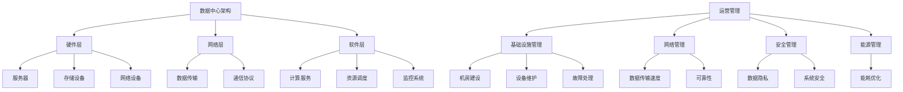

                 

# AI 大模型应用数据中心建设：数据中心运营与管理

> 关键词：AI大模型，数据中心，运营管理，技术架构，性能优化

> 摘要：本文将深入探讨AI大模型在数据中心中的应用，解析数据中心建设的关键要素、运营管理策略和未来发展趋势。通过逐步分析技术原理和实际案例，为读者提供全面的技术指导。

## 1. 背景介绍

随着人工智能（AI）技术的飞速发展，AI大模型（如GPT-3、BERT等）已经成为各行业的重要工具。这些模型具有极高的计算和存储需求，因此，数据中心的建设和运营管理变得至关重要。数据中心不仅是AI模型运行的物理基础设施，也是数据存储、处理和传输的核心枢纽。有效的数据中心运营管理能够保障AI模型的稳定运行，提高资源利用率和系统性能。

数据中心运营管理包括以下几个方面：基础设施管理、网络管理、安全管理和能源管理。其中，基础设施管理是数据中心运营的基础，包括机房建设、设备维护和故障处理等；网络管理涉及数据传输速度和可靠性，对模型训练和部署至关重要；安全管理旨在保护数据隐私和系统安全，防范潜在的网络攻击和恶意行为；能源管理则关注数据中心的能耗问题，通过优化能源利用提高环保效益。

## 2. 核心概念与联系

为了更好地理解AI大模型数据中心建设，我们首先需要了解以下几个核心概念：

### 2.1 数据中心架构

数据中心架构通常包括硬件、网络和软件三个层次。硬件层包括服务器、存储设备、网络设备等；网络层负责数据传输和通信；软件层则提供计算服务、资源调度和监控系统。数据中心架构的合理设计对于提高性能和稳定性具有重要意义。

### 2.2 AI大模型

AI大模型通常具有庞大的参数量和计算需求，如GPT-3的参数量超过1750亿。为了满足这些需求，数据中心需要具备高性能的计算和存储资源。AI大模型主要应用于自然语言处理、计算机视觉、推荐系统等领域。

### 2.3 数据流

在数据中心中，数据流是一个重要的概念。数据流包括数据输入、处理和输出等环节。对于AI大模型而言，数据流需要高效、稳定地传输和处理，以确保模型训练和部署的顺利进行。

### 2.4 运营管理

运营管理涉及数据中心各个方面的管理工作，如基础设施管理、网络管理、安全管理等。有效的运营管理能够提高数据中心的运行效率和可靠性，降低运营成本。

### 2.5 Mermaid 流程图

为了更好地理解数据中心架构和运营管理，我们使用Mermaid绘制了一个简单的流程图，如下所示：



## 3. 核心算法原理 & 具体操作步骤

### 3.1 AI大模型算法原理

AI大模型通常基于深度学习技术，特别是Transformer架构。Transformer架构具有以下核心特点：

1. **多头注意力机制**：通过多个独立的注意力机制同时关注输入序列的不同部分，提高模型的表示能力。
2. **自注意力机制**：模型内部节点通过自注意力机制计算与输入序列其他节点的关联性，从而生成更丰富的表示。
3. **前馈神经网络**：在注意力机制之后，通过两个简单的全连接层进一步提取特征。

具体操作步骤如下：

1. **输入编码**：将输入文本转换为词向量。
2. **嵌入层**：将词向量映射到高维空间。
3. **多头自注意力层**：计算输入序列中每个词与所有其他词的关联性，并生成加权表示。
4. **前馈神经网络层**：对自注意力层的输出进行进一步处理，提取特征。
5. **输出层**：将特征映射到目标词向量，进行分类或预测。

### 3.2 数据中心运营管理操作步骤

1. **基础设施管理**：
   - **机房建设**：合理规划机房布局，确保通风、消防和电力供应。
   - **设备维护**：定期检查设备运行状态，及时更换故障设备。
   - **故障处理**：建立完善的故障处理流程，快速响应和处理故障。

2. **网络管理**：
   - **数据传输速度**：优化网络配置，提高数据传输速度。
   - **可靠性**：建立冗余网络，确保数据传输的可靠性。

3. **安全管理**：
   - **数据隐私**：采用加密技术保护数据隐私。
   - **系统安全**：定期进行安全审计，防范网络攻击和恶意行为。

4. **能源管理**：
   - **能耗优化**：采用节能设备和技术，降低数据中心能耗。

## 4. 数学模型和公式 & 详细讲解 & 举例说明

### 4.1 数学模型

AI大模型的训练过程可以表示为以下数学模型：

$$
\min_{\theta} L(\theta; x, y)
$$

其中，$\theta$ 表示模型参数，$L(\theta; x, y)$ 表示损失函数，$x$ 和 $y$ 分别表示输入和输出。

### 4.2 详细讲解

1. **损失函数**：

损失函数用于衡量模型预测值与实际值之间的差距，常见的损失函数包括均方误差（MSE）、交叉熵（Cross-Entropy）等。

2. **反向传播**：

反向传播是一种用于训练神经网络的算法，通过计算损失函数关于模型参数的梯度，不断调整参数以降低损失。

3. **优化算法**：

优化算法用于求解最小化损失函数的模型参数，常见的优化算法包括梯度下降（Gradient Descent）、Adam等。

### 4.3 举例说明

假设我们使用均方误差（MSE）作为损失函数，训练一个简单的线性回归模型。输入为 $x$，输出为 $y$，模型参数为 $\theta$。则损失函数可以表示为：

$$
L(\theta; x, y) = \frac{1}{2} \sum_{i=1}^{n} (y_i - \theta x_i)^2
$$

通过反向传播算法，我们可以计算损失函数关于模型参数 $\theta$ 的梯度：

$$
\frac{\partial L}{\partial \theta} = \sum_{i=1}^{n} (y_i - \theta x_i) x_i
$$

然后，使用梯度下降算法更新模型参数：

$$
\theta = \theta - \alpha \frac{\partial L}{\partial \theta}
$$

其中，$\alpha$ 为学习率。

## 5. 项目实战：代码实际案例和详细解释说明

### 5.1 开发环境搭建

为了更好地演示AI大模型数据中心建设的实践，我们将使用Python和TensorFlow搭建一个简单的AI模型训练环境。以下为开发环境搭建步骤：

1. 安装Python（建议使用Python 3.7或以上版本）。
2. 安装TensorFlow库：`pip install tensorflow`。
3. 安装必要的依赖库：`pip install numpy matplotlib`。

### 5.2 源代码详细实现和代码解读

下面是一个简单的线性回归模型训练案例，用于预测房屋价格。

```python
import tensorflow as tf
import numpy as np
import matplotlib.pyplot as plt

# 创建数据集
x = np.random.normal(size=100)
y = 2 * x + np.random.normal(size=100)

# 定义模型
model = tf.keras.Sequential([
    tf.keras.layers.Dense(units=1, input_shape=[1])
])

# 编译模型
model.compile(optimizer='sgd', loss='mse')

# 训练模型
model.fit(x, y, epochs=1000)

# 预测结果
predictions = model.predict(x)

# 绘制结果
plt.scatter(x, y)
plt.plot(x, predictions, 'r')
plt.show()
```

### 5.3 代码解读与分析

1. **创建数据集**：

   我们使用正态分布生成100个随机输入值 `x` 和对应的输出值 `y`。这里假设输出值 `y` 是输入值 `x` 的两倍加上一个随机噪声。

2. **定义模型**：

   我们使用TensorFlow创建一个简单的线性回归模型，包含一个全连接层，输入形状为 `[1]`，输出形状为 `[1]`。

3. **编译模型**：

   使用 `sgd` 优化器和均方误差（MSE）损失函数编译模型。

4. **训练模型**：

   使用 `fit` 函数训练模型，设置训练轮次为1000轮。

5. **预测结果**：

   使用 `predict` 函数对输入值 `x` 进行预测，得到预测结果 `predictions`。

6. **绘制结果**：

   使用Matplotlib库绘制输入值 `x`、输出值 `y` 和预测结果 `predictions`。

## 6. 实际应用场景

AI大模型在数据中心的应用场景非常广泛，以下列举几个典型场景：

1. **自然语言处理**：如智能客服、机器翻译、文本分类等，通过大规模文本数据训练，提高模型准确率和效率。
2. **计算机视觉**：如图像识别、物体检测、人脸识别等，通过大规模图像数据训练，实现实时、准确的识别。
3. **推荐系统**：如电商、社交媒体等平台，通过用户行为数据训练，实现个性化推荐。
4. **智能语音助手**：如智能音箱、车载语音助手等，通过语音数据训练，实现语音识别、语音合成等功能。
5. **金融风控**：如欺诈检测、信用评估等，通过大规模金融数据训练，提高风险识别和预测能力。

## 7. 工具和资源推荐

### 7.1 学习资源推荐

1. **书籍**：
   - 《深度学习》（Goodfellow et al.）
   - 《Python机器学习》（Sebastian Raschka）
   - 《人工智能：一种现代方法》（Stuart Russell and Peter Norvig）
2. **论文**：
   - 《Attention Is All You Need》
   - 《BERT: Pre-training of Deep Bidirectional Transformers for Language Understanding》
   - 《GPT-3: Language Models are few-shot learners》
3. **博客**：
   - Medium上的AI博客
   - 知乎上的AI专栏
   - ArXiv的论文博客
4. **网站**：
   - TensorFlow官方文档
   - PyTorch官方文档
   - Keras官方文档

### 7.2 开发工具框架推荐

1. **深度学习框架**：
   - TensorFlow
   - PyTorch
   - Keras
2. **数据预处理工具**：
   - Pandas
   - NumPy
   - SciPy
3. **可视化工具**：
   - Matplotlib
   - Seaborn
   - Plotly

### 7.3 相关论文著作推荐

1. **《深度学习》（Goodfellow et al.）》
2. **《自然语言处理综述》（Jurafsky and Martin）》
3. **《计算机视觉：算法与应用》（Ramon C. Negrão and Marcelo M. Bagnato）》
4. **《推荐系统实践》（Philippe Fournier-Viger and et al.）》

## 8. 总结：未来发展趋势与挑战

随着AI大模型的不断发展，数据中心的建设和运营管理面临着诸多挑战和机遇。未来发展趋势如下：

1. **硬件加速**：利用GPU、TPU等硬件加速AI大模型的训练和推理，提高性能。
2. **分布式训练**：通过分布式计算技术，提高训练效率，降低训练成本。
3. **数据隐私保护**：在数据隐私保护方面，采用联邦学习、差分隐私等技术，保障用户隐私。
4. **智能化运维**：利用AI技术，实现数据中心的智能化运维，提高管理水平。
5. **绿色数据中心**：通过节能技术、可再生能源利用，降低数据中心的能耗。

## 9. 附录：常见问题与解答

### 9.1 如何选择合适的AI大模型？

1. **需求分析**：根据具体应用场景，选择合适的模型类型，如自然语言处理、计算机视觉等。
2. **模型性能**：考虑模型的准确率、效率等性能指标。
3. **可扩展性**：考虑模型的可扩展性，以便应对大规模数据处理需求。

### 9.2 如何优化数据中心性能？

1. **硬件升级**：提高服务器、存储设备、网络设备的性能。
2. **分布式计算**：采用分布式计算架构，提高数据处理能力。
3. **负载均衡**：合理分配任务，避免单点瓶颈。
4. **缓存技术**：使用缓存技术，降低数据访问延迟。

### 9.3 数据中心如何实现智能化运维？

1. **自动化监控**：采用自动化监控工具，实时监控数据中心运行状态。
2. **故障预测**：利用机器学习技术，预测设备故障，提前进行维护。
3. **资源调度**：基于负载预测，实现资源自动调度，提高资源利用率。
4. **智能化告警**：通过分析日志数据，实现智能化告警，提高故障响应速度。

## 10. 扩展阅读 & 参考资料

1. **《人工智能：一种现代方法》（Stuart Russell and Peter Norvig）》
2. **《深度学习》（Goodfellow et al.）》
3. **《数据中心技术指南》（Andrew L. Becherer et al.）》
4. **TensorFlow官方文档：[https://www.tensorflow.org](https://www.tensorflow.org/)**
5. **PyTorch官方文档：[https://pytorch.org](https://pytorch.org/)**
6. **Keras官方文档：[https://keras.io](https://keras.io/)**
7. **《推荐系统实践》（Philippe Fournier-Viger and et al.）》**

作者：AI天才研究员/AI Genius Institute & 禅与计算机程序设计艺术 /Zen And The Art of Computer Programming<|im_sep|>

