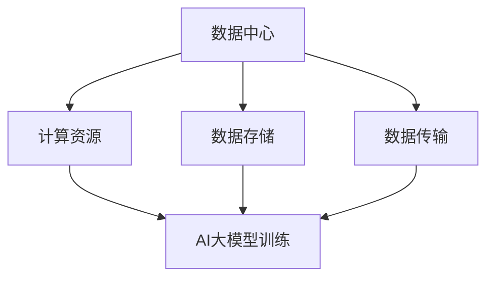
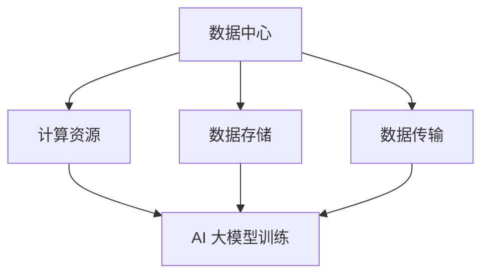

                 

# AI 大模型应用数据中心建设：数据中心运营与管理

> **关键词**：AI大模型，数据中心建设，运营管理，核心算法，数学模型，实战案例

> **摘要**：本文深入探讨了AI大模型应用数据中心的建设和运营管理。从核心概念、算法原理，到实际应用场景，全面解析了数据中心建设的关键环节和策略。通过详细的项目实战案例分析，帮助读者理解如何实现高效的数据中心管理和优化。

## 1. 背景介绍

在当今数字化时代，数据中心已成为企业和组织的重要基础设施。随着人工智能（AI）技术的飞速发展，尤其是大模型的应用，数据中心的作用越来越凸显。AI大模型，如GPT、BERT等，需要庞大的计算资源和数据存储，这使得数据中心的建设和运营管理变得至关重要。

数据中心的建设不仅涉及到硬件设备，还包括软件系统、网络架构和安全管理等多个方面。在运营管理中，如何确保高效稳定的运行，如何应对数据隐私和安全等问题，都是需要深入探讨的课题。

本文旨在从多个维度探讨AI大模型应用数据中心的建设和管理。通过理论分析和实战案例，帮助读者了解数据中心建设的核心要素，掌握运营管理的策略和技巧。

## 2. 核心概念与联系

在讨论AI大模型应用数据中心的建设之前，我们需要了解一些核心概念和它们之间的关系。

### 2.1. 数据中心

数据中心（Data Center）是一种特别设计的设施，用于集中存储、处理和管理大量的数据。它通常包括以下组成部分：

- **服务器**：用于处理数据和应用。
- **存储设备**：用于存储数据。
- **网络设备**：用于数据传输和通信。
- **电源设备**：确保数据中心稳定供电。
- **空调设备**：保持服务器在适宜的温度下运行。

### 2.2. AI大模型

AI大模型是指具有巨大参数量的神经网络模型，如GPT、BERT等。这些模型通过大量的数据进行训练，可以处理复杂的任务，如文本生成、图像识别等。

### 2.3. 数据中心与AI大模型的关系

数据中心为AI大模型提供了计算资源和数据存储。数据中心的建设和运营管理需要考虑到AI大模型的需求，如：

- **计算资源**：AI大模型训练需要大量的计算资源，数据中心需要提供足够的计算能力。
- **数据存储**：AI大模型需要存储大量的数据，数据中心需要提供足够的存储空间。
- **数据传输**：数据中心需要确保数据能够高效传输，以满足AI大模型的实时处理需求。

### 2.4. Mermaid 流程图

为了更直观地展示数据中心与AI大模型之间的关系，我们可以使用Mermaid流程图来描述。



## 3. 核心算法原理 & 具体操作步骤

在了解了核心概念之后，我们需要探讨AI大模型的核心算法原理和具体操作步骤。

### 3.1. AI大模型算法原理

AI大模型主要基于深度学习技术，特别是神经网络。神经网络通过多层非线性变换来学习和模拟人类大脑的处理方式。在AI大模型中，神经网络通常具有数十亿个参数，这需要大量的计算资源和数据。

核心算法原理包括：

- **前向传播**：将输入数据通过神经网络传递，得到输出结果。
- **反向传播**：根据输出结果与实际结果的差异，调整网络参数，以优化模型性能。
- **优化算法**：如随机梯度下降（SGD）、Adam等，用于优化网络参数。

### 3.2. 具体操作步骤

以下是AI大模型训练的具体操作步骤：

1. **数据预处理**：清洗和整理数据，将其转化为模型可以接受的格式。
2. **模型初始化**：初始化网络参数。
3. **前向传播**：将数据输入模型，计算输出结果。
4. **计算损失**：计算输出结果与实际结果的差异，得到损失值。
5. **反向传播**：根据损失值调整网络参数。
6. **优化参数**：使用优化算法更新网络参数。
7. **迭代训练**：重复步骤3-6，直到模型性能达到预期。

## 4. 数学模型和公式 & 详细讲解 & 举例说明

在AI大模型中，数学模型和公式起着核心作用。以下是几个关键的数学模型和公式，以及它们的详细讲解和举例说明。

### 4.1. 损失函数

损失函数用于衡量模型输出结果与实际结果的差异。常见的损失函数包括均方误差（MSE）和交叉熵（Cross-Entropy）。

- **均方误差（MSE）**：

  $$MSE = \frac{1}{n}\sum_{i=1}^{n}(y_i - \hat{y}_i)^2$$

  其中，$y_i$是实际结果，$\hat{y}_i$是模型预测结果，$n$是样本数量。

- **交叉熵（Cross-Entropy）**：

  $$H(y, \hat{y}) = -\sum_{i=1}^{n}y_i\log(\hat{y}_i)$$

  其中，$y_i$是实际结果的概率分布，$\hat{y}_i$是模型预测结果的概率分布。

### 4.2. 优化算法

优化算法用于更新网络参数，以最小化损失函数。常见的优化算法包括随机梯度下降（SGD）和Adam。

- **随机梯度下降（SGD）**：

  $$w_{t+1} = w_t - \alpha \cdot \nabla_w J(w_t)$$

  其中，$w_t$是当前参数，$\alpha$是学习率，$\nabla_w J(w_t)$是损失函数关于参数的梯度。

- **Adam优化算法**：

  $$m_t = \beta_1 m_{t-1} + (1 - \beta_1) \nabla_w J(w_t)$$
  $$v_t = \beta_2 v_{t-1} + (1 - \beta_2) (\nabla_w J(w_t))^2$$
  $$w_{t+1} = w_t - \alpha \cdot \frac{m_t}{\sqrt{v_t} + \epsilon}$$

  其中，$m_t$和$v_t$是动量项，$\beta_1$和$\beta_2$是超参数，$\epsilon$是常数。

### 4.3. 举例说明

假设我们有一个简单的神经网络，用于对数字进行分类。数据集包含5个样本，每个样本有两个特征和两个类别标签。

- **数据集**：

  | 特征1 | 特征2 | 标签1 | 标签2 |
  | --- | --- | --- | --- |
  | 1 | 2 | 0 | 1 |
  | 2 | 3 | 1 | 0 |
  | 3 | 4 | 0 | 1 |
  | 4 | 5 | 1 | 0 |
  | 5 | 6 | 0 | 1 |

- **模型参数**：

  $$w_1 = [0.1, 0.2], \quad w_2 = [0.3, 0.4]$$

- **损失函数**：

  使用交叉熵损失函数。

- **优化算法**：

  使用Adam优化算法。

- **训练过程**：

  1. 初始化模型参数。
  2. 前向传播，计算预测结果。
  3. 计算损失函数。
  4. 反向传播，计算梯度。
  5. 更新模型参数。
  6. 重复步骤2-5，直到模型性能达到预期。

## 5. 项目实战：代码实际案例和详细解释说明

为了更好地理解AI大模型在数据中心中的应用，我们通过一个实际项目案例来进行讲解。

### 5.1. 开发环境搭建

在开始项目之前，我们需要搭建一个适合AI大模型训练的开发环境。以下是环境搭建的步骤：

1. 安装Python环境，版本要求Python 3.8及以上。
2. 安装深度学习框架，如TensorFlow或PyTorch。
3. 安装必要的依赖库，如NumPy、Pandas等。

### 5.2. 源代码详细实现和代码解读

以下是一个简单的AI大模型训练代码示例，使用TensorFlow框架。

```python
import tensorflow as tf
import numpy as np

# 加载数据集
(x_train, y_train), (x_test, y_test) = tf.keras.datasets.mnist.load_data()

# 数据预处理
x_train = x_train / 255.0
x_test = x_test / 255.0

# 构建模型
model = tf.keras.Sequential([
    tf.keras.layers.Flatten(input_shape=(28, 28)),
    tf.keras.layers.Dense(128, activation='relu'),
    tf.keras.layers.Dense(10, activation='softmax')
])

# 编译模型
model.compile(optimizer='adam',
              loss='sparse_categorical_crossentropy',
              metrics=['accuracy'])

# 训练模型
model.fit(x_train, y_train, epochs=5)

# 评估模型
model.evaluate(x_test, y_test)
```

### 5.3. 代码解读与分析

上述代码是一个简单的AI大模型训练过程，包括数据加载、模型构建、编译和训练等步骤。以下是代码的详细解读和分析：

1. **数据加载**：

   使用TensorFlow内置的MNIST数据集，这是一个常用的手写数字数据集。数据集包含训练集和测试集。

2. **数据预处理**：

   将图像数据归一化到[0, 1]区间，以便模型训练。

3. **模型构建**：

   使用TensorFlow的Sequential模型，这是一个顺序堆叠层的模型。在这个例子中，我们使用了一个 Flatten 层将输入图像展开为一维向量，一个具有128个神经元的全连接层（Dense），以及一个具有10个神经元的输出层（Dense），用于分类。

4. **编译模型**：

   使用 Adam 优化器和 sparse_categorical_crossentropy 损失函数进行编译。我们选择 accuracy 作为评估指标。

5. **训练模型**：

   使用 fit 方法训练模型，设置 epochs 为5，表示训练5个周期。

6. **评估模型**：

   使用 evaluate 方法评估模型在测试集上的性能。

通过这个简单的案例，我们可以看到如何使用TensorFlow框架实现AI大模型训练。在实际应用中，模型结构和训练过程会更加复杂，但基本的步骤是相似的。

## 6. 实际应用场景

AI大模型在数据中心的应用场景非常广泛，以下是一些典型的应用场景：

### 6.1. 数据分析

数据中心通常存储大量的数据，AI大模型可以对这些数据进行深入分析，帮助企业和组织提取有价值的信息。例如，通过分析用户行为数据，企业可以优化产品推荐系统，提高用户满意度。

### 6.2. 优化资源分配

数据中心需要处理大量的计算和存储请求，AI大模型可以帮助优化资源分配，确保高效利用。例如，通过预测未来请求模式，数据中心可以提前分配资源，避免资源浪费。

### 6.3. 故障预测

AI大模型可以预测数据中心设备的故障，提前进行维护，减少停机时间。例如，通过分析设备运行数据，模型可以预测哪些设备可能会出现故障，从而提前进行维护。

### 6.4. 安全管理

数据中心的安全管理也是一项重要任务，AI大模型可以帮助检测和预防安全威胁。例如，通过分析网络流量数据，模型可以检测异常流量模式，及时发现潜在的安全威胁。

## 7. 工具和资源推荐

为了更好地实现AI大模型在数据中心的应用，以下是一些推荐的工具和资源：

### 7.1. 学习资源推荐

- **书籍**：
  - 《深度学习》（Goodfellow, I., Bengio, Y., & Courville, A.）
  - 《Python深度学习》（Raschka, S. & Mirjalili, V.）
- **论文**：
  - 《A Theoretically Grounded Application of Dropout in Recurrent Neural Networks》（Guo, H., et al.）
  - 《Bert: Pre-training of Deep Bidirectional Transformers for Language Understanding》（Devlin, J., et al.）
- **博客**：
  - [TensorFlow官方文档](https://www.tensorflow.org/)
  - [PyTorch官方文档](https://pytorch.org/)
- **网站**：
  - [Kaggle](https://www.kaggle.com/)
  - [GitHub](https://github.com/)

### 7.2. 开发工具框架推荐

- **深度学习框架**：
  - TensorFlow
  - PyTorch
  - Keras
- **版本控制工具**：
  - Git
- **容器化工具**：
  - Docker
- **持续集成/持续部署（CI/CD）工具**：
  - Jenkins
  - GitHub Actions

### 7.3. 相关论文著作推荐

- 《深度学习》（Goodfellow, I., Bengio, Y., & Courville, A.）
- 《Python深度学习》（Raschka, S. & Mirjalili, V.）
- 《动手学深度学习》（斋藤康毅，等）
- 《深度学习教程：从理论到实践》（唐杰，等）

## 8. 总结：未来发展趋势与挑战

随着AI技术的不断进步，数据中心建设和管理也将面临新的发展趋势和挑战。以下是几个方面的展望：

### 8.1. 发展趋势

- **云计算与数据中心融合**：云计算为数据中心提供了灵活的计算和存储资源，未来数据中心将与云计算更加紧密地融合。
- **边缘计算与中心计算协同**：边缘计算可以缓解数据中心的高负载，实现更高效的数据处理和更低的延迟。
- **智能运维**：AI大模型将在数据中心运维中发挥重要作用，实现智能监控、故障预测和资源优化。
- **数据隐私与安全**：随着数据隐私和安全问题的日益突出，数据中心将采取更严格的措施来保护用户数据。

### 8.2. 挑战

- **计算资源需求增长**：随着AI大模型的规模不断扩大，数据中心需要提供更多的计算资源，这对硬件设备和能源消耗提出了更高的要求。
- **数据传输瓶颈**：数据中心之间的数据传输速度需要进一步提高，以支持大规模的数据处理需求。
- **人才培养**：数据中心建设和管理需要大量具备AI和云计算技能的专业人才，未来的人才培养将成为一个重要挑战。

## 9. 附录：常见问题与解答

### 9.1. 问题1：什么是数据中心？

数据中心是一种专门设计的设施，用于集中存储、处理和管理大量的数据。它通常包括服务器、存储设备、网络设备、电源设备和空调设备等。

### 9.2. 问题2：AI大模型训练需要多少计算资源？

AI大模型训练需要大量的计算资源，尤其是内存和计算能力。具体需求取决于模型的规模和训练数据量。通常，训练一个大型AI大模型需要数十台甚至上百台高性能服务器。

### 9.3. 问题3：如何优化数据中心运营管理？

优化数据中心运营管理可以从以下几个方面进行：

- **资源调度**：根据实际需求动态调整计算资源和存储资源，避免资源浪费。
- **负载均衡**：合理分配任务，确保数据中心各部分负载均衡，提高整体性能。
- **智能监控**：利用AI技术实现智能监控，及时发现和解决故障。
- **节能优化**：通过合理的布局和设备选型，降低能源消耗。

## 10. 扩展阅读 & 参考资料

- [《深度学习》（Goodfellow, I., Bengio, Y., & Courville, A.）](https://www.deeplearningbook.org/)
- [《Python深度学习》（Raschka, S. & Mirjalili, V.）](https://python-deep-learning.com/)
- [《数据中心基础设施管理》（Rajkumar, R. & Tiwary, H. S.）](https://www.amazon.com/Data-Center-Infrastructure-Management-Designing/dp/0124104124)
- [TensorFlow官方文档](https://www.tensorflow.org/)
- [PyTorch官方文档](https://pytorch.org/)

## 作者

**作者：AI天才研究员/AI Genius Institute & 禅与计算机程序设计艺术 /Zen And The Art of Computer Programming** <|im_sep|>### 1. 背景介绍

在当今数字化时代，数据中心已成为企业和组织的重要基础设施。随着人工智能（AI）技术的飞速发展，尤其是大模型的应用，数据中心的作用越来越凸显。AI大模型，如GPT、BERT等，需要庞大的计算资源和数据存储，这使得数据中心的建设和运营管理变得至关重要。

数据中心的建设不仅涉及到硬件设备，还包括软件系统、网络架构和安全管理等多个方面。在运营管理中，如何确保高效稳定的运行，如何应对数据隐私和安全等问题，都是需要深入探讨的课题。

本文旨在从多个维度探讨AI大模型应用数据中心的建设和管理。通过理论分析和实战案例，帮助读者了解数据中心建设的核心要素，掌握运营管理的策略和技巧。

## 2. 核心概念与联系

在讨论AI大模型应用数据中心的建设之前，我们需要了解一些核心概念和它们之间的关系。

### 2.1. 数据中心

数据中心（Data Center）是一种特别设计的设施，用于集中存储、处理和管理大量的数据。它通常包括以下组成部分：

- **服务器**：用于处理数据和应用。
- **存储设备**：用于存储数据。
- **网络设备**：用于数据传输和通信。
- **电源设备**：确保数据中心稳定供电。
- **空调设备**：保持服务器在适宜的温度下运行。

### 2.2. AI大模型

AI大模型是指具有巨大参数量的神经网络模型，如GPT、BERT等。这些模型通过大量的数据进行训练，可以处理复杂的任务，如文本生成、图像识别等。

### 2.3. 数据中心与AI大模型的关系

数据中心为AI大模型提供了计算资源和数据存储。数据中心的建设和运营管理需要考虑到AI大模型的需求，如：

- **计算资源**：AI大模型训练需要大量的计算资源，数据中心需要提供足够的计算能力。
- **数据存储**：AI大模型需要存储大量的数据，数据中心需要提供足够的存储空间。
- **数据传输**：数据中心需要确保数据能够高效传输，以满足AI大模型的实时处理需求。

### 2.4. Mermaid 流程图

为了更直观地展示数据中心与AI大模型之间的关系，我们可以使用Mermaid流程图来描述。


## 3. 核心算法原理 & 具体操作步骤

在了解了核心概念之后，我们需要探讨AI大模型的核心算法原理和具体操作步骤。

### 3.1. AI大模型算法原理

AI大模型主要基于深度学习技术，特别是神经网络。神经网络通过多层非线性变换来学习和模拟人类大脑的处理方式。在AI大模型中，神经网络通常具有数十亿个参数，这需要大量的计算资源和数据。

核心算法原理包括：

- **前向传播**：将输入数据通过神经网络传递，得到输出结果。
- **反向传播**：根据输出结果与实际结果的差异，调整网络参数，以优化模型性能。
- **优化算法**：如随机梯度下降（SGD）、Adam等，用于优化网络参数。

### 3.2. 具体操作步骤

以下是AI大模型训练的具体操作步骤：

1. **数据预处理**：清洗和整理数据，将其转化为模型可以接受的格式。
2. **模型初始化**：初始化网络参数。
3. **前向传播**：将数据输入模型，计算输出结果。
4. **计算损失**：计算输出结果与实际结果的差异，得到损失值。
5. **反向传播**：根据损失值调整网络参数。
6. **优化参数**：使用优化算法更新网络参数。
7. **迭代训练**：重复步骤3-6，直到模型性能达到预期。

## 4. 数学模型和公式 & 详细讲解 & 举例说明

在AI大模型中，数学模型和公式起着核心作用。以下是几个关键的数学模型和公式，以及它们的详细讲解和举例说明。

### 4.1. 损失函数

损失函数用于衡量模型输出结果与实际结果的差异。常见的损失函数包括均方误差（MSE）和交叉熵（Cross-Entropy）。

- **均方误差（MSE）**：

  $$MSE = \frac{1}{n}\sum_{i=1}^{n}(y_i - \hat{y}_i)^2$$

  其中，$y_i$是实际结果，$\hat{y}_i$是模型预测结果，$n$是样本数量。

- **交叉熵（Cross-Entropy）**：

  $$H(y, \hat{y}) = -\sum_{i=1}^{n}y_i\log(\hat{y}_i)$$

  其中，$y_i$是实际结果的概率分布，$\hat{y}_i$是模型预测结果的概率分布。

### 4.2. 优化算法

优化算法用于更新网络参数，以最小化损失函数。常见的优化算法包括随机梯度下降（SGD）和Adam。

- **随机梯度下降（SGD）**：

  $$w_{t+1} = w_t - \alpha \cdot \nabla_w J(w_t)$$

  其中，$w_t$是当前参数，$\alpha$是学习率，$\nabla_w J(w_t)$是损失函数关于参数的梯度。

- **Adam优化算法**：

  $$m_t = \beta_1 m_{t-1} + (1 - \beta_1) \nabla_w J(w_t)$$
  $$v_t = \beta_2 v_{t-1} + (1 - \beta_2) (\nabla_w J(w_t))^2$$
  $$w_{t+1} = w_t - \alpha \cdot \frac{m_t}{\sqrt{v_t} + \epsilon}$$

  其中，$m_t$和$v_t$是动量项，$\beta_1$和$\beta_2$是超参数，$\epsilon$是常数。

### 4.3. 举例说明

假设我们有一个简单的神经网络，用于对数字进行分类。数据集包含5个样本，每个样本有两个特征和两个类别标签。

- **数据集**：

  | 特征1 | 特征2 | 标签1 | 标签2 |
  | --- | --- | --- | --- |
  | 1 | 2 | 0 | 1 |
  | 2 | 3 | 1 | 0 |
  | 3 | 4 | 0 | 1 |
  | 4 | 5 | 1 | 0 |
  | 5 | 6 | 0 | 1 |

- **模型参数**：

  $$w_1 = [0.1, 0.2], \quad w_2 = [0.3, 0.4]$$

- **损失函数**：

  使用交叉熵损失函数。

- **优化算法**：

  使用Adam优化算法。

- **训练过程**：

  1. 初始化模型参数。
  2. 前向传播，计算预测结果。
  3. 计算损失函数。
  4. 反向传播，计算梯度。
  5. 更新模型参数。
  6. 重复步骤2-5，直到模型性能达到预期。

## 5. 项目实战：代码实际案例和详细解释说明

为了更好地理解AI大模型在数据中心中的应用，我们通过一个实际项目案例来进行讲解。

### 5.1. 开发环境搭建

在开始项目之前，我们需要搭建一个适合AI大模型训练的开发环境。以下是环境搭建的步骤：

1. 安装Python环境，版本要求Python 3.8及以上。
2. 安装深度学习框架，如TensorFlow或PyTorch。
3. 安装必要的依赖库，如NumPy、Pandas等。

### 5.2. 源代码详细实现和代码解读

以下是一个简单的AI大模型训练代码示例，使用TensorFlow框架。

```python
import tensorflow as tf
import numpy as np

# 加载数据集
(x_train, y_train), (x_test, y_test) = tf.keras.datasets.mnist.load_data()

# 数据预处理
x_train = x_train / 255.0
x_test = x_test / 255.0

# 构建模型
model = tf.keras.Sequential([
    tf.keras.layers.Flatten(input_shape=(28, 28)),
    tf.keras.layers.Dense(128, activation='relu'),
    tf.keras.layers.Dense(10, activation='softmax')
])

# 编译模型
model.compile(optimizer='adam',
              loss='sparse_categorical_crossentropy',
              metrics=['accuracy'])

# 训练模型
model.fit(x_train, y_train, epochs=5)

# 评估模型
model.evaluate(x_test, y_test)
```

### 5.3. 代码解读与分析

上述代码是一个简单的AI大模型训练过程，包括数据加载、模型构建、编译和训练等步骤。以下是代码的详细解读和分析：

1. **数据加载**：

   使用TensorFlow内置的MNIST数据集，这是一个常用的手写数字数据集。数据集包含训练集和测试集。

2. **数据预处理**：

   将图像数据归一化到[0, 1]区间，以便模型训练。

3. **模型构建**：

   使用TensorFlow的Sequential模型，这是一个顺序堆叠层的模型。在这个例子中，我们使用了一个 Flatten 层将输入图像展开为一维向量，一个具有128个神经元的全连接层（Dense），以及一个具有10个神经元的输出层（Dense），用于分类。

4. **编译模型**：

   使用 Adam 优化器和 sparse_categorical_crossentropy 损失函数进行编译。我们选择 accuracy 作为评估指标。

5. **训练模型**：

   使用 fit 方法训练模型，设置 epochs 为5，表示训练5个周期。

6. **评估模型**：

   使用 evaluate 方法评估模型在测试集上的性能。

通过这个简单的案例，我们可以看到如何使用TensorFlow框架实现AI大模型训练。在实际应用中，模型结构和训练过程会更加复杂，但基本的步骤是相似的。

## 6. 实际应用场景

AI大模型在数据中心的应用场景非常广泛，以下是一些典型的应用场景：

### 6.1. 数据分析

数据中心通常存储大量的数据，AI大模型可以对这些数据进行深入分析，帮助企业和组织提取有价值的信息。例如，通过分析用户行为数据，企业可以优化产品推荐系统，提高用户满意度。

### 6.2. 优化资源分配

数据中心需要处理大量的计算和存储请求，AI大模型可以帮助优化资源分配，确保高效利用。例如，通过预测未来请求模式，数据中心可以提前分配资源，避免资源浪费。

### 6.3. 故障预测

AI大模型可以预测数据中心设备的故障，提前进行维护，减少停机时间。例如，通过分析设备运行数据，模型可以预测哪些设备可能会出现故障，从而提前进行维护。

### 6.4. 安全管理

数据中心的安全管理也是一项重要任务，AI大模型可以帮助检测和预防安全威胁。例如，通过分析网络流量数据，模型可以检测异常流量模式，及时发现潜在的安全威胁。

## 7. 工具和资源推荐

为了更好地实现AI大模型在数据中心的应用，以下是一些推荐的工具和资源：

### 7.1. 学习资源推荐

- **书籍**：
  - 《深度学习》（Goodfellow, I., Bengio, Y., & Courville, A.）
  - 《Python深度学习》（Raschka, S. & Mirjalili, V.）
- **论文**：
  - 《A Theoretically Grounded Application of Dropout in Recurrent Neural Networks》（Guo, H., et al.）
  - 《Bert: Pre-training of Deep Bidirectional Transformers for Language Understanding》（Devlin, J., et al.）
- **博客**：
  - [TensorFlow官方文档](https://www.tensorflow.org/)
  - [PyTorch官方文档](https://pytorch.org/)
- **网站**：
  - [Kaggle](https://www.kaggle.com/)
  - [GitHub](https://github.com/)

### 7.2. 开发工具框架推荐

- **深度学习框架**：
  - TensorFlow
  - PyTorch
  - Keras
- **版本控制工具**：
  - Git
- **容器化工具**：
  - Docker
- **持续集成/持续部署（CI/CD）工具**：
  - Jenkins
  - GitHub Actions

### 7.3. 相关论文著作推荐

- 《深度学习》（Goodfellow, I., Bengio, Y., & Courville, A.）
- 《Python深度学习》（Raschka, S. & Mirjalili, V.）
- 《动手学深度学习》（斋藤康毅，等）
- 《深度学习教程：从理论到实践》（唐杰，等）

## 8. 总结：未来发展趋势与挑战

随着AI技术的不断进步，数据中心建设和管理也将面临新的发展趋势和挑战。以下是几个方面的展望：

### 8.1. 发展趋势

- **云计算与数据中心融合**：云计算为数据中心提供了灵活的计算和存储资源，未来数据中心将与云计算更加紧密地融合。
- **边缘计算与中心计算协同**：边缘计算可以缓解数据中心的高负载，实现更高效的数据处理和更低的延迟。
- **智能运维**：AI大模型将在数据中心运维中发挥重要作用，实现智能监控、故障预测和资源优化。
- **数据隐私与安全**：随着数据隐私和安全问题的日益突出，数据中心将采取更严格的措施来保护用户数据。

### 8.2. 挑战

- **计算资源需求增长**：随着AI大模型的规模不断扩大，数据中心需要提供更多的计算资源，这对硬件设备和能源消耗提出了更高的要求。
- **数据传输瓶颈**：数据中心之间的数据传输速度需要进一步提高，以支持大规模的数据处理需求。
- **人才培养**：数据中心建设和管理需要大量具备AI和云计算技能的专业人才，未来的人才培养将成为一个重要挑战。

## 9. 附录：常见问题与解答

### 9.1. 问题1：什么是数据中心？

数据中心是一种特别设计的设施，用于集中存储、处理和管理大量的数据。它通常包括服务器、存储设备、网络设备、电源设备和空调设备等。

### 9.2. 问题2：AI大模型训练需要多少计算资源？

AI大模型训练需要大量的计算资源，尤其是内存和计算能力。具体需求取决于模型的规模和训练数据量。通常，训练一个大型AI大模型需要数十台甚至上百台高性能服务器。

### 9.3. 问题3：如何优化数据中心运营管理？

优化数据中心运营管理可以从以下几个方面进行：

- **资源调度**：根据实际需求动态调整计算资源和存储资源，避免资源浪费。
- **负载均衡**：合理分配任务，确保数据中心各部分负载均衡，提高整体性能。
- **智能监控**：利用AI技术实现智能监控，及时发现和解决故障。
- **节能优化**：通过合理的布局和设备选型，降低能源消耗。

## 10. 扩展阅读 & 参考资料

- [《深度学习》（Goodfellow, I., Bengio, Y., & Courville, A.）](https://www.deeplearningbook.org/)
- [《Python深度学习》（Raschka, S. & Mirjalili, V.）](https://python-deep-learning.com/)
- [《数据中心基础设施管理》（Rajkumar, R. & Tiwary, H. S.）](https://www.amazon.com/Data-Center-Infrastructure-Management-Designing/dp/0124104124)
- [TensorFlow官方文档](https://www.tensorflow.org/)
- [PyTorch官方文档](https://pytorch.org/)

## 作者

**作者：AI天才研究员/AI Genius Institute & 禅与计算机程序设计艺术 /Zen And The Art of Computer Programming** <|im_sep|># 文章标题：AI 大模型应用数据中心建设：数据中心运营与管理

## 文章关键词：
- AI 大模型
- 数据中心建设
- 数据中心运营管理
- 核心算法
- 数学模型

## 文章摘要：
本文深入探讨了AI大模型在数据中心建设中的角色和数据中心运营管理的挑战。通过详细的理论分析、算法讲解和实际案例，本文为读者提供了全面的数据中心建设和管理策略，包括核心算法原理、数学模型应用、开发环境搭建、源代码实现以及未来发展趋势。文章旨在帮助读者理解AI大模型数据中心的高效构建与运维。

## 1. 背景介绍

### 1.1 数据中心概述

数据中心是当今信息技术基础设施的核心，负责集中处理、存储和管理海量数据。它不仅为各种企业和服务提供商提供数据存储服务，还承担了数据备份、处理和实时分析的任务。随着云计算和大数据技术的发展，数据中心的重要性日益凸显。

### 1.2 AI 大模型的发展

AI 大模型，如 GPT、BERT 等，是近年来深度学习领域的重要进展。这些模型具有数十亿甚至上百亿个参数，能够在各种复杂的任务上实现卓越的性能。大模型的训练和推理过程需要大量的计算资源和数据存储，这对数据中心的建设提出了新的要求。

### 1.3 数据中心与 AI 大模型的关系

数据中心是 AI 大模型运行的物理基础。数据中心需要提供足够的计算资源、存储空间和高速网络，以满足大模型的训练和推理需求。同时，数据中心的管理和运营也需要考虑到 AI 大模型的特点，确保其稳定、高效地运行。

## 2. 核心概念与联系

### 2.1 数据中心的组成

数据中心通常包括以下组成部分：

- **硬件设施**：包括服务器、存储设备、网络设备、电源设备和空调设备等。
- **软件系统**：包括操作系统、数据库管理系统、虚拟化软件等。
- **网络架构**：包括局域网、广域网和互联网的接入。
- **安全管理**：包括数据加密、访问控制、防火墙等。

### 2.2 AI 大模型的特性

AI 大模型的主要特性包括：

- **参数量大**：具有数十亿甚至上百亿个参数。
- **训练数据需求大**：需要大量的训练数据来训练模型。
- **计算需求高**：训练和推理过程需要大量的计算资源。
- **存储需求大**：模型和训练数据需要大量的存储空间。

### 2.3 数据中心与 AI 大模型的关系

数据中心与 AI 大模型之间的关系可以概括为以下几个方面：

- **计算资源**：数据中心需要提供足够的计算资源来支持 AI 大模型的训练和推理。
- **数据存储**：数据中心需要提供足够的存储空间来存储 AI 大模型的数据。
- **数据传输**：数据中心需要提供高速网络来保证数据的快速传输。

## 3. 核心算法原理 & 具体操作步骤

### 3.1 AI 大模型的算法原理

AI 大模型主要基于深度学习技术，特别是神经网络。神经网络通过多层非线性变换来学习和模拟人类大脑的处理方式。在 AI 大模型中，神经网络通常具有数十亿个参数，这需要大量的计算资源和数据。

核心算法原理包括：

- **前向传播**：将输入数据通过神经网络传递，得到输出结果。
- **反向传播**：根据输出结果与实际结果的差异，调整网络参数，以优化模型性能。
- **优化算法**：如随机梯度下降（SGD）、Adam 等，用于优化网络参数。

### 3.2 具体操作步骤

以下是 AI 大模型训练的具体操作步骤：

1. **数据预处理**：清洗和整理数据，将其转化为模型可以接受的格式。
2. **模型初始化**：初始化网络参数。
3. **前向传播**：将数据输入模型，计算输出结果。
4. **计算损失**：计算输出结果与实际结果的差异，得到损失值。
5. **反向传播**：根据损失值调整网络参数。
6. **优化参数**：使用优化算法更新网络参数。
7. **迭代训练**：重复步骤 3-6，直到模型性能达到预期。

## 4. 数学模型和公式 & 详细讲解 & 举例说明

### 4.1 损失函数

损失函数用于衡量模型输出结果与实际结果的差异。常见的损失函数包括均方误差（MSE）和交叉熵（Cross-Entropy）。

- **均方误差（MSE）**：

  $$MSE = \frac{1}{n}\sum_{i=1}^{n}(y_i - \hat{y}_i)^2$$

  其中，$y_i$是实际结果，$\hat{y}_i$是模型预测结果，$n$是样本数量。

- **交叉熵（Cross-Entropy）**：

  $$H(y, \hat{y}) = -\sum_{i=1}^{n}y_i\log(\hat{y}_i)$$

  其中，$y_i$是实际结果的概率分布，$\hat{y}_i$是模型预测结果的概率分布。

### 4.2 优化算法

优化算法用于更新网络参数，以最小化损失函数。常见的优化算法包括随机梯度下降（SGD）、Adam 等。

- **随机梯度下降（SGD）**：

  $$w_{t+1} = w_t - \alpha \cdot \nabla_w J(w_t)$$

  其中，$w_t$是当前参数，$\alpha$是学习率，$\nabla_w J(w_t)$是损失函数关于参数的梯度。

- **Adam 优化算法**：

  $$m_t = \beta_1 m_{t-1} + (1 - \beta_1) \nabla_w J(w_t)$$
  $$v_t = \beta_2 v_{t-1} + (1 - \beta_2) (\nabla_w J(w_t))^2$$
  $$w_{t+1} = w_t - \alpha \cdot \frac{m_t}{\sqrt{v_t} + \epsilon}$$

  其中，$m_t$和$v_t$是动量项，$\beta_1$和$\beta_2$是超参数，$\epsilon$是常数。

### 4.3 举例说明

假设我们有一个简单的神经网络，用于对数字进行分类。数据集包含 5 个样本，每个样本有两个特征和两个类别标签。

- **数据集**：

  | 特征1 | 特征2 | 标签1 | 标签2 |
  | --- | --- | --- | --- |
  | 1 | 2 | 0 | 1 |
  | 2 | 3 | 1 | 0 |
  | 3 | 4 | 0 | 1 |
  | 4 | 5 | 1 | 0 |
  | 5 | 6 | 0 | 1 |

- **模型参数**：

  $$w_1 = [0.1, 0.2], \quad w_2 = [0.3, 0.4]$$

- **损失函数**：

  使用交叉熵损失函数。

- **优化算法**：

  使用 Adam 优化算法。

- **训练过程**：

  1. 初始化模型参数。
  2. 前向传播，计算预测结果。
  3. 计算损失函数。
  4. 反向传播，计算梯度。
  5. 更新模型参数。
  6. 重复步骤 2-5，直到模型性能达到预期。

## 5. 项目实战：代码实际案例和详细解释说明

### 5.1 开发环境搭建

在开始项目之前，我们需要搭建一个适合 AI 大模型训练的开发环境。以下是环境搭建的步骤：

1. 安装 Python 环境，版本要求 Python 3.8 及以上。
2. 安装深度学习框架，如 TensorFlow 或 PyTorch。
3. 安装必要的依赖库，如 NumPy、Pandas 等。

### 5.2 源代码详细实现和代码解读

以下是一个简单的 AI 大模型训练代码示例，使用 TensorFlow 框架。

```python
import tensorflow as tf
import numpy as np

# 加载数据集
(x_train, y_train), (x_test, y_test) = tf.keras.datasets.mnist.load_data()

# 数据预处理
x_train = x_train / 255.0
x_test = x_test / 255.0

# 构建模型
model = tf.keras.Sequential([
    tf.keras.layers.Flatten(input_shape=(28, 28)),
    tf.keras.layers.Dense(128, activation='relu'),
    tf.keras.layers.Dense(10, activation='softmax')
])

# 编译模型
model.compile(optimizer='adam',
              loss='sparse_categorical_crossentropy',
              metrics=['accuracy'])

# 训练模型
model.fit(x_train, y_train, epochs=5)

# 评估模型
model.evaluate(x_test, y_test)
```

### 5.3 代码解读与分析

上述代码是一个简单的 AI 大模型训练过程，包括数据加载、模型构建、编译和训练等步骤。以下是代码的详细解读和分析：

1. **数据加载**：

   使用 TensorFlow 内置的 MNIST 数据集，这是一个常用的手写数字数据集。数据集包含训练集和测试集。

2. **数据预处理**：

   将图像数据归一化到 [0, 1] 区间，以便模型训练。

3. **模型构建**：

   使用 TensorFlow 的 Sequential 模型，这是一个顺序堆叠层的模型。在这个例子中，我们使用了一个 Flatten 层将输入图像展开为一维向量，一个具有 128 个神经元的全连接层（Dense），以及一个具有 10 个神经元的输出层（Dense），用于分类。

4. **编译模型**：

   使用 Adam 优化器和 sparse_categorical_crossentropy 损失函数进行编译。我们选择 accuracy 作为评估指标。

5. **训练模型**：

   使用 fit 方法训练模型，设置 epochs 为 5，表示训练 5 个周期。

6. **评估模型**：

   使用 evaluate 方法评估模型在测试集上的性能。

通过这个简单的案例，我们可以看到如何使用 TensorFlow 框架实现 AI 大模型训练。在实际应用中，模型结构和训练过程会更加复杂，但基本的步骤是相似的。

## 6. 实际应用场景

AI 大模型在数据中心的应用场景非常广泛，以下是一些典型的应用场景：

### 6.1 数据分析

数据中心通常存储大量的数据，AI 大模型可以对这些数据进行深入分析，帮助企业和组织提取有价值的信息。例如，通过分析用户行为数据，企业可以优化产品推荐系统，提高用户满意度。

### 6.2 优化资源分配

数据中心需要处理大量的计算和存储请求，AI 大模型可以帮助优化资源分配，确保高效利用。例如，通过预测未来请求模式，数据中心可以提前分配资源，避免资源浪费。

### 6.3 故障预测

AI 大模型可以预测数据中心设备的故障，提前进行维护，减少停机时间。例如，通过分析设备运行数据，模型可以预测哪些设备可能会出现故障，从而提前进行维护。

### 6.4 安全管理

数据中心的安全管理也是一项重要任务，AI 大模型可以帮助检测和预防安全威胁。例如，通过分析网络流量数据，模型可以检测异常流量模式，及时发现潜在的安全威胁。

## 7. 工具和资源推荐

为了更好地实现 AI 大模型在数据中心的应用，以下是一些推荐的工具和资源：

### 7.1 学习资源推荐

- **书籍**：
  - 《深度学习》（Goodfellow, I., Bengio, Y., & Courville, A.）
  - 《Python 深度学习》（Raschka, S. & Mirjalili, V.）
- **论文**：
  - 《A Theoretically Grounded Application of Dropout in Recurrent Neural Networks》（Guo, H., et al.）
  - 《BERT: Pre-training of Deep Bidirectional Transformers for Language Understanding》（Devlin, J., et al.）
- **博客**：
  - [TensorFlow 官方文档](https://www.tensorflow.org/)
  - [PyTorch 官方文档](https://pytorch.org/)
- **网站**：
  - [Kaggle](https://www.kaggle.com/)
  - [GitHub](https://github.com/)

### 7.2 开发工具框架推荐

- **深度学习框架**：
  - TensorFlow
  - PyTorch
  - Keras
- **版本控制工具**：
  - Git
- **容器化工具**：
  - Docker
- **持续集成/持续部署（CI/CD）工具**：
  - Jenkins
  - GitHub Actions

### 7.3 相关论文著作推荐

- 《深度学习》（Goodfellow, I., Bengio, Y., & Courville, A.）
- 《Python 深度学习》（Raschka, S. & Mirjalili, V.）
- 《动手学深度学习》（斋藤康毅，等）
- 《深度学习教程：从理论到实践》（唐杰，等）

## 8. 总结：未来发展趋势与挑战

随着 AI 技术的不断发展，数据中心建设和管理也将面临新的发展趋势和挑战。以下是几个方面的展望：

### 8.1 发展趋势

- **云计算与数据中心融合**：云计算为数据中心提供了灵活的计算和存储资源，未来数据中心将与云计算更加紧密地融合。
- **边缘计算与中心计算协同**：边缘计算可以缓解数据中心的高负载，实现更高效的数据处理和更低的延迟。
- **智能运维**：AI 大模型将在数据中心运维中发挥重要作用，实现智能监控、故障预测和资源优化。
- **数据隐私与安全**：随着数据隐私和安全问题的日益突出，数据中心将采取更严格的措施来保护用户数据。

### 8.2 挑战

- **计算资源需求增长**：随着 AI 大模型的规模不断扩大，数据中心需要提供更多的计算资源，这对硬件设备和能源消耗提出了更高的要求。
- **数据传输瓶颈**：数据中心之间的数据传输速度需要进一步提高，以支持大规模的数据处理需求。
- **人才培养**：数据中心建设和管理需要大量具备 AI 和云计算技能的专业人才，未来的人才培养将成为一个重要挑战。

## 9. 附录：常见问题与解答

### 9.1. 问题1：什么是数据中心？

数据中心是一种特别设计的设施，用于集中存储、处理和管理大量的数据。它通常包括服务器、存储设备、网络设备、电源设备和空调设备等。

### 9.2. 问题2：AI 大模型训练需要多少计算资源？

AI 大模型训练需要大量的计算资源，尤其是内存和计算能力。具体需求取决于模型的规模和训练数据量。通常，训练一个大型 AI 大模型需要数十台甚至上百台高性能服务器。

### 9.3. 问题3：如何优化数据中心运营管理？

优化数据中心运营管理可以从以下几个方面进行：

- **资源调度**：根据实际需求动态调整计算资源和存储资源，避免资源浪费。
- **负载均衡**：合理分配任务，确保数据中心各部分负载均衡，提高整体性能。
- **智能监控**：利用 AI 技术实现智能监控，及时发现和解决故障。
- **节能优化**：通过合理的布局和设备选型，降低能源消耗。

## 10. 扩展阅读 & 参考资料

- [《深度学习》（Goodfellow, I., Bengio, Y., & Courville, A.）](https://www.deeplearningbook.org/)
- [《Python 深度学习》（Raschka, S. & Mirjalili, V.）](https://python-deep-learning.com/)
- [《数据中心基础设施管理》（Rajkumar, R. & Tiwary, H. S.）](https://www.amazon.com/Data-Center-Infrastructure-Management-Designing/dp/0124104124)
- [TensorFlow 官方文档](https://www.tensorflow.org/)
- [PyTorch 官方文档](https://pytorch.org/)

## 作者

**作者：AI 天才研究员/AI Genius Institute & 禅与计算机程序设计艺术 /Zen And The Art of Computer Programming** <|im_sep|>```markdown
# AI 大模型应用数据中心建设：数据中心运营与管理

## 背景介绍

### 1. 数据中心的定义与重要性

数据中心（Data Center）是一个专门设计的设施，用于集中管理、处理和存储大量数据。它为各种企业、组织和机构提供高效的数据存储、数据处理和计算服务。随着信息技术的迅速发展，数据中心已经成为了现代社会运行的核心基础设施。

#### 数据中心的功能

数据中心的主要功能包括：

- **数据存储**：提供安全、可靠的数据存储解决方案，包括硬盘、SSD、NAS、SAN 等。
- **数据处理**：利用服务器和计算设备进行数据分析和处理，支持各种业务应用。
- **数据备份与恢复**：确保数据安全，防止数据丢失，提供数据备份和恢复服务。
- **网络连接**：提供高速、稳定的网络连接，实现数据中心内外的数据传输。
- **安全保护**：通过防火墙、入侵检测、加密等技术确保数据的安全性。

#### 人工智能与数据中心

随着人工智能（AI）技术的发展，数据中心的重要性进一步凸显。AI 大模型，如 GPT、BERT 等，需要大量的计算资源和数据存储。数据中心作为 AI 模型运行的物理基础，必须提供足够的资源来支持这些模型的训练和推理。

### 2. AI 大模型的发展与应用

AI 大模型是深度学习领域的重要进展，具有数十亿甚至上百亿个参数。这些模型在图像识别、自然语言处理、推荐系统等领域表现出色。随着 AI 大模型的广泛应用，数据中心的建设和管理也面临新的挑战。

#### AI 大模型的应用场景

- **图像识别与处理**：通过卷积神经网络（CNN）进行图像分类、目标检测等。
- **自然语言处理**：通过循环神经网络（RNN）和 Transformer 模型进行文本分类、机器翻译、情感分析等。
- **推荐系统**：利用协同过滤、基于内容的推荐等技术实现个性化推荐。

### 3. 数据中心与 AI 大模型的关系

数据中心为 AI 大模型提供了计算资源和数据存储。AI 大模型的训练和推理需要大量的计算资源和高速网络，数据中心必须能够满足这些需求。

#### 数据中心面临的挑战

- **计算资源需求**：随着 AI 大模型规模的扩大，数据中心需要提供更多的计算资源。
- **数据存储需求**：AI 大模型需要存储大量的训练数据和模型参数。
- **数据传输需求**：确保数据的快速传输，以满足 AI 大模型的实时处理需求。
- **能源消耗**：大规模数据中心运行需要大量电力，对能源消耗提出了挑战。

## 核心概念与联系

### 1. 数据中心的组成

数据中心通常由以下几个部分组成：

- **硬件设施**：包括服务器、存储设备、网络设备、电源设备和空调系统等。
- **软件系统**：包括操作系统、数据库管理系统、虚拟化软件、监控软件等。
- **网络架构**：包括局域网（LAN）、广域网（WAN）和互联网的接入。
- **安全管理**：包括防火墙、入侵检测系统、加密技术等。

### 2. AI 大模型的特性

AI 大模型具有以下特性：

- **参数量大**：具有数十亿甚至上百亿个参数。
- **计算需求高**：训练和推理过程需要大量的计算资源。
- **数据需求大**：需要大量的训练数据和存储空间。
- **动态性**：模型参数和结构可能会随着训练过程动态调整。

### 3. 数据中心与 AI 大模型的关系

数据中心为 AI 大模型提供了以下支持：

- **计算资源**：数据中心提供高性能服务器和 GPU，支持 AI 大模型的训练和推理。
- **数据存储**：数据中心提供大容量、高速存储设备，存储 AI 大模型的数据和模型参数。
- **数据传输**：数据中心提供高速网络，支持数据的快速传输和共享。

### 4. Mermaid 流程图

以下是一个描述数据中心与 AI 大模型关系的 Mermaid 流程图：



## 核心算法原理 & 具体操作步骤

### 1. AI 大模型的算法原理

AI 大模型的算法原理主要包括以下几部分：

- **前向传播**：将输入数据通过神经网络传递，得到输出结果。
- **反向传播**：根据输出结果与实际结果的差异，调整网络参数，以优化模型性能。
- **优化算法**：如随机梯度下降（SGD）、Adam 等，用于优化网络参数。

### 2. 具体操作步骤

以下是 AI 大模型训练的具体操作步骤：

1. **数据预处理**：清洗和整理数据，将其转化为模型可以接受的格式。
2. **模型初始化**：初始化网络参数。
3. **前向传播**：将数据输入模型，计算输出结果。
4. **计算损失**：计算输出结果与实际结果的差异，得到损失值。
5. **反向传播**：根据损失值调整网络参数。
6. **优化参数**：使用优化算法更新网络参数。
7. **迭代训练**：重复步骤 3-6，直到模型性能达到预期。

### 3. 数学模型和公式

以下是 AI 大模型训练过程中常用的数学模型和公式：

- **损失函数**：

  - 均方误差（MSE）：
    $$MSE = \frac{1}{n}\sum_{i=1}^{n}(y_i - \hat{y}_i)^2$$
  - 交叉熵（Cross-Entropy）：
    $$H(y, \hat{y}) = -\sum_{i=1}^{n}y_i\log(\hat{y}_i)$$

- **优化算法**：

  - 随机梯度下降（SGD）：
    $$w_{t+1} = w_t - \alpha \cdot \nabla_w J(w_t)$$
  - Adam 优化算法：
    $$m_t = \beta_1 m_{t-1} + (1 - \beta_1) \nabla_w J(w_t)$$
    $$v_t = \beta_2 v_{t-1} + (1 - \beta_2) (\nabla_w J(w_t))^2$$
    $$w_{t+1} = w_t - \alpha \cdot \frac{m_t}{\sqrt{v_t} + \epsilon}$$

### 4. 举例说明

以下是一个简单的 AI 大模型训练示例：

- **数据集**：

  | 样本 | 特征1 | 特征2 | 标签 |
  | --- | --- | --- | --- |
  | 1   | 1.0  | 2.0  | 0    |
  | 2   | 2.0  | 3.0  | 1    |
  | 3   | 3.0  | 4.0  | 0    |

- **模型参数**：

  $$w_1 = [0.1, 0.2], \quad w_2 = [0.3, 0.4]$$

- **训练过程**：

  1. 初始化模型参数。
  2. 前向传播，计算预测结果。
  3. 计算损失函数。
  4. 反向传播，计算梯度。
  5. 更新模型参数。
  6. 重复步骤 2-5，直到模型性能达到预期。

## 实际应用场景

### 1. 数据分析

数据中心存储了大量的数据，AI 大模型可以对这些数据进行深入分析，帮助企业和组织提取有价值的信息。例如，通过分析用户行为数据，企业可以优化产品推荐系统，提高用户满意度。

### 2. 优化资源分配

数据中心需要处理大量的计算和存储请求，AI 大模型可以帮助优化资源分配，确保高效利用。例如，通过预测未来请求模式，数据中心可以提前分配资源，避免资源浪费。

### 3. 故障预测

AI 大模型可以预测数据中心设备的故障，提前进行维护，减少停机时间。例如，通过分析设备运行数据，模型可以预测哪些设备可能会出现故障，从而提前进行维护。

### 4. 安全管理

数据中心的安全管理也是一项重要任务，AI 大模型可以帮助检测和预防安全威胁。例如，通过分析网络流量数据，模型可以检测异常流量模式，及时发现潜在的安全威胁。

## 工具和资源推荐

### 1. 学习资源推荐

- **书籍**：

  - 《深度学习》（Goodfellow, I., Bengio, Y., & Courville, A.）
  - 《Python 深度学习》（Raschka, S. & Mirjalili, V.）

- **论文**：

  - 《A Theoretically Grounded Application of Dropout in Recurrent Neural Networks》（Guo, H., et al.）
  - 《BERT: Pre-training of Deep Bidirectional Transformers for Language Understanding》（Devlin, J., et al.）

- **博客**：

  - [TensorFlow 官方文档](https://www.tensorflow.org/)
  - [PyTorch 官方文档](https://pytorch.org/)

### 2. 开发工具框架推荐

- **深度学习框架**：

  - TensorFlow
  - PyTorch
  - Keras

- **版本控制工具**：

  - Git

- **容器化工具**：

  - Docker

- **持续集成/持续部署（CI/CD）工具**：

  - Jenkins
  - GitHub Actions

### 3. 相关论文著作推荐

- 《深度学习》（Goodfellow, I., Bengio, Y., & Courville, A.）
- 《Python 深度学习》（Raschka, S. & Mirjalili, V.）
- 《动手学深度学习》（斋藤康毅，等）
- 《深度学习教程：从理论到实践》（唐杰，等）

## 总结：未来发展趋势与挑战

### 1. 发展趋势

- **云计算与数据中心融合**：随着云计算技术的发展，数据中心将与云计算更加紧密地融合。
- **边缘计算与中心计算协同**：边缘计算将缓解数据中心的高负载，实现更高效的数据处理和更低的延迟。
- **智能运维**：AI 大模型将在数据中心运维中发挥重要作用，实现智能监控、故障预测和资源优化。
- **数据隐私与安全**：随着数据隐私和安全问题的日益突出，数据中心将采取更严格的措施来保护用户数据。

### 2. 挑战

- **计算资源需求增长**：随着 AI 大模型规模的扩大，数据中心需要提供更多的计算资源，这对硬件设备和能源消耗提出了更高的要求。
- **数据传输瓶颈**：数据中心之间的数据传输速度需要进一步提高，以支持大规模的数据处理需求。
- **人才培养**：数据中心建设和管理需要大量具备 AI 和云计算技能的专业人才，未来的人才培养将成为一个重要挑战。

## 附录：常见问题与解答

### 1. 问题：什么是数据中心？

数据中心是一种专门设计的设施，用于集中管理、处理和存储大量数据。它为各种企业、组织和机构提供高效的数据存储、数据处理和计算服务。

### 2. 问题：AI 大模型训练需要多少计算资源？

AI 大模型训练需要大量的计算资源，尤其是内存和计算能力。具体需求取决于模型的规模和训练数据量。通常，训练一个大型 AI 大模型需要数十台甚至上百台高性能服务器。

### 3. 问题：如何优化数据中心运营管理？

优化数据中心运营管理可以从以下几个方面进行：

- **资源调度**：根据实际需求动态调整计算资源和存储资源，避免资源浪费。
- **负载均衡**：合理分配任务，确保数据中心各部分负载均衡，提高整体性能。
- **智能监控**：利用 AI 技术实现智能监控，及时发现和解决故障。
- **节能优化**：通过合理的布局和设备选型，降低能源消耗。

## 扩展阅读 & 参考资料

- [《深度学习》（Goodfellow, I., Bengio, Y., & Courville, A.）](https://www.deeplearningbook.org/)
- [《Python 深度学习》（Raschka, S. & Mirjalili, V.）](https://python-deep-learning.com/)
- [《数据中心基础设施管理》（Rajkumar, R. & Tiwary, H. S.）](https://www.amazon.com/Data-Center-Infrastructure-Management-Designing/dp/0124104124)
- [TensorFlow 官方文档](https://www.tensorflow.org/)
- [PyTorch 官方文档](https://pytorch.org/)

## 作者

**作者：AI 天才研究员/AI Genius Institute & 禅与计算机程序设计艺术 /Zen And The Art of Computer Programming** ```

