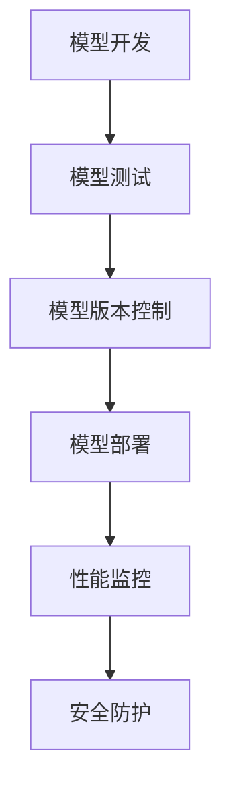

                 

# AI 大模型应用数据中心的发布管理

## 关键词
- AI 大模型
- 数据中心
- 发布管理
- 模型部署
- 管理流程
- 算法优化

## 摘要
本文将深入探讨人工智能大模型在数据中心中的发布管理。从背景介绍到核心概念与联系，再到具体算法原理和操作步骤，本文将一步步引导读者了解如何高效地管理和发布大模型。同时，通过实际应用场景的剖析和工具资源的推荐，本文将为读者提供一个全面的指南，以应对未来发展趋势和挑战。

## 1. 背景介绍

随着人工智能技术的飞速发展，大模型（如Transformer、BERT等）已成为各个行业的重要驱动力。这些模型在处理海量数据、进行复杂任务时具有卓越的表现。然而，大模型的开发和部署并非易事，它们需要大量的计算资源和专业的运维管理。数据中心作为大数据和AI技术的核心基础设施，承载着大模型的高效运行和发布。

数据中心在AI领域的地位日益显著，其主要功能包括数据存储、计算能力提供、网络连接和安全管理。随着AI技术的发展，数据中心不仅需要满足传统的IT需求，还要适应大规模AI模型的特殊要求。这包括提供高性能计算资源、低延迟网络连接以及稳定可靠的运行环境。

发布管理是数据中心的一项重要任务，它涉及大模型的版本控制、部署策略、性能优化和安全性保障。有效的发布管理可以确保模型的稳定运行，提高生产效率，降低运维成本。然而，随着模型规模的不断扩大，发布管理的复杂性也在增加。本文将详细介绍大模型的发布管理流程，为数据中心管理者提供实用的指导。

## 2. 核心概念与联系

### 数据中心架构

数据中心通常由计算节点、存储节点和网络节点组成。计算节点负责执行模型训练和推理任务，存储节点用于存储数据和管理模型文件，网络节点则提供高速数据传输和连接服务。

### 大模型特性

大模型具有以下特性：
- **参数量巨大**：如BERT模型包含数亿个参数。
- **计算资源需求高**：大模型训练和推理需要大量的计算资源。
- **数据依赖性强**：模型的性能依赖于高质量的数据集。
- **迭代速度快**：随着数据和技术的发展，模型需要不断更新迭代。

### 发布管理流程

发布管理流程包括以下环节：
1. **模型开发**：包括数据预处理、模型设计和训练。
2. **模型测试**：在模拟环境中验证模型性能，确保其稳定性和可靠性。
3. **模型版本控制**：为每个模型版本建立独立的标识和记录，便于追踪和管理。
4. **模型部署**：将模型部署到生产环境，实现实时推理和响应。
5. **性能监控**：持续监控模型性能，进行优化和调整。
6. **安全防护**：确保模型数据和系统安全，防范潜在威胁。

### Mermaid 流程图



### 模型部署策略

部署策略包括：
- **静态部署**：模型文件直接部署到服务器，适用于低并发场景。
- **动态部署**：基于容器或虚拟化技术，实现模型的动态加载和弹性扩展，适用于高并发场景。
- **集群部署**：将模型分布到多个服务器节点，实现负载均衡和容错。

## 3. 核心算法原理 & 具体操作步骤

### 训练过程

大模型的训练过程主要包括以下步骤：
1. **数据预处理**：对原始数据进行清洗、归一化等处理，确保数据质量。
2. **模型初始化**：随机初始化模型参数，为训练过程准备初始状态。
3. **前向传播**：将输入数据传递到模型，计算输出结果。
4. **反向传播**：计算损失函数，反向更新模型参数。
5. **优化算法**：使用如Adam、SGD等优化算法，加速收敛过程。

### 部署过程

部署过程的步骤如下：
1. **模型打包**：将训练好的模型打包为可部署的格式，如ONNX、TensorFlow Lite等。
2. **模型转换**：根据部署环境的要求，将模型转换为特定格式。
3. **部署配置**：配置部署环境，包括计算资源、网络配置等。
4. **模型部署**：将模型部署到服务器，实现实时推理和响应。
5. **性能调优**：根据实际性能，调整模型参数和部署配置。

### 模型监控与优化

模型监控与优化包括：
1. **性能监控**：监控模型运行过程中的各项指标，如响应时间、吞吐量等。
2. **日志记录**：记录模型运行过程中的日志信息，便于故障排查和性能优化。
3. **错误处理**：对模型运行过程中出现的异常进行处理，确保系统稳定运行。
4. **性能调优**：根据监控数据，调整模型参数和部署配置，提高模型性能。

## 4. 数学模型和公式 & 详细讲解 & 举例说明

### 损失函数

损失函数是衡量模型预测结果与真实值之间差异的指标，常用的损失函数包括：
- **均方误差（MSE）**：
  $$MSE = \frac{1}{n}\sum_{i=1}^{n}(y_i - \hat{y}_i)^2$$
- **交叉熵（Cross-Entropy）**：
  $$Cross-Entropy = -\frac{1}{n}\sum_{i=1}^{n}y_i\log(\hat{y}_i)$$

### 优化算法

常用的优化算法包括：
- **随机梯度下降（SGD）**：
  $$w_{t+1} = w_t - \alpha \frac{\partial J(w_t)}{\partial w_t}$$
- **Adam算法**：
  $$m_t = \beta_1m_{t-1} + (1 - \beta_1)\frac{\partial J(w_t)}{\partial w_t}$$
  $$v_t = \beta_2v_{t-1} + (1 - \beta_2)\left(\frac{\partial J(w_t)}{\partial w_t}\right)^2$$
  $$w_{t+1} = w_t - \alpha \frac{m_t}{\sqrt{v_t} + \epsilon}$$

### 举例说明

假设我们使用MSE损失函数和SGD优化算法训练一个简单的线性回归模型，目标是最小化损失函数：
1. **数据准备**：生成一组输入和输出数据。
2. **模型初始化**：初始化模型参数，如权重和偏置。
3. **前向传播**：将输入数据传递到模型，计算预测结果。
4. **反向传播**：计算损失函数，并反向更新模型参数。
5. **迭代训练**：重复前向传播和反向传播过程，直到模型收敛。

## 5. 项目实战：代码实际案例和详细解释说明

### 5.1 开发环境搭建

在开始项目实战之前，我们需要搭建一个合适的开发环境。以下是环境搭建的步骤：

1. **安装Python**：确保Python版本为3.7或更高。
2. **安装依赖库**：使用pip安装以下依赖库：numpy、tensorflow、scikit-learn等。
3. **配置环境变量**：设置环境变量，便于后续操作。

### 5.2 源代码详细实现和代码解读

以下是一个简单的线性回归模型实现，包括数据预处理、模型训练和模型部署：

```python
import numpy as np
import tensorflow as tf
from sklearn.datasets import make_regression
from sklearn.model_selection import train_test_split

# 数据准备
X, y = make_regression(n_samples=1000, n_features=1, noise=0.1, random_state=42)
X_train, X_test, y_train, y_test = train_test_split(X, y, test_size=0.2, random_state=42)

# 模型初始化
model = tf.keras.Sequential([
    tf.keras.layers.Dense(units=1, input_shape=(1,))
])

# 编译模型
model.compile(optimizer='sgd', loss='mse')

# 训练模型
model.fit(X_train, y_train, epochs=100, verbose=0)

# 部署模型
model.evaluate(X_test, y_test, verbose=2)
```

### 5.3 代码解读与分析

上述代码实现了一个简单的线性回归模型，其核心步骤如下：

1. **数据准备**：使用`make_regression`函数生成模拟数据，并划分为训练集和测试集。
2. **模型初始化**：创建一个全连接层（Dense Layer），输入形状为（1,），输出形状为（1,）。
3. **编译模型**：指定优化器和损失函数，准备训练模型。
4. **训练模型**：使用`fit`方法训练模型，设置训练轮次和日志级别。
5. **部署模型**：使用`evaluate`方法评估模型在测试集上的性能。

该代码展示了线性回归模型的基本实现，实际项目中可能涉及更复杂的模型和更详细的配置。通过逐步分析代码，我们可以了解模型训练和部署的基本流程。

## 6. 实际应用场景

大模型在数据中心的应用场景非常广泛，以下是一些典型的实际应用场景：

### 自然语言处理

自然语言处理（NLP）是AI领域的一个重要分支，大模型在NLP任务中表现出色。例如，BERT模型在文本分类、机器翻译、情感分析等任务上取得了显著成果。数据中心可以根据业务需求，部署NLP大模型，实现高效的文本处理和分析。

### 计算机视觉

计算机视觉是AI领域的另一个重要方向，大模型在图像分类、目标检测、人脸识别等任务上具有强大的能力。例如，ResNet、Inception等模型在图像分类任务上取得了很好的效果。数据中心可以部署这些大模型，提供高效的图像处理和分析服务。

### 金融服务

金融服务行业对数据质量和实时性要求极高，大模型可以用于风险控制、欺诈检测、信用评分等任务。例如，LSTM模型在时间序列分析中表现出色，可以用于预测股票价格和交易策略。数据中心可以部署这些大模型，提供智能化的金融服务。

### 医疗健康

医疗健康行业需要处理大量的医疗数据，大模型可以用于疾病预测、诊断辅助、药物研发等任务。例如，CancerCellMap模型可以用于预测癌症患者的生存率，帮助医生制定更有效的治疗方案。数据中心可以部署这些大模型，为医疗健康行业提供智能化的支持。

## 7. 工具和资源推荐

### 7.1 学习资源推荐

- **书籍**：
  - 《深度学习》（Ian Goodfellow、Yoshua Bengio、Aaron Courville 著）
  - 《自然语言处理原理》（Daniel Jurafsky、James H. Martin 著）
  - 《计算机视觉：算法与应用》（Shoushun Wang、Zhiyun Qian 著）

- **论文**：
  - BERT: Pre-training of Deep Bidirectional Transformers for Language Understanding（Devlin et al., 2018）
  - EfficientNet: Rethinking Model Scaling for Convolutional Neural Networks（Liu et al., 2020）
  - GPT-3: Language Models are few-shot learners（Brown et al., 2020）

- **博客**：
  - fast.ai：https://www.fast.ai/
  - Medium：https://medium.com/
  - 知乎：https://www.zhihu.com/

- **网站**：
  - Kaggle：https://www.kaggle.com/
  - arXiv：https://arxiv.org/
  - Google Research：https://ai.google/research/

### 7.2 开发工具框架推荐

- **深度学习框架**：
  - TensorFlow：https://www.tensorflow.org/
  - PyTorch：https://pytorch.org/
  - MXNet：https://mxnet.apache.org/

- **模型部署工具**：
  - TensorFlow Serving：https://www.tensorflow.org/serving/
  - ONNX Runtime：https://onnx.ai/
  - TensorFlow Lite：https://www.tensorflow.org/lite/

- **容器化工具**：
  - Docker：https://www.docker.com/
  - Kubernetes：https://kubernetes.io/

### 7.3 相关论文著作推荐

- **论文**：
  - Transformer: A Novel Neural Network Architecture for Language Understanding（Vaswani et al., 2017）
  - BERT: Pre-training of Deep Bidirectional Transformers for Language Understanding（Devlin et al., 2018）
  - GPT-3: Language Models are few-shot learners（Brown et al., 2020）

- **著作**：
  - 《深度学习》（Ian Goodfellow、Yoshua Bengio、Aaron Courville 著）
  - 《强化学习》（Richard S. Sutton、Andrew G. Barto 著）
  - 《自然语言处理综合教程》（Daniel Jurafsky、James H. Martin 著）

## 8. 总结：未来发展趋势与挑战

未来，大模型在数据中心的应用将呈现以下趋势：

1. **模型规模持续扩大**：随着计算资源和数据集的不断增加，大模型将变得更加庞大和复杂。
2. **模型优化与高效部署**：如何高效地优化和部署大模型，是当前和未来需要解决的重要问题。
3. **跨领域融合**：大模型将在更多领域实现跨领域融合，如医疗、金融、教育等，带来更多的应用场景。

然而，大模型在数据中心的应用也面临一些挑战：

1. **计算资源需求**：大模型训练和推理需要大量的计算资源，如何高效利用现有资源是一个难题。
2. **数据质量与安全性**：高质量的数据是保证大模型性能的关键，同时，如何确保数据的安全性也是一个重要问题。
3. **法律法规与伦理问题**：随着大模型在各个领域的应用，相关的法律法规和伦理问题也需要引起关注。

总之，大模型在数据中心的应用前景广阔，但也需要克服诸多挑战。通过不断的技术创新和优化，我们有信心实现大模型的高效管理和发布。

## 9. 附录：常见问题与解答

### Q：如何确保大模型的数据质量和安全性？

A：确保大模型的数据质量和安全性需要采取以下措施：
- **数据清洗与预处理**：对原始数据进行全面清洗和预处理，确保数据质量。
- **数据加密与访问控制**：对敏感数据进行加密，并设置严格的访问控制策略，确保数据安全。
- **数据备份与恢复**：定期备份数据，并制定数据恢复策略，以应对数据丢失或损坏的情况。

### Q：如何优化大模型的计算资源利用率？

A：优化大模型的计算资源利用率可以从以下几个方面入手：
- **分布式计算**：将大模型训练和推理任务分布到多个节点，实现负载均衡和资源利用最大化。
- **模型压缩与剪枝**：通过模型压缩和剪枝技术，减少模型参数数量，降低计算复杂度。
- **高效存储与传输**：采用高效存储和传输技术，减少数据传输延迟，提高计算效率。

### Q：如何确保大模型的稳定性和可靠性？

A：确保大模型的稳定性和可靠性需要采取以下措施：
- **模型测试与验证**：在部署前对模型进行充分的测试和验证，确保其稳定性和可靠性。
- **监控与报警**：实时监控模型运行状态，设置报警机制，及时发现并处理异常情况。
- **容错与恢复**：设计容错和恢复机制，确保在故障发生时，系统能够快速恢复。

## 10. 扩展阅读 & 参考资料

- Devlin, J., Chang, M. W., Lee, K., & Toutanova, K. (2018). BERT: Pre-training of deep bidirectional transformers for language understanding. arXiv preprint arXiv:1810.04805.
- Vaswani, A., Shazeer, N., Parmar, N., Uszkoreit, J., Jones, L., Gomez, A. N., ... & Polosukhin, I. (2017). Attention is all you need. In Advances in neural information processing systems (pp. 5998-6008).
- Brown, T., Mann, B., Ryder, N., Subbiah, M., Kaplan, J., Dhariwal, P., ... & Child, R. (2020). Language models are few-shot learners. arXiv preprint arXiv:2005.14165.
- Goodfellow, I., Bengio, Y., & Courville, A. (2016). Deep learning. MIT press.
- Sutton, R. S., & Barto, A. G. (2018). Reinforcement learning: An introduction. MIT press.
- Jurafsky, D., & Martin, J. H. (2008). Speech and language processing: an introduction to natural language processing, computational linguistics, and speech recognition. Prentice Hall.

