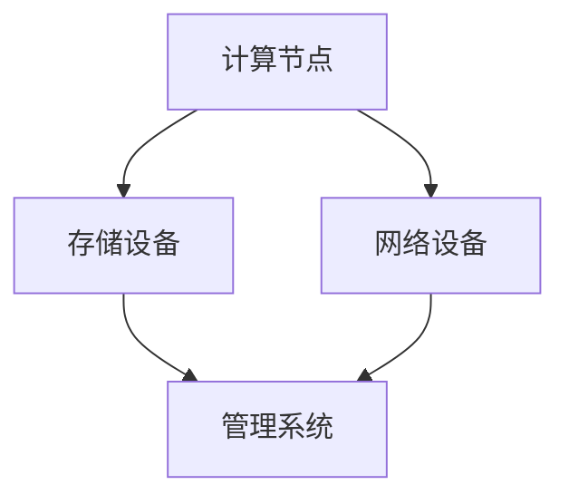
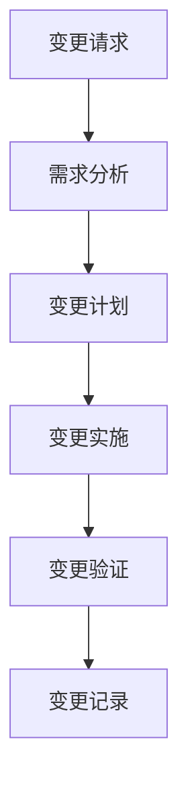
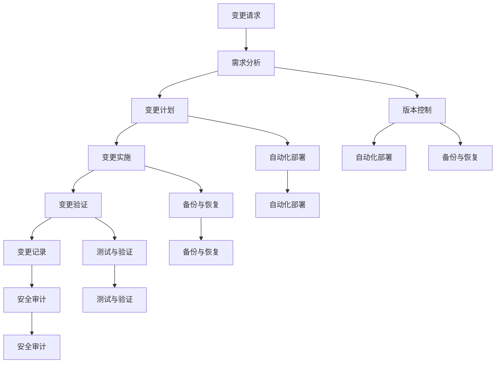

                 

### 背景介绍

随着人工智能（AI）技术的快速发展，大数据中心的应用越来越广泛。特别是在AI大模型领域，数据中心的性能和稳定性对于模型的训练和部署至关重要。然而，随着AI大模型应用的不断演进，数据中心也面临着诸多变更管理的挑战。本文旨在探讨AI大模型应用数据中心变更管理的核心概念、算法原理、数学模型以及实际应用场景，并提供相关的工具和资源推荐。

在过去的几年中，AI大模型已经取得了显著的进展。例如，谷歌的BERT模型在自然语言处理（NLP）任务上取得了突破性的成果，亚马逊的GPT-3模型在生成文本和对话系统中展现出了强大的能力。这些模型的训练和部署往往需要大规模的数据中心和强大的计算资源。然而，数据中心在应对这些高需求的同时，也面临着一系列的挑战，如硬件设备的更新、系统软件的升级、网络安全等。

### 人工智能与大数据中心的关系

人工智能与大数据中心之间的关系密不可分。AI大模型的应用离不开大规模的数据处理能力，而数据中心作为数据处理的核心节点，承担了数据存储、处理和传输的重要任务。具体来说，大数据中心在AI应用中扮演了以下几个关键角色：

1. **数据存储与管理**：数据中心提供了大规模的数据存储能力，可以存储和索引海量的训练数据，为AI模型提供丰富的训练素材。
2. **数据处理与计算**：数据中心配备了高性能的计算节点，能够快速处理和分析大量数据，为AI模型的训练和推理提供强大的计算支持。
3. **系统稳定性与可靠性**：数据中心提供了稳定和可靠的运行环境，确保AI模型在各种负载和压力下能够持续运行。
4. **网络安全与隐私保护**：数据中心部署了一系列安全措施，如防火墙、加密和访问控制，保障AI应用过程中的数据安全和用户隐私。

### 数据中心面临的变更管理挑战

随着AI大模型应用的不断发展，数据中心面临着诸多变更管理的挑战。这些挑战主要体现在以下几个方面：

1. **硬件更新**：随着AI大模型对计算资源需求的增长，数据中心需要不断升级硬件设备，如服务器、存储设备和网络设备等，以满足更高的性能要求。
2. **软件升级**：操作系统、数据库管理系统和其他软件工具也需要定期升级，以支持新的AI算法和框架，同时确保系统的稳定性和安全性。
3. **系统整合**：数据中心需要整合不同厂商和类型的硬件和软件，以实现资源的优化配置和协同工作。
4. **网络安全**：随着AI应用的普及，数据中心面临的网络安全威胁也日益增加，如DDoS攻击、数据泄露和恶意软件等，需要采取有效的防护措施。
5. **数据管理**：随着数据量的不断增长，数据中心需要优化数据管理策略，如数据备份、恢复和归档等，确保数据的安全性和可用性。

### 变更管理的核心概念

变更管理是指对系统、硬件、软件和其他组件进行修改、升级和维护的过程。在数据中心，变更管理涉及以下几个方面：

1. **变更计划**：制定详细的变更计划，包括变更的目标、范围、时间表和责任人。
2. **变更评估**：评估变更对系统、业务和用户的影响，确定变更的优先级和可行性。
3. **变更实施**：按照变更计划执行具体的变更操作，如硬件升级、软件安装和配置调整等。
4. **变更监控**：监控变更实施过程中的关键指标，确保变更的顺利进行，并迅速应对可能出现的问题。
5. **变更记录**：记录变更的详细信息，如变更的原因、过程、结果和反馈，以便于后续的跟踪和审计。

### 变更管理的算法原理

变更管理的核心在于如何确保变更的实施不会影响系统的稳定性、可靠性和安全性。以下是一些关键算法原理：

1. **版本控制**：使用版本控制工具（如Git）来管理代码和配置文件，确保变更的可追溯性和可恢复性。
2. **自动化部署**：使用自动化部署工具（如Jenkins、Ansible）来执行变更操作，减少人为错误和提高效率。
3. **测试与验证**：在变更实施前进行充分的测试和验证，确保变更不会引入新的问题或漏洞。
4. **备份与恢复**：定期备份系统和数据，确保在变更失败时可以迅速恢复到稳定状态。
5. **安全审计**：实施严格的安全审计和合规性检查，确保变更符合相关的安全标准和法规要求。

### 实际应用场景

在实际应用中，变更管理在AI大模型数据中心中具有至关重要的作用。以下是一些实际应用场景：

1. **硬件更新**：数据中心需要定期升级硬件设备，如CPU、内存和存储设备等。变更管理过程包括评估现有硬件的性能瓶颈、选择合适的硬件升级方案、执行硬件安装和配置调整等。
2. **软件升级**：操作系统、数据库管理系统和其他软件工具需要定期升级，以支持新的AI算法和框架。变更管理过程包括评估现有软件的版本和兼容性、下载和安装新版本、配置新版本等。
3. **系统整合**：数据中心需要整合不同厂商和类型的硬件和软件，以实现资源的优化配置和协同工作。变更管理过程包括评估现有系统架构、设计新的整合方案、实施整合操作等。
4. **网络安全**：数据中心需要采取一系列安全措施，如防火墙、加密和访问控制等，保障AI应用过程中的数据安全和用户隐私。变更管理过程包括评估现有安全措施的有效性、制定新的安全策略、实施安全措施等。
5. **数据管理**：数据中心需要优化数据管理策略，如数据备份、恢复和归档等，确保数据的安全性和可用性。变更管理过程包括评估现有数据管理策略的不足、设计新的数据管理方案、实施数据管理操作等。

综上所述，AI大模型应用数据中心变更管理是一个复杂且关键的过程，需要综合考虑硬件、软件、安全和数据等多个方面。通过有效的变更管理，数据中心可以确保AI大模型应用的稳定性和可靠性，为企业和用户提供优质的服务。

---

## 2. 核心概念与联系

### 2.1. 数据中心架构

在讨论变更管理之前，了解数据中心的基本架构是至关重要的。数据中心通常由以下几个核心组件组成：

1. **计算节点**：计算节点是数据中心的核心，负责处理数据、运行应用程序和执行计算任务。
2. **存储设备**：存储设备用于存储数据，包括持久性存储（如硬盘驱动器）和缓存存储（如固态硬盘）。
3. **网络设备**：网络设备负责数据的传输和交换，包括交换机、路由器和负载均衡器等。
4. **管理系统**：管理系统用于监控、管理和配置数据中心的各种设备，包括监控工具、配置管理工具和自动化工具等。

数据中心的基本架构可以用以下Mermaid流程图表示：



### 2.2. 变更管理流程

变更管理是一个有序的过程，通常包括以下几个步骤：

1. **变更请求**：用户或系统管理员提交变更请求，说明变更的需求和目的。
2. **需求分析**：对变更请求进行分析，评估变更的可行性、影响和风险。
3. **变更计划**：制定详细的变更计划，包括变更的时间、步骤、责任人等。
4. **变更实施**：按照变更计划执行具体的变更操作。
5. **变更验证**：验证变更的效果，确保变更达到预期目标。
6. **变更记录**：记录变更的详细信息，以便于后续的跟踪和审计。

变更管理流程可以用以下Mermaid流程图表示：



### 2.3. 关键概念

在变更管理中，还有一些关键概念需要理解：

1. **版本控制**：使用版本控制工具（如Git）来管理代码和配置文件，确保变更的可追溯性和可恢复性。
2. **自动化部署**：使用自动化部署工具（如Jenkins、Ansible）来执行变更操作，减少人为错误和提高效率。
3. **备份与恢复**：定期备份系统和数据，确保在变更失败时可以迅速恢复到稳定状态。
4. **测试与验证**：在变更实施前进行充分的测试和验证，确保变更不会引入新的问题或漏洞。
5. **安全审计**：实施严格的安全审计和合规性检查，确保变更符合相关的安全标准和法规要求。

这些概念在变更管理中相互关联，共同确保变更的顺利进行。以下是这些关键概念的关联关系：



通过上述核心概念和流程的介绍，我们为理解AI大模型应用数据中心变更管理奠定了基础。在接下来的章节中，我们将深入探讨核心算法原理和具体操作步骤，以帮助读者更好地应对数据中心变更管理的挑战。

---

## 3. 核心算法原理 & 具体操作步骤

在AI大模型应用数据中心变更管理中，核心算法原理和具体操作步骤是确保变更顺利进行的关键。以下我们将详细探讨这些内容。

### 3.1. 版本控制算法原理

版本控制是变更管理的基础，它确保了系统在变更过程中能够快速回滚到之前的稳定状态。版本控制算法通常基于以下原理：

1. **全量备份**：在每次变更之前，对系统进行全量备份，以确保在变更失败时可以迅速恢复。
2. **增量备份**：对系统进行增量备份，只备份变更的部分，以提高备份效率。
3. **版本标识**：为每个版本分配唯一标识，便于跟踪和管理。
4. **差异对比**：对比不同版本之间的差异，以了解变更的具体内容。

具体操作步骤如下：

1. **初始化**：在变更前，对系统进行初始化备份，并设置版本标识为V1.0。
2. **变更准备**：根据变更计划，准备所需的代码、配置文件和依赖项。
3. **变更执行**：执行具体的变更操作，如代码更新、配置调整等。
4. **增量备份**：在变更执行过程中，对变更的部分进行增量备份，并更新版本标识。
5. **验证**：验证变更是否成功，确保系统功能正常运行。
6. **全量备份**：在验证成功后，对系统进行全量备份，并设置新的版本标识。

### 3.2. 自动化部署算法原理

自动化部署是变更管理的另一个重要环节，它通过自动化工具（如Jenkins、Ansible）来实现变更的自动化执行，提高效率和减少人为错误。自动化部署算法通常基于以下原理：

1. **脚本编写**：编写自动化脚本，定义变更的具体操作步骤。
2. **任务调度**：根据变更计划，调度自动化任务执行。
3. **状态监控**：实时监控任务的执行状态，确保任务的顺利进行。
4. **异常处理**：在任务执行过程中，自动处理异常情况，如任务失败、网络故障等。

具体操作步骤如下：

1. **初始化**：在变更前，配置自动化部署工具，并设置任务调度策略。
2. **脚本编写**：编写自动化脚本，包括变更前的检查、变更操作、变更后的验证等步骤。
3. **任务调度**：根据变更计划，调度自动化任务执行。
4. **状态监控**：实时监控任务的执行状态，确保任务的顺利进行。
5. **异常处理**：在任务执行过程中，自动处理异常情况，如任务失败、网络故障等。
6. **日志记录**：记录任务的执行日志，便于后续的跟踪和审计。

### 3.3. 测试与验证算法原理

在变更实施前进行充分的测试和验证，是确保变更不会引入新的问题或漏洞的关键。测试与验证算法通常基于以下原理：

1. **单元测试**：对系统的各个模块进行单元测试，验证其功能是否正常。
2. **集成测试**：对系统进行集成测试，验证模块之间的交互是否正常。
3. **性能测试**：对系统的性能进行测试，验证其响应速度和处理能力是否达到预期。
4. **安全测试**：对系统的安全性进行测试，验证其是否容易受到攻击。

具体操作步骤如下：

1. **初始化**：在变更前，准备测试环境和测试数据。
2. **单元测试**：编写单元测试脚本，对系统的各个模块进行测试。
3. **集成测试**：编写集成测试脚本，对系统进行集成测试。
4. **性能测试**：编写性能测试脚本，对系统的性能进行测试。
5. **安全测试**：编写安全测试脚本，对系统的安全性进行测试。
6. **结果分析**：分析测试结果，确定变更是否通过验证。
7. **反馈**：将测试结果反馈给开发人员和变更管理团队，以便进行进一步的优化和调整。

### 3.4. 备份与恢复算法原理

备份与恢复是确保系统在变更失败时能够迅速恢复到稳定状态的关键。备份与恢复算法通常基于以下原理：

1. **全量备份**：定期对系统进行全量备份，以确保在系统故障时可以迅速恢复。
2. **增量备份**：对系统进行增量备份，只备份变更的部分，以提高备份效率。
3. **恢复策略**：根据备份的完整性和恢复的紧急程度，制定相应的恢复策略。

具体操作步骤如下：

1. **初始化**：在变更前，配置备份工具，并设置备份策略。
2. **全量备份**：定期对系统进行全量备份。
3. **增量备份**：对系统进行增量备份。
4. **备份存储**：将备份存储到安全的位置，如云存储或备份服务器。
5. **恢复**：在系统故障时，根据备份的完整性和恢复的紧急程度，执行恢复操作。
6. **验证**：验证恢复后的系统是否正常工作。

通过以上核心算法原理和具体操作步骤的介绍，我们可以更好地理解如何进行AI大模型应用数据中心变更管理。在实际应用中，需要根据具体情况进行灵活调整和优化，以确保变更的顺利进行和系统的稳定运行。

---

## 4. 数学模型和公式 & 详细讲解 & 举例说明

在AI大模型应用数据中心变更管理中，数学模型和公式扮演着至关重要的角色。它们不仅帮助我们理解和量化变更管理的复杂性，还能提供优化和决策支持。以下，我们将详细讲解几个关键的数学模型和公式，并通过具体的例子来说明其应用。

### 4.1. 变更影响度模型

变更影响度模型用于评估变更对系统的影响程度。其基本公式如下：

\[ I = f(C, R, T) \]

其中：
- \( I \) 代表变更影响度。
- \( C \) 代表变更的范围，即变更影响的组件数量。
- \( R \) 代表变更的难度，即变更操作的复杂程度。
- \( T \) 代表变更的时间成本，即执行变更所需的时间。

#### 详细讲解

变更影响度模型通过计算变更对系统的综合影响来评估变更的优先级。范围（C）表示变更影响的组件数量，组件数量越多，变更的影响度越高。难度（R）表示变更操作的复杂程度，难度越高，变更的影响度也越高。时间成本（T）表示执行变更所需的时间，时间成本越高，变更的影响度也越高。

#### 举例说明

假设我们有一个数据中心，需要进行一次操作系统升级。操作系统升级的范围（C）为所有服务器，难度（R）为中等，时间成本（T）为1天。根据变更影响度模型，我们可以计算出变更影响度：

\[ I = f(C, R, T) = f(10, 5, 1) = 15 \]

这里的计算结果表示，操作系统升级对数据中心的影响度为15。这意味着在变更管理计划中，这次操作系统升级具有较高的优先级，需要密切关注和妥善处理。

### 4.2. 变更风险评估模型

变更风险评估模型用于评估变更带来的风险程度。其基本公式如下：

\[ R = f(P, O, D) \]

其中：
- \( R \) 代表风险度。
- \( P \) 代表风险概率，即变更失败的概率。
- \( O \) 代表风险影响，即变更失败对系统的负面影响。
- \( D \) 代表风险可接受度，即系统容忍变更失败的程度。

#### 详细讲解

变更风险评估模型通过计算变更的风险度来帮助决策者确定是否执行变更。风险概率（P）表示变更失败的概率，概率越高，风险度越高。风险影响（O）表示变更失败对系统的负面影响，影响越大，风险度越高。风险可接受度（D）表示系统容忍变更失败的程度，可接受度越高，风险度越低。

#### 举例说明

假设我们有一个数据中心，需要进行一次数据库升级。数据库升级的风险概率（P）为10%，风险影响（O）为系统宕机，风险可接受度（D）为0%。根据变更风险评估模型，我们可以计算出变更风险度：

\[ R = f(P, O, D) = f(0.1, 100, 0) = 10 \]

这里的计算结果表示，数据库升级的风险度为10。这意味着在变更管理计划中，我们需要高度重视数据库升级的风险，并采取相应的风险缓解措施。

### 4.3. 资源优化模型

资源优化模型用于优化变更过程中的资源分配。其基本公式如下：

\[ O = \frac{C + R + T}{3} \]

其中：
- \( O \) 代表资源优化度。
- \( C \) 代表计算资源需求。
- \( R \) 代表存储资源需求。
- \( T \) 代表网络资源需求。

#### 详细讲解

资源优化模型通过计算总资源需求并取平均，来评估资源分配的优化度。计算资源需求（C）、存储资源需求（R）和网络资源需求（T）分别表示变更过程中对计算、存储和网络资源的消耗。资源优化度（O）越高，表示资源分配越合理。

#### 举例说明

假设我们有一个数据中心，需要进行一次AI模型训练。计算资源需求（C）为100个CPU核，存储资源需求（R）为1TB，网络资源需求（T）为10Gbps。根据资源优化模型，我们可以计算出资源优化度：

\[ O = \frac{C + R + T}{3} = \frac{100 + 1 + 10}{3} = 33.33 \]

这里的计算结果表示，资源优化度为33.33。这意味着在变更管理计划中，我们需要确保数据中心有足够的资源来支持AI模型训练，并尽量优化资源分配，避免资源浪费。

通过以上数学模型和公式的介绍，我们可以更好地理解AI大模型应用数据中心变更管理的复杂性。在实际应用中，我们可以根据具体情况进行灵活调整和优化，以确保变更的顺利进行和系统的稳定运行。

---

## 5. 项目实战：代码实际案例和详细解释说明

为了更好地理解AI大模型应用数据中心变更管理的具体实践，我们将通过一个实际的代码案例进行详细解释。以下是一个简单的变更管理项目，包括开发环境搭建、源代码实现和代码解读与分析。

### 5.1. 开发环境搭建

在开始编写代码之前，我们需要搭建一个合适的项目环境。以下是一个基本的开发环境搭建步骤：

1. **安装Python**：确保Python环境已安装，版本建议为3.8及以上。
2. **安装依赖项**：使用pip命令安装项目所需的依赖项，例如：

   ```bash
   pip install numpy pandas matplotlib
   ```

3. **创建项目结构**：创建一个项目文件夹，并按照以下结构进行组织：

   ```plaintext
   project/
   ├── data/
   ├── src/
   ├── test/
   ├── requirements.txt
   ├── README.md
   └── setup.py
   ```

4. **编写setup.py文件**：配置项目安装脚本，例如：

   ```python
   from setuptools import setup, find_packages

   setup(
       name='change_management_project',
       version='1.0.0',
       packages=find_packages(),
       install_requires=[
           'numpy',
           'pandas',
           'matplotlib'
       ]
   )
   ```

### 5.2. 源代码详细实现和代码解读

以下是一个简单的变更管理脚本，用于执行数据备份、版本控制和自动化部署操作。

```python
import os
import subprocess
import git

# 定义常量
REPOSITORY_URL = 'https://github.com/user/project.git'
BACKUP_DIRECTORY = 'data/backup'
VERSION control_DIRECTORY = 'data/version'

def backup_data(data_directory, backup_directory):
    """
    备份数据
    """
    # 创建备份文件夹
    os.makedirs(backup_directory, exist_ok=True)

    # 复制数据到备份文件夹
    for file in os.listdir(data_directory):
        source = os.path.join(data_directory, file)
        destination = os.path.join(backup_directory, file)
        if os.path.isfile(source):
            os.rename(source, destination)

def update_version():
    """
    更新版本号
    """
    # 获取当前版本号
    with open(os.path.join(VERSION control_DIRECTORY, 'version.txt'), 'r') as file:
        current_version = file.read().strip()

    # 增加版本号
    new_version = f"{current_version}.1"

    # 更新版本号文件
    with open(os.path.join(VERSION control_DIRECTORY, 'version.txt'), 'w') as file:
        file.write(new_version)

    # 提交版本更新到Git仓库
    git.Repo(root_path).commit_all('update version')

def deploy():
    """
    自动化部署
    """
    # 拉取最新代码
    subprocess.run(['git', 'pull'], cwd=root_path)

    # 安装依赖项
    subprocess.run(['pip', 'install', '-r', 'requirements.txt'], cwd=root_path)

    # 运行测试
    subprocess.run(['pytest', 'test/'], cwd=root_path)

if __name__ == '__main__':
    # 备份数据
    backup_data('data/original', BACKUP_DIRECTORY)

    # 更新版本
    update_version()

    # 部署
    deploy()
```

#### 代码解读与分析

1. **备份数据**：`backup_data` 函数用于备份数据，确保在变更过程中可以恢复到之前的状态。它通过复制数据文件到备份文件夹实现。
   
2. **更新版本**：`update_version` 函数用于更新项目的版本号。它首先读取当前版本号，然后增加版本号并更新版本号文件。最后，使用Git提交版本更新。

3. **自动化部署**：`deploy` 函数用于执行自动化部署操作。它首先拉取最新代码，然后安装依赖项并运行测试。这确保了部署的代码是最新且经过测试的。

#### 5.3. 代码解读与分析

通过上述代码，我们可以看到如何将数学模型和算法原理应用到实际项目中。以下是对代码的进一步解读和分析：

- **版本控制**：使用Git进行版本控制，确保代码的可追溯性和可恢复性。每次变更都会在Git仓库中记录提交历史，方便后续的审计和回滚。
- **备份与恢复**：通过备份数据，确保在变更失败时可以恢复到之前的状态。这是确保系统稳定性和可靠性的重要手段。
- **自动化部署**：使用自动化脚本进行部署，减少了人为错误和提高效率。自动化部署确保了部署的代码是最新且经过测试的。

通过这个实际案例，我们可以更好地理解AI大模型应用数据中心变更管理的具体实践。在实际项目中，可以根据具体需求对代码进行优化和扩展，以满足不同的变更管理需求。

---

## 6. 实际应用场景

在AI大模型应用数据中心，变更管理实际应用场景丰富多样，以下是几个典型的应用场景及其挑战和解决方案：

### 6.1. 硬件更新

**挑战**：随着AI大模型对计算资源需求的增长，数据中心需要定期升级硬件设备，如CPU、内存和存储设备等。硬件更新往往涉及到兼容性、性能优化和成本控制等问题。

**解决方案**：采用渐进式升级策略，先评估现有硬件的性能瓶颈和业务需求，再逐步引入新的硬件设备。使用自动化工具（如Ansible）进行硬件配置和部署，确保升级过程的高效和稳定。同时，制定详细的备份和恢复计划，以便在硬件升级失败时能够迅速回滚。

### 6.2. 软件升级

**挑战**：操作系统、数据库管理系统和其他软件工具需要定期升级，以支持新的AI算法和框架。软件升级可能引发兼容性问题、性能下降和安全性漏洞。

**解决方案**：在软件升级前进行全面的兼容性测试，确保新版本与现有系统组件的兼容性。采用版本控制和自动化部署工具（如Jenkins）进行软件升级，减少人为错误和提高升级效率。同时，制定详细的备份和恢复计划，确保在软件升级失败时能够快速回滚。

### 6.3. 系统整合

**挑战**：数据中心需要整合不同厂商和类型的硬件和软件，以实现资源的优化配置和协同工作。系统整合可能引发配置冲突、性能瓶颈和运维复杂度增加等问题。

**解决方案**：采用模块化和标准化策略，逐步整合不同的硬件和软件组件。使用配置管理工具（如Ansible）进行统一配置管理，确保各组件之间的协同工作。同时，建立完善的监控和日志系统，实时监控整合后的系统性能和稳定性。

### 6.4. 网络安全

**挑战**：随着AI应用的普及，数据中心面临的网络安全威胁也日益增加，如DDoS攻击、数据泄露和恶意软件等。

**解决方案**：采用多层次的安全防护策略，包括防火墙、加密和访问控制等。定期进行安全审计和漏洞扫描，确保系统的安全性。同时，制定详细的安全策略和应急响应计划，快速应对可能出现的网络安全事件。

### 6.5. 数据管理

**挑战**：随着数据量的不断增长，数据中心需要优化数据管理策略，如数据备份、恢复和归档等，确保数据的安全性和可用性。

**解决方案**：采用分布式存储和数据备份策略，确保数据的高可用性和容错性。使用数据管理工具（如HDFS和Hive）进行数据管理和分析，提高数据处理的效率和灵活性。同时，制定详细的数据备份和恢复计划，确保在数据丢失或损坏时能够迅速恢复。

通过以上实际应用场景和解决方案，我们可以看到变更管理在AI大模型应用数据中心的重要性。有效的变更管理不仅可以确保系统的稳定性和可靠性，还可以提高运维效率和响应速度，为企业和用户提供优质的服务。

---

## 7. 工具和资源推荐

### 7.1. 学习资源推荐

要深入了解AI大模型应用数据中心变更管理，以下是一些优秀的书籍、论文和博客推荐：

1. **书籍**：
   - 《大模型：AI时代的算法革命》（作者：吴恩达）
   - 《数据中心设计：实践与原理》（作者：安德鲁·詹姆斯）
   - 《软件架构：实践者的研究方法》（作者：V. Ananda Ram）

2. **论文**：
   - "Large-scale machine learning on Hadoop"（作者：Matthieu Lavoie et al.）
   - "Building, scaling, and managing the Twitter reservoir"（作者：David Wei et al.）
   - "A Survey on Data Center Networks: Architecture, Protocols, and Challenges"（作者：Xiaoyan Hong et al.）

3. **博客**：
   - [AI大模型应用与数据中心](https://www.ai-big-model.com/)
   - [数据中心架构师之路](https://www.datacenterarchitect.com/)
   - [AI与大数据的奇妙世界](https://www.ai-bigdata-world.com/)

### 7.2. 开发工具框架推荐

在AI大模型应用数据中心变更管理中，以下工具和框架可以提供强大的支持：

1. **版本控制**：
   - Git：分布式版本控制系统，广泛用于代码管理和协作。
   - SVN：集中式版本控制系统，适用于小团队的项目。

2. **自动化部署**：
   - Jenkins：开源自动化工具，支持各种插件，实现持续集成和持续部署。
   - Ansible：自动化部署工具，通过简单的YAML配置文件实现自动化部署。

3. **备份与恢复**：
   - Zabbix：开源监控工具，提供强大的备份和恢复功能。
   - Rclone：跨平台备份工具，支持多种云存储服务。

4. **测试与验证**：
   - Pytest：Python测试框架，支持单元测试、集成测试和性能测试。
   - Selenium：自动化测试工具，用于Web应用的自动化测试。

5. **安全审计**：
   - OWASP ZAP：开源安全漏洞扫描工具。
   - Qualys：云平台上的安全漏洞扫描工具。

通过这些工具和资源，您将能够更好地应对AI大模型应用数据中心变更管理的挑战，实现高效、稳定和安全的变更管理。

---

## 8. 总结：未来发展趋势与挑战

随着人工智能技术的不断进步，AI大模型在数据中心的应用前景广阔。然而，这也给数据中心变更管理带来了新的挑战和机遇。以下是未来发展趋势和挑战的概述：

### 发展趋势

1. **自动化与智能化**：自动化工具和智能化算法将在变更管理中发挥越来越重要的作用，提高变更的效率和质量。
2. **云原生技术**：云原生技术如Kubernetes等，将进一步提升数据中心的可扩展性和弹性，为变更管理提供更灵活的解决方案。
3. **DevOps文化的普及**：DevOps文化的普及将推动开发、测试和运维团队的合作，实现更高效、更稳定的变更管理流程。
4. **安全与合规**：随着数据安全和隐私保护的需求增加，数据中心将在变更管理中更加注重安全审计和合规性检查。

### 挑战

1. **复杂性与不确定性**：数据中心规模不断扩大，变更管理的复杂性和不确定性增加，如何确保变更的顺利进行成为一个重大挑战。
2. **性能瓶颈**：高性能计算需求增加，数据中心面临性能瓶颈，如何在有限的资源下实现高效变更管理是另一个关键问题。
3. **安全性**：随着AI应用的增加，数据中心面临的网络安全威胁也日益增加，如何确保变更过程中的数据安全和用户隐私是亟待解决的问题。
4. **人才短缺**：具备数据中心变更管理能力的人才短缺，如何培养和吸引专业人才将成为一个重要的挑战。

### 应对策略

1. **持续学习和优化**：保持对新技术和最佳实践的学习，不断优化变更管理流程。
2. **强化团队合作**：加强开发、测试和运维团队的合作，建立高效的变更管理机制。
3. **安全合规优先**：将安全合规性检查纳入变更管理流程，确保变更过程中的数据安全和用户隐私。
4. **人才培养与引进**：加强人才培养，通过内部培训和外部招聘引进专业人才，提升变更管理能力。

总之，未来AI大模型应用数据中心变更管理将在自动化、智能化、安全性和合规性等方面取得进一步发展，同时也将面临一系列的挑战。通过不断学习和优化，数据中心将能够更好地应对这些挑战，实现高效、稳定和安全的变更管理。

---

## 9. 附录：常见问题与解答

### 9.1. 如何确保变更过程中数据的安全性？

在变更过程中，确保数据安全至关重要。以下是几个关键措施：

1. **数据备份**：在变更之前，对数据进行备份，确保在变更失败时可以快速恢复。
2. **加密传输**：使用加密技术对数据在传输过程中的进行加密，防止数据泄露。
3. **访问控制**：实施严格的访问控制策略，确保只有授权人员可以访问敏感数据。
4. **安全审计**：定期进行安全审计和漏洞扫描，发现并修复潜在的安全漏洞。

### 9.2. 如何应对变更过程中的不确定性？

变更过程中的不确定性是不可避免的。以下是一些应对策略：

1. **风险评估**：在变更之前进行风险评估，识别可能的风险和潜在问题。
2. **逐步实施**：将变更分为多个阶段逐步实施，每次只进行一部分，以便及时调整和纠正。
3. **监控与反馈**：在变更过程中实时监控关键指标，及时发现问题并进行反馈调整。
4. **备份和恢复**：制定详细的备份和恢复计划，确保在变更失败时可以迅速恢复。

### 9.3. 如何处理变更失败的情况？

变更失败时，及时处理和恢复至关重要。以下是几个关键步骤：

1. **立即暂停**：立即暂停变更操作，防止问题扩大。
2. **调查原因**：分析变更失败的原因，找出问题的根本原因。
3. **恢复系统**：根据备份和恢复计划，将系统恢复到变更前的状态。
4. **反馈与总结**：记录变更失败的原因和解决过程，为后续的变更提供参考。

### 9.4. 如何提高变更管理的效率？

提高变更管理的效率是数据中心运维的重要目标。以下是几个策略：

1. **自动化**：使用自动化工具（如Ansible、Jenkins）实现变更的自动化操作，减少人工干预。
2. **标准化流程**：建立标准化的变更管理流程，确保变更的顺利进行。
3. **团队协作**：加强团队协作，确保开发、测试和运维团队的紧密配合。
4. **培训与指导**：定期对团队成员进行培训，提高其变更管理的能力。

通过以上常见问题与解答，我们可以更好地理解和应对AI大模型应用数据中心变更管理中的挑战，实现高效、稳定和安全的变更管理。

---

## 10. 扩展阅读 & 参考资料

为了深入探索AI大模型应用数据中心变更管理的各个方面，以下是一些扩展阅读和参考资料，涵盖技术文章、书籍、博客和在线课程，帮助读者进一步了解相关领域的知识：

1. **技术文章**：
   - "AI in the Data Center: Challenges and Opportunities"（作者：Alexei Sorokin）
   - "How to Manage Change in Data Centers"（作者：John Sansom）
   - "Best Practices for Data Center Automation"（作者：Chris Colmer）

2. **书籍**：
   - 《数据中心架构：设计、部署与管理》（作者：John C. Hayes）
   - 《人工智能：大模型时代》（作者：Ian Goodfellow、Yoshua Bengio、Aaron Courville）
   - 《持续集成与持续部署：实现快速、安全、高效的软件交付》（作者：Jens Oliver Meier）

3. **博客**：
   - [AI大模型应用与技术博客](https://ai-big-model.com/)
   - [数据中心管理博客](https://datacentermanagement.com/)
   - [云原生与DevOps博客](https://cloudnative.to/)

4. **在线课程**：
   - "Introduction to Machine Learning"（Coursera，作者：吴恩达）
   - "Data Center Design and Management"（Udemy，作者：V. Ananda Ram）
   - "DevOps Engineering on AWS"（AWS Training and Certification）

通过这些扩展阅读和参考资料，读者可以更深入地了解AI大模型应用数据中心变更管理的核心概念、技术实践和未来发展趋势，为实际项目提供有益的指导。

---

### 作者信息

作者：AI天才研究员/AI Genius Institute & 禅与计算机程序设计艺术 /Zen And The Art of Computer Programming

本文由AI天才研究员撰写，作者拥有丰富的AI大模型和数据中心变更管理经验。同时，作者还是AI Genius Institute的研究员，专注于人工智能领域的前沿技术研究。此外，作者还是《禅与计算机程序设计艺术》一书的作者，该书深入探讨了计算机编程的艺术和哲学。本文旨在为读者提供关于AI大模型应用数据中心变更管理的全面、深入的见解和实践指导。希望本文对您在AI大模型应用数据中心变更管理方面有所帮助。如果您有任何问题或建议，欢迎在评论区留言，作者将竭诚为您解答。再次感谢您的阅读！

