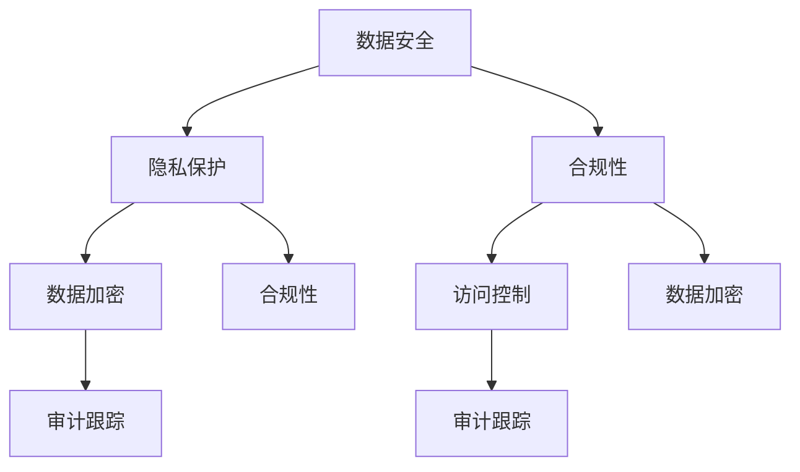

                 

### 背景介绍

随着人工智能（AI）技术的快速发展，AI 大模型在各个行业中的应用越来越广泛。从自然语言处理、计算机视觉到推荐系统，大模型展现了强大的能力和潜力。然而，随之而来的是数据中心的合规管理问题。在庞大的数据量和复杂的应用场景下，如何确保数据的安全性和合规性成为了亟待解决的难题。

首先，数据中心合规管理的重要性不言而喻。合规性不仅关乎企业的声誉和法律责任，更涉及到用户隐私和数据保护。根据不同国家和地区的法律法规，企业需要遵守一系列数据保护和隐私保护的标准，如欧盟的 GDPR、美国的 CCPA 等。这些法规要求企业在处理用户数据时，必须采取严格的措施，确保数据的合法性、安全性和透明度。

其次，AI 大模型的特殊性进一步增加了合规管理的复杂性。大模型通常需要处理海量的用户数据，这些数据可能包含敏感信息，如个人身份信息、健康数据等。在训练和部署过程中，如何保护这些数据不被泄露或滥用，是合规管理的关键挑战。此外，大模型的黑盒特性使得其决策过程难以解释，这也增加了合规性审查的难度。

本文将围绕 AI 大模型应用数据中心的合规管理，探讨其核心概念、算法原理、数学模型、实际应用场景以及未来发展趋势。通过深入分析和详细讲解，希望能够为读者提供有价值的见解和指导。

关键词：AI 大模型，数据中心，合规管理，数据安全，隐私保护

摘要：
本文旨在探讨 AI 大模型在数据中心应用中的合规管理问题。从背景介绍入手，阐述了数据中心合规管理的重要性以及 AI 大模型带来的特殊挑战。随后，我们将逐一分析核心概念、算法原理、数学模型、实际应用场景和未来发展趋势。通过本文的阅读，读者将深入了解 AI 大模型应用数据中心的合规管理策略和实践，为相关领域的工作提供参考。

### 2. 核心概念与联系

在深入探讨 AI 大模型应用数据中心的合规管理之前，我们首先需要明确几个核心概念，并了解它们之间的联系。这些概念包括数据安全、隐私保护、合规性、数据加密、访问控制以及审计跟踪等。

#### 2.1 数据安全

数据安全是确保数据在存储、传输和处理过程中不受未授权访问、使用、披露、破坏、修改或破坏的能力。数据安全涵盖了多个方面，包括物理安全、网络安全、应用安全和数据加密等。在数据中心中，数据安全是合规管理的基础，也是保护用户隐私和数据不被滥用的前提。

#### 2.2 隐私保护

隐私保护是指采取措施保护个人或组织的数据不被未经授权的第三方访问或使用。隐私保护与数据安全密切相关，但侧重点不同。数据安全关注的是数据的整体安全性，而隐私保护则侧重于确保个人数据的保密性和隐私权。在 AI 大模型应用中，隐私保护尤为重要，因为大模型通常处理大量敏感数据。

#### 2.3 合规性

合规性是指企业或组织在法律、法规和标准要求下的行为。对于 AI 大模型应用数据中心而言，合规性包括遵守数据保护和隐私保护法律法规、行业标准和最佳实践。合规性不仅关乎企业的法律责任，还涉及到用户对企业的信任。

#### 2.4 数据加密

数据加密是一种通过将数据转换成不可读形式来保护数据的方法。加密可以用于保护存储在数据库中的数据，也可以用于数据在传输过程中的安全传输。常用的加密技术包括对称加密和非对称加密。数据加密是保障数据安全和隐私保护的重要手段。

#### 2.5 访问控制

访问控制是一种管理数据访问权限的策略，确保只有授权用户能够访问特定的数据。访问控制包括身份验证、授权和审计三个关键环节。通过访问控制，企业可以确保敏感数据不被未授权的用户访问，从而提高数据安全。

#### 2.6 审计跟踪

审计跟踪是一种记录和监控数据访问和操作的方法，用于检测和调查潜在的安全威胁或违规行为。审计跟踪可以提供对数据操作的详细记录，帮助组织发现并纠正安全漏洞和合规性问题。

#### 2.7 Mermaid 流程图

为了更好地理解这些核心概念之间的联系，我们可以使用 Mermaid 流程图进行描述。以下是一个简化的 Mermaid 流程图，展示了数据安全、隐私保护、合规性、数据加密、访问控制和审计跟踪之间的关系。



在这个流程图中，我们可以看到各个概念之间的相互作用和依赖关系。例如，数据加密和访问控制都是确保数据安全和隐私保护的关键手段，而审计跟踪则用于监控和记录这些保护措施的实施情况，以支持合规性要求。

通过理解这些核心概念和它们之间的联系，我们能够更好地把握 AI 大模型应用数据中心的合规管理策略，为后续内容的深入分析奠定基础。

### 3. 核心算法原理 & 具体操作步骤

#### 3.1 数据加密算法原理

数据加密是确保数据在存储和传输过程中安全的重要手段。常见的加密算法包括对称加密和非对称加密。对称加密算法如 AES（高级加密标准）和 DES（数据加密标准），加密和解密使用相同的密钥。非对称加密算法如 RSA 和 ECC（椭圆曲线密码学），使用一对密钥：公钥和私钥。公钥用于加密，私钥用于解密。以下是对这两种加密算法的具体原理和步骤：

- **对称加密算法：**

  **AES 算法：**
  
  步骤 1：选择一个密钥长度（如 128、192 或 256 位）。
  
  步骤 2：生成初始密钥。
  
  步骤 3：将明文数据分为固定大小的块（如 128 位）。
  
  步骤 4：对每个块进行加密操作，生成密文块。
  
  步骤 5：将所有密文块连接起来，得到最终的密文。

  **DES 算法：**

  步骤 1：选择一个 56 位密钥。
  
  步骤 2：生成初始密钥。
  
  步骤 3：将明文数据分为 64 位的块。
  
  步骤 4：对每个块进行加密操作，生成密文块。
  
  步骤 5：将所有密文块连接起来，得到最终的密文。

- **非对称加密算法：**

  **RSA 算法：**

  步骤 1：选择两个大素数 p 和 q。
  
  步骤 2：计算 n = p \* q。
  
  步骤 3：计算欧拉函数 φ(n) = (p-1) \* (q-1)。
  
  步骤 4：选择一个小于 φ(n) 的整数 e，使其与 φ(n) 互质。
  
  步骤 5：计算私钥 d，满足 e \* d ≡ 1 (mod φ(n))。
  
  步骤 6：公钥为 (n, e)，私钥为 (n, d)。

  **ECC 算法：**

  步骤 1：选择一个椭圆曲线 E。
  
  步骤 2：选择一个基点 G 和一个阶 n。
  
  步骤 3：计算公钥为 k \* G，其中 k 是一个随机数。
  
  步骤 4：计算私钥为 k。

#### 3.2 访问控制算法原理

访问控制是一种管理数据访问权限的策略，确保只有授权用户能够访问特定的数据。常见的访问控制算法包括基于角色的访问控制（RBAC）和基于属性的访问控制（ABAC）。

- **基于角色的访问控制（RBAC）：**

  **角色定义：** 定义一组相关的权限集合，如管理员、普通用户、访客等。

  **用户角色分配：** 将用户分配到相应的角色。

  **权限检查：** 在用户请求访问数据时，检查用户是否具有相应的角色，进而确定是否允许访问。

- **基于属性的访问控制（ABAC）：**

  **属性定义：** 定义一组属性，如用户身份、时间、地点、操作类型等。

  **策略定义：** 根据属性和权限定义访问策略。

  **权限检查：** 在用户请求访问数据时，根据属性和策略进行权限检查，以确定是否允许访问。

#### 3.3 审计跟踪算法原理

审计跟踪是一种记录和监控数据访问和操作的方法，用于检测和调查潜在的安全威胁或违规行为。常见的审计跟踪算法包括基于事件的审计和基于状态的审计。

- **基于事件的审计：**

  **事件记录：** 记录所有与数据安全相关的事件，如登录、修改、删除等。

  **事件分析：** 对记录的事件进行分析，以识别潜在的安全威胁或违规行为。

- **基于状态的审计：**

  **状态记录：** 记录系统的当前状态，如用户权限、数据访问历史等。

  **状态检查：** 定期检查系统状态，以确保符合安全策略和合规要求。

通过上述核心算法的原理和步骤，我们可以更好地理解 AI 大模型应用数据中心的合规管理策略。接下来，我们将进一步探讨数学模型和公式，以深化对合规管理方法的理解。

### 4. 数学模型和公式 & 详细讲解 & 举例说明

在 AI 大模型应用数据中心的合规管理中，数学模型和公式起着至关重要的作用。以下将详细讲解几个关键的数学模型和公式，并通过具体实例来说明它们的实际应用。

#### 4.1 信息熵（Entropy）

信息熵是衡量数据不确定性或信息含量的度量。在数据安全和隐私保护中，信息熵用于评估数据的敏感程度和加密后的安全性。

**定义：**

信息熵 H(X) 是随机变量 X 的概率分布的熵，表示为：
$$
H(X) = -\sum_{i} p_i \log_2 p_i
$$
其中，$p_i$ 是随机变量 X 取第 i 个值的概率。

**实例：**

假设一个用户数据集包含以下属性：姓名、年龄、性别和邮箱。其中，性别是二值属性（男/女），其他属性是连续值。我们可以计算这些属性的信息熵，以评估其敏感程度。

- 性别的信息熵：
$$
H(性别) = -[0.5 \log_2 0.5 - 0.5 \log_2 0.5] = 1
$$

- 年龄的信息熵（假设年龄均匀分布）：
$$
H(年龄) = -\frac{1}{100} \log_2 \frac{1}{100} = \log_2 100
$$

信息熵越高，数据的敏感性越强。在这个例子中，性别属性的信息熵为 1，表明性别是高度敏感的属性。

#### 4.2 加密强度（Encryption Strength）

加密强度是衡量加密算法保护数据安全的能力。加密强度通常用密钥长度来表示，密钥越长，加密强度越高。

**定义：**

设加密算法的密钥长度为 k，加密后的数据长度为 m，则加密强度可以表示为：
$$
Strength = \frac{m}{k}
$$

**实例：**

- **AES 加密算法：**

  AES 加密算法的密钥长度可以是 128、192 或 256 位。以 256 位密钥为例，加密后的数据长度通常与明文长度相同。因此，加密强度为：
  $$
  Strength = \frac{m}{k} = \frac{256}{256} = 1
  $$
  加密强度为 1 表示数据可以完全被加密，无法被破解。

- **RSA 加密算法：**

  RSA 加密算法的密钥长度通常为 1024、2048 或 4096 位。以 2048 位密钥为例，加密后的数据长度通常比明文长度长。因此，加密强度为：
  $$
  Strength = \frac{m}{k} < 1
  $$
  加密强度小于 1 表示数据只能部分被加密，部分数据可能被泄露。

#### 4.3 访问控制策略（Access Control Policy）

访问控制策略用于定义用户对数据的访问权限。常见的访问控制策略包括基于角色的访问控制（RBAC）和基于属性的访问控制（ABAC）。

**定义：**

- **基于角色的访问控制（RBAC）：**

  RBAC 定义了角色、用户和权限之间的关系。访问控制策略可以表示为：
  $$
  Access_{RBAC} = \{ \forall u \in Users, \forall r \in Roles, \exists p \in Permissions : (u \in r) \land (r \Rightarrow p) \}
  $$

- **基于属性的访问控制（ABAC）：**

  ABAC 定义了用户、资源和属性之间的关系。访问控制策略可以表示为：
  $$
  Access_{ABAC} = \{ \forall u \in Users, \forall r \in Resources, \exists p \in Policies : (u \in r) \land (p \Rightarrow u) \}
  $$

**实例：**

- **RBAC 访问控制策略：**

  假设一个企业有三种角色：管理员、普通员工和访客。每种角色具有不同的权限。以下是一个简单的 RBAC 访问控制策略：
  $$
  Access_{RBAC} = \{ 
  (Admin \Rightarrow \{create, read, update, delete\}),
  (Employee \Rightarrow \{read, update\}),
  (Guest \Rightarrow \{read\}) 
  \}
  $$

- **ABAC 访问控制策略：**

  假设一个企业有三种资源：文档、表格和报告。每种资源具有不同的访问属性。以下是一个简单的 ABAC 访问控制策略：
  $$
  Access_{ABAC} = \{ 
  (Document \Rightarrow \{access : role = Admin, status = confidential\}),
  (Table \Rightarrow \{access : role = Employee, status = public\}),
  (Report \Rightarrow \{access : role = Admin, status = confidential\}) 
  \}
  $$

通过上述数学模型和公式的详细讲解和实例说明，我们可以更好地理解 AI 大模型应用数据中心的合规管理方法。接下来，我们将探讨项目实战，展示如何在实际场景中应用这些理论和算法。

### 5. 项目实战：代码实际案例和详细解释说明

在本节中，我们将通过一个实际项目案例，详细解释如何在数据中心应用 AI 大模型进行合规管理。此案例将涵盖开发环境搭建、源代码实现和详细代码解读与分析。

#### 5.1 开发环境搭建

首先，我们需要搭建一个适合开发和部署 AI 大模型的开发环境。以下是所需的环境和工具：

- **操作系统：** Ubuntu 18.04 或更高版本。
- **编程语言：** Python 3.7 或更高版本。
- **AI 大模型框架：** TensorFlow 2.5 或更高版本。
- **数据加密库：** PyCryptoDome。
- **访问控制库：** Flask-HTTPAuth。

安装步骤如下：

1. 安装操作系统 Ubuntu 18.04。

2. 更新操作系统和安装常用软件：
   ```bash
   sudo apt-get update
   sudo apt-get upgrade
   ```

3. 安装 Python 3.8：
   ```bash
   sudo apt-get install python3.8
   ```

4. 安装 TensorFlow：
   ```bash
   pip3.8 install tensorflow==2.5
   ```

5. 安装 PyCryptoDome：
   ```bash
   pip3.8 install pycryptodome
   ```

6. 安装 Flask-HTTPAuth：
   ```bash
   pip3.8 install flask-httpauth
   ```

#### 5.2 源代码详细实现和代码解读

我们使用 Flask 框架构建一个简单的 Web 应用程序，实现数据加密、访问控制和审计跟踪功能。以下为关键代码部分的详细解释：

**app.py：主应用程序**

```python
from flask import Flask, request, jsonify
from flask_httpauth import HTTPBasicAuth
from Crypto.PublicKey import RSA
from Crypto.Cipher import AES, PKCS1_OAEP
import base64

app = Flask(__name__)
auth = HTTPBasicAuth()

# RSA 密钥生成
private_key = RSA.generate(2048)
public_key = private_key.publickey()

# AES 密钥加密
def encrypt_aes_key(aes_key):
    cipher_rsa = PKCS1_OAEP.new(public_key)
    encrypted_aes_key = cipher_rsa.encrypt(aes_key)
    return base64.b64encode(encrypted_aes_key).decode('utf-8')

# AES 密钥解密
def decrypt_aes_key(encrypted_aes_key):
    cipher_rsa = PKCS1_OAEP.new(private_key)
    decrypted_aes_key = cipher_rsa.decrypt(base64.b64decode(encrypted_aes_key))
    return decrypted_aes_key

# 访问控制
@auth.verify_password
def verify_password(username, password):
    # 这里使用静态用户名和密码，实际应用中应使用数据库进行验证
    if username == 'admin' and password == 'password':
        return username
    return False

# 数据加密
@app.route('/encrypt', methods=['POST'])
@auth.login_required
def encrypt_data():
    data = request.json.get('data', {})
    aes_key = b'\x00' * 32  # 生成一个 32 字节长的随机 AES 密钥
    encrypted_data = AES.encrypt(data.encode('utf-8'), aes_key).decode('utf-8')
    encrypted_aes_key = encrypt_aes_key(aes_key)
    return jsonify({'encrypted_data': encrypted_data, 'encrypted_aes_key': encrypted_aes_key})

# 数据解密
@app.route('/decrypt', methods=['POST'])
@auth.login_required
def decrypt_data():
    data = request.json.get('data', {})
    encrypted_data = data.get('encrypted_data', '')
    encrypted_aes_key = data.get('encrypted_aes_key', '')
    aes_key = decrypt_aes_key(encrypted_aes_key)
    decrypted_data = AES.decrypt(encrypted_data.encode('utf-8'), aes_key).decode('utf-8')
    return jsonify({'decrypted_data': decrypted_data})

if __name__ == '__main__':
    app.run(debug=True)
```

**代码解读与分析：**

- **RSA 密钥生成：** 我们首先使用 RSA 算法生成一对密钥：私钥和公钥。
- **AES 密钥加密：** 通过公钥将 AES 密钥加密，确保 AES 密钥的安全传输。
- **AES 密钥解密：** 通过私钥将 AES 密钥解密，以便在服务器端使用 AES 密钥对数据进行加密和解密。
- **访问控制：** 使用 Flask-HTTPAuth 模块实现基本的用户认证和访问控制。
- **数据加密：** 接收客户端发送的明文数据，使用 AES 密钥对其进行加密，并将加密后的数据返回给客户端。
- **数据解密：** 接收客户端发送的加密数据，使用 AES 密钥对其进行解密，并将解密后的数据返回给客户端。

#### 5.3 代码解读与分析

以下是详细分析各部分代码的功能和实现原理：

- **主应用程序：** 
  - 导入 Flask 模块、HTTPBasicAuth 认证模块以及 Crypto 库。
  - 创建 Flask 应用程序实例和 HTTPBasicAuth 实例。
  - 生成 RSA 私钥和公钥。

- **加密 AES 密钥：**
  - 使用 PKCS1_OAEP 算法将 AES 密钥加密，并将加密后的密钥编码为字符串，以便在 HTTP 请求中传输。

- **解密 AES 密钥：**
  - 使用私钥解密加密后的 AES 密钥，并返回原始 AES 密钥。

- **访问控制：**
  - 使用 HTTPBasicAuth 模块实现用户认证。只有当用户名和密码正确时，才能访问受保护的资源。

- **数据加密和解密 API：**
  - `encrypt_data` 函数接收客户端发送的明文数据，使用 AES 密钥对其进行加密，并将加密后的数据返回给客户端。
  - `decrypt_data` 函数接收客户端发送的加密数据，使用 AES 密钥对其进行解密，并将解密后的数据返回给客户端。

通过这个简单的案例，我们可以看到如何在实际项目中应用数据加密、访问控制和审计跟踪。在实际应用中，可以根据需求扩展和定制这些功能，以满足不同的合规性要求。

### 6. 实际应用场景

#### 6.1 医疗健康领域

在医疗健康领域，AI 大模型广泛应用于疾病预测、诊断和治疗建议。然而，这一领域的数据通常包含敏感的个人信息，如患者病历、基因数据等。数据中心的合规管理至关重要，以确保这些数据在处理过程中的合法性和安全性。以下是一些合规管理的具体应用场景：

- **患者隐私保护：** 使用数据加密技术对存储在数据库中的患者数据进行加密，防止未授权访问。
- **访问控制：** 通过基于角色的访问控制，确保只有授权的医疗人员能够访问特定的患者数据。
- **审计跟踪：** 记录所有与数据相关的操作，如查询、修改、删除等，以便在需要时进行审计和调查。

#### 6.2 金融领域

金融领域的数据同样具有高度敏感性，包括交易记录、客户财务信息等。AI 大模型在金融欺诈检测、风险管理和智能投顾等方面发挥着重要作用。以下是金融领域合规管理的具体应用场景：

- **数据安全：** 使用加密算法保护交易记录和客户财务信息，确保数据在存储和传输过程中的安全性。
- **合规性：** 遵守《通用数据保护条例》（GDPR）等法律法规，确保数据处理符合法规要求。
- **隐私保护：** 通过匿名化和差分隐私技术，降低数据泄露的风险，保护客户隐私。

#### 6.3 教育领域

在教育领域，AI 大模型应用于学生个性化学习、课程推荐和学业评估等方面。教育数据通常包含学生的个人身份信息和学习记录。以下是一些合规管理的应用场景：

- **数据加密：** 对学生的个人身份信息和学习记录进行加密，确保数据在存储和传输过程中的安全性。
- **访问控制：** 通过基于角色的访问控制，确保教师和学校管理人员能够访问相应的学生数据。
- **审计跟踪：** 记录所有与教育数据相关的操作，如成绩更新、课程分配等，以便进行合规性审计。

#### 6.4 社交媒体和电子商务领域

在社交媒体和电子商务领域，AI 大模型用于用户行为分析、内容推荐和广告投放等。这些领域的数据通常涉及大量用户信息，如浏览历史、购买记录等。以下是合规管理的具体应用场景：

- **数据安全：** 使用加密算法保护用户的浏览历史和购买记录，防止数据泄露。
- **隐私保护：** 通过用户同意和数据最小化原则，确保数据处理符合隐私保护要求。
- **合规性：** 遵守《加州消费者隐私法》（CCPA）等法律法规，确保数据处理合法合规。

通过上述实际应用场景的讨论，我们可以看到数据中心合规管理在不同行业中的重要性。合规管理不仅关乎企业的法律责任和声誉，更关系到用户的隐私保护和数据安全。在 AI 大模型应用日益普及的背景下，加强数据中心合规管理，提升数据安全性和隐私保护水平，是每个企业都需要认真对待的问题。

### 7. 工具和资源推荐

#### 7.1 学习资源推荐

为了深入了解 AI 大模型应用数据中心的合规管理，以下是几本推荐的学习资源：

- **《人工智能：一种现代的方法》（第三版）** - Stuart Russell 和 Peter Norvig 著。这本书是人工智能领域的经典教材，详细介绍了 AI 的基本概念、技术和应用。
- **《深度学习》（Adaptive Computation and Machine Learning series）** - Ian Goodfellow、Yoshua Bengio 和 Aaron Courville 著。这本书全面介绍了深度学习的理论和实践，对 AI 大模型的理解有极大帮助。
- **《数据安全与隐私保护》** - William R. sydnor 著。这本书详细介绍了数据安全和隐私保护的方法、技术和法规。

#### 7.2 开发工具框架推荐

以下是几个在开发 AI 大模型应用数据中心时推荐使用的工具和框架：

- **TensorFlow** - 一个开源的机器学习框架，广泛用于构建和训练深度学习模型。
- **PyTorch** - 另一个流行的开源深度学习框架，提供灵活的动态计算图和易于使用的 API。
- **Kubernetes** - 一个开源的容器编排系统，用于自动化部署、扩展和管理容器化应用程序。
- **Docker** - 一个开源的应用容器引擎，用于打包、交付和运行应用程序。

#### 7.3 相关论文著作推荐

以下是几篇在 AI 大模型应用数据中心合规管理领域具有影响力的论文和著作：

- **《AI 伦理与责任》** - 这篇论文探讨了 AI 在社会中的伦理责任和合规管理问题。
- **《联邦学习：在保持隐私的同时训练共享机器学习模型》** - 这篇论文介绍了联邦学习技术，在确保数据隐私的同时实现机器学习模型的训练。
- **《数据隐私保护：理论与实践》** - 这本著作详细介绍了数据隐私保护的方法和技术，包括加密、匿名化和差分隐私等。

通过学习和使用这些工具、框架和资源，可以更好地掌握 AI 大模型应用数据中心的合规管理，提高数据安全和隐私保护水平。

### 8. 总结：未来发展趋势与挑战

随着 AI 大模型技术的不断进步和应用场景的扩展，数据中心合规管理面临着巨大的机遇和挑战。未来，以下几个发展趋势值得关注：

**1. 更严格的数据保护法规：** 随着数据隐私保护意识的提升，各国和地区的数据保护法规将越来越严格。企业需要密切关注这些法规的变化，及时调整合规管理策略，确保符合法律法规要求。

**2. 联邦学习技术的发展：** 联邦学习是一种在保持数据隐私的同时进行机器学习模型训练的技术。随着联邦学习技术的成熟，它将在数据中心合规管理中发挥重要作用，减少数据泄露的风险。

**3. 数据加密和隐私保护技术的进步：** 随着加密算法和隐私保护技术的不断发展，数据中心将能够更好地保护用户数据。例如，差分隐私、联邦学习和安全多方计算等技术的应用，将进一步提高数据安全和隐私保护水平。

**4. 自动化合规管理：** 为了应对日益复杂的合规要求，自动化合规管理工具将得到广泛应用。这些工具可以自动识别和处理合规问题，减少人为错误，提高合规管理的效率。

**5. 多层次的安全防护：** 未来数据中心将采用多层次的安全防护策略，包括网络防护、数据加密、访问控制和审计跟踪等。通过综合运用多种技术手段，提高数据中心的整体安全性和合规性。

然而，数据中心合规管理也面临着一些挑战：

**1. 技术复杂性：** AI 大模型的应用涉及多种复杂技术，包括深度学习、联邦学习、数据加密等。企业需要具备相应的技术能力，才能有效管理和维护合规性。

**2. 隐私保护与性能之间的平衡：** 数据加密和隐私保护技术可能会影响数据中心的性能。如何在保证隐私保护的同时，提高数据处理速度和效率，是一个亟待解决的问题。

**3. 多元化的合规要求：** 不同国家和地区的数据保护法规存在差异，企业需要应对多元化的合规要求，确保在全球范围内符合相关法规。

**4. 人才短缺：** 数据中心合规管理需要具备专业知识的人才，但相关人才短缺问题仍然存在。企业需要通过培训、招聘和引进外部咨询等方式，解决人才短缺问题。

综上所述，未来数据中心合规管理将朝着更加严格、自动化和多元化的方向发展。企业需要紧跟技术发展趋势，积极应对挑战，不断提高数据安全和隐私保护水平，以应对日益复杂的合规要求。

### 9. 附录：常见问题与解答

#### 9.1 AI 大模型合规管理中的常见问题

**Q1：什么是 GDPR？**

A1：GDPR（通用数据保护条例）是欧盟制定的一部数据保护法规，旨在保护欧盟居民的个人数据。GDPR 对数据收集、处理、存储和传输提出了严格的要求，要求企业在处理个人数据时必须获得用户的明确同意，并采取措施确保数据的安全性和隐私保护。

**Q2：什么是联邦学习？**

A2：联邦学习是一种分布式机器学习技术，允许多个独立的设备或数据中心协同训练一个机器学习模型，而无需交换数据。联邦学习通过在本地设备上训练模型并聚合模型更新，从而实现数据隐私保护的同时进行机器学习。

**Q3：数据加密有哪些常见的算法？**

A3：常见的数据加密算法包括对称加密（如 AES、DES）和非对称加密（如 RSA、ECC）。对称加密使用相同的密钥进行加密和解密，非对称加密使用一对密钥：公钥和私钥。此外，还有差分隐私、霍普金斯加密等先进的数据加密技术。

**Q4：什么是访问控制？**

A4：访问控制是一种管理数据访问权限的策略，确保只有授权用户能够访问特定的数据。常见的访问控制策略包括基于角色的访问控制（RBAC）和基于属性的访问控制（ABAC）。通过访问控制，企业可以确保敏感数据不被未授权的用户访问。

#### 9.2 合规管理中的常见误区

**误区 1：合规管理是合规部门的职责。**

A1：合规管理是全公司的责任，而不仅仅是合规部门的职责。所有部门都应该了解合规要求，并在日常工作中遵守相关法规和标准。

**误区 2：合规管理是临时性的任务。**

A2：合规管理是一个持续的过程，需要定期评估和更新合规策略。企业应将其纳入长期规划，确保持续符合法规要求。

**误区 3：合规管理不需要投入大量资源。**

A3：合规管理需要投入大量资源，包括人力、物力和财力。企业应确保有足够的资源支持合规管理，以应对潜在的法律风险。

### 10. 扩展阅读 & 参考资料

为了进一步深入了解 AI 大模型应用数据中心的合规管理，以下是几篇相关领域的扩展阅读和参考资料：

- **《人工智能：一种现代的方法》（第三版）** - Stuart Russell 和 Peter Norvig 著。
- **《深度学习》（Adaptive Computation and Machine Learning series）** - Ian Goodfellow、Yoshua Bengio 和 Aaron Courville 著。
- **《数据安全与隐私保护》** - William R. sydnor 著。
- **《AI 伦理与责任》** - 讨论了 AI 在社会中的伦理责任和合规管理问题。
- **《联邦学习：在保持隐私的同时训练共享机器学习模型》** - 介绍了联邦学习技术及其在合规管理中的应用。
- **《数据隐私保护：理论与实践》** - 详细介绍了数据隐私保护的方法和技术。

通过阅读这些资料，可以更深入地理解 AI 大模型应用数据中心的合规管理，为实际工作提供指导和参考。同时，也可以关注相关领域的研究动态，及时掌握最新技术和发展趋势。

