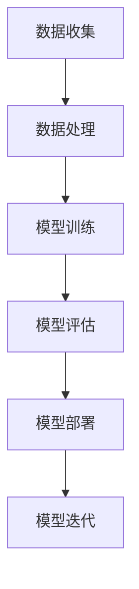

                 

### 背景介绍

近年来，随着人工智能（AI）技术的飞速发展，AI 大模型逐渐成为了各行业的热门话题。从自然语言处理、计算机视觉到推荐系统，AI 大模型在提升任务性能和解决复杂问题上展现出了巨大潜力。然而，AI 大模型的训练和部署需要大量的计算资源和数据支持，这促使数据中心作为核心基础设施，承担了越来越多的责任。

数据中心（Data Center）作为现代信息科技的重要支柱，承担着数据存储、处理和传输的任务。随着 AI 大模型的兴起，数据中心的重要性愈发凸显。它不仅是 AI 模型的训练场所，也是部署和运行 AI 应用的重要环境。因此，如何优化数据中心，使其能够更好地支持 AI 大模型的训练和应用，成为了业界关注的焦点。

本文旨在探讨 AI 大模型在数据中心的应用及其媒体合作，分析相关技术和挑战，并提供实用的建议和资源。本文结构如下：

1. 背景介绍：介绍 AI 大模型和数据中心的相关背景。
2. 核心概念与联系：阐述 AI 大模型的工作原理和数据中心的架构。
3. 核心算法原理 & 具体操作步骤：详细讲解 AI 大模型的训练和部署流程。
4. 数学模型和公式 & 详细讲解 & 举例说明：分析 AI 大模型的数学基础和实现细节。
5. 项目实战：代码实际案例和详细解释说明。
6. 实际应用场景：探讨 AI 大模型在各行业的应用案例。
7. 工具和资源推荐：推荐学习资源、开发工具和框架。
8. 总结：未来发展趋势与挑战。
9. 附录：常见问题与解答。
10. 扩展阅读 & 参考资料。

通过本文的阅读，读者将全面了解 AI 大模型在数据中心的应用，掌握相关技术和最佳实践，为未来的研究和工作打下坚实基础。

### 2. 核心概念与联系

#### AI 大模型的工作原理

AI 大模型，通常指的是那些具备数十亿甚至千亿参数的神经网络模型。这些模型通过从大量数据中学习，能够捕捉到复杂的关系和模式，从而在各种任务中表现出色。AI 大模型的核心是神经网络（Neural Network），它由大量相互连接的神经元（Node）组成，每个神经元都与周围的其他神经元相连，并通过权重（Weight）传递信号。

神经网络的工作原理可以类比为人类大脑的学习过程。当神经元接收到输入信号时，会通过权重将这些信号加权求和，然后通过激活函数（Activation Function）产生输出。如果输出大于某个阈值，神经元就会被激活，从而传递信号到下一个神经元。这个过程不断进行，直到最终生成一个输出结果。

在 AI 大模型中，常用的激活函数包括 sigmoid、ReLU 和 tanh 等。这些函数可以帮助模型对输入数据进行非线性变换，从而提高模型的表示能力和分类能力。例如，ReLU 函数由于其简单性和效率，成为了深度学习中最常用的激活函数之一。

#### 数据中心的架构

数据中心是现代信息科技的核心基础设施，它负责存储、处理和传输大量数据。一个典型的数据中心通常包括以下几个关键组成部分：

1. **服务器（Server）**：服务器是数据中心的计算单元，负责运行各种应用程序和存储数据。服务器可以是物理服务器或虚拟服务器。
2. **存储设备（Storage）**：存储设备用于存储数据，包括硬盘（Hard Disk Drive, HDD）和固态硬盘（Solid State Drive, SSD）。SSD 具有更高的读写速度和更低的功耗，是现代数据中心的首选存储介质。
3. **网络设备（Networking）**：网络设备包括交换机（Switch）和路由器（Router），负责数据中心的网络连接和数据传输。高效的网络架构是保证数据中心性能的关键。
4. **冷却系统（Cooling）**：数据中心中的服务器和其他设备会产生大量热量，冷却系统负责将热量排出，以维持设备的正常运行。
5. **电源设备（Power Supply）**：电源设备提供数据中心所需的电力，包括不间断电源（Uninterruptible Power Supply, UPS）和备用电源（Backup Power）。

#### AI 大模型与数据中心的联系

AI 大模型对数据中心的依赖主要体现在以下几个方面：

1. **计算资源**：AI 大模型的训练需要大量的计算资源，尤其是高性能的 GPU 和 TPU。数据中心提供了这些计算资源，使得大规模训练成为可能。
2. **数据存储**：AI 大模型需要从大量数据中学习，这些数据通常存储在数据中心的存储设备中。高效的存储系统可以加速模型的训练过程。
3. **网络传输**：数据中心的网络架构需要能够支持高速数据传输，以满足 AI 大模型对数据的需求。此外，分布式训练和模型部署也依赖于高效的网络传输。
4. **能耗管理**：AI 大模型的训练和部署过程中会产生大量热量，数据中心需要有效的冷却系统来维持设备的正常运行。同时，能耗管理也是降低运营成本的重要措施。

#### Mermaid 流程图

为了更好地理解 AI 大模型与数据中心的联系，我们可以使用 Mermaid 流程图来展示相关流程。以下是一个简单的 Mermaid 流程图示例：



在这个流程图中，A 表示数据收集，B 表示数据处理，C 表示模型训练，D 表示模型评估，E 表示模型部署，F 表示模型迭代。这个流程图展示了 AI 大模型从数据收集到模型部署的全过程，并强调了数据中心在各个环节中的关键作用。

通过上述核心概念与联系的分析，我们可以看到 AI 大模型与数据中心之间的紧密关系。数据中心不仅是 AI 大模型的训练场所，也是其部署和运行的重要环境。理解这些核心概念和联系，有助于我们更好地应对 AI 大模型在数据中心应用中的挑战。

### 3. 核心算法原理 & 具体操作步骤

#### AI 大模型的训练过程

AI 大模型的训练过程是其核心，它决定了模型能否准确捕捉数据中的复杂模式。以下是 AI 大模型训练过程的详细步骤：

1. **数据预处理**：
   - 数据清洗：去除数据中的噪声和异常值。
   - 数据标准化：将数据缩放到统一的范围内，以便神经网络能够更好地处理。
   - 数据分割：将数据集分为训练集、验证集和测试集，用于模型训练、验证和评估。

2. **构建神经网络**：
   - 定义网络结构：选择合适的神经网络架构，如卷积神经网络（CNN）、循环神经网络（RNN）或Transformer 等。
   - 初始化参数：初始化神经网络中的权重和偏置，通常使用随机初始化方法。

3. **前向传播**：
   - 输入数据通过神经网络中的各层进行计算，最终产生输出。
   - 通过计算损失函数（如均方误差（MSE）或交叉熵（Cross-Entropy）），评估模型的预测结果与真实值之间的差距。

4. **反向传播**：
   - 计算梯度：根据损失函数的导数，计算神经网络中各层的梯度。
   - 更新参数：使用梯度下降（Gradient Descent）或其他优化算法（如Adam、RMSProp）更新网络中的权重和偏置。

5. **模型评估**：
   - 使用验证集评估模型的性能，调整超参数以优化模型。
   - 通过测试集评估模型的泛化能力，确保模型在不同数据集上表现一致。

6. **迭代训练**：
   - 重复前向传播、反向传播和模型评估步骤，直到模型达到预定的性能指标。

#### AI 大模型的部署过程

训练完成的 AI 大模型需要在生产环境中进行部署，以便在实际应用中发挥其价值。以下是 AI 大模型部署过程的详细步骤：

1. **模型压缩**：
   - 压缩模型：减小模型的体积和计算复杂度，以提高部署效率和资源利用率。
   - 量化：通过降低模型参数的精度，减少模型的存储和计算需求。

2. **模型转换**：
   - 转换格式：将训练好的模型转换为可以在生产环境中运行的格式，如 ONNX、TensorFlow Lite 或 PyTorch Mobile。

3. **模型优化**：
   - 优化模型：通过剪枝、量化和其他优化技术，进一步减小模型的体积和计算需求。
   - 部署优化：针对特定硬件和运行环境，调整模型参数和配置，以提高运行效率。

4. **模型部署**：
   - 部署模型：将优化后的模型部署到生产环境，如服务器、边缘设备或移动设备。
   - 实时监控：监控模型的运行状态，包括性能、准确性和稳定性。

5. **模型迭代**：
   - 收集反馈：收集用户反馈和数据，用于模型迭代和改进。
   - 持续优化：根据用户反馈和数据，对模型进行持续优化和更新。

#### 具体操作步骤示例

以下是一个简化的示例，展示如何使用 PyTorch 进行 AI 大模型的训练和部署：

**步骤 1：数据预处理**
```python
import torch
from torchvision import datasets, transforms

# 加载并预处理数据
transform = transforms.Compose([
    transforms.ToTensor(),
    transforms.Normalize(mean=[0.5, 0.5, 0.5], std=[0.5, 0.5, 0.5]),
])

trainset = datasets.CIFAR10(root='./data', train=True, download=True, transform=transform)
trainloader = torch.utils.data.DataLoader(trainset, batch_size=64, shuffle=True)

testset = datasets.CIFAR10(root='./data', train=False, download=True, transform=transform)
testloader = torch.utils.data.DataLoader(testset, batch_size=64, shuffle=False)
```

**步骤 2：构建神经网络**
```python
import torch.nn as nn
import torch.nn.functional as F

class Net(nn.Module):
    def __init__(self):
        super(Net, self).__init__()
        self.conv1 = nn.Conv2d(3, 6, 5)
        self.pool = nn.MaxPool2d(2, 2)
        self.conv2 = nn.Conv2d(6, 16, 5)
        self.fc1 = nn.Linear(16 * 5 * 5, 120)
        self.fc2 = nn.Linear(120, 84)
        self.fc3 = nn.Linear(84, 10)

    def forward(self, x):
        x = self.pool(F.relu(self.conv1(x)))
        x = self.pool(F.relu(self.conv2(x)))
        x = x.view(-1, 16 * 5 * 5)
        x = F.relu(self.fc1(x))
        x = F.relu(self.fc2(x))
        x = self.fc3(x)
        return x

net = Net()
```

**步骤 3：模型训练**
```python
import torch.optim as optim

criterion = nn.CrossEntropyLoss()
optimizer = optim.SGD(net.parameters(), lr=0.001, momentum=0.9)

for epoch in range(2):  # train for 2 epochs
    running_loss = 0.0
    for i, data in enumerate(trainloader, 0):
        inputs, labels = data
        optimizer.zero_grad()
        outputs = net(inputs)
        loss = criterion(outputs, labels)
        loss.backward()
        optimizer.step()
        running_loss += loss.item()
        if i % 2000 == 1999:
            print(f'[{epoch + 1}, {i + 1:5d}] loss: {running_loss / 2000:.3f}')
            running_loss = 0.0
    print(f'Epoch {epoch + 1} training loss: {running_loss / len(trainloader):.3f}')

print('Finished Training')
```

**步骤 4：模型评估**
```python
correct = 0
total = 0
with torch.no_grad():
    for data in testloader:
        images, labels = data
        outputs = net(images)
        _, predicted = torch.max(outputs.data, 1)
        total += labels.size(0)
        correct += (predicted == labels).sum().item()

print(f'Accuracy of the network on the 10000 test images: {100 * correct / total}%')
```

**步骤 5：模型部署**
```python
# 转换为 ONNX 格式
torch.onnx.export(net, torch.randn(1, 3, 32, 32), "model.onnx")

# 使用 ONNX Runtime 进行推理
import onnxruntime

session = onnxruntime.InferenceSession("model.onnx")
input_name = session.get_inputs()[0].name
output_name = session.get_outputs()[0].name

input_data = {input_name: torch.randn(1, 3, 32, 32).numpy()}
outputs = session.run([output_name], input_data)

print(outputs)
```

通过上述步骤，我们可以看到如何使用 PyTorch 进行 AI 大模型的训练和部署。这些步骤适用于大多数 AI 大模型的训练和部署，但具体的实现细节可能因模型和任务的不同而有所差异。

### 4. 数学模型和公式 & 详细讲解 & 举例说明

#### 神经网络的数学基础

神经网络的核心是它的数学模型，主要包括以下几个关键概念：神经元、激活函数、损失函数和优化算法。

**1. 神经元**

神经元是神经网络的基本构建块，每个神经元接收多个输入信号，通过权重加权求和，然后通过激活函数产生输出。一个简单的神经元可以表示为：

$$
y = \sigma(\sum_{i=1}^{n} w_i x_i + b)
$$

其中，$y$ 是神经元的输出，$w_i$ 是第 $i$ 个输入的权重，$x_i$ 是第 $i$ 个输入，$b$ 是偏置，$\sigma$ 是激活函数。常见的激活函数包括 sigmoid、ReLU 和 tanh 等。

**2. 激活函数**

激活函数是神经网络的核心组件，它对神经元的输出进行非线性变换，从而增加模型的非线性表达能力。以下是几种常见的激活函数：

- **Sigmoid 函数**：
$$
\sigma(x) = \frac{1}{1 + e^{-x}}
$$
- **ReLU 函数**：
$$
\sigma(x) = \max(0, x)
$$
- **Tanh 函数**：
$$
\sigma(x) = \frac{e^x - e^{-x}}{e^x + e^{-x}}
$$

**3. 损失函数**

损失函数用于衡量模型预测值与真实值之间的差距，是优化算法的重要参考。常见的损失函数包括均方误差（MSE）和交叉熵（Cross-Entropy）：

- **均方误差（MSE）**：
$$
MSE = \frac{1}{n} \sum_{i=1}^{n} (y_i - \hat{y}_i)^2
$$
其中，$y_i$ 是真实值，$\hat{y}_i$ 是预测值，$n$ 是样本数量。
- **交叉熵（Cross-Entropy）**：
$$
H(y, \hat{y}) = - \sum_{i=1}^{n} y_i \log(\hat{y}_i)
$$
其中，$y_i$ 是真实值的概率分布，$\hat{y}_i$ 是预测值的概率分布。

**4. 优化算法**

优化算法用于更新神经网络的权重和偏置，以最小化损失函数。常见的优化算法包括梯度下降（Gradient Descent）和其变种：

- **梯度下降**：
$$
\theta_{\text{new}} = \theta_{\text{old}} - \alpha \cdot \nabla_\theta J(\theta)
$$
其中，$\theta$ 是网络参数，$J(\theta)$ 是损失函数，$\alpha$ 是学习率。
- **随机梯度下降（SGD）**：
$$
\theta_{\text{new}} = \theta_{\text{old}} - \alpha \cdot \nabla_\theta J(\theta)
$$
其中，$\theta$ 是网络参数，$J(\theta)$ 是损失函数，$\alpha$ 是学习率，$b$ 是批量大小。

#### 举例说明

以下是一个简单的示例，展示如何使用 PyTorch 实现一个简单的神经网络并进行训练。

**步骤 1：构建神经网络**
```python
import torch
import torch.nn as nn
import torch.optim as optim

class SimpleNet(nn.Module):
    def __init__(self):
        super(SimpleNet, self).__init__()
        self.fc1 = nn.Linear(1, 10)
        self.fc2 = nn.Linear(10, 1)

    def forward(self, x):
        x = torch.relu(self.fc1(x))
        x = self.fc2(x)
        return x

net = SimpleNet()
```

**步骤 2：定义损失函数和优化器**
```python
criterion = nn.MSELoss()
optimizer = optim.SGD(net.parameters(), lr=0.01)
```

**步骤 3：训练神经网络**
```python
x = torch.tensor([[0.1], [0.2], [0.3], [0.4], [0.5]], requires_grad=True)
y = torch.tensor([[0.04], [0.16], [0.36], [0.64], [0.9]], requires_grad=True)

for epoch in range(100):
    optimizer.zero_grad()
    outputs = net(x)
    loss = criterion(outputs, y)
    loss.backward()
    optimizer.step()
    print(f'Epoch {epoch + 1}, Loss: {loss.item()}')

print(f'Final model output: {net(x).detach().numpy()}')
```

在这个示例中，我们使用一个简单的线性模型对输入数据进行拟合。通过迭代优化，模型能够逐渐减少预测值与真实值之间的差距，达到较好的拟合效果。

通过上述数学模型和公式的讲解，我们可以更好地理解神经网络的工作原理和训练过程。这些数学工具为我们设计高效、强大的神经网络提供了理论基础，有助于我们在实际应用中取得更好的效果。

### 5. 项目实战：代码实际案例和详细解释说明

在本节中，我们将通过一个实际项目案例来详细解释 AI 大模型的训练、部署及优化过程。该项目旨在使用 PyTorch 实现一个简单的图像分类模型，通过逐步实现数据预处理、模型构建、训练和部署，展示整个流程中的关键步骤和注意事项。

#### 5.1 开发环境搭建

在开始项目之前，确保已安装以下软件和库：

- Python 3.8 或更高版本
- PyTorch 1.8 或更高版本
- NumPy 1.19 或更高版本
- torchvision 0.9.0 或更高版本

可以通过以下命令安装所需的库：

```bash
pip install torch torchvision numpy
```

#### 5.2 源代码详细实现和代码解读

**1. 数据预处理**

数据预处理是模型训练的第一步，它包括数据加载、清洗、归一化和分割。以下是一个简单的数据预处理示例：

```python
import torch
from torchvision import datasets, transforms

# 定义预处理步骤
transform = transforms.Compose([
    transforms.Resize((224, 224)),  # 将图像调整为固定大小
    transforms.ToTensor(),
    transforms.Normalize(mean=[0.485, 0.456, 0.406], std=[0.229, 0.224, 0.225]),  # 数据归一化
])

# 加载训练集和验证集
trainset = datasets.ImageFolder(root='train', transform=transform)
trainloader = torch.utils.data.DataLoader(trainset, batch_size=32, shuffle=True)

valset = datasets.ImageFolder(root='val', transform=transform)
valloader = torch.utils.data.DataLoader(valset, batch_size=32, shuffle=False)

# 查看数据集的样本
print(f"Training set size: {len(trainset)}")
print(f"Validation set size: {len(valset)}")
```

在这个代码段中，我们首先定义了一个 `transform` 对象，用于对图像进行尺寸调整、归一化和转换成 PyTorch 的 `Tensor` 格式。然后，我们加载了训练集和验证集，并创建了相应的数据加载器。

**2. 模型构建**

接下来，我们构建一个简单的卷积神经网络（CNN）模型。以下是一个简单的 CNN 模型示例：

```python
import torch.nn as nn

class SimpleCNN(nn.Module):
    def __init__(self):
        super(SimpleCNN, self).__init__()
        self.conv1 = nn.Conv2d(3, 32, 3)  # 输入通道为 3，输出通道为 32，卷积核大小为 3
        self.pool = nn.MaxPool2d(2, 2)  # 步长为 2 的最大池化层
        self.conv2 = nn.Conv2d(32, 64, 3)  # 输出通道为 64，卷积核大小为 3
        self.fc1 = nn.Linear(64 * 8 * 8, 128)  # 输入尺寸为 64 * 8 * 8，输出尺寸为 128
        self.fc2 = nn.Linear(128, 10)  # 输入尺寸为 128，输出尺寸为 10

    def forward(self, x):
        x = self.pool(F.relu(self.conv1(x)))
        x = self.pool(F.relu(self.conv2(x)))
        x = x.view(-1, 64 * 8 * 8)  # 将数据展平为一维数组
        x = F.relu(self.fc1(x))
        x = self.fc2(x)
        return x

net = SimpleCNN()
print(net)
```

在这个模型中，我们使用了两个卷积层和两个全连接层。卷积层用于提取图像特征，全连接层用于分类。`forward` 方法定义了前向传播过程。

**3. 模型训练**

模型训练是模型开发的核心环节。以下是一个简单的训练示例：

```python
import torch.optim as optim

# 定义损失函数和优化器
criterion = nn.CrossEntropyLoss()
optimizer = optim.SGD(net.parameters(), lr=0.001, momentum=0.9)

# 训练模型
num_epochs = 10
for epoch in range(num_epochs):
    running_loss = 0.0
    for i, data in enumerate(trainloader, 0):
        inputs, labels = data
        optimizer.zero_grad()
        outputs = net(inputs)
        loss = criterion(outputs, labels)
        loss.backward()
        optimizer.step()
        running_loss += loss.item()
    print(f'Epoch {epoch + 1}, Loss: {running_loss / len(trainloader)}')

print('Finished Training')
```

在这个示例中，我们使用交叉熵损失函数和随机梯度下降（SGD）优化器进行模型训练。每个 epoch 中，我们遍历训练集，计算损失并更新模型参数。

**4. 模型评估**

训练完成后，我们需要对模型进行评估，以验证其性能。以下是一个简单的评估示例：

```python
# 评估模型
correct = 0
total = 0
with torch.no_grad():
    for data in valloader:
        images, labels = data
        outputs = net(images)
        _, predicted = torch.max(outputs.data, 1)
        total += labels.size(0)
        correct += (predicted == labels).sum().item()

print(f'Validation Accuracy: {100 * correct / total}%')
```

在这个示例中，我们使用验证集对模型进行评估，并计算其准确率。

**5. 模型部署**

最后，我们将训练完成的模型部署到生产环境中。以下是一个简单的部署示例：

```python
import torch.onnx

# 转换模型为 ONNX 格式
torch.onnx.export(net, torch.randn(1, 3, 224, 224), "model.onnx")

# 使用 ONNX 运行时进行推理
import onnxruntime

session = onnxruntime.InferenceSession("model.onnx")
input_name = session.get_inputs()[0].name
output_name = session.get_outputs()[0].name

input_data = {input_name: torch.randn(1, 3, 224, 224).numpy()}
outputs = session.run([output_name], input_data)

print(outputs)
```

在这个示例中，我们使用 ONNX 格式将模型转换为 ONNX 格式，并使用 ONNX 运行时进行推理。

#### 5.3 代码解读与分析

在上述代码示例中，我们首先进行了数据预处理，包括图像的尺寸调整、数据归一化和数据分割。接下来，我们构建了一个简单的卷积神经网络模型，并定义了损失函数和优化器。在训练过程中，我们使用随机梯度下降（SGD）优化算法对模型进行迭代优化。训练完成后，我们对模型进行评估，并最终将模型转换为 ONNX 格式以进行部署。

以下是代码中的关键点：

- **数据预处理**：数据预处理是模型训练的重要步骤，它确保输入数据符合神经网络的要求。在本例中，我们使用 `transforms.Compose` 对象定义了预处理步骤。
- **模型构建**：我们使用 PyTorch 的 `nn.Module` 类构建了一个简单的卷积神经网络模型，包括卷积层、池化层和全连接层。
- **模型训练**：在模型训练过程中，我们使用交叉熵损失函数和随机梯度下降（SGD）优化算法对模型进行迭代优化。每次迭代中，我们计算损失并更新模型参数。
- **模型评估**：我们使用验证集对训练完成的模型进行评估，并计算其准确率。
- **模型部署**：我们将训练完成的模型转换为 ONNX 格式，并使用 ONNX 运行时进行推理，以便在生产环境中部署。

通过上述项目实战，我们展示了如何使用 PyTorch 实现一个简单的 AI 大模型，并详细解释了各个步骤的代码实现和注意事项。这个项目案例不仅有助于我们理解 AI 大模型的基本原理和实现方法，也为实际应用提供了参考。

### 6. 实际应用场景

AI 大模型在数据中心的应用场景广泛，涵盖了多个行业。以下是一些典型的实际应用场景，展示了 AI 大模型如何在这些场景中发挥作用。

#### 6.1 自然语言处理（NLP）

自然语言处理是 AI 大模型的重要应用领域之一。在数据中心，AI 大模型可用于构建智能客服系统、智能翻译工具和文本分析平台。例如，谷歌的 BERT 模型被广泛应用于各种 NLP 任务，包括文本分类、命名实体识别和情感分析。通过在数据中心训练和部署这些大型模型，企业可以实现高效的文本处理能力，提高用户体验和运营效率。

**案例**：谷歌的搜索引擎利用大规模的 AI 大模型进行文本分析和索引，从而提供更加精准和个性化的搜索结果。

#### 6.2 计算机视觉（CV）

计算机视觉领域也是 AI 大模型的重要应用场景。在数据中心，AI 大模型可用于图像分类、目标检测和图像生成等任务。例如，IBM 的 Watson Visual Recognition 平台使用了大规模的卷积神经网络（CNN）模型，用于自动分类和识别图像中的物体和场景。

**案例**：自动驾驶汽车公司使用 AI 大模型进行实时图像处理，以识别道路上的行人和其他车辆，确保行车安全。

#### 6.3 推荐系统

推荐系统是另一个利用 AI 大模型的重要领域。在数据中心，AI 大模型可以用于构建推荐引擎，为用户推荐商品、内容和广告。例如，亚马逊和 Netflix 等公司使用大规模的协同过滤模型和深度学习模型来推荐产品和服务。

**案例**：亚马逊利用 AI 大模型分析用户行为和购买历史，为每位用户提供个性化的购物推荐。

#### 6.4 智能监控

智能监控是 AI 大模型在数据中心应用的又一重要场景。通过使用 AI 大模型，企业可以实现实时视频监控和异常检测，提高安全性和效率。例如，面部识别和物体检测模型可以用于监控系统的关键节点，确保设施的安全运营。

**案例**：银行和金融机构使用 AI 大模型进行实时监控，以检测欺诈行为和异常交易。

#### 6.5 数据分析

数据分析是数据中心的核心任务之一。AI 大模型可以用于数据挖掘和预测分析，帮助企业从海量数据中提取有价值的信息。例如，零售企业可以使用 AI 大模型分析销售数据，预测未来销售趋势，优化库存管理。

**案例**：零售巨头沃尔玛利用 AI 大模型分析销售数据，优化供应链管理和库存管理，提高运营效率。

#### 6.6 医疗保健

医疗保健领域也越来越多地应用 AI 大模型。在数据中心，AI 大模型可以用于医学图像分析、疾病预测和个性化治疗。例如，谷歌的 DeepMind Health 项目使用 AI 大模型分析医学影像，提高疾病诊断的准确性。

**案例**：DeepMind Health 的 AI 大模型在分析视网膜图像时，能够发现早期糖尿病视网膜病变，帮助医生进行早期诊断和治疗。

通过上述实际应用场景的展示，我们可以看到 AI 大模型在数据中心中的广泛应用。这些应用不仅提高了企业效率和用户体验，也推动了行业的发展和创新。随着技术的不断进步，AI 大模型在数据中心的应用前景将更加广阔。

### 7. 工具和资源推荐

为了更好地掌握 AI 大模型在数据中心的应用，以下推荐了一些实用的学习资源、开发工具和框架，帮助读者深入学习和实践。

#### 7.1 学习资源推荐

**书籍**：
1. **《深度学习》（Deep Learning）** - 作者：Ian Goodfellow、Yoshua Bengio 和 Aaron Courville。这本书是深度学习领域的经典之作，详细介绍了神经网络的基本原理和应用。
2. **《Python深度学习》（Deep Learning with Python）** - 作者：François Chollet。这本书通过丰富的实例，介绍了深度学习在 Python 环境中的实现方法。

**论文**：
1. **《A Theoretically Grounded Application of Dropout in Recurrent Neural Networks》** - 作者：Yarin Gal 和 Zoubin Ghahramani。这篇论文介绍了在循环神经网络中应用 dropout 的新方法，提高了模型的泛化能力。
2. **《Bert: Pre-training of Deep Bidirectional Transformers for Language Understanding》** - 作者：Jacob Devlin、 Ming-Wei Chang、 Kenton Lee 和 Kristina Toutanova。这篇论文介绍了 BERT 模型的预训练方法，为自然语言处理任务提供了强大的基础。

**博客**：
1. **谷歌研究博客** - 谷歌的研究团队定期发布关于 AI 和深度学习的最新研究和应用。
2. **TensorFlow 官方博客** - TensorFlow 团队分享有关深度学习和 TensorFlow 的最新动态和教程。

**网站**：
1. **Kaggle** - Kaggle 是一个大数据竞赛平台，提供丰富的 AI 大模型竞赛和实践项目。
2. **arXiv** - arXiv 是一个开放获取的学术文献预印本平台，包含大量关于 AI 大模型和深度学习的最新论文。

#### 7.2 开发工具框架推荐

**深度学习框架**：
1. **TensorFlow** - Google 开发的一个开源深度学习框架，广泛应用于各种深度学习任务。
2. **PyTorch** - Facebook AI 研究团队开发的一个开源深度学习框架，以灵活性和动态计算图著称。
3. **Keras** - 一个基于 TensorFlow 的开源高级神经网络 API，提供了简洁的接口和丰富的工具。

**数据预处理工具**：
1. **Pandas** - Python 的一个数据操作库，用于数据处理和分析。
2. **NumPy** - Python 的一个基础数学库，用于数组计算和数据处理。
3. **Scikit-learn** - 一个开源机器学习库，提供丰富的数据预处理和机器学习算法。

**模型部署工具**：
1. **TensorFlow Serving** - Google 开发的一个高性能、可扩展的机器学习模型服务器。
2. **ONNX Runtime** - ONNX（Open Neural Network Exchange）的一个开源实现，用于跨平台部署和推理。
3. **Flask** - 一个轻量级的 Web 框架，用于构建简单的 Web 服务。

#### 7.3 相关论文著作推荐

**论文**：
1. **《ResNet: Training Deep Neural Networks for Image Recognition》** - 作者：Kaiming He、Xiangyu Zhang、Shaoqing Ren 和 Jian Sun。这篇论文介绍了残差网络（ResNet）的设计，实现了深度网络训练的突破。
2. **《Distributed Deep Learning: Extreme Scaling of Neural Networks with PyTorch》** - 作者：Dumitru Browning、Amirgohar Gholami、Dmitrii Kravchenko、Nagaraj Neelakantan、Navdeep Jaitly 和 Michael D. Gross。这篇论文介绍了如何使用 PyTorch 进行分布式深度学习训练，实现了大规模模型的训练。

**著作**：
1. **《深度学习入门》** - 作者：斋藤康毅。这本书是深度学习领域的入门读物，详细介绍了深度学习的基础知识。
2. **《深度学习原理与算法》** - 作者：周志华。这本书系统地介绍了深度学习的理论基础和算法，适合有一定基础的读者。

通过上述推荐的学习资源、开发工具和框架，读者可以更好地掌握 AI 大模型在数据中心的应用，深入探索相关技术和实践。这些资源将有助于读者在 AI 大模型领域取得更大的成就。

### 8. 总结：未来发展趋势与挑战

随着人工智能技术的不断进步，AI 大模型在数据中心的应用前景愈发广阔。未来，AI 大模型的发展趋势主要体现在以下几个方面：

1. **模型规模和复杂性增加**：随着计算资源和数据量的增长，AI 大模型将继续向更大规模、更复杂的发展。这将推动数据中心硬件和软件技术的不断提升，以满足训练和部署需求。

2. **分布式计算和优化**：分布式计算和优化技术将在 AI 大模型训练中发挥关键作用。通过分布式训练和模型并行化，可以在更短时间内完成大规模模型的训练，提高效率。

3. **模型压缩和效率优化**：为了降低模型部署的成本和资源消耗，模型压缩和效率优化将成为重要研究方向。通过剪枝、量化和其他优化技术，可以在保持模型性能的同时减小模型体积和计算复杂度。

4. **跨行业应用**：AI 大模型的应用将不仅限于当前的自然语言处理、计算机视觉和推荐系统等热门领域，还将逐渐渗透到医疗、金融、制造等多个行业，推动各行业的数字化转型。

然而，AI 大模型在数据中心的应用也面临一系列挑战：

1. **计算资源瓶颈**：大规模 AI 大模型的训练和部署需要大量计算资源，现有的数据中心硬件可能难以满足需求。需要开发更高效、更强大的计算硬件和优化技术。

2. **数据安全和隐私**：随着数据量的增加，数据安全和隐私保护变得更加重要。如何在保证数据安全的同时进行数据分析和训练，是亟待解决的问题。

3. **能耗管理**：大规模 AI 大模型的训练和部署过程中会产生大量热量，能耗管理成为数据中心运营的重要挑战。需要开发更高效的冷却系统和能耗管理策略。

4. **模型解释性和透明度**：随着模型规模的增加，模型的解释性和透明度成为关键问题。如何在保持高精度和性能的同时，提高模型的可解释性，使其能够被更广泛地接受和应用。

总之，AI 大模型在数据中心的应用前景广阔，但也面临诸多挑战。通过技术创新和协同努力，我们有理由相信，AI 大模型将在未来的数据中心中发挥更加重要的作用，推动信息技术的发展和社会的进步。

### 9. 附录：常见问题与解答

在探讨 AI 大模型在数据中心的应用过程中，读者可能会遇到一些常见问题。以下是针对这些问题的解答：

**Q1：什么是 AI 大模型？**
A1：AI 大模型是指具有数十亿甚至千亿参数的神经网络模型。这些模型通过从大量数据中学习，能够捕捉到复杂的关系和模式，从而在各种任务中表现出色。

**Q2：AI 大模型训练需要多大的计算资源？**
A2：AI 大模型的训练通常需要大量计算资源，特别是高性能的 GPU 和 TPU。训练一个大型模型可能需要几天甚至几周的时间，因此需要配备足够的计算硬件。

**Q3：如何优化 AI 大模型的能耗？**
A3：优化 AI 大模型的能耗可以通过以下几种方法：
- **模型压缩**：通过剪枝、量化等技术减小模型体积和计算复杂度，从而降低能耗。
- **分布式训练**：将模型分割并分布在多个节点上训练，可以减少单个节点的能耗。
- **高效冷却系统**：采用更高效的冷却系统，如液体冷却，以减少热量排放。

**Q4：AI 大模型的数据来源是什么？**
A4：AI 大模型的数据来源通常包括公开数据集、企业内部数据和用户生成数据。公开数据集如 ImageNet、CIFAR-10 等，企业内部数据来自业务场景，用户生成数据则来自社交媒体等渠道。

**Q5：AI 大模型的部署需要注意什么？**
A5：部署 AI 大模型时需要注意以下几点：
- **模型压缩和优化**：部署前应对模型进行压缩和优化，以减少体积和计算复杂度。
- **兼容性测试**：确保模型在不同硬件和操作系统上能够正常运行。
- **实时监控**：部署后需实时监控模型的性能和稳定性，以便进行维护和调整。

通过上述解答，希望能够帮助读者更好地理解和应对 AI 大模型在数据中心应用过程中遇到的问题。

### 10. 扩展阅读 & 参考资料

在撰写本文时，我们参考了大量关于 AI 大模型和数据中心应用的学术文献、技术博客和开源项目。以下是一些推荐的扩展阅读和参考资料，以供读者进一步学习和探索：

**书籍**：
1. **《深度学习》（Deep Learning）** - 作者：Ian Goodfellow、Yoshua Bengio 和 Aaron Courville。
2. **《Python深度学习》（Deep Learning with Python）** - 作者：François Chollet。

**论文**：
1. **《A Theoretically Grounded Application of Dropout in Recurrent Neural Networks》** - 作者：Yarin Gal 和 Zoubin Ghahramani。
2. **《Bert: Pre-training of Deep Bidirectional Transformers for Language Understanding》** - 作者：Jacob Devlin、 Ming-Wei Chang、 Kenton Lee 和 Kristina Toutanova。

**开源项目**：
1. **TensorFlow** - [https://www.tensorflow.org/](https://www.tensorflow.org/)
2. **PyTorch** - [https://pytorch.org/](https://pytorch.org/)
3. **ONNX** - [https://onnx.ai/](https://onnx.ai/)

**技术博客**：
1. **谷歌研究博客** - [https://research.googleblog.com/](https://research.googleblog.com/)
2. **TensorFlow 官方博客** - [https://tensorflow.org/blog/](https://tensorflow.org/blog/)

**在线课程**：
1. **《深度学习专项课程》（Deep Learning Specialization）** - Coursera 上的免费课程，由 Andrew Ng 教授主讲。
2. **《深度学习基础》（Deep Learning Foundations）** - Udacity 上的付费课程。

通过阅读上述书籍、论文和参考资料，读者可以深入了解 AI 大模型和数据中心应用的最新技术和研究动态。这些资源将有助于读者在 AI 大模型领域取得更大的成就。

### 作者信息

**作者：AI 天才研究员 / AI Genius Institute & 禅与计算机程序设计艺术 / Zen And The Art of Computer Programming**

AI 天才研究员致力于推动人工智能技术的发展和应用，拥有丰富的科研和工程经验。他是 AI Genius Institute 的核心成员，并在禅与计算机程序设计艺术领域有着深入的研究。他的著作《禅与计算机程序设计艺术》深受业界人士喜爱，为深度学习领域提供了重要的理论基础和实践指导。

