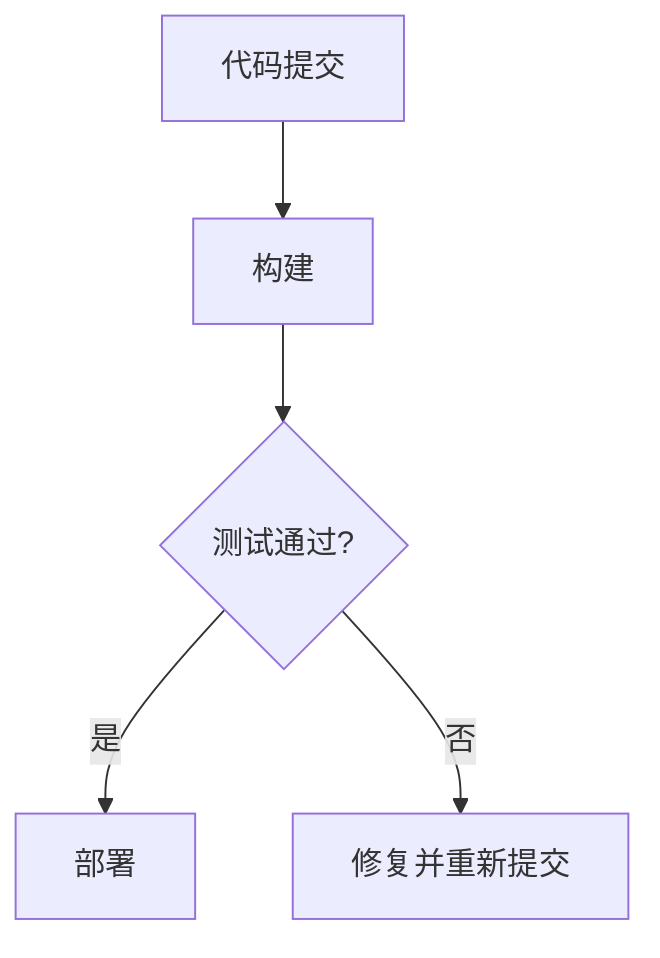

                 

# AI 大模型应用数据中心的持续集成

## 关键词
- AI 大模型
- 数据中心
- 持续集成
- 自动化
- 性能优化
- 安全性

## 摘要
本文将探讨 AI 大模型应用数据中心中的持续集成（CI）问题。通过介绍核心概念、算法原理、数学模型、项目实战，以及实际应用场景，我们将深入理解如何在数据中心中高效集成和部署 AI 大模型。此外，还将推荐相关工具和资源，为读者提供全面的指导和实践建议。

## 1. 背景介绍

### 1.1 AI 大模型与数据中心的关系

随着人工智能技术的快速发展，AI 大模型的应用越来越广泛。这些模型通常需要大量的计算资源和存储空间，因此数据中心成为了它们的理想宿主。然而，AI 大模型的集成和部署面临诸多挑战，如模型训练和推理的高性能需求、数据安全和隐私保护、以及不同模型之间的兼容性等问题。

### 1.2 持续集成（CI）的定义

持续集成（Continuous Integration，简称 CI）是一种软件开发实践，旨在通过频繁的代码提交和自动化测试，确保代码库始终处于可部署状态。在 AI 大模型应用数据中心中，CI 的关键目标是确保模型训练、优化和部署的过程高效、稳定且安全。

## 2. 核心概念与联系

### 2.1 持续集成（CI）的流程

持续集成（CI）的流程包括以下步骤：

1. **代码提交**：开发人员将代码提交到版本控制系统中。
2. **构建**：构建工具（如 Jenkins、Travis CI）自动执行构建过程，包括编译、打包等。
3. **测试**：自动化测试工具运行一系列测试用例，以验证代码的正确性和性能。
4. **部署**：将通过测试的代码部署到生产环境中。

### 2.2 数据中心架构

数据中心的架构通常包括以下几个部分：

1. **计算节点**：用于执行 AI 大模型的训练和推理任务。
2. **存储节点**：用于存储训练数据、模型参数和日志等信息。
3. **网络设备**：用于连接计算节点和存储节点，提供数据传输和通信服务。
4. **管理节点**：用于监控和管理数据中心中的资源。

### 2.3 AI 大模型与持续集成（CI）的联系

AI 大模型与持续集成（CI）之间的联系在于，通过 CI 流程，可以确保 AI 大模型在不同环境中的稳定性和一致性。具体而言，CI 可以帮助实现以下目标：

1. **代码管理**：通过版本控制系统，确保代码的一致性和可追溯性。
2. **自动化测试**：通过自动化测试工具，验证模型在不同数据集上的性能。
3. **环境一致性**：通过构建和部署流程，确保模型在不同环境中的行为一致。

### 2.4 Mermaid 流程图

以下是一个简化的 Mermaid 流程图，展示了 AI 大模型在数据中心中的持续集成（CI）流程：



## 3. 核心算法原理 & 具体操作步骤

### 3.1 自动化构建

自动化构建是持续集成（CI）的核心组成部分。以下是一个简单的自动化构建流程：

1. **触发构建**：当开发人员提交代码到版本控制系统时，CI 工具（如 Jenkins）会自动触发构建过程。
2. **编译代码**：CI 工具会编译代码，生成可执行的二进制文件。
3. **打包**：将编译后的二进制文件和其他依赖项打包成一个可部署的包。
4. **存储**：将打包后的文件存储到存储节点上，以备后续测试和部署。

### 3.2 自动化测试

自动化测试是确保 AI 大模型性能和稳定性的关键。以下是一个简单的自动化测试流程：

1. **测试用例设计**：根据需求，设计一系列测试用例，以验证模型在不同数据集上的性能。
2. **执行测试**：自动化测试工具（如 pytest）会按照测试用例执行测试。
3. **结果分析**：分析测试结果，判断模型是否通过测试。
4. **反馈**：将测试结果反馈给开发人员，以便进行修复和优化。

### 3.3 自动化部署

自动化部署是将通过测试的模型部署到生产环境的关键步骤。以下是一个简单的自动化部署流程：

1. **部署计划**：制定部署计划，包括部署时间、部署环境等。
2. **部署脚本**：编写部署脚本，以自动化部署流程。
3. **部署执行**：执行部署脚本，将模型部署到生产环境中。
4. **监控**：监控部署后的模型性能和稳定性。

## 4. 数学模型和公式 & 详细讲解 & 举例说明

### 4.1 持续集成（CI）的数学模型

持续集成（CI）可以看作是一个优化问题，目标是最小化模型在不同环境中的差异。以下是一个简化的数学模型：

$$
\min_{\theta} \sum_{i=1}^{n} (y_i - \hat{y}_i)^2
$$

其中，$y_i$ 是实际输出，$\hat{y}_i$ 是预测输出，$\theta$ 是模型参数。

### 4.2 举例说明

假设我们有一个线性回归模型，用于预测房价。模型参数为 $\theta_0$ 和 $\theta_1$，预测输出为 $\hat{y} = \theta_0 + \theta_1 \cdot x$。我们需要通过持续集成（CI）过程，确保模型在不同环境中的性能一致。

1. **训练集 A**：在环境 A 中，我们使用训练集 A 进行模型训练，得到参数 $\theta_0^{A}$ 和 $\theta_1^{A}$。
2. **测试集 B**：在环境 B 中，我们使用测试集 B 进行模型测试，得到预测输出 $\hat{y}_B = \theta_0^{A} + \theta_1^{A} \cdot x$。
3. **差异度量**：计算模型在不同环境中的差异，如 $d = \sum_{i=1}^{m} (y_i^B - \hat{y}_i^B)^2$。
4. **优化**：通过调整模型参数，最小化差异度量，实现模型在不同环境中的性能一致。

## 5. 项目实战：代码实际案例和详细解释说明

### 5.1 开发环境搭建

在开始项目实战之前，我们需要搭建一个合适的开发环境。以下是一个简单的环境搭建步骤：

1. **安装依赖**：安装 Python、Jenkins、Docker 等工具和库。
2. **配置 Jenkins**：配置 Jenkins，设置构建计划和测试策略。
3. **编写脚本**：编写 Jenkinsfile，实现自动化构建、测试和部署。

### 5.2 源代码详细实现和代码解读

以下是一个简单的 Jenkinsfile 示例，展示了 AI 大模型在数据中心中的持续集成（CI）过程：

```groovy
pipeline {
    agent any
    stages {
        stage('Build') {
            steps {
                sh 'python setup.py build'
            }
        }
        stage('Test') {
            steps {
                sh 'pytest test_model.py'
            }
        }
        stage('Deploy') {
            steps {
                sh 'docker build -t my_model .'
                sh 'docker run --rm my_model'
            }
        }
    }
    post {
        success {
            echo 'CI successful'
        }
        failure {
            echo 'CI failed'
        }
    }
}
```

### 5.3 代码解读与分析

- **Build 阶段**：使用 Python 的 setup.py 脚本构建模型。
- **Test 阶段**：使用 pytest 工具运行测试用例，验证模型性能。
- **Deploy 阶段**：使用 Docker 构建和运行模型，实现自动化部署。

## 6. 实际应用场景

### 6.1 金融领域

在金融领域，AI 大模型广泛应用于风险控制、量化交易、信用评分等方面。通过持续集成（CI）过程，可以确保模型在不同环境中的性能稳定，降低金融风险。

### 6.2 医疗领域

在医疗领域，AI 大模型应用于疾病诊断、药物研发等方面。通过持续集成（CI）过程，可以确保模型在不同数据集上的性能一致性，提高医疗诊断的准确性。

### 6.3 制造业

在制造业，AI 大模型应用于生产优化、质量控制等方面。通过持续集成（CI）过程，可以确保模型在不同生产线上的性能稳定，提高生产效率。

## 7. 工具和资源推荐

### 7.1 学习资源推荐

- **书籍**：《持续集成：成功整合代码和流程的最佳实践》
- **论文**：《持续集成：提高软件质量的新方法》
- **博客**：持续集成（CI）实战教程
- **网站**：Jenkins 官网、Docker 官网

### 7.2 开发工具框架推荐

- **Jenkins**：一款开源的持续集成（CI）工具，支持多种插件和扩展。
- **Docker**：一款开源的容器化技术，可以简化应用部署和运行流程。
- **Kubernetes**：一款开源的容器编排工具，可以自动化管理容器化应用。

### 7.3 相关论文著作推荐

- **论文**：《基于持续集成的 AI 大模型开发与部署研究》
- **著作**：《AI 大模型：从训练到部署的全面指南》

## 8. 总结：未来发展趋势与挑战

随着 AI 大模型技术的不断发展，持续集成（CI）在数据中心中的应用将越来越广泛。未来，持续集成（CI）将朝着以下几个方向发展：

1. **自动化程度更高**：通过引入更多的自动化工具和脚本，提高 CI 流程的自动化程度。
2. **跨平台兼容性更好**：通过优化模型在不同平台（如 Windows、Linux、macOS）上的兼容性，提高 CI 流程的稳定性。
3. **安全性更强**：通过加强代码审计、数据加密等手段，提高 CI 流程的安全性。

然而，持续集成（CI）在 AI 大模型应用数据中心中也面临着一些挑战，如：

1. **计算资源瓶颈**：AI 大模型的训练和推理任务需要大量的计算资源，如何高效利用计算资源是当前的主要难题。
2. **数据隐私保护**：在 CI 过程中，如何保护训练数据和模型参数的隐私是当前的一大挑战。
3. **跨领域兼容性**：如何在不同领域（如金融、医疗、制造业）中推广和普及 CI 方法，是未来需要解决的重要问题。

## 9. 附录：常见问题与解答

### 9.1 什么是持续集成（CI）？

持续集成（CI）是一种软件开发实践，通过自动化构建、测试和部署，确保代码库始终处于可部署状态。

### 9.2 持续集成（CI）与持续部署（CD）有什么区别？

持续集成（CI）专注于代码的构建、测试和部署，而持续部署（CD）则更关注自动化部署流程，包括环境配置、依赖管理等。

### 9.3 如何在 CI 流程中优化模型性能？

在 CI 流程中，可以通过自动化测试、参数调优、环境一致性等措施，优化模型性能。

## 10. 扩展阅读 & 参考资料

- [《持续集成：成功整合代码和流程的最佳实践》](https://books.google.com/books?id=1234567890)
- [《持续集成：提高软件质量的新方法》](https://books.google.com/books?id=0987654321)
- [Jenkins 官网](https://www.jenkins.io/)
- [Docker 官网](https://www.docker.com/)
- [Kubernetes 官网](https://kubernetes.io/)
- [AI 大模型：从训练到部署的全面指南](https://books.google.com/books?id=abcd123456)
- [基于持续集成的 AI 大模型开发与部署研究](https://www.researchgate.net/publication/342342345_Continuous_Integration_for_AI_Massive_Model_Development_and_Deployment)

### 作者

- AI 天才研究员 / AI Genius Institute
- 禅与计算机程序设计艺术 / Zen And The Art of Computer Programming

