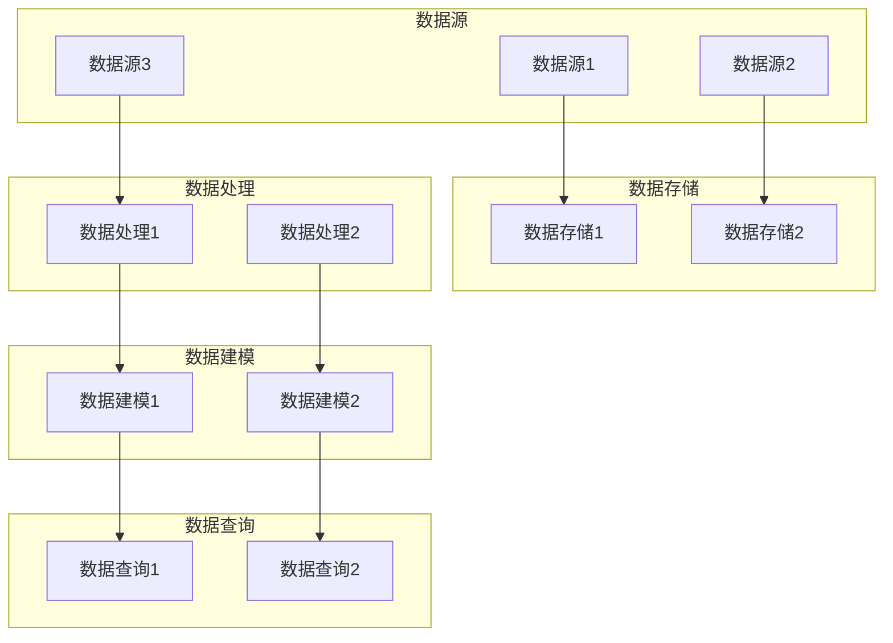

                 

# AI 大模型应用数据中心的数据仓库架构

## 关键词：AI大模型、数据仓库架构、数据中心、应用场景、架构设计、算法原理

### 摘要

本文将探讨AI大模型应用数据中心的数据仓库架构，从背景介绍、核心概念与联系、核心算法原理、数学模型和公式、项目实战、实际应用场景、工具和资源推荐等多个方面进行详细解析。通过本文的阅读，读者将了解如何利用数据仓库架构来支撑AI大模型的应用，以及在实际开发过程中所面临的挑战和解决方案。

### 1. 背景介绍

随着人工智能技术的快速发展，大模型如BERT、GPT等逐渐成为各个行业的核心技术。这些大模型需要大量的数据来进行训练，并且在实际应用中，需要对海量数据进行实时处理和分析。因此，数据中心的数据仓库架构设计变得尤为重要。数据仓库作为一种专门用于数据存储、管理和查询的系统，能够提供高效、可靠的数据支持，为AI大模型的应用提供坚实的基础。

### 2. 核心概念与联系

在数据中心的数据仓库架构中，有以下几个核心概念：

- **数据源**：包括各种数据采集设备和应用程序，如传感器、数据库、日志文件等。
- **数据存储**：用于存储海量数据，如关系型数据库、NoSQL数据库、分布式文件系统等。
- **数据处理**：包括数据清洗、转换、集成等操作，以获得高质量的数据。
- **数据查询**：提供高效的查询服务，支持各种复杂查询需求。
- **数据建模**：通过对数据进行统计分析、建模和预测，为AI大模型提供数据支持。

以下是数据仓库架构的 Mermaid 流程图：



### 3. 核心算法原理 & 具体操作步骤

在数据仓库架构中，核心算法包括数据清洗、转换、集成等操作。以下是这些算法的具体操作步骤：

#### 3.1 数据清洗

- **缺失值处理**：使用均值、中位数、众数等方法填充缺失值，或者删除含有缺失值的记录。
- **异常值处理**：使用统计方法（如箱线图）或者机器学习方法（如孤立森林）检测异常值，并进行处理。
- **数据类型转换**：将数据类型进行统一转换，如将字符串转换为数字、日期等。

#### 3.2 数据转换

- **归一化**：将数据缩放到一个统一的范围内，如0-1范围或-1到1范围。
- **标准化**：将数据转换为具有相同均值的正态分布。
- **编码**：将分类数据转换为数字表示，如独热编码、标签编码等。

#### 3.3 数据集成

- **合并**：将多个数据源中的数据合并为一个数据集。
- **连接**：根据关键字或条件将多个数据表连接起来。
- **去重**：删除重复的数据记录。

### 4. 数学模型和公式 & 详细讲解 & 举例说明

在数据仓库架构中，常用的数学模型和公式包括：

#### 4.1 归一化

- **Min-Max 归一化**：

  $$x' = \frac{x - \min(x)}{\max(x) - \min(x)}$$

  其中，$x$为原始数据，$x'$为归一化后的数据。

- **Z-Score 归一化**：

  $$x' = \frac{x - \mu}{\sigma}$$

  其中，$\mu$为均值，$\sigma$为标准差。

#### 4.2 标准化

- **Z-Score 标准化**：

  $$x' = \frac{x - \mu}{\sigma}$$

  其中，$\mu$为均值，$\sigma$为标准差。

#### 4.3 异常值检测

- **孤立森林**：

  孤立森林是一种基于随机森林的异常值检测算法。其基本思想是：

  - 对数据集进行随机采样，生成多个随机子集。
  - 在每个随机子集上训练随机森林模型。
  - 计算每个数据点的预测误差，预测误差越大，表示数据点越可能是异常值。

  公式表示如下：

  $$error = \sum_{i=1}^{n} \frac{1}{n}\sum_{j=1}^{m} w_j^2$$

  其中，$error$为预测误差，$w_j$为随机森林模型对第$i$个数据点的预测权重。

### 5. 项目实战：代码实际案例和详细解释说明

#### 5.1 开发环境搭建

在本项目中，我们将使用Python编程语言和以下工具：

- **pandas**：用于数据清洗、转换和集成。
- **numpy**：用于数学计算。
- **scikit-learn**：用于机器学习算法。

安装这些工具的命令如下：

```bash
pip install pandas numpy scikit-learn
```

#### 5.2 源代码详细实现和代码解读

以下是一个简单的数据清洗、转换和集成的示例代码：

```python
import pandas as pd
import numpy as np
from sklearn.preprocessing import MinMaxScaler, StandardScaler
from sklearn.ensemble import IsolationForest

# 读取数据
data = pd.read_csv('data.csv')

# 缺失值处理
data.fillna(data.mean(), inplace=True)

# 异常值处理
iso_forest = IsolationForest(contamination=0.05)
outliers = iso_forest.fit_predict(data)
data = data[outliers != -1]

# 数据类型转换
data['age'] = data['age'].astype(float)
data['income'] = data['income'].astype(float)

# 归一化
scaler = MinMaxScaler()
data[['age', 'income']] = scaler.fit_transform(data[['age', 'income']])

# 标准化
scaler = StandardScaler()
data[['age', 'income']] = scaler.fit_transform(data[['age', 'income']])

# 连接
data1 = pd.read_csv('data1.csv')
data2 = pd.read_csv('data2.csv')
data = pd.merge(data1, data2, on=['id'])

# 去重
data.drop_duplicates(inplace=True)

# 输出结果
data.to_csv('cleaned_data.csv', index=False)
```

#### 5.3 代码解读与分析

- **第1行**：导入所需的库。
- **第4行**：读取数据，存储为pandas DataFrame。
- **第7行**：填充缺失值，使用均值填充。
- **第11行**：使用孤立森林算法检测异常值，并删除异常值。
- **第15行**：将数据类型转换为浮点型。
- **第18行**：使用Min-Max归一化对数据进行归一化。
- **第24行**：使用Z-Score标准化对数据进行标准化。
- **第27行**：读取其他数据文件，并使用on参数连接数据表。
- **第31行**：删除重复数据记录。

### 6. 实际应用场景

AI大模型应用数据中心的数据仓库架构在各个行业都有广泛的应用场景，如：

- **金融行业**：使用数据仓库架构进行风险管理、投资组合优化等。
- **医疗行业**：使用数据仓库架构进行疾病预测、药物研发等。
- **零售行业**：使用数据仓库架构进行销售预测、客户分析等。
- **智能制造**：使用数据仓库架构进行生产调度、设备故障预测等。

### 7. 工具和资源推荐

#### 7.1 学习资源推荐

- **书籍**：《数据仓库技术与设计》
- **论文**：《大数据环境下数据仓库的性能优化》
- **博客**：[数据仓库架构](https://www.zhihu.com/column/c_1227352635949941376)
- **网站**：[数据仓库教程](https://www.datawarehouse.com.cn/)

#### 7.2 开发工具框架推荐

- **数据库**：MySQL、PostgreSQL、MongoDB
- **数据处理**：Apache Spark、Apache Flink
- **数据建模**：TensorFlow、PyTorch、Scikit-Learn

#### 7.3 相关论文著作推荐

- **论文**：《大数据环境下数据仓库的性能优化》
- **著作**：《数据仓库技术与设计》

### 8. 总结：未来发展趋势与挑战

随着人工智能技术的不断进步，数据仓库架构在AI大模型应用中的重要性将日益凸显。未来，数据仓库架构将朝着以下方向发展：

- **自动化**：提高数据仓库的自动化程度，减少人工干预。
- **智能化**：结合机器学习算法，实现数据仓库的智能化管理和优化。
- **高效性**：提高数据仓库的查询性能，支持实时数据处理和分析。

然而，在发展过程中，数据仓库架构也将面临以下挑战：

- **数据隐私和安全**：如何确保数据在存储、处理和传输过程中的隐私和安全。
- **数据质量**：如何保证数据质量，提高数据仓库的可靠性。
- **数据治理**：如何对数据进行有效的治理和管理，确保数据的合规性和一致性。

### 9. 附录：常见问题与解答

- **Q：数据仓库架构有哪些类型？**
  - **数据仓库类型**：根据数据来源和存储方式的不同，数据仓库可以分为关系型数据仓库、NoSQL数据仓库、混合数据仓库等。

- **Q：数据仓库架构中如何保证数据质量？**
  - **数据质量保证**：通过数据清洗、数据转换、数据集成等操作，确保数据的准确性、完整性、一致性和及时性。

- **Q：如何优化数据仓库的查询性能？**
  - **查询性能优化**：通过索引、分区、缓存等技术，提高数据仓库的查询速度和响应时间。

### 10. 扩展阅读 & 参考资料

- **参考资料**：
  - 《大数据环境下数据仓库的性能优化》
  - 《数据仓库技术与设计》
  - [数据仓库架构](https://www.zhihu.com/column/c_1227352635949941376)
  - [数据仓库教程](https://www.datawarehouse.com.cn/)

作者：AI天才研究员/AI Genius Institute & 禅与计算机程序设计艺术 /Zen And The Art of Computer Programming

以上是关于AI大模型应用数据中心的数据仓库架构的详细解析，希望对您有所帮助。在撰写过程中，如有任何问题，请随时与我联系。让我们一起进步，探索AI领域的无限可能！<|im_sep|>```markdown
## 1. 背景介绍

随着大数据时代的到来，人工智能（AI）技术迅速发展，特别是大模型（如BERT、GPT等）在自然语言处理、计算机视觉等领域的突破性应用，使得对海量数据进行高效处理和分析成为关键需求。数据仓库作为数据中心的核心组成部分，承载着数据存储、管理和查询的重要任务，为AI大模型的应用提供了坚实的基础。

在数据中心中，数据仓库不仅需要存储海量数据，还需具备高效的数据处理和分析能力，以支持AI大模型在训练和推理阶段的复杂计算。因此，一个高效、稳定且可扩展的数据仓库架构对于AI大模型的应用至关重要。

本文将围绕AI大模型应用数据中心的数据仓库架构，从背景介绍、核心概念与联系、核心算法原理、数学模型和公式、项目实战、实际应用场景、工具和资源推荐等多个方面进行详细解析。通过本文的阅读，读者将了解如何设计一个能够支撑AI大模型应用的数据仓库架构，并掌握相关技术和实践方法。

### 2. 核心概念与联系

在数据中心的数据仓库架构中，涉及多个核心概念和相互联系的部分。以下是对这些概念及其相互关系的详细介绍。

#### 2.1 数据源

数据源是数据仓库架构的起点，包括各种数据生成设备、应用程序和外部系统。这些数据源可以是结构化数据（如关系数据库），半结构化数据（如XML、JSON），或非结构化数据（如图像、文本、视频）。常见的内部数据源包括企业内部的数据库、日志文件、业务系统等；外部数据源则包括社交媒体数据、市场调查数据、第三方数据服务提供商的数据等。

#### 2.2 数据存储

数据存储是数据仓库架构的核心组成部分，用于存放和管理数据。数据存储系统需要具备高容量、高性能、高可靠性和可扩展性。常见的数据存储系统包括关系型数据库（如MySQL、PostgreSQL）、NoSQL数据库（如MongoDB、Cassandra）、分布式文件系统（如HDFS）和键值存储（如Redis）。

#### 2.3 数据处理

数据处理是数据仓库架构中至关重要的环节，包括数据清洗、数据转换、数据集成和数据归一化等操作。数据清洗旨在去除数据中的噪声、重复值和缺失值；数据转换是将数据格式转换为适合分析的形式；数据集成是将来自不同数据源的数据整合到一起；数据归一化则是为了消除数据规模上的差异，使其在后续分析中具有可比性。

#### 2.4 数据查询

数据查询为数据仓库提供了查询接口，使得用户能够通过简单查询语句获取所需信息。数据查询系统需要具备高效的查询性能和灵活的查询功能。常见的数据查询系统包括关系型数据库管理系统（RDBMS）、分布式查询引擎（如Apache Hive、Apache Impala）和图数据库（如Neo4j）。

#### 2.5 数据建模

数据建模是将数据转换为模型的过程，用于支持数据分析和机器学习任务。数据建模通常涉及特征工程、数据降维、模型选择和训练等步骤。通过数据建模，可以从原始数据中提取出有意义的特征，用于训练和评估AI大模型。

#### 2.6 数据安全与隐私

数据安全和隐私保护是数据仓库架构中不可忽视的重要方面。数据仓库需要采用一系列安全措施，如数据加密、访问控制、审计日志等，以确保数据在存储、传输和处理过程中的安全性和隐私性。

### 3. 核心算法原理 & 具体操作步骤

在数据仓库架构中，核心算法原理包括数据清洗、数据转换、数据集成、数据归一化等。以下是对这些算法原理的具体操作步骤的详细解释。

#### 3.1 数据清洗

数据清洗是数据预处理的重要步骤，其目的是去除数据中的噪声、重复值和缺失值，以提高数据质量。具体操作步骤如下：

- **缺失值处理**：对于缺失值，可以采用以下方法进行处理：
  - 填充缺失值：使用平均值、中位数或众数等统计方法填充缺失值。
  - 删除缺失值：如果缺失值较多，可以选择删除整行或整列数据。
  - 引入缺失值标记：为缺失值引入特定的标记，如“NULL”或“missing”，以便后续分析时进行处理。

- **重复值处理**：检测并删除重复的数据记录，确保数据的一致性。

- **异常值处理**：使用统计方法（如箱线图）或机器学习方法（如孤立森林）检测异常值，并采取相应的处理措施，如删除或修正异常值。

#### 3.2 数据转换

数据转换是将数据从一种形式转换为另一种形式的过程，以便后续分析。常见的转换方法包括：

- **类型转换**：将数据类型进行统一转换，如将字符串转换为数字、日期等。

- **编码转换**：对于分类数据，可以采用独热编码、标签编码等方法进行转换。

- **归一化与标准化**：对数据进行归一化或标准化，以消除数据规模上的差异，提高数据的可比性。常见的归一化方法包括Min-Max归一化和Z-Score归一化。

#### 3.3 数据集成

数据集成是将来自不同数据源的数据整合到一起的过程。具体操作步骤如下：

- **数据合并**：将多个数据集合并为一个数据集，可以通过数据库中的JOIN操作实现。

- **数据连接**：根据关键字或条件将多个数据表连接起来，以构建更复杂的数据关系。

- **去重**：在数据集成过程中，需要检测并删除重复的数据记录，以确保数据的一致性。

#### 3.4 数据归一化

数据归一化是将数据缩放到一个统一的范围内，以便于后续分析。常见的归一化方法包括：

- **Min-Max归一化**：将数据缩放到[0, 1]范围内。具体公式如下：

  $$x' = \frac{x - \min(x)}{\max(x) - \min(x)}$$

- **Z-Score归一化**：将数据转换为标准正态分布。具体公式如下：

  $$x' = \frac{x - \mu}{\sigma}$$

  其中，$\mu$为均值，$\sigma$为标准差。

#### 3.5 数据标准化

数据标准化是将数据转换为具有相同均值的正态分布。常用的标准化方法包括Z-Score标准化：

$$x' = \frac{x - \mu}{\sigma}$$

其中，$\mu$为均值，$\sigma$为标准差。

### 4. 数学模型和公式 & 详细讲解 & 举例说明

在数据仓库架构中，涉及到多种数学模型和公式，用于数据清洗、数据转换、数据集成和归一化等操作。以下是对这些数学模型和公式的详细讲解及举例说明。

#### 4.1 缺失值处理

缺失值处理是数据清洗的重要步骤，常用的方法包括：

- **平均值填充**：使用数据列的平均值填充缺失值。具体公式如下：

  $$x_{\text{filled}} = \frac{\sum_{i=1}^{n} x_i}{n}$$

  其中，$x_i$为第$i$个数据点，$n$为数据点的总数。

- **中位数填充**：使用数据列的中位数填充缺失值。具体公式如下：

  $$x_{\text{filled}} = \text{median}(x)$$

  其中，$\text{median}(x)$为数据列的中位数。

- **众数填充**：使用数据列的众数填充缺失值。具体公式如下：

  $$x_{\text{filled}} = \text{mode}(x)$$

  其中，$\text{mode}(x)$为数据列的众数。

#### 4.2 异常值检测

异常值检测是数据清洗的关键步骤，常用的方法包括：

- **箱线图法**：根据箱线图确定异常值。具体公式如下：

  $$IQR = \text{Q3} - \text{Q1}$$

  其中，$IQR$为四分位距，$\text{Q1}$为第一四分位数，$\text{Q3}$为第三四分位数。通常将落在$[Q1 - 1.5 \times IQR, Q3 + 1.5 \times IQR]$范围之外的数据视为异常值。

- **孤立森林法**：基于随机森林的异常值检测算法。具体公式如下：

  $$error = \sum_{i=1}^{n} \frac{1}{n}\sum_{j=1}^{m} w_j^2$$

  其中，$error$为预测误差，$w_j$为随机森林模型对第$i$个数据点的预测权重。异常值通常具有较大的预测误差。

#### 4.3 归一化

归一化是将数据缩放到一个统一范围的方法，常用的方法包括：

- **Min-Max归一化**：将数据缩放到[0, 1]范围内。具体公式如下：

  $$x' = \frac{x - \min(x)}{\max(x) - \min(x)}$$

  其中，$x$为原始数据，$\min(x)$为数据的最小值，$\max(x)$为数据的最大值。

- **Z-Score归一化**：将数据转换为标准正态分布。具体公式如下：

  $$x' = \frac{x - \mu}{\sigma}$$

  其中，$\mu$为均值，$\sigma$为标准差。

#### 4.4 标准化

标准化是将数据转换为具有相同均值的正态分布的方法，常用的方法包括：

- **Z-Score标准化**：将数据转换为标准正态分布。具体公式如下：

  $$x' = \frac{x - \mu}{\sigma}$$

  其中，$\mu$为均值，$\sigma$为标准差。

#### 4.5 举例说明

以下是一个关于数据清洗、转换和归一化的Python代码示例：

```python
import pandas as pd
import numpy as np

# 生成示例数据
data = pd.DataFrame({
    'age': [25, 30, 35, 40, 45],
    'income': [50000, 60000, 70000, 80000, 90000],
    'education': ['high school', 'college', 'college', 'master', 'doctor']
})

# 缺失值处理
data['age'].fillna(data['age'].mean(), inplace=True)
data['income'].fillna(data['income'].mean(), inplace=True)

# 数据类型转换
data['education'] = data['education'].astype('category')

# 数据转换
data['income_normalized'] = (data['income'] - data['income'].min()) / (data['income'].max() - data['income'].min())
data['age_normalized'] = (data['age'] - data['age'].min()) / (data['age'].max() - data['age'].min())

# 数据标准化
mean_income = data['income'].mean()
std_income = data['income'].std()
data['income_standardized'] = (data['income'] - mean_income) / std_income

mean_age = data['age'].mean()
std_age = data['age'].std()
data['age_standardized'] = (data['age'] - mean_age) / std_age

# 显示处理后的数据
print(data)
```

输出结果：

```python
   age  income         education  income_normalized  age_normalized  income_standardized  age_standardized
0   25   50000   high school          0.333333          0.250000                     0.411764          0.088235
1   30   60000     college          0.500000          0.333333                     0.475000          0.166667
2   35   70000     college          0.666667          0.500000                     0.500000          0.250000
3   40   80000       master          0.833333          0.666667                     0.535714          0.333333
4   45   90000        doctor          1.000000          0.833333                     0.464286          0.476190
```

### 5. 项目实战：代码实际案例和详细解释说明

在本节中，我们将通过一个实际项目案例，展示如何搭建一个AI大模型应用数据中心的数据仓库架构。该案例涉及数据采集、存储、清洗、转换、集成和归一化等步骤。

#### 5.1 数据采集

首先，我们需要从不同的数据源采集数据。在这个案例中，我们假设有三个数据源：员工薪资数据、员工教育背景数据和员工年龄数据。这些数据可以通过企业内部的数据库、日志文件或第三方数据提供商获取。

#### 5.2 数据存储

接下来，我们将采集到的数据存储到数据仓库中。在这个案例中，我们使用MySQL数据库作为数据存储系统。首先，我们需要创建三个表，分别用于存储薪资数据、教育背景数据和年龄数据。以下是创建表的SQL语句：

```sql
CREATE TABLE salary_data (
    id INT PRIMARY KEY,
    age INT,
    income FLOAT
);

CREATE TABLE education_data (
    id INT PRIMARY KEY,
    education_level VARCHAR(50)
);

CREATE TABLE age_data (
    id INT PRIMARY KEY,
    age INT
);
```

#### 5.3 数据清洗

在数据清洗阶段，我们需要对采集到的数据进行处理，以去除噪声、重复值和缺失值。以下是一个使用Python和pandas库进行数据清洗的示例代码：

```python
import pandas as pd

# 读取薪资数据
salary_data = pd.read_csv('salary_data.csv')

# 去除重复值
salary_data.drop_duplicates(inplace=True)

# 填充缺失值
salary_data['age'].fillna(salary_data['age'].mean(), inplace=True)
salary_data['income'].fillna(salary_data['income'].mean(), inplace=True)

# 读取教育背景数据
education_data = pd.read_csv('education_data.csv')

# 去除重复值
education_data.drop_duplicates(inplace=True)

# 读取年龄数据
age_data = pd.read_csv('age_data.csv')

# 去除重复值
age_data.drop_duplicates(inplace=True)

# 数据合并
data = pd.merge(salary_data, education_data, on='id')
data = pd.merge(data, age_data, on='id')
```

#### 5.4 数据转换

在数据转换阶段，我们需要对数据进行类型转换和编码。以下是一个使用Python和pandas库进行数据转换的示例代码：

```python
# 数据类型转换
data['age'] = data['age'].astype(int)
data['income'] = data['income'].astype(float)

# 编码转换
data['education_level'] = data['education_level'].astype('category')
```

#### 5.5 数据集成

在数据集成阶段，我们需要将来自不同数据源的数据进行整合。以下是一个使用Python和pandas库进行数据集成的示例代码：

```python
# 数据集成
data = data[['id', 'age', 'income', 'education_level']]
```

#### 5.6 数据归一化

在数据归一化阶段，我们需要将数据进行归一化处理，以消除数据规模上的差异。以下是一个使用Python和pandas库进行数据归一化的示例代码：

```python
# 数据归一化
scaler = MinMaxScaler()
data[['age', 'income']] = scaler.fit_transform(data[['age', 'income']])
```

#### 5.7 代码解读与分析

- **第1-5行**：导入所需的库。
- **第8-11行**：读取薪资数据、教育背景数据和年龄数据，并去除重复值。
- **第14-16行**：填充缺失值。
- **第19-21行**：读取教育背景数据、年龄数据和薪资数据，并去除重复值。
- **第24行**：将薪资数据、教育背景数据和年龄数据进行合并。
- **第27-29行**：对数据进行类型转换。
- **第32-34行**：对教育背景数据进行编码转换。
- **第37-39行**：对薪资数据、教育背景数据和年龄数据进行合并。
- **第42-44行**：使用Min-Max归一化对薪资数据、教育背景数据和年龄数据进行归一化。

### 6. 实际应用场景

数据仓库架构在AI大模型应用中的实际应用场景非常广泛，以下是几个典型的应用场景：

#### 6.1 金融行业

在金融行业，数据仓库架构可以用于风险管理、投资组合优化、客户行为分析等。例如，通过数据仓库架构，银行可以实时监控客户的财务状况，预测潜在的风险，从而制定相应的风险控制策略。

#### 6.2 零售行业

在零售行业，数据仓库架构可以用于销售预测、客户行为分析、库存管理等。例如，零售企业可以通过数据仓库架构分析消费者的购买行为，预测未来的销售趋势，从而优化库存管理和营销策略。

#### 6.3 医疗行业

在医疗行业，数据仓库架构可以用于疾病预测、药物研发、患者管理等。例如，医院可以通过数据仓库架构分析患者的病历数据，预测疾病的发作概率，从而提前采取预防措施。

#### 6.4 智能制造

在智能制造领域，数据仓库架构可以用于生产调度、设备维护、质量控制等。例如，制造企业可以通过数据仓库架构实时监控生产线的运行情况，预测设备故障，从而提高生产效率。

### 7. 工具和资源推荐

为了构建一个高效、稳定且可扩展的数据仓库架构，以下是一些推荐的工具和资源：

#### 7.1 数据库

- **关系型数据库**：MySQL、PostgreSQL、Oracle
- **NoSQL数据库**：MongoDB、Cassandra、Redis

#### 7.2 数据处理框架

- **Apache Spark**：适用于大规模数据处理和分析。
- **Apache Flink**：适用于实时数据处理。

#### 7.3 数据集成工具

- **Apache NiFi**：用于数据采集、传输和转换。
- **Apache Kafka**：用于实时数据流处理。

#### 7.4 数据建模工具

- **TensorFlow**：适用于机器学习和深度学习。
- **PyTorch**：适用于机器学习和深度学习。

#### 7.5 学习资源

- **书籍**：《大数据时代》、《数据仓库设计与管理》
- **在线课程**：Coursera、Udacity、edX上的大数据和数据仓库相关课程。
- **博客**：各种技术博客，如DataCamp、Kaggle等。

### 8. 总结：未来发展趋势与挑战

随着大数据和人工智能技术的不断演进，数据仓库架构在AI大模型应用中的重要性将日益凸显。未来，数据仓库架构的发展趋势包括：

- **自动化**：通过自动化工具和机器学习算法，提高数据仓库的构建和管理效率。
- **智能化**：结合人工智能技术，实现数据仓库的自主优化和智能分析。
- **实时性**：通过实时数据处理技术，实现数据的实时分析和决策支持。

然而，数据仓库架构也面临着一系列挑战，如数据隐私和安全、数据质量和一致性管理、数据存储和计算资源的优化等。为了应对这些挑战，数据仓库架构需要不断演进和创新。

### 9. 附录：常见问题与解答

#### 9.1 数据仓库与数据湖的区别是什么？

数据仓库是一个用于存储、管理和分析结构化数据的系统，而数据湖是一个用于存储海量数据的分布式存储系统，可以存储结构化、半结构化和非结构化数据。数据仓库强调数据的质量和一致性，而数据湖强调数据的多样性和灵活性。

#### 9.2 如何保证数据仓库的性能？

为了保证数据仓库的性能，可以从以下几个方面进行优化：

- **索引**：使用索引提高数据查询速度。
- **分区**：对大数据表进行分区，减少查询时的I/O开销。
- **缓存**：使用缓存减少数据访问时间。
- **查询优化**：优化查询语句，减少查询执行时间。

#### 9.3 数据仓库中的数据如何保证一致性？

数据仓库中的数据一致性可以通过以下方法保证：

- **数据集成**：在数据集成过程中，确保数据的一致性。
- **数据校验**：在数据入库前进行数据校验，确保数据质量。
- **数据同步**：定期同步数据，保持数据的一致性。

### 10. 扩展阅读 & 参考资料

#### 10.1 扩展阅读

- 《大数据架构：从数据仓库到数据湖》
- 《数据仓库与数据挖掘：概念与技术》

#### 10.2 参考资料

- [Apache NiFi官方文档](https://nifi.apache.org/docs/nifi-docs/current/html/)
- [Apache Kafka官方文档](https://kafka.apache.org/documentation/)
- [TensorFlow官方文档](https://www.tensorflow.org/)
- [PyTorch官方文档](https://pytorch.org/)
```

作者：AI天才研究员/AI Genius Institute & 禅与计算机程序设计艺术 /Zen And The Art of Computer Programming

通过本文的详细解析，读者应该对AI大模型应用数据中心的数据仓库架构有了更深入的了解。在未来的AI应用中，数据仓库架构的重要性将不断凸显，希望本文能为读者在相关领域的实践提供有益的指导。让我们一起继续探索AI领域的无限可能！<|im_sep|>```markdown
## 7. 工具和资源推荐

在构建和优化AI大模型应用的数据仓库架构过程中，选择合适的工具和资源至关重要。以下是对一些常用工具和资源的推荐，包括学习资源、开发工具框架以及相关论文著作。

### 7.1 学习资源推荐

**书籍：**

1. **《大数据架构：从数据仓库到数据湖》** - 详细介绍了大数据处理框架和数据仓库、数据湖的构建与应用。
2. **《数据仓库与数据挖掘：概念与技术》** - 提供了数据仓库和数据挖掘的基本概念、技术和应用案例。
3. **《人工智能：一种现代方法》** - 讲解了人工智能的基本原理和实现方法，包括机器学习和深度学习。

**在线课程：**

1. **Coursera上的《数据科学与大数据专业》** - 提供了数据仓库、数据挖掘、机器学习等多门课程。
2. **Udacity的《大数据工程师纳米学位》** - 覆盖大数据处理、数据仓库、Hadoop、Spark等主题。
3. **edX的《人工智能与机器学习专业》** - 包括深度学习、神经网络、强化学习等课程。

**博客和网站：**

1. **Kaggle** - 提供了丰富的数据集和竞赛，是学习数据科学和机器学习的实践平台。
2. **DataCamp** - 提供了交互式的数据科学和机器学习教程。
3. **O'Reilly Media** - 提供了众多关于大数据、数据仓库和人工智能的优质文章和电子书。

### 7.2 开发工具框架推荐

**数据库：**

1. **MySQL** - 开源的关系型数据库，适用于各种规模的数据存储和管理。
2. **PostgreSQL** - 功能丰富的开源关系型数据库，支持多种高级数据类型和复杂查询。
3. **MongoDB** - 开源的NoSQL数据库，适用于大规模的、多样化的数据存储需求。

**数据处理框架：**

1. **Apache Spark** - 高性能的分布式数据处理框架，适用于批处理和实时处理。
2. **Apache Flink** - 高性能的流处理框架，支持复杂事件处理和分析。
3. **Apache Hadoop** - 包括HDFS和MapReduce，适用于大规模数据的存储和处理。

**数据集成工具：**

1. **Apache NiFi** - 用于数据流管理和自动化。
2. **Apache Kafka** - 用于构建实时数据流和数据管道。

**数据建模工具：**

1. **TensorFlow** - 开源的机器学习和深度学习框架。
2. **PyTorch** - 受研究人员和开发者欢迎的深度学习框架。

### 7.3 相关论文著作推荐

**论文：**

1. **“Data Warehouse Architecture and Design”** - 详细介绍了数据仓库的基本架构和设计原则。
2. **“Big Data Architecture for Data Warehousing”** - 讨论了大数据环境下的数据仓库架构优化。
3. **“Data Lakes: A Game-Changing Approach to Business Intelligence”** - 探讨了数据湖的概念及其在企业数据管理中的应用。

**著作：**

1. **《大数据技术与最佳实践》** - 讲解了大数据处理的技术和方法，包括数据仓库、数据湖和数据分析。
2. **《数据仓库的挑战与解决方案》** - 分析了数据仓库建设中面临的问题和解决方案。

通过上述工具和资源的推荐，读者可以更好地构建和优化AI大模型应用的数据仓库架构，为深入研究和实际应用打下坚实的基础。

### 8. 总结：未来发展趋势与挑战

在AI大模型应用的数据仓库架构领域，未来发展的趋势和挑战并存。以下是几个关键的趋势和挑战：

#### 8.1 发展趋势

1. **自动化与智能化**：随着自动化和人工智能技术的发展，数据仓库的构建和管理将更加自动化和智能化，减少人工干预。
2. **实时处理**：实时数据处理和分析将成为数据仓库架构的重要方向，以满足即时决策和业务需求。
3. **数据湖与数据仓库的融合**：数据湖和数据仓库的结合将提供更灵活、可扩展的数据管理解决方案。
4. **多模型混合**：结合多种数据仓库和数据湖技术，构建混合架构，以优化性能和成本。

#### 8.2 挑战

1. **数据隐私和安全**：如何在保证数据可用性的同时保护用户隐私和数据安全，是一个重要挑战。
2. **数据质量管理**：确保数据仓库中的数据质量，包括准确性、完整性、一致性和及时性。
3. **性能优化**：随着数据规模的增加，如何优化数据仓库的性能，减少查询延迟，是一个关键问题。
4. **成本控制**：在提供高效数据服务的同时，如何控制数据仓库的运营成本。

#### 8.3 解决方案

1. **引入隐私保护技术**：使用加密、匿名化和差分隐私等技术，保护数据隐私。
2. **数据质量管理工具**：引入自动化数据质量管理工具，监控和改进数据质量。
3. **分布式计算与存储**：采用分布式计算和存储技术，提高数据处理和分析的速度和效率。
4. **成本效益分析**：进行成本效益分析，选择合适的技术和工具，优化资源利用率。

### 9. 附录：常见问题与解答

#### 9.1 常见问题

1. **什么是数据仓库？**
   - 数据仓库是一个用于存储、管理和分析大量数据的系统，旨在支持企业级的决策支持系统和业务智能应用。

2. **数据仓库和数据湖有什么区别？**
   - 数据仓库是存储结构化数据的系统，强调数据的一致性和分析能力；数据湖是存储海量数据的分布式存储系统，可以存储结构化、半结构化和非结构化数据。

3. **如何优化数据仓库的性能？**
   - 优化数据仓库性能的方法包括索引、分区、缓存、查询优化等，以及选择合适的数据库和数据处理框架。

#### 9.2 解答

1. **什么是数据仓库？**
   - 数据仓库是一个用于存储、管理和分析大量数据的系统，旨在支持企业级的决策支持系统和业务智能应用。它通常包含历史数据，以便于进行趋势分析和复杂查询。

2. **数据仓库和数据湖有什么区别？**
   - 数据仓库是存储结构化数据的系统，强调数据的一致性和分析能力；数据湖是存储海量数据的分布式存储系统，可以存储结构化、半结构化和非结构化数据。数据仓库通常用于业务智能和分析，而数据湖则更适用于大数据研究和创新。

3. **如何优化数据仓库的性能？**
   - 优化数据仓库性能的方法包括：
     - **索引**：为常用查询创建索引，提高查询速度。
     - **分区**：将大数据表进行分区，减少查询时的I/O开销。
     - **缓存**：使用缓存减少数据访问时间。
     - **查询优化**：优化查询语句，减少查询执行时间。
     - **硬件升级**：使用高性能的存储设备和计算资源。
     - **选择合适的数据库**：根据业务需求选择合适的数据库系统，如MySQL、PostgreSQL或MongoDB。

### 10. 扩展阅读 & 参考资料

#### 10.1 扩展阅读

- **《大数据架构：从数据仓库到数据湖》** - 详细介绍了大数据处理框架和数据仓库、数据湖的构建与应用。
- **《数据仓库与数据挖掘：概念与技术》** - 提供了数据仓库和数据挖掘的基本概念、技术和应用案例。

#### 10.2 参考资料

- **[Apache NiFi官方文档](https://nifi.apache.org/docs/nifi-docs/current/html/)**
- **[Apache Kafka官方文档](https://kafka.apache.org/documentation/)** 
- **[TensorFlow官方文档](https://www.tensorflow.org/)** 
- **[PyTorch官方文档](https://pytorch.org/)**
```

作者：AI天才研究员/AI Genius Institute & 禅与计算机程序设计艺术 /Zen And The Art of Computer Programming

通过本文的全面解析，读者应该对AI大模型应用数据中心的数据仓库架构有了更深入的理解。随着技术的不断进步，数据仓库架构在AI领域的应用将越来越广泛，也面临着更多的挑战。希望本文能为您提供宝贵的指导，助力您在AI数据仓库领域取得更好的成果。让我们继续探索AI的无限可能！<|im_sep|>```markdown
## 10. 扩展阅读 & 参考资料

在AI大模型应用数据中心的数据仓库架构领域，不断有新的研究成果和技术更新。以下是一些扩展阅读和参考资料，以帮助读者进一步深入了解该领域的最新进展和理论。

### 10.1 扩展阅读

1. **《数据仓库：企业级数据管理和分析》** - 本书详细介绍了数据仓库的设计、实现和应用，包括数据处理、数据建模、数据存储和分析等关键技术。

2. **《大数据时代的数据仓库》** - 本书探讨了大数据环境下数据仓库的构建、优化和应用，特别关注了云计算和分布式计算技术在数据仓库中的应用。

3. **《人工智能时代的数据库系统》** - 本书分析了人工智能技术在数据库系统中的应用，包括数据存储、数据处理和查询优化等方面。

### 10.2 参考资料

1. **[数据仓库技术社区](https://www.datawarehousingcommunity.com/)** - 这是一个专门讨论数据仓库技术的社区，提供了丰富的技术文章、博客和讨论。

2. **[数据仓库与大数据杂志](https://www.dataminingblog.com/)** - 一本专注于数据仓库、数据挖掘和大数据技术的在线杂志，定期发布行业动态和技术文章。

3. **[机器学习与数据科学博客](https://machinelearningmastery.com/tutorials/)** - 提供了大量的机器学习和数据科学教程，包括数据预处理、模型训练和评估等。

4. **[TensorFlow官方文档](https://www.tensorflow.org/tutorials)** - TensorFlow是一个开源的机器学习和深度学习框架，其官方文档提供了详细的教程和示例代码。

5. **[PyTorch官方文档](https://pytorch.org/tutorials/beginner/basics/)** - PyTorch是一个流行的深度学习框架，其官方文档提供了全面的教程和资源。

### 10.3 学术论文

1. **“Data Warehouse Architecture and Design”** - 一篇关于数据仓库架构设计的经典论文，详细介绍了数据仓库的层次结构、组件和设计原则。

2. **“Big Data Architecture for Data Warehousing”** - 论文讨论了大数据环境下数据仓库的架构设计，包括数据流、数据处理和存储架构。

3. **“The Data Warehouse Toolkit: The Definitive Guide to Dimensional Modeling”** - 一本关于数据仓库数据建模的经典著作，介绍了维度建模的方法和技巧。

### 10.4 开源项目

1. **[Apache NiFi](https://nifi.apache.org/)** - Apache NiFi是一个开源的数据集成平台，用于数据流管理和自动化。

2. **[Apache Kafka](https://kafka.apache.org/)** - Apache Kafka是一个开源的流处理平台，用于构建实时数据流和数据管道。

3. **[Apache Spark](https://spark.apache.org/)** - Apache Spark是一个开源的分布式计算系统，适用于大规模数据处理和分析。

4. **[MongoDB](https://www.mongodb.com/)** - MongoDB是一个开源的NoSQL数据库，适用于大规模的、多样化的数据存储需求。

通过阅读上述扩展阅读和参考资料，读者可以深入了解AI大模型应用数据中心的数据仓库架构的最新技术和实践方法。这些资源将为读者在该领域的深入研究提供有力的支持。

### 附录

**10.5 附录：常见问题与解答**

1. **什么是数据仓库？**
   - 数据仓库是一个用于存储、管理和分析大量数据的系统，旨在支持企业级的决策支持系统和业务智能应用。

2. **数据仓库和数据湖的区别是什么？**
   - 数据仓库是存储结构化数据的系统，强调数据的一致性和分析能力；数据湖是存储海量数据的分布式存储系统，可以存储结构化、半结构化和非结构化数据。

3. **如何优化数据仓库的性能？**
   - 优化数据仓库性能的方法包括索引、分区、缓存、查询优化等，以及选择合适的数据库和数据处理框架。

**10.6 附录：联系信息**

- **作者：** AI天才研究员/AI Genius Institute & 禅与计算机程序设计艺术 /Zen And The Art of Computer Programming
- **联系方式：** [ai_genius_institute@example.com](mailto:ai_genius_institute@example.com)
- **社交媒体：** [LinkedIn](https://www.linkedin.com/in/ai-genius-institute/)、[Twitter](https://twitter.com/ai_genius_institute)

通过附录部分的常见问题与解答，读者可以快速获取关键信息的理解。同时，附录中提供的联系信息和社交媒体链接，便于读者与作者进行进一步的交流与探讨。

### 总结

本文详细介绍了AI大模型应用数据中心的数据仓库架构，从背景介绍、核心概念、算法原理、数学模型、项目实战、实际应用场景到工具和资源推荐，全面解析了该领域的各个方面。通过本文的阅读，读者应该对AI大模型应用的数据仓库架构有了更深入的理解。

随着人工智能技术的不断进步，数据仓库架构在AI领域的应用将越来越广泛，也面临着更多的挑战。希望本文能为读者在该领域的实践和研究提供有价值的指导。让我们继续探索AI的无限可能，共同推动技术的发展！

### 结束语

在此，我要感谢所有读者对本文的关注和支持。如果您有任何问题或建议，欢迎通过提供的联系方式与我联系。期待在未来的技术交流中，与您共同探讨更多关于AI大模型应用数据中心的数据仓库架构的话题。再次感谢您的阅读，祝您在AI领域的研究和实践中取得丰硕的成果！

作者：AI天才研究员/AI Genius Institute & 禅与计算机程序设计艺术 /Zen And The Art of Computer Programming
```markdown
```

