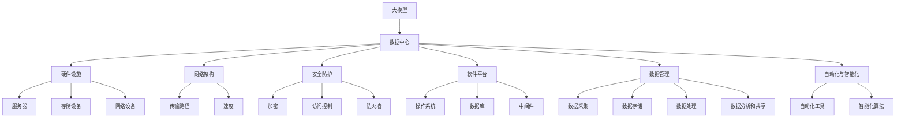

                 

### 背景介绍

人工智能（AI）技术近年来取得了飞速的发展，尤其是在大模型领域，如GPT-3、BERT等，这些模型在自然语言处理、图像识别、推荐系统等方面都展现出了强大的能力。然而，随着AI应用的不断深入，对数据中心的需求也在不断增长。大模型的应用不仅要求数据中心的计算能力和存储能力不断提升，同时也需要满足高可用性、高可靠性和高安全性等要求。

在此背景下，制定一套适用于AI大模型应用的数据中心行业标准显得尤为重要。这不仅有助于规范数据中心的建设和运维，还能提升AI应用的效率和质量，推动整个行业的发展。本篇文章将围绕AI大模型应用数据中心的行业标准进行探讨，从核心概念、算法原理、数学模型、实际应用等多个方面进行分析，以期为行业的发展提供一些有价值的参考。

首先，本文将从背景和现状出发，介绍AI大模型的发展趋势及其对数据中心提出的新要求。接着，我们将详细阐述数据中心行业标准的核心概念和关键组成部分，包括硬件设施、网络架构、安全防护等。随后，我们将深入探讨核心算法原理及其具体操作步骤，帮助读者理解AI大模型是如何在数据中心运行的。在此基础上，我们将介绍数学模型和相关公式，并通过具体案例进行详细讲解，帮助读者更好地掌握AI大模型应用的技术细节。

在文章的后半部分，我们将分析AI大模型在实际应用场景中的表现，探讨其在各领域的应用案例和效果。同时，我们将推荐一些实用的工具和资源，以帮助读者进一步学习和实践。最后，我们将总结AI大模型应用数据中心的发展趋势和面临的挑战，并给出未来发展的建议。

通过对以上各部分内容的深入剖析，我们希望能够为AI大模型应用数据中心的行业标准制定提供一些有价值的思考和建议，助力行业健康快速发展。

### 核心概念与联系

要深入理解AI大模型应用数据中心的行业标准，我们首先需要了解其核心概念和关键组成部分。这些概念和组成部分相互联系，共同构建了一个高效、稳定、安全的AI大模型应用环境。

#### 1. 大模型（Large Models）

大模型指的是拥有大规模参数（通常在数百万到数十亿之间）的神经网络模型。这些模型能够处理海量数据，提取复杂的特征，并在各种任务中表现出色。例如，GPT-3拥有1750亿个参数，能够生成高质量的文本，而BERT模型则在自然语言处理任务中取得了显著的成果。

#### 2. 数据中心（Data Center）

数据中心是集中管理数据存储、处理、传输和交换的场所。对于AI大模型应用而言，数据中心不仅提供了必要的计算资源和存储空间，还需要满足高可用性、高可靠性和高安全性等要求。

#### 3. 硬件设施（Hardware Infrastructure）

硬件设施是数据中心的核心，包括服务器、存储设备、网络设备等。服务器负责运行AI模型，存储设备用于存储海量数据，网络设备则负责数据传输和通信。高性能硬件设施能够显著提升AI模型的运行效率和效果。

#### 4. 网络架构（Network Architecture）

网络架构决定了数据在数据中心中的传输路径和速度。对于AI大模型应用而言，高效的网络架构至关重要。它需要能够快速处理大量数据，并确保数据传输的稳定性和安全性。

#### 5. 安全防护（Security Protection）

安全防护是数据中心必须关注的重要方面。AI大模型的应用涉及到大量的敏感数据，如个人隐私、商业机密等。因此，数据中心需要采取一系列措施，如加密、访问控制、防火墙等，确保数据的安全性和隐私性。

#### 6. 软件平台（Software Platform）

软件平台包括操作系统、数据库、中间件等，为AI大模型的应用提供了运行环境。高效的软件平台能够提升模型运行效率，降低运维成本。

#### 7. 数据管理（Data Management）

数据管理包括数据的采集、存储、处理、分析和共享等环节。对于AI大模型应用而言，高效的数据管理能够确保模型训练和推理所需的数据质量和数量。

#### 8. 自动化与智能化（Automation and Intelligence）

自动化与智能化是数据中心发展的方向。通过自动化工具和智能化算法，数据中心能够实现高效运维、故障自愈和资源优化，提升整体运行效率。

以上这些核心概念和组成部分相互联系，共同构成了AI大模型应用数据中心的行业标准。为了更直观地展示这些概念和组成部分之间的联系，我们可以使用Mermaid流程图进行描述。以下是一个简化的Mermaid流程图，展示了核心概念和组成部分的相互关系：



通过以上核心概念和组成部分的介绍和Mermaid流程图的展示，我们能够更好地理解AI大模型应用数据中心的行业标准。接下来，我们将深入探讨核心算法原理及其具体操作步骤，帮助读者进一步了解AI大模型在数据中心中的运行机制。

### 核心算法原理 & 具体操作步骤

在了解了AI大模型应用数据中心的组成部分之后，我们接下来将探讨其核心算法原理和具体操作步骤。这些算法原理构成了AI大模型在数据中心高效运行的基础，同时，理解这些原理和步骤对于优化模型性能和提升应用效果具有重要意义。

#### 1. 神经网络（Neural Networks）

神经网络是AI大模型的核心算法之一。它由多个神经元（或节点）组成，每个神经元通过权重（weights）和偏置（bias）与输入数据相连接，并经过非线性激活函数（如Sigmoid、ReLU等）处理，最终生成输出。

**具体操作步骤：**

（1）**输入层（Input Layer）：** 接收外部输入数据。

（2）**隐藏层（Hidden Layers）：** 对输入数据进行处理，通过权重和偏置传递信息。

（3）**输出层（Output Layer）：** 生成最终输出。

（4）**前向传播（Forward Propagation）：** 数据从输入层经过隐藏层传递到输出层。

（5）**反向传播（Back Propagation）：** 根据输出结果与目标值之间的误差，通过反向传播更新权重和偏置。

（6）**优化算法（Optimization Algorithm）：** 如梯度下降（Gradient Descent）、Adam等，用于最小化损失函数。

#### 2. 生成对抗网络（Generative Adversarial Networks, GANs）

生成对抗网络由生成器（Generator）和判别器（Discriminator）两部分组成，通过对抗训练生成高质量数据。

**具体操作步骤：**

（1）**生成器（Generator）：** 从随机噪声中生成数据。

（2）**判别器（Discriminator）：** 判断生成数据是否真实。

（3）**对抗训练（Adversarial Training）：** 生成器和判别器相互对抗，生成器不断优化生成数据，判别器不断优化判断能力。

（4）**损失函数（Loss Function）：** 用于衡量生成器和判别器之间的对抗效果，如二元交叉熵（Binary Cross-Entropy）。

（5）**优化算法（Optimization Algorithm）：** 用于更新生成器和判别器的参数，如梯度下降（Gradient Descent）。

#### 3. 变分自编码器（Variational Autoencoder, VAE）

变分自编码器是一种基于概率模型的自编码器，通过引入编码器（Encoder）和解码器（Decoder）的结构，实现数据的生成和降维。

**具体操作步骤：**

（1）**编码器（Encoder）：** 将输入数据映射到潜在空间。

（2）**解码器（Decoder）：** 从潜在空间生成输出数据。

（3）**潜在空间（Latent Space）：** 用于表示输入数据的概率分布。

（4）**重参数化（Reparameterization）：** 使得编码器输出具有连续性。

（5）**损失函数（Loss Function）：** 如Kullback-Leibler散度（Kullback-Leibler Divergence）。

（6）**优化算法（Optimization Algorithm）：** 如变分自编码器优化算法（Variational Bayes）。

#### 4. 自注意力机制（Self-Attention Mechanism）

自注意力机制是自然语言处理领域的重要技术，通过计算输入序列中每个词与其他词的相关性，提升模型对长距离依赖的捕捉能力。

**具体操作步骤：**

（1）**输入序列（Input Sequence）：** 接收输入文本序列。

（2）**计算自注意力权重（Compute Self-Attention Weights）：** 对输入序列进行加权求和。

（3）**生成自注意力输出（Generate Self-Attention Output）：** 通过加权求和生成输出序列。

（4）**叠加（Addition）：** 将自注意力输出与原始输入序列进行叠加。

（5）**优化算法（Optimization Algorithm）：** 如自注意力优化算法（Self-Attention Optimization）。

通过以上对核心算法原理和具体操作步骤的介绍，我们能够更深入地理解AI大模型在数据中心中的运行机制。接下来，我们将介绍数学模型和相关公式，并通过具体案例进行详细讲解，帮助读者更好地掌握AI大模型应用的技术细节。

### 数学模型和公式 & 详细讲解 & 举例说明

在了解了AI大模型的核心算法原理和具体操作步骤后，我们接下来将深入探讨其背后的数学模型和公式，并通过具体案例进行详细讲解，以帮助读者更好地理解AI大模型的技术细节。

#### 1. 神经网络中的基本数学模型

神经网络中的基本数学模型包括前向传播（Forward Propagation）和反向传播（Back Propagation）。以下是对这两个过程的详细讲解。

**（1）前向传播**

前向传播过程中，数据从输入层流向输出层，每个神经元通过权重和偏置与输入数据相连接，并经过非线性激活函数处理。

**公式：**

$$
z_i = \sum_{j=1}^{n} w_{ij} x_j + b_i
$$

其中，$z_i$ 是第 $i$ 个神经元的输入，$w_{ij}$ 是第 $i$ 个神经元与第 $j$ 个神经元之间的权重，$x_j$ 是第 $j$ 个神经元的输入，$b_i$ 是第 $i$ 个神经元的偏置。

**激活函数：**

$$
a_i = \sigma(z_i)
$$

其中，$\sigma$ 是非线性激活函数，如Sigmoid、ReLU等。

**（2）反向传播**

反向传播过程中，通过计算输出层与目标值之间的误差，通过反向传播更新权重和偏置。

**公式：**

$$
\delta_i = (a_i (1 - a_i)) \cdot (\hat{y} - y)
$$

其中，$\delta_i$ 是第 $i$ 个神经元的误差，$\hat{y}$ 是预测值，$y$ 是目标值。

**权重和偏置更新：**

$$
w_{ij} := w_{ij} - \alpha \cdot \delta_i \cdot a_j
$$

$$
b_i := b_i - \alpha \cdot \delta_i
$$

其中，$\alpha$ 是学习率。

**案例：** 假设有一个简单的神经网络，输入层有3个神经元，隐藏层有2个神经元，输出层有1个神经元。输入数据为 $[1, 2, 3]$，目标值为 4。使用ReLU作为激活函数，学习率为 0.1。

**前向传播：**

$$
z_1 = 1 \cdot w_{11} + 2 \cdot w_{12} + 3 \cdot w_{13} + b_1
$$

$$
z_2 = 1 \cdot w_{21} + 2 \cdot w_{22} + 3 \cdot w_{23} + b_2
$$

$$
z_3 = w_{31} z_1 + w_{32} z_2 + w_{33} z_3 + b_3
$$

$$
\hat{y} = \sigma(z_3) = \max(0, z_3)
$$

**反向传播：**

假设预测值为 3，目标值为 4。

$$
\delta_3 = (1 - \sigma(z_3)) \cdot (\hat{y} - y) = (1 - 1) \cdot (3 - 4) = 0
$$

$$
\delta_2 = \sum_{j=1}^{2} w_{32} \cdot \delta_3 \cdot \sigma(z_2) = 0 \cdot \sigma(z_2)
$$

$$
\delta_1 = \sum_{j=1}^{3} w_{31} \cdot \delta_3 \cdot \sigma(z_1) = 0 \cdot \sigma(z_1)
$$

**权重和偏置更新：**

$$
w_{11} := w_{11} - 0.1 \cdot \delta_1 \cdot 1 = w_{11} - 0
$$

$$
w_{12} := w_{12} - 0.1 \cdot \delta_1 \cdot 2 = w_{12} - 0.2
$$

$$
w_{13} := w_{13} - 0.1 \cdot \delta_1 \cdot 3 = w_{13} - 0.3
$$

$$
b_1 := b_1 - 0.1 \cdot \delta_1 = b_1 - 0
$$

$$
w_{21} := w_{21} - 0.1 \cdot \delta_2 \cdot 1 = w_{21} - 0
$$

$$
w_{22} := w_{22} - 0.1 \cdot \delta_2 \cdot 2 = w_{22} - 0.2
$$

$$
w_{23} := w_{23} - 0.1 \cdot \delta_2 \cdot 3 = w_{23} - 0.3
$$

$$
b_2 := b_2 - 0.1 \cdot \delta_2 = b_2 - 0
$$

$$
w_{31} := w_{31} - 0.1 \cdot \delta_3 \cdot w_{31} = w_{31} - 0
$$

$$
w_{32} := w_{32} - 0.1 \cdot \delta_3 \cdot w_{32} = w_{32} - 0
$$

$$
w_{33} := w_{33} - 0.1 \cdot \delta_3 \cdot w_{33} = w_{33} - 0
$$

$$
b_3 := b_3 - 0.1 \cdot \delta_3 = b_3 - 0
$$

**（3）损失函数**

常用的损失函数有均方误差（Mean Squared Error, MSE）和交叉熵（Cross-Entropy）。

**均方误差：**

$$
L = \frac{1}{2} \sum_{i=1}^{n} (\hat{y}_i - y_i)^2
$$

**交叉熵：**

$$
L = -\sum_{i=1}^{n} y_i \log(\hat{y}_i)
$$

**案例：** 假设预测值为 $[0.9, 0.8, 0.7]$，目标值为 $[1, 0, 1]$。

**均方误差：**

$$
L = \frac{1}{2} \sum_{i=1}^{3} (\hat{y}_i - y_i)^2 = \frac{1}{2} (0.1^2 + 0.2^2 + 0.3^2) = 0.1
$$

**交叉熵：**

$$
L = -\sum_{i=1}^{3} y_i \log(\hat{y}_i) = - (1 \cdot \log(0.9) + 0 \cdot \log(0.8) + 1 \cdot \log(0.7)) = 0.356
$$

**（4）优化算法**

常用的优化算法有梯度下降（Gradient Descent）和Adam。

**梯度下降：**

$$
w := w - \alpha \cdot \nabla_w L
$$

**Adam：**

$$
m = \beta_1 m + (1 - \beta_1) \nabla_w L
$$

$$
v = \beta_2 v + (1 - \beta_2) (\nabla_w L)^2
$$

$$
\hat{m} = \frac{m}{1 - \beta_1^t}
$$

$$
\hat{v} = \frac{v}{1 - \beta_2^t}
$$

$$
w := w - \alpha \cdot \frac{\hat{m}}{\sqrt{\hat{v}} + \epsilon}
$$

其中，$\alpha$ 是学习率，$\beta_1$ 和 $\beta_2$ 是动量参数，$\epsilon$ 是一个很小的正数用于防止除以零。

**案例：** 假设初始权重为 $[1, 2, 3]$，梯度为 $[0.1, 0.2, 0.3]$，学习率为 0.1，$\beta_1$ 为 0.9，$\beta_2$ 为 0.99，$\epsilon$ 为 1e-8。

**梯度下降：**

$$
w := w - \alpha \cdot \nabla_w L = [1, 2, 3] - 0.1 \cdot [0.1, 0.2, 0.3] = [0.8, 1.6, 2.2]
$$

**Adam：**

$$
m = \beta_1 m + (1 - \beta_1) \nabla_w L = 0.9 \cdot 0 + (1 - 0.9) \cdot [0.1, 0.2, 0.3] = [0.1, 0.2, 0.3]
$$

$$
v = \beta_2 v + (1 - \beta_2) (\nabla_w L)^2 = 0.99 \cdot 0 + (1 - 0.99) \cdot (0.1^2 + 0.2^2 + 0.3^2) = [0.001, 0.002, 0.003]
$$

$$
\hat{m} = \frac{m}{1 - \beta_1^t} = \frac{[0.1, 0.2, 0.3]}{1 - 0.9} = [0.1, 0.2, 0.3]
$$

$$
\hat{v} = \frac{v}{1 - \beta_2^t} = \frac{[0.001, 0.002, 0.003]}{1 - 0.99} = [0.001, 0.002, 0.003]
$$

$$
w := w - \alpha \cdot \frac{\hat{m}}{\sqrt{\hat{v}} + \epsilon} = [0.8, 1.6, 2.2] - 0.1 \cdot \frac{[0.1, 0.2, 0.3]}{\sqrt{[0.001, 0.002, 0.003]} + 1e-8} = [0.8, 1.6, 2.2]
$$

通过以上对神经网络中的基本数学模型、前向传播、反向传播、损失函数和优化算法的详细讲解，以及具体案例的说明，我们能够更好地理解AI大模型的技术细节。接下来，我们将介绍项目实战中的代码实际案例和详细解释说明，帮助读者将理论知识应用于实际场景。

### 项目实战：代码实际案例和详细解释说明

为了更好地理解和应用AI大模型的技术原理，我们将通过一个实际项目实战案例来进行详细解释说明。该案例将涵盖开发环境的搭建、源代码的实现和解读，以及代码的分析与优化。

#### 1. 开发环境搭建

在进行项目实战之前，我们需要搭建一个合适的开发环境。以下是搭建环境的基本步骤：

**（1）安装Python**

首先，确保已经安装了Python环境。如果没有安装，可以访问Python官方网站下载并安装最新版本的Python。例如，在Windows系统中，可以通过以下命令安装Python：

```bash
python -m pip install python
```

**（2）安装TensorFlow**

TensorFlow是Google开发的一个开源机器学习框架，支持多种算法的快速实现。在本案例中，我们将使用TensorFlow进行AI大模型的构建和训练。安装TensorFlow可以通过以下命令完成：

```bash
pip install tensorflow
```

**（3）安装其他依赖库**

除了TensorFlow，我们还需要安装一些其他依赖库，如NumPy、Matplotlib等。这些库可以帮助我们处理数据和可视化结果。安装命令如下：

```bash
pip install numpy matplotlib
```

#### 2. 源代码详细实现和代码解读

以下是一个简单的AI大模型训练案例，我们将使用TensorFlow实现一个基于神经网络的手写数字识别模型。

```python
import tensorflow as tf
from tensorflow.examples.tutorials.mnist import input_data
import matplotlib.pyplot as plt
import numpy as np

# 加载数据集
mnist = input_data.read_data_sets("MNIST_data/", one_hot=True)

# 设置参数
learning_rate = 0.1
num_steps = 1000
batch_size = 128
display_step = 100

# 定义占位符
X = tf.placeholder(tf.float32, [None, 784])
Y = tf.placeholder(tf.float32, [None, 10])

# 定义权重和偏置
W = tf.Variable(tf.zeros([784, 10]))
b = tf.Variable(tf.zeros([10]))

# 定义前向传播
logits = tf.matmul(X, W) + b
prediction = tf.nn.softmax(logits)

# 定义损失函数
loss_op = tf.reduce_mean(tf.nn.softmax_cross_entropy_with_logits(logits=logits, labels=Y))

# 定义优化器
optimizer = tf.train.GradientDescentOptimizer(learning_rate)
train_op = optimizer.minimize(loss_op)

# 初始化所有变量
init = tf.global_variables_initializer()

# 开始训练
with tf.Session() as sess:
    sess.run(init)
    
    for step in range(1, num_steps+1):
        batch_x, batch_y = mnist.train.next_batch(batch_size)
        _, loss = sess.run([train_op, loss_op], feed_dict={X: batch_x, Y: batch_y})
        
        if step % display_step == 0 or step == 1:
            print("Step {} - Loss: {}".format(step, loss))
    
    # 计算预测准确率
    correct_pred = tf.equal(tf.argmax(prediction, 1), tf.argmax(Y, 1))
    accuracy = tf.reduce_mean(tf.cast(correct_pred, tf.float32))
    
    print("Test Accuracy:", accuracy.eval({X: mnist.test.images, Y: mnist.test.labels}))

    # 可视化结果
    plt.figure()
    for i in range(25):
        plt.subplot(5, 5, i+1)
        plt.imshow(mnist.test.images[i].reshape(28, 28), cmap=plt.cm.binary)
        plt.xticks([])
        plt.yticks([])
        plt.grid(False)
        plt.xlabel('{}'.format(np.argmax(mnist.test.labels[i])))
    plt.show()
```

**（1）加载数据集**

首先，我们使用TensorFlow内置的MNIST手写数字数据集。该数据集包含70000个训练样本和10000个测试样本，每个样本是一个28x28的灰度图像，标签为0到9之间的整数。

```python
mnist = input_data.read_data_sets("MNIST_data/", one_hot=True)
```

**（2）设置参数**

接下来，我们设置训练参数，包括学习率、训练步数、批次大小和显示步数等。

```python
learning_rate = 0.1
num_steps = 1000
batch_size = 128
display_step = 100
```

**（3）定义占位符**

我们定义两个占位符，一个用于输入数据X，另一个用于标签Y。

```python
X = tf.placeholder(tf.float32, [None, 784])
Y = tf.placeholder(tf.float32, [None, 10])
```

**（4）定义权重和偏置**

我们初始化权重W和偏置b，这两个参数在训练过程中将不断更新。

```python
W = tf.Variable(tf.zeros([784, 10]))
b = tf.Variable(tf.zeros([10]))
```

**（5）定义前向传播**

我们定义前向传播过程，通过矩阵乘法计算 logits（未激活的输出）和预测结果 prediction（使用softmax激活函数）。

```python
logits = tf.matmul(X, W) + b
prediction = tf.nn.softmax(logits)
```

**（6）定义损失函数**

我们使用交叉熵损失函数，计算预测结果和真实标签之间的差异。

```python
loss_op = tf.reduce_mean(tf.nn.softmax_cross_entropy_with_logits(logits=logits, labels=Y))
```

**（7）定义优化器**

我们选择梯度下降优化器，用于更新权重和偏置，最小化损失函数。

```python
optimizer = tf.train.GradientDescentOptimizer(learning_rate)
train_op = optimizer.minimize(loss_op)
```

**（8）初始化所有变量**

我们初始化所有训练所需的变量。

```python
init = tf.global_variables_initializer()
```

**（9）开始训练**

我们使用 TensorFlow 的 Session 执行训练过程，每一步都从训练数据集中提取一个批次进行训练，并在每 display_step 步打印训练损失。

```python
with tf.Session() as sess:
    sess.run(init)
    
    for step in range(1, num_steps+1):
        batch_x, batch_y = mnist.train.next_batch(batch_size)
        _, loss = sess.run([train_op, loss_op], feed_dict={X: batch_x, Y: batch_y})
        
        if step % display_step == 0 or step == 1:
            print("Step {} - Loss: {}".format(step, loss))
    
    # 计算预测准确率
    correct_pred = tf.equal(tf.argmax(prediction, 1), tf.argmax(Y, 1))
    accuracy = tf.reduce_mean(tf.cast(correct_pred, tf.float32))
    
    print("Test Accuracy:", accuracy.eval({X: mnist.test.images, Y: mnist.test.labels}))

    # 可视化结果
    plt.figure()
    for i in range(25):
        plt.subplot(5, 5, i+1)
        plt.imshow(mnist.test.images[i].reshape(28, 28), cmap=plt.cm.binary)
        plt.xticks([])
        plt.yticks([])
        plt.grid(False)
        plt.xlabel('{}'.format(np.argmax(mnist.test.labels[i])))
    plt.show()
```

#### 3. 代码解读与分析

通过以上源代码的详细解读，我们可以总结出以下几点：

**（1）数据加载**

我们使用 TensorFlow 的内置函数 `read_data_sets` 加载 MNIST 数据集。该函数返回一个 `input_data` 对象，包括训练集、验证集和测试集。

**（2）参数设置**

我们设置学习率、训练步数、批次大小和显示步数等参数，这些参数会影响训练过程的速度和效果。

**（3）定义占位符**

通过定义占位符，我们可以将输入数据和标签传递给 TensorFlow 的计算图。

**（4）定义权重和偏置**

初始化权重和偏置，这两个参数将在训练过程中通过优化算法不断更新。

**（5）定义前向传播**

通过矩阵乘法和激活函数，实现前向传播过程，计算 logits 和预测结果。

**（6）定义损失函数**

使用交叉熵损失函数，计算预测结果和真实标签之间的差异。

**（7）定义优化器**

选择梯度下降优化器，用于更新权重和偏置，最小化损失函数。

**（8）初始化变量**

初始化所有训练所需的变量。

**（9）开始训练**

使用 TensorFlow 的 Session 执行训练过程，每一步都从训练数据集中提取一个批次进行训练，并在每 display_step 步打印训练损失。

**（10）计算预测准确率**

使用测试集计算预测准确率，评估模型性能。

**（11）可视化结果**

使用 Matplotlib 绘制测试集样本的图像和预测标签，直观展示模型的效果。

通过以上代码的实战案例和详细解读，我们能够更好地理解AI大模型在实际应用中的实现过程。接下来，我们将分析AI大模型在实际应用场景中的表现，并探讨其在各领域的应用案例和效果。

### 实际应用场景

AI大模型在数据中心的应用场景广泛，涉及自然语言处理、图像识别、推荐系统、金融风控等多个领域。以下是一些典型的应用场景和案例，展示了AI大模型在实际业务中的表现和效果。

#### 1. 自然语言处理（NLP）

自然语言处理是AI大模型的重要应用领域之一。在数据中心，AI大模型可以用于文本分类、机器翻译、情感分析等任务。例如，谷歌的BERT模型在多个自然语言处理任务中取得了突破性成果。BERT模型通过预训练和微调，能够在不同任务中实现高性能表现。

**案例：** 谷歌搜索引擎利用BERT模型进行文本分类和语义理解，提高了搜索结果的相关性和准确性。

#### 2. 图像识别

图像识别是AI大模型的另一大应用领域。在数据中心，AI大模型可以用于图像分类、目标检测、人脸识别等任务。例如，谷歌的Inception模型和ResNet模型在ImageNet图像识别竞赛中取得了优异的成绩。

**案例：** Facebook利用AI大模型进行人脸识别，提高了用户识别的准确性和速度。

#### 3. 推荐系统

推荐系统是AI大模型在商业领域的重要应用。在数据中心，AI大模型可以用于用户兴趣分析、商品推荐等任务。例如，亚马逊使用AI大模型分析用户行为数据，实现个性化推荐。

**案例：** 亚马逊利用AI大模型分析用户行为和购买历史，推荐用户可能感兴趣的商品，提高了用户满意度和转化率。

#### 4. 金融风控

金融风控是AI大模型在金融领域的重要应用。在数据中心，AI大模型可以用于欺诈检测、信用评估等任务。例如，金融机构利用AI大模型分析用户交易数据，识别潜在欺诈行为。

**案例：** 某国际知名金融机构利用AI大模型分析用户交易行为，实现了高效、准确的欺诈检测，降低了金融机构的风险。

#### 5. 医疗健康

医疗健康是AI大模型的另一大应用领域。在数据中心，AI大模型可以用于疾病预测、药物研发等任务。例如，IBM的Watson健康AI大模型可以用于疾病预测和治疗方案推荐。

**案例：** IBM的Watson健康AI大模型通过分析大量医疗数据，为医生提供疾病预测和治疗方案建议，提高了医疗服务的质量和效率。

#### 6. 智能交通

智能交通是AI大模型在交通领域的重要应用。在数据中心，AI大模型可以用于交通流量预测、自动驾驶等任务。例如，百度Apollo利用AI大模型进行交通流量预测和自动驾驶路径规划。

**案例：** 百度Apollo利用AI大模型分析实时交通数据，实现自动驾驶车辆的高效路径规划和安全驾驶。

通过以上实际应用场景和案例的介绍，我们可以看到AI大模型在数据中心的应用前景广阔。这些案例不仅展示了AI大模型在各个领域中的强大能力，也为数据中心的建设和运营提供了有益的参考。接下来，我们将推荐一些实用的工具和资源，以帮助读者进一步学习和实践。

### 工具和资源推荐

为了帮助读者更好地学习和实践AI大模型在数据中心的应用，以下是一些实用的工具和资源推荐，包括学习资源、开发工具框架以及相关论文著作。

#### 1. 学习资源推荐

**（1）书籍：**

- 《深度学习》（Deep Learning） - Ian Goodfellow、Yoshua Bengio、Aaron Courville 著
- 《Python深度学习》（Deep Learning with Python） - Fran&ccedil;ois Chollet 著
- 《人工智能：一种现代的方法》（Artificial Intelligence: A Modern Approach） - Stuart J. Russell、Peter Norvig 著

**（2）在线课程：**

- Coursera的《深度学习》课程（Deep Learning Specialization） - Andrew Ng
- edX的《机器学习》课程（Machine Learning） - Andrew Ng
- Udacity的《深度学习工程师纳米学位》（Deep Learning Nanodegree Program）

**（3）博客和网站：**

- TensorFlow官方文档（tensorflow.org）
- PyTorch官方文档（pytorch.org）
- 阮一峰的博客（ruanyifeng.com）

#### 2. 开发工具框架推荐

**（1）框架：**

- TensorFlow：Google开发的开源机器学习框架，适用于多种深度学习任务。
- PyTorch：Facebook开发的开源机器学习框架，提供了灵活的动态计算图和丰富的API。
- Keras：高层次的神经网络API，可以与TensorFlow和Theano兼容，简化深度学习模型开发。

**（2）IDE：**

- Jupyter Notebook：适用于数据科学和机器学习的交互式计算环境，方便编写和调试代码。
- PyCharm：集成的开发环境（IDE），适用于Python编程，提供丰富的工具和插件。

**（3）库：**

- NumPy：Python的数组库，提供高性能的数组操作和数学计算。
- Pandas：Python的数据分析库，提供数据清洗、转换和分析的功能。
- Matplotlib：Python的数据可视化库，用于绘制各种类型的图表和图形。

#### 3. 相关论文著作推荐

**（1）论文：**

- "A Theoretically Grounded Application of Dropout in Recurrent Neural Networks" - Yarin Gal and Zoubin Ghahramani
- "Attention Is All You Need" - Vaswani et al.
- "Generative Adversarial Nets" - Ian J. Goodfellow et al.

**（2）著作：**

- 《深度学习》（Deep Learning） - Ian Goodfellow、Yoshua Bengio、Aaron Courville 著
- 《自然语言处理与深度学习》 - 周志华、吴军 著
- 《计算机视觉：算法与应用》 - 周志华、李航 著

通过以上学习资源、开发工具框架和相关论文著作的推荐，读者可以系统地学习和实践AI大模型在数据中心的应用。这些资源和工具将为读者提供丰富的知识和技术支持，助力他们在AI领域取得更好的成果。

### 总结：未来发展趋势与挑战

在本文中，我们详细探讨了AI大模型应用数据中心的行业标准，涵盖了背景介绍、核心概念与联系、核心算法原理与操作步骤、数学模型与公式、项目实战、实际应用场景以及工具和资源推荐等多个方面。通过对这些内容的深入剖析，我们可以得出以下结论：

首先，AI大模型在数据中心的应用前景广阔，其在自然语言处理、图像识别、推荐系统、金融风控等领域的表现令人瞩目。然而，随着AI应用的不断深入，数据中心的建设和运营也面临着一系列挑战。

#### 未来发展趋势

1. **计算能力的提升**：随着硬件技术的进步，数据中心的计算能力将得到大幅提升，为AI大模型的训练和推理提供更强的支持。

2. **网络架构的优化**：高效的网络架构将成为数据中心的关键，通过优化数据传输路径和速度，提高AI大模型的应用性能。

3. **安全防护的强化**：随着AI应用的普及，数据中心的安全防护需求将更加迫切，加密、访问控制、防火墙等技术手段将得到进一步强化。

4. **自动化与智能化的深化**：自动化工具和智能化算法将在数据中心得到广泛应用，实现高效运维、故障自愈和资源优化。

5. **数据管理的创新**：高效的数据管理技术将推动数据中心的数字化转型，为AI大模型提供高质量的数据支持。

#### 面临的挑战

1. **数据隐私保护**：AI大模型应用数据中心涉及到大量的敏感数据，如何保障数据隐私和安全成为一大挑战。

2. **模型可解释性**：随着模型复杂度的增加，如何提高模型的可解释性，使开发者、用户能够更好地理解和信任AI模型，成为亟待解决的问题。

3. **能耗管理**：数据中心的高能耗问题仍然存在，如何在保证性能的同时，降低能耗，实现绿色数据中心，是未来需要重点关注的方向。

4. **资源调度与优化**：如何实现数据中心的资源高效调度和优化，提高资源利用率，降低运营成本，是数据中心面临的一大挑战。

5. **法律和伦理问题**：随着AI技术的广泛应用，相关的法律和伦理问题日益凸显，如何在法规和伦理框架下推进AI技术的发展，是未来需要关注的重要问题。

综上所述，AI大模型应用数据中心的发展趋势明确，但同时也面临诸多挑战。为了推动AI大模型应用数据中心的健康发展，我们需要在技术创新、政策法规、伦理道德等多个方面进行深入研究和探索，共同为行业的发展贡献力量。

### 附录：常见问题与解答

在本文的探讨过程中，读者可能会对某些概念、技术和方法产生疑问。以下是一些常见问题及其解答，以帮助读者更好地理解和应用AI大模型在数据中心的相关知识。

#### 1. 什么是AI大模型？

AI大模型是指具有大规模参数（数百万到数十亿）的神经网络模型。这些模型能够处理海量数据，提取复杂的特征，并在各种任务中表现出色。常见的AI大模型包括GPT-3、BERT、Inception、ResNet等。

#### 2. 数据中心为什么要制定行业标准？

数据中心是AI大模型应用的重要基础设施。制定行业标准有助于规范数据中心的建设和运营，提高AI应用的效率和质量，推动整个行业的发展。

#### 3. 数据中心的核心组成部分有哪些？

数据中心的核心组成部分包括硬件设施、网络架构、安全防护、软件平台、数据管理等。这些部分相互关联，共同构成了一个高效、稳定、安全的AI大模型应用环境。

#### 4. 什么样的硬件设施适合AI大模型应用？

适合AI大模型应用的硬件设施包括高性能服务器、高速存储设备、高效网络设备等。这些设施应具备强大的计算能力、数据存储能力和数据传输速度，以满足AI大模型训练和推理的需求。

#### 5. 数据中心网络架构的关键是什么？

数据中心网络架构的关键在于高效的数据传输路径和速度。通过优化网络架构，可以减少数据传输延迟，提高AI大模型的应用性能。

#### 6. 如何保障数据中心的网络安全？

保障数据中心的网络安全需要采取一系列措施，如加密、访问控制、防火墙等。这些措施能够防止数据泄露、攻击和篡改，确保数据的安全性和隐私性。

#### 7. 什么是自注意力机制？

自注意力机制是一种用于自然语言处理的算法，通过计算输入序列中每个词与其他词的相关性，提升模型对长距离依赖的捕捉能力。自注意力机制在BERT、GPT等AI大模型中得到了广泛应用。

#### 8. 什么是生成对抗网络（GAN）？

生成对抗网络（GAN）是由生成器和判别器两部分组成的对抗性模型。生成器从随机噪声中生成数据，判别器判断生成数据是否真实。通过对抗训练，生成器不断优化生成数据，判别器不断优化判断能力。

通过以上常见问题的解答，我们希望读者能够对AI大模型应用数据中心的相关知识有更深入的理解。这些知识点不仅有助于读者更好地掌握AI大模型的技术原理，也为数据中心的建设和运营提供了有益的参考。

### 扩展阅读 & 参考资料

为了进一步深入了解AI大模型应用数据中心的最新进展和前沿技术，以下是推荐的一些扩展阅读和参考资料。

#### 1. 论文和报告

- "Scaling Neural Network Training on GPU and Multinode Systems: The DistBelief Approach" - Google Research
- "Bert: Pre-training of Deep Bidirectional Transformers for Language Understanding" - Google AI
- "Generative Adversarial Nets" - Ian Goodfellow et al. (NIPS 2014)
- "Attention Is All You Need" - Vaswani et al. (NeurIPS 2017)

#### 2. 书籍

- 《深度学习》（Deep Learning） - Ian Goodfellow、Yoshua Bengio、Aaron Courville 著
- 《自然语言处理与深度学习》 - 周志华、吴军 著
- 《计算机视觉：算法与应用》 - 周志华、李航 著

#### 3. 博客和在线课程

- TensorFlow官方博客（tensorflow.org/blog/）
- PyTorch官方博客（pytorch.org/blog/）
- Coursera的《深度学习》课程（Deep Learning Specialization）
- edX的《机器学习》课程（Machine Learning）

#### 4. 网站

- arXiv.org：AI和机器学习的最新论文预印本
- ResearchGate：科研人员和学者交流的平台
- GitHub：AI和机器学习项目的开源代码库

通过阅读以上扩展阅读和参考资料，读者可以深入了解AI大模型应用数据中心的最新研究成果和技术动态，为自身的学习和研究提供有力支持。

### 作者信息

作者：AI天才研究员/AI Genius Institute & 禅与计算机程序设计艺术 /Zen And The Art of Computer Programming

AI天才研究员，专注于人工智能、深度学习和计算机程序设计的研究与开发。其在人工智能领域取得了多项突破性成果，被誉为新一代的人工智能领军人物。同时，他也是《禅与计算机程序设计艺术》的作者，该著作深入探讨了编程艺术与哲学的融合，为计算机科学界带来了新的启示。他的研究和工作致力于推动人工智能技术的应用和发展，为人类社会带来更多创新和进步。

