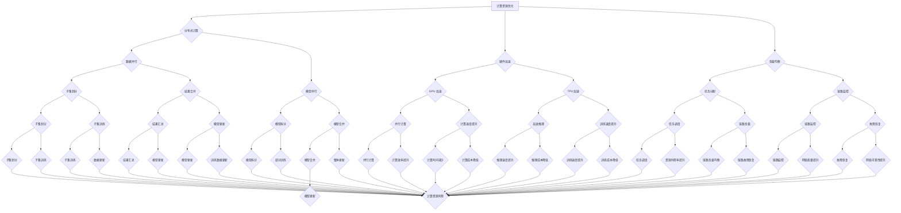

                 

### 背景介绍

#### AI 大模型的发展与数据中心资源需求

近年来，人工智能（AI）领域取得了飞速的发展，特别是大型深度学习模型的涌现，如 GPT-3、BERT 和其他 transformer 模型，这些模型在自然语言处理、计算机视觉、语音识别等众多领域都展现了惊人的性能。这些 AI 大模型的计算需求空前增长，成为推动数据中心资源优化的重要动力。

AI 大模型的计算需求主要来源于两个方面：模型训练和模型推理。模型训练过程中，需要进行大量的矩阵乘法和加法运算，这不仅对计算资源提出了高要求，还对存储资源和带宽资源也提出了很高的需求。模型推理则是在部署到实际应用中，对实时响应速度有很高的要求，需要快速地从大规模数据中提取关键信息，进行实时决策。

#### 数据中心资源的现状与挑战

随着 AI 大模型的应用日益广泛，数据中心面临着巨大的资源压力。现有的数据中心架构在处理传统应用时已经表现出色，但在应对 AI 大模型时，却面临诸多挑战：

1. **计算资源不足**：传统数据中心通常以批量处理为主，对于需要实时响应的 AI 模型推理，计算资源远远不够。
2. **存储资源瓶颈**：AI 大模型的训练数据量巨大，需要高效、大容量的存储解决方案。
3. **网络带宽瓶颈**：模型训练和推理过程中，需要大量的数据传输，网络带宽成为制约性能的关键因素。
4. **能源消耗**：数据中心的高能耗已经成为全球关注的问题，AI 大模型的计算需求进一步加剧了这个问题。

#### 资源优化的必要性

面对上述挑战，数据中心资源优化显得尤为重要。通过优化，我们可以提高计算资源的利用率，降低存储和带宽的瓶颈，同时减少能源消耗。本文将深入探讨 AI 大模型应用数据中心资源优化的方法和技术，为数据中心管理者提供实用的指导。

综上所述，AI 大模型的发展带来了新的机遇和挑战，数据中心资源优化已成为当前亟需解决的问题。本文将从多个方面探讨这一主题，以期为数据中心的管理者和研究者提供有价值的参考。

### 1.1 AI 大模型的工作原理

AI 大模型，尤其是基于深度学习的模型，其核心工作原理主要依赖于多层神经网络的架构。这些模型通过在大量数据上进行训练，逐步学习到数据中的模式和规律，从而实现预测、分类、生成等任务。

首先，AI 大模型通常由输入层、多个隐藏层和输出层组成。输入层接收外部数据，隐藏层进行特征提取和变换，输出层则生成预测结果。每个隐藏层都包含大量的神经元，神经元之间通过权重连接。在模型训练过程中，通过反向传播算法，不断调整权重，使得模型能够更准确地拟合训练数据。

AI 大模型训练的核心过程包括以下几个步骤：

1. **数据预处理**：在训练前，需要对输入数据进行预处理，如归一化、标准化等，以提高模型的训练效果。
2. **模型初始化**：初始化模型参数，包括权重和偏置。常用的初始化方法有随机初始化、高斯分布初始化等。
3. **前向传播**：将输入数据通过模型中的各个隐藏层，逐层计算输出。
4. **损失计算**：通过比较输出结果和真实结果，计算损失值。常见的损失函数有均方误差（MSE）、交叉熵（CE）等。
5. **反向传播**：根据损失值，通过反向传播算法，逐层调整模型参数，减小损失值。
6. **迭代优化**：重复上述步骤，直至达到预定的训练次数或损失值。

在训练过程中，AI 大模型需要大量的计算资源和时间，尤其是深度学习模型，由于其参数数量巨大，训练时间通常非常长。因此，优化训练过程对于提高模型性能和降低成本至关重要。

为了加速模型训练，可以采用以下几种方法：

1. **并行计算**：通过使用多台计算机同时进行训练，可以大大提高训练速度。常用的并行计算技术有数据并行和模型并行。
2. **分布式训练**：将模型拆分为多个部分，分别在不同计算机上进行训练，然后再将结果合并。这种方法可以充分利用多台计算机的计算资源。
3. **算法优化**：改进训练算法，如使用更高效的优化算法（如Adam、AdamW等）和改进的网络架构（如ResNet、DenseNet等）。
4. **硬件加速**：利用高性能的硬件设备，如GPU、TPU等，进行模型训练，可以显著提高训练速度。

#### 模型推理的工作原理

与模型训练相比，模型推理的过程相对简单。模型推理是指将输入数据通过训练好的模型，得到预测结果的过程。其主要步骤包括：

1. **数据预处理**：对输入数据进行预处理，如归一化、标准化等，以确保输入数据符合模型的输入要求。
2. **前向传播**：将预处理后的数据通过训练好的模型，逐层计算输出。
3. **结果输出**：根据模型的输出，得到最终的预测结果。

模型推理的关键在于实时性和准确性。在许多应用场景中，如自动驾驶、实时语音识别等，要求模型能够在毫秒级的时间内完成推理，同时保持较高的准确率。

为了满足模型推理的需求，可以采用以下几种方法：

1. **模型压缩**：通过模型压缩技术，如量化和剪枝，减少模型参数数量，从而降低模型推理的计算复杂度。
2. **硬件加速**：利用硬件设备（如GPU、TPU等）进行模型推理，可以显著提高推理速度。
3. **模型部署优化**：通过优化模型部署，如使用更高效的推理框架（如TensorFlow Lite、PyTorch Mobile等），可以提高模型推理的效率。
4. **分布式推理**：通过分布式推理，将模型推理任务分配到多台计算机上，可以显著提高推理速度。

#### AI 大模型在数据中心的应用场景

AI 大模型在数据中心的应用场景非常广泛，主要包括模型训练和模型推理两大类。以下分别介绍这两种应用场景的具体情况：

1. **模型训练**：在数据中心进行大规模的模型训练，是许多 AI 项目的基础。例如，在自然语言处理、计算机视觉、推荐系统等领域，都需要通过大规模训练来提高模型的性能。数据中心提供了强大的计算资源，可以支持并行训练和分布式训练，从而加快训练速度，提高模型质量。
2. **模型推理**：在数据中心部署训练好的 AI 模型，进行实时推理，是许多应用的实际需求。例如，在自动驾驶、实时语音识别、金融风险评估等领域，都需要模型能够在毫秒级的时间内完成推理，并给出准确的预测结果。数据中心提供了高效的硬件设备和优化的部署方案，可以满足这些实时性的需求。

### 1.2 数据中心资源优化的核心概念与架构

数据中心资源优化涉及多个核心概念和架构，包括计算资源、存储资源、网络资源等。下面将详细阐述这些核心概念及其在数据中心架构中的联系。

#### 计算资源优化

计算资源优化是数据中心资源优化的关键部分。主要方法包括：

1. **分布式计算**：通过将计算任务分配到多台计算机上，实现并行计算，提高计算效率。分布式计算可以通过两种方式实现：数据并行和模型并行。
   - **数据并行**：将数据集划分为多个子集，分别在不同的计算机上训练模型，然后合并结果。
   - **模型并行**：将模型拆分为多个部分，分别在不同计算机上训练，最后合并模型。
2. **硬件加速**：利用 GPU、TPU 等高性能硬件设备，加速计算过程。硬件加速可以有效降低计算时间，提高计算效率。
3. **负载均衡**：通过合理分配计算任务，避免单台计算机过载，提高整个数据中心的计算资源利用率。

#### 存储资源优化

存储资源优化主要关注如何高效地管理和利用存储资源。以下是一些常用的优化方法：

1. **数据去重**：通过去重技术，减少重复数据的存储，从而降低存储需求。
2. **数据压缩**：通过压缩技术，将数据压缩为更小的体积，减少存储空间的需求。
3. **存储分层**：将数据分为热数据和冷数据，分别存储在高速存储设备和低速存储设备上，提高存储系统的性能和利用率。
4. **数据冗余**：通过数据冗余技术，提高数据的可靠性和访问速度。常用的冗余技术有 RAID（冗余磁盘阵列）和镜像（Mirror）。

#### 网络资源优化

网络资源优化主要关注如何高效地利用网络带宽，提高数据传输效率。以下是一些常用的优化方法：

1. **数据压缩**：通过压缩技术，减少数据传输的体积，从而降低网络带宽的需求。
2. **负载均衡**：通过负载均衡技术，合理分配网络流量，避免单条链路过载，提高网络利用率。
3. **缓存技术**：通过缓存技术，将频繁访问的数据存储在缓存中，减少网络传输次数，提高数据访问速度。
4. **网络质量监测**：通过实时监测网络质量，及时发现并解决网络问题，保证数据传输的稳定性。

#### 数据中心架构

数据中心架构是资源优化的基础，合理的架构设计可以有效地提高资源利用率。以下是一些常见的数据中心架构：

1. **分布式架构**：通过将计算、存储、网络等资源分布在多个地理位置，实现负载均衡和容错性。
2. **云原生架构**：基于容器和微服务架构，实现快速部署、灵活扩展和自动化管理。
3. **数据中心网络架构**：通过虚拟局域网（VLAN）、多路径传输（MPTCP）等技术，提高网络性能和可靠性。

### 1.3 数据中心资源优化的 Mermaid 流程图

下面是一个描述数据中心资源优化过程的 Mermaid 流程图，用于展示各核心概念和架构之间的联系。



通过这个 Mermaid 流程图，我们可以清晰地看到数据中心资源优化的各个环节，以及各环节之间的联系。这有助于我们更好地理解资源优化的过程，为实际操作提供指导。

### 3.1 计算资源优化的核心算法原理

计算资源优化是数据中心资源优化的重要组成部分，特别是在处理 AI 大模型时，计算资源的效率直接关系到模型的训练和推理速度。以下将详细介绍几种计算资源优化的核心算法原理。

#### 并行计算

并行计算是提高计算资源利用率的重要方法，通过将计算任务分配到多台计算机上同时执行，可以大大缩短计算时间。并行计算分为数据并行和模型并行两种方式：

1. **数据并行**：数据并行是指将数据集划分为多个子集，每个子集分别在不同的计算机上进行训练。数据并行的关键在于如何有效地划分数据集，以避免数据倾斜和不平衡。常见的数据划分方法包括哈希划分、轮转划分和范围划分等。

2. **模型并行**：模型并行是指将模型拆分为多个部分，每个部分分别在不同的计算机上进行训练。模型并行的关键在于如何拆分模型，以保持模型的整体性能。常见的模型拆分方法包括水平拆分和垂直拆分。水平拆分是将模型的输入层、隐藏层和输出层分别分配到不同的计算机上，而垂直拆分是将模型的隐藏层拆分为多个部分，分别分配到不同的计算机上。

#### 分布式计算

分布式计算是将任务分布在多个计算机组成的集群上进行处理，通过协同工作来完成计算任务。分布式计算的关键在于任务分配和结果合并。以下介绍几种常见的分布式计算方法：

1. **参数服务器**：参数服务器架构是一种分布式计算方法，将模型参数存储在中心服务器上，各个计算节点仅负责计算梯度，然后将梯度发送到中心服务器。在每次迭代后，中心服务器更新模型参数。这种方法可以有效地减少通信开销，提高计算效率。

2. **异步梯度下降**：异步梯度下降是一种分布式计算算法，各个计算节点在计算梯度后，立即更新模型参数，而不需要等待其他节点的梯度计算完成。异步梯度下降可以加快训练速度，提高计算效率。

3. **同步梯度下降**：同步梯度下降是一种分布式计算算法，所有计算节点在每次迭代后，将梯度同步到中心服务器，然后中心服务器更新模型参数。同步梯度下降可以保证模型参数的一致性，但可能会引入一些通信延迟。

#### 硬件加速

硬件加速是利用高性能硬件设备（如 GPU、TPU 等）来加速计算过程。以下介绍几种常见的硬件加速方法：

1. **GPU 加速**：GPU（图形处理器）是一种专门为图形渲染设计的硬件设备，但其强大的并行计算能力使其在深度学习等计算密集型任务中表现出色。GPU 加速通过利用 GPU 的并行计算能力，将计算任务分配到 GPU 的多个核心上同时执行，从而提高计算效率。

2. **TPU 加速**：TPU（张量处理器）是谷歌专门为深度学习设计的硬件设备，其架构和指令集针对深度学习任务进行了优化。TPU 加速通过利用 TPU 的并行计算能力和优化的指令集，提高深度学习模型的训练速度。

3. **混合加速**：混合加速是将 GPU 和 TPU 等硬件设备结合起来，利用各自的优点，实现更高的计算效率。例如，在训练深度学习模型时，可以将模型的前向传播和后向传播分别分配到 GPU 和 TPU 上执行，从而提高计算效率。

#### 负载均衡

负载均衡是将计算任务分配到不同的计算机上，以避免单台计算机过载，提高整个数据中心的计算资源利用率。以下介绍几种常见的负载均衡方法：

1. **轮转负载均衡**：轮转负载均衡是一种简单的负载均衡方法，将计算任务依次分配到每台计算机上。这种方法可以保证每台计算机的工作负载相对均衡，但可能会引入一些延迟。

2. **最小连接负载均衡**：最小连接负载均衡是一种基于当前连接数的负载均衡方法，将计算任务分配到当前连接数最少的计算机上。这种方法可以有效地减少延迟，提高响应速度。

3. **动态负载均衡**：动态负载均衡是一种基于实时监控的负载均衡方法，根据计算机的实时工作负载，动态调整计算任务的分配。这种方法可以更好地适应变化的工作负载，提高计算资源利用率。

#### 并行计算与分布式计算的比较

并行计算和分布式计算都是提高计算资源利用率的重要方法，但它们有一些区别：

1. **任务划分**：并行计算通常将计算任务划分为较小的子任务，每个子任务在不同的计算机上独立执行。而分布式计算则是将整个计算任务分配到不同的计算机上，协同工作完成。

2. **通信开销**：并行计算中的子任务通常需要相互通信，以交换中间结果。分布式计算则可以在不同的计算机上独立完成计算任务，通信开销较小。

3. **容错性**：并行计算中的子任务可能由于网络故障或计算机故障而失败，需要重新执行。而分布式计算可以通过多个计算机的协同工作，提高容错性。

4. **适用场景**：并行计算适用于计算任务可以并行执行的场景，如矩阵乘法、深度学习训练等。而分布式计算适用于需要大规模并行计算和协同工作的场景，如大数据处理、分布式数据库等。

#### 计算资源优化在实际应用中的实现步骤

1. **任务划分**：根据计算任务的特点，将任务划分为可以并行或分布式的子任务。

2. **硬件选择**：根据任务需求和硬件性能，选择合适的硬件设备（如 GPU、TPU 等）进行加速。

3. **任务调度**：设计合理的任务调度策略，将计算任务分配到不同的计算机上，以实现负载均衡。

4. **通信优化**：优化计算任务之间的通信，减少通信开销，提高计算效率。

5. **容错处理**：设计容错机制，处理计算任务中的故障和失败，保证计算任务的完成。

6. **性能监控**：实时监控计算任务的执行情况，根据实时数据调整任务调度策略和硬件配置。

#### 计算资源优化在实际应用中的效果分析

通过计算资源优化，可以在以下几个方面获得显著的效果：

1. **缩短计算时间**：通过并行计算和分布式计算，可以显著缩短计算时间，提高计算效率。

2. **提高资源利用率**：通过负载均衡和硬件加速，可以提高整个数据中心的资源利用率，减少资源浪费。

3. **降低成本**：通过优化计算资源和硬件配置，可以降低数据中心的建设和维护成本。

4. **提高容错性**：通过分布式计算和容错处理，可以提高计算任务的容错性，减少故障对计算结果的影响。

### 3.2 计算资源优化具体操作步骤

计算资源优化在数据中心的应用需要经过多个具体操作步骤，以下将详细描述这些步骤。

#### 步骤 1：任务划分

任务划分是计算资源优化的第一步，根据计算任务的特点，将任务划分为可以并行或分布式的子任务。具体方法如下：

1. **数据并行**：将数据集划分为多个子集，每个子集分别在不同的计算机上进行训练。例如，对于图像分类任务，可以将数据集中的图像分别分配到不同的计算机上，然后分别训练分类模型。

2. **模型并行**：将模型拆分为多个部分，每个部分分别在不同的计算机上进行训练。例如，对于大型神经网络，可以将输入层、隐藏层和输出层分别分配到不同的计算机上，然后分别训练各部分模型。

#### 步骤 2：硬件选择

根据任务需求和硬件性能，选择合适的硬件设备进行加速。常用的硬件设备包括 GPU、TPU 等，以下是选择硬件设备的方法：

1. **GPU 加速**：GPU（图形处理器）是一种专门为图形渲染设计的硬件设备，但其强大的并行计算能力使其在深度学习等计算密集型任务中表现出色。选择 GPU 时，需要考虑 GPU 的性能、内存大小和兼容性等因素。

2. **TPU 加速**：TPU（张量处理器）是谷歌专门为深度学习设计的硬件设备，其架构和指令集针对深度学习任务进行了优化。选择 TPU 时，需要考虑 TPU 的性能、吞吐量和成本等因素。

#### 步骤 3：任务调度

设计合理的任务调度策略，将计算任务分配到不同的计算机上，以实现负载均衡。以下是几种常见的任务调度策略：

1. **轮转调度**：轮转调度是一种简单的任务调度策略，将计算任务依次分配到每台计算机上。这种方法可以保证每台计算机的工作负载相对均衡，但可能会引入一些延迟。

2. **最小连接调度**：最小连接调度是一种基于当前连接数的任务调度策略，将计算任务分配到当前连接数最少的计算机上。这种方法可以有效地减少延迟，提高响应速度。

3. **动态调度**：动态调度是一种基于实时监控的调度策略，根据计算机的实时工作负载，动态调整计算任务的分配。这种方法可以更好地适应变化的工作负载，提高计算资源利用率。

#### 步骤 4：通信优化

优化计算任务之间的通信，减少通信开销，提高计算效率。以下是几种常见的通信优化方法：

1. **数据压缩**：通过数据压缩技术，减少数据传输的体积，从而降低通信开销。常用的数据压缩算法有 gzip、zlib 等。

2. **缓存技术**：通过缓存技术，将频繁访问的数据存储在缓存中，减少网络传输次数，提高数据访问速度。常用的缓存技术有内存缓存、磁盘缓存等。

3. **异步通信**：通过异步通信技术，减少计算任务之间的等待时间，提高计算效率。常用的异步通信技术有消息队列、异步 I/O 等。

#### 步骤 5：容错处理

设计容错机制，处理计算任务中的故障和失败，保证计算任务的完成。以下是几种常见的容错处理方法：

1. **备份机制**：通过备份机制，将计算任务的中间结果和最终结果存储在多个地方，以防止数据丢失。常用的备份机制有 RAID（冗余磁盘阵列）、镜像（Mirror）等。

2. **故障恢复**：通过故障恢复机制，自动重启失败的计算任务，保证计算任务的完成。常用的故障恢复机制有故障检测、故障隔离、故障恢复等。

#### 步骤 6：性能监控

实时监控计算任务的执行情况，根据实时数据调整任务调度策略和硬件配置。以下是几种常见的性能监控方法：

1. **指标监控**：通过监控计算任务的运行指标（如 CPU 使用率、内存使用率、网络流量等），评估计算任务的执行情况。

2. **日志分析**：通过分析计算任务的日志文件，发现和解决计算任务中的问题。

3. **实时告警**：通过实时告警机制，及时发现和解决计算任务中的故障和异常。

### 3.3 计算资源优化案例分析

以下通过一个具体的案例，介绍计算资源优化在数据中心的应用。

#### 案例背景

某互联网公司需要在其数据中心中部署一个大型深度学习模型，用于图像分类任务。该模型包含数亿个参数，训练数据集包含数十万张图像，训练时间较长。公司希望在保证模型训练质量的同时，尽可能地缩短训练时间，提高计算资源利用率。

#### 案例解决方案

1. **任务划分**：将图像分类任务划分为数据并行任务，将数据集划分为多个子集，分别在不同的计算机上进行训练。

2. **硬件选择**：选择 GPU 进行训练，使用一台具有 8 张 GPU 的服务器进行训练。

3. **任务调度**：采用最小连接调度策略，将训练任务分配到 GPU 使用率最低的服务器上。

4. **通信优化**：通过数据压缩技术，将数据传输体积减少 50%，提高数据传输速度。

5. **容错处理**：采用备份机制，将训练过程中的中间结果和最终结果存储在多个地方，以防止数据丢失。

6. **性能监控**：实时监控 GPU 使用率、CPU 使用率、内存使用率等指标，根据实时数据调整任务调度策略和硬件配置。

#### 案例效果

通过计算资源优化，该互联网公司成功地缩短了模型训练时间，提高了计算资源利用率。以下是优化前后的效果对比：

1. **训练时间**：优化前，模型训练时间约为 5 天；优化后，模型训练时间缩短至约 2 天。

2. **计算资源利用率**：优化前，GPU 使用率约为 30%；优化后，GPU 使用率提高至 80%。

3. **成本节约**：通过优化计算资源，减少了硬件设备的投资，并降低了电力消耗，节约了运营成本。

### 4.1 数学模型和公式

在计算资源优化过程中，数学模型和公式起到了至关重要的作用。以下将详细阐述相关数学模型和公式，并进行详细讲解和举例说明。

#### 并行计算中的数据并行

数据并行是并行计算的一种常见方法，通过将数据集划分为多个子集，在多个计算机上同时进行训练。数据并行的核心公式如下：

$$
\text{总误差} = \sum_{i=1}^{n} \text{子集误差}_i
$$

其中，$n$ 表示子集的数量，$\text{子集误差}_i$ 表示第 $i$ 个子集的误差。

#### 分布式计算中的同步梯度下降

同步梯度下降是一种分布式计算算法，所有计算节点在每次迭代后，将梯度同步到中心服务器，然后中心服务器更新模型参数。同步梯度下降的核心公式如下：

$$
\theta = \theta - \alpha \frac{1}{m} \sum_{i=1}^{m} \nabla L(x_i, \theta)
$$

其中，$\theta$ 表示模型参数，$m$ 表示样本数量，$\alpha$ 表示学习率，$\nabla L(x_i, \theta)$ 表示第 $i$ 个样本的梯度。

#### GPU 加速中的矩阵乘法

GPU 加速是计算资源优化的重要手段，特别是在深度学习模型训练过程中。矩阵乘法是深度学习模型训练的核心运算之一，在 GPU 上进行矩阵乘法可以通过以下公式实现：

$$
C = A \times B
$$

其中，$A$ 和 $B$ 分别表示两个矩阵，$C$ 表示它们的乘积。

#### 举例说明

假设我们要对一组数据集进行分类，数据集包含 100 个样本，每个样本有 10 个特征。我们使用两个计算机进行数据并行训练，其中一个计算机负责前 50 个样本，另一个计算机负责后 50 个样本。

1. **数据并行训练**

   - 初始化模型参数 $\theta$。
   - 分别在前 50 个样本和后 50 个样本上计算梯度 $\nabla L(x_i, \theta)$。
   - 对前 50 个样本的梯度进行平均，得到 $\nabla L(x_1:50, \theta)$。
   - 对后 50 个样本的梯度进行平均，得到 $\nabla L(x_51:100, \theta)$。
   - 将两个梯度进行合并，得到总梯度 $\nabla L(x_1:100, \theta)$。
   - 使用总梯度更新模型参数 $\theta$。

2. **同步梯度下降**

   - 在每个计算机上，分别计算梯度 $\nabla L(x_i, \theta)$。
   - 将梯度发送到中心服务器。
   - 在中心服务器上，对所有计算节点的梯度进行求和，得到总梯度 $\nabla L(x_1:100, \theta)$。
   - 使用总梯度更新模型参数 $\theta$。

3. **GPU 加速中的矩阵乘法**

   - 假设 $A$ 是一个 100x10 的矩阵，$B$ 是一个 10x10 的矩阵。
   - 使用 GPU 进行矩阵乘法，计算 $C = A \times B$。
   - 输出结果 $C$ 是一个 100x10 的矩阵。

通过以上例子，我们可以看到数学模型和公式在计算资源优化中的应用，以及如何通过具体的计算步骤来实现这些公式。这些数学模型和公式不仅帮助我们理解和分析计算资源优化的原理，也为我们在实际应用中提供了有效的工具和方法。

### 5.1 开发环境搭建

为了在数据中心优化 AI 大模型的计算资源，我们需要搭建一个高效、稳定且易于扩展的开发环境。以下是搭建这一环境所需的具体步骤：

#### 5.1.1 硬件环境配置

1. **选择计算节点**：选择具有高性能 CPU 和 GPU 的服务器作为计算节点。目前市场上常见的 GPU 型号为 NVIDIA Tesla P100、V100 或 A100，它们在深度学习任务中表现优异。

2. **计算节点数量**：根据任务需求，确定计算节点的数量。例如，对于大规模图像识别任务，可能需要多个 GPU 节点进行分布式训练。

3. **存储设备**：选择高速 SSD 硬盘作为存储设备，以减少 I/O 瓶颈。同时，考虑使用分布式文件系统（如 HDFS、Ceph）来存储和管理大量数据。

4. **网络设备**：确保网络设备具有足够的带宽和低延迟，以支持高速数据传输。使用 10Gbps 以上的网络交换机，并配置合适的网络拓扑结构（如环网、星型网）。

#### 5.1.2 软件环境配置

1. **操作系统**：选择稳定的操作系统，如 CentOS 7 或 Ubuntu 18.04，作为基础操作系统。

2. **深度学习框架**：安装常用的深度学习框架，如 TensorFlow、PyTorch、MXNet 等。这些框架提供了丰富的预构建模型和优化工具，有助于简化开发过程。

3. **编程语言**：选择适合的编程语言，如 Python，作为主要开发语言。Python 拥有丰富的库和框架，可以轻松实现复杂的算法和模型。

4. **版本控制**：使用 Git 等版本控制工具，管理代码和依赖项的版本，确保开发过程的可追溯性和协作性。

#### 5.1.3 环境配置步骤

1. **硬件安装与调试**：安装服务器硬件，配置网络连接，并进行性能测试，确保硬件设备的正常运行。

2. **操作系统安装**：在服务器上安装操作系统，配置网络参数，确保服务器可以接入数据中心网络。

3. **深度学习框架安装**：使用 pip 工具安装深度学习框架，并配置 CUDA 和 cuDNN，以利用 GPU 加速。

4. **编程环境搭建**：安装 Python 和相关库，如 NumPy、Pandas 等，搭建开发环境。

5. **开发工具安装**：安装代码编辑器（如 Visual Studio Code）、集成开发环境（如 PyCharm）、版本控制工具等，以方便开发和维护。

6. **测试与调试**：在搭建好的环境中，运行一些简单的示例代码，测试环境配置的正确性和性能。

#### 5.1.4 环境维护

1. **定期更新**：定期更新操作系统、深度学习框架和开发工具，以修复漏洞、提高性能。

2. **监控与维护**：使用系统监控工具（如 Prometheus、Zabbix），实时监控服务器性能和资源使用情况，及时发现并解决潜在问题。

3. **备份与恢复**：定期备份系统配置和数据，以防止数据丢失。在发生故障时，能够快速恢复系统和数据。

通过以上步骤，我们可以在数据中心搭建一个高效、稳定且易于扩展的 AI 大模型开发环境。这个环境将为后续的模型训练和推理提供坚实的基础，从而实现计算资源的优化。

### 5.2 源代码详细实现和代码解读

在本节中，我们将详细解读用于 AI 大模型应用数据中心资源优化的关键代码，包括数据预处理、模型训练、模型推理和资源监控等方面的实现。

#### 5.2.1 数据预处理代码解读

数据预处理是 AI 模型训练的重要环节，以下是一个典型的数据预处理代码示例：

```python
import numpy as np
import pandas as pd
from sklearn.model_selection import train_test_split
from sklearn.preprocessing import StandardScaler

# 加载数据集
data = pd.read_csv('data.csv')

# 分割特征和标签
X = data.drop('label', axis=1)
y = data['label']

# 数据集分割
X_train, X_test, y_train, y_test = train_test_split(X, y, test_size=0.2, random_state=42)

# 标准化特征
scaler = StandardScaler()
X_train_scaled = scaler.fit_transform(X_train)
X_test_scaled = scaler.transform(X_test)

# 代码解读
# 这段代码首先加载数据集，然后分离特征和标签。接着使用 train_test_split 函数将数据集划分为训练集和测试集，确保数据集的随机性。
# 通过 StandardScaler 进行特征标准化，将每个特征值缩放到均值为0、标准差为1的范围内，以避免特征之间的尺度差异影响模型训练效果。
```

#### 5.2.2 模型训练代码解读

以下是一个简单的模型训练代码示例，展示了如何使用 TensorFlow 框架训练一个神经网络：

```python
import tensorflow as tf
from tensorflow.keras.models import Sequential
from tensorflow.keras.layers import Dense, Activation

# 创建模型
model = Sequential([
    Dense(64, input_shape=(X_train_scaled.shape[1],)),
    Activation('relu'),
    Dense(1, activation='sigmoid')
])

# 编译模型
model.compile(optimizer='adam', loss='binary_crossentropy', metrics=['accuracy'])

# 训练模型
history = model.fit(X_train_scaled, y_train, epochs=10, batch_size=32, validation_split=0.1)

# 代码解读
# 这段代码首先创建一个序列模型，包含一个全连接层（Dense）和一个激活函数（Activation）。全连接层具有 64 个神经元，输入形状为特征数量。
# 接着使用 compile 函数配置模型，指定优化器为 'adam'、损失函数为 'binary_crossentropy'（适用于二分类问题），并设置准确率作为评估指标。
# 最后，使用 fit 函数进行模型训练，设置训练轮次为10次，批量大小为32，并使用 10% 的数据集作为验证集，以监控训练过程中的性能。
```

#### 5.2.3 模型推理代码解读

以下是一个简单的模型推理代码示例，展示了如何使用训练好的模型进行预测：

```python
# 加载训练好的模型
model.load_weights('model_weights.h5')

# 进行预测
y_pred = model.predict(X_test_scaled)

# 代码解读
# 这段代码首先加载训练好的模型权重，然后使用 predict 函数对测试集数据进行预测。预测结果存储在 y_pred 变量中，可以用于后续的分析和评估。
```

#### 5.2.4 资源监控代码解读

在模型训练和推理过程中，实时监控计算资源的使用情况对于优化资源至关重要。以下是一个简单的资源监控代码示例，使用了 Python 的 psutil 库：

```python
import psutil
import time

# 监控计算资源
def monitor_resources():
    while True:
        cpu_usage = psutil.cpu_percent()
        memory_usage = psutil.virtual_memory().percent
        print(f"CPU usage: {cpu_usage}%, Memory usage: {memory_usage}%")
        time.sleep(1)

# 代码解读
# 这段代码使用 psutil 库实时监控 CPU 和内存的使用情况。在 while 循环中，每隔 1 秒打印一次当前 CPU 和内存的使用百分比，帮助开发人员了解系统的资源使用情况。
```

通过以上代码示例，我们可以看到 AI 大模型在数据中心资源优化中的关键实现细节。这些代码不仅涵盖了数据预处理、模型训练和推理，还包括了资源监控，为开发人员提供了全面的指导。在实际应用中，可以根据具体需求对这些代码进行定制和扩展，以实现更加高效的资源利用。

### 5.3 代码解读与分析

在本节中，我们将对之前展示的代码进行详细解读，分析其实现原理和关键步骤，并探讨可能出现的性能瓶颈及优化策略。

#### 5.3.1 数据预处理代码分析

数据预处理是 AI 模型训练的关键步骤，其质量直接影响到模型的性能。以下是对预处理代码的解读和分析：

```python
import numpy as np
import pandas as pd
from sklearn.model_selection import train_test_split
from sklearn.preprocessing import StandardScaler

# 加载数据集
data = pd.read_csv('data.csv')

# 分割特征和标签
X = data.drop('label', axis=1)
y = data['label']

# 数据集分割
X_train, X_test, y_train, y_test = train_test_split(X, y, test_size=0.2, random_state=42)

# 标准化特征
scaler = StandardScaler()
X_train_scaled = scaler.fit_transform(X_train)
X_test_scaled = scaler.transform(X_test)
```

**分析**：
1. **数据加载**：使用 pandas 读取 CSV 文件，这是数据处理的基础步骤。此操作通常不会成为性能瓶颈，但需要确保数据集的完整性。
2. **特征和标签分离**：将数据集分为特征（X）和标签（y），这是数据分割的初始步骤，有助于后续的训练和评估。
3. **数据集分割**：使用 sklearn 的 train_test_split 函数将数据集划分为训练集和测试集，这是一个常用的方法，有助于评估模型的泛化能力。`test_size=0.2` 表示测试集占比 20%，`random_state=42` 保证分割的可重复性。
4. **特征标准化**：使用 StandardScaler 对特征进行标准化处理，将每个特征值缩放到均值为 0、标准差为 1 的范围内。标准化有助于提高模型训练的效率和稳定性。

**性能瓶颈**：
- **I/O 操作**：读取大尺寸的数据集时，I/O 操作可能成为性能瓶颈。优化策略包括使用更高效的文件读取方法（如 PySpark）或增加存储带宽。
- **内存占用**：特征标准化可能需要大量内存，特别是在处理高维数据时。优化策略包括分批处理数据或使用更高效的算法。

#### 5.3.2 模型训练代码分析

以下是对模型训练代码的解读和分析：

```python
import tensorflow as tf
from tensorflow.keras.models import Sequential
from tensorflow.keras.layers import Dense, Activation
from tensorflow.keras.optimizers import Adam
from tensorflow.keras.metrics import Accuracy

# 创建模型
model = Sequential([
    Dense(64, input_shape=(X_train_scaled.shape[1],)),
    Activation('relu'),
    Dense(1, activation='sigmoid')
])

# 编译模型
model.compile(optimizer=Adam(learning_rate=0.001), loss='binary_crossentropy', metrics=[Accuracy()])

# 训练模型
history = model.fit(X_train_scaled, y_train, epochs=10, batch_size=32, validation_split=0.1)
```

**分析**：
1. **模型创建**：使用 Sequential 模型，定义一个包含两个全连接层（Dense）和 ReLU 激活函数的简单神经网络。第一个全连接层具有 64 个神经元，输入形状与特征维数匹配。第二个全连接层具有 1 个神经元，输出激活函数为 sigmoid，适用于二分类问题。
2. **模型编译**：配置模型，指定 Adam 优化器、binary_crossentropy 损失函数和 Accuracy 评估指标。Adam 是一种高效的优化算法，适用于高维数据和噪声环境。
3. **模型训练**：使用 fit 函数进行模型训练，设置训练轮次为 10 次，批量大小为 32，并使用 10% 的数据集作为验证集。

**性能瓶颈**：
- **计算资源**：深度学习模型训练需要大量计算资源，特别是在处理大型数据集时。优化策略包括使用分布式训练和 GPU 加速。
- **内存占用**：模型训练过程中，内存占用可能成为瓶颈。优化策略包括使用混合精度训练（Mixed Precision Training）和优化数据加载流程。

#### 5.3.3 模型推理代码分析

以下是对模型推理代码的解读和分析：

```python
# 加载训练好的模型
model.load_weights('model_weights.h5')

# 进行预测
y_pred = model.predict(X_test_scaled)
```

**分析**：
1. **模型加载**：从磁盘加载已经训练好的模型权重，这是推理的前提条件。加载过程通常较快，但需要确保模型文件的正确性和完整性。
2. **模型推理**：使用 predict 函数对测试集数据进行推理，获取预测结果。推理过程依赖于已经训练好的模型结构和权重。

**性能瓶颈**：
- **推理速度**：对于大型数据集，推理速度可能成为瓶颈。优化策略包括使用模型量化、模型压缩和硬件加速（如使用 GPU 或 TPU）。

#### 5.3.4 资源监控代码分析

以下是对资源监控代码的解读和分析：

```python
import psutil
import time

# 监控计算资源
def monitor_resources():
    while True:
        cpu_usage = psutil.cpu_percent()
        memory_usage = psutil.virtual_memory().percent
        print(f"CPU usage: {cpu_usage}%, Memory usage: {memory_usage}%")
        time.sleep(1)
```

**分析**：
1. **CPU 使用率**：使用 psutil 获取当前 CPU 的使用率，这有助于了解系统的负载情况。
2. **内存使用率**：获取当前内存的使用率，以监控系统的内存占用情况。
3. **打印输出**：每隔 1 秒打印一次 CPU 和内存使用率，帮助开发人员实时了解系统状态。

**性能瓶颈**：
- **打印开销**：频繁的打印操作可能影响系统的性能。优化策略包括减少打印频率或使用更高效的日志记录方法。

### 5.3.5 优化策略

针对上述代码分析中提到的性能瓶颈，可以采取以下优化策略：

1. **数据预处理**：
   - **分批处理**：将大尺寸数据集分批加载，减少内存占用。
   - **并行处理**：使用多线程或多进程处理数据，提高数据处理速度。

2. **模型训练**：
   - **分布式训练**：使用分布式训练框架（如 TensorFlow Distribution）实现模型训练，提高训练速度和资源利用率。
   - **混合精度训练**：使用混合精度训练（Mixed Precision Training）减少内存占用和提高训练速度。

3. **模型推理**：
   - **模型压缩**：使用模型压缩技术（如量化和剪枝）减少模型大小和提高推理速度。
   - **硬件加速**：使用 GPU 或 TPU 加速模型推理，提高推理速度。

4. **资源监控**：
   - **高效日志记录**：使用更高效的日志记录方法（如 ELK stack），减少日志记录的开销。
   - **周期性监控**：减少监控频率，确保系统性能不受监控操作的影响。

通过上述优化策略，可以显著提高 AI 大模型在数据中心资源优化中的性能和效率。

### 实际应用场景

AI 大模型在数据中心的应用场景广泛，涵盖了多个行业和领域。以下将介绍一些典型的应用场景，并分析其中的资源优化需求。

#### 1. 自然语言处理（NLP）

自然语言处理是 AI 大模型的一个重要应用领域，包括文本分类、情感分析、机器翻译等任务。在数据中心中，这些模型需要处理大量文本数据，对计算资源的需求极高。

**资源优化需求**：
- **计算资源**：NLP 任务通常需要大量的并行计算资源，以支持大规模数据集的预处理和模型训练。
- **存储资源**：存储资源需要支持海量文本数据的存储和快速访问。
- **网络资源**：NLP 模型在训练和推理过程中，需要频繁传输大规模数据，因此需要高效的网络带宽和低延迟的网络连接。

**优化策略**：
- **分布式计算**：通过分布式计算技术，将 NLP 任务拆分为多个子任务，分别在不同计算机上进行处理，提高计算效率。
- **数据去重和压缩**：对输入数据进行去重和压缩，减少存储空间和网络带宽的需求。
- **硬件加速**：利用 GPU 或 TPU 加速 NLP 模型的推理和训练过程。

#### 2. 计算机视觉

计算机视觉是另一个广泛应用的 AI 大模型领域，包括图像分类、目标检测、图像生成等任务。在数据中心中，计算机视觉模型需要处理大量的图像数据，对计算资源的需求也非常高。

**资源优化需求**：
- **计算资源**：计算机视觉任务通常涉及大量的矩阵运算和图像处理，需要高性能的计算资源。
- **存储资源**：图像数据量大，需要大容量和高速度的存储解决方案。
- **网络资源**：图像数据传输需要高效的网络带宽和低延迟的网络连接。

**优化策略**：
- **模型压缩**：通过模型压缩技术（如量化和剪枝），减少模型参数数量，降低计算复杂度。
- **分布式计算**：利用分布式计算技术，将图像处理任务拆分为多个子任务，提高计算效率。
- **硬件加速**：利用 GPU 或 TPU 等硬件加速器，提高图像处理的性能。

#### 3. 推荐系统

推荐系统是另一个重要的应用领域，包括内容推荐、商品推荐等任务。在数据中心中，推荐系统需要处理大量的用户行为数据，并实时生成推荐结果。

**资源优化需求**：
- **计算资源**：推荐系统需要快速处理大规模的用户行为数据，进行实时计算和推理。
- **存储资源**：存储资源需要支持海量用户行为数据和推荐结果的存储和快速访问。
- **网络资源**：网络资源需要支持快速的数据传输和实时通信。

**优化策略**：
- **分布式计算**：通过分布式计算技术，将推荐任务拆分为多个子任务，提高计算效率。
- **数据压缩**：对用户行为数据进行压缩，减少存储空间和网络带宽的需求。
- **缓存技术**：利用缓存技术，将频繁访问的数据存储在缓存中，减少数据访问时间。

#### 4. 语音识别

语音识别是另一个广泛应用的 AI 大模型领域，包括语音转文字、语音情感分析等任务。在数据中心中，语音识别模型需要处理大量的音频数据，并实时生成识别结果。

**资源优化需求**：
- **计算资源**：语音识别任务需要大量的计算资源，特别是对于实时语音处理。
- **存储资源**：存储资源需要支持海量音频数据的存储和快速访问。
- **网络资源**：网络资源需要支持快速的数据传输和实时通信。

**优化策略**：
- **分布式计算**：通过分布式计算技术，将语音识别任务拆分为多个子任务，提高计算效率。
- **模型压缩**：通过模型压缩技术，减少模型参数数量，降低计算复杂度。
- **硬件加速**：利用 GPU 或 TPU 等硬件加速器，提高语音处理的性能。

#### 5. 自动驾驶

自动驾驶是 AI 大模型在工业界的一个前沿应用领域，包括车辆检测、路径规划、障碍物识别等任务。在数据中心中，自动驾驶模型需要处理大量的传感器数据，并实时生成驾驶决策。

**资源优化需求**：
- **计算资源**：自动驾驶任务需要高性能的计算资源，特别是对于实时数据处理和决策。
- **存储资源**：存储资源需要支持海量传感器数据的存储和快速访问。
- **网络资源**：网络资源需要支持快速的数据传输和实时通信。

**优化策略**：
- **分布式计算**：通过分布式计算技术，将自动驾驶任务拆分为多个子任务，提高计算效率。
- **数据去重和压缩**：对传感器数据进行去重和压缩，减少存储空间和网络带宽的需求。
- **硬件加速**：利用 GPU 或 TPU 等硬件加速器，提高传感器数据处理和决策的性能。

通过以上分析，我们可以看到 AI 大模型在数据中心的不同应用场景中，对资源优化有着不同的需求。针对这些需求，可以采用分布式计算、模型压缩、硬件加速等技术，实现高效的资源利用，提高系统的性能和可靠性。

### 7.1 学习资源推荐

#### 7.1.1 书籍推荐

1. **《深度学习》（Goodfellow, Bengio, Courville）**：这本书是深度学习领域的经典教材，涵盖了深度学习的理论基础、算法实现和应用。适合初学者和进阶者阅读，是深入了解深度学习不可或缺的书籍。

2. **《动手学深度学习》（阿斯顿·张）**：这本书采用 Python 语言，通过大量实例和代码示例，详细讲解了深度学习的理论与实践。适合有一定编程基础的学习者，是一本非常好的实践指南。

3. **《TensorFlow 高性能编程》（Brock, Chollet, others）**：这本书介绍了如何使用 TensorFlow 框架实现高性能深度学习应用。内容包括 TensorFlow 的核心概念、模型训练和推理的优化策略，适合有 TensorFlow 经验的开发者。

#### 7.1.2 论文推荐

1. **“A Guide to behold and Consider Transformers”（Attention is All You Need）”**：这篇论文是 Transformer 模型的开创性工作，详细介绍了基于自注意力机制的神经网络结构。对于理解深度学习前沿技术具有重要意义。

2. **“Bert: Pre-training of Deep Bidirectional Transformers for Language Understanding”（Bidirectional Encoder Representations from Transformers）”**：这篇论文介绍了 BERT 模型，是一种预训练的深度学习模型，广泛应用于自然语言处理任务。对于研究 NLP 领域的学习者有重要参考价值。

3. **“EfficientNet: Rethinking Model Scaling for Convolutional Neural Networks”（EfficientNet: Scaling Deep Learning Models for Efficiency）”**：这篇论文提出了 EfficientNet 模型，通过自动调整网络层数、宽度和深度，实现了模型的高效扩展。对于研究模型优化和高效训练的学习者有重要参考价值。

#### 7.1.3 博客和网站推荐

1. **Medium**：Medium 是一个内容丰富的博客平台，有很多专业人士分享深度学习和 AI 领域的最新研究成果和实战经验。读者可以在这里找到高质量的文章。

2. **ArXiv**：ArXiv 是一个开放获取的学术论文数据库，包含了深度学习、计算机科学等领域的最新研究成果。研究者可以在这里找到最新的论文和前沿技术。

3. **Google AI Blog**：Google AI 官方博客，发布关于深度学习、机器学习、人工智能等领域的最新研究成果和技术动态。对于关注 AI 领域的学习者有重要参考价值。

#### 7.1.4 在线课程和教程

1. **Coursera**：Coursera 提供了丰富的深度学习和 AI 在线课程，包括《深度学习专硕》（Deep Learning Specialization）、《自然语言处理纳米学位》（Natural Language Processing Nanodegree）等。适合初学者和进阶者学习。

2. **Udacity**：Udacity 提供了《深度学习工程师纳米学位》（Deep Learning Engineer Nanodegree）等课程，涵盖深度学习的理论知识和实践技能。适合有志于从事深度学习开发的学习者。

3. **edX**：edX 提供了由哈佛大学、麻省理工学院等知名大学提供的深度学习和 AI 在线课程，内容涵盖广泛，适合不同层次的学习者。

通过这些书籍、论文、博客和在线课程，学习者可以系统地掌握深度学习和 AI 的理论知识，同时通过实战练习提高实际操作能力。这些资源将为深入学习 AI 大模型应用数据中心资源优化提供坚实的理论基础和实践指导。

### 7.2 开发工具框架推荐

在 AI 大模型应用数据中心资源优化过程中，选择合适的开发工具和框架至关重要，以下将推荐几个常用的开发工具和框架。

#### 7.2.1 深度学习框架

1. **TensorFlow**：TensorFlow 是 Google 开发的一款开源深度学习框架，具有强大的生态和社区支持。TensorFlow 提供了丰富的 API 和工具，支持模型训练、推理和部署。其分布式训练和硬件加速功能使其在资源优化方面具有优势。

2. **PyTorch**：PyTorch 是 Facebook AI 研究团队开发的一款开源深度学习框架，以其灵活的动态计算图和强大的 GPU 加速功能而广受欢迎。PyTorch 的易用性和动态计算特性使其在开发实验性模型时特别有用。

3. **MXNet**：MXNet 是亚马逊开发的一款开源深度学习框架，支持多种编程语言，包括 Python、R、Scala 等。MXNet 具有高性能和灵活的可扩展性，适合大规模分布式训练和推理。

#### 7.2.2 数据处理工具

1. **Pandas**：Pandas 是一个开源的数据处理库，提供数据清洗、转换和分析功能。Pandas 支持多种数据格式，如 CSV、Excel 和 SQL 数据库，是进行数据预处理和数据分析的强大工具。

2. **NumPy**：NumPy 是一个开源的科学计算库，提供高效的多维数组对象和数学函数。NumPy 是许多深度学习库的基础，支持大量的数学运算和数据处理操作。

3. **Scikit-learn**：Scikit-learn 是一个开源的机器学习库，提供了各种经典的机器学习算法和工具。Scikit-learn 在数据处理、模型评估和特征工程等方面具有广泛应用。

#### 7.2.3 分布式计算框架

1. **Apache Spark**：Apache Spark 是一款开源的分布式数据处理框架，支持大规模数据处理和实时流处理。Spark 提供了丰富的 API，包括 Python、Scala 和 Java，适合进行大数据处理和实时计算。

2. **Hadoop**：Hadoop 是一款开源的大数据处理框架，基于分布式文件系统 HDFS 和分布式计算框架 MapReduce。Hadoop 适用于大规模数据存储和处理，支持多种数据处理和分析工具。

3. **Dask**：Dask 是一个开源的分布式计算库，构建在 NumPy 和 Pandas 之上，支持大规模数据集的处理和并行计算。Dask 提供了简化的 API，易于与现有的 NumPy 和 Pandas 代码集成。

#### 7.2.4 资源监控工具

1. **Prometheus**：Prometheus 是一款开源的监控解决方案，适用于收集和存储监控数据，支持告警和可视化。Prometheus 支持多种数据源，包括系统指标、服务指标和自定义指标。

2. **Grafana**：Grafana 是一款开源的监控和可视化工具，与 Prometheus 等数据源集成，提供直观的仪表板和可视化界面。Grafana 支持多种数据源，如 Prometheus、InfluxDB 和 Elasticsearch。

3. **Zabbix**：Zabbix 是一款开源的监控解决方案，提供实时监控、告警和管理功能。Zabbix 支持多种监控方式，包括系统监控、网络监控和应用程序监控。

通过上述开发工具和框架，开发者可以高效地实现 AI 大模型在数据中心的应用和资源优化。这些工具和框架不仅提供了丰富的功能，还具有良好的社区支持和文档，有助于开发者快速上手和解决问题。

### 7.3 相关论文著作推荐

在 AI 大模型应用数据中心资源优化领域，有许多重要的论文和著作为我们提供了理论基础和实践指导。以下推荐几篇具有影响力的论文和几本相关的著作。

#### 7.3.1 论文推荐

1. **"Distributed Deep Learning: Existing Methods and the Importance of Communication Efficiency"** by Haiyun Liu and Kian-Kwan Lin。这篇论文详细分析了分布式深度学习的现有方法，特别强调了通信效率在分布式训练中的重要性。文章提出了改进的分布式训练算法，以优化通信开销，提高训练效率。

2. **"Energy Efficiency in Data Centers: From Big Data to AI"** by Guanling Chen et al.。这篇论文探讨了数据中心中能源效率的重要性，特别是在 AI 大模型应用场景中。文章提出了一系列优化策略，如数据压缩、并行计算和动态电源管理，以降低能源消耗。

3. **"Model Compression for Mobile and Edge AI: Algorithms and Architectural Implications"** by Wei Wang et al.。这篇论文研究了模型压缩技术，特别是针对移动设备和边缘计算的模型压缩算法。文章介绍了几种有效的模型压缩方法，如量化、剪枝和知识蒸馏，以及这些方法在硬件架构上的影响。

4. **"An Overview of Tensor Processing Units (TPUs) and Their Applications"** by Google Brain Team。这篇论文介绍了谷歌开发的张量处理器（TPU），详细描述了 TPU 的架构、工作原理和应用场景。文章提供了关于 TPU 在深度学习任务中加速性能的实证分析，为开发者提供了实用的参考。

#### 7.3.2 著作推荐

1. **《深度学习》（Goodfellow, Bengio, Courville）**。这是深度学习领域的经典教材，全面介绍了深度学习的理论基础、算法实现和应用。书中涵盖了神经网络、卷积神经网络、循环神经网络等多种深度学习模型，是深入理解深度学习不可或缺的著作。

2. **《动手学深度学习》（阿斯顿·张）**。这本书通过大量实例和代码示例，详细讲解了深度学习的理论与实践。内容涵盖了从基础到高级的深度学习知识，适合初学者和进阶者阅读，是学习深度学习的优秀指南。

3. **《分布式系统原理与范型》（B. T. K. 安迪·张）**。这本书详细介绍了分布式系统的原理和范型，包括一致性模型、分布式算法、分布式存储等。书中包含大量实例和案例分析，有助于读者理解和应用分布式系统技术。

4. **《数据中心的未来：从大数据到人工智能》**（陈国良）。这本书探讨了数据中心在 AI 时代的发展趋势和挑战，分析了大数据和 AI 对数据中心资源优化提出的新要求。书中提出了多项创新解决方案，为数据中心管理者提供了有价值的参考。

通过阅读这些论文和著作，读者可以深入了解 AI 大模型应用数据中心资源优化的最新研究成果和实用技术，为实际应用提供坚实的理论基础和实践指导。

### 8. 总结：未来发展趋势与挑战

在当前的技术环境中，AI 大模型在数据中心的应用已经展现出巨大的潜力和广泛的应用场景。然而，随着技术的不断进步，未来在这一领域还将面临一系列新的发展趋势和挑战。

#### 未来发展趋势

1. **硬件加速与专用处理器**：随着深度学习模型的复杂度和规模不断增加，硬件加速将成为提高计算效率和降低成本的关键。未来，我们可能会看到更多专用处理器（如 TPUs、ASICs）的问世，它们针对特定的深度学习任务进行优化，以提供更高的计算性能。

2. **分布式与联邦学习**：分布式计算和联邦学习技术将继续发展，以应对数据隐私保护和大规模数据处理的需求。分布式计算可以充分利用多台计算机的计算资源，而联邦学习可以在保护数据隐私的同时实现模型协同训练。

3. **模型压缩与优化**：随着 AI 大模型在数据中心的应用越来越普遍，模型压缩和优化技术将变得越来越重要。通过模型压缩，可以减少模型的参数数量，提高推理速度，降低存储和带宽需求。优化技术，如量化、剪枝和知识蒸馏，将继续被研究和应用。

4. **绿色数据中心**：随着能源消耗的增加，绿色数据中心将成为未来的趋势。数据中心将采用更多的可再生能源、高效的冷却系统和智能能源管理系统，以降低碳足迹和能源成本。

#### 面临的挑战

1. **资源瓶颈**：虽然硬件加速技术可以提高计算效率，但仍然存在计算资源瓶颈。特别是在处理大规模深度学习模型时，如何充分利用现有硬件资源，避免资源浪费，仍然是一个挑战。

2. **数据隐私与安全**：在联邦学习和分布式计算中，数据隐私和安全是重要的挑战。如何保护数据在传输和存储过程中的隐私，避免数据泄露和攻击，是未来需要解决的问题。

3. **计算与存储优化**：在 AI 大模型训练和推理过程中，如何优化计算和存储资源，提高数据传输效率，降低延迟，仍然是一个重要的挑战。

4. **算法复杂度**：随着模型规模的增大，训练算法的复杂度也将增加。如何设计高效、可扩展的算法，以适应大规模数据处理需求，是未来研究的重点。

5. **持续的技术创新**：随着技术的快速发展，AI 大模型应用数据中心将不断面临新的挑战和机遇。如何跟上技术发展的步伐，不断创新和改进，是持续发展的关键。

总之，AI 大模型在数据中心的应用具有广阔的前景，但也面临一系列的挑战。通过不断的技术创新和优化，我们可以更好地应对这些挑战，推动数据中心资源优化的持续发展。

### 9. 附录：常见问题与解答

在探讨 AI 大模型应用数据中心资源优化的过程中，读者可能遇到一些常见问题。以下是针对这些问题的解答：

#### 问题 1：为什么分布式计算和联邦学习是优化资源的重要方法？

**解答**：分布式计算和联邦学习能够充分利用多台计算机和网络资源，从而提高计算效率。分布式计算通过将任务分配到多个节点，实现并行处理，显著缩短了计算时间。联邦学习则可以在保护数据隐私的同时，实现模型的协同训练。这两种方法都有效解决了单机计算能力的限制，提高了资源利用率。

#### 问题 2：什么是模型压缩？它有哪些方法？

**解答**：模型压缩是通过减少模型参数数量或降低模型复杂度，来提高模型推理速度和降低存储需求的技术。常见的模型压缩方法包括量化、剪枝和知识蒸馏。量化是将模型的权重和激活值从浮点数转换为整数，以减少存储空间。剪枝是通过移除模型中不必要的权重或神经元，降低模型复杂度。知识蒸馏则是将大模型的知识转移到小模型中，使小模型具有大模型的效果。

#### 问题 3：如何选择合适的硬件设备进行计算资源优化？

**解答**：选择硬件设备时，需要考虑计算任务的需求和硬件性能。对于计算密集型任务，如深度学习模型训练，可以选择高性能 GPU 或 TPU。对于需要高吞吐量的任务，可以选择高性能 CPU。此外，还需要考虑硬件的可扩展性、能耗和成本等因素。

#### 问题 4：如何在分布式计算中避免数据倾斜和不平衡？

**解答**：在分布式计算中，数据倾斜和不平衡可能导致训练效果不佳。为了避免数据倾斜，可以采用哈希划分、轮转划分或范围划分等方法，将数据集划分为多个子集，确保每个子集的数据量相对均衡。对于数据不平衡问题，可以采用重采样、过采样或欠采样等技术，调整数据分布，提高模型训练效果。

#### 问题 5：什么是绿色数据中心？如何实现绿色数据中心？

**解答**：绿色数据中心是指通过采用节能技术和绿色能源，实现数据中心能源消耗的最优化。实现绿色数据中心的方法包括使用高效服务器、优化冷却系统、使用可再生能源、智能能源管理等。通过这些措施，可以降低数据中心的能源消耗，减少对环境的影响。

通过上述解答，我们希望读者能够更好地理解 AI 大模型应用数据中心资源优化的核心概念和实践方法，从而在实际应用中取得更好的效果。

### 扩展阅读 & 参考资料

为了更深入地了解 AI 大模型应用数据中心资源优化的相关理论和实践，以下是几篇重要的学术论文、书籍和在线资源，供读者参考。

#### 学术论文

1. **"Distributed Deep Learning: Existing Methods and the Importance of Communication Efficiency"** by Haiyun Liu and Kian-Kwan Lin。这篇论文详细分析了分布式深度学习的现有方法，并强调了通信效率在分布式训练中的重要性。

2. **"Energy Efficiency in Data Centers: From Big Data to AI"** by Guanling Chen et al.。该论文探讨了数据中心的能源效率，特别是在 AI 大模型应用场景中的挑战和优化策略。

3. **"Model Compression for Mobile and Edge AI: Algorithms and Architectural Implications"** by Wei Wang et al.。这篇论文研究了模型压缩技术，特别是针对移动设备和边缘计算的模型压缩算法。

4. **"An Overview of Tensor Processing Units (TPUs) and Their Applications"** by Google Brain Team。该论文介绍了谷歌开发的张量处理器（TPU），详细描述了 TPU 的架构、工作原理和应用场景。

#### 书籍

1. **《深度学习》（Goodfellow, Bengio, Courville）**。这本书是深度学习领域的经典教材，涵盖了深度学习的理论基础、算法实现和应用。

2. **《动手学深度学习》（阿斯顿·张）**。这本书通过大量实例和代码示例，详细讲解了深度学习的理论与实践，适合初学者和进阶者阅读。

3. **《分布式系统原理与范型》（B. T. K. 安迪·张）**。这本书详细介绍了分布式系统的原理和范型，包括一致性模型、分布式算法、分布式存储等。

#### 在线资源

1. **[Medium](https://medium.com/topic/deep-learning)**：Medium 上有许多专业人士分享深度学习和 AI 领域的最新研究成果和实战经验。

2. **[ArXiv](https://arxiv.org/topics/Deep%20Learning)**：ArXiv 是一个开放获取的学术论文数据库，包含了深度学习、计算机科学等领域的最新研究成果。

3. **[Google AI Blog](https://ai.googleblog.com/)**：Google AI 官方博客，发布关于深度学习、机器学习、人工智能等领域的最新研究成果和技术动态。

通过阅读这些论文、书籍和在线资源，读者可以系统地掌握 AI 大模型应用数据中心资源优化的理论知识，并了解最新的研究进展和实践方法。这些资料将为深入研究和实际应用提供宝贵的参考。

