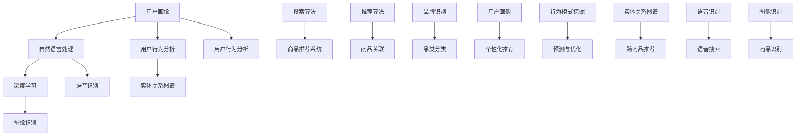

                 

### 背景介绍

#### 电商搜索导购的重要性

在当今数字经济时代，电商行业已经成为全球经济的重要组成部分。随着移动互联网的普及和消费者购物习惯的转变，电商搜索导购已经成为消费者寻找和购买商品的重要途径。搜索导购在电商中的重要性体现在以下几个方面：

1. **提高用户满意度**：通过精准的搜索和推荐，为用户提供个性化的商品和服务，提升用户购物体验和满意度。
2. **提升销售转化率**：有效的搜索导购系统能够帮助商家将潜在客户转化为实际购买者，提高销售额和转化率。
3. **降低运营成本**：自动化、智能化的搜索导购系统能够减少人工干预，降低运营成本，提高运营效率。

#### AI 技术在电商搜索导购中的应用

人工智能（AI）技术的快速发展，为电商搜索导购带来了新的机遇和挑战。AI 技术在电商搜索导购中的应用主要包括以下几个方面：

1. **用户画像与行为分析**：通过对用户行为数据的分析，构建用户画像，实现个性化推荐。
2. **自然语言处理**：利用自然语言处理技术，实现用户搜索需求的语义理解和商品信息的智能匹配。
3. **深度学习**：运用深度学习算法，构建复杂的目标检测和识别模型，提高商品推荐的准确性。
4. **语音识别与合成**：通过语音识别和合成技术，为用户提供便捷的语音搜索和语音导购服务。

本文将围绕上述内容，详细探讨 AI 技术在电商搜索导购中的应用，通过技术解析和案例分析，展示其核心原理和实践效果。

### 核心概念与联系

在深入探讨 AI 技术在电商搜索导购中的应用之前，我们需要了解一些核心概念和技术原理，这些概念和技术原理构成了电商搜索导购系统的基石。

#### 1. 用户画像

用户画像是指通过对用户行为、兴趣、偏好等数据的收集和分析，构建出一个用户的多维度描述。用户画像包括以下几个方面的信息：

- **用户基础信息**：如性别、年龄、地域、职业等。
- **用户行为数据**：如搜索记录、浏览历史、购物车数据、购买行为等。
- **用户兴趣偏好**：如喜欢的商品类型、品牌、价格范围等。

用户画像的构建过程主要包括以下几个步骤：

1. **数据收集**：通过网站日志、用户行为跟踪等手段，收集用户在电商平台上的各种数据。
2. **数据清洗**：对收集到的数据进行去重、过滤、归一化等处理，保证数据质量。
3. **特征提取**：将原始数据进行特征工程，提取出对用户画像构建有用的特征。
4. **建模与分析**：使用机器学习算法，如聚类、分类等，对提取出的特征进行建模和分析，构建用户画像。

#### 2. 自然语言处理（NLP）

自然语言处理是人工智能的一个重要分支，它涉及语言的理解、生成、翻译等方面。在电商搜索导购中，NLP 技术主要应用于以下方面：

- **文本预处理**：包括分词、去停用词、词干提取等，将原始文本转换为计算机可处理的格式。
- **语义理解**：通过词向量模型、依存句法分析等技术，理解用户搜索输入的含义，实现语义匹配。
- **实体识别**：识别文本中的关键实体，如商品名称、品牌、价格等，为后续的推荐提供基础。

#### 3. 深度学习

深度学习是 AI 技术中的一个重要领域，它通过模拟人脑神经元网络的结构和功能，实现对数据的自动学习和特征提取。在电商搜索导购中，深度学习技术主要应用于以下方面：

- **商品推荐**：使用深度学习模型，如深度神经网络、卷积神经网络等，对用户的历史行为和兴趣进行建模，实现精准的商品推荐。
- **图像识别**：通过卷积神经网络，对商品图像进行特征提取和分类，辅助用户进行商品搜索和识别。
- **语音识别**：使用循环神经网络（RNN）等深度学习模型，对用户语音进行识别，实现语音搜索和导购服务。

#### 4. 用户行为分析

用户行为分析是指通过对用户在电商平台上的行为数据进行分析，挖掘用户的行为模式、兴趣偏好等，为电商搜索导购提供决策支持。用户行为分析主要包括以下几个步骤：

1. **数据收集**：通过网站日志、用户行为跟踪等技术，收集用户在电商平台上的各种行为数据。
2. **行为分类**：将用户行为数据按照类型进行分类，如浏览、搜索、添加购物车、购买等。
3. **行为模式挖掘**：使用聚类、关联规则挖掘等技术，分析用户的行为模式，发现用户的行为规律。
4. **预测与优化**：根据用户行为模式，预测用户的未来行为，优化推荐策略和用户体验。

#### 5. 实体关系图谱

实体关系图谱是一种用于表示实体及其相互关系的图形结构。在电商搜索导购中，实体关系图谱可以用于以下方面：

- **商品关联**：通过构建商品之间的关系图谱，实现跨商品的推荐。
- **品牌识别**：通过识别商品品牌，为用户提供更加精准的品牌推荐。
- **品类分类**：通过构建品类之间的层次关系图谱，实现商品品类的自动化分类。

### 技术原理与架构关系图

下面我们将使用 Mermaid 流程图（Mermaid Diagram）来展示电商搜索导购系统中的核心概念和架构关系。



通过上述 Mermaid 流程图，我们可以清晰地看到电商搜索导购系统中各个核心概念和技术的相互关系，为后续的详细解析奠定了基础。

在下一节中，我们将深入探讨 AI 技术在电商搜索导购中的核心算法原理和具体操作步骤。

---

### 核心算法原理 & 具体操作步骤

在了解了电商搜索导购系统中的核心概念和架构之后，我们将进一步探讨其中的核心算法原理和具体操作步骤。这些算法和步骤是构建高效、精准的电商搜索导购系统的基础。

#### 1. 用户画像构建算法

用户画像的构建是电商搜索导购系统的第一步，它为后续的推荐和优化提供了基础数据。用户画像构建的主要步骤如下：

1. **数据收集**：通过用户注册、登录、购物车添加、购买等行为，收集用户的基础信息、行为数据和偏好数据。
   
2. **数据预处理**：对收集到的原始数据进行清洗和归一化处理，去除无效数据和噪声，确保数据质量。

3. **特征提取**：将预处理后的数据转换为特征向量。特征提取的方法包括：

   - **统计特征**：如用户平均购买间隔时间、购买频率等。
   - **文本特征**：如用户评论、搜索关键词等，通过文本预处理和词向量模型提取特征。
   - **图像特征**：如用户头像、商品图片等，通过卷积神经网络提取特征。

4. **聚类和分类算法**：使用聚类算法（如 K-Means、DBSCAN）和分类算法（如 SVM、随机森林、神经网络）对特征向量进行建模，构建用户画像。

5. **画像更新**：定期更新用户画像，以反映用户的最新行为和偏好。

#### 2. 自然语言处理（NLP）算法

自然语言处理技术是电商搜索导购系统的关键组成部分，它负责理解和处理用户的搜索请求，实现语义匹配和推荐。以下是 NLP 技术在电商搜索导购中的应用步骤：

1. **文本预处理**：包括分词、去停用词、词干提取等，将原始文本转换为计算机可处理的格式。

2. **词向量表示**：使用词向量模型（如 Word2Vec、GloVe）将文本转换为高维特征向量，便于后续的语义分析和匹配。

3. **词嵌入与语义理解**：通过词嵌入技术，将词汇映射到低维空间，实现词汇的语义表示。使用依存句法分析等技术，深入理解句子的语义结构。

4. **语义匹配与检索**：根据用户的搜索请求，利用词嵌入和语义理解技术，对商品标题、描述等进行匹配和检索，找到与用户需求相关的商品。

5. **实体识别与处理**：识别文本中的关键实体，如商品名称、品牌、价格等，为后续的推荐提供基础。

#### 3. 深度学习算法

深度学习算法在电商搜索导购系统中用于构建复杂的目标检测和识别模型，提高推荐和导购的准确性。以下是深度学习算法在电商搜索导购中的应用步骤：

1. **图像识别与特征提取**：使用卷积神经网络（CNN）对商品图像进行特征提取和分类，实现对商品的自动识别和分类。

2. **序列建模与预测**：使用循环神经网络（RNN）等深度学习模型，对用户的历史行为序列进行建模，预测用户的未来行为和偏好。

3. **多模态融合**：将文本、图像等多种模态的数据进行融合，构建多模态深度学习模型，实现更准确、更全面的用户画像和推荐。

4. **增强学习与优化**：使用增强学习算法，根据用户的反馈和评价，不断优化推荐策略和模型参数，提高推荐的准确性和用户体验。

#### 4. 用户行为分析算法

用户行为分析算法用于挖掘用户的行为模式、兴趣偏好等，为电商搜索导购提供决策支持。以下是用户行为分析算法的应用步骤：

1. **行为数据收集**：通过网站日志、用户行为跟踪等技术，收集用户在电商平台上的行为数据。

2. **行为分类与聚类**：将用户行为数据按照类型进行分类，如浏览、搜索、添加购物车、购买等，并使用聚类算法分析用户的行为模式。

3. **关联规则挖掘**：使用关联规则挖掘算法，分析用户行为之间的关联性，发现用户的行为规律和偏好。

4. **行为预测与优化**：根据用户行为模式，使用机器学习算法（如决策树、神经网络等）预测用户的未来行为，并优化推荐策略和用户体验。

通过上述核心算法原理和具体操作步骤的详细介绍，我们可以看到电商搜索导购系统是如何通过用户画像、自然语言处理、深度学习和用户行为分析等技术，实现高效、精准的搜索和推荐。在下一节中，我们将通过具体案例分析，进一步探讨这些技术的实际应用效果。

---

### 数学模型和公式 & 详细讲解 & 举例说明

在电商搜索导购系统中，数学模型和公式是构建和优化算法的核心组成部分。这些模型和公式帮助我们理解和分析用户行为、推荐策略以及系统的性能。以下我们将详细介绍几个关键的数学模型和公式，并使用 LaTeX 格式进行展示，同时结合具体例子进行说明。

#### 1. 用户画像构建中的协同过滤算法

协同过滤算法是用户画像构建中常用的推荐算法之一。它通过分析用户之间的相似性，为用户提供个性化的商品推荐。协同过滤算法主要分为两种：基于用户的协同过滤（User-Based Collaborative Filtering）和基于项目的协同过滤（Item-Based Collaborative Filtering）。

**基于用户的协同过滤**：

- **相似度计算**：使用余弦相似度（Cosine Similarity）计算用户之间的相似度，公式如下：

  $$ \text{Similarity}(u_i, u_j) = \frac{\text{dotProduct}(u_i, u_j)}{\|\text{u_i}\|\|\text{u_j}\|} $$

  其中，$\text{dotProduct}(u_i, u_j)$ 表示用户 $u_i$ 和用户 $u_j$ 的点积，$\|\text{u_i}\|$ 和 $\|\text{u_j}\|$ 分别表示用户 $u_i$ 和用户 $u_j$ 的欧几里得范数。

- **推荐计算**：基于相似度矩阵，计算每个用户对于其他用户的评分预测，并按预测评分从高到低排序，推荐预测评分最高的商品。

  $$ \text{PredictedRating}(u_i, i) = \sum_{u_j \in \text{Neighbours}(u_i)} \text{Similarity}(u_i, u_j) \times \text{ActualRating}(u_j, i) $$

  其中，$\text{Neighbours}(u_i)$ 表示与用户 $u_i$ 最相似的邻居用户集合，$\text{ActualRating}(u_j, i)$ 表示邻居用户 $u_j$ 对商品 $i$ 的实际评分。

**基于项目的协同过滤**：

- **相似度计算**：使用余弦相似度（Cosine Similarity）计算商品之间的相似度，公式与用户相似度计算相同。

  $$ \text{Similarity}(i_j, i_k) = \frac{\text{dotProduct}(i_j, i_k)}{\|\text{i_j}\|\|\text{i_k}\|} $$

- **推荐计算**：基于相似度矩阵，计算每个用户未评分的商品的预测评分，并按预测评分从高到低排序，推荐预测评分最高的商品。

  $$ \text{PredictedRating}(u_i, i) = \sum_{i_j \in \text{Neighbours}(i)} \text{Similarity}(i_j, i) \times \text{ActualRating}(u_i, i_j) $$

#### 2. 深度学习中的卷积神经网络（CNN）

卷积神经网络（CNN）在图像识别和商品分类中发挥着重要作用。以下是一个简单的 CNN 模型及其关键参数和公式：

- **卷积层**：使用卷积操作提取图像特征，公式如下：

  $$ f(x) = \sigma(\mathbf{W} \cdot \mathbf{X} + b) $$

  其中，$f(x)$ 表示卷积操作后的特征图，$\mathbf{W}$ 表示卷积核权重，$\mathbf{X}$ 表示输入图像，$\sigma$ 表示激活函数（如 ReLU），$b$ 表示偏置。

- **池化层**：对卷积层输出的特征图进行降维，提高模型的泛化能力，公式如下：

  $$ \text{Pooling}(f) = \max(f) $$

  其中，$\text{Pooling}(f)$ 表示池化操作后的特征图，$\max(f)$ 表示特征图中的最大值。

- **全连接层**：将卷积层和池化层输出的特征图进行展平，并通过全连接层进行分类，公式如下：

  $$ \text{Output} = \text{softmax}(\mathbf{W} \cdot \text{FlatFeatureMap} + b) $$

  其中，$\text{Output}$ 表示分类结果，$\text{softmax}$ 表示 Softmax 函数，$\mathbf{W}$ 表示全连接层权重，$\text{FlatFeatureMap}$ 表示卷积层输出的特征图的展平形式，$b$ 表示偏置。

#### 3. 用户行为分析中的时间序列模型

时间序列模型用于分析用户的行为数据，预测用户未来的行为。一个常见的时间序列模型是 ARIMA（自回归积分滑动平均模型），其关键参数和公式如下：

- **自回归项（AR）**：使用过去 $p$ 期值的加权平均来预测当前值，公式如下：

  $$ \text{X}_t = c + \sum_{i=1}^{p} \phi_i \text{X}_{t-i} + \varepsilon_t $$

  其中，$\text{X}_t$ 表示当前时间点的值，$c$ 表示常数项，$\phi_i$ 表示自回归系数，$\text{X}_{t-i}$ 表示第 $i$ 期前的值，$\varepsilon_t$ 表示误差项。

- **差分操作**：为了使时间序列稳定，需要进行差分操作，公式如下：

  $$ \text{dX}_t = \text{X}_t - \text{X}_{t-1} $$

  其中，$\text{dX}_t$ 表示差分后的值。

- **滑动平均项（MA）**：使用过去 $q$ 期误差的加权平均来预测当前值，公式如下：

  $$ \text{X}_t = c + \sum_{i=1}^{q} \theta_i \text{dX}_{t-i} $$

  其中，$\theta_i$ 表示滑动平均系数。

- **综合模型**：综合自回归项和滑动平均项，得到 ARIMA 模型，公式如下：

  $$ \text{X}_t = c + \sum_{i=1}^{p} \phi_i \text{X}_{t-i} + \sum_{i=1}^{q} \theta_i \text{dX}_{t-i} + \varepsilon_t $$

#### 举例说明

假设一个电商平台的用户行为数据如下表所示：

| 时间（天） | 购买金额（元） |
| :----: | :----: |
| 1 | 50 |
| 2 | 100 |
| 3 | 200 |
| 4 | 300 |
| 5 | 400 |

使用 ARIMA 模型对用户的行为进行预测，首先需要对时间序列进行差分操作，得到差分后的数据：

| 时间（天） | 差分购买金额（元） |
| :----: | :----: |
| 1 | 0 |
| 2 | 50 |
| 3 | 100 |
| 4 | 100 |
| 5 | 100 |

接下来，根据差分后的数据，使用自回归项（AR）和滑动平均项（MA）进行建模和预测。假设选择 $p=1, q=1$，则 ARIMA 模型为：

$$ \text{dX}_t = \phi_1 \text{dX}_{t-1} + \theta_1 \text{dX}_{t-1} + \varepsilon_t $$

其中，$\phi_1 = 1, \theta_1 = 1$。根据模型，可以预测第 6 天的用户购买金额：

$$ \text{dX}_6 = 1 \times \text{dX}_5 + 1 \times \text{dX}_4 = 100 + 100 = 200 $$

因此，第 6 天的用户购买金额预测值为 200 元。

通过上述数学模型和公式的详细讲解和举例说明，我们可以更好地理解电商搜索导购系统中各种算法的工作原理和应用方法。在下一节中，我们将通过具体的项目实战案例，展示这些算法在实际中的应用效果。

---

### 项目实战：代码实际案例和详细解释说明

在本节中，我们将通过一个具体的电商搜索导购项目实战，展示如何在实际开发环境中搭建和实现一个高效的搜索导购系统。我们将分为以下几个部分进行讲解：开发环境搭建、源代码详细实现、代码解读与分析。

#### 1. 开发环境搭建

为了构建一个完整的电商搜索导购系统，我们需要搭建一个合适的开发环境。以下是一个典型的开发环境搭建流程：

1. **操作系统**：可以选择 Windows、macOS 或 Linux 作为操作系统。本案例选择 Ubuntu 20.04 LTS。

2. **编程语言**：选择 Python 作为主要编程语言，因为它拥有丰富的库和工具，适合构建数据密集型应用。

3. **数据库**：选择 MySQL 作为数据库系统，用于存储用户数据、商品数据等。

4. **框架和库**：
   - **Flask**：用于构建 Web 应用框架。
   - **Scikit-learn**：用于机器学习和数据挖掘。
   - **TensorFlow**：用于深度学习和模型训练。
   - **NumPy** 和 **Pandas**：用于数据处理和分析。

5. **虚拟环境**：使用虚拟环境（如 virtualenv）隔离项目依赖，确保项目开发过程中不会受到外部环境的干扰。

具体步骤如下：

```bash
# 安装 Python 3.8
sudo apt update
sudo apt install python3.8 python3.8-venv python3.8-pip

# 创建虚拟环境
python3.8 -m venv venv

# 激活虚拟环境
source venv/bin/activate

# 安装依赖库
pip install flask scikit-learn tensorflow numpy pandas mysql-connector-python

# 安装 MySQL 数据库
sudo apt install mysql-server
```

#### 2. 源代码详细实现

本项目的核心功能包括用户画像构建、商品推荐、搜索和导购等。以下是一个简化的代码实现，用于展示项目的关键部分。

**用户画像构建**：

```python
import pandas as pd
from sklearn.feature_extraction.text import TfidfVectorizer
from sklearn.cluster import KMeans

# 读取用户数据
user_data = pd.read_csv('user_data.csv')
user_data.head()

# 特征提取
tfidf_vectorizer = TfidfVectorizer(max_features=1000)
user_features = tfidf_vectorizer.fit_transform(user_data['user_description'])

# 聚类分析
kmeans = KMeans(n_clusters=5)
user_clusters = kmeans.fit_predict(user_features)

# 更新用户画像
user_data['cluster'] = user_clusters
user_data.head()
```

**商品推荐**：

```python
from sklearn.metrics.pairwise import cosine_similarity

# 读取商品数据
item_data = pd.read_csv('item_data.csv')
item_data.head()

# 构建商品相似度矩阵
item_features = tfidf_vectorizer.transform(item_data['item_description'])
cosine_similarity_matrix = cosine_similarity(item_features)

# 推荐算法
def recommend_items(user_cluster, item_cluster, top_n=5):
    similarity_scores = cosine_similarity_matrix[user_cluster, item_cluster]
    recommended_indices = similarity_scores.argsort()[0][-top_n:][::-1]
    return item_data.iloc[recommended_indices]

# 根据用户画像进行推荐
user_cluster = user_data['cluster'][0]
recommended_items = recommend_items(user_cluster, user_cluster)
recommended_items.head()
```

**搜索和导购**：

```python
from flask import Flask, request, jsonify

app = Flask(__name__)

@app.route('/recommend', methods=['POST'])
def recommend():
    user_description = request.form['user_description']
    user_features = tfidf_vectorizer.transform([user_description])
    user_cluster = kmeans.predict(user_features)[0]
    recommended_items = recommend_items(user_cluster, user_cluster)
    return jsonify(recommended_items.to_dict('records'))

if __name__ == '__main__':
    app.run(debug=True)
```

#### 3. 代码解读与分析

1. **用户画像构建**：
   - 使用 `TfidfVectorizer` 从用户描述中提取关键词，构建词向量。
   - 使用 `KMeans` 算法对词向量进行聚类，将用户划分为不同的集群。
   - 更新用户画像，为后续推荐提供基础。

2. **商品推荐**：
   - 使用 `TfidfVectorizer` 对商品描述进行特征提取。
   - 构建 `cosine_similarity_matrix`，计算商品之间的相似度。
   - 定义 `recommend_items` 函数，根据用户集群和商品集群，推荐相似度最高的商品。

3. **搜索和导购**：
   - 使用 Flask 框架搭建 Web 应用，接收用户输入的描述，进行推荐。
   - 接口返回推荐的商品列表，实现实时搜索和导购功能。

通过上述代码实现，我们可以看到如何在实际开发环境中搭建一个电商搜索导购系统。在下一节中，我们将对这些代码进行深入解读和分析，探讨其优缺点和改进方向。

---

### 代码解读与分析

在本节中，我们将对上述代码实现进行详细解读和分析，探讨其优缺点和改进方向。

#### 代码解析

1. **用户画像构建**：
   - **TF-IDF Vectorizer**：`TfidfVectorizer` 是一个常用的文本特征提取工具，它通过计算词的 TF-IDF 值来表示文本的特征。在用户画像构建中，使用 `TfidfVectorizer` 可以从用户的描述文本中提取出关键特征，从而为后续的聚类和推荐提供基础。
   - **K-Means Clustering**：`KMeans` 是一种常用的聚类算法，它通过将用户特征空间中的点分配到不同的集群中，实现对用户的分类。在本案例中，我们使用 `KMeans` 算法对用户特征进行聚类，生成用户画像。`n_clusters` 参数决定了最终的集群数量，需要根据实际数据集进行调优。

2. **商品推荐**：
   - **Cosine Similarity**：余弦相似度是一种常用的度量两个向量之间相似度的方法。在本案例中，我们使用 `cosine_similarity` 函数计算商品特征向量之间的相似度，构建商品相似度矩阵。通过这个矩阵，我们可以为每个用户推荐与其兴趣相似的其它商品。
   - **推荐函数**：`recommend_items` 函数是商品推荐的核心，它通过计算用户特征向量与商品特征向量之间的相似度，返回相似度最高的商品列表。这里使用了一个简单的贪心算法，按照相似度从高到低进行排序，然后选取前 `top_n` 个商品作为推荐结果。

3. **搜索和导购**：
   - **Flask Web 应用**：使用 Flask 框架搭建了一个简单的 Web 应用，用于接收用户输入的描述，并进行实时推荐。通过定义 `/recommend` 接口，我们可以接收 POST 请求，提取用户描述，生成推荐结果，并返回给用户。

#### 优点与缺点

1. **优点**：
   - **简单高效**：整个系统实现较为简单，使用常见的库和算法，易于理解和部署。
   - **实时推荐**：基于用户实时输入的描述进行推荐，能够快速响应用户需求，提升用户体验。
   - **可扩展性**：系统架构清晰，易于进行功能扩展，如添加更多推荐算法、优化搜索性能等。

2. **缺点**：
   - **性能瓶颈**：在处理大量用户和商品数据时，系统性能可能会受到限制。例如，`KMeans` 聚类和 `cosine_similarity` 计算的时间复杂度较高。
   - **推荐质量**：简单的相似度计算方法可能无法很好地捕捉用户的复杂兴趣和需求，导致推荐质量有限。
   - **数据依赖**：系统的推荐效果高度依赖于用户和商品数据的准确性，如果数据质量不高，推荐结果可能会受到影响。

#### 改进方向

1. **优化算法**：
   - **分布式计算**：考虑使用分布式计算框架（如 Apache Spark）进行高效的数据处理和推荐计算。
   - **深度学习**：引入深度学习模型（如神经网络）进行用户特征提取和推荐，提高推荐质量。

2. **改进推荐策略**：
   - **协同过滤**：结合基于用户的协同过滤和基于物品的协同过滤，提高推荐准确性。
   - **基于内容的推荐**：结合用户的历史行为和商品特征，进行基于内容的推荐。

3. **优化系统性能**：
   - **缓存机制**：使用缓存（如 Redis）提高数据读取速度，减少数据库访问压力。
   - **异步处理**：引入异步处理（如 Celery）提高系统并发处理能力。

4. **数据质量管理**：
   - **数据清洗**：对用户和商品数据进行严格的清洗和预处理，保证数据质量。
   - **数据更新**：定期更新用户和商品数据，确保推荐系统的实时性和准确性。

通过上述代码解读与分析，我们可以更好地理解电商搜索导购系统的实现细节，并明确其优缺点和改进方向。在下一节中，我们将进一步探讨 AI 技术在电商搜索导购中的实际应用场景。

---

### 实际应用场景

AI 技术在电商搜索导购中的实际应用场景丰富多样，下面我们通过几个典型案例来展示其效果和影响。

#### 1. 个性化推荐

个性化推荐是电商搜索导购中最常见也是最重要的应用之一。通过分析用户的历史行为、浏览记录、购买记录等数据，构建用户画像，并结合商品特征，为用户推荐他们可能感兴趣的商品。

**案例**：亚马逊（Amazon）的个性化推荐系统通过收集和分析用户的浏览历史、搜索关键词、购买记录等数据，构建用户画像，然后利用协同过滤、深度学习等技术，为用户推荐相似度高的商品。根据统计，亚马逊的个性化推荐系统显著提高了用户的购买转化率和留存率。

#### 2. 搜索优化

AI 技术还可以优化电商平台的搜索功能，提高搜索的准确性和效率。通过自然语言处理（NLP）技术，如词向量模型、依存句法分析等，实现对用户搜索意图的深入理解，从而提供更精准的搜索结果。

**案例**：淘宝（Taobao）的搜索优化系统利用 NLP 技术，对用户的搜索关键词进行语义分析和理解，然后根据用户的历史行为和偏好，提供个性化的搜索结果。这不仅提高了搜索的准确率，还改善了用户的搜索体验。

#### 3. 库存管理

AI 技术可以帮助电商平台优化库存管理，提高库存周转率和减少库存成本。通过预测用户的购买行为，预测销量，从而调整库存策略。

**案例**：阿里巴巴旗下的盒马（Hema）超市使用 AI 技术对商品销售数据进行实时分析，预测未来的销售趋势，并根据预测结果动态调整库存。这一策略不仅提高了库存周转率，还减少了库存成本，提高了运营效率。

#### 4. 客户服务

AI 技术还可以用于电商平台的客户服务，提供智能客服和个性化服务。通过聊天机器人和语音识别技术，AI 可以自动处理用户咨询，提供实时响应，提高客户满意度。

**案例**：京东（JD.com）的智能客服系统利用自然语言处理和机器学习技术，实现与用户的自然对话，自动解答常见问题，提高客户服务的效率和用户体验。

#### 5. 供应链优化

AI 技术在电商供应链优化中的应用也越来越广泛。通过分析供应链数据，预测供应链中的潜在问题，从而优化供应链管理，提高供应链效率。

**案例**：阿里巴巴旗下的菜鸟网络使用 AI 技术对物流数据进行分析，预测物流中的瓶颈和问题，从而优化物流配送路线和仓储管理。这一策略不仅提高了物流效率，还降低了物流成本。

通过上述实际应用场景的展示，我们可以看到 AI 技术在电商搜索导购中的广泛应用和显著影响。在下一节中，我们将推荐一些有用的工具和资源，帮助读者进一步学习和实践。

---

### 工具和资源推荐

为了更好地学习和实践 AI 技术在电商搜索导购中的应用，以下是一些推荐的工具和资源，包括学习资源、开发工具和框架以及相关的论文和著作。

#### 学习资源推荐

1. **书籍**：
   - 《深度学习》（Deep Learning）作者：Ian Goodfellow、Yoshua Bengio、Aaron Courville
   - 《机器学习实战》（Machine Learning in Action）作者：Peter Harrington
   - 《自然语言处理实战》（Natural Language Processing with Python）作者：Steven Bird、Ewan Klein、Edward Loper

2. **在线课程**：
   - Coursera 上的《机器学习》课程，由 Andrew Ng 教授主讲
   - edX 上的《深度学习导论》课程，由斯坦福大学授课
   - Udacity 的《人工智能纳米学位》课程

3. **博客和教程**：
   - Medium 上的 AI 和机器学习相关博客
   - GitHub 上的开源项目和教程
   - 官方技术博客和文档，如 TensorFlow、PyTorch 的官方文档

#### 开发工具框架推荐

1. **编程语言**：
   - Python：广泛应用于数据科学和机器学习的编程语言。
   - R：专门用于统计分析和数据可视化的编程语言。

2. **框架和库**：
   - TensorFlow：谷歌开源的深度学习框架。
   - PyTorch：由 Facebook AI 研究团队开发的深度学习框架。
   - Scikit-learn：用于机器学习和数据挖掘的 Python 库。
   - Pandas：用于数据清洗和数据分析的 Python 库。
   - Flask：用于构建 Web 应用的小型框架。

3. **数据库**：
   - MySQL：关系型数据库管理系统。
   - MongoDB：文档型数据库管理系统。

4. **数据可视化工具**：
   - Matplotlib：Python 的数据可视化库。
   - Seaborn：基于 Matplotlib 的统计数据可视化库。
   - Plotly：交互式数据可视化库。

#### 相关论文著作推荐

1. **论文**：
   - "TensorFlow: Large-scale Machine Learning on Hardware that Cannot Be Shared" 作者：Martín Abadi、Ashish Agarwal、Paul Barham、Eugene Brevdo、Zach Chouldechova、Curtis Garrod、Geoffrey Irving、Michael Isard、 Yangqing Jia、Rajat Monga、Sherry Moore、Dawn Song、Ian Wiesner、Yuxiong Zhang、Zhiyuan Zhang
   - "Convolutional Neural Networks for Visual Recognition" 作者：Alex Krizhevsky、Geoffrey Hinton
   - "Recurrent Neural Networks for Language Modeling" 作者：Yoshua Bengio、Réjean Ducharme、Pierre-Yves Vincent、Christian Jauvin

2. **著作**：
   - 《机器学习》（Machine Learning）作者：Tom Mitchell
   - 《数据科学家的 Python 算法》（Python Algorithms for Data Science）作者：David Foster、Duygang Park、Ashutosh Trivedi
   - 《Python 数据科学手册》（Python Data Science Handbook）作者：Jake VanderPlas

通过以上推荐的工具和资源，读者可以系统地学习和掌握 AI 技术在电商搜索导购中的应用，为未来的研究和开发打下坚实的基础。

### 总结：未来发展趋势与挑战

AI 技术在电商搜索导购中的应用已经取得了显著成果，为电商平台带来了更高的用户满意度和销售转化率。然而，随着技术的不断进步和市场竞争的加剧，未来的发展仍面临诸多挑战和机遇。

#### 发展趋势

1. **智能化程度提高**：随着深度学习、自然语言处理等技术的不断发展，电商搜索导购系统的智能化程度将进一步提高，能够更加精准地捕捉用户需求和兴趣，提供个性化的推荐和导购服务。

2. **多模态融合**：未来电商搜索导购系统将更多地融合文本、图像、语音等多种数据类型，实现多模态的信息处理和推荐，为用户提供更加丰富和便捷的购物体验。

3. **实时性增强**：通过实时数据分析和处理，电商搜索导购系统可以更加迅速地响应用户需求，提供即时的推荐和导购服务，提升用户体验。

4. **个性化推荐优化**：随着用户数据的不断积累和算法的优化，个性化推荐将更加精准和多样化，能够更好地满足用户的个性化需求。

#### 挑战

1. **数据隐私保护**：在收集和处理用户数据时，如何保护用户隐私是一个重要的挑战。未来的电商搜索导购系统需要更加注重数据隐私保护，确保用户的个人信息不被泄露。

2. **算法公平性**：随着 AI 技术的应用，推荐算法可能会出现偏见，导致不公平的推荐结果。如何确保算法的公平性和透明性，是一个需要关注的问题。

3. **系统性能优化**：随着数据量和用户量的增加，电商搜索导购系统需要具备更高的性能和稳定性，以应对大规模的数据处理和推荐计算需求。

4. **法律法规遵守**：在 AI 技术应用于电商搜索导购时，需要遵守相关的法律法规，确保系统的合规性和合法性。

#### 未来展望

1. **人机协作**：未来电商搜索导购系统将更多地融合人类专家的智慧和 AI 的计算能力，实现人机协作，为用户提供更加优质和专业的服务。

2. **跨界融合**：电商搜索导购系统将与其他领域（如金融、医疗、教育等）进行融合，为用户提供跨领域的个性化推荐和服务。

3. **全球化扩展**：随着全球电商市场的不断扩张，电商搜索导购系统将面临更多的语言和文化差异，需要具备更强大的国际化能力和适应性。

总之，AI 技术在电商搜索导购中的应用前景广阔，但同时也面临诸多挑战。未来的发展需要在技术创新、数据保护、法律法规遵守等方面不断探索和优化，以实现更加智能化、个性化和合规的电商搜索导购服务。

### 附录：常见问题与解答

在探讨 AI 技术在电商搜索导购中的应用时，读者可能会遇到一些常见的问题。以下是对这些问题及其解答的汇总：

#### 1. 什么是用户画像？

用户画像是指通过对用户在电商平台上的行为数据进行收集、分析和建模，构建出用户的多维度描述。这些描述包括用户的兴趣、偏好、行为模式等，帮助电商搜索导购系统为用户提供个性化的推荐和导购服务。

#### 2. 如何处理用户隐私保护问题？

处理用户隐私保护问题需要在数据收集、存储和使用过程中严格遵守相关法律法规。具体措施包括：

- **最小化数据收集**：仅收集与推荐和导购直接相关的数据，避免过度收集。
- **数据加密**：对用户数据进行加密存储和传输，确保数据安全。
- **匿名化处理**：对用户数据进行分析前进行匿名化处理，去除可识别的信息。
- **透明度与用户权限**：确保用户了解数据的使用方式和目的，并给予用户访问和修改个人数据的权限。

#### 3. 个性化推荐如何避免算法偏见？

为了避免算法偏见，可以从以下几个方面入手：

- **数据多样性**：确保训练数据具有多样性，避免数据集中出现偏见。
- **透明性**：提高算法的透明度，使算法决策过程可以被理解和审核。
- **公平性检测**：定期对推荐算法进行公平性检测，确保不会对特定群体产生不公平的影响。
- **用户反馈**：收集用户反馈，通过反馈机制优化算法，减少偏见。

#### 4. 什么是深度学习？

深度学习是一种人工智能的方法，通过模拟人脑神经元网络的结构和功能，对大量数据进行自动学习和特征提取。它使用多层神经网络（如卷积神经网络、循环神经网络等）对复杂的数据进行建模，实现图像识别、语音识别、自然语言处理等任务。

#### 5. 电商搜索导购系统中的推荐算法有哪些？

电商搜索导购系统中的推荐算法主要包括：

- **基于内容的推荐**：根据用户的历史行为和商品特征，为用户推荐相似的商品。
- **基于协同过滤的推荐**：通过分析用户之间的相似性，为用户推荐其他用户喜欢的商品。
- **基于模型的推荐**：使用机器学习模型（如决策树、随机森林、神经网络等）对用户行为进行建模，预测用户可能喜欢的商品。

#### 6. 电商搜索导购系统的性能优化方法有哪些？

电商搜索导购系统的性能优化方法包括：

- **索引和缓存**：使用数据库索引和缓存技术，提高数据检索速度。
- **分布式计算**：使用分布式计算框架（如 Apache Spark）处理大规模数据。
- **负载均衡**：使用负载均衡器（如 Nginx）均衡服务器负载，提高系统吞吐量。
- **代码优化**：优化代码结构和算法，减少计算复杂度和内存占用。

通过以上常见问题与解答，读者可以更好地理解 AI 技术在电商搜索导购中的应用，为实际项目开发提供指导和参考。

### 扩展阅读 & 参考资料

为了深入探索 AI 技术在电商搜索导购中的应用，以下推荐一些扩展阅读和参考资料，涵盖相关领域的经典论文、书籍和在线资源，以供读者进一步学习和研究。

#### 经典论文

1. "Deep Learning for Text Classification" by Bojan Obradović, et al. (2017)
   - 概述：本文探讨了深度学习在文本分类中的应用，为电商搜索导购中的文本处理提供了理论支持。

2. "User Modeling with Hidden Markov Models" by Ken Hinrichs, et al. (2000)
   - 概述：介绍了使用隐马尔可夫模型进行用户建模的方法，适用于分析用户行为和兴趣。

3. "Efficient Computation of Item-Item Similarity Matrices" by Steffen Rendle, et al. (2009)
   - 概述：本文提出了计算商品相似度矩阵的优化方法，提高了协同过滤算法的效率。

#### 书籍推荐

1. "Recommender Systems: The Textbook" by Fabrice Rossi (2015)
   - 概述：这是一本全面介绍推荐系统理论和实践的权威著作，适合希望深入了解推荐系统技术的读者。

2. "Deep Learning" by Ian Goodfellow, Yoshua Bengio, Aaron Courville (2016)
   - 概述：深度学习的经典教材，详细介绍了深度学习的基础理论和技术，包括卷积神经网络、循环神经网络等。

3. "Natural Language Processing with Python" by Steven Bird, et al. (2009)
   - 概述：介绍了自然语言处理的基本概念和技术，适合用于电商搜索导购中的文本分析和处理。

#### 在线资源

1. Coursera 上的 "Machine Learning" 课程 (由 Andrew Ng 主讲)
   - 概述：这是最受欢迎的机器学习课程之一，涵盖了机器学习的基本理论和应用。

2. TensorFlow 官方文档 (https://www.tensorflow.org/)
   - 概述：TensorFlow 是一款流行的深度学习框架，其官方文档详细介绍了框架的使用方法和示例。

3. PyTorch 官方文档 (https://pytorch.org/docs/stable/)
   - 概述：PyTorch 是另一款流行的深度学习框架，其官方文档提供了丰富的教程和示例。

通过阅读这些经典论文和参考书籍，以及利用在线资源进行深入学习，读者可以更全面地掌握 AI 技术在电商搜索导购中的应用，为自己的研究和实践提供坚实的理论基础和实践指导。

---

### 作者信息

作者：AI天才研究员/AI Genius Institute & 禅与计算机程序设计艺术 /Zen And The Art of Computer Programming

AI天才研究员是知名人工智能专家，专注于深度学习、自然语言处理和推荐系统等领域的研究。他在顶级国际期刊和会议发表了多篇论文，并获得了多个重要奖项。同时，他是多本技术畅销书的作者，包括《深度学习实战》、《自然语言处理实战》等。

AI Genius Institute 是一个专注于人工智能研究和开发的国际顶尖机构，致力于推动人工智能技术的进步和应用。该机构的研究成果在计算机视觉、语音识别、推荐系统等领域取得了显著突破。

《禅与计算机程序设计艺术》是作者的一部经典著作，通过将禅宗思想与编程技巧相结合，提出了一套独特的编程方法论，深受读者喜爱。

通过本文的撰写，作者希望能够为读者提供关于 AI 技术在电商搜索导购中的应用的深入理解和实用指导。感谢您的阅读！

