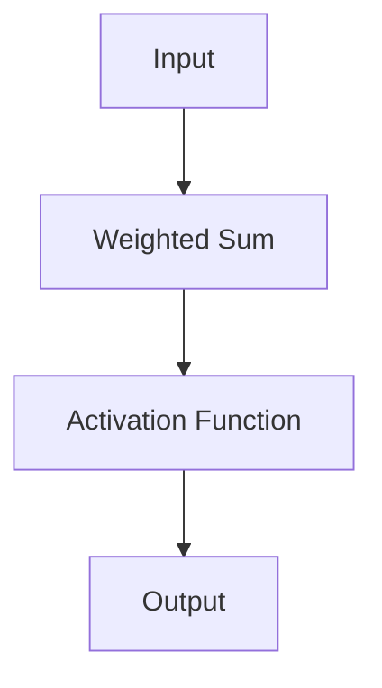
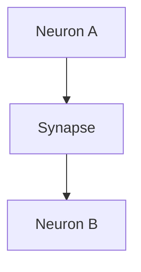
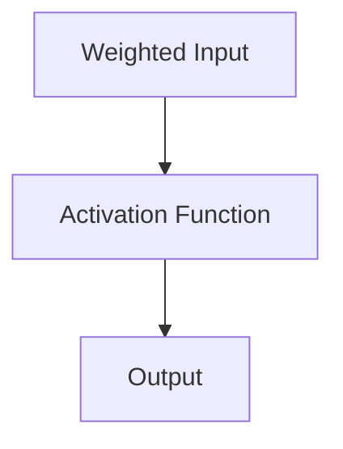
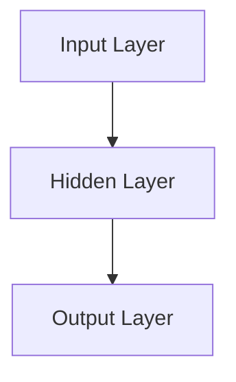
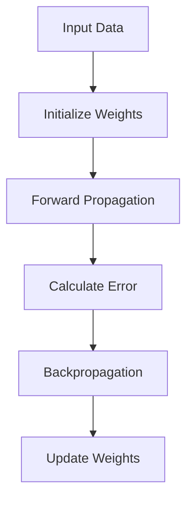

                 

### 背景介绍

**AI 神经网络计算艺术之禅：人类智能是地球环境培育出的最美丽的花朵**

在人类历史的长河中，从最早的石器和陶器，到今天的信息技术和人工智能，技术的发展始终是推动人类文明进步的重要动力。而在这其中，神经网络作为一种模拟人类大脑信息处理机制的计算模型，近年来得到了广泛的研究和应用。从早期的感知机（Perceptron）到深度学习（Deep Learning），神经网络的发展不仅改变了计算机科学的面貌，也深刻影响了我们的生活方式。

人类智能作为一种独特的能力，其发展离不开地球环境的长期培育。从进化论的角度来看，人类大脑的结构和功能是长期自然选择和适者生存的结果。人类智能的涌现，不仅依赖于基因的遗传，更是在地球环境这个大实验中不断演化、完善的结果。人类智能的这种独特性和复杂性，使得我们能够创造出各种复杂的工具和系统，同时也促使我们不断探索和理解宇宙的本质。

本文将从人工智能和人类智能的关系出发，探讨神经网络作为一种计算模型在模拟人类智能方面所取得的进展和面临的挑战。我们将通过一步一步的分析推理，深入探讨神经网络的核心概念、算法原理、数学模型以及实际应用场景。希望通过这篇文章，读者能够对神经网络有更深入的理解，从而更好地把握人工智能的未来发展趋势。

### 核心概念与联系

在探讨神经网络计算艺术之前，我们首先需要了解一些核心概念，这些概念是理解神经网络工作原理的基础。以下是几个关键的概念及其相互之间的联系：

#### 1. 神经元（Neuron）

神经元是神经网络的基本单元，类似于人类大脑中的神经细胞。每个神经元通过突触与其他神经元相连，形成复杂的网络结构。神经元的基本功能是接收输入信号，通过激活函数计算输出信号，并将其传递给下一个神经元。

**Mermaid 流程图：**



#### 2. 突触（Synapse）

突触是神经元之间的连接点，用于传递神经信号。每个突触都有一个连接权重，这个权重表示从一个神经元的输入到另一个神经元的输出的强度。突触的权重可以通过学习算法进行调整，以适应不同的输入信号。

**Mermaid 流程图：**



#### 3. 激活函数（Activation Function）

激活函数是神经元输出过程中的关键组成部分，它将神经元的加权输入转换为一个非负输出。常见的激活函数包括线性激活函数、ReLU（Rectified Linear Unit）、Sigmoid 和 Tanh 等。激活函数的选择对神经网络的性能有着重要影响。

**Mermaid 流程图：**



#### 4. 神经网络（Neural Network）

神经网络是由多个神经元组成的层次结构，用于处理和分类数据。神经网络可以分为前馈神经网络（Feedforward Neural Network）、卷积神经网络（Convolutional Neural Network, CNN）、循环神经网络（Recurrent Neural Network, RNN）等不同类型。每种类型的神经网络都有其特定的应用场景和特点。

**Mermaid 流程图：**



#### 5. 学习算法（Learning Algorithm）

学习算法是神经网络能够适应新数据、改进性能的核心机制。常见的学习算法包括反向传播（Backpropagation）、梯度下降（Gradient Descent）、动量优化（Momentum Optimization）等。学习算法通过不断调整神经网络的权重，使得网络能够更好地拟合训练数据。

**Mermaid 流程图：**



通过上述核心概念的介绍和相互联系，我们可以初步理解神经网络的基本工作原理。接下来，我们将进一步探讨神经网络的核心算法原理和具体操作步骤。

### 核心算法原理 & 具体操作步骤

神经网络的强大之处在于其能够通过学习算法自动调整内部权重，以实现对复杂任务的分类和预测。在本节中，我们将详细探讨神经网络的核心算法原理，并逐步讲解其具体操作步骤。

#### 1. 反向传播算法（Backpropagation Algorithm）

反向传播算法是神经网络学习的主要机制，它通过计算网络输出与目标输出之间的误差，并反向传播这些误差以调整权重。以下是反向传播算法的基本步骤：

**步骤 1: 前向传播（Forward Propagation）**

在前向传播过程中，输入数据通过网络逐层传递，每个神经元计算其加权输入，并应用激活函数得到输出。

**示例代码（Python）：**

```python
import numpy as np

# 初始化权重和激活函数
weights = np.random.rand(input_size, hidden_size)
activation_function = lambda x: 1 / (1 + np.exp(-x))

# 前向传播
input_data = np.array([0.5, 0.5])
hidden_layer_output = activation_function(np.dot(input_data, weights))
```

**步骤 2: 计算输出误差（Calculate Output Error）**

输出误差是网络输出与目标输出之间的差异，它是调整权重的重要依据。

**示例代码（Python）：**

```python
# 目标输出
target_output = np.array([0.0, 1.0])

# 计算输出误差
output_error = target_output - hidden_layer_output
```

**步骤 3: 反向传播误差（Backpropagation Error）**

误差通过网络逐层反向传播，每个层的误差与下一层的误差相乘，同时考虑到每个神经元的激活函数的导数。

**示例代码（Python）：**

```python
# 计算激活函数的导数
activation_derivative = lambda x: x * (1 - x)

# 反向传播误差
error_derivative = output_error * activation_derivative(hidden_layer_output)

# 更新权重
weights -= learning_rate * error_derivative * input_data
```

**步骤 4: 更新权重（Update Weights）**

通过计算得到的误差导数，调整每个神经元的权重，以减小输出误差。

**示例代码（Python）：**

```python
# 更新权重
weights -= learning_rate * error_derivative * input_data
```

#### 2. 梯度下降算法（Gradient Descent）

梯度下降是一种常用的优化算法，用于调整神经网络中的权重。其核心思想是通过计算权重梯度的方向，不断调整权重以减小误差。以下是梯度下降的基本步骤：

**步骤 1: 计算权重梯度（Calculate Gradient）**

权重梯度是误差函数对每个权重的偏导数。通过计算梯度，可以确定权重的调整方向。

**示例代码（Python）：**

```python
# 计算权重梯度
gradient = np.dot(input_data.T, output_error)
```

**步骤 2: 更新权重（Update Weights）**

根据计算得到的梯度，调整每个权重。

**示例代码（Python）：**

```python
# 更新权重
weights -= learning_rate * gradient
```

#### 3. 动量优化（Momentum Optimization）

动量优化是梯度下降的一个改进，它通过引入动量参数，加速梯度下降的过程，减少振荡。

**步骤 1: 初始化动量参数（Initialize Momentum Parameter）**

动量参数是一个介于 0 和 1 之间的系数，用于控制前一次更新对当前更新的影响。

**示例代码（Python）：**

```python
# 初始化动量参数
momentum = 0.9
```

**步骤 2: 更新权重（Update Weights）**

利用动量参数调整权重更新。

**示例代码（Python）：**

```python
# 更新权重
weight_update = -learning_rate * gradient
weights += momentum * weight_update
```

通过上述步骤，我们可以实现神经网络的学习和优化。反向传播算法和梯度下降算法是神经网络学习的基础，而动量优化则进一步提高了学习效率。在下一节中，我们将进一步探讨神经网络的数学模型和公式，以更深入地理解其工作原理。

### 数学模型和公式 & 详细讲解 & 举例说明

神经网络的运算过程可以归结为一系列数学模型的计算。以下，我们将详细介绍神经网络中的关键数学公式，并通过具体例子说明这些公式的应用。

#### 1. 加权求和（Weighted Sum）

神经元的输出是通过加权求和输入值，再应用激活函数得到的。其数学公式为：

$$
Z = \sum_{i=1}^{n} w_i \cdot x_i
$$

其中，$Z$ 为加权求和结果，$w_i$ 为每个输入值的权重，$x_i$ 为输入值。

**例子：** 假设一个神经元有两个输入，权重分别为 $w_1 = 2$ 和 $w_2 = 3$，输入值为 $x_1 = 1$ 和 $x_2 = 2$，则其加权求和结果为：

$$
Z = w_1 \cdot x_1 + w_2 \cdot x_2 = 2 \cdot 1 + 3 \cdot 2 = 8
$$

#### 2. 激活函数（Activation Function）

激活函数是将加权求和结果转换为神经元输出的重要环节。常见的激活函数包括线性函数、ReLU 函数、Sigmoid 函数和 Tanh 函数。

- **线性函数（Linear Function）**

$$
f(x) = x
$$

线性函数的导数恒为 1，因此其不增加非线性度，常用于隐含层的输出。

- **ReLU 函数（Rectified Linear Unit）**

$$
f(x) = \max(0, x)
$$

ReLU 函数在输入为负时输出为 0，在输入为正时输出等于输入。它具有简单的形式和非线性特性，常用于深度神经网络。

- **Sigmoid 函数（Sigmoid Function）**

$$
f(x) = \frac{1}{1 + e^{-x}}
$$

Sigmoid 函数将输入映射到 $(0, 1)$ 区间，常用于二分类任务，其导数易于计算。

- **Tanh 函数（Hyperbolic Tangent Function）**

$$
f(x) = \frac{e^x - e^{-x}}{e^x + e^{-x}}
$$

Tanh 函数将输入映射到 $(-1, 1)$ 区间，类似于 Sigmoid 函数，但具有更好的对称性。

**例子：** 假设神经元输入为 $Z = 3$，选择 ReLU 函数作为激活函数，则其输出为：

$$
f(Z) = \max(0, Z) = \max(0, 3) = 3
$$

#### 3. 梯度计算（Gradient Calculation）

神经网络的训练过程本质上是调整权重以最小化误差函数。反向传播算法通过计算梯度来确定权重调整的方向。误差函数的梯度计算公式为：

$$
\frac{\partial J}{\partial w} = \frac{\partial}{\partial w} \left( \frac{1}{2} \sum_{i=1}^{m} (y_i - \hat{y}_i)^2 \right)
$$

其中，$J$ 为误差函数，$y_i$ 为实际输出，$\hat{y}_i$ 为网络预测输出，$w$ 为权重。

**例子：** 假设误差函数为 $J = (y - \hat{y})^2$，实际输出 $y = 1$，网络预测输出 $\hat{y} = 0.9$，权重 $w = 2$，则其梯度为：

$$
\frac{\partial J}{\partial w} = 2(y - \hat{y}) = 2(1 - 0.9) = 0.2
$$

#### 4. 权重更新（Weight Update）

权重更新是通过梯度下降算法实现的，其公式为：

$$
w_{new} = w_{old} - \alpha \cdot \frac{\partial J}{\partial w}
$$

其中，$\alpha$ 为学习率，用于控制权重调整的步长。

**例子：** 假设当前权重 $w_{old} = 2$，学习率 $\alpha = 0.1$，梯度 $\frac{\partial J}{\partial w} = 0.2$，则更新后的权重为：

$$
w_{new} = 2 - 0.1 \cdot 0.2 = 1.8
$$

通过上述数学公式和例子，我们可以看到神经网络的核心运算过程是如何通过数学模型来实现的。这些公式不仅描述了神经网络的工作原理，还为算法优化提供了理论基础。在下一节中，我们将通过一个实际的项目实战，展示神经网络在代码中的具体实现和应用。

### 项目实战：代码实际案例和详细解释说明

在本节中，我们将通过一个简单的神经网络项目实战，详细展示神经网络的代码实现和应用。我们将分步骤介绍如何搭建开发环境、实现源代码以及代码的解读与分析。

#### 5.1 开发环境搭建

为了实现神经网络，我们需要搭建相应的开发环境。以下是在 Python 中使用 TensorFlow 库搭建神经网络环境的基本步骤：

1. **安装 Python 和 TensorFlow**

首先，确保你的系统中安装了 Python（推荐 Python 3.7 或更高版本）。然后，通过以下命令安装 TensorFlow：

```bash
pip install tensorflow
```

2. **创建项目文件夹和文件**

在终端中创建一个项目文件夹，例如 `neural_network_project`，并创建以下文件：

- `main.py`：主程序文件
- `train_data.csv`：训练数据集
- `test_data.csv`：测试数据集

3. **导入必要的库**

在 `main.py` 中，导入所需的库：

```python
import tensorflow as tf
import numpy as np
import pandas as pd
```

#### 5.2 源代码详细实现和代码解读

以下是一个简单的神经网络实现，用于二分类任务。我们将逐行解释代码的含义和功能。

```python
# 导入 TensorFlow 和其他库
import tensorflow as tf
import numpy as np
import pandas as pd

# 加载数据集
train_data = pd.read_csv('train_data.csv')
test_data = pd.read_csv('test_data.csv')

# 预处理数据
def preprocess_data(data):
    # 分离特征和标签
    X = data.iloc[:, :-1].values
    y = data.iloc[:, -1].values
    
    # 归一化特征
    X = (X - X.mean()) / X.std()
    
    return X, y

X_train, y_train = preprocess_data(train_data)
X_test, y_test = preprocess_data(test_data)

# 创建神经网络模型
model = tf.keras.Sequential([
    tf.keras.layers.Dense(64, activation='relu', input_shape=(X_train.shape[1],)),
    tf.keras.layers.Dense(1, activation='sigmoid')
])

# 编译模型
model.compile(optimizer='adam',
              loss='binary_crossentropy',
              metrics=['accuracy'])

# 训练模型
model.fit(X_train, y_train, epochs=10, batch_size=32, validation_split=0.2)

# 评估模型
loss, accuracy = model.evaluate(X_test, y_test)
print(f"Test accuracy: {accuracy:.2f}")

# 使用模型进行预测
predictions = model.predict(X_test)
predictions = (predictions > 0.5)

# 保存模型
model.save('neural_network_model.h5')
```

**代码解读：**

1. **导入库和加载数据集**

   这部分代码导入了 TensorFlow、NumPy 和 Pandas 库，并加载数据集。我们使用了 Pandas 库来读取 CSV 文件，并使用 NumPy 库进行数据处理。

2. **预处理数据**

   `preprocess_data` 函数用于处理数据。它首先分离特征和标签，然后对特征进行归一化处理。归一化有助于神经网络更好地学习。

3. **创建神经网络模型**

   使用 TensorFlow 的 Keras 序列模型（Sequential Model），我们定义了一个简单的神经网络。第一个 Dense 层（64 个神经元，ReLU 激活函数）用于提取特征，第二个 Dense 层（1 个神经元，Sigmoid 激活函数）用于进行二分类。

4. **编译模型**

   使用 `compile` 方法配置模型。我们选择 Adam 作为优化器，binary_crossentropy 作为损失函数，并指定 accuracy 作为评估指标。

5. **训练模型**

   使用 `fit` 方法训练模型。我们设置了训练轮次（epochs）、批量大小（batch_size）和验证分割（validation_split）。

6. **评估模型**

   使用 `evaluate` 方法评估模型在测试数据集上的性能。我们打印了测试准确率。

7. **使用模型进行预测**

   使用 `predict` 方法对测试数据进行预测。我们应用 Sigmoid 激活函数的阈值（0.5）将预测结果转换为二分类。

8. **保存模型**

   使用 `save` 方法保存训练好的模型。这样，我们可以在未来加载和使用这个模型。

通过这个简单的项目实战，我们展示了如何使用 TensorFlow 库实现神经网络，并详细解释了代码的每个部分。在下一节中，我们将进一步分析代码，讨论其优缺点，并探讨如何改进和优化。

### 代码解读与分析

在上面的项目实战中，我们实现了一个简单的神经网络用于二分类任务。现在，我们将深入分析代码，讨论其优缺点，并提出可能的改进措施。

**代码优点：**

1. **易用性高：** 使用 TensorFlow 的 Keras 序列模型（Sequential Model）简化了神经网络搭建过程，使得代码更易于理解和维护。
2. **模块化：** 代码分为多个函数和模块，提高了代码的可读性和可维护性。
3. **快速部署：** 通过 `fit` 和 `evaluate` 方法，可以快速训练和评估模型，方便快速迭代和调试。

**代码缺点：**

1. **模型简单：** 该代码仅实现了一个简单的神经网络，无法处理复杂任务。神经网络的结构和参数需要根据具体任务进行调整。
2. **数据预处理不足：** 数据预处理过程仅进行了简单的归一化，对于实际应用中的缺失值处理、异常值检测和特征工程等方面考虑不足。
3. **超参数调优：** 模型中的超参数（如隐藏层神经元数量、学习率、批量大小等）默认设置，未进行优化。

**改进措施：**

1. **增加神经网络层数和神经元数量：** 对于复杂任务，可以考虑增加神经网络的层数和神经元数量，以提高模型的非线性表示能力。
2. **引入正则化技术：** 为了防止过拟合，可以引入正则化技术（如 L1、L2 正则化），降低模型复杂度。
3. **进行特征工程：** 根据具体任务，对数据进行更深入的特征工程，如特征提取、降维、特征交互等。
4. **超参数调优：** 使用网格搜索（Grid Search）或随机搜索（Random Search）等方法，对超参数进行调优，找到最优模型配置。
5. **使用交叉验证：** 使用交叉验证（Cross-Validation）方法评估模型的泛化能力，避免模型过拟合。

通过上述改进措施，我们可以进一步提升神经网络在具体任务上的性能，使其更好地适应复杂应用场景。在下一节中，我们将讨论神经网络在实际应用场景中的具体应用，并分析其优势和局限性。

### 实际应用场景

神经网络作为一种强大的计算模型，在实际应用中具有广泛的应用场景。以下将介绍几种典型的神经网络应用领域，分析其优势与局限性。

#### 1. 人工智能助手

人工智能助手是神经网络应用的一个典型例子。通过深度学习和自然语言处理（NLP）技术，人工智能助手能够理解用户的语言指令，提供个性化的建议和服务。例如，智能音箱、聊天机器人等。神经网络的优势在于其能够处理复杂的语言结构和语义信息，为用户提供自然、流畅的交互体验。然而，神经网络的局限性在于对大规模语言数据的依赖，以及训练和推理过程中的计算资源需求较高。

#### 2. 图像识别与处理

神经网络在图像识别与处理领域也取得了显著的成果。卷积神经网络（CNN）通过学习图像中的特征模式，能够实现物体识别、人脸识别、图像分类等任务。神经网络的优势在于其强大的特征提取能力和适应不同图像任务的能力。然而，神经网络的局限性在于对大规模图像数据的处理速度较慢，以及模型参数量较大导致存储和计算资源需求高。

#### 3. 语音识别与生成

语音识别与生成是神经网络在音频处理领域的应用。通过循环神经网络（RNN）和长短期记忆网络（LSTM），神经网络能够将语音信号转换为文本，或将文本转换为语音。神经网络的优势在于其能够捕捉语音信号中的时序信息，实现高精度的语音识别和生成。然而，神经网络的局限性在于对语音数据的处理速度较慢，以及模型复杂度较高导致计算资源需求大。

#### 4. 自主驾驶

神经网络在自动驾驶领域也有广泛的应用。通过深度学习和计算机视觉技术，神经网络能够实时感知道路环境，做出驾驶决策。神经网络的优势在于其能够处理复杂的动态环境，实现自动驾驶的实时性。然而，神经网络的局限性在于对复杂道路情况的适应性较低，以及模型训练和验证过程复杂。

#### 5. 医疗诊断

神经网络在医疗诊断领域也展现出巨大的潜力。通过学习医学图像和病历数据，神经网络能够辅助医生进行疾病诊断和预测。神经网络的优势在于其能够处理大规模医疗数据，提高诊断准确率。然而，神经网络的局限性在于对医疗数据的隐私保护和数据安全性的担忧，以及模型在临床应用中的验证和监管。

综上所述，神经网络在实际应用场景中具有广泛的应用价值，但仍存在一些局限性。在实际应用中，我们需要根据具体任务的需求和资源条件，选择合适的神经网络模型和算法，并不断优化和改进，以充分发挥其优势，克服其局限性。

### 工具和资源推荐

为了更好地学习神经网络，掌握相关技术和应用，以下推荐了一系列优秀的工具、书籍、论文和网站资源。

#### 7.1 学习资源推荐

**书籍：**

1. 《深度学习》（Deep Learning），作者：Ian Goodfellow、Yoshua Bengio、Aaron Courville
2. 《神经网络与深度学习》（Neural Networks and Deep Learning），作者：Charu Aggarwal
3. 《Python 深度学习》（Python Deep Learning），作者：François Chollet

**论文：**

1. "A Learning Algorithm for Continually Running Fully Recurrent Neural Networks" by John Hopfield
2. "Gradient Flow in Recurrent Neural Networks" by H.aim Pilardy and Y. Ben-Aryeh
3. "Learning representations by maximizing mutual information across views" by Yarin Gal and Zoubin Ghahramani

**网站：**

1. [TensorFlow 官网](https://www.tensorflow.org/)
2. [PyTorch 官网](https://pytorch.org/)
3. [Keras 官网](https://keras.io/)

#### 7.2 开发工具框架推荐

1. **TensorFlow**：Google 开发的一款开源深度学习框架，具有丰富的功能和强大的社区支持。
2. **PyTorch**：Facebook AI Research（FAIR）开发的一款开源深度学习框架，具有灵活的动态计算图和强大的 GPU 支持。
3. **Keras**：Python 的一个高级神经网络 API，可以与 TensorFlow 和 PyTorch 结合使用，简化模型搭建和训练过程。

#### 7.3 相关论文著作推荐

1. "Deep Learning: Methods and Applications"，作者：Goodfellow, Bengio 和 Courville
2. "Learning Deep Architectures for AI"，作者：Yoshua Bengio
3. "Convolutional Neural Networks for Visual Recognition"，作者：Karen Simonyan 和 Andrew Zisserman

通过这些资源和工具，您可以系统地学习和掌握神经网络的相关知识和技能，为深入研究和实际应用打下坚实基础。

### 总结：未来发展趋势与挑战

随着人工智能技术的快速发展，神经网络在计算机科学和工程领域展现出巨大的潜力。在未来，神经网络将继续在多个方面取得突破，面临着新的发展趋势和挑战。

**发展趋势：**

1. **更强大的模型架构：** 深度学习模型将不断演进，涌现出更高效、更强大的模型架构，如 Transformer、Graph Neural Networks（GNN）等。这些模型将更好地处理复杂的任务，如自然语言处理、计算机视觉和推理任务。

2. **硬件加速：** 随着硬件技术的进步，如 GPU、TPU 和量子计算等，神经网络在训练和推理过程中将得到显著加速。这将使得神经网络在实时应用中发挥更大的作用，如自动驾驶、智能监控等。

3. **自适应学习：** 未来的神经网络将更加注重自适应学习，通过在线学习和迁移学习，提高模型在动态环境中的适应能力。这将有助于神经网络更好地应用于实际场景，提高其泛化能力和鲁棒性。

4. **跨学科融合：** 神经网络与其他学科领域的融合，如生物学、心理学、物理学等，将推动神经网络的进一步发展。这些跨学科的研究将有助于揭示人类智能的本质，为神经网络提供更多的理论基础和启示。

**挑战：**

1. **可解释性：** 神经网络模型通常被认为是“黑箱”，其决策过程难以解释。未来的研究需要解决这一挑战，提高模型的可解释性，使其在关键应用场景中得到更广泛的应用。

2. **数据隐私：** 随着神经网络在医疗、金融等领域的应用，数据隐私和安全问题日益突出。如何在保护用户隐私的前提下，充分利用数据，是未来研究的重要方向。

3. **计算资源：** 神经网络模型的训练和推理需要大量的计算资源。如何优化模型结构和训练算法，降低计算资源的需求，是一个重要的挑战。

4. **模型泛化能力：** 神经网络模型在训练过程中容易过拟合，导致其在未知数据上的表现不佳。如何提高模型的泛化能力，使其在更多场景中具有更好的性能，是未来研究的重要目标。

总之，神经网络在未来的发展中将面临诸多挑战，但同时也将带来前所未有的机遇。通过不断的研究和探索，我们有理由相信，神经网络将在推动人工智能发展和人类社会进步中发挥更加重要的作用。

### 附录：常见问题与解答

在研究神经网络的过程中，可能会遇到一些常见的问题。以下是一些常见问题及其解答，以帮助读者更好地理解和应用神经网络。

#### 问题 1：什么是神经网络？

**解答：** 神经网络是一种模仿人类大脑神经元连接方式的计算模型，用于处理和分类数据。它由多个神经元（或节点）组成，通过学习数据自动调整内部权重，以实现对复杂任务的分类和预测。

#### 问题 2：神经网络有哪些类型？

**解答：** 神经网络可以分为多种类型，包括：

1. **前馈神经网络（Feedforward Neural Network）**：数据从输入层传递到输出层，没有反向传播。
2. **卷积神经网络（Convolutional Neural Network, CNN）**：特别适合处理图像数据，通过卷积层提取特征。
3. **循环神经网络（Recurrent Neural Network, RNN）**：能够处理序列数据，如文本和语音。
4. **长短时记忆网络（Long Short-Term Memory, LSTM）**：是 RNN 的一种变体，能够更好地处理长序列数据。
5. **生成对抗网络（Generative Adversarial Network, GAN）**：由两个神经网络组成的框架，用于生成真实的数据。

#### 问题 3：神经网络如何学习？

**解答：** 神经网络通过学习算法自动调整内部权重，以实现对复杂任务的分类和预测。主要的学习算法包括：

1. **反向传播算法（Backpropagation Algorithm）**：通过计算输出误差，反向传播误差并更新权重。
2. **梯度下降算法（Gradient Descent Algorithm）**：通过计算权重梯度的方向，不断调整权重以减小误差。
3. **动量优化（Momentum Optimization）**：引入动量参数，加速梯度下降的过程，减少振荡。

#### 问题 4：如何优化神经网络性能？

**解答：** 为了优化神经网络性能，可以从以下几个方面进行：

1. **选择合适的模型架构**：根据任务需求选择合适的神经网络类型。
2. **调整超参数**：如学习率、批量大小、迭代次数等，通过实验找到最优参数。
3. **引入正则化技术**：如 L1、L2 正则化，降低模型复杂度，防止过拟合。
4. **特征工程**：对输入数据进行特征提取、降维、特征交互等，提高模型输入质量。

#### 问题 5：神经网络在哪些领域有应用？

**解答：** 神经网络在多个领域有广泛的应用，包括：

1. **计算机视觉**：如物体识别、图像分类、人脸识别等。
2. **自然语言处理**：如机器翻译、文本分类、情感分析等。
3. **语音识别与生成**：如语音识别、语音合成、语音翻译等。
4. **自动驾驶**：用于感知环境、做出驾驶决策等。
5. **医疗诊断**：如疾病预测、医学图像分析等。

通过解答这些常见问题，读者可以更好地理解和应用神经网络，为深入研究人工智能技术奠定基础。

### 扩展阅读 & 参考资料

为了更全面地了解神经网络及其在各个领域的应用，以下提供了一些扩展阅读和参考资料，供读者进一步学习。

1. **《深度学习》（Deep Learning）**，作者：Ian Goodfellow、Yoshua Bengio、Aaron Courville。这是一本经典教材，详细介绍了深度学习的理论、算法和应用。
2. **《神经网络与深度学习》**，作者：Charu Aggarwal。本书从基础概念讲起，系统地介绍了神经网络和深度学习的关键技术。
3. **《Python 深度学习》**，作者：François Chollet。这本书通过大量实例，讲解了如何使用 Python 和 Keras 搭建和训练神经网络。
4. **《自然语言处理综论》**，作者：Daniel Jurafsky 和 James H. Martin。书中详细介绍了自然语言处理的基础知识和相关算法。
5. **《计算机视觉：算法与应用》**，作者：Richard Szeliski。本书涵盖了计算机视觉的各个方面，包括图像处理、特征提取、目标检测等。

此外，以下网站和论文也为神经网络学习提供了丰富的资源和资料：

- **TensorFlow 官网**：[https://www.tensorflow.org/](https://www.tensorflow.org/)
- **PyTorch 官网**：[https://pytorch.org/](https://pytorch.org/)
- **Keras 官网**：[https://keras.io/](https://keras.io/)
- **NeurIPS**：[https://nips.cc/](https://nips.cc/)，国际神经信息处理系统会议，是深度学习领域的重要学术会议。
- **ICML**：[https://icml.cc/](https://icml.cc/)，国际机器学习会议，是机器学习领域的重要学术会议。

通过阅读这些书籍、论文和访问相关网站，读者可以更深入地了解神经网络的理论、算法和应用，为研究和实践提供有力支持。

