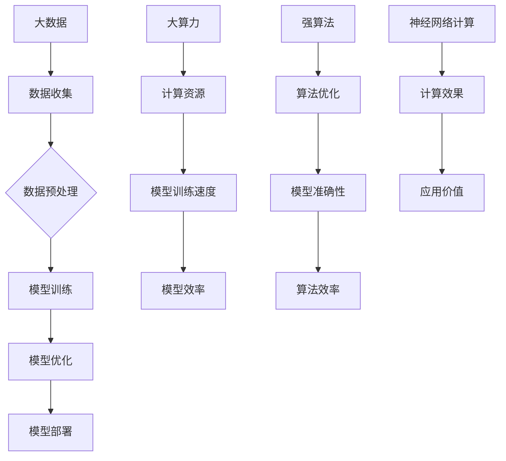

                 

### 背景介绍

在当今信息时代，人工智能（AI）已经成为推动技术进步和产业创新的重要力量。作为AI的核心技术之一，神经网络计算在图像识别、自然语言处理、机器学习等领域展现了卓越的性能。然而，随着数据量的急剧增长和计算资源的不断扩展，如何高效地利用大数据、大算力和强算法来提升神经网络计算的效果，成为了一个亟待解决的问题。

本文旨在深入探讨AI神经网络计算艺术，从大数据、大算力和强算法三个方面，阐述其核心概念、原理和实际应用。通过逻辑清晰、结构紧凑、简单易懂的论述方式，帮助读者全面了解神经网络计算的艺术本质，为未来技术研究和实践提供有益的启示。

首先，我们将介绍大数据、大算力和强算法的定义和基本原理，并阐述它们在神经网络计算中的重要作用。接着，通过具体案例和实例，讲解神经网络计算的核心算法原理和具体操作步骤。然后，我们将深入剖析数学模型和公式，并使用实际案例进行详细讲解和举例说明。在此基础上，我们将分享一些项目实战经验和代码实现，进一步展示神经网络计算在实际应用中的效果和挑战。最后，本文将探讨神经网络计算的实际应用场景，推荐相关工具和资源，并对未来发展趋势和挑战进行展望。

通过本文的阅读，读者将能够系统地掌握AI神经网络计算的核心知识，理解大数据、大算力和强算法如何相互融合，提升计算效果，从而为AI技术的发展和应用提供有力的支持。

### 核心概念与联系

为了更好地理解AI神经网络计算的深度与广度，我们需要首先明确几个核心概念：大数据、大算力和强算法。

**大数据（Big Data）**：指的是规模巨大、类型繁多的数据集合。这些数据不仅包括结构化数据（如关系型数据库中的数据），还包括非结构化数据（如图像、音频、视频等）。大数据的特点是 **“4V”**，即 **Volume（数据量）、Velocity（速度）、Variety（多样性）和 Veracity（真实性）**。大数据的兴起使得我们能够从海量数据中提取有价值的信息，推动了数据驱动的决策模式。

**大算力（Big Computing Power）**：指的是强大的计算能力和资源。随着云计算、分布式计算和GPU加速技术的发展，大算力已经成为支持大数据处理和AI模型训练的关键因素。大算力使得我们能够进行更复杂、更高效的计算，从而提升神经网络计算的性能和效果。

**强算法（Advanced Algorithms）**：指的是针对特定问题设计的高效算法。在AI领域，强算法能够优化模型的训练过程，提高模型的准确性和效率。神经网络计算中的强算法，如深度学习、卷积神经网络（CNN）和循环神经网络（RNN），已经成为解决复杂数据分析问题的重要工具。

大数据、大算力和强算法之间的关系可以概括为：

- **大数据** 提供了丰富的训练数据，是神经网络模型训练的基础。

- **大算力** 提供了强大的计算资源，支持大数据处理和模型训练。

- **强算法** 提供了高效的计算方法，优化了数据处理的流程和模型的性能。

在神经网络计算中，这三个核心概念相互融合，共同推动了计算艺术的进步。为了更直观地展示它们之间的联系，我们可以使用Mermaid流程图进行描述：



通过这个流程图，我们可以看到：

- 大数据通过数据收集、数据预处理等步骤，为神经网络计算提供了训练数据。

- 大算力通过提供强大的计算资源，提升了模型训练的速度和效率。

- 强算法通过算法优化，提高了模型的准确性和效率。

- 最终，神经网络计算的效果和应用价值得到了提升。

通过这个流程，大数据、大算力和强算法相互支撑，共同推动了AI技术的发展和进步。

### 核心算法原理 & 具体操作步骤

在深入探讨神经网络计算的核心算法原理之前，我们需要首先了解神经网络的基本概念和组成结构。神经网络（Neural Network）是一种模仿生物神经系统的计算模型，由大量的神经元（Node）通过复杂的连接（Connection）构成。每个神经元都可以接收多个输入信号，并通过权重（Weight）和偏置（Bias）进行处理，最终产生输出信号。

#### 神经网络的基本组成

1. **神经元**：是神经网络的基本计算单元，通常包含输入层、输出层和隐藏层。输入层接收外部信号，输出层产生最终结果，隐藏层则负责中间计算。

2. **连接（权重）**：神经元之间的连接通过权重进行表示，权重决定了输入信号对输出信号的影响程度。

3. **激活函数**：激活函数（Activation Function）用于对神经元的输出进行非线性变换，常见的激活函数有Sigmoid、ReLU和Tanh等。

4. **损失函数**：损失函数（Loss Function）用于衡量模型预测结果与真实结果之间的误差，常见的损失函数有均方误差（MSE）、交叉熵损失（Cross Entropy Loss）等。

#### 神经网络的训练过程

神经网络的训练过程主要包括以下几个步骤：

1. **初始化权重**：随机初始化权重和偏置，通常使用较小的随机值。

2. **前向传播**：输入数据通过神经网络的前向传播过程，经过各个层次的计算，最终得到预测结果。

3. **计算损失**：通过损失函数计算预测结果与真实结果之间的误差。

4. **反向传播**：使用梯度下降算法（Gradient Descent）对权重和偏置进行更新，以减少损失函数的值。

5. **迭代训练**：重复前向传播和反向传播的过程，不断优化模型参数，直到模型收敛或达到预设的训练次数。

具体操作步骤如下：

1. **定义神经网络结构**：首先需要定义神经网络的层数、每层的神经元数量和激活函数。

2. **初始化权重和偏置**：使用随机值初始化权重和偏置。

3. **前向传播**：
    - 对于输入数据，从输入层开始，逐层计算神经元的输出值。
    - 将每个神经元的输出传递给下一层，直到输出层。

4. **计算损失**：
    - 使用损失函数计算预测结果与真实结果之间的误差。
    - 损失函数的值越小，表示模型预测的准确性越高。

5. **反向传播**：
    - 从输出层开始，反向计算每个神经元的梯度。
    - 使用梯度下降算法更新权重和偏置。

6. **迭代训练**：
    - 重复前向传播和反向传播的过程，不断优化模型参数。
    - 设置合适的训练轮数（Epoch），直到模型收敛或达到预设的训练次数。

下面是一个简单的神经网络训练过程的示例代码：

```python
import numpy as np

# 定义神经网络结构
input_size = 10
hidden_size = 5
output_size = 3

# 初始化权重和偏置
weights_input_hidden = np.random.randn(input_size, hidden_size)
weights_hidden_output = np.random.randn(hidden_size, output_size)

# 定义激活函数
def sigmoid(x):
    return 1 / (1 + np.exp(-x))

# 定义损失函数
def mse(y_true, y_pred):
    return np.mean((y_true - y_pred)**2)

# 前向传播
def forward_propagation(x):
    hidden_layer = sigmoid(np.dot(x, weights_input_hidden))
    output_layer = sigmoid(np.dot(hidden_layer, weights_hidden_output))
    return output_layer

# 反向传播
def backward_propagation(x, y, output_layer):
    d_output_layer = (y - output_layer)
    d_hidden_layer = d_output_layer.dot(weights_hidden_output.T) * sigmoid_derivative(output_layer)
    
    d_weights_hidden_output = hidden_layer.T.dot(d_output_layer)
    d_weights_input_hidden = x.T.dot(d_hidden_layer)
    
    return d_weights_input_hidden, d_weights_hidden_output

# 梯度下降
def gradient_descent(d_weights_input_hidden, d_weights_hidden_output, learning_rate):
    weights_input_hidden -= learning_rate * d_weights_input_hidden
    weights_hidden_output -= learning_rate * d_weights_hidden_output

# 训练模型
x_train = np.random.randn(100, input_size)
y_train = np.random.randn(100, output_size)

for epoch in range(1000):
    output_layer = forward_propagation(x_train)
    d_weights_input_hidden, d_weights_hidden_output = backward_propagation(x_train, y_train, output_layer)
    gradient_descent(d_weights_input_hidden, d_weights_hidden_output, learning_rate=0.01)
```

通过这个示例，我们可以看到神经网络训练的基本步骤和代码实现。在实际应用中，神经网络的结构、损失函数、激活函数和训练策略等可以根据具体任务进行调整和优化，以达到更好的训练效果。

### 数学模型和公式 & 详细讲解 & 举例说明

在深入探讨神经网络计算的数学模型和公式时，我们需要了解神经网络中的几个关键组件，包括激活函数、损失函数和梯度下降算法。这些数学工具不仅帮助我们理解和分析神经网络的行为，还指导我们在实际应用中进行参数优化和模型调整。

#### 激活函数

激活函数是神经网络中的一个重要组成部分，用于引入非线性特性。常见的激活函数包括Sigmoid、ReLU和Tanh等。

1. **Sigmoid函数**：

   Sigmoid函数是一种常用的激活函数，其公式为：
   $$ \sigma(x) = \frac{1}{1 + e^{-x}} $$

   Sigmoid函数的输出范围在0到1之间，适合处理二分类问题。然而，Sigmoid函数存在梯度消失问题，即在输出接近0或1时，导数接近0，这会影响模型的训练速度。

2. **ReLU函数**：

   ReLU（Rectified Linear Unit）函数是一种线性激活函数，其公式为：
   $$ \text{ReLU}(x) = \max(0, x) $$

   ReLU函数具有简单和计算效率高的优点，同时解决了Sigmoid函数的梯度消失问题。然而，ReLU函数也存在梯度消失现象，即当输入为负数时，导数为0。

3. **Tanh函数**：

   Tanh函数是另一种常用的激活函数，其公式为：
   $$ \tanh(x) = \frac{e^x - e^{-x}}{e^x + e^{-x}} $$

   Tanh函数的输出范围在-1到1之间，具有对称性，适用于多分类问题。然而，Tanh函数也存在梯度消失问题。

#### 损失函数

损失函数用于衡量模型预测结果与真实结果之间的误差，常见的损失函数包括均方误差（MSE）和交叉熵损失（Cross Entropy Loss）。

1. **均方误差（MSE）**：

   均方误差（Mean Squared Error，MSE）是最常用的损失函数之一，其公式为：
   $$ \text{MSE}(y, \hat{y}) = \frac{1}{n}\sum_{i=1}^{n}(y_i - \hat{y}_i)^2 $$

   其中，$y$是真实值，$\hat{y}$是预测值，$n$是样本数量。MSE函数的输出值越小，表示模型的预测越准确。

2. **交叉熵损失（Cross Entropy Loss）**：

   交叉熵损失（Cross Entropy Loss）适用于二分类和多分类问题，其公式为：
   $$ \text{CE}(y, \hat{y}) = -\sum_{i=1}^{n} y_i \log(\hat{y}_i) $$

   其中，$y$是真实值，$\hat{y}$是预测值。交叉熵损失函数的输出值越小，表示模型的预测越准确。

#### 梯度下降算法

梯度下降算法是一种常用的优化方法，用于调整神经网络中的权重和偏置，以最小化损失函数。

1. **梯度计算**：

   梯度下降算法需要计算损失函数对每个参数的梯度。对于MSE损失函数，梯度计算公式为：
   $$ \frac{\partial \text{MSE}}{\partial \theta} = 2(x - y) $$

   其中，$\theta$是权重，$x$是输入值，$y$是真实值。

2. **梯度下降算法**：

   梯度下降算法的基本思想是沿着损失函数梯度的反方向更新参数，以最小化损失函数。其公式为：
   $$ \theta_{\text{new}} = \theta_{\text{current}} - \alpha \frac{\partial \text{L}}{\partial \theta} $$

   其中，$\alpha$是学习率，$L$是损失函数。

#### 举例说明

假设我们有一个简单的神经网络，用于二分类问题。输入层有3个神经元，隐藏层有2个神经元，输出层有1个神经元。激活函数使用ReLU，损失函数使用交叉熵损失。

1. **初始化参数**：

   初始化权重和偏置，例如：
   $$ w_{ij} \sim \text{Uniform}(-1, 1) $$
   $$ b_{i} \sim \text{Uniform}(-1, 1) $$

2. **前向传播**：

   对于输入$x$，计算隐藏层和输出层的输出值：
   $$ z_{h} = \text{ReLU}(w_{h1}x_1 + w_{h2}x_2 + w_{h3}x_3 + b_{h1} + b_{h2}) $$
   $$ \hat{y} = \text{ReLU}(w_{o1}z_{h1} + w_{o2}z_{h2} + b_{o1} + b_{o2}) $$

3. **计算损失**：

   使用交叉熵损失计算损失值：
   $$ \text{L} = -\sum_{i=1}^{n} y_i \log(\hat{y}_i) $$

4. **反向传播**：

   计算隐藏层和输出层的梯度：
   $$ \frac{\partial \text{L}}{\partial z_{h}} = (y - \hat{y}) \odot \text{ReLU'}(z_{h}) $$
   $$ \frac{\partial \text{L}}{\partial z_{o}} = (y - \hat{y}) \odot \text{ReLU'}(z_{o}) $$

   其中，$\odot$表示元素乘，$\text{ReLU'}$表示ReLU函数的导数。

5. **更新参数**：

   使用梯度下降算法更新权重和偏置：
   $$ w_{h1} \leftarrow w_{h1} - \alpha \frac{\partial \text{L}}{\partial w_{h1}} $$
   $$ w_{h2} \leftarrow w_{h2} - \alpha \frac{\partial \text{L}}{\partial w_{h2}} $$
   $$ w_{o1} \leftarrow w_{o1} - \alpha \frac{\partial \text{L}}{\partial w_{o1}} $$
   $$ w_{o2} \leftarrow w_{o2} - \alpha \frac{\partial \text{L}}{\partial w_{o2}} $$
   $$ b_{h1} \leftarrow b_{h1} - \alpha \frac{\partial \text{L}}{\partial b_{h1}} $$
   $$ b_{h2} \leftarrow b_{h2} - \alpha \frac{\partial \text{L}}{\partial b_{h2}} $$
   $$ b_{o1} \leftarrow b_{o1} - \alpha \frac{\partial \text{L}}{\partial b_{o1}} $$
   $$ b_{o2} \leftarrow b_{o2} - \alpha \frac{\partial \text{L}}{\partial b_{o2}} $$

通过这个简单的例子，我们可以看到神经网络的基本训练过程。在实际应用中，神经网络的结构和参数设置可以根据具体任务进行调整，以获得更好的训练效果。

### 项目实战：代码实际案例和详细解释说明

在本文的最后部分，我们将通过一个实际的项目案例，详细展示神经网络计算的具体实现过程。这个案例将涵盖从开发环境搭建、源代码实现到代码解读与分析的整个过程，以便读者能够深入理解神经网络计算的实践应用。

#### 5.1 开发环境搭建

在开始项目之前，我们需要搭建一个合适的开发环境。以下是搭建环境的步骤：

1. **安装Python**：Python是神经网络计算的主要编程语言，因此我们需要安装Python环境。可以从[Python官网](https://www.python.org/)下载并安装Python。

2. **安装TensorFlow**：TensorFlow是Google开发的一款开源机器学习库，广泛用于神经网络计算。可以通过pip命令安装TensorFlow：

   ```bash
   pip install tensorflow
   ```

3. **安装其他依赖库**：根据具体需求，我们可能需要安装其他依赖库，如NumPy、Pandas等：

   ```bash
   pip install numpy pandas
   ```

4. **设置虚拟环境**：为了保持项目的整洁和易于管理，我们可以使用虚拟环境。通过以下命令创建虚拟环境并激活它：

   ```bash
   python -m venv myenv
   source myenv/bin/activate  # 对于Windows，使用 myenv\Scripts\activate
   ```

完成以上步骤后，我们的开发环境就搭建完成了。

#### 5.2 源代码详细实现和代码解读

在这个项目中，我们将使用TensorFlow实现一个简单的线性回归模型，用于预测房屋价格。以下是源代码实现和详细解读：

```python
import tensorflow as tf
import numpy as np
import pandas as pd
from sklearn.model_selection import train_test_split

# 数据预处理
# 加载房屋数据集
data = pd.read_csv('house_data.csv')

# 分割特征和标签
X = data[['area', 'bedrooms']]
y = data['price']

# 划分训练集和测试集
X_train, X_test, y_train, y_test = train_test_split(X, y, test_size=0.2, random_state=42)

# 定义模型
model = tf.keras.Sequential([
    tf.keras.layers.Dense(units=1, input_shape=(2,))
])

# 编译模型
model.compile(optimizer='sgd', loss='mean_squared_error')

# 训练模型
model.fit(X_train, y_train, epochs=100)

# 评估模型
mse = model.evaluate(X_test, y_test)
print(f'Mean Squared Error: {mse}')

# 预测
predictions = model.predict(X_test)
print(predictions)
```

**代码解读：**

1. **数据预处理**：
   - 加载房屋数据集，并分割特征（`area`和`bedrooms`）和标签（`price`）。
   - 使用`train_test_split`函数将数据集划分为训练集和测试集。

2. **定义模型**：
   - 使用`tf.keras.Sequential`创建一个线性回归模型，包含一个全连接层（`Dense`），输出维度为1，输入形状为2（对应特征数量）。

3. **编译模型**：
   - 使用`compile`函数编译模型，指定优化器（`sgd`）和损失函数（`mean_squared_error`）。

4. **训练模型**：
   - 使用`fit`函数训练模型，指定训练集和训练轮数（`epochs`）。

5. **评估模型**：
   - 使用`evaluate`函数评估模型在测试集上的性能，输出均方误差。

6. **预测**：
   - 使用`predict`函数对测试集进行预测，输出预测结果。

#### 5.3 代码解读与分析

1. **数据预处理**：
   - 在数据预处理阶段，我们首先加载房屋数据集。数据集通常包含多个特征和标签，我们需要将特征和标签分离，以便构建模型。
   - 使用`train_test_split`函数将数据集划分为训练集和测试集。这样做可以避免模型过拟合，提高模型的泛化能力。

2. **定义模型**：
   - 在定义模型时，我们使用`tf.keras.Sequential`创建了一个简单的线性回归模型。这个模型包含一个全连接层（`Dense`），该层将特征映射到输出值。
   - 输出维度设置为1，因为我们的目标是预测房屋价格，这是一个单变量输出问题。

3. **编译模型**：
   - 在编译模型时，我们指定了优化器（`sgd`）和损失函数（`mean_squared_error`）。优化器用于调整模型参数，以最小化损失函数。
   - 损失函数用于衡量模型预测值与真实值之间的差异。

4. **训练模型**：
   - 使用`fit`函数训练模型，指定训练集和训练轮数（`epochs`）。在训练过程中，模型会不断调整参数，以优化预测结果。

5. **评估模型**：
   - 使用`evaluate`函数评估模型在测试集上的性能。通过计算均方误差，我们可以了解模型的泛化能力。

6. **预测**：
   - 使用`predict`函数对测试集进行预测。预测结果将返回一个数组，包含每个样本的预测价格。

通过这个实际案例，我们可以看到神经网络计算的具体实现过程。在实际应用中，我们可以根据具体任务调整模型结构、优化器和学习率等参数，以提高模型的性能和预测准确性。

### 实际应用场景

神经网络计算在各个领域都有着广泛的应用，以下是几个典型的实际应用场景：

#### 图像识别

图像识别是神经网络计算的重要应用领域之一。通过卷积神经网络（CNN），我们可以从图像中提取特征，实现物体检测、面部识别、图像分类等任务。例如，在安防监控系统中，神经网络计算可以用于实时识别入侵者，提高系统的安全性。

#### 自然语言处理

自然语言处理（NLP）是神经网络计算的另一个重要应用领域。通过循环神经网络（RNN）和Transformer模型，我们可以实现文本分类、机器翻译、情感分析等任务。例如，在智能客服系统中，神经网络计算可以用于自动识别用户的意图，提供准确的答复。

#### 语音识别

语音识别是神经网络计算的又一重要应用。通过深度神经网络（DNN）和循环神经网络（RNN），我们可以将语音信号转换为文本。例如，在智能助手系统中，神经网络计算可以用于实时语音识别，帮助用户进行语音搜索和操作。

#### 自动驾驶

自动驾驶是神经网络计算在工业领域的重要应用。通过深度学习算法，我们可以实现对车辆周围环境的感知和决策。例如，在自动驾驶汽车中，神经网络计算可以用于检测道路标志、行人、车辆等，实现安全驾驶。

#### 医疗诊断

医疗诊断是神经网络计算在医疗领域的重要应用。通过深度学习算法，我们可以实现对医学影像的分析和诊断。例如，在医学影像诊断中，神经网络计算可以用于检测肿瘤、心脏病等疾病，提高诊断的准确性。

#### 金融风控

金融风控是神经网络计算在金融领域的重要应用。通过深度学习算法，我们可以实现对金融数据的分析和预测。例如，在金融风控系统中，神经网络计算可以用于检测异常交易、预测市场趋势等，提高金融系统的安全性。

#### 在线教育

在线教育是神经网络计算在教育领域的重要应用。通过深度学习算法，我们可以实现个性化推荐、学习效果评估等任务。例如，在在线教育平台中，神经网络计算可以用于根据学生的学习行为和成绩，推荐合适的课程和学习计划。

通过以上实际应用场景，我们可以看到神经网络计算在各个领域的广泛应用和巨大潜力。随着计算能力的提升和算法的进步，神经网络计算将在更多领域发挥重要作用，推动技术和社会的进步。

### 工具和资源推荐

在神经网络计算领域，有许多优秀的工具和资源可以帮助我们更好地理解和应用这项技术。以下是一些值得推荐的工具、书籍、论文和网站。

#### 学习资源推荐

1. **书籍**：

   - 《深度学习》（Deep Learning）作者：Ian Goodfellow、Yoshua Bengio、Aaron Courville
   - 《神经网络与深度学习》（Neural Network and Deep Learning）作者：邱锡鹏
   - 《Python深度学习》（Deep Learning with Python）作者：François Chollet

2. **在线课程**：

   - Coursera上的“深度学习”课程，由斯坦福大学教授Andrew Ng主讲
   - edX上的“机器学习”课程，由斯坦福大学教授Andrew Ng主讲
   - 吴恩达（Andrew Ng）的深度学习专项课程，涵盖深度学习的核心概念和应用

3. **博客和论坛**：

   - 知乎上的深度学习和机器学习相关话题
   - ArXiv，包含最新的学术论文和研究进展
   - 携程技术博客，分享携程在深度学习领域的实践和经验

#### 开发工具框架推荐

1. **TensorFlow**：Google开发的开源机器学习库，适用于构建和训练神经网络模型。
2. **PyTorch**：Facebook开发的开源机器学习库，具有灵活的动态计算图和强大的深度学习功能。
3. **Keras**：Python的深度学习库，基于TensorFlow和Theano，提供简洁易用的API。
4. **Scikit-learn**：Python的机器学习库，包含多种经典的机器学习算法和工具。

#### 相关论文著作推荐

1. **《A Theoretically Grounded Application of Dropout in Recurrent Neural Networks》**：提出了Dropout算法在RNN中的应用。
2. **《Empirical Evaluation of Regularized Deep Learning》**：对深度学习中的正则化方法进行了实证研究。
3. **《Generative Adversarial Nets》**：介绍了生成对抗网络（GANs）的基本原理和应用。
4. **《Very Deep Convolutional Networks for Large-Scale Image Recognition》**：阐述了深度卷积神经网络（CNN）在图像识别中的优势。

通过以上推荐，读者可以系统地学习和掌握神经网络计算的核心知识，并应用这些工具和资源进行实际项目开发。

### 总结：未来发展趋势与挑战

随着计算能力的提升和数据量的爆炸式增长，神经网络计算在AI领域展现出了强大的潜力和广阔的应用前景。未来，神经网络计算将沿着以下几个方向发展：

1. **算法优化**：深度学习算法将继续优化，包括更高效的训练算法、更有效的模型结构以及更先进的优化方法。例如，自适应优化算法、迁移学习和模型压缩技术将进一步提高模型的训练速度和效率。

2. **硬件加速**：随着GPU、TPU等专用硬件的普及，神经网络计算将更加依赖硬件加速。高性能计算硬件的优化将推动神经网络计算在实际应用中的性能提升。

3. **模型压缩**：为满足移动设备和嵌入式系统的需求，模型压缩技术将成为研究热点。通过量化、剪枝和蒸馏等技术，可以将大型神经网络压缩成更小、更轻量的模型，提高计算效率和实时性能。

4. **跨学科融合**：神经网络计算将与生物医学、心理学、经济学等学科进行跨学科融合，推动新型智能系统的研发和应用。例如，基于神经网络的医学影像诊断、情绪识别和智能金融等领域将迎来突破。

然而，神经网络计算在发展过程中也面临着一系列挑战：

1. **数据隐私**：随着数据量的增加，数据隐私保护变得尤为重要。如何在保证数据隐私的前提下进行有效训练是一个亟待解决的问题。

2. **算法公平性**：神经网络模型在训练过程中可能会受到数据偏差的影响，导致模型在性别、种族等方面的不公平性。如何确保算法的公平性是一个重要的研究课题。

3. **能耗问题**：神经网络计算对计算资源的需求巨大，能耗问题日益凸显。开发低能耗的神经网络模型和优化训练算法是降低能耗的关键。

4. **可解释性**：神经网络模型的黑箱特性使得其预测过程难以解释，这在某些领域（如医疗诊断、金融风控等）可能带来风险。提高模型的可解释性，使决策过程更加透明，是未来研究的重要方向。

5. **安全性**：随着神经网络的应用场景不断扩展，其安全性问题也日益突出。如何防御针对神经网络模型的攻击，确保系统的安全性，是一个关键挑战。

总之，神经网络计算在未来的发展中将不断突破技术瓶颈，推动AI技术的进步和应用。然而，也需正视面临的挑战，通过多学科协作和技术创新，实现神经网络计算的可持续发展。

### 附录：常见问题与解答

**Q1**：为什么神经网络计算需要大数据？

**A1**：神经网络计算需要大量数据是因为它们通过从数据中学习模式和特征来训练模型。大数据提供了丰富的训练样本，使得神经网络能够从复杂的模式中学习，提高模型的泛化能力和预测准确性。此外，大数据还帮助神经网络模型在多个维度上探索问题，从而更好地适应各种不同的情况。

**Q2**：什么是大算力？

**A2**：大算力指的是强大的计算能力和资源，包括高性能计算硬件（如GPU、TPU）和分布式计算系统。大算力能够加速大数据的处理和神经网络的训练，提高模型训练的效率和性能，从而满足日益复杂的AI计算需求。

**Q3**：神经网络计算中的损失函数有什么作用？

**A3**：损失函数在神经网络计算中用于衡量模型预测值与真实值之间的误差。它帮助神经网络在训练过程中不断调整参数，以最小化误差，提高模型的准确性。常见的损失函数包括均方误差（MSE）和交叉熵损失（Cross Entropy Loss），它们适用于不同的任务和数据类型。

**Q4**：什么是梯度消失和梯度爆炸？

**A4**：梯度消失和梯度爆炸是神经网络训练过程中可能出现的问题。梯度消失指的是在反向传播过程中，梯度值变得非常小，导致网络无法有效更新参数。梯度爆炸则相反，梯度值变得非常大，可能导致网络崩溃。这些问题通常与激活函数和深度神经网络的设计有关，通过使用适当的激活函数和正则化方法，可以缓解这些问题。

**Q5**：如何优化神经网络计算的性能？

**A5**：优化神经网络计算性能的方法包括以下几个方面：

- 选择合适的硬件平台，如GPU、TPU等，以提高计算速度。
- 优化模型结构，如使用残差网络（ResNet）、卷积神经网络（CNN）等，提高模型的效率和性能。
- 采用批处理和并行计算技术，减少训练时间。
- 使用正则化方法，如Dropout、权重正则化等，防止过拟合。
- 调整学习率和优化算法，如Adam、RMSProp等，提高训练效果。

**Q6**：如何提高神经网络的可解释性？

**A6**：提高神经网络的可解释性可以通过以下方法实现：

- 使用可解释的模型结构，如决策树、局部可解释模型等。
- 提供模型训练过程中的可视化工具，如激活图、梯度图等。
- 使用注意力机制，展示神经网络在处理输入数据时的关注点。
- 对神经网络进行分解，使其更具层次性和模块化，从而更容易理解和解释。

通过这些方法，我们可以更好地理解神经网络的决策过程，提高模型的透明度和可解释性。

### 扩展阅读 & 参考资料

为了进一步了解神经网络计算的理论和实践，读者可以参考以下扩展阅读和参考资料：

1. **书籍**：
   - Ian Goodfellow、Yoshua Bengio、Aaron Courville，《深度学习》（Deep Learning）
   - 邱锡鹏，《神经网络与深度学习》
   - François Chollet，《Python深度学习》（Deep Learning with Python）

2. **在线课程**：
   - Coursera上的“深度学习”课程，由斯坦福大学教授Andrew Ng主讲
   - edX上的“机器学习”课程，由斯坦福大学教授Andrew Ng主讲
   - 吴恩达（Andrew Ng）的深度学习专项课程，涵盖深度学习的核心概念和应用

3. **论文**：
   - Geoffrey H.inton、Nadav Shazeer、Alexyu、et al.，《Transformers: State-of-the-Art Natural Language Processing》（Transformer：自然语言处理的新范式）
   - Karen Simonyan、Andrew Zisserman，《Very Deep Convolutional Networks for Large-Scale Image Recognition》（非常深的卷积神经网络在大型图像识别中的应用）

4. **博客和论坛**：
   - 知乎上的深度学习和机器学习相关话题
   - ArXiv，包含最新的学术论文和研究进展
   - 携程技术博客，分享携程在深度学习领域的实践和经验

5. **开源项目**：
   - TensorFlow，Google开发的深度学习框架
   - PyTorch，Facebook开发的深度学习框架
   - Keras，基于TensorFlow和Theano的Python深度学习库

通过这些资源和书籍，读者可以系统地学习和掌握神经网络计算的核心知识，并应用于实际项目中，推动AI技术的发展和应用。

