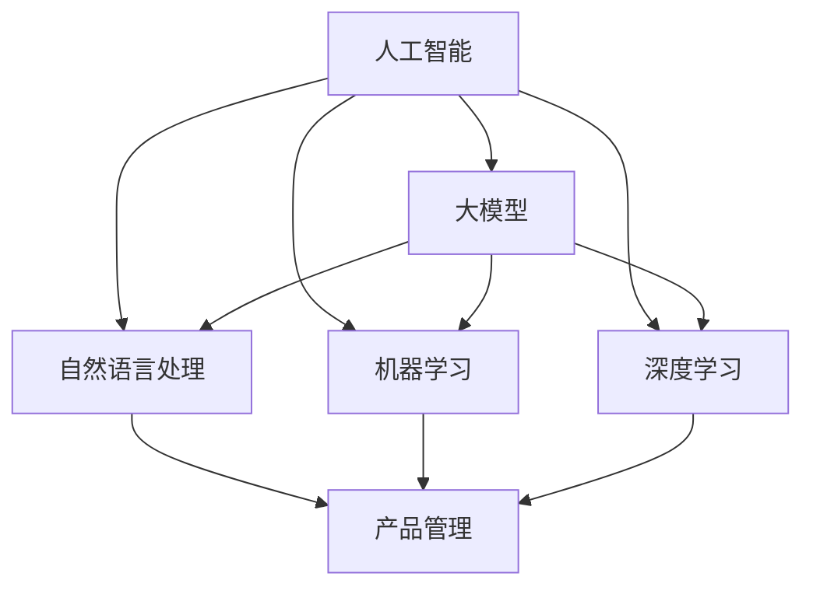

                 

### 背景介绍

在当今这个快速变化的技术时代，人工智能（AI）已经成为驱动创新和业务增长的引擎。随着大模型技术的飞速发展，从语言模型到计算机视觉，再到自然语言处理，人工智能正在不断突破传统技术的边界。这种变革不仅影响了科技行业，也深刻改变了各行各业，包括医疗、金融、教育等。

在这场变革中，产品经理（PM）的角色变得尤为重要。产品经理不仅要了解市场需求，还要掌握技术趋势，以确保产品能够紧跟甚至引领市场。然而，随着AI技术的不断进步，传统的产品经理面临着新的挑战和机遇。他们需要重新定义自己的技能集，以便更好地利用AI技术，推动产品创新和业务增长。

本文将探讨AI驱动的创业产品经理转型，特别是在大模型时代，他们需要掌握哪些核心技能和知识。我们将从背景介绍、核心概念与联系、核心算法原理、数学模型和公式、项目实战、实际应用场景、工具和资源推荐、总结和附录等多个方面，详细分析产品经理如何适应和利用AI技术，实现个人和职业生涯的成功转型。

首先，让我们明确本文的研究目的。本文旨在为创业产品经理提供一套全面的转型策略，帮助他们在AI时代提升自己的竞争力。我们将通过深入分析和案例研究，探讨以下几个关键问题：

- AI技术如何影响产品设计和开发？
- 产品经理需要掌握哪些AI基础知识和技能？
- 如何利用AI技术优化产品开发和迭代过程？
- 大模型技术在产品管理中的应用案例有哪些？
- 产品经理在未来面临哪些新的挑战和机遇？

通过对这些问题的探讨，我们将为读者提供实用的指导和启示，帮助他们在AI驱动的创业领域中取得成功。

### 核心概念与联系

在探讨AI驱动的创业产品经理转型之前，我们需要了解几个核心概念和它们之间的联系。以下是本文将涉及的主要概念及其相互关系：

**人工智能（AI）**：人工智能是使计算机系统能够执行通常需要人类智能的任务的科学技术。这包括机器学习、深度学习、自然语言处理、计算机视觉等领域。AI技术通过算法和大量数据训练模型，使计算机能够自主学习和改进。

**大模型（Large Models）**：大模型是指具有数亿甚至数十亿参数的神经网络模型。这些模型能够处理复杂的任务，如文本生成、图像识别和语音识别。大模型通常需要大量的计算资源和数据支持，但它们在许多领域都表现出了卓越的性能。

**自然语言处理（NLP）**：自然语言处理是AI的一个分支，旨在使计算机理解和生成人类语言。NLP技术包括文本分类、情感分析、机器翻译和对话系统等。

**机器学习（ML）**：机器学习是AI的核心组成部分，它通过从数据中学习规律和模式，使计算机能够进行预测和决策。机器学习分为监督学习、无监督学习和强化学习等。

**深度学习（DL）**：深度学习是机器学习的一个子领域，它使用多层神经网络来提取特征和模式。深度学习在图像识别、语音识别和自然语言处理等领域取得了显著的成果。

**产品管理**：产品管理是确保产品成功从概念到市场的全过程。产品经理负责定义产品愿景、规划产品路线图、管理产品开发和迭代，以及收集用户反馈以持续改进产品。

下面是一个用Mermaid绘制的流程图，展示了这些概念之间的相互关系：



**人工智能（AI）** 是整个架构的核心，它包括了 **大模型（Large Models）**、**自然语言处理（NLP）**、**机器学习（ML）** 和 **深度学习（DL）**。这些技术共同构成了AI的能力，使得计算机能够处理复杂任务。同时，**产品管理（Product Management）** 作为AI技术的应用场景之一，通过将AI技术与市场研究和用户反馈相结合，推动产品的迭代和改进。

理解这些概念及其相互关系对于创业产品经理至关重要。它不仅能够帮助他们更好地理解AI技术的潜在价值，还能够指导他们在产品开发过程中有效地利用这些技术，从而在竞争激烈的市场中脱颖而出。

### 核心算法原理 & 具体操作步骤

在了解核心概念和联系之后，我们需要深入探讨AI驱动的创业产品经理如何具体利用AI算法来提升产品和业务。以下是一些关键算法原理及其实际操作步骤：

**1. 机器学习算法**：机器学习算法是AI的核心，它们能够从数据中学习并做出预测。对于产品经理来说，机器学习算法可以帮助他们进行需求预测、用户行为分析、市场趋势预测等。

- **监督学习（Supervised Learning）**：
  - **原理**：监督学习是一种机器学习方法，其中模型通过已标记的训练数据学习，然后使用这些学到的模式对新数据进行预测。
  - **操作步骤**：
    - 数据收集：收集与产品相关的数据，如用户反馈、市场趋势、竞争对手分析等。
    - 数据预处理：清洗数据，处理缺失值和异常值，进行特征工程。
    - 模型选择：选择合适的模型，如线性回归、决策树、随机森林等。
    - 训练模型：使用训练数据训练模型。
    - 模型评估：使用验证集或测试集评估模型性能。
    - 模型部署：将训练好的模型部署到生产环境中。

- **无监督学习（Unsupervised Learning）**：
  - **原理**：无监督学习是一种不使用标记数据训练模型的方法，它用于发现数据中的隐含结构和模式。
  - **操作步骤**：
    - 数据收集：与监督学习类似，收集相关数据。
    - 数据预处理：同样需要进行数据清洗和特征工程。
    - 模型选择：选择无监督学习算法，如K均值聚类、主成分分析（PCA）等。
    - 模型训练：使用无监督学习算法对数据进行分析。
    - 结果分析：分析模型的输出结果，如聚类结果、特征降维等。

**2. 深度学习算法**：深度学习是机器学习的扩展，它通过多层神经网络来学习复杂的数据特征。深度学习在图像识别、语音识别和自然语言处理等领域表现出色。

- **卷积神经网络（CNN）**：
  - **原理**：卷积神经网络是一种用于图像识别的深度学习模型，它通过卷积层提取图像特征。
  - **操作步骤**：
    - 数据收集：收集大量的图像数据。
    - 数据预处理：对图像进行缩放、裁剪和归一化等处理。
    - 模型构建：设计CNN模型，包括卷积层、池化层和全连接层。
    - 模型训练：使用训练数据训练模型，调整模型参数。
    - 模型评估：使用测试数据评估模型性能。

- **循环神经网络（RNN）**：
  - **原理**：循环神经网络是一种用于序列数据处理的深度学习模型，它能够处理如文本和语音等时间序列数据。
  - **操作步骤**：
    - 数据收集：收集文本或语音数据。
    - 数据预处理：对文本进行分词、词向量编码等处理。
    - 模型构建：设计RNN模型，如LSTM（长短期记忆网络）或GRU（门控循环单元）。
    - 模型训练：使用序列数据训练模型。
    - 模型评估：使用测试序列数据评估模型性能。

**3. 自然语言处理（NLP）算法**：自然语言处理是AI的关键领域，它使计算机能够理解和生成人类语言。NLP技术在产品经理中有着广泛的应用，如智能客服、个性化推荐、内容审核等。

- **词嵌入（Word Embedding）**：
  - **原理**：词嵌入是将单词映射到高维空间中，使相似词在空间中靠近。
  - **操作步骤**：
    - 数据收集：收集文本数据，如用户评论、产品描述等。
    - 数据预处理：对文本进行分词、去停用词等处理。
    - 模型选择：选择合适的词嵌入模型，如Word2Vec、GloVe等。
    - 模型训练：使用文本数据训练词嵌入模型。
    - 模型应用：将词嵌入应用于产品功能，如文本分析、情感分析等。

- **序列到序列（Seq2Seq）模型**：
  - **原理**：序列到序列模型是一种用于序列数据转换的深度学习模型，它常用于机器翻译、文本生成等任务。
  - **操作步骤**：
    - 数据收集：收集源语言和目标语言的文本数据。
    - 数据预处理：对文本进行分词、编码等处理。
    - 模型构建：设计Seq2Seq模型，包括编码器和解码器。
    - 模型训练：使用训练数据训练模型。
    - 模型应用：将模型应用于实际任务，如机器翻译、文本生成等。

通过掌握这些核心算法原理和具体操作步骤，创业产品经理可以更好地利用AI技术来优化产品开发、提高用户体验和推动业务增长。在接下来的章节中，我们将通过实际案例来深入探讨这些算法的应用。

### 数学模型和公式 & 详细讲解 & 举例说明

在探讨AI驱动的创业产品经理转型时，理解相关的数学模型和公式是至关重要的。以下是一些关键数学模型及其在AI技术中的应用，我们将通过详细的讲解和实际案例来说明这些模型如何影响产品管理和开发。

#### 1. 概率论与统计模型

**概率分布**：概率分布是描述随机变量可能取值的概率集合。在AI中，常见的概率分布包括正态分布、伯努利分布和多项式分布。

- **正态分布**（Normal Distribution）：
  - **公式**：$$ N(\mu, \sigma^2) = \frac{1}{\sqrt{2\pi\sigma^2}} e^{-\frac{(x-\mu)^2}{2\sigma^2}} $$
  - **应用**：正态分布在机器学习中的数据预处理阶段被广泛使用，用于标准化特征值，使得不同特征的权重相当。
  - **案例**：假设我们有一个产品用户的年龄数据，通过正态分布，我们可以将年龄特征转换为标准正态分布，从而简化后续的机器学习算法。

**贝叶斯定理**：贝叶斯定理是概率论中用于计算条件概率的重要工具，它表明后验概率可以通过先验概率和似然函数结合计算得到。

- **公式**：$$ P(A|B) = \frac{P(B|A)P(A)}{P(B)} $$
- **应用**：贝叶斯定理在分类任务中非常重要，例如在垃圾邮件过滤中，可以根据邮件内容判断邮件是否为垃圾邮件。
- **案例**：假设我们有一个电子邮件过滤系统，通过分析邮件内容和用户历史，使用贝叶斯定理可以计算出邮件属于垃圾邮件的概率，从而决定是否将其标记为垃圾邮件。

#### 2. 优化算法

**梯度下降**（Gradient Descent）：梯度下降是一种用于最小化损失函数的优化算法，是机器学习中最常用的算法之一。

- **公式**：$$ \theta_{\text{new}} = \theta_{\text{old}} - \alpha \nabla_\theta J(\theta) $$
  - **其中**：$$ \theta $$ 为模型参数，$$ \alpha $$ 为学习率，$$ J(\theta) $$ 为损失函数，$$ \nabla_\theta J(\theta) $$ 为损失函数关于参数$$ \theta $$ 的梯度。
- **应用**：梯度下降用于训练机器学习模型，通过不断调整参数以最小化损失函数。
- **案例**：在训练一个神经网络模型时，通过梯度下降算法，可以调整网络权重，使得模型在训练数据上的表现越来越准确。

**随机梯度下降**（Stochastic Gradient Descent，SGD）：随机梯度下降是梯度下降的一个变体，它每次迭代只使用一个训练样本的梯度进行更新。

- **公式**：$$ \theta_{\text{new}} = \theta_{\text{old}} - \alpha \nabla_{\theta} J(\theta; x_i, y_i) $$
- **应用**：SGD通过使用随机样本更新参数，可以加快收敛速度，并且在处理大规模数据集时尤为有效。
- **案例**：在大规模数据处理中，使用SGD可以更高效地训练模型，避免因为数据量过大导致计算资源不足的问题。

#### 3. 神经网络模型

**反向传播算法**（Backpropagation）：反向传播算法是训练神经网络的关键算法，它通过计算误差梯度并反向传播到每一层，从而更新网络参数。

- **公式**：$$ \nabla_\theta J(\theta) = \sum_{l=1}^L \nabla_{\theta_l} J(\theta_l) $$
  - **其中**：$$ L $$ 为网络层数，$$ \theta_l $$ 为第$$ l $$层的参数。
- **应用**：反向传播算法用于训练多层神经网络，使得模型能够学习更复杂的特征。
- **案例**：在一个深度神经网络中，反向传播算法可以自动调整每层的权重，使得网络在训练数据上表现出更好的预测能力。

**激活函数**：激活函数是神经网络中的一个关键组件，用于引入非线性特性，使得神经网络能够学习更复杂的函数。

- **公式**：$$ f(x) = \max(0, x) $$
  - **应用**：ReLU（Rectified Linear Unit）是最常见的激活函数，它能够加速神经网络的训练。
- **案例**：在深度神经网络中，ReLU函数可以使得网络在训练过程中更加稳定，减少梯度消失和梯度爆炸的问题。

通过这些数学模型和公式的讲解，我们可以看到，它们在AI驱动的创业产品经理转型中起着至关重要的作用。产品经理不仅需要理解这些模型的基本原理，还需要能够将这些原理应用于实际的产品开发和管理中。在接下来的章节中，我们将通过一个实际项目案例，展示这些模型和算法在实际应用中的效果。

### 项目实战：代码实际案例和详细解释说明

在本节中，我们将通过一个实际项目案例来展示如何利用AI技术进行产品开发和迭代。这个案例将涵盖开发环境的搭建、源代码的详细实现以及代码的解读与分析。

#### 1. 开发环境搭建

为了确保项目的顺利实施，我们首先需要搭建一个合适的技术栈。以下是我们的开发环境搭建步骤：

- **操作系统**：Linux（例如Ubuntu）
- **编程语言**：Python
- **深度学习框架**：TensorFlow 2.x
- **版本控制**：Git
- **代码编辑器**：Visual Studio Code

**步骤**：

1. 安装Linux操作系统。
2. 配置Python环境，包括安装pip和virtualenv。
3. 使用virtualenv创建一个隔离的开发环境，并安装TensorFlow和其他依赖库。
4. 安装Visual Studio Code，并安装相关的扩展，如Python、Git等。

#### 2. 源代码详细实现

接下来，我们将展示一个简单的文本分类项目，该项目利用深度学习技术对用户评论进行情感分析。

**代码片段1**：导入必要的库和模块

```python
import tensorflow as tf
from tensorflow.keras.preprocessing.sequence import pad_sequences
from tensorflow.keras.layers import Embedding, LSTM, Dense, Bidirectional
from tensorflow.keras.models import Sequential
```

**代码片段2**：数据预处理

```python
# 加载数据集
(train_data, train_labels), (test_data, test_labels) = tf.keras.datasets.imdb.load_data(num_words=10000)

# 数据预处理
max_length = 100
truncated = 'post'
padding = 'post'

train_data = pad_sequences(train_data, maxlen=max_length, padding=padding, truncating=truncated)
test_data = pad_sequences(test_data, maxlen=max_length, padding=padding, truncating=truncated)
```

**代码片段3**：构建模型

```python
# 构建模型
model = Sequential([
    Embedding(10000, 16),
    Bidirectional(LSTM(32)),
    Dense(1, activation='sigmoid')
])

# 编译模型
model.compile(optimizer='adam', loss='binary_crossentropy', metrics=['accuracy'])
```

**代码片段4**：训练模型

```python
# 训练模型
history = model.fit(train_data, train_labels, epochs=10, batch_size=128, validation_split=0.2)
```

**代码片段5**：评估模型

```python
# 评估模型
test_loss, test_acc = model.evaluate(test_data, test_labels)
print(f"Test accuracy: {test_acc:.4f}")
```

#### 3. 代码解读与分析

**代码解读**：

- **数据预处理**：数据预处理是深度学习项目中的重要步骤。在这里，我们使用了IMDB数据集，该数据集包含25,000条影评，用于训练和测试模型。通过`pad_sequences`函数，我们将文本序列填充到固定长度（max_length = 100），确保所有输入数据都有相同长度。

- **模型构建**：我们使用了一个简单的双向LSTM模型，它包括一个嵌入层、一个双向LSTM层和一个全连接层。嵌入层将单词映射到固定维度的向量表示，双向LSTM层能够捕捉文本序列中的前向和后向信息，全连接层用于输出情感分类结果。

- **模型编译**：在模型编译阶段，我们指定了优化器（adam）和损失函数（binary_crossentropy），这表明我们的模型将进行二分类任务。

- **模型训练**：模型训练是通过`fit`函数进行的，我们在训练过程中设置了10个训练周期（epochs），每个周期使用128个样本进行批量训练。

- **模型评估**：通过`evaluate`函数，我们评估了模型在测试数据集上的性能，输出准确率。

**代码分析**：

- **数据预处理**：数据预处理是深度学习项目的关键步骤，它直接影响模型的性能。在这里，我们使用了`pad_sequences`函数，确保所有文本序列长度一致，这对于后续的模型训练非常重要。

- **模型架构**：我们选择了一个简单的双向LSTM模型，这是因为在处理文本数据时，双向LSTM能够更好地捕捉文本序列中的信息。同时，我们使用了ReLU激活函数，这有助于加速模型的训练。

- **模型训练和评估**：通过设置适当的训练参数，如周期数（epochs）和批量大小（batch_size），我们能够有效地训练模型并在测试数据集上评估其性能。

通过这个实际项目案例，我们可以看到，利用AI技术进行产品开发和迭代是一个系统化的过程，涉及数据预处理、模型构建、训练和评估等多个步骤。产品经理需要深入了解这些步骤，以便在实际项目中有效地利用AI技术，推动产品创新和业务增长。

### 实际应用场景

在AI驱动的创业产品经理转型过程中，了解AI技术在各种实际应用场景中的具体应用是非常重要的。以下是一些关键应用场景及其对产品管理的影响：

#### 1. 智能客服系统

智能客服系统是AI在产品管理中应用的一个典型场景。通过自然语言处理（NLP）和机器学习算法，智能客服系统能够自动理解和响应客户提问，提供即时和准确的解决方案。

- **应用**：
  - 自动分类和路由客户请求。
  - 提供个性化建议和推荐。
  - 自动解答常见问题。
- **影响**：
  - 提高客户满意度：通过快速响应和准确解决客户问题，提升客户体验。
  - 减轻人工负担：自动化处理常见问题，减少人工客服的工作量。
  - 数据收集：通过分析客户提问和响应，收集用户反馈，用于产品改进和优化。

#### 2. 个性化推荐系统

个性化推荐系统利用用户行为数据和机器学习算法，为用户提供个性化的产品推荐。

- **应用**：
  - 基于用户历史行为推荐相关产品。
  - 推荐相似用户喜欢的产品。
  - 建立用户画像，进行精准营销。
- **影响**：
  - 提高转化率：通过个性化推荐，增加用户购买概率。
  - 增加用户粘性：通过持续提供相关和感兴趣的产品，增加用户活跃度。
  - 数据分析：通过分析推荐效果，优化推荐算法，提升推荐质量。

#### 3. 用户体验分析

用户体验分析利用AI技术对用户行为数据进行分析，识别用户在使用产品时的痛点，从而优化产品设计。

- **应用**：
  - 用户行为跟踪：记录用户在产品中的操作和路径。
  - 交互分析：分析用户与产品的交互模式，识别潜在问题。
  - 情感分析：通过NLP技术，分析用户评论和反馈，了解用户情感。
- **影响**：
  - 优化产品设计：通过分析用户行为和反馈，及时调整和改进产品功能。
  - 提升用户体验：通过识别和解决用户痛点，提高用户满意度和留存率。
  - 业务增长：通过优化用户体验，增加用户转化率和忠诚度。

#### 4. 营销自动化

营销自动化利用AI技术自动化营销流程，包括邮件营销、社交媒体营销等。

- **应用**：
  - 自动化邮件发送：根据用户行为和兴趣，发送个性化的营销邮件。
  - 社交媒体管理：自动发布内容，监控社交媒体活动。
  - 客户细分：通过分析用户数据，进行精准营销。
- **影响**：
  - 提高营销效率：通过自动化流程，减少人工工作量，提高营销活动执行效率。
  - 增强营销效果：通过个性化营销，提高营销活动的转化率和ROI。
  - 数据驱动决策：通过分析营销数据，优化营销策略，实现数据驱动决策。

通过以上实际应用场景的分析，我们可以看到，AI技术在产品管理中具有广泛的应用前景。创业产品经理需要深入了解这些应用场景，利用AI技术优化产品设计和开发过程，提高用户体验和业务绩效。

### 工具和资源推荐

在AI驱动的创业产品经理转型过程中，掌握一系列实用的工具和资源是至关重要的。以下是一些关键的学习资源、开发工具和相关论文著作，它们将为产品经理提供丰富的知识和实践指导。

#### 1. 学习资源推荐

**书籍**：

- **《人工智能：一种现代的方法》（Artificial Intelligence: A Modern Approach）》 - Stuart J. Russell & Peter Norvig
  - 这本书是AI领域的经典教材，系统介绍了AI的基本原理和核心技术，适合初学者和进阶者。

- **《深度学习》（Deep Learning）》 - Ian Goodfellow, Yoshua Bengio, Aaron Courville
  - 该书深入探讨了深度学习的基础理论和应用，是深度学习领域的权威著作。

- **《产品经理手册》（The Product Manager’s Survival Guide）》 - Steven Haines
  - 这本书详细介绍了产品经理的角色、职责和最佳实践，对于产品经理的职业生涯发展具有重要指导意义。

**论文**：

- **“Deep Learning for Text Classification”** - Quoc V. Le et al.
  - 该论文探讨了深度学习在文本分类任务中的应用，提供了详细的技术方法和实验结果。

- **“Recurrent Neural Networks for Language Modeling”** - Y. Bengio et al.
  - 这篇论文介绍了循环神经网络（RNN）在语言模型中的应用，对理解自然语言处理中的RNN模型有重要参考价值。

**博客和网站**：

- **Medium - AI and Product Management**：
  - 这个博客汇集了关于AI和产品管理的文章和案例研究，提供了丰富的行业洞察。

- **Product School**：
  - Product School提供了大量的在线课程和资源，涵盖了产品管理的各个方面，包括AI技术。

#### 2. 开发工具框架推荐

**深度学习框架**：

- **TensorFlow**：
  - 由Google开发的开源深度学习框架，广泛应用于各种AI项目。

- **PyTorch**：
  - 由Facebook开发的开源深度学习框架，以其灵活性和易用性受到广大开发者青睐。

**数据可视化工具**：

- **Matplotlib**：
  - Python的一个常用数据可视化库，用于生成高质量的统计图表。

- **Seaborn**：
  - 基于Matplotlib的图形可视化库，提供了更丰富的图形样式和高级统计图形。

**版本控制工具**：

- **Git**：
  - 分布式版本控制系统，用于代码管理和协作开发。

- **GitHub**：
  - GitHub是Git的服务平台，提供了代码托管、协作和项目管理功能。

#### 3. 相关论文著作推荐

- **“Generative Adversarial Nets”** - Ian Goodfellow et al.
  - 这篇论文介绍了生成对抗网络（GAN）的概念和原理，是深度学习中的一项重要突破。

- **“Convolutional Networks and Applications in Visual Recognition”** - Y. LeCun et al.
  - 这篇论文详细介绍了卷积神经网络（CNN）在图像识别任务中的应用，对理解CNN有重要帮助。

通过利用这些学习资源、开发工具和相关论文著作，产品经理可以深入掌握AI技术，提高自身在AI时代的竞争力。这些工具和资源不仅提供了理论知识，还包含了大量的实践案例，有助于产品经理将AI技术应用于实际产品开发和迭代过程中。

### 总结：未来发展趋势与挑战

在AI驱动的创业产品经理转型中，未来的发展趋势和挑战并存。随着AI技术的不断进步，产品经理将面临更多的机遇和挑战。

**机遇**：

1. **个性化体验**：AI技术使得产品经理能够提供更加个性化的用户体验，通过分析用户行为和偏好，实现精准推荐和定制化服务，从而提高用户满意度和忠诚度。

2. **智能决策**：AI技术为产品经理提供了强大的数据分析工具，通过机器学习和数据挖掘技术，可以帮助产品经理做出更加明智的决策，优化产品设计和市场策略。

3. **自动化流程**：AI技术可以自动化许多重复性高的任务，如智能客服、营销自动化等，减轻产品经理的工作负担，提高工作效率。

**挑战**：

1. **数据隐私**：随着数据收集和分析的广泛使用，数据隐私问题变得日益重要。产品经理需要确保用户数据的安全和隐私，避免数据泄露和滥用。

2. **技术依赖**：在AI技术的驱动下，产品经理越来越依赖于算法和模型。然而，过度依赖可能导致对技术的盲目信任，忽视了用户需求和市场变化，从而影响产品创新和竞争力。

3. **人才短缺**：AI技术的高要求使得人才短缺成为一大挑战。企业需要招聘和培养具备AI技能的产品经理，这需要时间和资源投入。

**建议**：

1. **持续学习**：产品经理应保持对AI技术的持续学习和探索，通过参加在线课程、研讨会和阅读最新论文，保持专业知识的更新。

2. **跨学科合作**：鼓励产品经理与数据科学家、工程师等跨学科团队合作，共同推动产品创新和优化。

3. **用户导向**：始终以用户为中心，将用户需求和市场变化放在首位，确保技术驱动的产品创新真正满足用户需求。

通过充分利用AI技术带来的机遇，积极应对挑战，产品经理可以在未来的竞争环境中脱颖而出，实现个人和职业生涯的成功转型。

### 附录：常见问题与解答

在AI驱动的创业产品经理转型过程中，可能会遇到一些常见的问题。以下是一些常见问题及其解答，旨在帮助产品经理更好地理解和应用AI技术。

#### 1. 问题：AI技术是否适用于所有产品？

**解答**：并非所有产品都适合应用AI技术，但许多产品可以通过AI技术获得显著提升。AI技术尤其适用于需要大量数据处理、复杂决策和个性化体验的场景，如电子商务、金融、医疗和社交媒体等领域。对于这些领域的产品经理，了解AI技术的适用性和潜在价值至关重要。

#### 2. 问题：如何评估AI项目成功的指标？

**解答**：评估AI项目成功的指标可以包括多个方面，如：

- **准确性**：模型在预测或分类任务中的准确性。
- **效率**：模型运行的速度和资源消耗。
- **可解释性**：模型决策过程的透明度和可解释性。
- **业务影响**：AI技术对业务绩效的具体提升，如用户留存率、销售额等。
- **用户反馈**：用户对产品改进的反馈和满意度。

综合考虑这些指标，可以帮助产品经理全面评估AI项目的成功程度。

#### 3. 问题：如何确保AI项目的数据隐私？

**解答**：确保AI项目的数据隐私是至关重要的。以下是一些关键措施：

- **数据匿名化**：在数据分析过程中，对敏感数据进行匿名化处理。
- **数据加密**：对存储和传输的数据进行加密，确保数据安全性。
- **合规性审查**：确保数据收集和处理过程符合相关法律法规和行业标准。
- **透明度和责任**：明确数据使用的目的和范围，确保用户知情并同意数据使用。

通过这些措施，可以有效地保护用户数据隐私，降低数据泄露和滥用的风险。

#### 4. 问题：如何处理AI模型过拟合问题？

**解答**：过拟合是AI模型常见的挑战之一，可以通过以下方法进行缓解：

- **数据增强**：增加训练数据量，通过数据增强技术生成更多样化的训练样本。
- **交叉验证**：使用交叉验证方法，评估模型在不同数据集上的性能，避免模型过度依赖特定数据。
- **正则化**：在模型训练过程中引入正则化项，如L1和L2正则化，限制模型复杂度。
- **集成方法**：使用集成方法，如随机森林和梯度提升树，组合多个模型，降低单一模型的过拟合风险。

通过这些方法，可以提高模型的泛化能力，避免过拟合问题。

#### 5. 问题：如何确保AI项目的可解释性？

**解答**：确保AI项目的可解释性是提高模型信任度和合规性的关键。以下是一些关键措施：

- **模型选择**：选择具有较高可解释性的模型，如决策树和线性回归。
- **特征重要性分析**：分析模型中特征的重要性，了解模型决策过程的关键因素。
- **可视化工具**：使用可视化工具，如决策树图和特征重要性图，展示模型决策过程。
- **透明性和文档**：确保模型设计和决策过程的透明性，详细记录模型的训练数据、参数设置和评估结果。

通过这些措施，可以提高AI项目的可解释性，增强用户和利益相关者对模型的信任。

#### 6. 问题：如何平衡AI技术的自动化和人类干预？

**解答**：在AI技术的自动化和人类干预之间找到平衡点是非常重要的。以下是一些建议：

- **定义明确的任务范围**：明确哪些任务可以完全自动化，哪些任务需要人类干预。
- **人类监督**：在关键决策点引入人类监督，确保自动化系统的输出符合业务目标和道德标准。
- **反馈循环**：建立反馈机制，通过定期评估自动化系统的表现，进行优化和调整。
- **透明度和沟通**：确保自动化系统的透明度，与利益相关者进行沟通，解释自动化决策的依据和潜在影响。

通过这些措施，可以在AI技术的自动化和人类干预之间找到合适的平衡，确保系统的可靠性和有效性。

通过解答这些常见问题，我们希望为创业产品经理提供实用的指导，帮助他们在AI驱动的转型过程中克服挑战，实现个人和职业生涯的成功。

### 扩展阅读 & 参考资料

为了深入了解AI驱动的创业产品经理转型，以下是推荐的一些扩展阅读和参考资料：

**书籍**：

- 《深度学习》（Deep Learning），作者：Ian Goodfellow, Yoshua Bengio, Aaron Courville
  - 这本书详细介绍了深度学习的基础知识和应用，对于希望深入了解AI技术的产品经理来说是一份宝贵的资源。

- 《产品经理手册》（The Product Manager’s Survival Guide），作者：Steven Haines
  - 这本书涵盖了产品管理的各个方面，包括用户调研、市场分析和产品设计等，适合希望提升产品管理技能的产品经理阅读。

**论文**：

- “Generative Adversarial Nets”，作者：Ian Goodfellow et al.
  - 这篇论文介绍了生成对抗网络（GAN）的概念和应用，是深度学习领域的重要研究成果。

- “Recurrent Neural Networks for Language Modeling”，作者：Y. Bengio et al.
  - 这篇论文探讨了循环神经网络（RNN）在自然语言处理中的应用，对于理解RNN在产品管理中的应用有重要参考价值。

**博客和在线课程**：

- **AI for Product Managers**，作者：Google AI
  - Google AI的博客提供了关于AI技术在产品管理中的应用案例和最佳实践，适合产品经理学习。

- **Product School**，网站：[https://www.productschool.com/](https://www.productschool.com/)
  - Product School提供了丰富的在线课程和资源，涵盖了产品管理的各个方面，包括AI技术的应用。

- **AI Product Management**，作者：Mattan Griffel
  - 这个博客汇集了关于AI产品管理的文章和案例研究，提供了关于AI在产品管理中应用的深入洞察。

通过阅读这些书籍、论文和博客，以及参加在线课程，产品经理可以进一步拓展对AI技术的理解，提升自身在AI时代的竞争力。这些资源不仅提供了理论知识，还包括大量的实践案例，有助于产品经理将AI技术有效应用于实际产品开发和迭代过程中。

