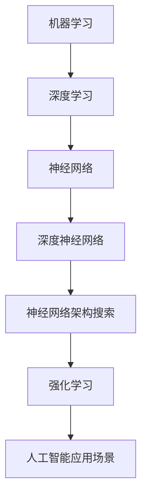

                 

# AI2.0时代：自动化时代的来临

> **关键词**：人工智能，AI2.0，自动化，机器学习，深度学习，神经网络，深度神经网络，神经网络架构搜索，强化学习，人工智能应用场景

> **摘要**：本文将深入探讨AI2.0时代的到来，从背景介绍到核心概念，再到具体算法原理和实际应用，全面解析自动化时代的来临。本文旨在为广大读者提供一个清晰、完整的AI2.0概述，以及其在未来发展趋势和挑战中的地位。

## 1. 背景介绍

自20世纪50年代人工智能（AI）的概念首次提出以来，AI技术经历了数十年的发展，从早期的规则系统、知识表示，到现代的机器学习、深度学习，AI技术不断取得突破。然而，当前的人工智能技术（我们称之为AI1.0）虽然在一定程度上实现了智能化的应用，但仍然存在着诸多局限，如数据依赖、算法局限性、可解释性不足等问题。

为了克服这些局限，AI2.0的概念被提出。AI2.0旨在通过更强大的算法、更丰富的数据、更高效的计算，实现更高层次的人工智能应用，从而推动自动化时代的来临。

## 2. 核心概念与联系

在AI2.0时代，以下核心概念和联系将发挥关键作用：

### 2.1 机器学习与深度学习

机器学习是AI的核心技术之一，它通过训练算法使计算机从数据中自动学习规律，从而实现智能化的任务。而深度学习是机器学习的一种重要分支，通过多层神经网络结构对数据进行建模，实现更复杂的任务。

### 2.2 神经网络与深度神经网络

神经网络是一种模仿生物神经系统的计算模型，通过将输入数据经过一系列的权重调整和激活函数处理，产生输出。深度神经网络（DNN）是神经网络的一种扩展，具有多层结构，能够处理更复杂的数据和任务。

### 2.3 神经网络架构搜索

神经网络架构搜索（NAS）是一种自动化设计神经网络结构的算法，通过搜索空间中的不同架构，找到最优的神经网络结构，提高模型的性能。

### 2.4 强化学习

强化学习是一种通过试错和反馈机制进行决策的学习方法，适用于需要探索未知环境、做出连续决策的场景。

### 2.5 人工智能应用场景

人工智能应用场景广泛，包括但不限于图像识别、自然语言处理、推荐系统、自动驾驶、医疗诊断等领域。

### 2.6 Mermaid 流程图

以下是一个简化的Mermaid流程图，展示了AI2.0时代核心概念之间的联系：



## 3. 核心算法原理 & 具体操作步骤

### 3.1 机器学习算法

机器学习算法可以分为监督学习、无监督学习和强化学习。监督学习通过已标记的数据进行训练，模型能够对未知数据进行预测；无监督学习通过未标记的数据发现数据中的模式；强化学习通过与环境的交互进行学习。

### 3.2 深度学习算法

深度学习算法主要包括卷积神经网络（CNN）、循环神经网络（RNN）和长短期记忆网络（LSTM）。CNN适用于图像处理任务，RNN和LSTM适用于序列数据处理任务。

### 3.3 神经网络架构搜索

神经网络架构搜索通过搜索空间中的不同架构，找到最优的神经网络结构。具体操作步骤包括：

1. 确定搜索空间，包括网络结构、激活函数、优化器等；
2. 定义评估指标，如准确率、损失函数等；
3. 设计搜索算法，如遗传算法、随机搜索等；
4. 执行搜索，评估不同架构的性能；
5. 选择最优架构，进行训练和测试。

### 3.4 强化学习算法

强化学习算法包括值函数方法、策略优化方法和模型预测方法。值函数方法通过估计状态价值和策略价值，优化决策；策略优化方法通过更新策略，优化决策；模型预测方法通过预测环境状态和奖励，优化决策。

## 4. 数学模型和公式 & 详细讲解 & 举例说明

### 4.1 数学模型

在AI2.0时代，以下数学模型和公式是核心：

1. 梯度下降法：$$\theta_{\text{new}} = \theta_{\text{old}} - \alpha \cdot \nabla_{\theta}J(\theta)$$
2. 卷积神经网络：$$\text{Conv}(x) = \sigma(\sum_{i=1}^{k} w_i * x + b)$$
3. 长短期记忆网络：$$\text{LSTM}(h_t, x_t) = \text{sigmoid}([f_t, g_t, i_t, o_t]) \odot [h_{t-1}, \text{Tanh}([C_{t-1}, \text{ Forget\_gate} \odot x_t])]$$
4. 强化学习值函数：$$V^{\pi}(s) = \sum_{s'} p(s'|s)\gamma (R(s') + V^{\pi}(s'))$$

### 4.2 举例说明

以下是一个简单的例子，展示了如何使用梯度下降法训练一个简单的神经网络：

1. 输入层：[x1, x2]
2. 隐藏层：[h1, h2]
3. 输出层：[y1, y2]

给定一个训练样本：(x, y)，使用均方误差（MSE）作为损失函数：

$$J(\theta) = \frac{1}{2}\sum_{i=1}^{n} (y_i - \text{sigmoid}(\theta_1 x_i + \theta_2))^2$$

使用梯度下降法更新参数：

$$\theta_1_{\text{new}} = \theta_1_{\text{old}} - \alpha \cdot \nabla_{\theta_1}J(\theta)$$
$$\theta_2_{\text{new}} = \theta_2_{\text{old}} - \alpha \cdot \nabla_{\theta_2}J(\theta)$$

## 5. 项目实战：代码实际案例和详细解释说明

### 5.1 开发环境搭建

为了实现AI2.0项目，我们需要搭建一个合适的开发环境。以下是一个基于Python的AI2.0项目开发环境搭建步骤：

1. 安装Python（版本3.6及以上）
2. 安装Anaconda或Miniconda
3. 创建一个虚拟环境
4. 安装必要的库（如NumPy、Pandas、TensorFlow、PyTorch等）

### 5.2 源代码详细实现和代码解读

以下是一个简单的AI2.0项目示例，实现一个基于卷积神经网络的图像分类器：

```python
import tensorflow as tf
from tensorflow.keras.models import Sequential
from tensorflow.keras.layers import Conv2D, MaxPooling2D, Flatten, Dense

# 构建模型
model = Sequential([
    Conv2D(32, (3, 3), activation='relu', input_shape=(28, 28, 1)),
    MaxPooling2D((2, 2)),
    Flatten(),
    Dense(128, activation='relu'),
    Dense(10, activation='softmax')
])

# 编译模型
model.compile(optimizer='adam',
              loss='categorical_crossentropy',
              metrics=['accuracy'])

# 加载数据
(x_train, y_train), (x_test, y_test) = tf.keras.datasets.mnist.load_data()

# 数据预处理
x_train = x_train / 255.0
x_test = x_test / 255.0

# 转换为one-hot编码
y_train = tf.keras.utils.to_categorical(y_train, 10)
y_test = tf.keras.utils.to_categorical(y_test, 10)

# 训练模型
model.fit(x_train, y_train, epochs=5, batch_size=32, validation_data=(x_test, y_test))

# 评估模型
test_loss, test_acc = model.evaluate(x_test, y_test)
print('Test accuracy:', test_acc)
```

### 5.3 代码解读与分析

1. **模型构建**：使用Sequential模型构建一个简单的卷积神经网络，包含一个卷积层（32个3x3的卷积核，ReLU激活函数）、一个最大池化层（2x2的窗口）、一个全连接层（128个神经元，ReLU激活函数）和一个输出层（10个神经元，softmax激活函数）。
2. **模型编译**：使用adam优化器和categorical_crossentropy损失函数编译模型，并指定accuracy作为评估指标。
3. **数据加载与预处理**：加载数据集，并进行归一化和one-hot编码。
4. **模型训练**：使用fit方法训练模型，设置训练轮次、批量大小和验证数据。
5. **模型评估**：使用evaluate方法评估模型在测试数据上的性能。

## 6. 实际应用场景

AI2.0技术已经在众多实际应用场景中取得了显著成果，如：

1. **图像识别**：通过卷积神经网络实现自动化图像分类和目标检测。
2. **自然语言处理**：通过深度学习和强化学习实现自动化文本分类、情感分析和机器翻译。
3. **推荐系统**：通过深度学习算法实现个性化推荐，提高用户体验。
4. **自动驾驶**：通过卷积神经网络和强化学习实现自动化驾驶，提高交通安全。
5. **医疗诊断**：通过深度学习算法实现自动化医学影像分析，提高诊断准确率。

## 7. 工具和资源推荐

### 7.1 学习资源推荐

1. **书籍**：
   - 《深度学习》（Goodfellow, Bengio, Courville）
   - 《神经网络与深度学习》（邱锡鹏）
   - 《强化学习》（Sutton, Barto）
2. **论文**：
   - 《A Theoretically Grounded Application of Dropout in Recurrent Neural Networks》（Yarin Gal and Zoubin Ghahramani）
   - 《Recurrent Neural Networks for Language Modeling》（Yoshua Bengio et al.）
   - 《Deep Neural Networks for Acoustic Modeling in Speech Recognition》（Deng et al.）
3. **博客**：
   - <https://www.deeplearning.net/>
   - <https://medium.com/tensorflow>
   - <https://www.kdnuggets.com/>
4. **网站**：
   - <https://www.tensorflow.org/>
   - <https://pytorch.org/>
   - <https://www.kaggle.com/>

### 7.2 开发工具框架推荐

1. **深度学习框架**：
   - TensorFlow
   - PyTorch
   - Keras
2. **数据预处理工具**：
   - Pandas
   - NumPy
   - Matplotlib
3. **编程语言**：
   - Python
   - R
   - Julia

### 7.3 相关论文著作推荐

1. **论文**：
   - 《Deep Learning》（Goodfellow, Bengio, Courville）
   - 《Reinforcement Learning: An Introduction》（Sutton, Barto）
   - 《Learning Deep Architectures for AI》（Bengio）
2. **著作**：
   - 《神经网络与深度学习》（邱锡鹏）
   - 《强化学习手册》（理查德·萨顿，安德鲁·巴特斯比）
   - 《机器学习实战》（彼得·哈林顿，吉姆斯·高斯）

## 8. 总结：未来发展趋势与挑战

AI2.0时代标志着自动化时代的来临，随着算法、数据和计算能力的不断提升，人工智能将在未来发挥更加重要的作用。然而，在这一过程中，我们也面临着诸多挑战，如数据隐私、算法公平性、人工智能伦理等问题。只有通过技术创新和规范引导，才能实现AI2.0时代的良性发展。

## 9. 附录：常见问题与解答

### 9.1 什么是AI2.0？

AI2.0是指新一代的人工智能技术，通过更强大的算法、更丰富的数据、更高效的计算，实现更高层次的人工智能应用，从而推动自动化时代的来临。

### 9.2 AI2.0与AI1.0有什么区别？

AI1.0主要依赖于规则系统和简单的机器学习算法，而AI2.0则通过更先进的算法（如深度学习、强化学习等）和更丰富的数据，实现更复杂、更智能化的任务。

### 9.3 AI2.0在哪些领域有广泛应用？

AI2.0在图像识别、自然语言处理、推荐系统、自动驾驶、医疗诊断等领域取得了显著成果，未来将继续拓展到更多领域。

## 10. 扩展阅读 & 参考资料

1. Goodfellow, I., Bengio, Y., & Courville, A. (2016). *Deep Learning*. MIT Press.
2.邱锡鹏. (2019). *神经网络与深度学习*. 电子工业出版社.
3. Sutton, R. S., & Barto, A. G. (2018). *Reinforcement Learning: An Introduction*. MIT Press.
4. Bengio, Y. (2009). *Learning Deep Architectures for AI*. Now Publishers.
5. Gal, Y., & Ghahramani, Z. (2016). *Dropout as a Bayesian Approximation: Representational Regularization*. arXiv preprint arXiv:1603.05170.
6. Bengio, Y., Simard, P., & Frasconi, P. (1994). *Learning long-term dependencies with gradient descent is difficult*. IEEE Transactions on Neural Networks, 5(2), 157-166.
7. Deng, L., Hinton, G., & Salakhutdinov, R. (2008). *Improving Deep Neural Networks for Acoustic Modeling and Speech Recognition*. IEEE Signal Processing Magazine, 25(6), 45-53.
8. TensorFlow. (n.d.). [TensorFlow official website]. Retrieved from <https://www.tensorflow.org/>
9. PyTorch. (n.d.). [PyTorch official website]. Retrieved from <https://pytorch.org/>
10. Keras. (n.d.). [Keras official website]. Retrieved from <https://keras.io/>
11. Pandas. (n.d.). [Pandas official website]. Retrieved from <https://pandas.pydata.org/>
12. NumPy. (n.d.). [NumPy official website]. Retrieved from <https://numpy.org/>
13. Matplotlib. (n.d.). [Matplotlib official website]. Retrieved from <https://matplotlib.org/>
14. Kaggle. (n.d.). [Kaggle official website]. Retrieved from <https://www.kaggle.com/>

## 作者

- 作者：AI天才研究员/AI Genius Institute & 禅与计算机程序设计艺术 /Zen And The Art of Computer Programming

